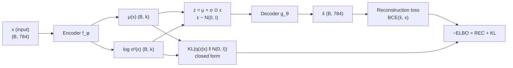
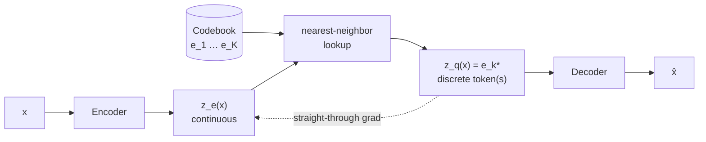
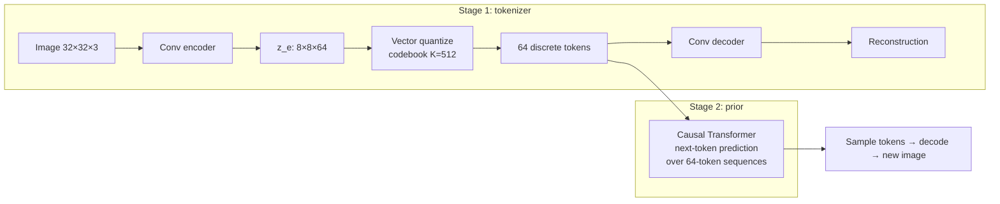

# 2.11 — Autoencoders & VAEs

## 1. Overview

**What is it?** An **autoencoder (AE)** is a neural network trained to reproduce its own input after squeezing it through a low-dimensional **bottleneck**: an *encoder* compresses the input into a compact latent code, and a *decoder* reconstructs the input from that code. A **variational autoencoder (VAE)** upgrades the deterministic bottleneck to a *probability distribution*, turning the compressor into a genuine **generative model** you can sample new data from.

**Why does it exist?** Most of the world's data is unlabeled. Autoencoders extract useful representations from raw data with no labels at all — the reconstruction task *is* the supervision. VAEs go further: they were one of the first principled answers to "how do we make a neural network that can *generate* realistic data?", with a training objective derived rigorously from probability theory.

**What problem does it solve?** Dimensionality reduction (a nonlinear, learnable generalization of PCA), denoising, anomaly detection (poor reconstruction signals abnormality), compression, and generation. The VAE's smooth, structured latent space also enables interpolation and controllable synthesis.

**Where is it used?** Everywhere modern generative AI operates in "latent space": Stable Diffusion runs its diffusion process inside a VAE's latent space rather than on raw pixels (see [Diffusion Models](../phase-4-cv/04-diffusion-models.md)); VQ-VAE-style discrete codes tokenize images and audio for autoregressive Transformers; neural audio codecs (Meta's EnCodec, Google's SoundStream) compress speech; and reconstruction-error anomaly detectors watch factory lines and network traffic in production today.

## 2. Learning Objectives

After this chapter you will be able to:

- Explain the encoder–bottleneck–decoder structure and why the bottleneck forces representation learning.
- Relate a linear autoencoder to PCA and explain what nonlinearity adds.
- Describe **denoising** and **sparse** autoencoders and the regularization role of each.
- Derive the **ELBO** (evidence lower bound) step by step, from marginal likelihood to reconstruction + KL.
- Explain why the **reparameterization trick** is needed and apply it correctly.
- Write down the closed-form KL divergence between a diagonal Gaussian and $\mathcal{N}(0, I)$ and derive it.
- Implement and train a VAE on MNIST in PyTorch, then sample and interpolate in latent space.
- Explain **posterior collapse** and its remedies (KL annealing, free bits, $\beta$-VAE).
- Describe **VQ-VAE**: codebook lookup, straight-through estimator, commitment loss, and why discrete latents matter for LLM-style generation.
- Build a reconstruction-based anomaly detector and choose a threshold properly.
- Explain why VAE samples look blurry and how latent diffusion sidesteps this.

## 3. Prerequisites

| Chapter | Why you need it |
|---|---|
| [Linear Algebra](../phase-0-prerequisites/02-linear-algebra.md) | Latent spaces, projections, and the PCA connection. |
| [Probability & Statistics](../phase-0-prerequisites/04-probability-statistics.md) | Gaussians, expectations, Bayes' rule, and KL divergence — the VAE is applied probability. |
| [Perceptron & MLP](01-perceptron-mlp.md) | Encoder and decoder are ordinary MLPs (or CNNs). |
| [Backpropagation](02-backpropagation.md) | The reparameterization trick exists solely to make sampling backprop-friendly. |
| [Loss Functions](04-loss-functions.md) | Reconstruction terms are MSE or binary cross-entropy. |
| [Regularization for Deep Learning](06-regularization-dl.md) | The KL term and sparsity penalties are regularizers on the latent code. |
| [CNN](07-cnn.md) | Practical image autoencoders use convolutional encoders/decoders. |

## 4. Intuition

**The summarization game.** Imagine you must describe a face over the phone using only 20 numbers, and your friend must redraw it. You cannot transmit pixels — you must transmit *concepts*: "roundish face, short dark hair, glasses, smiling…". If your friend's drawings consistently look right, your 20 numbers have captured what matters about faces. That is an autoencoder: the phone call is the bottleneck, your description scheme is the encoder, your friend is the decoder, and the drawing error is the training loss. Compression forces understanding.

**Why the VAE's twist matters.** The plain autoencoder assigns each face *one point* in the 20-number space, but says nothing about the space *between* points — decode a random location and you may get garbage. The VAE instead makes each face claim a small *fuzzy region* (a Gaussian) rather than a point, and adds a rule that all regions must huddle near the origin, overlapping like a well-packed suitcase. Now the space has no holes: every location decodes to something plausible, and walking a straight line from one face's region to another's yields a smooth morph. That single change — points become distributions, plus a "stay organized" penalty — converts a compressor into a generator.

**An everyday story.** A quality inspector who has seen ten thousand normal engine parts can redraw any normal part from memory, but asked to redraw a *defective* part — something outside everything she has internalized — her reconstruction misses exactly the defect. Reconstruction error as an anomaly alarm: that is the autoencoder anomaly detector deployed in real factories.

## 5. Real-world Motivation

- **Stability AI / Stable Diffusion:** the flagship open image generator does not diffuse pixels. A VAE (the "latent VAE", downsampling 512×512×3 images to 64×64×4 latents — a 48× compression) defines the workspace; the diffusion model operates entirely inside it. This design, from the Latent Diffusion paper, is why Stable Diffusion runs on consumer GPUs (details in [Diffusion Models](../phase-4-cv/04-diffusion-models.md)).
- **Meta** built **EnCodec**, a VQ-style neural audio codec compressing speech/music to a few kbps, and uses discrete audio tokens as the interface for generative audio models.
- **Google/DeepMind** built **SoundStream** (neural codec behind Lyra) and pioneered **VQ-VAE**, whose discrete-token idea underlies image tokenizers used by autoregressive media generators.
- **OpenAI** used VQ-VAE-style discrete latents in Jukebox (music generation) and a discrete VAE in the original DALL·E to turn images into token sequences a Transformer could model.
- **Amazon and industrial players** ship reconstruction-error anomaly detection for manufacturing visual inspection and time-series monitoring, where labeled defect data is scarce but normal data is abundant — exactly the autoencoder's home turf.

## 6. Mathematical Foundations

### 6.1 Notation

| Symbol | Meaning |
|---|---|
| $x \in \mathbb{R}^{D}$ | data point (e.g. a flattened 784-pixel MNIST image) |
| $z \in \mathbb{R}^{k}$ | latent code, $k \ll D$ |
| $f_\phi$ | encoder network with parameters $\phi$ |
| $g_\theta$ | decoder network with parameters $\theta$ |
| $p(z)$ | prior over latents, chosen as $\mathcal{N}(0, I)$ |
| $p_\theta(x \mid z)$ | decoder's likelihood of data given a latent |
| $q_\phi(z \mid x)$ | encoder's approximate posterior |
| $\mu(x), \sigma^2(x)$ | mean and variance output by the VAE encoder |
| $D_{\mathrm{KL}}(q \,\|\, p)$ | Kullback–Leibler divergence $\mathbb{E}_q[\log q - \log p] \ge 0$ |

### 6.2 The plain autoencoder

Train encoder and decoder jointly to minimize reconstruction error:

$$
\mathcal{L}_{\text{AE}}(\phi, \theta) = \frac{1}{N}\sum_{i=1}^{N} \big\| x_i - g_\theta(f_\phi(x_i)) \big\|^2 .
$$

If $f$ and $g$ are **linear** and the loss is MSE, the optimal solution spans the same subspace as **PCA**'s top-$k$ principal components — the autoencoder is PCA's nonlinear generalization. The bottleneck $k < D$ is essential: with $k \ge D$ and enough capacity, the network can learn the identity map and nothing useful.

**Denoising autoencoder (DAE):** corrupt the input ($\tilde{x} = x + \varepsilon$, or randomly zero pixels) but reconstruct the *clean* target:

$$
\mathcal{L}_{\text{DAE}} = \mathbb{E}\big[\|x - g_\theta(f_\phi(\tilde{x}))\|^2\big].
$$

The network cannot copy; it must learn the structure of the data manifold to *restore* it. (BERT's masked-language-model objective — covered in [BERT](../phase-3-nlp-llm/04-bert.md) — is a denoising autoencoder over text.)

**Sparse autoencoder:** allow a wide hidden layer but penalize activation frequency, e.g. a KL penalty pushing each unit's mean activation $\hat{\rho}_j$ toward a small target $\rho$ (say 0.05):

$$
\mathcal{L}_{\text{sparse}} = \mathcal{L}_{\text{AE}} + \lambda \sum_{j=1}^{k} \Big[ \rho \log\tfrac{\rho}{\hat{\rho}_j} + (1-\rho)\log\tfrac{1-\rho}{1-\hat{\rho}_j} \Big].
$$

Each input activates few units, yielding interpretable, part-like features — the same idea used today to interpret LLM internals with sparse autoencoders.

### 6.3 The VAE and the ELBO, derived step by step

We want a generative model: sample $z \sim p(z) = \mathcal{N}(0, I)$, decode $x \sim p_\theta(x \mid z)$. Training should maximize the marginal likelihood of the data:

$$
\log p_\theta(x) = \log \int p_\theta(x \mid z)\, p(z)\, dz .
$$

This integral over all of latent space is intractable, and so is the true posterior $p_\theta(z \mid x)$. The VAE's move: introduce a tractable approximate posterior $q_\phi(z \mid x)$ (the encoder) and derive a lower bound.

**Step 1.** Multiply and divide by $q_\phi(z \mid x)$ inside the integral:

$$
\log p_\theta(x) = \log \int q_\phi(z \mid x)\, \frac{p_\theta(x \mid z)\, p(z)}{q_\phi(z \mid x)}\, dz = \log\, \mathbb{E}_{z \sim q_\phi(z|x)}\!\left[ \frac{p_\theta(x \mid z)\, p(z)}{q_\phi(z \mid x)} \right].
$$

**Step 2.** Apply Jensen's inequality ($\log$ is concave, so $\log \mathbb{E}[\cdot] \ge \mathbb{E}[\log(\cdot)]$):

$$
\log p_\theta(x) \;\ge\; \mathbb{E}_{q_\phi(z|x)}\!\left[ \log p_\theta(x \mid z) + \log p(z) - \log q_\phi(z \mid x) \right].
$$

**Step 3.** Group the last two terms into a KL divergence:

$$
\boxed{\;\log p_\theta(x) \;\ge\; \underbrace{\mathbb{E}_{q_\phi(z|x)}\big[\log p_\theta(x \mid z)\big]}_{\text{reconstruction}} \;-\; \underbrace{D_{\mathrm{KL}}\big(q_\phi(z \mid x)\,\|\,p(z)\big)}_{\text{regularization}} \;=\; \text{ELBO}\;}
$$

**How tight is the bound?** An exact identity (obtainable by adding and subtracting $\log p_\theta(z|x)$) shows

$$
\log p_\theta(x) = \text{ELBO} + D_{\mathrm{KL}}\big(q_\phi(z \mid x)\,\|\,p_\theta(z \mid x)\big),
$$

so the gap is exactly the mismatch between the approximate and true posterior. Maximizing the ELBO simultaneously raises the likelihood and pulls $q_\phi$ toward the true posterior. Training minimizes $-\text{ELBO}$: a reconstruction loss (BCE or MSE — see [Loss Functions](04-loss-functions.md)) plus a KL penalty keeping every posterior near $\mathcal{N}(0, I)$, which is what packs the latent space without holes.

### 6.4 Closed-form KL term

With $q_\phi(z|x) = \mathcal{N}(\mu, \operatorname{diag}(\sigma^2))$ and $p(z) = \mathcal{N}(0, I)$, integrating the Gaussian densities termwise gives, per dimension $j$, $\tfrac{1}{2}(\mu_j^2 + \sigma_j^2 - \log\sigma_j^2 - 1)$, hence:

$$
D_{\mathrm{KL}} = \frac{1}{2} \sum_{j=1}^{k} \left( \mu_j^2 + \sigma_j^2 - \log \sigma_j^2 - 1 \right).
$$

Sanity checks: it is zero iff $\mu = 0, \sigma = 1$ (posterior equals prior); it punishes means far from the origin and variances far from 1 in either direction. In code the encoder outputs $\log \sigma^2$ (any real number, numerically stable) rather than $\sigma$ itself.

### 6.5 The reparameterization trick

The ELBO's reconstruction term is an expectation over $z \sim q_\phi(z|x)$ — we estimate it by *sampling*. But "sample from a distribution whose parameters we're optimizing" is not differentiable: gradients cannot flow through a random draw into $\mu$ and $\sigma$. The fix rewrites the sample as a **deterministic, differentiable function** of the parameters plus independent noise:

$$
z = \mu(x) + \sigma(x) \odot \epsilon, \qquad \epsilon \sim \mathcal{N}(0, I).
$$

This has exactly the distribution $\mathcal{N}(\mu, \operatorname{diag}(\sigma^2))$, but now $\partial z / \partial \mu = 1$ and $\partial z / \partial \sigma = \epsilon$ are well-defined — the randomness has been moved into an input, $\epsilon$, that carries no parameters. Backprop flows: decoder → $z$ → $\mu, \sigma$ → encoder. Without the trick you would need high-variance score-function (REINFORCE) estimators; the reparameterized gradient is what made VAEs practical.

### 6.6 $\beta$-VAE and posterior collapse

The $\beta$-VAE scales the KL term: $\mathcal{L} = -\mathbb{E}[\log p_\theta(x|z)] + \beta D_{\mathrm{KL}}$. Larger $\beta$ ($>1$) enforces a more factorized, often more *disentangled* latent space at the cost of reconstruction quality. The opposite pathology is **posterior collapse**: if the decoder is powerful enough to model $x$ while ignoring $z$ (common with autoregressive decoders), the optimizer happily drives $q_\phi(z|x) \to p(z)$, zeroing the KL — latents become useless. Remedies: **KL annealing** (ramp the KL weight from 0 over early training), **free bits** (per-dimension floor $\max(D_{\mathrm{KL}, j}, \lambda)$ so the first nats of information are free), and weakening the decoder.

### 6.7 VQ-VAE: discrete latents

VQ-VAE replaces the Gaussian bottleneck with a **codebook** $\{e_1, \dots, e_K\} \subset \mathbb{R}^{k}$. The encoder output $z_e(x)$ is snapped to its nearest codebook vector:

$$
z_q(x) = e_{k^\*}, \qquad k^\* = \arg\min_j \|z_e(x) - e_j\|_2 .
$$

Argmin is non-differentiable, so training uses the **straight-through estimator** — gradients are copied from $z_q$ back to $z_e$ as if the quantization were the identity — plus two auxiliary terms:

$$
\mathcal{L} = \underbrace{\|x - g_\theta(z_q)\|^2}_{\text{reconstruction}} + \underbrace{\|\,\text{sg}[z_e] - e\,\|^2}_{\text{codebook loss}} + \beta\, \underbrace{\|\,z_e - \text{sg}[e]\,\|^2}_{\text{commitment loss}},
$$

where $\text{sg}[\cdot]$ is stop-gradient: the codebook loss moves code vectors toward encoder outputs; the commitment loss (typical $\beta = 0.25$) keeps the encoder from drifting away from its codes. The payoff: an image becomes a **grid of discrete tokens** (e.g. 32×32 indices into a 8192-entry codebook), which an autoregressive [Transformer](10-transformer.md) can model exactly like text — the recipe behind DALL·E 1, Jukebox, and modern audio codecs.

## 7. Visual Explanation

VAE architecture and loss flow:



Latent-space geometry — AE vs VAE (why only the VAE generates):

```
   Plain AE latent space              VAE latent space
   (points, with holes)              (overlapping fuzzy blobs near 0)

     •       •                            (( • ))
        ?         •                    (( • ))(( • ))
     •      ?                            (( • ))(( • ))
          •                                 (( • ))

   decode "?" → garbage             decode anywhere → plausible sample
```

VQ-VAE bottleneck:



## 8. Algorithm

**One VAE training step:**

1. Sample a minibatch $x$ of size $B$.
2. Encode: $(\mu, \log\sigma^2) = f_\phi(x)$, each of shape $(B, k)$.
3. Sample noise $\epsilon \sim \mathcal{N}(0, I)$, shape $(B, k)$.
4. Reparameterize: $z = \mu + e^{\frac{1}{2}\log\sigma^2} \odot \epsilon$.
5. Decode: $\hat{x} = g_\theta(z)$.
6. Compute loss: $\mathcal{L} = \text{BCE}(\hat{x}, x) + \frac{1}{2}\sum_j (\mu_j^2 + \sigma_j^2 - \log\sigma_j^2 - 1)$, summed then averaged over the batch.
7. Backpropagate through decoder, $z$, and encoder (the trick makes step 4 differentiable); update $\phi, \theta$ with Adam.

```text
function vae_step(x):
    μ, logσ² ← encoder(x)                     # (B, k) each
    ε ← sample_standard_normal(B, k)
    z ← μ + exp(0.5 · logσ²) ⊙ ε             # reparameterization
    x̂ ← decoder(z)
    rec ← BCE(x̂, x, reduction="sum") / B     # reconstruction (per sample)
    kl  ← −0.5 · Σ(1 + logσ² − μ² − exp(logσ²)) / B
    loss ← rec + β · kl                       # β = 1 for vanilla VAE
    backprop(loss); adam_update(φ, θ)

function generate(n):
    z ← sample_standard_normal(n, k)          # prior, NOT the encoder
    return decoder(z)
```

## 9. Worked Example

### 9.1 Tiny example by hand

Take latent dimension $k = 2$. For one input, the encoder outputs $\mu = (1.0,\, -0.5)$ and $\log\sigma^2 = (0,\, -1.0)$, so $\sigma = (e^{0/2}, e^{-1/2}) = (1.0,\, 0.6065)$.

**Reparameterization.** Draw $\epsilon = (0.3,\, -1.2)$. Then

$$
z = \mu + \sigma \odot \epsilon = (1.0 + 1.0 \cdot 0.3,\; -0.5 + 0.6065 \cdot (-1.2)) = (1.30,\; -1.2278).
$$

**KL term.** Per dimension, $\tfrac12(\mu_j^2 + \sigma_j^2 - \log\sigma_j^2 - 1)$:

- Dim 1: $\tfrac12(1.0 + 1.0 - 0 - 1) = 0.5$.
- Dim 2: $\tfrac12(0.25 + e^{-1} - (-1) - 1) = \tfrac12(0.25 + 0.3679 + 1 - 1) = 0.3089$.

Total $D_{\mathrm{KL}} = 0.8089$ nats. If the decoder then reconstructs a 4-pixel input $x = (1, 0, 1, 1)$ as $\hat{x} = (0.9, 0.2, 0.8, 0.7)$, the BCE reconstruction loss is

$$
-[\ln 0.9 + \ln 0.8 + \ln 0.8 + \ln 0.7] = 0.1054 + 0.2231 + 0.2231 + 0.3567 = 0.9083,
$$

so the total loss for this sample is $0.9083 + 0.8089 = 1.7172$ nats. Gradients flow into $\mu$ directly and into $\sigma$ scaled by $\epsilon$ — exactly what the trick guarantees.

### 9.2 Realistic scale

A standard MNIST VAE ($784 \to 400 \to k{=}20 \to 400 \to 784$, ~650k parameters) trains in ~10 epochs on CPU to a total loss of ~100 nats/image (roughly 95 reconstruction + 8 KL). With $k = 2$ you can plot the latent space directly: digits organize into contiguous regions, and decoding a straight line from a "3" to an "8" produces a smooth morph through plausible intermediate digits — the visual proof that the KL term worked.

## 10. Python from Scratch

A minimal NumPy VAE — encoder, reparameterization, decoder, ELBO loss, and manual gradients for the loss layer — to make the machinery concrete (single hidden layer each side; MNIST-shaped inputs):

```python
import numpy as np

rng = np.random.default_rng(0)
D, H, K = 784, 200, 10          # input, hidden, latent dims

def init(shape):                # small random init, scaled by fan-in
    return rng.standard_normal(shape) * np.sqrt(1.0 / shape[0])

# Encoder params: x -> h -> (mu, logvar).  Decoder: z -> h -> x_hat.
W1, b1   = init((D, H)), np.zeros(H)
Wmu, bmu = init((H, K)), np.zeros(K)
Wlv, blv = init((H, K)), np.zeros(K)
W2, b2   = init((K, H)), np.zeros(H)
W3, b3   = init((H, D)), np.zeros(D)

def sigmoid(a): return 1.0 / (1.0 + np.exp(-a))

def forward(x):
    """x: (B, 784) in [0,1]. Returns everything needed for loss + backprop."""
    h_enc = np.tanh(x @ W1 + b1)          # (B, H) encoder hidden
    mu    = h_enc @ Wmu + bmu             # (B, K) posterior mean
    logvar = h_enc @ Wlv + blv            # (B, K) posterior log-variance
    eps   = rng.standard_normal(mu.shape)
    z     = mu + np.exp(0.5 * logvar) * eps   # reparameterization trick
    h_dec = np.tanh(z @ W2 + b2)          # (B, H) decoder hidden
    x_hat = sigmoid(h_dec @ W3 + b3)      # (B, 784) Bernoulli means
    return h_enc, mu, logvar, eps, z, h_dec, x_hat

def loss_and_grads_at_output(x, mu, logvar, x_hat):
    """ELBO loss + the two hand-derived gradients that matter conceptually."""
    B = x.shape[0]
    # Reconstruction: Bernoulli negative log-likelihood (BCE), summed per image.
    rec = -np.sum(x * np.log(x_hat + 1e-9)
                  + (1 - x) * np.log(1 - x_hat + 1e-9)) / B
    # KL(q || N(0,I)) in closed form (Section 6.4), summed over K dims.
    kl = -0.5 * np.sum(1 + logvar - mu**2 - np.exp(logvar)) / B
    # Gradient of BCE+sigmoid wrt pre-sigmoid logits: the classic (x_hat - x).
    dlogits = (x_hat - x) / B                       # (B, D)
    # KL gradients wrt mu and logvar (differentiate Section 6.4 termwise):
    dmu_kl  = mu / B                                # ∂KL/∂μ = μ
    dlv_kl  = 0.5 * (np.exp(logvar) - 1) / B        # ∂KL/∂logσ² = ½(σ²−1)
    return rec + kl, dlogits, dmu_kl, dlv_kl

x = (rng.random((32, D)) > 0.5).astype(float)       # fake binary batch
h_enc, mu, logvar, eps, z, h_dec, x_hat = forward(x)
loss, dlogits, dmu_kl, dlv_kl = loss_and_grads_at_output(x, mu, logvar, x_hat)
print(round(loss, 1))    # ≈ 784·ln2 ≈ 543 + small KL at init (random data)
```

Key lines: the reparameterization makes `z` a deterministic function of `mu`, `logvar`, and parameter-free noise `eps`, so the chain rule from `x_hat` back to the encoder weights is ordinary backprop (`∂z/∂μ = 1`, `∂z/∂logvar = ½σε`). The KL gradients ($\mu$ and $\tfrac12(\sigma^2 - 1)$) act as a pull toward the prior. Complexity: $O(B(DH + HK))$ per pass.

> [!WARNING]
> **Common bug:** treating the encoder's second output as $\sigma$ and computing `z = mu + logvar * eps`. The network outputs $\log\sigma^2$; you must use `exp(0.5 * logvar)`. The symptom is NaNs or a KL that explodes, since nothing constrains a raw "sigma" head to be positive.

## 11. Library Implementation

A complete, trainable PyTorch VAE for MNIST:

```python
import torch, torch.nn as nn, torch.nn.functional as F
from torch.utils.data import DataLoader
from torchvision import datasets, transforms

class VAE(nn.Module):
    def __init__(self, d_in=784, d_h=400, d_z=20):
        super().__init__()
        self.enc = nn.Linear(d_in, d_h)
        self.mu  = nn.Linear(d_h, d_z)      # posterior mean head
        self.lv  = nn.Linear(d_h, d_z)      # posterior log-variance head
        self.dec1 = nn.Linear(d_z, d_h)
        self.dec2 = nn.Linear(d_h, d_in)

    def encode(self, x):
        h = F.relu(self.enc(x))
        return self.mu(h), self.lv(h)       # (B, 20), (B, 20)

    def reparameterize(self, mu, lv):
        std = torch.exp(0.5 * lv)           # σ = exp(½ logσ²) — always positive
        eps = torch.randn_like(std)         # ε ~ N(0, I), no gradient needed
        return mu + eps * std               # differentiable sample

    def decode(self, z):
        return torch.sigmoid(self.dec2(F.relu(self.dec1(z))))  # Bernoulli means

    def forward(self, x):
        mu, lv = self.encode(x.view(-1, 784))
        z = self.reparameterize(mu, lv)
        return self.decode(z), mu, lv

def vae_loss(x_hat, x, mu, lv):
    # Sum (not mean) over pixels/dims so the REC:KL balance matches the ELBO.
    rec = F.binary_cross_entropy(x_hat, x.view(-1, 784), reduction="sum")
    kl  = -0.5 * torch.sum(1 + lv - mu.pow(2) - lv.exp())
    return (rec + kl) / x.size(0)           # average per image

model = VAE(); opt = torch.optim.Adam(model.parameters(), lr=1e-3)
loader = DataLoader(datasets.MNIST("data", train=True, download=True,
                    transform=transforms.ToTensor()), batch_size=128, shuffle=True)

for epoch in range(10):
    for x, _ in loader:                     # labels unused: unsupervised!
        x_hat, mu, lv = model(x)
        loss = vae_loss(x_hat, x, mu, lv)
        opt.zero_grad(); loss.backward(); opt.step()
    print(f"epoch {epoch}: loss/image ≈ {loss.item():.1f}")   # → ~100 nats

with torch.no_grad():                       # generation: sample the PRIOR
    samples = model.decode(torch.randn(64, 20))   # (64, 784) new digits
```

For production latent spaces, load Stable Diffusion's pretrained VAE from `diffusers` (`AutoencoderKL.from_pretrained("stabilityai/sd-vae-ft-mse")`) — `encode` returns a latent distribution, `decode` maps 64×64×4 latents back to 512×512×3 images.

## 12. Code Walkthrough

Tracing the PyTorch VAE on one batch ($B = 128$, MNIST):

| Tensor | Shape | Meaning |
|---|---|---|
| `x` | (128, 1, 28, 28) | input images in $[0, 1]$ |
| `x.view(-1, 784)` | (128, 784) | flattened pixels |
| `mu`, `lv` | (128, 20) | posterior mean and log-variance per image |
| `std`, `eps`, `z` | (128, 20) | scale, noise, and reparameterized latent |
| `x_hat` | (128, 784) | reconstructed Bernoulli means in $(0, 1)$ |
| `rec` | scalar | summed BCE, ~95 per image after training |
| `kl` | scalar | ~5–10 nats per image after training |

**Inputs:** images scaled to $[0,1]$ (required for BCE). **Outputs:** reconstructions plus $(\mu, \log\sigma^2)$; at generation time, decoded samples of prior draws. **Expected results:** epoch-0 loss ~540 falling to ~100 nats/image by epoch 10; recognizable reconstructions after 1–2 epochs; prior samples recognizable but noticeably **blurrier** than real digits (Section 15 explains why). If KL falls to ~0 while reconstruction stays high, you are watching posterior collapse (Section 6.6).

## 13. Complexity Analysis

**Time.** An AE/VAE step is just two MLP/CNN passes: for MLP layers of widths $D \to H \to K \to H \to D$, one forward+backward is $O(B(DH + HK))$ — the VAE adds only $O(BK)$ for reparameterization and KL, which is negligible. VQ-VAE adds the nearest-neighbor search $O(B \cdot P \cdot K_{\text{code}} \cdot k)$ for $P$ spatial positions and $K_{\text{code}}$ codebook entries — noticeable but rarely dominant. There is *no* attention-style quadratic blowup; autoencoders scale linearly in data size.

**Space.** Parameters $O(DH + HK)$; activations $O(B(D + H + K))$. The latent is tiny by construction ($k$ = 10–1024 typical). Inference-time generation requires only the decoder — half the model. For Stable Diffusion's VAE, the entire point is space: diffusion in $64 \times 64 \times 4 = 16{,}384$ latent dimensions instead of $512 \times 512 \times 3 = 786{,}432$ pixels cuts the diffusion model's attention/conv costs by ~48× per step.

## 14. Advantages

- **Learns from unlabeled data.** A factory with a million photos of good parts and thirty of defects can still train an excellent anomaly detector — labels never enter the loss.
- **Principled probabilistic objective.** The ELBO is a bona fide lower bound on log-likelihood; you can compare models in nats, importance-sample tighter bounds, and reason about the latent space mathematically — unlike GANs (next chapter), which have no likelihood at all.
- **Smooth, structured latent space.** Interpolation and attribute arithmetic work: morphing between MNIST digits, or between molecule embeddings in drug-discovery VAEs, yields plausible intermediates.
- **Stable, boring training.** One loss, one optimizer, no adversarial min-max games; a VAE nearly always converges — a sharp practical contrast with [GANs](12-gan.md).
- **Compression that downstream models build on.** Stable Diffusion (continuous VAE latents) and DALL·E 1/Jukebox/EnCodec (VQ-VAE tokens) show autoencoders as the *interface layer* of modern generative stacks.

## 15. Disadvantages

- **Blurry samples.** With a Gaussian/Bernoulli likelihood, the decoder's optimal prediction under uncertainty is the *mean* of all plausible outputs — averaging sharp possibilities yields blur. This is intrinsic to the objective, not a tuning failure; it is the main reason plain VAEs lost the image-quality race to GANs and diffusion.
- **Posterior collapse.** With powerful decoders the KL term can be driven to zero and latents ignored — the model degenerates into an unconditional density model. Requires explicit countermeasures (Section 6.6).
- **The ELBO is only a bound.** A better ELBO does not always mean better samples; likelihood and perceptual quality are famously misaligned.
- **Plain AEs don't generate.** Without the KL regularizer the latent space has holes; decoding random points fails. Failure case: teams ship an "AE generator" and get garbage — generation requires the VAE's prior matching.
- **Limited sample fidelity at high resolution.** Vanilla VAEs on 1024×1024 faces produce smudges; hierarchical VAEs (NVAE) or hybrid approaches are needed, at which point diffusion (see [Diffusion Models](../phase-4-cv/04-diffusion-models.md)) is usually the better tool.

## 16. Common Mistakes

- **Confusing $\sigma$, $\sigma^2$, and $\log\sigma^2$.** The encoder outputs $\log\sigma^2$; the sample uses $\exp(0.5\log\sigma^2)$. *Avoid:* name the variable `logvar` and grep for `exp(0.5`.
- **Sampling from the encoder at generation time.** New data comes from the **prior** $z \sim \mathcal{N}(0, I)$, not from encoding a training image. *Avoid:* a dedicated `generate()` that never touches the encoder.
- **`reduction="mean"` on BCE while summing KL.** Averaging over 784 pixels shrinks reconstruction 784× relative to KL — instant posterior collapse. *Avoid:* sum both per-sample, then average over the batch (as in Section 11).
- **Unnormalized inputs with a sigmoid+BCE decoder.** BCE requires targets in $[0,1]$. *Avoid:* `ToTensor()` scaling; for real-valued data use MSE/Gaussian likelihood instead.
- **No KL weight ramp with strong decoders.** Autoregressive/deep decoders collapse the posterior immediately. *Avoid:* KL annealing over the first epochs, or free bits.
- **VQ-VAE without stop-gradients.** Forgetting `sg[·]` in the codebook/commitment terms makes codebook training diverge or the encoder chase its own codes. *Avoid:* follow the three-term loss of Section 6.7 exactly; monitor codebook usage (dead codes are a red flag).
- **Judging a VAE only by reconstruction.** A perfect-reconstruction VAE with zero KL is a broken generator. *Avoid:* always inspect prior samples and the KL value, not just reconstructions.

## 17. Best Practices

- [ ] Track reconstruction and KL **separately** every epoch; healthy MNIST-scale runs settle around KL ≈ 5–15 nats with $k = 20$.
- [ ] Sum losses per sample (not per pixel) so the ELBO balance is correct; document your convention.
- [ ] Use KL annealing (linear 0→1 over the first ~10% of training) by default; add free bits for autoregressive decoders.
- [ ] Visualize three things regularly: reconstructions, prior samples, and (for $k = 2$ probes) the latent scatter colored by class.
- [ ] For images beyond MNIST, use convolutional encoders/decoders ([CNN](07-cnn.md)); strided conv down, transposed conv or upsample+conv up (the latter avoids checkerboard artifacts).
- [ ] For anomaly detection, set the threshold on a *validation set of normal data* (e.g. 99th percentile of reconstruction error) and report precision/recall at that operating point.
- [ ] For VQ-VAE: EMA codebook updates, monitor per-code usage, and restart dead codes from random encoder outputs.
- [ ] Prefer a pretrained latent VAE (`diffusers`' `AutoencoderKL`) over training your own when building latent-space generative pipelines.

## 18. Optimization Techniques

- **KL annealing / free bits** — the two standard collapse preventives; one line each to implement.
- **$\beta$-VAE sweeps** — treat $\beta$ as the knob trading reconstruction vs disentanglement/compression; sweep logarithmically (0.5–10).
- **Hierarchical latents (NVAE, VDVAE)** — multiple latent groups at multiple scales; state-of-the-art VAE image quality, at real engineering cost.
- **EMA codebook updates (VQ-VAE-2 style)** — replace the codebook loss with exponential-moving-average updates of code vectors; more stable, standard in production tokenizers.
- **Mixed precision + batching** — AE/VAE training is dense-matmul-bound and benefits fully from bf16 and large batches; no special stability issues.
- **Decoder-only deployment** — for generation or compression-decode services, ship only the decoder (half the parameters); for anomaly scoring, ship encoder+decoder but quantize to int8 — reconstruction error is robust to mild quantization.
- **Perceptual/adversarial reconstruction losses** — production image VAEs (including Stable Diffusion's) add LPIPS and a light adversarial loss to the ELBO's reconstruction term to fight blur.

## 19. Industry Applications

- **Latent diffusion (Stability AI, and the pattern across image/video generators):** a KL-regularized VAE compresses pixels 48×; diffusion runs in latent space; the VAE decoder renders the result. Every Stable Diffusion image you have seen passed through a VAE decoder.
- **Neural audio codecs:** Meta's **EnCodec** and Google's **SoundStream/Lyra** are VQ-style autoencoders streaming speech at a few kbps — deployed in real-time communication and as tokenizers for generative audio models.
- **Image tokenization for autoregressive models:** OpenAI's DALL·E 1 (discrete VAE) and Jukebox (VQ-VAE) turned images/audio into token sequences for Transformers — the conceptual bridge between this chapter and [the Transformer](10-transformer.md).
- **Industrial anomaly detection:** reconstruction-error detectors on the MVTec-AD benchmark mirror deployed systems for PCB inspection, textile defects, and predictive maintenance, where defect labels are too rare to train classifiers.
- **Recommender/embedding compression:** denoising autoencoders over interaction vectors produce compact user/item embeddings used in candidate-generation layers at large e-commerce platforms.
- **Drug discovery:** VAEs over molecular representations (SMILES strings/graphs) enable gradient-based search for molecules with desired properties in a continuous latent space — an active line at pharma-ML groups.

## 20. Interview Questions

### Beginner

**Q: What is an autoencoder and why does the bottleneck matter?**
A: A network trained to reconstruct its input through a narrow latent layer. The bottleneck ($k \ll D$) makes the identity map impossible, forcing the network to keep only the input's essential structure — that compressed code is the learned representation.

**Q: How does an autoencoder relate to PCA?**
A: A linear autoencoder with MSE loss learns the same subspace as the top-$k$ principal components. Nonlinear activations generalize this to curved manifolds that PCA's linear projections cannot capture.

**Q: What's the difference between an AE and a VAE?**
A: An AE maps each input to a deterministic point and can only reconstruct; its latent space has holes. A VAE maps each input to a *distribution* $\mathcal{N}(\mu(x), \sigma^2(x))$ and adds a KL penalty pulling all posteriors toward $\mathcal{N}(0, I)$, producing a gap-free latent space you can sample from — a true generative model.

**Q: How do you generate a new sample from a trained VAE?**
A: Draw $z \sim \mathcal{N}(0, I)$ from the **prior** and pass it through the decoder. The encoder is not used at generation time.

**Q: What is a denoising autoencoder good for?**
A: Corrupt the input, reconstruct the clean target — the model must learn the data manifold rather than copy. Uses: denoising/restoration, robust representation learning; BERT's masked-token objective is a text DAE.

### Intermediate

**Q: Derive the ELBO.**
A: $\log p(x) = \log \int p(x|z)p(z)dz$; multiply and divide by $q(z|x)$ to write it as $\log \mathbb{E}_{q}[p(x|z)p(z)/q(z|x)]$; apply Jensen's inequality to get $\mathbb{E}_q[\log p(x|z)] - D_{\mathrm{KL}}(q(z|x)\|p(z))$. The gap equals $D_{\mathrm{KL}}(q(z|x)\|p(z|x))$, so maximizing the ELBO raises likelihood while improving the posterior approximation.

**Q: Why is the reparameterization trick necessary and how does it work?**
A: The reconstruction term is an expectation under $q_\phi(z|x)$, estimated by sampling — but sampling is not differentiable in the distribution's parameters. Rewriting $z = \mu + \sigma \odot \epsilon$, $\epsilon \sim \mathcal{N}(0,I)$, produces the same distribution while making $z$ a deterministic differentiable function of $(\mu, \sigma)$; gradients flow with low variance, unlike REINFORCE-style estimators.

**Q: What is posterior collapse and how do you fix it?**
A: The KL term is minimized by $q(z|x) = p(z)$; if the decoder can model the data without $z$ (e.g. an autoregressive decoder), training drives the KL to zero and the latent becomes uninformative. Fixes: KL annealing, free bits (a per-dimension KL floor), weaker decoders, or $\beta < 1$ early in training. Diagnose by watching per-dimension KL.

**Q: Why do VAE images look blurry?**
A: Under a Gaussian/Bernoulli likelihood, when several sharp outputs are plausible for a given $z$, the loss-minimizing prediction is their pixelwise *mean* — a blur. It is a property of the likelihood, mitigated by perceptual/adversarial reconstruction losses, hierarchical latents, or moving generation to diffusion in the VAE's latent space.

**Q: Walk through the VQ-VAE loss.**
A: Reconstruction $\|x - g(z_q)\|^2$ trains encoder+decoder with the straight-through estimator copying gradients through the non-differentiable argmin; codebook term $\|\text{sg}[z_e] - e\|^2$ moves selected code vectors toward encoder outputs; commitment term $\beta\|z_e - \text{sg}[e]\|^2$ keeps the encoder near its chosen codes. EMA codebook updates often replace the middle term.

### Advanced

**Q: The ELBO can be decomposed as reconstruction − KL, but also as $\log p(x) - D_{\mathrm{KL}}(q\|p(z|x))$. What does each view teach?**
A: The first is the *computational* view — what you implement. The second is the *statistical* view: the ELBO gap is exactly the posterior-approximation error, so a perfectly flexible $q$ would make the ELBO tight; it explains why richer posteriors (normalizing flows, importance-weighted bounds like IWAE) improve likelihoods.

**Q: Why does Stable Diffusion use a VAE instead of diffusing in pixel space?**
A: Compute. Diffusion requires hundreds of network evaluations per image; running them on 64×64×4 latents instead of 512×512×3 pixels cuts per-step cost ~48×. The VAE is trained once with reconstruction + perceptual + light adversarial losses and a very small KL weight (just enough to keep latents well-scaled); the diffusion model then learns the latent distribution. Division of labor: VAE handles perceptual compression, diffusion handles semantics.

**Q: When would you choose discrete (VQ) latents over continuous ones?**
A: When a downstream autoregressive model needs tokens (Transformers model discrete sequences natively — DALL·E 1, Jukebox, audio LMs); when you need fixed-rate compression (codecs); or to avoid posterior collapse structurally (the bottleneck can't be ignored — quantization enforces information flow). Continuous latents win when you need smooth interpolation or gradient-based latent optimization.

**Q: How would you build and validate a VAE-based anomaly detector for production?**
A: Train on normal data only; score by reconstruction error (optionally + KL, or use the full negative ELBO as an outlier score). Threshold at a chosen percentile of a held-out *normal* validation set; validate on a labeled test set with precision/recall — never tune the threshold on test anomalies. Monitor score drift in production (data shift moves the normal-error distribution) and retrain on schedule. Known failure: anomalies that lie on the learned manifold (e.g. a valid-looking but misplaced component) reconstruct well; complement with feature-space distances.

**Q: Compare VAE, GAN, and diffusion as generative model families.**
A: VAE: explicit likelihood bound, stable one-loss training, fast single-pass sampling, blurrier samples. GAN ([next chapter](12-gan.md)): implicit density, adversarial min-max training (unstable, mode collapse), sharp samples, fast sampling. Diffusion ([Diffusion Models](../phase-4-cv/04-diffusion-models.md)): likelihood-based, very stable training, best sample quality/diversity, slow iterative sampling. Modern systems compose them: VAE for the latent space, diffusion for generation — and diffusion itself can be derived as a deep hierarchical VAE.

## 21. Coding Exercises

### Easy

1. **KL by hand and by code.** Implement the closed-form KL of Section 6.4 and verify it returns 0 for $\mu = 0, \log\sigma^2 = 0$ and 0.5 for $\mu = 1, \sigma = 1$ (one dimension). *Hint:* check against the Section 9.1 numbers.
2. **Bottleneck sweep.** Train plain AEs on MNIST with $k \in \{2, 8, 32, 128\}$; plot reconstruction error vs $k$. *Hint:* diminishing returns set in near the data's intrinsic dimensionality.
3. **Denoising AE.** Add salt-and-pepper noise to inputs (targets stay clean); compare reconstructions from the DAE vs a plain AE on noisy test images. *Hint:* corrupt inside the training loop so noise is fresh each epoch.

### Medium

1. **Latent interpolation.** Train the Section 11 VAE, encode two test digits to their means $\mu_1, \mu_2$, decode 10 evenly spaced points on the segment between them, and display the strip. *Hint:* interpolate $\mu$, not reparameterized samples.
2. **Posterior collapse lab.** Multiply the KL term by $\beta \in \{0, 0.1, 1, 4, 10\}$ and, for each, report reconstruction loss, KL, and a grid of prior samples. Identify collapse and over-regularization regimes. *Hint:* watch per-dimension KL — collapsed dims sit at ~0.
3. **Anomaly detection.** Train a VAE on MNIST digits 0–8 only; score digit 9 as anomalous via reconstruction error; report AUROC. *Hint:* `sklearn.metrics.roc_auc_score` on per-image errors.

### Hard

1. **VQ-VAE from scratch.** Implement the codebook, straight-through estimator, and three-term loss of Section 6.7 on MNIST; log codebook usage and reconstruction quality. *Hint:* `z_q = z_e + (z_q - z_e).detach()` implements straight-through in PyTorch.
2. **IWAE bound.** Implement the importance-weighted bound with $K \in \{1, 5, 50\}$ samples and show it is monotonically tighter than the ELBO on a held-out set. *Hint:* use `torch.logsumexp` for stability.
3. **Convolutional VAE on CIFAR-10.** Build a conv encoder/decoder VAE; compare Gaussian-likelihood (MSE) vs MSE+LPIPS perceptual reconstruction on sample sharpness. *Hint:* the `lpips` package provides the perceptual metric.

## 22. Mini Project

**MNIST VAE with latent-space exploration.**

1. Implement the Section 11 VAE with $k = 2$ (yes, two — for plotting).
2. Train 15 epochs; log reconstruction and KL separately and plot both curves.
3. Encode the 10,000-image test set; scatter-plot the 2-D means colored by digit label — observe unsupervised class clustering.
4. Decode a 20×20 grid of latent points spanning $[-3, 3]^2$; tile the decoded images into one large figure — a complete map of the model's "imagination".
5. Interpolate between a "3" and an "8" in 10 steps and display the morph.
6. Retrain with $k = 20$ and compare reconstruction quality; explain the trade-off between visualizable and expressive latents.

## 23. Medium Project

**VAE anomaly detection on MVTec-AD.**

1. Download one MVTec-AD category (e.g. `bottle`): the train split contains only defect-free images; the test split has labeled defects.
2. Build a convolutional VAE (strided convs to a 128-d latent; mirrored decoder) at 128×128 resolution.
3. Train on normal images only, with KL annealing over the first 10 epochs.
4. Score test images by per-pixel reconstruction error; visualize error heatmaps overlaid on defects — errors should localize the flaw.
5. Compute image-level AUROC from mean per-image error; set the operating threshold at the 99th percentile of a held-out normal validation set.
6. Repeat for two more categories and produce a results table; compare against a plain-AE baseline and discuss where reconstruction-based detection fails (defects that lie on the learned manifold).

## 24. Advanced Project

**VQ-VAE + autoregressive Transformer: a two-stage image generator.**

Architecture — the DALL·E-1/VQ-GAN pattern that connects this chapter to [the Transformer](10-transformer.md):



Implementation phases:

1. **Tokenizer:** train a VQ-VAE on CIFAR-10 (8×8 latent grid, 512 codes, EMA codebook updates); target sharp reconstructions and >80% codebook utilization.
2. **Token dataset:** encode the full training set into 64-token sequences; verify decode round-trips.
3. **Prior:** train a small causal Transformer (reuse `MiniGPT` from [chapter 2.10](10-transformer.md), $V = 512$, context 64) on next-token prediction over the sequences.
4. **Generation:** sample token sequences at several temperatures, decode with the VQ-VAE decoder, and evaluate FID against the test set.
5. **Possible improvements:** class-conditional generation (prepend a class token); VQ-GAN-style adversarial + perceptual reconstruction losses for sharper decodes; larger codebooks with residual/finite-scalar quantization; scale to 64×64 images and compare against the diffusion approach of [Diffusion Models](../phase-4-cv/04-diffusion-models.md).

## 25. Summary

- An autoencoder learns representations by reconstructing inputs through a bottleneck; linear AE + MSE ≈ PCA, and nonlinearity generalizes it to curved manifolds.
- Denoising AEs reconstruct clean targets from corrupted inputs (BERT's objective is one); sparse AEs penalize activation frequency for interpretable features.
- A **VAE** replaces the point latent with a Gaussian posterior $q_\phi(z|x) = \mathcal{N}(\mu(x), \sigma^2(x))$ and trains by maximizing the **ELBO** = reconstruction − KL, a lower bound on $\log p(x)$ whose gap is the posterior-approximation error.
- The KL term (closed form: $\tfrac12\sum(\mu^2 + \sigma^2 - \log\sigma^2 - 1)$) packs posteriors around the prior, making the latent space hole-free and sampleable.
- The **reparameterization trick** $z = \mu + \sigma \odot \epsilon$ turns sampling into a differentiable operation — the key enabler of backprop through stochastic layers.
- Generate from the **prior**, never the encoder; balance summed reconstruction vs KL correctly or face posterior collapse (fixes: KL annealing, free bits, $\beta$-VAE).
- VAE samples are inherently blurry under pixel likelihoods; production image VAEs add perceptual/adversarial reconstruction terms.
- **VQ-VAE** uses a discrete codebook + straight-through gradients + commitment loss, turning images/audio into tokens for autoregressive Transformers.
- Industrial roles today: Stable Diffusion's latent space, neural audio codecs (EnCodec, SoundStream), image tokenizers, and reconstruction-based anomaly detection.
- VAEs sit between plain AEs (no generation) and GANs/diffusion ([next chapter](12-gan.md), [Diffusion Models](../phase-4-cv/04-diffusion-models.md)) in the generative-model family tree — and latent diffusion composes them.

## 26. Cheat Sheet

| Formula | Statement |
|---|---|
| AE loss | $\|x - g(f(x))\|^2$ |
| ELBO | $\log p(x) \ge \mathbb{E}_q[\log p(x|z)] - D_{\mathrm{KL}}(q(z|x)\|p(z))$ |
| ELBO gap | $\log p(x) - \text{ELBO} = D_{\mathrm{KL}}(q(z|x)\,\|\,p(z|x))$ |
| Gaussian KL | $\tfrac12\sum_j (\mu_j^2 + \sigma_j^2 - \log\sigma_j^2 - 1)$ |
| Reparameterization | $z = \mu + \sigma \odot \epsilon,\ \epsilon \sim \mathcal{N}(0, I)$; $\sigma = e^{\frac12\log\sigma^2}$ |
| $\beta$-VAE | REC $+\ \beta\,$KL; $\beta > 1$ → disentangle, $\beta \to 0$ → plain AE |
| VQ-VAE loss | REC $+ \|\text{sg}[z_e] - e\|^2 + \beta\|z_e - \text{sg}[e]\|^2$, $\beta \approx 0.25$ |

**Defaults:** MNIST — $k = 20$, hidden 400, Adam lr $10^{-3}$, 10–15 epochs; KL anneal over first 10% of training; VQ codebook 512–8192 codes, EMA decay 0.99.

**One-liners:** sum losses per sample, average per batch; generate from the prior; interpolate $\mu$'s, not samples; watch REC and KL separately; `z_e + (z_q - z_e).detach()` = straight-through.

**Gotchas:** `logvar` is $\log\sigma^2$, not $\sigma$; BCE needs inputs in $[0,1]$; KL ≈ 0 means collapse, not success; a great reconstruction score says nothing about generation quality.

## 27. Further Reading

**Books**
- *Deep Learning* — Goodfellow, Bengio, Courville (autoencoder and generative-model chapters).
- *Probabilistic Machine Learning: Advanced Topics* — Kevin Murphy (VAE and latent-variable chapters).

**Research Papers**
- Kingma & Welling (2013), *Auto-Encoding Variational Bayes* — the VAE.
- Rezende, Mohamed, Wierstra (2014), *Stochastic Backpropagation and Approximate Inference in Deep Generative Models*.
- Vincent et al. (2008), *Extracting and Composing Robust Features with Denoising Autoencoders*.
- Higgins et al. (2017), *β-VAE*; Burda et al. (2015), *Importance Weighted Autoencoders* (IWAE).
- van den Oord et al. (2017), *Neural Discrete Representation Learning* (VQ-VAE); Razavi et al. (2019), *VQ-VAE-2*.
- Esser et al. (2021), *Taming Transformers* (VQ-GAN); Rombach et al. (2022), *High-Resolution Image Synthesis with Latent Diffusion Models*.
- Vahdat & Kautz (2020), *NVAE*; Kingma & Welling (2019), *An Introduction to Variational Autoencoders* (survey).

**Documentation**
- PyTorch examples repository — the canonical `vae` example.
- Hugging Face `diffusers` docs — `AutoencoderKL` (Stable Diffusion's VAE).

**GitHub Repositories**
- `pytorch/examples` (vae); `AntixK/PyTorch-VAE` — clean implementations of a dozen VAE variants.
- `CompVis/latent-diffusion` and `CompVis/taming-transformers` — production latent VAE / VQ-GAN code.

**Datasets**
- MNIST / Fashion-MNIST (starter), CIFAR-10, CelebA (faces), MVTec-AD (industrial anomaly detection).

**YouTube / Videos**
- Stanford CS236 (Deep Generative Models) — VAE lectures.
- Two Minute Papers and Outlier — visual VAE explainers; Ali Ghodsi's VAE derivation lectures.

**Blogs**
- Lilian Weng — *From Autoencoder to Beta-VAE*.
- Jaan Altosaar — *Tutorial: What is a Variational Autoencoder?* (dual statistician/ML view).
- Keras blog — *Building Autoencoders in Keras* (classic hands-on intro).
