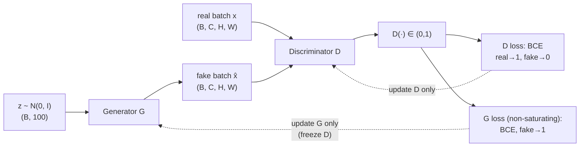
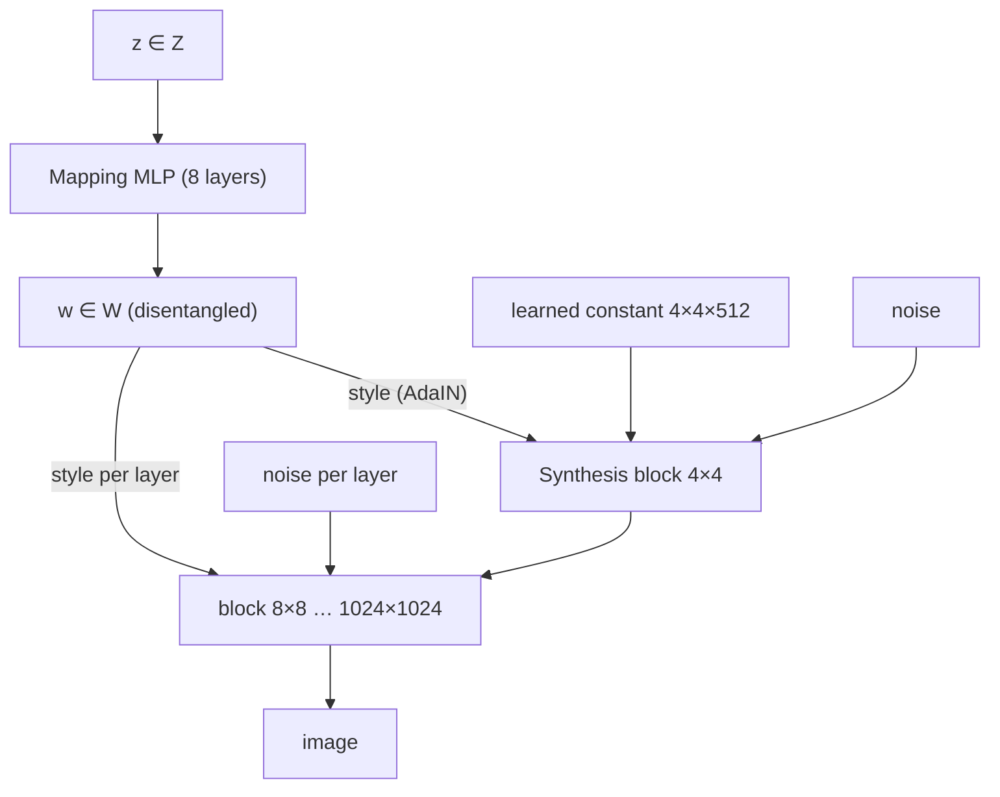
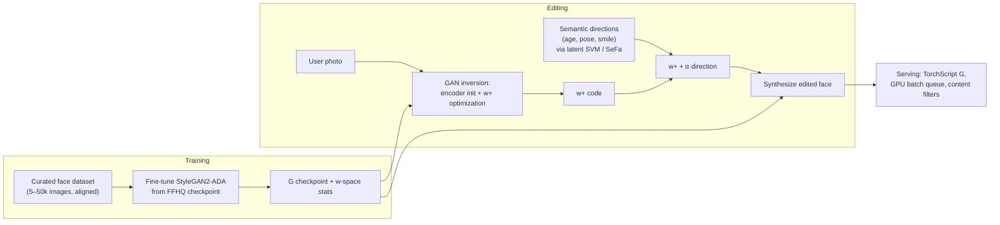

# 2.12 — Generative Adversarial Networks (GAN)

## 1. Overview

**What is it?** A Generative Adversarial Network trains two networks against each other in a game: a **generator** $G$ turns random noise into fake data, and a **discriminator** $D$ tries to tell fakes from real training samples. The generator improves by fooling the discriminator; the discriminator improves by catching the generator. At the game's equilibrium, the generator's samples are statistically indistinguishable from real data.

**Why does it exist?** Before GANs (Goodfellow et al., 2014), generative models either produced blurry samples (VAEs, as we saw in the [previous chapter](11-autoencoders.md)) or required expensive sampling procedures. GANs introduced a radical alternative: never write down a likelihood at all — learn the data distribution *implicitly* by letting a learned critic define what "realistic" means. The result was the sharpest synthetic images the field had ever produced.

**What problem does it solve?** Sampling from complex, high-dimensional distributions — photorealistic faces, image-to-image translation, super-resolution, audio synthesis — with a *single fast forward pass* at generation time, no iterative refinement needed.

**Where is it used?** StyleGAN (NVIDIA) set the standard for photorealistic face synthesis ("this person does not exist"); pix2pix/CycleGAN power image translation tools; ESRGAN drives super-resolution; HiFi-GAN vocoders convert spectrograms to audio inside deployed text-to-speech systems. Diffusion models (see [Diffusion Models](../phase-4-cv/04-diffusion-models.md)) have since taken the text-to-image crown, but GANs remain the fastest samplers, live on inside hybrid systems (VQ-GAN, adversarial losses in Stable Diffusion's VAE), and their adversarial training idea permeates modern ML.

## 2. Learning Objectives

After this chapter you will be able to:

- Write down and interpret the GAN **min-max objective** and identify each player's incentive.
- Show that the optimal discriminator is $D^*(x) = \frac{p_{\text{data}}(x)}{p_{\text{data}}(x) + p_g(x)}$ and that the generator then minimizes Jensen–Shannon divergence.
- Explain why the original generator loss **saturates** and derive the non-saturating alternative.
- Define **mode collapse**, recognize it in samples and metrics, and apply mitigations.
- Explain Wasserstein distance intuitively, and how **WGAN** and the **gradient penalty (WGAN-GP)** enforce the Lipschitz constraint.
- Build **conditional GANs** ($G(z, y)$, $D(x, y)$) for class- or text-conditioned generation.
- Implement and train a **DCGAN** on image data with the standard architectural guidelines.
- Describe **StyleGAN**'s mapping network, style injection (AdaIN), and why it enables attribute control.
- Evaluate generative models with **FID** and Inception Score, and know their limitations.
- Apply the practical training toolkit: spectral norm, TTUR, label smoothing, R1 regularization.
- Articulate GAN vs VAE vs diffusion trade-offs and pick the right tool.

## 3. Prerequisites

| Chapter | Why you need it |
|---|---|
| [Probability & Statistics](../phase-0-prerequisites/04-probability-statistics.md) | Distributions, expectations, divergences — the objective is a statement about distributions. |
| [Linear Algebra](../phase-0-prerequisites/02-linear-algebra.md) | Latent vectors, projections, and convolution arithmetic. |
| [Backpropagation](02-backpropagation.md) | Both players train by gradient descent; vanishing gradients explain saturation. |
| [Loss Functions](04-loss-functions.md) | The discriminator loss is binary cross-entropy. |
| [Optimizers](05-optimizers.md) | Adam hyperparameters make or break GAN training. |
| [CNN](07-cnn.md) | DCGAN's generator/discriminator are (transposed) convolutional networks. |
| [Autoencoders & VAEs](11-autoencoders.md) | The contrasting generative family; comparisons run throughout this chapter. |

## 4. Intuition

**The counterfeiter and the detective.** A counterfeiter (generator) prints fake banknotes; a detective (discriminator) inspects notes and calls them real or fake. At first the counterfeiter's notes are laughable and the detective wins easily. But each rejection is *feedback*: the ink is wrong, the watermark is missing. The counterfeiter improves; the detective is forced to sharpen too, noticing ever-subtler flaws. This arms race, run for thousands of rounds, ends when the fakes are so good the detective is reduced to guessing — a coin flip, $D(x) = \tfrac12$ everywhere. The counterfeiter has learned to *print money*, i.e. to sample from the real distribution.

**The key insight — a learned loss.** Every model we've trained so far minimized a *fixed*, hand-written loss (MSE, cross-entropy). The VAE's pixel-wise loss is why its samples blur: pixel distance is a poor measure of "looks real". A GAN replaces the hand-written loss with a *trained adversary*: the discriminator is a loss function that continually adapts to catch exactly the flaws your generator currently makes. Sharpness follows — pixel-averaging fools no detective.

**An everyday story.** A student writer (generator) submits stories to a harsh editor (discriminator) who never explains how to write — only "this reads as fake". Revising against every rejection, the student eventually writes indistinguishably from professionals. But note the fragility: if the editor is *too* harsh too early, the student gets no usable signal and gives up (vanishing gradients); if the student finds one trick that always slips past this editor, they submit that same story forever (mode collapse). GAN training is the art of keeping this relationship productive.

## 5. Real-world Motivation

- **NVIDIA** built the StyleGAN line (ProGAN → StyleGAN → StyleGAN2 → StyleGAN3), which defined photorealistic face synthesis and controllable generation — swap coarse styles to change pose, fine styles to change hair color. "thispersondoesnotexist.com" ran StyleGAN2, and GauGAN/Canvas turns semantic sketches into landscapes.
- **Google** researchers produced BigGAN, scaling class-conditional GANs to ImageNet at 512×512 — the quality benchmark of its era.
- **Adobe** ships GAN-derived editing features in Photoshop's Neural Filters, rooted in StyleGAN-style latent editing research.
- **Speech products across the industry** rely on GAN vocoders: HiFi-GAN-class models turn mel-spectrograms into waveforms in real time inside deployed text-to-speech stacks, because one forward pass beats autoregressive sample-by-sample synthesis by orders of magnitude.
- **Medical imaging** groups use GANs to synthesize plausible scans that balance rare-pathology classes where patient data is scarce and privacy-constrained (with careful validation).
- **Stability AI / CompVis:** even Stable Diffusion carries GAN DNA — its VAE decoder is trained with an adversarial loss (VQ-GAN style) to keep reconstructions sharp.

## 6. Mathematical Foundations

### 6.1 Notation

| Symbol | Meaning |
|---|---|
| $x \sim p_{\text{data}}$ | a real sample from the data distribution |
| $z \sim p_z$ | latent noise, typically $\mathcal{N}(0, I)$ in $\mathbb{R}^{100}$ |
| $G(z)$ | generator: maps noise to a fake sample; induces distribution $p_g$ |
| $D(x) \in (0, 1)$ | discriminator: estimated probability that $x$ is real |
| $y$ | conditioning information (class label, text) in conditional GANs |
| $V(D, G)$ | the value function of the two-player game |

### 6.2 The min-max objective

$$
\min_G \max_D \; V(D, G) = \mathbb{E}_{x\sim p_{\text{data}}}\big[\log D(x)\big] + \mathbb{E}_{z \sim p_z}\big[\log(1 - D(G(z)))\big]
$$

Read as two intertwined goals. The **discriminator** maximizes $V$: push $D(x) \to 1$ on real data and $D(G(z)) \to 0$ on fakes — this is exactly binary cross-entropy with labels real = 1, fake = 0 (see [Loss Functions](04-loss-functions.md)). The **generator** minimizes $V$: it can only touch the second term, so it wants $D(G(z)) \to 1$ — fakes classified as real.

**Optimal discriminator.** Fix $G$ (hence $p_g$) and maximize pointwise. Writing both expectations as integrals over $x$:

$$
V(D) = \int \big[ p_{\text{data}}(x) \log D(x) + p_g(x) \log(1 - D(x)) \big] dx .
$$

For each $x$, maximize $a \log t + b \log(1 - t)$ over $t \in (0,1)$: setting the derivative $a/t - b/(1-t) = 0$ gives $t^* = \frac{a}{a+b}$, i.e.

$$
D^*(x) = \frac{p_{\text{data}}(x)}{p_{\text{data}}(x) + p_g(x)} .
$$

**What the generator then minimizes.** Substituting $D^*$ back into $V$ and rearranging against the definitions of KL divergence yields

$$
V(D^*, G) = 2\, D_{\mathrm{JS}}\big(p_{\text{data}} \,\|\, p_g\big) - \log 4,
$$

where $D_{\mathrm{JS}}(p\|q) = \tfrac12 D_{\mathrm{KL}}(p \| m) + \tfrac12 D_{\mathrm{KL}}(q \| m)$ with $m = \tfrac12(p + q)$ is the Jensen–Shannon divergence. So against an optimal discriminator, the generator is minimizing JS divergence to the data distribution; the unique global optimum is $p_g = p_{\text{data}}$, where $D^* \equiv \tfrac12$ and $V = -\log 4$. The counterfeiter story, now as a theorem.

### 6.3 The non-saturating generator loss

Early in training, fakes are obviously fake: $D(G(z)) \approx 0$. The original generator loss $\log(1 - D(G(z)))$ is then nearly flat — its gradient magnitude is proportional to $\frac{D'(\cdot)}{1 - D(G(z))} \cdot D(G(z))$-scale terms that vanish as $D(G(z)) \to 0$. Exactly when the generator most needs guidance, it receives none: the loss **saturates**. Goodfellow's fix, used in virtually every implementation: instead of minimizing $\log(1 - D(G(z)))$, **maximize** $\log D(G(z))$:

$$
\mathcal{L}_G^{\text{NS}} = -\mathbb{E}_{z}\big[\log D(G(z))\big].
$$

Same fixed point (both are optimized when fakes fool $D$), opposite gradient behavior: $-\log D$ has *huge* gradients when $D(G(z)) \approx 0$ and gentle ones near success. In code this is simply "train $G$ with BCE and *real* labels on fake images."

### 6.4 Wasserstein GAN and the gradient penalty

JS divergence has a deeper flaw: when $p_{\text{data}}$ and $p_g$ have (near-)disjoint supports — typical early in training, when both live on thin manifolds in pixel space — $D_{\mathrm{JS}}$ saturates at $\log 2$ *regardless of how close the distributions are*, so gradients carry no information about direction. The **Wasserstein-1 (earth-mover) distance** does not have this problem: it measures the minimal "mass × distance" cost of transporting one distribution onto the other, and it decreases smoothly as $p_g$ moves toward $p_{\text{data}}$ even with disjoint supports. By Kantorovich–Rubinstein duality:

$$
W(p_{\text{data}}, p_g) = \sup_{\|f\|_{L} \le 1} \; \mathbb{E}_{x \sim p_{\text{data}}}[f(x)] - \mathbb{E}_{z}[f(G(z))],
$$

where the supremum is over all **1-Lipschitz** functions $f$ (functions whose output changes by at most 1 per unit change of input). WGAN implements $f$ as a neural network **critic** (no sigmoid — it outputs a real-valued score, not a probability) and must enforce the Lipschitz constraint. Weight clipping (the original proposal) is crude and biases the critic toward simple functions. **WGAN-GP** instead penalizes the critic's gradient norm on points $\hat{x} = \epsilon x_{\text{real}} + (1{-}\epsilon) x_{\text{fake}}$, $\epsilon \sim U[0,1]$, interpolated between real and fake samples (where the optimal critic provably has gradient norm 1):

$$
\mathcal{L}_D = \mathbb{E}[f(G(z))] - \mathbb{E}[f(x)] + \lambda\, \mathbb{E}_{\hat{x}}\big[(\|\nabla_{\hat{x}} f(\hat{x})\|_2 - 1)^2\big], \qquad \lambda = 10.
$$

Practical consequences: the critic can (and should) be trained to near-optimality (typically 5 critic steps per generator step), the loss value *correlates with sample quality* (rare and precious for GANs), and training is far more stable.

### 6.5 Conditional GANs

Feed conditioning information $y$ (a class label, a text embedding) to **both** players: $G(z, y)$ must produce a sample that is both realistic *and* consistent with $y$, because $D(x, y)$ judges the pair. Implementation options: concatenate an embedded $y$ to $z$ and to $D$'s features (original cGAN); or the **projection discriminator** (add $y$-embedding · features inner product to $D$'s output), used with class-conditional BatchNorm in BigGAN. Conditioning is what turns a curiosity into a product: "generate a *specific* digit / class / scene," and is the conceptual ancestor of text-conditioned generation in [Diffusion Models](../phase-4-cv/04-diffusion-models.md).

### 6.6 DCGAN architectural guidelines

The 2015 DCGAN paper established the convolutional recipe that made image GANs trainable (all still worth knowing): replace pooling with **strided convolutions** ($D$) and **transposed convolutions** ($G$); use **BatchNorm** in both (but not at $G$'s output or $D$'s input); no fully-connected hidden layers; **ReLU** in $G$ with **Tanh** output (so generate in $[-1,1]$ — normalize real data to match!); **LeakyReLU(0.2)** in $D$.

### 6.7 StyleGAN in brief

StyleGAN restructures the generator for *controllability*. A **mapping network** (8-layer MLP) transforms $z \in \mathcal{Z}$ into an intermediate latent $w \in \mathcal{W}$, a space empirically far more disentangled than $\mathcal{Z}$ (the mapping can "unwarp" the prior). The synthesis network starts from a learned constant $4\times4$ tensor and grows resolution; at every layer, $w$ is injected as a **style** via adaptive instance normalization — $\text{AdaIN}(h, w) = \sigma_s(w)\, \frac{h - \mu(h)}{\sigma(h)} + \mu_s(w)$ — modulating per-channel statistics, while per-pixel **noise** inputs add stochastic detail (hair strands, pores). Because styles at coarse layers (4–8 px) control pose and face shape while fine layers (64–1024 px) control color and micro-texture, **style mixing** — using different $w$'s at different layers — transfers attributes between generated people. StyleGAN2 removed AdaIN's normalization artifacts ("water droplets") via weight demodulation; StyleGAN3 fixed aliasing ("texture sticking") for animation.

## 7. Visual Explanation

The adversarial game:



Training dynamics — healthy convergence vs the two classic failures:

```
  Healthy arms race            Mode collapse                D overpowers G
  ------------------           --------------------         -------------------
  D acc hovers ~60-80%         G emits ONE sample type      D(G(z)) ≈ 0 always
  samples diversify            (all "1" digits);            log(1−D) flat →
  and sharpen over time        D loss oscillates as it      G gradient ≈ 0;
                               relearns the same trick      G stops improving
```

StyleGAN generator (contrast with the plain "z in at the bottom" design):



## 8. Algorithm

**Vanilla GAN training (non-saturating loss):**

1. Sample a real minibatch $x^{(1..B)} \sim p_{\text{data}}$ and noise $z^{(1..B)} \sim \mathcal{N}(0, I)$.
2. **Discriminator step:** compute $D(x)$ and $D(G(z))$ (with $G$'s output *detached* — no gradient into $G$); minimize $-\big[\log D(x) + \log(1 - D(G(z)))\big]$; update $D$ only.
3. Sample fresh noise $z$.
4. **Generator step:** minimize $-\log D(G(z))$ with $D$ frozen (gradients flow *through* $D$ into $G$, but $D$'s weights don't move); update $G$ only.
5. Repeat; log $D(x)$, $D(G(z))$, and periodic sample grids / FID.

```text
for each iteration:
    # ---- discriminator ----
    x  ← real_batch();  z ← noise(B)
    fake ← G(z).detach()                      # block gradient into G
    loss_D ← BCE(D(x), 1) + BCE(D(fake), 0)   # (label smoothing: use 0.9)
    update D with ∇loss_D

    # ---- generator ----
    z ← noise(B)
    loss_G ← BCE(D(G(z)), 1)                  # non-saturating: fake labeled REAL
    update G with ∇loss_G (D frozen)

# WGAN-GP variant: critic has no sigmoid; loss_D ← mean(f(fake)) − mean(f(x))
#   + 10·GP; train critic 5 steps per G step; loss_G ← −mean(f(G(z))).
```

The two `detach`/freeze operations are the crux: step 2 must not teach $G$ to be *worse*, and step 4 must not teach $D$ to be *blind*.

## 9. Worked Example

### 9.1 Tiny example by hand

Let the "data" be scalars from $\mathcal{N}(4, 1)$, the generator $G(z) = z + \theta$ with $z \sim \mathcal{N}(0,1)$ and current $\theta = 1$ (so fakes ~ $\mathcal{N}(1,1)$), and a simple discriminator $D(x) = \sigma(x - c)$ with $c = 2.5$ (it thinks "big is real" — reasonable, since real data centers at 4 and fakes at 1).

Take one real sample $x = 4.2$ and one noise draw $z = 0.3$, so the fake is $G(z) = 1.3$.

- $D(x) = \sigma(4.2 - 2.5) = \sigma(1.7) = 0.846$ — real correctly favored.
- $D(G(z)) = \sigma(1.3 - 2.5) = \sigma(-1.2) = 0.231$ — fake correctly suspected.
- **Discriminator loss** (BCE): $-[\log 0.846 + \log(1 - 0.231)] = 0.167 + 0.263 = 0.430$.
- **Saturating G loss** $\log(1 - D(G(z)))$: its gradient w.r.t. the fake value has magnitude $D(G(z)) = 0.231$ here — but for a terrible fake, say $G(z) = -2$, $D(G(z)) = \sigma(-4.5) = 0.011$ and the gradient is $\approx 0.011$: nearly zero exactly when improvement is most needed.
- **Non-saturating G loss** $-\log D(G(z))$: gradient magnitude is $1 - D(G(z)) = 0.769$ at $G(z) = 1.3$ and $\approx 0.989$ at $G(z) = -2$ — *strong* signal for bad fakes. Descent on $\theta$ pushes fakes toward the real mean of 4. This hand computation is the saturation argument of Section 6.3 made concrete.

### 9.2 Realistic scale

A DCGAN on MNIST (Section 11 code): $G$ maps 100-d noise through four transposed-conv layers to $28\times28$ images (~3.6M parameters); $D$ mirrors it with strided convs (~2.8M). On one consumer GPU, digits emerge as blobs by epoch 1, become recognizable by epoch 5, and are clean by epoch 20 (~15 minutes). Healthy telemetry: $D(x) \approx 0.7$–$0.9$, $D(G(z)) \approx 0.2$–$0.4$, both oscillating without either pinning to 0 or 1. If every sample grid shows the same digit — congratulations, you have witnessed mode collapse first-hand.

## 10. Python from Scratch

A complete GAN in pure NumPy on a 1-D task — learn to sample from $\mathcal{N}(4, 0.25)$ — with backprop written out by hand. Small enough to trace every gradient, real enough to show the adversarial dynamics:

```python
import numpy as np
rng = np.random.default_rng(0)

H = 16          # hidden width for both players
lr = 0.05       # SGD learning rate
sigmoid = lambda a: 1 / (1 + np.exp(-a))

# Generator: z (1-d noise) -> tanh hidden -> fake sample (1-d)
Gw1, Gb1 = rng.standard_normal((1, H)) * 0.5, np.zeros(H)
Gw2, Gb2 = rng.standard_normal((H, 1)) * 0.5, np.zeros(1)
# Discriminator: x (1-d) -> tanh hidden -> P(real) (1-d)
Dw1, Db1 = rng.standard_normal((1, H)) * 0.5, np.zeros(H)
Dw2, Db2 = rng.standard_normal((H, 1)) * 0.5, np.zeros(1)

def G_forward(z):
    h = np.tanh(z @ Gw1 + Gb1)          # (B, H)
    return h, h @ Gw2 + Gb2             # fake samples (B, 1)

def D_forward(x):
    h = np.tanh(x @ Dw1 + Db1)          # (B, H)
    return h, sigmoid(h @ Dw2 + Db2)    # P(real) (B, 1)

def D_backward(x, h, p, target):
    """BCE grads. d(loss)/d(logit) = p - target — the classic simplification."""
    B = x.shape[0]
    dlogit = (p - target) / B                        # (B, 1)
    dDw2 = h.T @ dlogit; dDb2 = dlogit.sum(0)
    dh = dlogit @ Dw2.T * (1 - h**2)                 # tanh' = 1 - tanh²
    dDw1 = x.T @ dh;     dDb1 = dh.sum(0)
    dx = dh @ Dw1.T                                  # grad w.r.t. INPUT (for G)
    return (dDw1, dDb1, dDw2, dDb2), dx

for step in range(20_000):
    # ---- D step: real -> 1, fake -> 0 (fake is detached: G grads discarded)
    x_real = 4 + 0.5 * rng.standard_normal((64, 1))
    _, x_fake = G_forward(rng.standard_normal((64, 1)))
    hr, pr = D_forward(x_real)
    hf, pf = D_forward(x_fake)
    gr, _ = D_backward(x_real, hr, pr, np.ones_like(pr))
    gf, _ = D_backward(x_fake, hf, pf, np.zeros_like(pf))
    for W, g1, g2 in zip((Dw1, Db1, Dw2, Db2), gr, gf):
        W -= lr * (g1 + g2)

    # ---- G step: non-saturating -> label fakes as REAL, push grads THROUGH D
    z = rng.standard_normal((64, 1))
    hg, x_fake = G_forward(z)
    hf, pf = D_forward(x_fake)
    _, dx = D_backward(x_fake, hf, pf, np.ones_like(pf))  # target=1: -log D(G(z))
    dGw2 = hg.T @ dx; dGb2 = dx.sum(0)                    # chain rule into G
    dhg = dx @ Gw2.T * (1 - hg**2)
    dGw1 = z.T @ dhg; dGb1 = dhg.sum(0)
    for W, g in zip((Gw1, Gb1, Gw2, Gb2), (dGw1, dGb1, dGw2, dGb2)):
        W -= lr * g

    if step % 5000 == 0:
        _, s = G_forward(rng.standard_normal((2000, 1)))
        print(f"step {step:6d}: fake mean {s.mean():.2f}  std {s.std():.2f}")
# Expected drift: mean → ~4.0, std → ~0.5 (matching N(4, 0.25))
```

The load-bearing details: the D step uses fake samples but **discards** `dx` (that is the from-scratch equivalent of `.detach()`), while the G step trains with target 1 and **keeps only** `dx`, chaining it into the generator — D's own weights untouched. Complexity: $O(BH)$ per step.

> [!WARNING]
> **Common bug:** updating both networks from one shared backward pass. If D's gradients leak into G (or vice versa), each player actively sabotages itself; the symptom is losses that look fine while samples never improve. Keep the two updates surgically separate.

## 11. Library Implementation

DCGAN on MNIST in PyTorch — the canonical recipe:

```python
import torch, torch.nn as nn
from torch.utils.data import DataLoader
from torchvision import datasets, transforms

Z, F = 100, 64                                  # latent dim, base channel count

class Gen(nn.Module):                            # noise (B,100,1,1) -> image (B,1,28,28)
    def __init__(self):
        super().__init__()
        self.net = nn.Sequential(
            nn.ConvTranspose2d(Z, F*4, 4, 1, 0, bias=False),  # -> (B,256,4,4)
            nn.BatchNorm2d(F*4), nn.ReLU(True),
            nn.ConvTranspose2d(F*4, F*2, 4, 2, 1, bias=False),# -> (B,128,8,8)
            nn.BatchNorm2d(F*2), nn.ReLU(True),
            nn.ConvTranspose2d(F*2, F, 4, 2, 1, bias=False),  # -> (B,64,16,16)
            nn.BatchNorm2d(F), nn.ReLU(True),
            nn.ConvTranspose2d(F, 1, 4, 2, 3, bias=False),    # -> (B,1,28,28)
            nn.Tanh())                                        # output in [-1, 1]
    def forward(self, z): return self.net(z)

class Disc(nn.Module):                           # image -> P(real), via strided convs
    def __init__(self):
        super().__init__()
        self.net = nn.Sequential(
            nn.Conv2d(1, F, 4, 2, 3, bias=False), nn.LeakyReLU(0.2, True),
            nn.Conv2d(F, F*2, 4, 2, 1, bias=False),
            nn.BatchNorm2d(F*2), nn.LeakyReLU(0.2, True),
            nn.Conv2d(F*2, F*4, 4, 2, 1, bias=False),
            nn.BatchNorm2d(F*4), nn.LeakyReLU(0.2, True),
            nn.Conv2d(F*4, 1, 4, 1, 0, bias=False), nn.Sigmoid())
    def forward(self, x): return self.net(x).view(-1)

G, D = Gen(), Disc()
# DCGAN Adam settings: beta1=0.5 (NOT the default 0.9) — critical for stability.
optG = torch.optim.Adam(G.parameters(), lr=2e-4, betas=(0.5, 0.999))
optD = torch.optim.Adam(D.parameters(), lr=2e-4, betas=(0.5, 0.999))
bce = nn.BCELoss()

tfm = transforms.Compose([transforms.ToTensor(),
                          transforms.Normalize(0.5, 0.5)])   # match Tanh range!
loader = DataLoader(datasets.MNIST("data", download=True, transform=tfm),
                    batch_size=128, shuffle=True)

for epoch in range(20):
    for x, _ in loader:
        B = x.size(0)
        z = torch.randn(B, Z, 1, 1)
        # ---- D step: real -> 0.9 (one-sided label smoothing), fake -> 0
        fake = G(z).detach()                     # block gradients into G
        lossD = bce(D(x), torch.full((B,), 0.9)) + bce(D(fake), torch.zeros(B))
        optD.zero_grad(); lossD.backward(); optD.step()
        # ---- G step: non-saturating loss = BCE with REAL labels on fakes
        z = torch.randn(B, Z, 1, 1)
        lossG = bce(D(G(z)), torch.ones(B))      # grads flow THROUGH frozen D
        optG.zero_grad(); lossG.backward(); optG.step()
    print(f"epoch {epoch}: D {lossD.item():.3f}  G {lossG.item():.3f}")
```

For evaluation, compute FID with `torch-fidelity` (`fidelity --gpu 0 --fid --input1 samples/ --input2 real/`); for production-grade face generation, use NVIDIA's official `stylegan3` repository rather than training from scratch. Upgrading this code to **WGAN-GP** touches four places: drop `Sigmoid` from D, replace BCE with score means, add the gradient penalty (with `torch.autograd.grad(..., create_graph=True)`), and take 5 D steps per G step.

## 12. Code Walkthrough

Tracing one DCGAN iteration ($B = 128$):

| Tensor | Shape | Meaning |
|---|---|---|
| `z` | (128, 100, 1, 1) | latent noise, unit Gaussian |
| `G(z)` | (128, 1, 28, 28) | fake images in $[-1, 1]$ (Tanh) |
| `x` | (128, 1, 28, 28) | real images, normalized to $[-1, 1]$ |
| `D(x)`, `D(fake)` | (128,) | per-image probability of "real" |
| `lossD`, `lossG` | scalars | BCE values for each player |

**Inputs:** real images normalized to the generator's output range; Gaussian noise. **Outputs:** a generator you can sample with `G(torch.randn(n, 100, 1, 1))` in a single forward pass. **Expected results:** at initialization $D$ is at chance, both losses $\approx \log 2 \approx 0.693$ (up to the smoothing offset); during healthy training $D(x)$ sits around 0.7–0.9, $D(\text{fake})$ around 0.2–0.4, both oscillating; sample grids improve monotonically-ish and MNIST FID falls below ~30 by epoch 20. Red flags: `lossD` → 0 with `lossG` climbing (D overpowering; G's gradients dying) or identical-looking samples across the grid (mode collapse). Unlike every previous chapter, **the loss curves alone cannot tell you the model is good** — they measure a moving adversary. Always look at samples and FID.

## 13. Complexity Analysis

**Time.** One iteration = one forward+backward through $D$ on real data, and one forward+backward through $D \circ G$ (twice, once per player's step): roughly $2 \times$ the cost of training the two CNNs independently, i.e. $O(B \cdot C_G + B \cdot C_D)$ per step where $C_{G}, C_{D}$ are per-sample conv costs (each $O(\sum_l H_l W_l k_l^2 c_{l-1} c_l)$ as in [CNN](07-cnn.md)). WGAN-GP multiplies the critic cost by ~5 (critic steps) and the penalty adds a double-backward through $D$ (~2–3× one D pass). The *dominant* practical cost is not per-step compute but **instability overhead**: failed runs, restarts, and hyperparameter sweeps are the true budget line for GAN projects.

**Space.** Both networks' weights and activations live in memory simultaneously, plus two optimizer states — but no attention-style $O(n^2)$ blowup and no KV cache. **Inference is the GAN superpower:** generation is one forward pass through $G$ — $O(C_G)$, milliseconds — versus dozens-to-hundreds of network evaluations for diffusion sampling ([Diffusion Models](../phase-4-cv/04-diffusion-models.md)). This 100×-ish sampling-cost gap is why GAN vocoders still own real-time audio.

## 14. Advantages

- **Sharp, high-fidelity samples.** The learned adversarial loss punishes exactly the "averaged" outputs that make VAE samples blurry; StyleGAN2 faces at 1024×1024 fooled human raters routinely.
- **Single-pass, real-time sampling.** One forward pass per sample — HiFi-GAN synthesizes audio hundreds of times faster than real time, which is why TTS products use GAN vocoders rather than diffusion for the final waveform stage.
- **No likelihood machinery required.** GANs sidestep intractable densities entirely — useful for data where writing a sensible likelihood is hard (raw audio, sketches, sensor data).
- **Steerable latent space.** StyleGAN's $\mathcal{W}$ space supports semantic editing (age, pose, lighting sliders) and style mixing — the foundation of face-editing features in commercial tools.
- **Adversarial training as a reusable idea.** Domain-adversarial adaptation, adversarial robustness, perceptual "GAN losses" inside VAEs and super-resolution models (ESRGAN, VQ-GAN, Stable Diffusion's decoder) — the two-player template outlived the vanilla GAN itself.

## 15. Disadvantages

- **Training instability.** The min-max game is a *saddle-point* problem, not a minimization; simultaneous gradient descent can rotate around equilibria, oscillate, or diverge. Failure looks like: loss curves oscillating forever while samples degrade after epoch 40 — and there is no reliable "just lower the LR" fix.
- **Mode collapse.** The generator can win locally by producing a few high-quality modes and ignoring the rest of the data distribution — all generated faces sharing one identity, a digit GAN emitting only 1s. Diversity must be monitored explicitly; the loss won't tell you.
- **No likelihood, hard evaluation.** You cannot compute $p_g(x)$, compare held-out likelihoods, or detect missing modes from the objective; FID/IS are imperfect proxies (FID assumes Gaussian Inception features; IS ignores intra-class diversity entirely).
- **Hyperparameter fragility.** Adam $\beta_1 = 0.5$ vs 0.9, learning-rate ratios, architecture details — small changes flip runs from success to garbage; reproducing published GAN results is notoriously finicky.
- **Superseded for text-to-image.** For open-ended, text-conditioned, high-diversity generation, diffusion models won on quality, mode coverage, and training reliability — pick GANs for speed and editing, not for a DALL·E competitor.

## 16. Common Mistakes

- **Data range mismatch.** $G$ outputs Tanh $[-1,1]$ but real data is in $[0,1]$: $D$ separates them by brightness alone and training never starts. *Avoid:* `Normalize(0.5, 0.5)`; verify `x.min(), x.max()` of both streams.
- **Missing `.detach()` on fakes in the D step.** The D update then pushes $G$ to make *worse* fakes. *Avoid:* `fake = G(z).detach()`; assert `z.grad is None` after the D step in a test.
- **Default Adam $\beta_1 = 0.9$.** High momentum amplifies the game's rotational dynamics; runs oscillate or collapse. *Avoid:* $(0.5, 0.999)$ for DCGAN-family, $(0.0, 0.9)$ for WGAN-GP/StyleGAN-family.
- **Letting D win completely.** $D(G(z)) \to 0$, generator gradients vanish (even non-saturating loss suffers when $D$ is *perfect* and confident everywhere). *Avoid:* label smoothing (0.9), balanced capacities, spectral norm on D, or a WGAN-GP objective.
- **BatchNorm in a WGAN-GP critic.** The gradient penalty is defined per-sample; BatchNorm couples samples and corrupts it. *Avoid:* LayerNorm/InstanceNorm or no norm in the critic.
- **Judging training by loss curves.** GAN losses measure performance against a *moving* opponent; a falling G loss may mean D got worse. *Avoid:* fixed-noise sample grids every N steps + FID on a schedule.
- **Evaluating FID on too few samples.** FID has strong sample-size bias. *Avoid:* 10k–50k generated samples, same count for the reference set, and identical preprocessing.

## 17. Best Practices

- [ ] Start from DCGAN guidelines (Section 6.6); change one thing at a time.
- [ ] Non-saturating loss by default; move to WGAN-GP or hinge loss + spectral norm when instability bites.
- [ ] Adam $(\beta_1, \beta_2) = (0.5, 0.999)$, lr $2\times10^{-4}$; consider TTUR (D lr 4e-4, G lr 1e-4).
- [ ] One-sided label smoothing (real = 0.9) on the discriminator only.
- [ ] Spectral normalization on all discriminator layers — the single highest-value stabilizer per line of code.
- [ ] Fixed evaluation noise: generate the same 64 latents' grid every epoch to see progress honestly.
- [ ] Track FID every few epochs (10k+ samples); track it *per class* if conditional, to catch partial mode collapse.
- [ ] Keep G and D roughly balanced in capacity; if D dominates, weaken it (dropout, fewer filters) before touching G.
- [ ] Use EMA (exponential moving average) of generator weights for evaluation/sampling — standard in StyleGAN/BigGAN, nearly free quality.
- [ ] For faces or standard domains, fine-tune a pretrained StyleGAN before training from scratch; for small datasets, add differentiable augmentation (StyleGAN2-ADA).

## 18. Optimization Techniques

- **Spectral normalization** — divide each D weight matrix by its largest singular value (one power-iteration step per forward): a cheap soft-Lipschitz constraint; `nn.utils.spectral_norm(layer)`.
- **TTUR (two time-scale update rule)** — different learning rates for D and G (e.g. 4:1) provably helps convergence to local equilibria; two lines of code.
- **R1 regularization** — penalize $\|\nabla_x D(x)\|^2$ on *real* data only ($\gamma/2$ coefficient); the stabilizer used by StyleGAN2 in place of GP; apply lazily (every 16 steps) to amortize the double-backward.
- **EMA generator weights** — sample from a slow moving average of G; smooths the game's oscillations out of the final model.
- **Progressive growing / multi-resolution training** — start at 4×4 and add resolution layers gradually (ProGAN); largely superseded by StyleGAN2's skip/residual design but historically crucial.
- **Differentiable augmentation (ADA)** — augment both real and fake images inside the D pass with adjustable probability; makes GANs trainable on a few thousand images.
- **Mixed precision + channel tuning** — GAN convs benefit fully from bf16/fp16 tensor cores; keep the GP/R1 double-backward in fp32 if you see NaNs.
- **Truncation trick at inference** — sample $w$ closer to the mean ($w' = \bar{w} + \psi(w - \bar{w})$, $\psi \approx 0.7$): trades diversity for fidelity per sample, standard for showcase imagery.

## 19. Industry Applications

- **Face and avatar synthesis:** NVIDIA StyleGAN2/3 for photorealistic identities; gaming/metaverse avatar startups fine-tune StyleGAN backbones; "this person does not exist" demos ran StyleGAN2.
- **Speech synthesis:** HiFi-GAN and successors are the vocoder stage in deployed TTS pipelines across the industry — spectrogram to waveform in one pass, faster than real time on CPU.
- **Super-resolution and restoration:** ESRGAN/Real-ESRGAN in image-upscaling products and game-texture remasters; GAN losses keep upscaled detail crisp where MSE would blur.
- **Image editing:** GAN-inversion research (embed a photo into StyleGAN's latent space, edit attributes, re-render) underlies commercial face-editing features, including Adobe's neural filters line of work.
- **Content and design tooling:** NVIDIA GauGAN/Canvas turns semantic sketches into landscapes; pix2pix-style translation powers colorization and photo-to-render workflows.
- **Medical and scientific data augmentation:** GAN-synthesized scans balance rare classes in radiology datasets (with careful validation); physics groups use GANs as fast simulators for detector responses.
- **Inside diffusion products:** Stable Diffusion's VAE decoder is adversarially trained (VQ-GAN recipe) — every generated image ships through a GAN-trained component (see [Diffusion Models](../phase-4-cv/04-diffusion-models.md)).

## 20. Interview Questions

### Beginner

**Q: Explain the GAN min-max objective in plain terms.**
A: $\min_G \max_D \mathbb{E}_{x}[\log D(x)] + \mathbb{E}_{z}[\log(1 - D(G(z)))]$. D maximizes: classify real as real ($D(x)\to1$) and fake as fake ($D(G(z))\to0$) — plain BCE. G minimizes: make $D(G(z))$ large, i.e. fool D. At equilibrium $p_g = p_{\text{data}}$ and $D \equiv \tfrac12$.

**Q: Why is the non-saturating generator loss used instead of the original?**
A: Early on, $D(G(z)) \approx 0$ and $\log(1 - D(G(z)))$ is flat there — near-zero gradient exactly when G needs guidance most. Maximizing $\log D(G(z))$ has the same fixed point but the largest gradients for the worst fakes. In code: train G with BCE and real labels on fakes.

**Q: What is mode collapse?**
A: The generator maps many different $z$ values to a few outputs, covering only a fraction of the data's modes — e.g. a digit GAN producing only 1s. It happens because fooling D locally doesn't require diversity. Detect via sample grids and per-class FID; mitigate with WGAN-GP, minibatch-diversity features, spectral norm, and balanced training.

**Q: Why does the discriminator step use `.detach()` on fake images?**
A: The D update must optimize D's classification only. Without detaching, gradients also flow into G — pushing G to make fakes *easier to catch*, the opposite of its goal. Symmetrically, the G step freezes D's weights while letting gradients flow through D.

**Q: GAN vs VAE in three sentences.**
A: A VAE optimizes an explicit likelihood bound (ELBO) — stable training, principled math, blurry samples from pixel-wise losses. A GAN optimizes an implicit adversarial objective — unstable training, no likelihood, sharp samples. VAEs give you an encoder and a usable latent space for free; GANs give you fidelity and one-pass sampling. (Details in [Autoencoders & VAEs](11-autoencoders.md).)

### Intermediate

**Q: Derive the optimal discriminator and state what the generator minimizes against it.**
A: Fixing $G$, maximize $\int [p_{\text{data}}\log D + p_g \log(1-D)]dx$ pointwise: $\frac{d}{dt}[a\log t + b\log(1-t)] = 0$ gives $D^*(x) = \frac{p_{\text{data}}}{p_{\text{data}} + p_g}$. Substituting back, $V(D^*, G) = 2\,D_{\mathrm{JS}}(p_{\text{data}}\|p_g) - \log 4$ — the generator minimizes Jensen–Shannon divergence, minimized uniquely at $p_g = p_{\text{data}}$.

**Q: Why does WGAN improve on JS-divergence GANs, and what does the gradient penalty do?**
A: When $p_{\text{data}}$ and $p_g$ have disjoint supports (typical early: both are low-dimensional manifolds), JS saturates at $\log 2$ — zero useful gradient regardless of distance. Wasserstein-1 decreases smoothly as distributions approach even without overlap. Its dual form requires the critic to be 1-Lipschitz; WGAN-GP enforces this by penalizing $(\|\nabla_{\hat{x}} f(\hat{x})\| - 1)^2$ on real–fake interpolates, where the optimal critic has unit gradient norm — far better than weight clipping, which biases the critic toward trivial functions.

**Q: Compare FID and Inception Score.**
A: IS = $\exp(\mathbb{E}_x D_{\mathrm{KL}}(p(y|x) \| p(y)))$ using an Inception classifier: rewards confident, class-diverse samples, but never looks at real data — a GAN memorizing one perfect image per class scores highly. FID fits Gaussians to Inception features of real and generated sets and computes the Fréchet distance $\|\mu_r - \mu_g\|^2 + \mathrm{Tr}(\Sigma_r + \Sigma_g - 2(\Sigma_r\Sigma_g)^{1/2})$ — compares against real data, catches both quality and diversity failures; lower is better. FID is standard; both inherit Inception's ImageNet bias and FID needs 10k+ samples.

**Q: What is spectral normalization and why does it stabilize GANs?**
A: Each discriminator weight matrix is divided by its spectral norm (largest singular value, estimated by one power-iteration step per forward pass), bounding each layer's Lipschitz constant by 1. A Lipschitz-constrained D cannot produce arbitrarily steep decision boundaries, so its gradients w.r.t. inputs — G's learning signal — stay bounded and informative. One wrapper per layer, negligible cost.

**Q: How does a conditional GAN work, and how does the projection discriminator differ from naive concatenation?**
A: Both players receive the condition: $G(z, y)$ and $D(x, y)$, so realism *and* condition-consistency are enforced. Naive cGAN concatenates an embedding of $y$ to inputs/features. The projection discriminator computes $D(x, y) = \psi(\phi(x)) + e_y^\top \phi(x)$ — an inner product between the class embedding and image features — which matches the form of the optimal conditional discriminator and trains markedly better at scale (used in BigGAN with class-conditional BatchNorm in G).

### Advanced

**Q: Explain StyleGAN's design: mapping network, AdaIN styles, noise inputs, and style mixing.**
A: An 8-layer MLP maps $z \to w$; freed from the fixed prior geometry, $\mathcal{W}$ is empirically more disentangled. The synthesis network starts from a learned constant and injects $w$ at every resolution via AdaIN, so $w$ controls how features render at each scale, while per-pixel noise adds stochastic micro-detail (hair, pores). Feeding different $w$'s to different layer ranges (style mixing) transfers coarse attributes (pose, from low-res layers) and fine attributes (color/texture, high-res layers) between samples. StyleGAN2 replaced AdaIN with weight demodulation to remove droplet artifacts; StyleGAN3 fixed aliasing for animation.

**Q: Why is GAN training fundamentally harder than standard neural network training?**
A: It is a saddle-point problem, not a minimization: simultaneous gradient descent-ascent has a *rotational* component around equilibria (visible even on the toy game $\min_x \max_y xy$), causing oscillation or divergence, and there is no monotone objective to monitor. The generator's signal is also only as good as the current discriminator. The remedies — TTUR, spectral norm, R1, EMA — all target these game dynamics rather than ordinary optimization pathologies.

**Q: Your class-conditional GAN's overall FID looks fine, but users report repetitive outputs for some classes. Diagnose and fix.**
A: Suspect *intra-class* mode collapse — aggregate FID can mask per-class diversity loss. Verify with per-class FID and per-class recall (precision/recall-for-distributions metrics), plus nearest-neighbor checks of generated samples against each other. Fixes ranked: WGAN-GP or hinge+SN objective; minibatch standard deviation feature in D (lets D detect low batch diversity); stronger conditioning (projection D); rebalance training data per class; differentiable augmentation if some classes are data-poor; lower truncation $\psi$ only for showcase, not evaluation.

**Q: Where do adversarial losses appear inside modern diffusion-era systems, and why?**
A: (1) Stable Diffusion's VAE decoder is trained with a patch discriminator (VQ-GAN recipe) because pixel/perceptual losses alone give blurry textures. (2) Distilling diffusion models into few-step samplers (e.g. SDXL-Turbo's adversarial diffusion distillation) uses a discriminator to keep one-step outputs sharp. (3) Super-resolution stages (ESRGAN). The pattern: wherever a squared-error objective would average over plausible high-frequency detail, an adversarial term restores sharpness.

**Q: When would you still choose a GAN over a diffusion model today?**
A: Latency/throughput-critical generation: vocoders (HiFi-GAN, real-time on CPU), interactive editing, game asset pipelines — one forward pass vs many. Well-scoped narrow domains (faces) where StyleGAN quality suffices and its editable $\mathcal{W}$ latent space is a feature diffusion lacks natively. Constrained compute at inference. For open-ended text-to-image diversity and training reliability, diffusion wins; hybrids (GAN-distilled diffusion) increasingly capture both.

## 21. Coding Exercises

### Easy

1. **1-D GAN.** Run the Section 10 NumPy GAN; plot histograms of real vs generated samples every 5k steps and watch the fake distribution slide onto $\mathcal{N}(4, 0.25)$. *Hint:* if the fake mean stalls, check that the G step uses target 1.
2. **Saturation demo.** For the Section 9.1 setup, plot both generator losses and their gradients as functions of $D(G(z)) \in (0, 1)$; mark where each provides useful signal. *Hint:* gradients w.r.t. the logit are $D(G(z))$ vs $D(G(z)) - 1$.
3. **Label smoothing.** Add one-sided smoothing (real = 0.9) to the DCGAN and compare $D(x)$/$D(G(z))$ telemetry over 10 epochs with and without. *Hint:* smooth only real labels — smoothing fakes hurts.

### Medium

1. **Mode collapse lab.** Train a small MLP GAN on a 2-D mixture of 8 Gaussians arranged in a ring; scatter-plot generated points over training. Induce collapse (high LR, $\beta_1 = 0.9$), then fix it with spectral norm + TTUR and show all 8 modes covered. *Hint:* count covered modes = modes with ≥1% of samples within 3σ.
2. **WGAN-GP conversion.** Upgrade the DCGAN of Section 11: remove D's sigmoid, use score-mean losses, add the gradient penalty ($\lambda = 10$, `create_graph=True`), 5 critic steps per G step, betas (0.0, 0.9). Verify the critic loss now *tracks* sample quality. *Hint:* no BatchNorm in the critic.
3. **Conditional DCGAN.** Condition on MNIST digit class via embedding concatenation in both G and D; generate a 10×10 grid (rows = digits) and verify class consistency with a pretrained classifier. *Hint:* broadcast the label embedding to a channel plane for D.

### Hard

1. **FID pipeline.** Implement FID from scratch: Inception-v3 pool3 features, Gaussian fit, Fréchet distance (careful with the matrix square root — use `scipy.linalg.sqrtm` and take the real part); validate against `torch-fidelity` within ~1 point. *Hint:* sample-size bias — compare only equal-sized sets.
2. **GAN inversion.** Given a trained DCGAN and a real image, optimize $z$ (Adam on $z$, perceptual + pixel loss) to reconstruct it; then interpolate between two inverted codes. *Hint:* optimize in an expanded latent (per-layer codes) if plain $z$ underfits.
3. **StyleGAN-lite.** Implement a mapping network + AdaIN style injection + per-layer noise on top of your DCGAN generator for 64×64 faces (CelebA); demonstrate style mixing between coarse and fine layers. *Hint:* start from the official StyleGAN2 paper's architecture table, scaled down.

## 22. Mini Project

**DCGAN on MNIST with honest evaluation.**

1. Implement the Section 11 DCGAN; verify data and generator ranges match ($[-1, 1]$).
2. Train 20 epochs, logging $D(x)$, $D(G(z))$, and both losses; save a sample grid from a *fixed* batch of 64 latents every epoch.
3. Assemble the 20 grids into a progress strip; identify when digit identity, stroke sharpness, and diversity emerge.
4. Compute FID against the MNIST test set at epochs 5/10/15/20 (10k samples each) with `torch-fidelity`.
5. Deliberately break training two ways — set $\beta_1 = 0.9$, then remove `.detach()` — and document the failure signatures in telemetry and samples.
6. Write a half-page comparison of what the loss curves did vs what the samples/FID did, and why they disagree.

## 23. Medium Project

**WGAN-GP on CIFAR-10 with a mode-coverage study.**

1. Build a WGAN-GP with a ResNet-style G and critic (no BatchNorm in the critic; LayerNorm allowed) at 32×32.
2. Train with 5 critic steps per G step, Adam (1e-4, betas (0.0, 0.9)), $\lambda = 10$, ~100k G steps; log the negative critic loss as a quality proxy and verify it correlates with FID checkpoints.
3. Evaluate: overall FID (50k samples) and *per-class* FID using a pretrained CIFAR classifier to bucket generated samples.
4. Ablate: (a) remove GP → document divergence or collapse; (b) 1 critic step instead of 5; (c) weight clipping instead of GP. Table the FID impact of each.
5. Add EMA generator weights and measure the FID gain (typically several points, free).
6. Deliverable: a report ranking the stabilizers by measured impact — the empirical toolkit you'll reuse on any future adversarial training.

## 24. Advanced Project

**Face generation and editing service with StyleGAN2-ADA.**

Architecture — fine-tune, invert, edit, serve:



Implementation phases:

1. **Fine-tune:** start from the official FFHQ StyleGAN2-ADA checkpoint; fine-tune on your aligned dataset with adaptive augmentation; track FID and precision/recall.
2. **Inversion:** train a lightweight encoder (e4e/pSp-style) for one-shot $w^+$ estimates, refined by 100–300 optimization steps with LPIPS + identity loss.
3. **Semantic directions:** label a few thousand generated samples with an attribute classifier; fit linear SVMs in $\mathcal{W}$ (InterFaceGAN) and/or use unsupervised SeFa factorization; validate that directions are disentangled (age edit shouldn't change identity).
4. **Serving:** export G to TorchScript; batch requests on GPU; apply the truncation trick $\psi \approx 0.7$ for showcase mode; measure p50/p99 latency.
5. **Safety:** deduplicate training data, add generated-content watermarking/provenance metadata, and a face-similarity check against training identities.
6. **Possible improvements:** StyleGAN3 for animation-stable outputs; adversarial distillation of a diffusion editor for quality comparison; per-region editing via feature-space masking; quantized INT8 generator for CPU deployment.

## 25. Summary

- A GAN trains a generator against a discriminator in the min-max game $\min_G \max_D \mathbb{E}[\log D(x)] + \mathbb{E}[\log(1 - D(G(z)))]$; at equilibrium $p_g = p_{\text{data}}$ and $D \equiv \tfrac12$.
- The optimal discriminator is $D^*(x) = \frac{p_{\text{data}}}{p_{\text{data}} + p_g}$, and against it the generator minimizes Jensen–Shannon divergence.
- The original G loss saturates when fakes are easily detected; the **non-saturating** fix — maximize $\log D(G(z))$, i.e. BCE with real labels on fakes — is universal practice.
- **WGAN** swaps JS for Wasserstein-1 distance, which gives useful gradients even for non-overlapping distributions; **WGAN-GP** enforces the required Lipschitz constraint by penalizing critic gradient norms on real–fake interpolates ($\lambda = 10$, no BatchNorm in the critic, ~5 critic steps).
- **Conditional GANs** feed labels/text to both players; the projection discriminator is the scalable variant (BigGAN).
- **DCGAN** guidelines (strided/transposed convs, BatchNorm placement, LeakyReLU in D, Tanh output, Adam $\beta_1 = 0.5$) remain the starting recipe; **StyleGAN** adds a mapping network, per-layer style injection, and noise inputs for photorealism and semantic control.
- **Mode collapse** and training instability are the characteristic failure modes; the toolkit — spectral norm, TTUR, label smoothing, R1, EMA weights, differentiable augmentation — targets the game's dynamics.
- Loss curves are unreliable in adversarial training; evaluate with fixed-noise sample grids and **FID** (10k+ samples), per class when conditional.
- GAN inference is a single forward pass — the fastest sampling of any generative family — which keeps GANs in production as vocoders, super-resolution stages, and editors even as diffusion dominates text-to-image.
- Adversarial losses live on inside modern stacks (Stable Diffusion's VAE decoder, diffusion distillation) — see [Diffusion Models](../phase-4-cv/04-diffusion-models.md) for the family that inherited the crown.

## 26. Cheat Sheet

| Formula | Statement |
|---|---|
| Min-max objective | $\min_G \max_D \mathbb{E}_x[\log D(x)] + \mathbb{E}_z[\log(1 - D(G(z)))]$ |
| Optimal D | $D^*(x) = p_{\text{data}} / (p_{\text{data}} + p_g)$; at equilibrium $D = \tfrac12$, $V = -\log 4$ |
| Non-saturating G loss | $-\mathbb{E}_z[\log D(G(z))]$ (BCE, fakes labeled real) |
| WGAN critic loss | $\mathbb{E}[f(G(z))] - \mathbb{E}[f(x)] + 10\,\mathbb{E}[(\|\nabla_{\hat{x}} f\| - 1)^2]$ |
| cGAN | $G(z, y)$, $D(x, y)$ — condition fed to both players |
| AdaIN (StyleGAN) | $\sigma_s(w)\frac{h - \mu(h)}{\sigma(h)} + \mu_s(w)$ per channel |
| FID | $\|\mu_r - \mu_g\|^2 + \mathrm{Tr}(\Sigma_r + \Sigma_g - 2(\Sigma_r \Sigma_g)^{1/2})$ on Inception features |

**Defaults:** $z$: 100-d Gaussian; Adam lr $2\times10^{-4}$, betas (0.5, 0.999) — WGAN-GP/StyleGAN: (0.0, 0.9); label smoothing 0.9 (real only); GP $\lambda = 10$; truncation $\psi \approx 0.7$; FID on 10k–50k samples.

**One-liners:** `.detach()` fakes in the D step; freeze D in the G step; match data range to Tanh; spectral norm is the cheapest stabilizer; EMA the generator; believe samples and FID, never loss curves.

**Gotchas:** BatchNorm breaks the WGAN-GP penalty; $\beta_1 = 0.9$ destabilizes; IS ignores diversity; aggregate FID hides per-class collapse; a "winning" discriminator means a *losing* training run.

## 27. Further Reading

**Books**
- *Deep Learning* — Goodfellow, Bengio, Courville (generative models chapter, by the GAN's inventor).
- *GANs in Action* — Langr & Bok (practical, code-first treatment).
- *Probabilistic Machine Learning: Advanced Topics* — Kevin Murphy (GANs in the generative-family context).

**Research Papers**
- Goodfellow et al. (2014), *Generative Adversarial Networks*.
- Radford, Metz, Chintala (2015), *DCGAN* — the architectural guidelines.
- Arjovsky, Chintala, Bottou (2017), *Wasserstein GAN*; Gulrajani et al. (2017), *Improved Training of Wasserstein GANs* (WGAN-GP).
- Mirza & Osindero (2014), *Conditional GANs*; Miyato & Koyama (2018), *cGANs with Projection Discriminator*.
- Miyato et al. (2018), *Spectral Normalization for GANs*; Heusel et al. (2017), *TTUR / FID*.
- Karras et al. (2018–2021), *ProGAN*, *StyleGAN*, *StyleGAN2*, *StyleGAN2-ADA*, *StyleGAN3*.
- Brock et al. (2018), *BigGAN*; Zhu et al. (2017), *CycleGAN*; Isola et al. (2017), *pix2pix*.
- Kong et al. (2020), *HiFi-GAN*; Esser et al. (2021), *Taming Transformers* (VQ-GAN).

**Documentation**
- PyTorch DCGAN tutorial (the official, heavily commented reference implementation).
- `torch-fidelity` documentation for FID/IS/KID computation.

**GitHub Repositories**
- `pytorch/examples` (dcgan); `NVlabs/stylegan3` and `NVlabs/stylegan2-ada-pytorch` — official NVIDIA code.
- `junyanz/pytorch-CycleGAN-and-pix2pix` — the standard image-translation codebase.
- `lucidrains/lightweight-gan` — compact modern GAN training tricks in one repo.

**Datasets**
- MNIST / Fashion-MNIST (starter), CIFAR-10, CelebA / CelebA-HQ, FFHQ (faces), LSUN (scenes), MVTec-AD (for GAN-based anomaly work).

**YouTube / Videos**
- Ian Goodfellow's NeurIPS 2016 GAN tutorial.
- Stanford CS236 (Deep Generative Models) GAN lectures.
- Two Minute Papers — StyleGAN series (visual intuition for style mixing).

**Blogs**
- Lilian Weng — *From GAN to WGAN*.
- Jonathan Hui — GAN series (mode collapse, training tricks, WGAN math).
- Gwern — *This Waifu/Person Does Not Exist* writeups on practical StyleGAN training.
