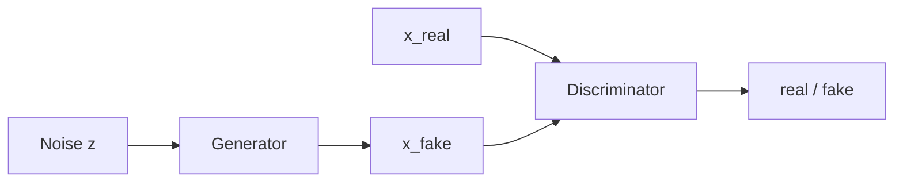

# 2.12 — Generative Adversarial Networks (GAN)

## 1. Intuition first
Two networks play a game: **Generator** $G$ tries to fake data; **Discriminator** $D$ tries to tell real from fake. When trained well, $G$ learns to produce samples indistinguishable from the training distribution.

## 2. Why the topic exists
Before diffusion, GANs were the state-of-the-art image generators. They introduced the idea of *learning distributions implicitly* via a min-max game.

## 3. What problem it solves
Sampling from complex, high-dimensional distributions (images, audio, tabular).

## 4. Mathematics

### 4.1 Original min-max objective (Goodfellow 2014)

$$
\min_G \max_D \mathbb{E}_{x\sim p_{\text{data}}}[\log D(x)] + \mathbb{E}_{z \sim p_z}[\log(1 - D(G(z)))]
$$

Non-saturating trick: train $G$ to maximize $\log D(G(z))$ instead.

### 4.2 Wasserstein GAN (WGAN)
Replace JS divergence with Wasserstein-1 distance; use a $K$-Lipschitz critic. WGAN-GP adds gradient penalty for Lipschitz constraint.

### 4.3 Conditional GAN
Condition on class or text: $G(z, y)$, $D(x, y)$.

### 4.4 CycleGAN
Two generators + two discriminators; cycle-consistency loss $\|F(G(x)) - x\|$ for unpaired image translation.

### 4.5 StyleGAN
Style-based generator with adaptive instance normalization; controls semantic attributes at different resolutions.

### 4.6 BigGAN
Class-conditional GAN scaled to ImageNet at high resolution.

## 5. Every formula explained
- Discriminator estimates $\log \tfrac{p_{\text{data}}}{p_g}$.
- Generator minimizes the divergence measured by $D$.
- WGAN's Earth-Mover distance provides smoother gradients everywhere.

## 6. Variables
$z$ latent noise; $x$ real data; $G, D$ networks; $y$ condition.

## 7. Algorithm — vanilla GAN training
1. Sample real $x$ and noise $z$.
2. Update $D$: maximize $\log D(x) + \log(1 - D(G(z)))$.
3. Update $G$: maximize $\log D(G(z))$.
4. Repeat.

Practical tips: use spectral normalization, TTUR (different LR for G/D), Adam betas (0.5, 0.999), label smoothing, avoid ReLU in D.

## 8. Simple example
Toy 2D GAN learns to sample from a Gaussian mixture; watch mode coverage vs mode collapse.

## 9. Real-world example
- StyleGAN2/3 for photorealistic faces.
- CycleGAN for horse-to-zebra.
- BigGAN for class-conditional ImageNet.
- ProGAN pioneering progressive-growing training.

## 10. Diagram


## 11. Implementation from scratch — DCGAN (PyTorch)
```python
import torch, torch.nn as nn

class Gen(nn.Module):
    def __init__(self, z=100, c=1, f=64):
        super().__init__()
        self.net = nn.Sequential(
            nn.ConvTranspose2d(z, f*4, 4, 1, 0, bias=False), nn.BatchNorm2d(f*4), nn.ReLU(True),
            nn.ConvTranspose2d(f*4, f*2, 4, 2, 1, bias=False), nn.BatchNorm2d(f*2), nn.ReLU(True),
            nn.ConvTranspose2d(f*2, f, 4, 2, 1, bias=False),   nn.BatchNorm2d(f),   nn.ReLU(True),
            nn.ConvTranspose2d(f, c, 4, 2, 1, bias=False), nn.Tanh(),
        )
    def forward(self, z): return self.net(z)

class Disc(nn.Module):
    def __init__(self, c=1, f=64):
        super().__init__()
        self.net = nn.Sequential(
            nn.Conv2d(c, f, 4, 2, 1, bias=False), nn.LeakyReLU(0.2, True),
            nn.Conv2d(f, f*2, 4, 2, 1, bias=False), nn.BatchNorm2d(f*2), nn.LeakyReLU(0.2, True),
            nn.Conv2d(f*2, f*4, 4, 2, 1, bias=False), nn.BatchNorm2d(f*4), nn.LeakyReLU(0.2, True),
            nn.Conv2d(f*4, 1, 4, 1, 0, bias=False), nn.Sigmoid(),
        )
    def forward(self, x): return self.net(x).view(-1)

# Training loop uses BCE loss with real=1, fake=0.
```

## 12. Implementation using libraries
Use `torch_fidelity` for FID; `stylegan3` / `diffusers` for pretrained generative models.

## 13. Time complexity
Similar to two CNN training loops per step.

## 14. Space complexity
Store both G and D weights + activations.

## 15. Advantages
Sharp samples; fast inference (single forward pass through G).

## 16. Disadvantages
Unstable training; mode collapse; sensitive hyperparameters; hard to evaluate.

## 17. Interview questions
1. Explain the GAN min-max objective.
2. Non-saturating vs original G loss.
3. Mode collapse — what and mitigations.
4. WGAN vs vanilla GAN.
5. Conditional GAN uses.
6. CycleGAN loss components.
7. FID vs Inception Score.
8. Spectral normalization — why?
9. TTUR — Two Time-scale Update Rule.
10. GAN vs Diffusion — trade-offs.

## 18. Common mistakes
- Wrong labels (label smoothing for D helps).
- Overpowered D → vanishing G gradient.
- Batch norm in D causes trouble; use spectral norm.

## 19. Optimization techniques
Spectral norm, TTUR, WGAN-GP, R1 regularization, progressive growing, PatchGAN discriminators.

## 20. Coding exercises
1. Train DCGAN on MNIST/CIFAR-10; log FID over epochs.
2. Reproduce a small StyleGAN on FFHQ-tiny.
3. Add spectral normalization.
4. Implement WGAN-GP.

## 21. Mini project
DCGAN on MNIST + FID evaluation + latent-space interpolation.

## 22. Medium project
CycleGAN horse↔zebra reproduction.

## 23. Advanced project
Conditional StyleGAN2 on CelebA-HQ with truncation-trick sampling; deploy demo.

## 24. Where it is used in industry
- Photorealistic avatars (StyleGAN).
- Data augmentation (medical imaging).
- Super-resolution (ESRGAN).
- Speech synthesis (WaveGAN, HiFi-GAN vocoders).

## 25. How companies use it
NVIDIA for graphics research; game / avatar startups; medical imaging (StyleGAN for augmentation).

## 26. When NOT to use it
- High-fidelity text-to-image tasks — diffusion dominates.
- Small data — GANs are unstable there.
