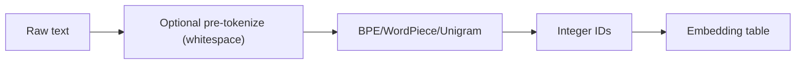

# 3.1 — Text Preprocessing & Tokenization (BPE, WordPiece, SentencePiece)

## 1. Intuition first
Neural networks eat vectors, not strings. Tokenization splits text into small units ("tokens") and maps them to integer IDs. Modern LLMs use **subword** tokenizers so that any word — even a new one — decomposes into known pieces.

## 2. Why the topic exists
- Word-level tokenization has huge vocabularies + OOV problems.
- Character-level has tiny vocab but long sequences.
- Subword (BPE/WordPiece/SentencePiece) hits the sweet spot.

## 3. What problem it solves
Compact, open-vocabulary, language-agnostic representation of text.

## 4. Mathematics / Algorithms

### 4.1 Byte-Pair Encoding (BPE) — Sennrich 2016
1. Start with characters (or bytes) as vocab.
2. Count all adjacent pair frequencies in the corpus.
3. Merge the most frequent pair into a new token.
4. Repeat $V - |base|$ times.

Applies deterministically at inference by greedy merges.

### 4.2 WordPiece (BERT)
Similar to BPE but picks the merge that maximizes likelihood under a unigram LM instead of pure frequency.

### 4.3 SentencePiece / Unigram LM (Kudo 2018)
Trains a unigram language model over subwords; prunes low-probability tokens. Operates on raw text (no pre-tokenization) — great for Asian languages.

### 4.4 Byte-level BPE (GPT-2/3/4)
Base vocab = 256 bytes → any Unicode string tokenizable; no unknown tokens ever.

### 4.5 Special tokens
`[CLS]`, `[SEP]`, `[MASK]`, `<|endoftext|>`, `<|user|>`, `<|assistant|>`, `<image>`, etc.

## 5. Every formula explained
- BPE greedy merge minimizes token count per corpus subject to vocab budget.
- Unigram LM: $p(\text{seg}) = \prod_i p(t_i)$; Viterbi finds the best segmentation.

## 6. Variables
$V$ vocab size; $t_i$ token; base vocabulary (chars or bytes).

## 7. Algorithm — BPE training
```
vocab = list of unique chars
tokens[word] = list of chars for each word (with </w> marker)
loop V - |base| times:
    count adjacent pairs across all words
    pick argmax pair (a, b)
    add 'ab' to vocab
    replace (a, b) with 'ab' in all words
```

## 8. Simple example
Corpus "low low lower low". Character tokens; frequent pair "l o" → merge into "lo"; then "lo w" → "low"; etc.

## 9. Real-world example
- GPT-2/3/4: byte-level BPE, ~50k / 100k vocab.
- BERT: WordPiece, ~30k vocab.
- LLaMA: SentencePiece BPE, 32k vocab.
- Whisper: byte-level BPE, multilingual.

## 10. Diagram


## 11. Implementation from scratch — minimal BPE
```python
from collections import Counter
def get_pairs(word): return list(zip(word, word[1:]))

def train_bpe(corpus, num_merges=100):
    vocab = Counter(" ".join(list(w) + ["</w>"]) for w in corpus)
    merges = []
    for _ in range(num_merges):
        pairs = Counter()
        for w, freq in vocab.items():
            symbols = w.split()
            for p in get_pairs(symbols): pairs[p] += freq
        if not pairs: break
        best = max(pairs, key=pairs.get); merges.append(best)
        merged = "".join(best)
        new_vocab = {}
        for w, freq in vocab.items():
            new_w = w.replace(" ".join(best), merged)
            new_vocab[new_w] = freq
        vocab = new_vocab
    return merges

def encode(word, merges):
    tokens = list(word) + ["</w>"]
    while True:
        pairs = get_pairs(tokens)
        best = None
        for m in merges:
            if m in pairs: best = m; break
        if best is None: break
        i = 0; new = []
        while i < len(tokens):
            if i < len(tokens) - 1 and (tokens[i], tokens[i+1]) == best:
                new.append(tokens[i] + tokens[i+1]); i += 2
            else:
                new.append(tokens[i]); i += 1
        tokens = new
    return tokens
```

## 12. Implementation using libraries
```python
from tokenizers import Tokenizer
from tokenizers.models import BPE
from tokenizers.trainers import BpeTrainer
tok = Tokenizer(BPE(unk_token="[UNK]"))
tok.train(["corpus.txt"], BpeTrainer(vocab_size=30000, special_tokens=["[UNK]","[PAD]","[CLS]","[SEP]"]))

# Or via HuggingFace transformers:
from transformers import AutoTokenizer
tk = AutoTokenizer.from_pretrained("meta-llama/Llama-3-8B")
tk("Hello world!", return_tensors="pt")
```

## 13. Time complexity
Training: O(#merges × #tokens). Encoding a document with pre-trained merges: near O(n).

## 14. Space complexity
O(|V|) for merges list.

## 15. Advantages
Open vocab; compact; language-agnostic; handles typos and rare words.

## 16. Disadvantages
Tokens are not linguistically meaningful; whitespace/casing subtleties; some languages tokenize more expensively (Chinese, code).

## 17. Interview questions
1. Compare BPE, WordPiece, Unigram.
2. Why byte-level BPE?
3. What is a token in GPT terms?
4. How does BPE handle unknown languages?
5. Explain SentencePiece vs pre-tokenized BPE.
6. What is a `[CLS]` token?
7. Why do LLMs have distinct pad and eos tokens?
8. Effect of vocab size on model size & quality.
9. How do chat templates use special tokens?
10. Token counting for cost estimation.

## 18. Common mistakes
- Forgetting to add BOS/EOS.
- Off-by-one when computing sequence length.
- Mismatched tokenizer between training and serving.
- Not stripping whitespace prefix in some models (space is part of the token).

## 19. Optimization techniques
Fast tokenizers (Rust `tokenizers`), pre-tokenize with regex, batched encoding, cache token counts.

## 20. Coding exercises
1. Train BPE on Wikipedia sample; visualize learned merges.
2. Implement decode.
3. Compare byte-level BPE vs SentencePiece on Japanese text.
4. Measure token-per-character ratio for code vs prose.

## 21. Mini project
Chat token-cost estimator: given a prompt + expected response length, estimate OpenAI API cost.

## 22. Medium project
Train a domain-specific SentencePiece tokenizer for legal or medical text; measure compression ratio vs GPT-2 tokenizer.

## 23. Advanced project
Reproduce Meta's Tiktoken byte-level BPE with regex pre-tokenizer in Python; benchmark vs `tiktoken`.

## 24. Where it is used in industry
Every LLM, chatbot, vector store, and search index.

## 25. How companies use it
- OpenAI's tiktoken.
- Google's SentencePiece.
- HuggingFace tokenizers library serves millions of daily requests.

## 26. When NOT to use it
- Character-level tasks (spell correction) may benefit from char models.
- DNA/audio have different vocab conventions.
