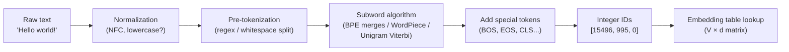
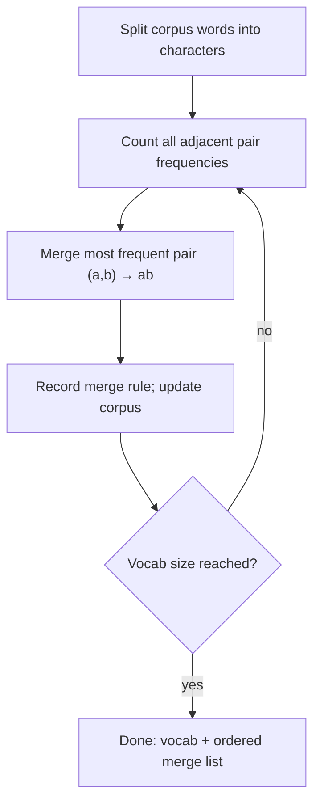
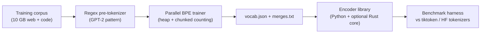

# 3.1 — Text Preprocessing & Tokenization (BPE, WordPiece, SentencePiece)

## 1. Overview

**What is it?** Tokenization is the process of converting raw text — a stream of Unicode characters — into a sequence of discrete integer IDs that a neural network can consume. A *tokenizer* consists of a vocabulary (a mapping from token strings to integers) and an algorithm for segmenting arbitrary text into tokens from that vocabulary.

**Why does it exist?** Neural networks operate on tensors of numbers, not strings. Something must bridge the gap between "Hello world!" and `[15496, 995, 0]`. The design of that bridge has enormous downstream consequences: it determines the model's effective vocabulary, its sequence lengths (and therefore cost), and how gracefully it handles rare words, typos, code, and non-English languages.

**What problem does it solve?** The core tension is between *word-level* tokenization (huge vocabularies, out-of-vocabulary failures on unseen words) and *character-level* tokenization (tiny vocabulary, but sequences become 4–5× longer and the model must relearn spelling from scratch). **Subword tokenization** — Byte-Pair Encoding (BPE), WordPiece, and the Unigram language model — hits the sweet spot: common words stay whole, rare words decompose into meaningful pieces, and *any* string can be encoded.

**Where is it used?** Every modern language model. GPT-2/3/4 use byte-level BPE; BERT uses WordPiece; LLaMA and T5 use SentencePiece; Whisper uses byte-level BPE for multilingual speech transcripts. Tokenization is also the unit of billing for every commercial LLM API, so understanding it is a practical necessity, not just an academic one.

## 2. Learning Objectives

After this chapter you will be able to:

- Explain why subword tokenization dominates over word-level and character-level approaches.
- Derive and implement the BPE training algorithm from scratch and apply learned merges at inference time.
- Explain how WordPiece's likelihood-based merge criterion differs from BPE's frequency-based criterion.
- Describe the Unigram LM tokenizer (SentencePiece) including its EM training loop and Viterbi segmentation.
- Explain why byte-level BPE guarantees zero unknown tokens and why GPT-family models use it.
- Enumerate the common special tokens (`[CLS]`, `[SEP]`, `[MASK]`, `<|endoftext|>`, BOS/EOS/PAD) and their roles.
- Apply chat templates correctly and explain how role markers are encoded as special tokens.
- Train a domain-specific tokenizer with the HuggingFace `tokenizers` library and measure its compression ratio.
- Estimate API costs from token counts and reason about vocabulary-size trade-offs.
- Diagnose classic tokenization bugs: mismatched tokenizers, missing BOS/EOS, leading-whitespace surprises.

## 3. Prerequisites

| Chapter | Why it is needed |
|---|---|
| [Python for AI](../phase-0-prerequisites/01-python-for-ai.md) | Dictionaries, counters, and string manipulation are the core tools for implementing tokenizers. |
| [Probability & Statistics](../phase-0-prerequisites/04-probability-statistics.md) | The Unigram LM tokenizer maximizes a likelihood; you need probability distributions and maximum likelihood estimation. |
| [Transformer Architecture](../phase-2-deep-learning/10-transformer.md) | Token IDs feed the embedding table of a Transformer; sequence length determines attention cost. |
| [Attention & Self-Attention](../phase-2-deep-learning/09-attention.md) | Attention cost is quadratic in the number of tokens, which is why tokenizer compression matters. |

The chapters that follow — [Word Embeddings](02-word-embeddings.md), [GPT Pretraining](05-gpt-pretraining.md), and [RAG](09-rag.md) — all consume tokenizer output, so this chapter is the true entry point to Phase 3.

## 4. Intuition

Think of tokenization as **choosing an alphabet for your model**. If your "alphabet" is entire words, you can express a sentence in very few symbols, but the alphabet contains hundreds of thousands of entries and still fails on "Grzegorz", "COVID-19", or "unfollowable". If your alphabet is single characters, you can spell anything, but every message becomes tediously long — like communicating in Morse code.

Subword tokenization is like **LEGO bricks**: instead of buying a pre-molded castle (word-level) or gluing together individual grains of plastic (character-level), you keep a box of medium-sized bricks. Common structures ("the", "ing", "tion") are single bricks because you use them constantly; rare structures get assembled from smaller bricks on demand.

Here is an everyday story. A barista learns regulars' orders as single units: "the-usual-for-Dave" is one chunk in her head. A brand-new customer's complicated order gets processed word by word. Occasionally someone orders something so unusual she has to write it letter by letter. Her mental "vocabulary" adapts so that *frequent things are cheap and rare things are still expressible* — exactly what BPE learns from corpus statistics: merge what co-occurs frequently into a single unit, leave the rest decomposed.

One more intuition: tokenization is **compression**. A good tokenizer represents typical text in fewer tokens, which means shorter sequences, cheaper attention, longer effective context, and lower API bills. In fact, BPE was originally a data-compression algorithm from 1994 before Sennrich et al. (2016) repurposed it for neural machine translation.

## 5. Real-world Motivation

- **OpenAI** built `tiktoken`, a fast Rust-backed byte-level BPE library, because tokenization is on the hot path of every API request; GPT-4o's ~200k-token vocabulary was expanded specifically to compress non-English languages better, cutting costs for international users.
- **Google** open-sourced **SentencePiece**, used by T5, ALBERT, mT5, and PaLM, because pre-tokenization by whitespace fails for Japanese, Chinese, and Thai, which do not use spaces.
- **Meta**'s LLaMA family uses SentencePiece BPE (32k vocab for LLaMA 2) and moved to a 128k tiktoken-style vocabulary for LLaMA 3, explicitly to improve multilingual compression and inference efficiency.
- **HuggingFace**'s `tokenizers` library (Rust core) serves the entire open-source ecosystem; slow Python tokenization was once a genuine bottleneck in training pipelines.
- **Anthropic, Cohere, Mistral** all bill by the token; product teams everywhere maintain token-count estimators to forecast costs and enforce context-window budgets.
- **Microsoft/GitHub Copilot** cares deeply about how code tokenizes: indentation, camelCase splits, and long identifiers directly affect how much code fits into the prompt window.

## 6. Mathematical Foundations

### 6.1 Notation

- $\mathcal{C}$ — the training corpus, a multiset of words (or raw text for SentencePiece).
- $\mathcal{V}$ — the vocabulary of tokens; $|\mathcal{V}| = V$ is the vocabulary size (a hyperparameter, typically 30k–200k).
- $\mathcal{B}$ — the base vocabulary (all characters, or all 256 bytes).
- $t_i$ — the $i$-th token in a segmentation of a string.
- $f(a, b)$ — corpus frequency of the adjacent token pair $(a, b)$.

### 6.2 BPE as greedy compression

BPE training performs exactly $V - |\mathcal{B}|$ merge operations. At each step it selects the pair with maximal frequency:

$$
(a^*, b^*) = \arg\max_{(a,b)} f(a, b)
$$

and adds the merged symbol $ab$ to the vocabulary. Each merge reduces the total corpus token count by $f(a^*, b^*)$ (every occurrence of the pair becomes one token instead of two). BPE is therefore a *greedy* algorithm that approximately minimizes the encoded corpus length subject to the vocabulary budget $V$. It is not globally optimal — greedy merges can block better later merges — but it is simple, deterministic, and works extremely well in practice.

### 6.3 WordPiece: likelihood-based merging

WordPiece (used by BERT) scores candidate merges not by raw frequency but by the improvement in corpus likelihood under a unigram language model. The score for merging $(a, b)$ is:

$$
\text{score}(a, b) = \frac{f(a, b)}{f(a)\, f(b)}
$$

where $f(a)$ and $f(b)$ are the individual token frequencies. This is (up to normalization) a pointwise mutual information criterion: it favors pairs that co-occur *more often than chance*, not just pairs that are frequent because both members are frequent. Intuitively, "q" + "u" merges early under WordPiece (they almost never appear apart) even though "e" + "s" might have higher raw counts.

### 6.4 Unigram LM (SentencePiece)

The Unigram tokenizer (Kudo, 2018) takes the opposite direction: start with a *large* seed vocabulary and prune it down. It models the probability of a segmentation $\mathbf{t} = (t_1, \dots, t_n)$ of a string $x$ as a product of independent token probabilities:

$$
P(\mathbf{t}) = \prod_{i=1}^{n} p(t_i), \qquad \sum_{t \in \mathcal{V}} p(t) = 1
$$

The probability of the string marginalizes over all valid segmentations $S(x)$:

$$
P(x) = \sum_{\mathbf{t} \in S(x)} P(\mathbf{t})
$$

Training alternates (an EM procedure):

1. **E-step:** with token probabilities fixed, compute expected token counts over all segmentations (or just the Viterbi-best segmentation in practice).
2. **M-step:** re-estimate $p(t)$ from those counts.
3. **Pruning:** remove the fraction of tokens (e.g. 20%) whose removal least reduces total corpus likelihood; repeat until $|\mathcal{V}| = V$.

At inference, the best segmentation is found with the **Viterbi algorithm** (dynamic programming over string positions):

$$
\text{best}(j) = \max_{i < j,\ x_{i:j} \in \mathcal{V}} \big[ \text{best}(i) + \log p(x_{i:j}) \big]
$$

where $\text{best}(j)$ is the log-probability of the best segmentation of the prefix $x_{1:j}$. A useful by-product: the Unigram model supports **subword regularization** — sampling from near-optimal segmentations during training as a data augmentation that improves robustness.

### 6.5 Byte-level BPE

Set $\mathcal{B} = \{0, \dots, 255\}$, the 256 possible byte values. Since every Unicode string has a UTF-8 byte encoding, *every string is tokenizable* and the `<unk>` token becomes unnecessary. The trade-off: a single non-Latin character may span 2–4 bytes, so unmerged foreign text can be expensive (up to 4 tokens per character before merges kick in).

> [!NOTE]
> Vocabulary size trades off three quantities: embedding-table parameters ($V \times d$ where $d$ is the embedding dimension), sequence compression (larger $V$ → fewer tokens per text), and softmax cost at the output layer. GPT-2 chose $V \approx 50{,}257$; LLaMA 3 and GPT-4o chose $V \approx 128\text{k}$–$200\text{k}$ as models and non-English usage grew.

## 7. Visual Explanation

The full pipeline from raw text to model input:



BPE training as a loop:



And how a word decomposes as merges are applied (ASCII):

```
"lower" → l o w e r </w>
        → lo w e r </w>      (merge l+o)
        → low e r </w>       (merge lo+w)
        → low er </w>        (merge e+r)
        → low er</w>         (merge er+</w>)
Final tokens: ["low", "er</w>"]
```

## 8. Algorithm

**BPE training:**

1. Split every word in the corpus into characters, appending an end-of-word marker `</w>` (so that "er" at word end differs from "er" mid-word).
2. Count the frequency of every adjacent symbol pair across the corpus (weighted by word frequency).
3. Find the most frequent pair $(a, b)$; add the merged symbol $ab$ to the vocabulary and append $(a, b)$ to the ordered merge list.
4. Replace every occurrence of $(a, b)$ in the corpus with $ab$.
5. Repeat steps 2–4 until $V - |\mathcal{B}|$ merges have been performed.

**BPE encoding (inference):** split the input word into base symbols, then repeatedly apply the *earliest-learned* merge rule that matches any adjacent pair, until no rule applies. This is deterministic: the merge order learned at training time fully determines segmentation.

```text
# ---- BPE TRAINING ----
vocab  = set(all characters in corpus) ∪ {"</w>"}
corpus = {word → list of chars + "</w>", with frequency}
merges = []
repeat (V - |vocab|) times:
    pairs = count adjacent pairs over corpus, weighted by word freq
    if pairs empty: break
    (a, b) = argmax_freq(pairs)
    merges.append((a, b));  vocab.add(a + b)
    replace every adjacent (a, b) with a+b in corpus

# ---- BPE ENCODING ----
tokens = chars(word) + ["</w>"]
loop:
    candidate = merge rule with LOWEST training index
                whose pair appears adjacently in tokens
    if none: break
    merge all occurrences of that pair in tokens
return tokens
```

## 9. Worked Example

**Tiny example by hand.** Corpus: `low low low lower newest newest` (word frequencies: low×3, lower×1, newest×2). Initial symbols per word:

| Word | Freq | Symbols |
|---|---|---|
| low | 3 | `l o w </w>` |
| lower | 1 | `l o w e r </w>` |
| newest | 2 | `n e w e s t </w>` |

Pair counts: `(l,o)`: 3+1=4, `(o,w)`: 4, `(w,</w>)`: 3, `(e,s)`: 2, `(s,t)`: 2, `(t,</w>)`: 2, `(n,e)`: 2, `(e,w)`: 2, `(w,e)`: 1+2=3, `(e,r)`: 1, `(r,</w>)`: 1.

- **Merge 1:** `(l,o)` → `lo` (count 4, ties broken by first seen). Words become `lo w </w>`, `lo w e r </w>`.
- **Merge 2:** `(lo,w)` → `low` (count 4). Words: `low </w>`, `low e r </w>`.
- **Merge 3:** `(low,</w>)` → `low</w>` (count 3). "low" is now a single token.
- **Merge 4:** `(e,s)` or `(n,e)`... `(e,s)` → `es` (count 2). Then `(es,t)` → `est`, `(est,</w>)` → `est</w>`, and "newest" becomes `n e w est</w>`.

After ~8 merges, encoding **"lowest"** (never seen in the corpus!) yields `low` + `est</w>` — two meaningful subwords, no unknown token. That is the whole magic of subword tokenization in one example.

**Realistic scale.** GPT-2's tokenizer was trained on ~40 GB of web text with $V = 50{,}257$ (256 bytes + ~50,000 merges + 1 special `<|endoftext|>`). Typical English prose encodes at ~1.3 tokens per word (~4 characters per token). The same tokenizer on Python code or on Thai text can be 2–4× less efficient — a key reason newer models retrain tokenizers on code-heavy, multilingual corpora.

## 10. Python from Scratch

A complete, working BPE trainer and encoder in pure Python (no ML libraries). This expands the minimal version with correct merge-priority encoding and a decoder.

```python
from collections import Counter

def train_bpe(corpus_words, num_merges=100):
    """Learn BPE merges from a list of words (may contain duplicates)."""
    # Represent each unique word as a tuple of symbols with an
    # end-of-word marker, keeping its corpus frequency.
    word_freq = Counter(corpus_words)                       # {"low": 3, ...}
    splits = {w: tuple(w) + ("</w>",) for w in word_freq}   # "low" -> ('l','o','w','</w>')

    merges = []                                             # ordered merge rules
    for _ in range(num_merges):
        # Count every adjacent symbol pair, weighted by word frequency.
        pair_counts = Counter()
        for w, freq in word_freq.items():
            syms = splits[w]
            for i in range(len(syms) - 1):
                pair_counts[(syms[i], syms[i + 1])] += freq
        if not pair_counts:                                 # nothing left to merge
            break
        best = max(pair_counts, key=pair_counts.get)        # most frequent pair
        merges.append(best)
        # Apply the merge to every word's symbol sequence.
        for w in splits:
            syms, out, i = splits[w], [], 0
            while i < len(syms):
                if i < len(syms) - 1 and (syms[i], syms[i + 1]) == best:
                    out.append(syms[i] + syms[i + 1])       # merged symbol
                    i += 2
                else:
                    out.append(syms[i]); i += 1
            splits[w] = tuple(out)
    return merges

def encode_word(word, merges):
    """Encode one word using learned merges, respecting training order."""
    # Rank = training index; earlier merges have priority (lower rank).
    rank = {pair: i for i, pair in enumerate(merges)}
    tokens = list(word) + ["</w>"]
    while len(tokens) > 1:
        # Find the adjacent pair with the LOWEST rank (earliest merge).
        pairs = [(rank.get((tokens[i], tokens[i+1]), float("inf")), i)
                 for i in range(len(tokens) - 1)]
        best_rank, i = min(pairs)
        if best_rank == float("inf"):                       # no applicable rule
            break
        tokens = tokens[:i] + [tokens[i] + tokens[i+1]] + tokens[i+2:]
    return tokens

def decode(tokens):
    """Invert encoding: concatenate and turn </w> back into spaces."""
    return "".join(tokens).replace("</w>", " ").strip()

corpus = ["low"] * 3 + ["lower"] + ["newest"] * 2
merges = train_bpe(corpus, num_merges=10)
print(merges[:4])
# [('l','o'), ('lo','w'), ('low','</w>'), ('e','s')]   (tie-breaks may vary)
print(encode_word("lowest", merges))
# ['low', 'est</w>']  -- an unseen word decomposes into known subwords
print(decode(encode_word("lowest", merges)))            # 'lowest'
```

Complexity: training is $O(M \cdot N)$ for $M$ merges over $N$ corpus symbols (production trainers use priority queues and incremental pair-count updates to avoid rescanning). Encoding one word of length $L$ is $O(L^2)$ worst case with this simple loop, near-linear with optimized implementations.

> [!WARNING]
> **Common bug:** during encoding, applying merges in *frequency* order or scanning `merges` in a loop and taking the first pair present (as many toy implementations do) can produce segmentations that differ from training. You must always apply the applicable rule with the **lowest training index** — that is what the `rank` dictionary enforces.

## 11. Library Implementation

Training a tokenizer with HuggingFace `tokenizers` (Rust-backed, production speed) and using pre-trained tokenizers via `transformers`:

```python
from tokenizers import Tokenizer
from tokenizers.models import BPE
from tokenizers.trainers import BpeTrainer
from tokenizers.pre_tokenizers import Whitespace

# 1) Build an empty BPE tokenizer; [UNK] covers symbols never seen in training.
tok = Tokenizer(BPE(unk_token="[UNK]"))
tok.pre_tokenizer = Whitespace()          # split on whitespace/punctuation first

# 2) Configure the trainer: target vocab size and reserved special tokens.
trainer = BpeTrainer(
    vocab_size=30_000,
    special_tokens=["[UNK]", "[PAD]", "[CLS]", "[SEP]", "[MASK]"],
)
tok.train(["corpus.txt"], trainer)        # single pass over the file(s)

enc = tok.encode("Tokenization is compression.")
print(enc.tokens)   # e.g. ['Token', 'ization', 'is', 'compression', '.']
print(enc.ids)      # e.g. [1247, 893, 145, 2210, 18]
```

```python
from transformers import AutoTokenizer

# Load the exact tokenizer a pre-trained model was trained with.
tk = AutoTokenizer.from_pretrained("gpt2")

out = tk("Hello world!", return_tensors="pt")
print(out.input_ids)        # tensor([[15496,   995,     0]])  shape (1, 3)
print(tk.convert_ids_to_tokens(out.input_ids[0]))
# ['Hello', 'Ġworld', '!']  <- 'Ġ' encodes the leading space (byte-level BPE)

# Chat templates: turn role-structured messages into one token stream.
chat_tk = AutoTokenizer.from_pretrained("HuggingFaceH4/zephyr-7b-beta")
messages = [
    {"role": "system", "content": "You are a helpful assistant."},
    {"role": "user", "content": "What is BPE?"},
]
prompt = chat_tk.apply_chat_template(messages, tokenize=False,
                                     add_generation_prompt=True)
print(prompt)
# <|system|>\nYou are a helpful assistant.</s>\n<|user|>\nWhat is BPE?</s>\n<|assistant|>\n
```

The `Ġ` prefix is worth internalizing: in GPT-2-style byte-level BPE, **the space belongs to the following token**, so `"world"` and `" world"` are *different tokens with different IDs*. Chat templates matter because a model fine-tuned with `<|user|>`/`<|assistant|>` markers will behave erratically if you prompt it with a different format.

## 12. Code Walkthrough

Tracing `tk("Hello world!", return_tensors="pt")` through a GPT-2 tokenizer and into a model:

| Tensor / value | Shape | Meaning |
|---|---|---|
| raw text | — | `"Hello world!"` (12 characters, 12 UTF-8 bytes) |
| pre-tokens | — | `["Hello", " world", "!"]` after regex pre-tokenization |
| byte symbols | — | each pre-token mapped to printable byte symbols (space → `Ġ`) |
| `input_ids` | `(1, 3)` | `[[15496, 995, 0]]` — batch of 1, sequence of 3 token IDs |
| `attention_mask` | `(1, 3)` | `[[1, 1, 1]]` — all positions are real (no padding) |
| embedding output | `(1, 3, 768)` | each ID looked up in the $50257 \times 768$ embedding table |

Expected behavior checks: `tk.decode([15496, 995, 0])` returns exactly `"Hello world!"` (byte-level BPE is lossless). Encoding `"hello world!"` (lowercase h) gives *different IDs* — tokenizers are case-sensitive unless a lowercasing normalizer was applied at training time. Padding a batch of unequal-length texts adds `pad_token_id` and zeros in `attention_mask`; GPT-2 famously ships with **no pad token**, so you must set `tk.pad_token = tk.eos_token` before batched inference — forgetting this is one of the most common HuggingFace errors.

## 13. Complexity Analysis

- **BPE training:** naive implementation is $O(M \cdot N)$ time for $M$ merges over a corpus of $N$ symbols, because each merge rescans the corpus. Optimized trainers maintain a max-heap of pair counts with incremental updates, making each merge roughly $O(f \log P)$ where $f$ is the merged pair's frequency and $P$ the number of distinct pairs. Space: $O(N + P)$.
- **BPE encoding:** with a rank table and a heap over adjacent pairs, encoding a word of length $L$ costs $O(L \log L)$; a document of $n$ characters encodes in effectively $O(n)$ — this is why Rust tokenizers process hundreds of MB/s.
- **Unigram/Viterbi encoding:** $O(n \cdot m)$ for text length $n$ and maximum token length $m$ (each position considers up to $m$ predecessor splits). Space $O(n)$ for the DP table.
- **Storage:** the merge list and vocabulary are $O(V)$ — a few MB even for 200k vocabularies, trivially cacheable in memory.

## 14. Advantages

- **Open vocabulary:** any string encodes without `<unk>` (byte-level guarantees this absolutely). Example: GPT-4 handles "Supercalifragilisticexpialidocious", hex dumps, and emoji without failure.
- **Compression:** frequent words become single tokens, so a 100-word paragraph costs ~130 tokens rather than ~500 characters — a 4× saving in attention cost, which is quadratic in sequence length.
- **Graceful degradation on rare words:** "unfollowable" → `un` + `follow` + `able`, and each piece carries transferable meaning learned from thousands of other words.
- **Language-agnostic training:** SentencePiece needs no language-specific rules — the same pipeline trained mT5's tokenizer on 101 languages.
- **Determinism and speed:** encoding is a pure function with no model inference; Rust implementations tokenize at GB/minute rates, negligible next to model compute.

## 15. Disadvantages

- **Tokens are not linguistic units:** "tokenization" may split as `token` + `ization`, but "strawberry" may split as `str` + `aw` + `berry` — which is why LLMs famously struggle to count the r's in "strawberry": the model never *sees* individual letters.
- **Multilingual inequity:** a tokenizer trained mostly on English can spend 3–5× more tokens per sentence on Burmese or Amharic, making the model slower, costlier, and effectively lower-context for those languages.
- **Whitespace and casing fragility:** `"word"`, `" word"`, `"Word"`, and `" Word"` are four different token sequences; prompts that differ only in a leading space can produce different model behavior.
- **Numbers tokenize inconsistently:** `1234` might be one token while `1235` is two (`12` + `35`), which partly explains arithmetic weaknesses in LLMs.
- **Frozen at training time:** you cannot change a model's tokenizer after pretraining without retraining or careful vocabulary-extension surgery; domain mismatch (e.g., medical text on a web tokenizer) permanently costs tokens.

## 16. Common Mistakes

- **Mismatched tokenizer and model.** Loading `bert-base-uncased` weights with a `bert-base-cased` tokenizer silently produces garbage predictions. *Fix:* always load both from the same checkpoint name.
- **Forgetting BOS/EOS/special tokens.** Many models expect a BOS token to start generation; `tokenizer(text)` vs `tokenizer(text, add_special_tokens=False)` differ. *Fix:* inspect `tk.decode(ids)` and confirm the exact string the model sees.
- **Ignoring the leading-space convention.** `tk.encode("world")` ≠ `tk.encode(" world")` in GPT-style tokenizers; naive string concatenation of prompt pieces creates unnatural token boundaries. *Fix:* concatenate strings first, then tokenize once.
- **Off-by-one context overflow.** Counting characters (or words) instead of tokens when checking against the context window; truncation then silently drops your instructions. *Fix:* count with the actual tokenizer, and reserve room for the generation.
- **No pad token / wrong padding side.** GPT-2-family models need `tk.pad_token = tk.eos_token`; decoder-only models generally need **left** padding for batched generation. *Fix:* set `tk.padding_side = "left"` for generation.
- **Hand-rolled chat formatting.** Writing `"User: ...\nAssistant:"` for a model trained on `<|im_start|>` markers degrades quality badly. *Fix:* always use `apply_chat_template`.

## 17. Best Practices

- [ ] Load tokenizer and model from the **same checkpoint**, and version them together in your model registry.
- [ ] Use `apply_chat_template` for all chat models; never hand-format roles.
- [ ] Budget context in **tokens**, not characters; enforce truncation policy explicitly (`truncation=True, max_length=...`) and decide *what* gets truncated (usually oldest history, never the system prompt).
- [ ] For batched decoder-only generation: set pad token, use left padding, and pass `attention_mask`.
- [ ] When training a domain tokenizer, hold out a validation corpus and report **fertility** (tokens per word) and bytes-per-token as the success metric.
- [ ] Use the Rust fast tokenizers (`use_fast=True`, default) and batched `tokenizer(list_of_texts)` calls in data pipelines.
- [ ] Log a few `decode(encode(x))` round-trips in CI to catch tokenizer drift between environments.
- [ ] For cost estimation against OpenAI APIs, use `tiktoken` with the correct encoding name (`o200k_base` for GPT-4o, `cl100k_base` for GPT-4/3.5).

## 18. Optimization Techniques

- **Fast (Rust) tokenizers:** HuggingFace fast tokenizers and `tiktoken` are 10–100× faster than pure-Python; always use them in training/serving paths.
- **Batched encoding with multiprocessing:** `datasets.map(tokenize_fn, batched=True, num_proc=8)` amortizes overhead; tokenize once and cache to disk (Arrow/parquet) rather than re-tokenizing every epoch.
- **Pre-tokenization regex:** GPT-2's regex splits text into word-like chunks before BPE, bounding per-chunk merge work and keeping encoding near-linear.
- **Token-count caching:** in RAG and chat systems, cache token counts per document/message so context-budget checks are $O(1)$ instead of re-encoding.
- **Vocabulary right-sizing:** larger vocabularies compress better but grow the embedding and output-softmax matrices ($2 \times V \times d$ parameters); for small models a 32k vocab is often optimal, while 100k+ pays off for large multilingual models.
- **Sequence packing:** concatenate multiple short training documents (separated by EOS) to fill the context window, eliminating pad-token waste — standard practice in LLM pretraining (see [GPT Pretraining](05-gpt-pretraining.md)).

## 19. Industry Applications

- **LLM APIs and billing:** OpenAI, Anthropic, and Google meter every request in tokens; `tiktoken` exists so customers can predict bills client-side.
- **Search and RAG:** chunking documents for [RAG](09-rag.md) is done in token units so chunks fit embedding-model limits; [vector databases](10-vector-databases.md) store token-bounded passages.
- **Machine translation:** Sennrich's original BPE paper (2016) targeted rare-word translation at Edinburgh; Google's GNMT adopted WordPiece; Meta's NLLB uses a 256k SentencePiece vocab across 200 languages.
- **Speech:** OpenAI's Whisper emits byte-level BPE tokens for multilingual transcripts, sharing the tokenizer machinery with GPT models.
- **Code assistants:** GitHub Copilot's prompt engineering revolves around fitting the most relevant code into a token budget; code-heavy tokenizers dedicate tokens to indentation runs.
- **Content moderation pipelines** at Meta and elsewhere tokenize billions of posts daily as the first stage of every classifier.

## 20. Interview Questions

### Beginner

**Q1: What is a token, and why don't models just use words?**
**A:** A token is the atomic unit a model consumes — an integer ID for a string piece (word, subword, or bytes). Word-level vocabularies explode in size (millions of forms across morphology and typos) and fail on unseen words; subword tokens keep the vocabulary small (30k–200k) while remaining able to encode any string.

**Q2: Walk through how BPE builds its vocabulary.**
**A:** Start with characters (or bytes). Repeatedly count all adjacent symbol pairs in the corpus, merge the most frequent pair into a new symbol, and record the merge rule. Stop when the vocabulary budget is reached. Encoding replays the merge rules in learned order.

**Q3: What does the `[CLS]` token do in BERT?**
**A:** It is a special token prepended to every input; its final hidden state serves as a pooled sentence representation used for classification heads. It carries no lexical meaning — its purpose is purely structural (see [BERT](04-bert.md)).

**Q4: Why do models have separate PAD and EOS tokens?**
**A:** EOS marks semantic end-of-text and is a legitimate prediction target; PAD merely fills batches to equal length and is masked out of both attention and loss. Conflating them (as a workaround in GPT-2) works only if the attention mask correctly hides padding.

**Q5: Roughly how many tokens is a 1,000-word English document under GPT-4's tokenizer?**
**A:** About 1,300 tokens — English averages ~1.3 tokens per word (~4 characters per token). Code, non-English text, and unusual formatting run higher.

### Intermediate

**Q1: Compare BPE, WordPiece, and Unigram LM.**
**A:** BPE greedily merges the most *frequent* pair (bottom-up). WordPiece also merges bottom-up but scores by likelihood gain $f(a,b)/(f(a)f(b))$, favoring strongly associated pairs. Unigram starts from a large candidate vocabulary and *prunes* top-down using EM on a unigram likelihood, with Viterbi segmentation at inference; it uniquely supports sampling multiple segmentations (subword regularization).

**Q2: Why did GPT-2 use byte-level BPE?**
**A:** With 256 bytes as the base alphabet, every UTF-8 string is representable, eliminating `<unk>` entirely and any need for Unicode-specific preprocessing. The cost is that rare scripts consume several byte tokens per character until merges compress them.

**Q3: What is tokenizer fertility and why does it matter for multilingual models?**
**A:** Fertility is average tokens per word (or per character). High fertility for a language means longer sequences: slower inference, higher cost, and less effective context. Modern multilingual models expand vocabularies (LLaMA 3: 128k) mainly to lower fertility on non-English text.

**Q4: Why must you use a chat template rather than formatting roles yourself?**
**A:** Instruction-tuned models were trained with exact special-token patterns (e.g., `<|im_start|>user`). Any deviation is out-of-distribution: the model may fail to stop (missing EOS pattern), leak role markers into output, or ignore the system prompt.

**Q5: How does SentencePiece handle languages without whitespace?**
**A:** It skips pre-tokenization entirely, treating the raw text (with spaces replaced by a meta-symbol `▁`) as a symbol stream, so segmentation is learned purely from statistics — no language-specific word splitter needed.

### Advanced

**Q1: How does vocabulary size interact with model scaling?**
**A:** Embedding + unembedding cost $2Vd$ parameters. For a 125M-parameter model, a 200k vocab at $d=768$ would consume ~300M parameters — absurd; for a 70B model it is negligible while improving compression and effective context. Optimal $V$ grows with model size and multilingual coverage; research (e.g., on vocabulary scaling laws) suggests most production models are under-vocabularied.

**Q2: Explain subword regularization and when it helps.**
**A:** Under a Unigram model, a string admits many segmentations with computable probabilities; sampling segmentations during training (instead of always Viterbi) acts as data augmentation, exposing the model to alternative decompositions. It measurably improves low-resource MT and robustness to noisy text. BPE-dropout achieves a similar effect for BPE by randomly skipping merges.

**Q3: What are "glitch tokens"?**
**A:** Tokens present in the vocabulary (learned from training-corpus artifacts, e.g., Reddit usernames like `SolidGoldMagikarp` in GPT-2's vocab) whose embeddings were rarely or never updated during model training because the strings were filtered out of the pretraining data. Prompting with them yields erratic behavior — a cautionary tale about tokenizer/pretraining-corpus mismatch.

**Q4: How would you extend a pretrained model's tokenizer for a new domain or language?**
**A:** Train new merges/pieces on domain text, add the new tokens to the vocabulary, resize the embedding matrix, and initialize new rows (mean of subword-constituent embeddings works better than random). Then continue pretraining so the new embeddings integrate. Risks: distribution shift, and the output softmax also needs new rows.

**Q5: Why do tokenizers hurt LLM arithmetic and spelling, and what are the mitigations?**
**A:** Multi-digit numbers and words are opaque single tokens, so the model can't directly access digits/letters. Mitigations: single-digit tokenization for numbers (LLaMA), right-to-left digit grouping, character-level scratchpads via prompting, or byte-level models (ByT5) that trade sequence length for character access.

## 21. Coding Exercises

### Easy

1. **Round-trip check.** Using any HuggingFace tokenizer, write a function that verifies `decode(encode(x)) == x` on 1,000 random Wikipedia sentences and reports failures. *Hint:* watch for normalization (lowercasing, NFC) — which tokenizers are lossless?
2. **Token cost calculator.** Given a prompt string and an expected completion length, compute the dollar cost for GPT-4o using `tiktoken`. *Hint:* `tiktoken.encoding_for_model("gpt-4o")`.

### Medium

1. **Implement BPE decode + merge visualization.** Extend the from-scratch trainer in Section 10 to print, for a given word, each merge step applied in order. *Hint:* record `(pair, position)` at every loop iteration of `encode_word`.
2. **Fertility benchmark.** Compare tokens-per-character of GPT-2's tokenizer vs `xlm-roberta-base` on English, German, Japanese, and Python code samples; present a table. *Hint:* fertility differences of 2× or more are expected on Japanese.
3. **Regex pre-tokenizer.** Reimplement GPT-2's pre-tokenization regex and confirm your splits match `tk.backend_tokenizer.pre_tokenizer.pre_tokenize_str`. *Hint:* the pattern handles contractions (`'s`, `'ll`) as separate chunks.

### Hard

1. **Unigram Viterbi encoder.** Given a vocabulary with log-probabilities (extract one from a SentencePiece model file), implement Viterbi segmentation and verify it matches SentencePiece's output on 100 sentences. *Hint:* DP over end positions; store backpointers.
2. **Heap-based fast BPE trainer.** Rewrite the Section 10 trainer with a priority queue and incremental pair-count updates; benchmark against the naive version on 10 MB of text. *Hint:* lazily invalidate stale heap entries instead of deleting them.

## 22. Mini Project

**Chat token-cost estimator.** Build a CLI tool that, given a conversation history (JSON of role/content messages) and a target model, reports the exact prompt token count and estimated cost.

1. Install `tiktoken` and `transformers`; load the encoding for the chosen model.
2. Implement message-overhead accounting: each chat message carries a few tokens of template overhead (role markers, separators) — measure it empirically by encoding with and without `apply_chat_template`.
3. Sum prompt tokens, add a user-supplied expected completion length, and multiply by per-token prices (keep prices in a small config dict).
4. Add a `--budget` flag that warns when the conversation approaches the model's context window and suggests how many oldest messages to drop.
5. Validate against the usage numbers returned by a real API call (if you have a key) or against `tiktoken` reference counts.

## 23. Medium Project

**Domain-specific tokenizer for legal or medical text.**

1. Collect a domain corpus (e.g., 100 MB of PubMed abstracts or EDGAR filings) and a general-domain validation set.
2. Train three tokenizers with HuggingFace `tokenizers`: BPE, WordPiece, and Unigram, each at $V = 32{,}000$, on the domain corpus.
3. Measure fertility (tokens/word) and bytes-per-token of each tokenizer on domain text vs the GPT-2 tokenizer; tabulate results.
4. Inspect the top 200 learned tokens — verify domain terms ("plaintiff", "myocardial") became single tokens.
5. Quantify the practical win: for a fixed 4,096-token context, how many more words of a legal contract fit with the domain tokenizer?
6. Write up the trade-off: a custom tokenizer requires pretraining a model from scratch (or vocabulary surgery), so the compression gain must justify that cost.

## 24. Advanced Project

**Reproduce a tiktoken-class byte-level BPE tokenizer and benchmark it.**

*Architecture:*



*Implementation phases:*

1. **Byte mapping:** implement GPT-2's byte-to-unicode printable mapping so merges operate on visible symbols.
2. **Pre-tokenization:** port the GPT-2 regex; unit-test against HuggingFace's output on adversarial strings (emoji, mixed scripts, code).
3. **Scalable training:** count pairs in parallel across corpus shards (multiprocessing), aggregate, and run heap-based merging to 50k merges.
4. **Fast encoding:** implement rank-table encoding with per-chunk memoization (identical pre-tokens encode once); target >10 MB/s in Python.
5. **Benchmark:** measure throughput and output-identity against `tiktoken` and HF fast tokenizers on 1 GB of held-out text; profile hotspots.

*Possible improvements:* a Rust or Cython core; BPE-dropout support for training-time regularization; vocabulary-extension tooling that initializes new embedding rows from constituent subwords; a fertility dashboard across 20 languages.

## 25. Summary

- Tokenization converts text to integer IDs; its design controls vocabulary size, sequence length, cost, and multilingual fairness.
- Subword methods (BPE, WordPiece, Unigram) dominate because they combine open vocabulary with strong compression.
- BPE greedily merges the most frequent adjacent pair for $V - |\mathcal{B}|$ steps; encoding replays merges in training order.
- WordPiece scores merges by likelihood gain ($\approx$ pointwise mutual information); Unigram prunes a large vocab via EM and segments with Viterbi.
- Byte-level BPE (GPT-2/3/4) uses 256 bytes as the base alphabet, guaranteeing no unknown tokens for any string.
- Special tokens (`[CLS]`, `[SEP]`, `[MASK]`, BOS/EOS/PAD) are structural; chat templates encode conversation roles and must match the model's training format exactly.
- Vocabulary size trades embedding parameters against compression; modern large models use 100k–200k vocabularies.
- Tokens are not letters: spelling, counting, and arithmetic weaknesses of LLMs trace directly to tokenization.
- The most damaging production bugs are mismatched tokenizer/model pairs, missing pad tokens, and hand-rolled chat formats.
- Always measure fertility when working with non-English text or code — it silently multiplies your costs.

## 26. Cheat Sheet

| Concept | Formula / fact |
|---|---|
| BPE merge choice | $(a^*,b^*) = \arg\max f(a,b)$ |
| WordPiece score | $f(a,b) / (f(a) f(b))$ |
| Unigram segmentation prob. | $P(\mathbf{t}) = \prod_i p(t_i)$; best split via Viterbi |
| English fertility | ~1.3 tokens/word, ~4 chars/token |
| GPT-2 vocab | 50,257 (256 bytes + 50k merges + `<|endoftext|>`) |
| LLaMA 2 / LLaMA 3 vocab | 32k SentencePiece / 128k tiktoken-style |
| Embedding params | $V \times d$ (plus $V \times d$ unembedding if untied) |

**Defaults:** vocab 32k (small/mono-lingual) to 128k+ (large/multilingual); reserve special tokens *before* training; `use_fast=True`; left-padding for decoder-only generation.

**One-liners:** the space belongs to the next token (`Ġ`); `decode(encode(x))` should round-trip; count budgets in tokens, never characters; use `apply_chat_template`, always.

**Gotchas:** GPT-2 has no pad token; `add_special_tokens=False` changes IDs; numbers split inconsistently; identical-looking Unicode (NFC vs NFD) tokenizes differently.

## 27. Further Reading

**Books**
- Jurafsky & Martin, *Speech and Language Processing* (3rd ed. draft) — Ch. 2 covers tokenization and BPE.
- Tunstall, von Werra & Wolf, *Natural Language Processing with Transformers* — practical tokenizer chapters.

**Research Papers**
- Sennrich, Haddow & Birch (2016), "Neural Machine Translation of Rare Words with Subword Units" — the BPE-for-NMT paper.
- Kudo (2018), "Subword Regularization: Improving Neural Network Translation Models with Multiple Subword Candidates" — Unigram LM.
- Kudo & Richardson (2018), "SentencePiece: A simple and language independent subword tokenizer".
- Radford et al. (2019), "Language Models are Unsupervised Multitask Learners" (GPT-2) — byte-level BPE.
- Provilkov et al. (2020), "BPE-Dropout: Simple and Effective Subword Regularization".
- Xue et al. (2022), "ByT5: Towards a token-free future with pre-trained byte-to-byte models".

**Documentation**
- HuggingFace Tokenizers documentation and the "Summary of the tokenizers" guide in Transformers docs.
- OpenAI `tiktoken` README and the OpenAI tokenizer web playground.

**GitHub Repositories**
- `openai/tiktoken` — fast byte-level BPE.
- `google/sentencepiece` — the reference Unigram/BPE trainer.
- `huggingface/tokenizers` — Rust-core tokenizers.
- `karpathy/minbpe` — minimal, educational BPE implementation.

**Datasets**
- WikiText-103, OpenWebText, The Pile — standard corpora for tokenizer training experiments.

**YouTube / Videos**
- Andrej Karpathy, "Let's build the GPT Tokenizer" — a complete from-scratch walkthrough.

**Blogs**
- HuggingFace course chapter on tokenizers; the "SolidGoldMagikarp" glitch-token posts (LessWrong) for a fascinating failure study.
