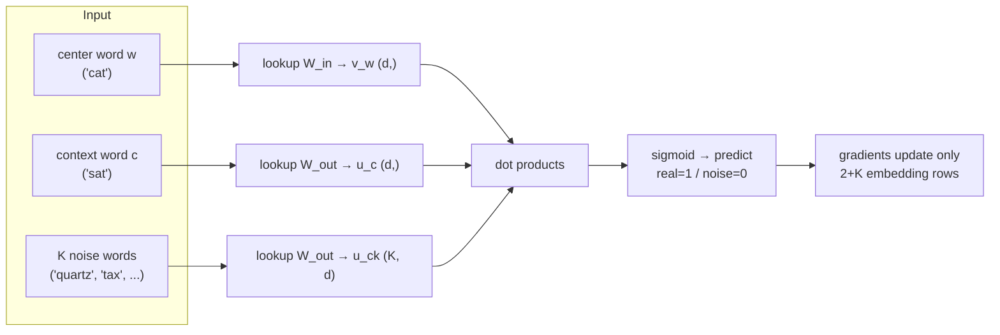
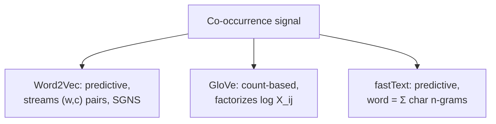
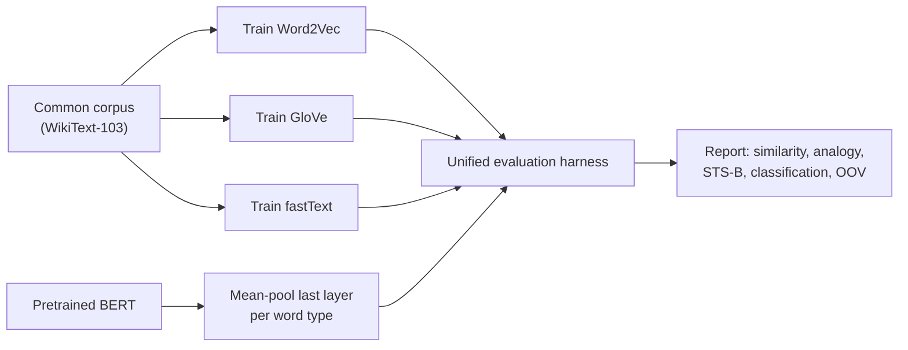

# 3.2 — Word Embeddings (Word2Vec, GloVe, fastText)

## 1. Overview

**What is it?** A word embedding is a dense, low-dimensional vector (typically 50–300 numbers) that represents a word such that geometric relationships between vectors mirror semantic relationships between words: similar words are close, and some relations map to consistent vector offsets — famously $v_{\text{king}} - v_{\text{man}} + v_{\text{woman}} \approx v_{\text{queen}}$.

**Why does it exist?** Before embeddings, words were represented as one-hot vectors: a vocabulary-sized vector with a single 1. One-hot vectors are enormous ($|V|$ dimensions) and *pairwise orthogonal* — "cat" is exactly as far from "kitten" as from "carburetor". No similarity information whatsoever. Embeddings fix this by *learning* representations from how words co-occur in large corpora, operationalizing the distributional hypothesis: "you shall know a word by the company it keeps" (Firth, 1957).

**What problem does it solve?** Embeddings give every downstream model — classifiers, taggers, recommenders — a compact input feature that already encodes meaning. Between 2013 and 2018 they were *the* transfer-learning mechanism in NLP: pretrain on billions of words once, reuse everywhere. They remain relevant today as the conceptual ancestor of every embedding layer in a Transformer, and as a fast, cheap technique for recommendation systems (item2vec) and lightweight retrieval.

**Where is it used?** Word2Vec, GloVe, and fastText power (or powered) search query understanding, recommender systems at Airbnb and Spotify, spam filters, and countless production classifiers. Even though contextual models ([BERT](04-bert.md)) superseded static embeddings for most NLP tasks, the skip-gram trick applied to *non-text sequences* (products, songs, listings) is still a workhorse of industrial ML.

## 2. Learning Objectives

After this chapter you will be able to:

- Explain why one-hot representations fail and how the distributional hypothesis motivates learned embeddings.
- Derive the skip-gram objective with full softmax, explain why it is intractable, and derive the negative-sampling approximation step by step, including its gradients.
- Contrast skip-gram with CBOW and state when each is preferable.
- Explain the unigram$^{3/4}$ noise distribution and frequent-word subsampling, and why each matters.
- Derive the GloVe objective from co-occurrence ratios and explain the weighting function $f(X_{ij})$.
- Explain how fastText composes word vectors from character n-grams and why that solves out-of-vocabulary words.
- Solve word analogies with vector arithmetic and articulate the limits of the analogy property.
- Implement skip-gram with negative sampling from scratch in NumPy and train it with gensim/PyTorch.
- Apply the skip-gram trick to non-text data (item2vec) for recommendations.
- Choose between static embeddings and contextual embeddings for a given production task.

## 3. Prerequisites

| Chapter | Why it is needed |
|---|---|
| [Linear Algebra](../phase-0-prerequisites/02-linear-algebra.md) | Dot products, cosine similarity, and matrix factorization are the language of embedding spaces. |
| [Calculus](../phase-0-prerequisites/03-calculus.md) | We derive gradients of the negative-sampling loss by hand. |
| [Probability & Statistics](../phase-0-prerequisites/04-probability-statistics.md) | Softmax distributions, expectations, and sampling from a noise distribution. |
| [Backpropagation](../phase-2-deep-learning/02-backpropagation.md) | Embedding training is SGD on a shallow network; you need gradient descent mechanics. |
| [Tokenization](01-tokenization.md) | Embeddings are indexed by token IDs; the tokenizer defines what a "word" is. |

This chapter also sets up [Seq2Seq](03-seq2seq.md) and [BERT](04-bert.md), which replace *static* per-word vectors with *contextual* ones.

## 4. Intuition

Imagine organizing every book in a giant library not alphabetically, but **by meaning on a map**: cookbooks cluster in one corner, thrillers in another, and within the cookbook corner, Italian and French cuisine sit side by side. Once books have map coordinates, "find me something similar" becomes "look at the neighbors" — pure geometry. Word embeddings do exactly this for words: each word gets coordinates in a ~300-dimensional space, learned so that words appearing in similar contexts end up nearby.

How can a machine learn the coordinates without a librarian? Here is the everyday story. Suppose you repeatedly overhear sentences with a word you don't know: "I poured a glass of ___", "the ___ was chilled", "this ___ pairs well with fish". Even without a dictionary you'd guess the mystery word behaves like *wine*. You inferred meaning purely from **context**. Word2Vec mechanizes this: it slides a window over billions of sentences and trains a tiny model to predict a word's neighbors. Words that are predictable from the same neighborhoods are forced to share similar vectors — that is the entire trick.

The analogy property falls out naturally. If the corpus systematically uses "king" in royal-and-male contexts and "queen" in royal-and-female contexts, then the *difference* between their vectors captures the gender direction, and the same difference appears between "man" and "woman". Directions in the space become reusable concepts — gender, plurality, country-capital, verb tense.

> [!NOTE]
> No one tells the model what "gender" or "royalty" is. These directions emerge purely from co-occurrence statistics — one of the most striking examples of unsupervised structure discovery in machine learning.

## 5. Real-world Motivation

- **Google** released Word2Vec (Mikolov et al., 2013, at Google) and used embedding techniques in search query understanding; GloVe came from Stanford in 2014 and became the default pretrained vector set for a generation of models.
- **Airbnb** published a well-known paper on listing embeddings: they trained skip-gram on sequences of listings users clicked in a session, so listings "co-occurring" in browsing behavior embed nearby — powering similar-listing recommendations and search ranking.
- **Spotify** applied the same idea to songs in playlists (informally "song2vec"): songs that appear in similar playlist contexts get similar vectors, enabling radio/recommendation features.
- **Meta (Facebook)** built fastText, which serves both as an embedding method and an extremely fast text classifier; it shipped pretrained vectors for 157 languages and was widely used for language identification and content classification.
- **Amazon and e-commerce ad-tech** broadly use prod2vec-style embeddings from co-viewed/co-purchased sequences for "customers also viewed" candidate generation.
- **Twitter/X** has used embedding representations of users and content for follow suggestions and timeline candidate retrieval.

The pattern to internalize: *anything that occurs in sequences with meaningful co-occurrence — words, products, songs, videos, user actions — can be embedded with the same machinery.*

## 6. Mathematical Foundations

### 6.1 Setup and notation

- $V$ — vocabulary size; $d$ — embedding dimension (e.g., 300).
- $v_w \in \mathbb{R}^d$ — "input" (center) embedding of word $w$; rows of matrix $W_{\text{in}} \in \mathbb{R}^{V \times d}$.
- $u_c \in \mathbb{R}^d$ — "output" (context) embedding of word $c$; rows of $W_{\text{out}} \in \mathbb{R}^{V \times d}$. Two separate tables stabilize training.
- $\sigma(z) = 1/(1+e^{-z})$ — the sigmoid function.
- $X_{ij}$ — number of times word $j$ occurs in the context window of word $i$ over the whole corpus (GloVe's co-occurrence matrix).
- $K$ — number of negative samples per positive pair.

### 6.2 Skip-gram with full softmax

Given a corpus $w_1, \dots, w_T$ and window size $m$, skip-gram maximizes the probability of each context word given its center word:

$$
J(\theta) = \frac{1}{T} \sum_{t=1}^{T} \sum_{\substack{-m \le j \le m \\ j \ne 0}} \log P(w_{t+j} \mid w_t)
$$

with the softmax parameterization

$$
P(c \mid w) = \frac{\exp(u_c^\top v_w)}{\sum_{c'=1}^{V} \exp(u_{c'}^\top v_w)}
$$

The numerator rewards a high dot product between the center vector and the true context vector; the denominator normalizes over the *entire vocabulary*. That denominator is the problem: every SGD step costs $O(Vd)$ — millions of operations per training pair. With billions of pairs, full softmax is intractable.

### 6.3 Negative sampling: derivation

Negative sampling (SGNS) replaces the multiclass problem "which word is the context?" with $1 + K$ binary problems: "is this (center, candidate) pair real or noise?" Define the label $D=1$ for observed pairs and $D=0$ for noise pairs, and model

$$
P(D = 1 \mid w, c) = \sigma(u_c^\top v_w)
$$

For each observed pair $(w, c)$ we draw $K$ noise words $c_1, \dots, c_K \sim P_n$ and maximize:

$$
\mathcal{L}(w, c) = \log \sigma(u_c^\top v_w) + \sum_{k=1}^{K} \mathbb{E}_{c_k \sim P_n} \left[ \log \sigma(-u_{c_k}^\top v_w) \right]
$$

The first term pushes the true pair's dot product up ($\sigma \to 1$); the second pushes random pairs' dot products down (note $\sigma(-z) = 1 - \sigma(z)$). Each step now costs $O((1+K)d)$ instead of $O(Vd)$ — with $K=5$ and $V=10^6$, a ~100,000× speedup.

**Gradients (worked out).** Let $s = u_c^\top v_w$. Using $\frac{d}{ds}\log\sigma(s) = 1 - \sigma(s) = \sigma(-s)$:

$$
\frac{\partial \mathcal{L}}{\partial u_c} = (1 - \sigma(s))\, v_w, \qquad
\frac{\partial \mathcal{L}}{\partial u_{c_k}} = -\sigma(u_{c_k}^\top v_w)\, v_w
$$

$$
\frac{\partial \mathcal{L}}{\partial v_w} = (1 - \sigma(s))\, u_c - \sum_{k=1}^{K} \sigma(u_{c_k}^\top v_w)\, u_{c_k}
$$

Every symbol is a $d$-vector; each update touches only $2 + K$ rows of the embedding tables. Levy & Goldberg (2014) proved that SGNS implicitly factorizes the matrix of shifted pointwise mutual information, $\text{PMI}(w,c) - \log K$ — connecting neural embeddings to classical count-based methods.

**Noise distribution.** Mikolov et al. found that sampling negatives from the smoothed unigram distribution

$$
P_n(c) \propto \text{count}(c)^{3/4}
$$

outperforms both the raw unigram ($\alpha=1$, oversamples "the"/"of") and uniform ($\alpha=0$, oversamples ultra-rare words). The $3/4$ power flattens the distribution just enough that mid-frequency, informative words serve as negatives.

**Subsampling frequent words.** Each corpus token $w$ is *discarded* during training with probability

$$
P_{\text{discard}}(w) = 1 - \sqrt{\frac{t}{f(w)}}
$$

where $f(w)$ is the word's corpus frequency and $t \approx 10^{-5}$ is a threshold. This removes most instances of "the", "a", "of" — which carry little signal — speeding training 2–10× and measurably improving vector quality for rare words.

### 6.4 CBOW

Continuous Bag-of-Words inverts the prediction: average the context vectors $\bar{v} = \frac{1}{2m}\sum_{j} v_{w_{t+j}}$ and predict the *center* word from $\bar{v}$. CBOW is several times faster (one prediction per window instead of $2m$) and slightly better on frequent words; skip-gram is better on rare words and small corpora because each rare occurrence generates $2m$ training pairs rather than being averaged away.

### 6.5 GloVe

GloVe (Pennington, Socher & Manning, 2014) starts from a global observation: *ratios* of co-occurrence probabilities encode meaning. For $i=\text{ice}, j=\text{steam}$: probes like $k=\text{solid}$ give $P_{ik}/P_{jk} \gg 1$, $k=\text{gas}$ gives $\ll 1$, and irrelevant $k=\text{fashion}$ gives $\approx 1$. Requiring the model to encode these ratios with vector differences and dot products, and requiring symmetry between words and contexts, leads (after a short derivation) to the target:

$$
w_i^\top \tilde{w}_j + b_i + \tilde{b}_j = \log X_{ij}
$$

where $w_i, \tilde{w}_j \in \mathbb{R}^d$ are word and context vectors and $b_i, \tilde{b}_j$ are scalar biases absorbing marginal frequencies. GloVe minimizes the weighted least-squares objective:

$$
J = \sum_{i,j:\, X_{ij} > 0} f(X_{ij}) \left( w_i^\top \tilde{w}_j + b_i + \tilde{b}_j - \log X_{ij} \right)^2
$$

with weighting function

$$
f(x) = \begin{cases} (x / x_{\max})^{0.75} & x < x_{\max} \\ 1 & \text{otherwise} \end{cases}, \qquad x_{\max} = 100
$$

$f$ does two jobs: it zeroes out unobserved pairs (avoiding $\log 0$) and caps the influence of extremely frequent pairs like ("the", "of"). After training, $w_i + \tilde{w}_i$ is used as the final vector. GloVe is thus an explicit *matrix factorization* of the log co-occurrence matrix, trained once from aggregated global counts, whereas Word2Vec streams over the corpus.

### 6.6 fastText

fastText (Bojanowski et al., 2016) represents each word as the sum of embeddings of its character n-grams (n = 3–6) plus the word itself. With boundary markers, *where* = `<where>` yields 3-grams `<wh, whe, her, ere, re>`, etc. The scoring function inside the same SGNS objective becomes:

$$
s(w, c) = \sum_{g \in \mathcal{G}_w} z_g^\top u_c
$$

where $\mathcal{G}_w$ is the set of n-grams of $w$ and $z_g$ their embeddings (hashed into a fixed number of buckets, e.g. 2M, to bound memory). Consequences: morphologically related words ("teach", "teacher", "teaching") share parameters, and **out-of-vocabulary words get non-trivial vectors** by summing their n-grams — invaluable for typos, rare inflections, and morphologically rich languages like Finnish or Turkish.

### 6.7 Analogies

The analogy "$a$ is to $b$ as $c$ is to ?" is solved by

$$
\hat{d} = \arg\max_{x \in V \setminus \{a,b,c\}} \cos\!\left(v_x,\; v_b - v_a + v_c\right)
$$

where $\cos(u,v) = \frac{u^\top v}{\|u\|\|v\|}$. Excluding the query words matters: $v_b - v_a + v_c$ is usually closest to $v_c$ itself, so naive implementations "solve" nothing. Analogies work best for frequent words and consistent relations (capitals, gender, tense); they degrade for abstract or polysemous relations.

## 7. Visual Explanation

Skip-gram with negative sampling, one training step:



The geometry that training produces (ASCII sketch of a 2-D projection):

```
        royalty ↑
                |        king ●
                |            \  (gender offset)
                |             ● queen
                |
    man ●       |
        \       |
         ● woman|
   ─────────────+──────────────→  gender
      v_king − v_man ≈ v_queen − v_woman
```

And the three model families at a glance:



## 8. Algorithm

**Skip-gram with negative sampling — training:**

1. Tokenize the corpus; build the vocabulary and word frequencies; drop words rarer than `min_count`.
2. Precompute the negative-sampling table from $P_n(c) \propto \text{count}(c)^{3/4}$.
3. For each position $t$: possibly discard $w_t$ via frequent-word subsampling; otherwise draw a window radius $r \sim \text{Uniform}(1, m)$ (dynamic windows weight near words more).
4. For each context word $c$ within $r$ of $w_t$: form the positive pair $(w_t, c)$ and sample $K$ negatives from the table.
5. Compute sigmoid scores, then apply the SGD updates from §6.3 to $v_{w_t}$, $u_c$, and the $K$ negative rows.
6. Linearly decay the learning rate from `lr` to ~`lr/10000` over training; run 3–15 epochs.

```text
# Pseudocode: SGNS training
build vocab, counts; make neg_table with prob ∝ count^0.75
for epoch in 1..E:
    for t, w in enumerate(corpus):
        if rand() < 1 - sqrt(t_thresh / freq(w)): continue   # subsample
        r = randint(1, window)
        for c in corpus[t-r : t+r+1], c != w:
            pos_update(v[w], u[c])                # label 1
            for k in 1..K:
                n = neg_table.sample()
                neg_update(v[w], u[n])            # label 0

pos_update(v, u):  g = sigmoid(u·v) - 1; u -= lr*g*v; v -= lr*g*u_old
neg_update(v, u):  g = sigmoid(u·v);     u -= lr*g*v; v -= lr*g*u_old
```

**Inference/lookup:** after training, discard $W_{\text{out}}$ (or average the two tables) and use rows of $W_{\text{in}}$ as word vectors; similarity = cosine.

## 9. Worked Example

**Tiny example by hand.** Let $d = 2$, learning rate $\eta = 0.5$, one positive pair (center "cat", context "sat") and one negative ("cat", "tax"). Initial vectors:

$$
v_{\text{cat}} = (0.5,\ 0.5), \quad u_{\text{sat}} = (0.4,\ -0.2), \quad u_{\text{tax}} = (0.6,\ 0.1)
$$

*Positive pair:* $s = u_{\text{sat}}^\top v_{\text{cat}} = 0.4 \cdot 0.5 + (-0.2)(0.5) = 0.1$. $\sigma(0.1) = 0.525$. Error signal $g = \sigma(s) - 1 = -0.475$.

- $u_{\text{sat}} \leftarrow u_{\text{sat}} - \eta\, g\, v_{\text{cat}} = (0.4, -0.2) + 0.2375 \cdot (0.5, 0.5)^{\top}\!\cdot\!1 = (0.519,\ -0.081)$
- $v_{\text{cat}} \leftarrow v_{\text{cat}} - \eta\, g\, u_{\text{sat}}^{\text{old}} = (0.5, 0.5) + 0.2375 \cdot (0.4, -0.2) = (0.595,\ 0.4525)$

The pair's dot product rose from $0.1$ to $u_{\text{sat}}^{\text{new}\top} v_{\text{cat}}^{\text{new}} \approx 0.272$ — "cat" and "sat" moved together. ✔

*Negative pair:* $s = u_{\text{tax}}^\top v_{\text{cat}}^{\text{new}} = 0.6 \cdot 0.595 + 0.1 \cdot 0.4525 = 0.402$. $\sigma = 0.599$, and here $g = \sigma(s) = 0.599$ (label 0).

- $u_{\text{tax}} \leftarrow (0.6, 0.1) - 0.5 \cdot 0.599 \cdot (0.595, 0.4525) = (0.422,\ -0.036)$
- $v_{\text{cat}} \leftarrow (0.595, 0.4525) - 0.5 \cdot 0.599 \cdot (0.6, 0.1) = (0.415,\ 0.4226)$

The "cat–tax" score dropped from $0.402$ to $\approx 0.160$. ✔ One SGD step, done entirely by hand — real training just repeats this billions of times.

**Realistic scale.** Train gensim's `Word2Vec` on the `text8` corpus (100 MB of cleaned Wikipedia, ~17M tokens, $V \approx 71\text{k}$ after `min_count=5`): with $d=200$, window 5, $K=10$, 5 epochs, training takes a few minutes on 8 cores. Query `most_similar("python")` and you will see "perl", "php", "java", "scripting" — the model discovered programming languages purely from context. Query the analogy `("king", "woman") - "man"` and "queen" typically appears in the top 3.

## 10. Python from Scratch

A complete SGNS implementation in NumPy, expanding the sketch into a runnable trainer with subsampling and a proper negative-sampling table.

```python
import numpy as np
from collections import Counter

class SkipGramNS:
    def __init__(self, corpus_tokens, d=100, window=5, K=5,
                 lr=0.025, min_count=5, t_sub=1e-4, seed=0):
        self.rng = np.random.default_rng(seed)
        # --- vocabulary ---
        counts = Counter(corpus_tokens)
        self.itos = [w for w, c in counts.items() if c >= min_count]
        self.stoi = {w: i for i, w in enumerate(self.itos)}
        self.V, self.d, self.window, self.K, self.lr = len(self.itos), d, window, K, lr
        # corpus as int ids, unknown words dropped
        self.ids = np.array([self.stoi[w] for w in corpus_tokens if w in self.stoi])
        # --- subsampling keep-probability per word (Mikolov formula) ---
        freq = np.array([counts[w] for w in self.itos], dtype=np.float64)
        freq /= freq.sum()
        self.p_keep = np.minimum(1.0, np.sqrt(t_sub / freq))
        # --- negative sampling table: prob ∝ count^0.75 ---
        p = freq ** 0.75
        self.neg_p = p / p.sum()
        # --- two embedding tables; W_out starts at zero (standard trick) ---
        self.W_in = (self.rng.random((self.V, d)) - 0.5) / d   # (V, d)
        self.W_out = np.zeros((self.V, d))                     # (V, d)

    def _step(self, w, targets, labels):
        """One SGD step for center id w against 1 positive + K negatives."""
        vw = self.W_in[w]                       # (d,)
        U = self.W_out[targets]                 # (K+1, d) rows: pos then negs
        s = U @ vw                              # (K+1,) dot products
        g = 1.0 / (1.0 + np.exp(-s)) - labels   # (K+1,) sigmoid - label
        # accumulate grad for v_w BEFORE mutating U (classic bug otherwise)
        grad_v = g @ U                          # (d,)
        self.W_out[targets] -= self.lr * g[:, None] * vw   # update K+1 rows
        self.W_in[w] -= self.lr * grad_v
        # loss for monitoring: -log σ(s_pos) - Σ log σ(-s_neg)
        return -np.log(1e-9 + np.where(labels == 1,
                       1/(1+np.exp(-s)), 1/(1+np.exp(s)))).sum()

    def train(self, epochs=3):
        labels = np.array([1.0] + [0.0] * self.K)   # fixed label vector
        for ep in range(epochs):
            loss, npairs = 0.0, 0
            # subsample frequent words fresh each epoch
            keep = self.rng.random(len(self.ids)) < self.p_keep[self.ids]
            data = self.ids[keep]
            for t, w in enumerate(data):
                r = self.rng.integers(1, self.window + 1)  # dynamic window
                lo, hi = max(0, t - r), min(len(data), t + r + 1)
                for c in data[lo:t].tolist() + data[t+1:hi].tolist():
                    negs = self.rng.choice(self.V, size=self.K, p=self.neg_p)
                    targets = np.concatenate(([c], negs))
                    loss += self._step(w, targets, labels)
                    npairs += 1
            print(f"epoch {ep}: mean loss {loss/max(1,npairs):.4f}")

    def most_similar(self, word, topn=5):
        """Cosine nearest neighbors in W_in."""
        v = self.W_in[self.stoi[word]]
        W = self.W_in / (np.linalg.norm(self.W_in, axis=1, keepdims=True) + 1e-9)
        sims = W @ (v / (np.linalg.norm(v) + 1e-9))
        best = np.argsort(-sims)
        return [(self.itos[i], float(sims[i])) for i in best[1:topn+1]]
```

Block-by-block: the constructor builds the vocab, the subsampling probabilities, the $count^{0.75}$ negative table, and two embedding tables (initializing $W_{\text{out}}$ to zeros makes early sigmoids exactly 0.5 — a common stabilization used in the original C code). `_step` vectorizes the positive and $K$ negatives into one $(K{+}1) \times d$ matrix so a single matrix–vector product computes all scores. Expected behavior on `text8`-scale data: mean loss falls from ~$(K{+}1)\log 2 \approx 4.16$ toward ~1–2, and `most_similar("king")` returns royalty terms. Complexity per pair: $O((1+K)d)$.

> [!WARNING]
> **The classic bug** is updating `W_out[targets]` *before* computing the gradient for `v_w`, which silently uses post-update rows and biases training. `grad_v` is computed first above for exactly this reason. A second frequent bug: forgetting to exclude the accidental case where a sampled negative equals the true context (harmless at large $V$, catastrophic in toy vocabularies).

## 11. Library Implementation

gensim for classical training, PyTorch for the same model expressed with autograd:

```python
# ---------- gensim: production-quality Word2Vec / fastText ----------
from gensim.models import Word2Vec, FastText

# sents: list of token lists, e.g. [["the","cat","sat"], ...]
model = Word2Vec(
    sentences=sents,
    vector_size=200,   # d
    window=5,          # max context radius (dynamic windows internally)
    sg=1,              # 1 = skip-gram, 0 = CBOW
    negative=10,       # K negatives
    sample=1e-4,       # frequent-word subsampling threshold t
    min_count=5,       # drop rare words
    workers=8,         # parallel C threads
    epochs=5,
)
print(model.wv.most_similar("python", topn=5))
# [('perl', 0.78), ('php', 0.75), ('java', 0.73), ...] (corpus-dependent)
print(model.wv.most_similar(positive=["king", "woman"], negative=["man"]))
# [('queen', 0.71), ...]

ft = FastText(sentences=sents, vector_size=200, sg=1, min_n=3, max_n=6)
print(ft.wv["pythonz"][:5])   # OOV word still gets a vector via n-grams!
```

```python
# ---------- PyTorch: SGNS as an nn.Module ----------
import torch, torch.nn as nn

class SGNS(nn.Module):
    def __init__(self, V, d):
        super().__init__()
        self.emb_in = nn.Embedding(V, d)    # W_in  (V, d)
        self.emb_out = nn.Embedding(V, d)   # W_out (V, d)
        nn.init.uniform_(self.emb_in.weight, -0.5/d, 0.5/d)
        nn.init.zeros_(self.emb_out.weight)

    def forward(self, center, pos, neg):
        # center: (B,)  pos: (B,)  neg: (B, K)
        v = self.emb_in(center)                       # (B, d)
        up = self.emb_out(pos)                        # (B, d)
        un = self.emb_out(neg)                        # (B, K, d)
        pos_score = (v * up).sum(-1)                  # (B,)
        neg_score = torch.bmm(un, v.unsqueeze(2)).squeeze(2)  # (B, K)
        # BCE-with-logits form of the SGNS loss:
        loss = -(torch.nn.functional.logsigmoid(pos_score).mean()
                 + torch.nn.functional.logsigmoid(-neg_score).sum(1).mean())
        return loss
```

The PyTorch version trades the hand-derived gradients for autograd and gains GPU batching: with $B = 4096$ pairs per step, throughput is dominated by the two embedding gathers and one batched matmul.

## 12. Code Walkthrough

Tracing one batch through the PyTorch `SGNS` with $B=4096$, $K=10$, $V=71\text{k}$, $d=200$:

| Tensor | Shape | Meaning |
|---|---|---|
| `center` | `(4096,)` | int64 IDs of center words |
| `pos` | `(4096,)` | int64 IDs of true context words |
| `neg` | `(4096, 10)` | IDs sampled from $P_n \propto \text{count}^{0.75}$ |
| `v` | `(4096, 200)` | center embeddings gathered from `emb_in` |
| `up` | `(4096, 200)` | positive context embeddings from `emb_out` |
| `un` | `(4096, 10, 200)` | negative embeddings from `emb_out` |
| `pos_score` | `(4096,)` | $u_c^\top v_w$ per pair |
| `neg_score` | `(4096, 10)` | $u_{c_k}^\top v_w$ per negative |
| `loss` | scalar | mean SGNS negative log-likelihood |

**Inputs:** integer ID tensors only — the model owns the embedding tables. **Outputs:** a scalar loss; after training, `emb_in.weight` (`(V, d)` float32, ~57 MB here) is the deliverable artifact. **Expected results:** initial loss $\approx (1 + K/2)\log 2$-ish (with zero-init `emb_out`, exactly $\log 2 + K \log 2 \cdot 0$... in practice ≈ 0.69 for the positive term and ≈ 0 for negatives, rising then falling as `emb_out` leaves zero); after convergence, cosine neighbors are semantically coherent and the Google analogy test set scores 50–70% for a well-trained 300-d model on large corpora. Sanity check to run every time: `most_similar` of a frequent word must not return random junk, and vector norms should be finite (exploding norms ⇒ learning rate too high).

## 13. Complexity Analysis

- **Word2Vec (SGNS) training time:** $O(T \cdot 2m \cdot (1+K) \cdot d)$ where $T$ is corpus tokens, $m$ mean window, $K$ negatives, $d$ dimension. Each pair touches $(2+K)$ rows — independent of $V$. That independence is the entire point of negative sampling; full softmax would multiply by $V/(1{+}K) \sim 10^5$.
- **GloVe:** one pass to build $X$ ($O(T \cdot m)$ time, $O(\text{nnz}(X))$ space — the number of *nonzero* co-occurrence cells, far below $V^2$), then epochs over nonzeros at $O(\text{nnz}(X) \cdot d)$. For large corpora $\text{nnz}(X) \ll T \cdot m$, so GloVe epochs are cheap after the counting pass.
- **fastText:** multiplies Word2Vec's cost by the average number of n-grams per word (~10–20); memory adds the n-gram bucket table $O(B \cdot d)$ with $B \approx 2\text{M}$.
- **Space:** two tables $O(2Vd)$ during training; $O(Vd)$ shipped ($V=10^6, d=300$ float32 ⇒ 1.2 GB, hence quantization in production).
- **Query time:** nearest-neighbor lookup is $O(Vd)$ exact; sub-millisecond with approximate indexes (see [Vector Databases](10-vector-databases.md)).

## 14. Advantages

- **Cheap and fast:** training on a billion tokens takes hours on a CPU cluster — no GPUs required. Airbnb trained listing embeddings on 800M click sessions with this machinery.
- **Tiny inference cost:** a lookup plus a dot product; embeddings serve at microsecond latency, ideal for candidate generation in recommenders where a BERT forward pass would be 1000× slower.
- **Transferable:** pretrained GloVe vectors lifted accuracy on virtually every 2014–2018 NLP task as drop-in input features, especially with small labeled datasets.
- **Interpretable geometry:** analogy directions, cluster structure, and bias measurement (e.g., WEAT tests) are all directly inspectable — much harder with contextual models.
- **Domain-agnostic trick:** the same code embeds products, songs, users, or graph nodes (DeepWalk/node2vec are skip-gram on random walks).

## 15. Disadvantages

- **One vector per word:** "bank" (river vs finance) collapses to a single point — polysemy is averaged away. Contextual encoders ([BERT](04-bert.md)) exist precisely to fix this.
- **Closed vocabulary (Word2Vec/GloVe):** unseen words get nothing; fastText mitigates via n-grams but composed vectors are lower quality than trained ones.
- **No word order / syntax:** windows are bags; "dog bites man" and "man bites dog" produce identical training pairs.
- **Data hunger for rare words:** words seen < 100 times get noisy vectors; analogy performance concentrates on frequent words.
- **Encodes corpus biases:** famously, occupational gender bias ("doctor" − "man" + "woman" → "nurse") is learned from text and propagates into downstream systems — a documented production risk.
- **Fixed after training:** new slang, products, or entities require retraining or incremental hacks.

## 16. Common Mistakes

- **Inconsistent preprocessing between training and use.** Training on lowercased text then querying "Paris" (capitalized) yields a KeyError or a stale vector. *Fix:* wrap tokenization + normalization in one shared function.
- **Comparing embeddings with Euclidean distance without normalizing.** Vector norms correlate with word frequency; cosine similarity (or L2-normalize first) is the standard. *Fix:* `v / ||v||` before dot products.
- **Not excluding query words in analogy evaluation.** $v_b - v_a + v_c$ is nearest to $v_c$ itself; forgetting the exclusion makes results look broken (or trivially "correct"). *Fix:* mask $a, b, c$ from the candidate set.
- **Random init when pretrained vectors exist.** With < 100k labeled examples, initializing a classifier's embedding layer randomly instead of from GloVe/fastText throws away free accuracy. *Fix:* load pretrained, optionally fine-tune with a small LR.
- **`min_count` too low.** Keeping hapax words wastes memory on garbage vectors and slows the softmax/negative table. *Fix:* `min_count=5` or higher for large corpora.
- **Too-small window for the wrong task.** Small windows (2) capture syntactic/functional similarity; large windows (10+) capture topical similarity. Choosing blindly gives the "wrong kind" of neighbors. *Fix:* pick window size by downstream validation.

## 17. Best Practices

- [ ] Use **skip-gram** for small corpora/rare-word quality; **CBOW** for speed on very large corpora.
- [ ] Defaults that rarely fail: $d = 300$, window 5, $K = 5\text{–}15$, `sample=1e-4`–`1e-5`, `min_count=5`, 5 epochs, linear LR decay.
- [ ] Always evaluate on *your downstream task*, not just analogy scores — they correlate weakly.
- [ ] L2-normalize vectors before cosine retrieval; store both raw and normalized if you also need norms.
- [ ] Version the tokenizer with the vectors (see [Tokenization](01-tokenization.md)); they are one artifact.
- [ ] For OOV-heavy domains (user-generated text, product titles), prefer fastText.
- [ ] Audit for social bias before shipping user-facing features (WEAT or simple analogy probes).
- [ ] For >1M-item vocabularies, plan memory: float16 or product quantization, and an ANN index for retrieval.

## 18. Optimization Techniques

- **Negative sampling / hierarchical softmax:** the two classic softmax escapes. Hierarchical softmax arranges the vocab in a Huffman tree so each prediction costs $O(\log V)$; it favors rare words, while negative sampling is simpler and usually wins with frequent words. NCE is the theoretically grounded ancestor of negative sampling.
- **Frequent-word subsampling:** the $1 - \sqrt{t/f(w)}$ discard rule (see §6.3) is both a speedup and a quality improvement — implement it before reaching for more hardware.
- **Vectorized/batched updates:** batch pairs and use matrix ops (as in §11); the original C implementation instead uses lock-free asynchronous SGD ("Hogwild!") across threads — safe because updates touch mostly disjoint rows.
- **Precomputed alias/negative tables:** sampling from $P_n$ in $O(1)$ via the alias method rather than binary search.
- **Quantization for serving:** float16 halves memory with negligible quality loss; product quantization (as in FAISS) compresses 300-d float32 vectors ~30× for billion-scale catalogs.
- **Caching normalized matrices:** precompute the L2-normalized embedding matrix once; nearest-neighbor queries become a single GEMV, or delegate to an ANN index (HNSW/IVF — see [Vector Databases](10-vector-databases.md)).

## 19. Industry Applications

- **Recommender candidate generation:** Airbnb (listing embeddings from click sessions), Spotify (song/playlist embeddings), Alibaba and Amazon-style prod2vec from co-view/co-purchase sequences — skip-gram on behavioral "sentences" is the canonical production example.
- **Search query understanding:** query expansion and synonym mining via embedding neighbors, used across e-commerce search stacks.
- **Text classification at scale:** fastText's classifier mode served Facebook for language identification (176 languages) and content tagging at extreme throughput on CPUs.
- **Graph and user embeddings:** DeepWalk/node2vec run skip-gram over random walks — powering friend/follow suggestions of the kind Twitter has described.
- **Cold-start features in tabular ML:** entity embeddings (stores, SKUs, users) trained skip-gram-style feed gradient-boosted trees in ad-tech and pricing systems.
- **Legacy NLP pipelines still in production:** NER, intent detection, and spam filters built on GloVe features continue to run where retraining to Transformers isn't justified.

## 20. Interview Questions

### Beginner

**Q1: Why are one-hot vectors a poor word representation?**
**A:** They are $|V|$-dimensional and sparse, and every pair of distinct words has dot product 0 — all words are equidistant, so no similarity information exists. Dense embeddings are small (~300-d) and place similar words nearby.

**Q2: State the distributional hypothesis and how Word2Vec operationalizes it.**
**A:** "Words appearing in similar contexts have similar meanings." Word2Vec trains vectors to predict context words from center words (skip-gram) or vice versa (CBOW); words with similar contexts receive similar vectors because they must produce similar predictions.

**Q3: Skip-gram vs CBOW — what is the difference?**
**A:** Skip-gram predicts each context word from the center word (one input, $2m$ predictions); CBOW averages the context vectors and predicts the center (one prediction per window). Skip-gram is slower but better for rare words; CBOW is faster and fine for frequent words.

**Q4: How do you measure similarity between two word vectors, and why that metric?**
**A:** Cosine similarity — the dot product of L2-normalized vectors. Raw norms correlate with word frequency, so unnormalized Euclidean distance conflates frequency with meaning.

**Q5: What does `king − man + woman ≈ queen` actually demonstrate?**
**A:** That certain semantic relations are encoded as approximately constant vector offsets: the "male→female" direction learned from many word pairs is reusable. It works because co-occurrence statistics of such pairs differ in consistent ways.

### Intermediate

**Q1: Derive why negative sampling is cheaper than full softmax.**
**A:** Full softmax normalizes over all $V$ words: each gradient step costs $O(Vd)$. Negative sampling recasts the task as $1+K$ binary classifications (real pair vs noise pair), each a sigmoid of one dot product, costing $O((1+K)d)$. With $V = 10^6$, $K=5$, that is a ~$10^5\times$ saving per step.

**Q2: Why is the noise distribution $\propto \text{count}^{3/4}$ rather than unigram or uniform?**
**A:** Unigram oversamples stopwords ("the") — easy, uninformative negatives; uniform oversamples ultra-rare words — also uninformative and their vectors barely train. The 3/4 power interpolates, sampling mid-frequency words often enough to provide hard, informative negatives. The value was found empirically.

**Q3: Contrast GloVe and Word2Vec conceptually.**
**A:** Word2Vec is *predictive*: it streams (center, context) pairs and does SGD, never materializing global counts. GloVe is *count-based*: it builds the full co-occurrence matrix once, then fits a weighted least-squares factorization of $\log X_{ij}$. Levy & Goldberg showed SGNS implicitly factorizes shifted PMI, so the two are closely related; empirically they perform similarly, with GloVe cheaper to re-train from cached counts.

**Q4: Why does fastText produce useful vectors for words it never saw?**
**A:** A word's vector is the sum of its character n-gram embeddings; an OOV word shares most n-grams with seen morphological relatives ("teachability" shares `teach`, `abil`, `ity>`), so the composed vector lands near them.

**Q5: You need "similar item" recommendations from user session logs. How do embeddings apply?**
**A:** Treat each session's item sequence as a sentence and run skip-gram (item2vec): items co-occurring in sessions embed nearby. Serve k-NN over the item embedding matrix, optionally with an ANN index. This is exactly Airbnb's listing-embedding approach.

### Advanced

**Q1: Explain the Levy–Goldberg result connecting SGNS to matrix factorization.**
**A:** At the optimum, SGNS satisfies $u_c^\top v_w = \text{PMI}(w, c) - \log K$, i.e., it implicitly factorizes the word–context matrix of pointwise mutual information shifted by $\log K$. This unified neural and count-based methods and explains why explicit PPMI+SVD baselines can match Word2Vec when tuned.

**Q2: What is hierarchical softmax and when does it beat negative sampling?**
**A:** Replace the flat softmax with a binary (Huffman) tree over the vocabulary; $P(c\mid w)$ is a product of $O(\log V)$ sigmoid decisions along the path to $c$. Frequent words get short paths (fast), and every update is exact rather than sampled. It tends to help with rare words and small corpora; negative sampling usually wins on large corpora for frequent-word quality.

**Q3: Why does subsampling frequent words *improve* vector quality, not just speed?**
**A:** Windows are position-limited; every slot consumed by "the" is a slot not spent on informative co-occurrences. Discarding most stopword instances effectively widens the context reach between content words (they become adjacent after deletion), improving rare-word representations — Mikolov reported both large speedups and accuracy gains.

**Q4: How would you detect and mitigate social bias in production embeddings?**
**A:** Detect: WEAT association tests, or direct analogy/neighbor probes on sensitive attribute pairs. Mitigate: debiasing projections (Bolukbasi's hard-debias removes the gender direction from neutral words), training-data curation, or — since geometric debiasing is known to be partly cosmetic — downstream fairness constraints and audits on the actual task outputs.

**Q5: Static vs contextual embeddings: give a principled decision rule for production.**
**A:** Use static embeddings when latency/throughput dominate (candidate generation over millions of items, edge devices), when items aren't natural-language (products, songs), or when context is absent (single keywords). Use contextual encoders when inputs are sentences with polysemy/word order effects and you can afford a Transformer forward pass — typically classification, QA, reranking. Many production stacks use both: static for recall, contextual for precision reranking.

## 21. Coding Exercises

### Easy

1. **Nearest neighbors.** Load pretrained GloVe vectors (`glove.6B.100d`) and write `most_similar(word, k)` using cosine similarity with vectorized NumPy. *Hint:* normalize the whole matrix once, then it's a single matrix–vector product.
2. **Analogy solver.** Implement `analogy(a, b, c)` returning the top-5 candidates for $v_b - v_a + v_c$, excluding the three query words. *Hint:* set the similarity of excluded indices to $-\infty$ before `argsort`.

### Medium

1. **Train and probe Word2Vec.** Train gensim skip-gram on `text8`; report neighbors for 10 probe words and accuracy on the Google analogy set (`model.wv.evaluate_word_analogies`). *Hint:* $d=200$, `negative=10`, 5 epochs is a fair budget; expect 30–50% on analogies at this corpus size.
2. **item2vec on MovieLens.** Sort MovieLens ratings by user and timestamp, treat each user's liked movies as a sentence, train skip-gram, and inspect neighbors of well-known films. *Hint:* filter to ratings ≥ 4 so co-occurrence means co-liking.
3. **Embedding visualization.** Project 500 frequent-word vectors to 2-D with t-SNE or UMAP and plot with labels; identify at least three semantic clusters. *Hint:* run PCA to 50-d first for t-SNE stability.

### Hard

1. **GloVe from scratch.** Build the co-occurrence matrix on `text8` with a decaying window weight ($1/\text{distance}$), then optimize the weighted least-squares objective with AdaGrad (the original paper's optimizer). Compare analogy accuracy with your Word2Vec run. *Hint:* store $X$ as a sparse dict of dicts; iterate only nonzeros.
2. **PPMI + SVD baseline.** Compute the positive PMI matrix, factor with truncated SVD to 300-d, and evaluate on word-similarity datasets (WordSim-353). Verify the Levy–Goldberg claim that it is competitive with SGNS. *Hint:* use `scipy.sparse.linalg.svds`; apply the $\sqrt{\Sigma}$ weighting to the left singular vectors.

## 22. Mini Project

**Semantic FAQ search with averaged word vectors.**

1. Collect an FAQ dataset (question–answer pairs; any product's public FAQ works, or the Quora duplicate-questions dataset).
2. Load pretrained fastText vectors (to survive typos/OOV in user queries).
3. Represent each FAQ question as the average of its word vectors, skipping stopwords; L2-normalize.
4. For a user query: embed the same way, compute cosine against all FAQ vectors, return the top-3 answers.
5. Evaluate on ~50 hand-written paraphrase queries: report top-1 and top-3 hit rates.
6. Improve: TF-IDF-weighted averaging instead of uniform; compare hit rates. (Weighted averaging typically adds several points.)

## 23. Medium Project

**prod2vec for e-commerce recommendations.**

1. Use a public session dataset (e.g., RetailRocket or YooChoose) with user–item interaction sequences.
2. Build "sentences": per-session item ID sequences; drop sessions shorter than 3 items.
3. Train skip-gram (gensim, `sg=1`, $d=128$, window 5, `negative=10`); items are "words".
4. Split sessions temporally: train on the first 80%, evaluate on the last 20%.
5. Evaluation protocol: given the first $n-1$ items of a held-out session, rank all items by cosine to the average of the seen items; compute Recall@20 and NDCG@20 against the true next item.
6. Baselines to beat: popularity ranking and co-occurrence counts. Report a comparison table.
7. Extensions: add "purchase" events with higher weight; try concatenating a category embedding; serve top-k with a FAISS index and measure query latency.

## 24. Advanced Project

**Embedding bake-off: Word2Vec vs GloVe vs fastText vs mean-pooled BERT.**

*Architecture:*



*Implementation phases:*

1. **Controlled training:** identical corpus, vocabulary, $d=300$, and compute budget for the three static methods; log wall-clock and memory.
2. **Static-from-contextual baseline:** for each vocabulary word, average its BERT last-layer token vectors over up to 1,000 corpus occurrences (handle WordPiece splitting by averaging sub-tokens).
3. **Intrinsic evaluation:** WordSim-353 and SimLex-999 (Spearman correlation), Google analogy set (accuracy), plus an OOV stress test with misspelled queries (fastText should win decisively).
4. **Extrinsic evaluation:** sentence-level STS-B via averaged vectors (Spearman), and SST-2 classification with a frozen-embedding logistic regression.
5. **Analysis:** per-frequency-bucket breakdowns (rare vs frequent words), significance via bootstrap, and a written recommendation of which method to use under three deployment scenarios (CPU-only edge, large-scale recall, quality-max reranking).

*Possible improvements:* add retrofitting to a lexical resource (WordNet); add a Sentence-BERT comparison to show what proper contextual sentence encoders add (bridging to [BERT](04-bert.md)); quantize the winner with product quantization and measure the quality/size Pareto curve.

## 25. Summary

- One-hot vectors carry zero similarity information; embeddings learn dense vectors from co-occurrence so geometry mirrors meaning.
- Skip-gram predicts context from center; CBOW predicts center from averaged context. Skip-gram favors rare words, CBOW favors speed.
- Full softmax costs $O(Vd)$ per step; negative sampling reduces it to $O((1{+}K)d)$ by discriminating real pairs from noise pairs drawn from $P_n \propto \text{count}^{3/4}$.
- Frequent-word subsampling ($1 - \sqrt{t/f}$) is a free speed *and* quality win.
- GloVe fits $w_i^\top \tilde w_j + b_i + \tilde b_j \approx \log X_{ij}$ by weighted least squares over nonzero co-occurrence counts — an explicit factorization; SGNS does the same implicitly for shifted PMI.
- fastText sums character n-gram embeddings, granting OOV coverage and morphology awareness.
- Analogies are solved by nearest neighbor to $v_b - v_a + v_c$ (excluding query words); they showcase, but overstate, the linear structure of the space.
- Compare vectors with cosine similarity on normalized vectors, never raw Euclidean distance.
- The skip-gram trick generalizes beyond text: items, songs, listings, graph nodes — a production staple for recommender candidate generation.
- Static embeddings are frozen, context-free, and inherit corpus biases; contextual models (next chapters) fix polysemy at much higher compute cost.

## 26. Cheat Sheet

| Item | Formula / value |
|---|---|
| Softmax skip-gram | $P(c\mid w) = \exp(u_c^\top v_w) / \sum_{c'} \exp(u_{c'}^\top v_w)$ |
| SGNS loss (per pair) | $\log\sigma(u_c^\top v_w) + \sum_k \log\sigma(-u_{c_k}^\top v_w)$ |
| Noise distribution | $P_n(c) \propto \text{count}(c)^{3/4}$ |
| Subsampling discard | $1 - \sqrt{t / f(w)}$, $t \approx 10^{-4}\text{–}10^{-5}$ |
| GloVe objective | $\sum f(X_{ij}) (w_i^\top \tilde w_j + b_i + \tilde b_j - \log X_{ij})^2$ |
| GloVe weight | $f(x) = (x/100)^{0.75}$ capped at 1 |
| Analogy | $\arg\max_x \cos(v_x,\ v_b - v_a + v_c)$, exclude $a,b,c$ |
| Cost per SGNS step | $O((1+K)d)$; memory $O(2Vd)$ |

**Good defaults:** $d=300$, window 5, $K=5$–15, `min_count=5`, `sample=1e-4`, 5 epochs, linear LR decay from 0.025.

**One-liners:** cosine, not Euclidean; skip-gram for rare words; fastText for typos; ship `W_in`, drop `W_out`; small window ⇒ syntactic neighbors, large window ⇒ topical.

**Gotchas:** analogy code must exclude query words; preprocessing must match at train and query time; norms encode frequency; embeddings encode corpus bias — audit before shipping.

## 27. Further Reading

**Books**
- Jurafsky & Martin, *Speech and Language Processing* (3rd ed. draft) — Ch. 6, "Vector Semantics and Embeddings".
- Goldberg, *Neural Network Methods for Natural Language Processing* — thorough treatment of embedding models.

**Research Papers**
- Mikolov et al. (2013a), "Efficient Estimation of Word Representations in Vector Space" — Word2Vec (skip-gram/CBOW).
- Mikolov et al. (2013b), "Distributed Representations of Words and Phrases and their Compositionality" — negative sampling, subsampling.
- Pennington, Socher & Manning (2014), "GloVe: Global Vectors for Word Representation".
- Bojanowski et al. (2016), "Enriching Word Vectors with Subword Information" — fastText.
- Levy & Goldberg (2014), "Neural Word Embedding as Implicit Matrix Factorization".
- Bolukbasi et al. (2016), "Man is to Computer Programmer as Woman is to Homemaker? Debiasing Word Embeddings".
- Grbovic & Cheng (2018), "Real-time Personalization using Embeddings for Search Ranking at Airbnb".

**Documentation**
- gensim Word2Vec/FastText documentation; Stanford GloVe project page (pretrained vectors).

**GitHub Repositories**
- `facebookresearch/fastText`; `stanfordnlp/GloVe`; `RaRe-Technologies/gensim`; the original `tmikolov/word2vec` C code.

**Datasets**
- text8 / WikiText-103 (training); WordSim-353, SimLex-999, Google analogy set (evaluation); MovieLens, RetailRocket (item2vec practice).

**YouTube / Videos**
- Stanford CS224N Lectures 1–2 (Word Vectors) — Christopher Manning.

**Blogs**
- Jay Alammar, "The Illustrated Word2Vec"; Chris McCormick, "Word2Vec Tutorial — The Skip-Gram Model" and "Negative Sampling".
