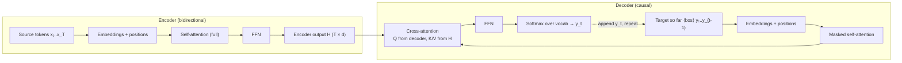
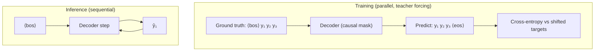
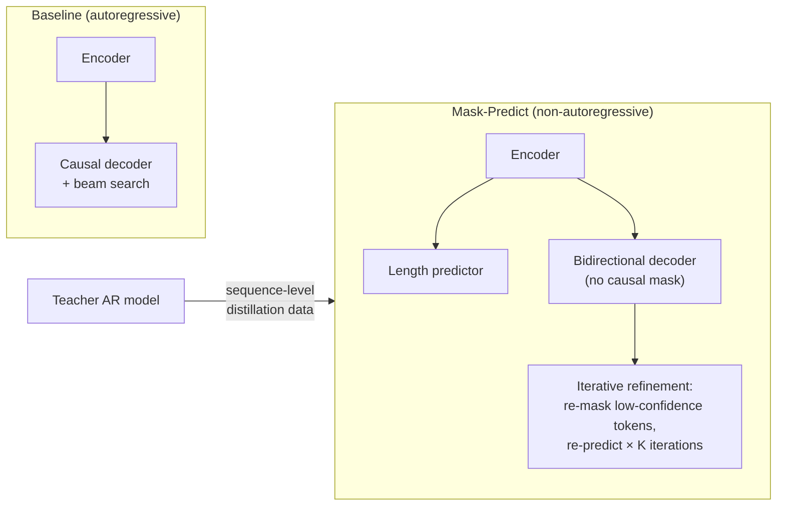

# 3.3 — Seq2Seq & Encoder-Decoder

## 1. Overview

**What is it?** Sequence-to-sequence (seq2seq) is the family of models that map an input sequence to an output sequence of possibly different length: an **encoder** reads the source (e.g., an English sentence) into hidden representations, and a **decoder** generates the target (e.g., the French translation) one token at a time, conditioning on both the encoder's output and its own previous tokens.

**Why does it exist?** Classification maps a sequence to a label; language modeling continues a sequence. But translation, summarization, speech recognition, and code transpilation need *structured outputs whose length and order differ from the input*. Before seq2seq (Sutskever et al., 2014; Cho et al., 2014), such systems were pipelines of hand-engineered components (alignment models, phrase tables, reordering rules). Seq2seq replaced all of it with a single network trained end-to-end.

**What problem does it solve?** Learning arbitrary conditional distributions $p(y_{1:U} \mid x_{1:T})$ over output sequences given input sequences — with variable lengths on both sides — from paired examples alone.

**Where is it used?** Google Translate switched to neural seq2seq (GNMT) in 2016. Today's flagship encoder-decoder Transformers include T5 and BART (text-to-text tasks), NLLB and MADLAD (translation), Whisper (speech-to-text), and Pegasus (summarization). The decoder half of seq2seq — causal generation with attention — is also the direct ancestor of [GPT-style decoder-only models](05-gpt-pretraining.md), and the decoding algorithms in this chapter (beam search, temperature, top-p) are used verbatim by every modern LLM.

## 2. Learning Objectives

After this chapter you will be able to:

- Write down the encoder-decoder factorization $p(y \mid x) = \prod_t p(y_t \mid y_{<t}, x)$ and explain each conditional.
- Explain the information bottleneck of vanilla RNN seq2seq and how attention solves it.
- Derive Bahdanau (additive) and Luong (multiplicative) attention and articulate their differences.
- Explain teacher forcing, why it is needed, and the exposure-bias problem it creates.
- Implement greedy decoding, beam search (with length normalization), temperature scaling, top-k, and top-p (nucleus) sampling — and choose among them per task.
- Describe how the Transformer encoder-decoder wires cross-attention between the two halves.
- Position T5 and BART: their pretraining objectives, and when to pick them over decoder-only models.
- Build and train a small Transformer seq2seq in PyTorch with correct masking and label shifting.
- Fine-tune T5/BART with HuggingFace for summarization or translation and evaluate with BLEU/ROUGE.
- Explain KV caching and why generation cost is asymmetric between encoder and decoder.

## 3. Prerequisites

| Chapter | Why it is needed |
|---|---|
| [RNN / LSTM / GRU](../phase-2-deep-learning/08-rnn-lstm-gru.md) | The original seq2seq encoder and decoder were LSTMs; recurrence explains the bottleneck that motivated attention. |
| [Attention & Self-Attention](../phase-2-deep-learning/09-attention.md) | Cross-attention between decoder and encoder is the load-bearing mechanism of this chapter. |
| [Transformer Architecture](../phase-2-deep-learning/10-transformer.md) | Modern seq2seq *is* the original Transformer (which was an encoder-decoder for translation). |
| [Probability & Statistics](../phase-0-prerequisites/04-probability-statistics.md) | Decoding is inference over a product of categorical distributions; sampling strategies manipulate them. |
| [Tokenization](01-tokenization.md) | Source and target are token IDs; BOS/EOS tokens drive generation start/stop. |
| [Loss Functions](../phase-2-deep-learning/04-loss-functions.md) | Training is per-token cross-entropy with label smoothing. |

Downstream, [BERT](04-bert.md) keeps only the encoder, [GPT Pretraining](05-gpt-pretraining.md) keeps only the decoder, and [LLM Evaluation](12-llm-evaluation.md) covers metrics like BLEU/ROUGE in depth.

## 4. Intuition

Think of a **human interpreter** at a conference. She first *listens* to a full sentence in Japanese, forming an internal understanding (the encoder). Then she *speaks* the English translation word by word (the decoder). Crucially, while speaking she doesn't rely only on a vague memory of the whole sentence — as she produces each English word, her attention flicks back to the specific Japanese phrase that word corresponds to. That "flicking back" is attention; her holistic understanding is the encoder state; her word-by-word production, each word building on what she already said, is autoregressive decoding.

The pre-attention design was like forcing the interpreter to listen to a 200-word sentence, write a *single postcard-sized note*, throw away the original, and translate from the note alone. For short sentences, fine; for long ones, catastrophic — details at the start get overwritten. This is the **fixed-vector bottleneck**: squeezing an arbitrarily long input into one vector of a few hundred floats. Attention removes the postcard limit: the decoder can consult *every* encoder position at *every* step, with learned soft weights deciding where to look.

One more everyday analogy for decoding strategies: writing a sentence is like navigating a branching maze where each fork is "which word next?". **Greedy** always takes the locally best fork and can walk into dead ends ("the the the..."). **Beam search** sends 4–8 scouts down the most promising paths and keeps the best complete route — great when there is one correct answer (translation). **Sampling** rolls weighted dice at each fork — essential when many answers are acceptable and you want variety (story writing, chat).

## 5. Real-world Motivation

- **Google** replaced its phrase-based statistical translation system with GNMT (an 8-layer LSTM seq2seq with attention) in 2016, reporting ~60% error reduction on major language pairs; the 2017 Transformer paper ("Attention Is All You Need") from Google Brain was itself an encoder-decoder built for WMT translation.
- **OpenAI's Whisper** is an encoder-decoder Transformer: the encoder ingests audio spectrogram frames, the decoder emits multilingual text tokens — the same machinery as translation with a different input modality.
- **Meta** built NLLB ("No Language Left Behind"), a 54B-parameter encoder-decoder translating between 200 languages, deployed to translate content on Facebook and Wikipedia.
- **Google's T5** ("Text-to-Text Transfer Transformer") reframed *every* NLP task as text-in/text-out, and its descendants (Flan-T5) remain strong, cheap open models for summarization and structured generation.
- **Amazon** uses seq2seq-style summarization for review highlights, and Alexa's earlier semantic parsing used encoder-decoder models to map utterances to structured intents.
- **DeepL** built its brand entirely on high-quality neural MT — encoder-decoder networks are the product.

## 6. Mathematical Foundations

### 6.1 Notation

- $x_{1:T} = (x_1, \dots, x_T)$ — source token IDs, length $T$.
- $y_{1:U} = (y_1, \dots, y_U)$ — target token IDs, length $U$; $y_0 = \langle\text{bos}\rangle$, $y_U = \langle\text{eos}\rangle$.
- $H = (h_1, \dots, h_T) \in \mathbb{R}^{T \times d}$ — encoder output states, dimension $d$.
- $s_t \in \mathbb{R}^d$ — decoder hidden state at output step $t$.
- $\alpha_{tj}$ — attention weight of decoder step $t$ on encoder position $j$; $c_t$ — the resulting context vector.
- $\theta$ — all model parameters; $V$ — target vocabulary size.

### 6.2 The autoregressive factorization

Seq2seq models the conditional distribution by the chain rule of probability — an exact identity, not an approximation:

$$
p_\theta(y_{1:U} \mid x_{1:T}) = \prod_{t=1}^{U} p_\theta(y_t \mid y_{<t},\ x_{1:T})
$$

Each factor is a categorical distribution over $V$ tokens, produced by a softmax over decoder logits. The encoder computes $H = \text{Enc}_\theta(x_{1:T})$ once; the decoder consumes $H$ at every step.

### 6.3 Training loss and teacher forcing

Given a paired corpus, we minimize the negative log-likelihood, which decomposes into per-token cross-entropies:

$$
\mathcal{L}(\theta) = -\sum_{t=1}^{U} \log p_\theta\!\left(y_t^{\star} \mid y_{<t}^{\star},\ x\right)
$$

where $y^{\star}$ is the *ground-truth* target. Note the conditioning: during training the decoder sees the true previous tokens $y_{<t}^{\star}$, not its own predictions. This is **teacher forcing**. It makes training parallelizable (all $U$ conditionals computed in one forward pass with a causal mask) and keeps gradients well-behaved early in training. The price is **exposure bias**: at inference the decoder conditions on its *own* possibly-wrong outputs, a distribution it never saw during training, so one early error can compound. Mitigations include scheduled sampling (occasionally feed model predictions during training), minimum-risk/sequence-level training, and — in practice most importantly — beam search plus large-scale training, which make the problem mostly benign.

Label smoothing (typically $\epsilon = 0.1$) replaces the one-hot target with a mixture $(1-\epsilon)\,\delta_{y^\star} + \epsilon / V$, preventing overconfident logits and reliably improving BLEU.

### 6.4 Bahdanau (additive) attention

Bahdanau, Cho & Bengio (2015) let the decoder query the encoder. The alignment score between the decoder's *previous* state $s_{t-1}$ and encoder state $h_j$ is computed by a small MLP:

$$
e_{tj} = v_a^\top \tanh\!\left(W_a s_{t-1} + U_a h_j\right)
$$

where $W_a \in \mathbb{R}^{d_a \times d}$, $U_a \in \mathbb{R}^{d_a \times d}$, and $v_a \in \mathbb{R}^{d_a}$ are learned. Scores normalize to weights and mix the encoder states:

$$
\alpha_{tj} = \frac{\exp(e_{tj})}{\sum_{j'=1}^{T} \exp(e_{tj'})}, \qquad c_t = \sum_{j=1}^{T} \alpha_{tj}\, h_j
$$

$\alpha_{t\cdot}$ is a probability distribution over source positions ("where am I looking?"); $c_t$ is a *soft, differentiable lookup* — the expected encoder state under that distribution. The context feeds the decoder's next-state computation and output projection.

### 6.5 Luong (multiplicative) attention

Luong, Pham & Manning (2015) simplified scoring to bilinear or plain dot-product forms, using the *current* decoder state $s_t$:

$$
e_{tj} = \begin{cases}
s_t^\top h_j & \text{(dot)} \\
s_t^\top W_a h_j & \text{(general)} \\
v_a^\top \tanh(W_a [s_t; h_j]) & \text{(concat)}
\end{cases}
$$

Dot-product attention has no extra parameters and reduces to matrix multiplication — which is exactly why the Transformer adopted it, adding the $1/\sqrt{d_k}$ scale to keep softmax gradients healthy (as covered in [Attention](../phase-2-deep-learning/09-attention.md)). In the Transformer encoder-decoder, **cross-attention** is this same mechanism with queries $Q$ from the decoder layer and keys/values $K, V$ from the (fixed) encoder output:

$$
\text{CrossAttn}(Q, K, V) = \text{softmax}\!\left(\frac{QK^\top}{\sqrt{d_k}}\right) V
$$

### 6.6 Decoding objectives

Exact maximization $\hat{y} = \arg\max_y \log p_\theta(y \mid x)$ over all sequences is intractable ($V^U$ candidates). Approximations:

- **Greedy:** $\hat{y}_t = \arg\max_w p(w \mid \hat{y}_{<t}, x)$ — $O(U)$ forward steps, no backtracking.
- **Beam search:** maintain the $B$ highest-scoring prefixes; expand each by all $V$ tokens; keep the best $B$ of $B \times V$; finish beams at $\langle\text{eos}\rangle$. Because $\log p$ of a longer sequence is a sum of more negative terms, raw beam search favors short outputs; **length normalization** rescores finished beams by

$$
\text{score}(y) = \frac{\log p_\theta(y \mid x)}{\text{lp}(U)}, \qquad \text{lp}(U) = \frac{(5 + U)^\lambda}{(5+1)^\lambda}
$$

with $\lambda \in [0.6, 1]$ (the GNMT formula; simply dividing by $U$ is a common simplification).

- **Temperature sampling:** sample from $\text{softmax}(z / \tau)$; $\tau < 1$ sharpens (more conservative), $\tau > 1$ flattens (more diverse), $\tau \to 0$ recovers greedy.
- **Top-k sampling:** truncate to the $k$ most probable tokens, renormalize, sample.
- **Top-p (nucleus) sampling** (Holtzman et al., 2020): truncate to the smallest set whose cumulative probability exceeds $p$ (e.g., 0.9), renormalize, sample. Adapts the candidate count to the model's confidence — the standard for open-ended LLM generation.

> [!NOTE]
> Rule of thumb: **beam search for closed-ended tasks** (translation, summarization — there's a "right answer" and BLEU/ROUGE reward it) and **nucleus/temperature sampling for open-ended generation** (dialogue, stories — beam search there produces bland, repetitive text).

### 6.7 T5 and BART pretraining objectives

- **T5** (Raffel et al., 2020): *span corruption* — replace random spans of the input with sentinel tokens (`<extra_id_0>`, ...), and train the decoder to emit the deleted spans in order. Every task is then cast as text-to-text with a task prefix ("translate English to German: ...", "summarize: ...").
- **BART** (Lewis et al., 2020): corrupt the input with a *mix of noising functions* (span deletion/infilling, sentence permutation), and train the decoder to reconstruct the **entire original text**. BART behaves like a denoising autoencoder over sequences and fine-tunes especially well for summarization.

Both are standard Transformer encoder-decoders; their innovation is the self-supervised objective, which — like [BERT's MLM](04-bert.md) but generative — manufactures unlimited training pairs from raw text.

## 7. Visual Explanation

Transformer encoder-decoder with attention flows:



Beam search as a pruned tree (beam width 2, toy vocabulary):

```
step 1              step 2                     step 3
⟨bos⟩ ── "the" (-0.4) ── "cat" (-1.1)  ── "sat"  (-1.9) ✓ kept
      │              └── "dog" (-1.3)  ── "ran"  (-2.4) ✗ pruned
      └── "a"  (-1.2) ── "cat" (-2.0)  ✗ pruned at step 2
(keep best 2 cumulative log-probs at each step; finish on ⟨eos⟩)
```

Training vs inference data flow (teacher forcing vs autoregression):



## 8. Algorithm

**Training step:**

1. Tokenize source and target; build `decoder_input = [BOS] + target[:-1]` and `labels = target` (the shift-by-one).
2. Encode: $H = \text{Enc}(x)$, one pass, full bidirectional self-attention.
3. Decode all positions in parallel with a causal mask (each position sees only earlier targets) plus cross-attention to $H$.
4. Compute per-token cross-entropy against `labels`, masking pad positions; add label smoothing.
5. Backpropagate; clip gradient norm (e.g., 1.0); Adam step with warmup + decay schedule.

**Beam-search inference:**

```text
# Beam search with length normalization
H = encode(x)                                  # run encoder ONCE
beams = [(seq=[BOS], logp=0.0)]
finished = []
for step in 1..max_len:
    cands = []
    for (seq, lp) in beams:
        if seq ends with EOS: finished.add((seq, lp)); continue
        logits = decode_step(seq, H)           # uses KV cache in practice
        top = top_B(log_softmax(logits))       # B best next tokens
        for (tok, tok_lp) in top:
            cands.append((seq + [tok], lp + tok_lp))
    beams = best_B(cands)                      # prune B×B → B
    if all beams finished: break
return argmax over finished of  lp / length_penalty(len(seq))
```

**Nucleus sampling step:** sort token probabilities descending; take the smallest prefix with cumulative mass ≥ $p$; renormalize; sample; append; repeat until EOS or the length limit.

## 9. Worked Example

**Tiny attention computation by hand.** Source: "le chat" ($T=2$), $d=2$. Encoder outputs $h_1 = (1, 0)$ (for "le"), $h_2 = (0, 1)$ (for "chat"). The decoder is about to produce English word 2 (after "the"), with state $s = (0.2,\ 1.0)$. Using Luong *dot* attention:

$$
e_1 = s^\top h_1 = 0.2, \qquad e_2 = s^\top h_2 = 1.0
$$

Softmax: $\alpha_1 = \frac{e^{0.2}}{e^{0.2} + e^{1.0}} = \frac{1.221}{1.221 + 2.718} = 0.310$, $\alpha_2 = 0.690$.

Context vector: $c = 0.310 \cdot (1,0) + 0.690 \cdot (0,1) = (0.310,\ 0.690)$ — the decoder is attending 69% to "chat", exactly when it needs to output "cat". The alignment emerged from dot-product geometry: $s$ points mostly along $h_2$.

**Tiny beam search by hand.** Beam width $B=2$, vocabulary {cat, dog, EOS}. Step-1 log-probs from the model: cat $-0.36$, dog $-1.61$, EOS $-2.30$. Keep {cat: $-0.36$, dog: $-1.61$}. Step 2 given "cat": EOS $-0.22$, dog $-2.30$, cat $-2.99$; given "dog": EOS $-0.36$, cat $-1.90$. Candidates: "cat EOS" $= -0.58$, "dog EOS" $= -1.97$, "cat dog" $= -2.66$, "dog cat" $= -3.51$. Best two: "cat EOS" and "dog EOS" — both finished; final answer "cat" with total log-prob $-0.58$. Greedy would have found the same here, but if "cat" had led only to poor continuations, beam search's second path would have won — that is the whole point.

**Realistic scale.** Fine-tune `t5-small` (60M params) on CNN/DailyMail summarization: input "summarize: {article}" truncated to 512 tokens, target ≤ 128 tokens, batch 8, LR $3\times10^{-4}$, 3 epochs on one GPU (~4 hours). Expected ROUGE-L ≈ 30–33 — within a few points of much larger models, demonstrating how much the pretraining objective carries.

## 10. Python from Scratch

Bahdanau attention plus a single decoder step in pure NumPy — the conceptual core with no framework magic:

```python
import numpy as np

def softmax(z):
    z = z - z.max()                      # numerical stability shift
    e = np.exp(z)
    return e / e.sum()

class BahdanauAttention:
    """score(s, h_j) = v_a^T tanh(W_a s + U_a h_j)"""
    def __init__(self, d_enc, d_dec, d_att, seed=0):
        rng = np.random.default_rng(seed)
        self.W_a = rng.normal(scale=0.1, size=(d_att, d_dec))  # (d_att, d_dec)
        self.U_a = rng.normal(scale=0.1, size=(d_att, d_enc))  # (d_att, d_enc)
        self.v_a = rng.normal(scale=0.1, size=(d_att,))        # (d_att,)

    def __call__(self, s_prev, H):
        # s_prev: (d_dec,) previous decoder state; H: (T, d_enc) encoder outputs
        proj = np.tanh(self.W_a @ s_prev + H @ self.U_a.T)     # (T, d_att)
        e = proj @ self.v_a                                    # (T,) scores
        alpha = softmax(e)                                     # (T,) weights, sum=1
        c = alpha @ H                                          # (d_enc,) context
        return c, alpha

def greedy_decode(step_fn, H, bos_id, eos_id, max_len=20):
    """step_fn(prev_id, s, H) -> (logits over V, new state s)."""
    y, s = [bos_id], np.zeros(H.shape[1])
    for _ in range(max_len):
        logits, s = step_fn(y[-1], s, H)
        nxt = int(np.argmax(logits))       # greedy: take the best token
        if nxt == eos_id: break
        y.append(nxt)
    return y[1:]                            # drop BOS

def nucleus_sample(logits, p=0.9, tau=1.0, rng=np.random.default_rng()):
    probs = softmax(logits / tau)                        # temperature first
    order = np.argsort(-probs)                           # descending
    csum = np.cumsum(probs[order])
    cutoff = int(np.searchsorted(csum, p)) + 1           # smallest nucleus ≥ p
    keep = order[:cutoff]
    kept = probs[keep] / probs[keep].sum()               # renormalize
    return int(rng.choice(keep, p=kept))
```

Line-by-line highlights: the stability shift in `softmax` prevents `exp` overflow (the #1 numerical bug in hand-rolled attention); `proj @ self.v_a` collapses the $d_{att}$ dimension into scalar scores; `alpha @ H` is the soft lookup $c_t = \sum_j \alpha_{tj} h_j$. Expected behavior: with $T$ encoder states, `alpha` has shape `(T,)`, is non-negative, and sums to 1 — assert this in tests. Complexity per decoder step: $O(T \cdot d_{att} \cdot d)$ for attention.

> [!WARNING]
> **Common bug in `nucleus_sample`:** applying the cutoff *before* temperature, or forgetting to renormalize `kept`. Both silently skew the distribution — outputs still look plausible, which is exactly why the bug survives code review. Unit-test that the kept probabilities sum to 1.

## 11. Library Implementation

A compact Transformer seq2seq in PyTorch, then production fine-tuning with HuggingFace:

```python
import torch, torch.nn as nn

class Seq2SeqTransformer(nn.Module):
    def __init__(self, vocab, d=256, heads=4, layers=3, max_len=512):
        super().__init__()
        self.tok = nn.Embedding(vocab, d)                 # shared src/tgt table
        self.pos = nn.Embedding(max_len, d)               # learned positions
        self.enc = nn.TransformerEncoder(
            nn.TransformerEncoderLayer(d, heads, 4*d, batch_first=True), layers)
        self.dec = nn.TransformerDecoder(
            nn.TransformerDecoderLayer(d, heads, 4*d, batch_first=True), layers)
        self.head = nn.Linear(d, vocab)                   # logits over vocab

    def embed(self, ids):                                  # ids: (B, L)
        pos = torch.arange(ids.size(1), device=ids.device)
        return self.tok(ids) + self.pos(pos)               # (B, L, d)

    def forward(self, src, tgt_in, src_pad_mask):
        # src: (B, T)  tgt_in: (B, U) already shifted right (starts with BOS)
        H = self.enc(self.embed(src),
                     src_key_padding_mask=src_pad_mask)    # (B, T, d)
        causal = nn.Transformer.generate_square_subsequent_mask(
            tgt_in.size(1), device=tgt_in.device)          # (U, U) upper-tri -inf
        Y = self.dec(self.embed(tgt_in), H, tgt_mask=causal,
                     memory_key_padding_mask=src_pad_mask) # (B, U, d)
        return self.head(Y)                                # (B, U, vocab)

# Training loss: shift handled OUTSIDE the model
# tgt_in = tgt[:, :-1]; labels = tgt[:, 1:]
# loss = F.cross_entropy(logits.reshape(-1, V), labels.reshape(-1),
#                        ignore_index=PAD_ID, label_smoothing=0.1)
```

```python
# ---------- HuggingFace: fine-tune and generate with T5 ----------
from transformers import AutoTokenizer, AutoModelForSeq2SeqLM

tok = AutoTokenizer.from_pretrained("t5-small")
model = AutoModelForSeq2SeqLM.from_pretrained("t5-small")

# T5 casts tasks as text-to-text via a prefix:
ids = tok("translate English to French: The cat sat on the mat.",
          return_tensors="pt").input_ids               # (1, 12)

out = model.generate(
    ids,
    num_beams=4,             # beam search, width 4
    length_penalty=0.8,      # GNMT-style length normalization exponent
    max_new_tokens=40,
    early_stopping=True,     # stop when all beams hit EOS
)
print(tok.decode(out[0], skip_special_tokens=True))
# "Le chat était assis sur le tapis."

# Open-ended generation instead uses sampling:
out = model.generate(ids, do_sample=True, top_p=0.9, temperature=0.8,
                     max_new_tokens=40)
```

Notes: `AutoModelForSeq2SeqLM` handles the target shift internally when you pass `labels=` (it builds `decoder_input_ids` by right-shifting), which removes an entire class of off-by-one bugs. `generate()` implements KV-cached beam search and all sampling strategies from §6.6.

## 12. Code Walkthrough

Tracing a batch through `Seq2SeqTransformer` with $B=32$, source length $T=64$, target length $U=48$, $d=256$, vocab $32\text{k}$:

| Tensor | Shape | Meaning |
|---|---|---|
| `src` | `(32, 64)` | source token IDs, padded |
| `src_pad_mask` | `(32, 64)` | `True` where padding (excluded from attention) |
| `tgt_in` | `(32, 48)` | `[BOS] + target[:-1]` — decoder inputs |
| `labels` | `(32, 48)` | `target` — what each position must predict |
| `H` | `(32, 64, 256)` | encoder output; computed once, reused everywhere |
| `causal` | `(48, 48)` | additive mask, $-\infty$ above the diagonal |
| decoder output `Y` | `(32, 48, 256)` | contextual target representations |
| `logits` | `(32, 48, 32000)` | per-position vocabulary scores |
| `loss` | scalar | mean CE over non-pad label positions |

**Inputs:** two padded ID tensors and the pad mask. **Intermediate values worth checking:** the cross-attention weights inside the decoder have shape `(32, heads, 48, 64)` — target positions attending over source positions; visualizing one head on a translation pair should show a soft diagonal (monotonic alignment) for related languages. **Expected results:** initial loss ≈ $\ln 32000 \approx 10.4$ (uniform prediction); a healthy training run drops below 4–5 within an epoch on a small MT dataset. If loss instantly collapses near 0, the causal mask is missing or labels weren't shifted — the decoder is copying the token it can see.

## 13. Complexity Analysis

Let $T$ = source length, $U$ = target length, $d$ = model width, $L$ = layers.

- **Encoder:** $O(L (T^2 d + T d^2))$ time — quadratic self-attention plus FFN — but it runs **once** per input. Space $O(T d)$ per layer (plus $O(T^2)$ attention maps if materialized).
- **Decoder, training:** all positions in parallel: $O(L (U^2 d + U T d + U d^2))$ — self-attention, cross-attention, FFN.
- **Decoder, naive generation:** recomputing the whole prefix each step costs $\sum_{t=1}^{U} O(t \cdot d) \cdot L \Rightarrow O(L U^2 d)$ in self-attention alone.
- **With KV caching:** each step only computes the new token's query against cached keys/values: self-attention totals $O(L U^2 d / 2)$ FLOPs but crucially avoids re-running FFNs on the prefix, making per-step cost $O(L(U + T) d + L d^2)$; cache memory is $O(2 L U d)$ per sequence (keys + values) — the dominant memory consumer in LLM serving.
- **Beam search:** multiplies decoding compute and cache memory by beam width $B$.

The asymmetry to remember: encoders are compute-bound and parallel; decoders are memory-bandwidth-bound and sequential — which is why generation, not encoding, dominates serving cost.

## 14. Advantages

- **Variable-length in, variable-length out:** a 300-word article can become a 30-word summary; no other supervised template handles this so naturally (Whisper maps 30 s of audio frames to text of arbitrary length).
- **Bidirectional source understanding:** unlike decoder-only models, the encoder attends both directions over the input — measurably better for translation quality at equal size (NLLB, MADLAD remain encoder-decoders for this reason).
- **Compute efficiency for long-input/short-output tasks:** the input is encoded once without autoregressive cost; a T5 summarizer encodes a 2,000-token document in one parallel pass, then decodes only ~100 tokens.
- **Clean separation for multimodality:** swap the encoder (audio → Whisper, image patches → vision encoder-decoder captioners) while keeping the text decoder.
- **Strong small-model quality:** Flan-T5-Large (780M) rivals much larger decoder-only models on summarization/extraction — attractive for cost-sensitive production.

## 15. Disadvantages

- **Exposure bias:** trained on gold prefixes, deployed on its own outputs; early mistakes compound. Visible as degeneration on long generations.
- **Sequential decoding latency:** $U$ dependent forward steps; a 500-token output cannot be parallelized (non-autoregressive decoding trades quality for parallelism and remains niche).
- **Beam search pathologies:** favors short/safe outputs without length penalties; in open-ended generation produces repetitive, low-diversity text (the "beam search curse").
- **Two stacks to maintain:** cross-attention plumbing, separate masks, and shift logic add engineering surface versus decoder-only models — one reason the LLM ecosystem consolidated on decoder-only (see [GPT Pretraining](05-gpt-pretraining.md)).
- **Hallucination in abstractive tasks:** summarizers fluently assert facts absent from the source; ROUGE does not catch it, so factuality checks must be added.
- **Fixed encoder context:** inputs beyond the encoder's max length must be truncated or chunked, hurting long-document tasks.

## 16. Common Mistakes

- **Missing or wrong causal mask.** Symptoms: training loss falls suspiciously near zero (the decoder peeks at the token it must predict), and generation is garbage. *Fix:* upper-triangular $-\infty$ mask on decoder self-attention; verify loss starts near $\ln V$.
- **Forgetting the shift.** Feeding `labels` as `decoder_input_ids` (instead of BOS-prefixed shifted targets) trains "predict yourself". *Fix:* `tgt_in = tgt[:, :-1]`, `labels = tgt[:, 1:]`, or let HuggingFace do it by passing `labels=` only.
- **Beam search without length penalty.** Outputs become systematically truncated ("The president said." for a 40-word reference). *Fix:* `length_penalty` ≈ 0.6–1.0; tune on validation BLEU/ROUGE.
- **Counting pad tokens in the loss.** Dilutes gradients and distorts perplexity. *Fix:* `ignore_index=PAD_ID` in cross-entropy and check the mask reaches attention too.
- **Wrong task prefix / missing EOS for T5.** T5 was pretrained with task prefixes and expects EOS-terminated inputs; omitting them costs quality quietly. *Fix:* mirror the pretraining format exactly (see [Tokenization](01-tokenization.md) on special tokens).
- **Sampling hyperparameters for closed tasks.** `temperature=1.0, do_sample=True` on a translation model yields random paraphrases and BLEU collapse. *Fix:* beam search for translation/summarization; sampling for open-ended text.

## 17. Best Practices

- [ ] Start from a pretrained checkpoint (T5/Flan-T5/BART/mBART); training seq2seq from scratch is justified only for niche vocabularies or research.
- [ ] Match the pretraining input format: task prefixes for T5, language codes for mBART/NLLB, EOS placement per model card.
- [ ] Use label smoothing 0.1, Adam/AdamW with warmup (≈ 4k steps or 6% of total), gradient clipping at 1.0.
- [ ] Bucket batches by length (source and target) to minimize padding waste; use dynamic padding per batch.
- [ ] Tune decoding on the validation set as seriously as training hyperparameters: beam width 4–8 and length penalty for closed tasks; `top_p` 0.9–0.95, temperature 0.7–1.0 for open tasks; set `no_repeat_ngram_size=3` for summarization.
- [ ] Evaluate with the right metric: SacreBLEU or chrF/COMET for translation, ROUGE plus a factuality check for summarization ([LLM Evaluation](12-llm-evaluation.md)).
- [ ] Always generate with KV cache enabled (`use_cache=True`, the default) and cap `max_new_tokens`.
- [ ] Log a fixed panel of qualitative examples every eval — metrics miss degeneration modes that eyes catch instantly.

## 18. Optimization Techniques

- **KV caching:** cache each layer's keys/values for the generated prefix and the encoder output; turns per-step cost from $O(t \cdot d^2 L)$ recompute into a single-token forward. Non-negotiable in serving.
- **Batched generation with left-padding awareness:** group requests of similar output lengths; continuous batching (as in vLLM) keeps the GPU full as sequences finish at different times.
- **Mixed precision (bf16/fp16):** ~2× training throughput; keep loss-scale (fp16) or prefer bf16 for stability.
- **Encoder output reuse:** for $B$-beam decoding, encode once and broadcast $H$ across beams instead of repeating the encoder $B$ times.
- **Distillation:** distill a large teacher into a small student decoder (e.g., DistilBART); or *sequence-level* distillation — train the student on the teacher's beam outputs — which also reduces exposure bias.
- **Quantization:** INT8/INT4 weight quantization of the decoder for CPU/edge serving; encoder tolerates quantization especially well.
- **Speculative decoding:** a small draft model proposes tokens; the large model verifies them in one parallel pass — 2–3× decode speedups with identical outputs.
- **Gradient checkpointing + sequence packing** during fine-tuning to fit longer documents on one GPU.

## 19. Industry Applications

- **Machine translation:** Google Translate (GNMT then Transformer), DeepL, Meta's NLLB-200 serving Facebook/Instagram content translation and Wikipedia.
- **Speech recognition:** OpenAI Whisper (audio-encoder → text-decoder) powers transcription products industry-wide; similar encoder-decoder ASR at Google (Listen-Attend-Spell lineage).
- **Summarization:** news summarization (Pegasus at Google Research), meeting/notes summarization features in Microsoft Teams-class products, Amazon review highlights.
- **Grammar and style correction:** Grammarly-class systems model correction as monolingual translation (noisy → clean).
- **Code transformation:** Meta's TransCoder translated between C++/Java/Python with seq2seq; modern code assistants inherit the decoding stack.
- **Semantic parsing / structured generation:** text-to-SQL and API-call generation in enterprise assistants commonly fine-tune T5-class models for schema-constrained output.

## 20. Interview Questions

### Beginner

**Q1: What roles do the encoder and decoder play?**
**A:** The encoder maps the source sequence into contextual hidden states $H$ (bidirectional — every position sees the whole input). The decoder generates the target autoregressively, each step conditioning on previously generated tokens (causal self-attention) and on $H$ (cross-attention).

**Q2: What is teacher forcing?**
**A:** During training the decoder receives the *ground-truth* previous tokens rather than its own predictions. It enables fully parallel training of all target positions with a causal mask and stabilizes learning, at the cost of a train/inference mismatch called exposure bias.

**Q3: Why can't we just use greedy decoding everywhere?**
**A:** Greedy commits to the locally best token and cannot recover if a slightly worse token now leads to a much better continuation. Beam search keeps $B$ hypotheses to hedge; sampling adds diversity for open-ended tasks.

**Q4: What do BOS and EOS tokens do in generation?**
**A:** BOS is the decoder's step-0 input that kicks off generation; EOS is a vocabulary token whose prediction terminates the sequence (per beam). Without a reliably trained EOS, generation runs to the length cap.

**Q5: Give two tasks where seq2seq is the natural fit and one where it isn't.**
**A:** Natural: translation, summarization, speech-to-text (input and output are different sequences). Not natural: plain text continuation/chat — a decoder-only LM does the same job with less machinery.

### Intermediate

**Q1: Contrast Bahdanau and Luong attention.**
**A:** Bahdanau: additive MLP score $v_a^\top \tanh(W_a s_{t-1} + U_a h_j)$ using the *previous* decoder state, computed before the RNN update. Luong: multiplicative scores (dot / bilinear) using the *current* state, after the update — simpler, faster (pure matmul), and the direct ancestor of scaled dot-product attention in Transformers.

**Q2: Why does raw beam search favor short outputs, and what fixes it?**
**A:** The score is a sum of per-token log-probabilities, each ≤ 0, so every extra token can only lower it; short finished beams win by default. Length normalization divides by $\text{lp}(U) = ((5+U)/6)^\lambda$ (or simply $U$), making scores per-token comparable across lengths.

**Q3: Explain top-p (nucleus) sampling and its advantage over top-k.**
**A:** Keep the smallest set of tokens whose cumulative probability ≥ $p$, renormalize, sample. Unlike fixed top-k, the candidate set adapts: when the model is confident (peaked distribution) the nucleus is tiny (near-greedy); when uncertain (flat) it is large (diverse) — avoiding both the incoherence of large $k$ on peaked steps and the blandness of small $k$ on flat steps.

**Q4: T5 vs BART — objectives and when to choose which?**
**A:** T5: span corruption — decoder emits only the deleted spans, tasks framed as text-to-text with prefixes; excellent all-rounder, comes in many sizes, Flan-tuned variants follow instructions. BART: reconstruct the *full* original from noised input (infilling, sentence permutation); its denoising bias makes it particularly strong at abstractive summarization. In practice: Flan-T5 for mixed/structured tasks, BART/DistilBART for summarization pipelines.

**Q5: What exactly does KV caching save during generation?**
**A:** Without it, generating token $t$ re-runs the full decoder over all $t-1$ previous tokens. Caching stores every layer's keys and values for the prefix (and the encoder's K/V for cross-attention), so each new step computes only the new token's projections and attends to cached tensors — per-step cost drops from growing-with-$t$ recompute to a single-token forward, at $O(2LUd)$ memory per sequence.

### Advanced

**Q1: What is exposure bias, and name three mitigation strategies with their trade-offs.**
**A:** The decoder is trained only on gold prefixes but conditions on its own (imperfect) outputs at inference, so errors compound out-of-distribution. Mitigations: (1) scheduled sampling — mix model predictions into training prefixes; simple but biased as a training objective; (2) sequence-level training (minimum risk / RL on BLEU) — optimizes the actual metric but is high-variance and slow; (3) sequence-level knowledge distillation — student trains on teacher beam outputs, smoothing the target distribution. In practice large-scale MLE + beam search makes the issue minor for closed tasks.

**Q2: Why did the LLM ecosystem consolidate on decoder-only rather than encoder-decoder architectures?**
**A:** Decoder-only models unify understanding and generation in one stack: every token participates in one next-token objective (denser supervision), the architecture handles arbitrary interleaved context (chat, few-shot exemplars) without deciding what is "source" vs "target", KV-cache serving infrastructure is simpler, and in-context learning emerged strongly in this family. Encoder-decoders retain an edge when inputs are long, fully known upfront, and benefit from bidirectional encoding (translation, ASR).

**Q3: Analyze the compute/memory trade-off of beam width.**
**A:** Compute and KV-cache memory scale linearly with $B$; quality gains saturate fast — for MT, BLEU typically plateaus by $B \approx 4$–8 and can *degrade* for large $B$ (the "beam search curse": the global mode of the model distribution is often a degenerate short/empty output, which larger beams find). So large beams both cost more and can hurt; production systems use 4–5 with length penalty.

**Q4: How does non-autoregressive (NAR) generation work and what is the core difficulty?**
**A:** NAR decoders emit all target tokens in parallel (conditioned on the encoder and a predicted length), collapsing $U$ sequential steps to ~1–few. The difficulty is the *multimodality problem*: the per-position independence assumption cannot represent dependencies between output tokens ("thank you" vs "danke schön" mixing into "thank schön"). Remedies: iterative refinement (Mask-Predict), latent alignment losses (CTC), and sequence-level distillation from an AR teacher to reduce target multimodality.

**Q5: Whisper is an encoder-decoder. What changes relative to text MT, and what stays the same?**
**A:** Changes: the encoder consumes log-Mel spectrogram frames through convolutional downsampling instead of token embeddings; special decoder prefix tokens select task (transcribe/translate) and language. Stays the same: causal text decoder, cross-attention to encoder states, training as next-token cross-entropy, beam/temperature decoding — the seq2seq abstraction is modality-agnostic as long as the encoder produces a sequence of vectors.

## 21. Coding Exercises

### Easy

1. **Greedy vs beam.** Using `t5-small`, translate 20 sentences with greedy and `num_beams=5`; compare outputs and SacreBLEU against references. *Hint:* differences concentrate in longer sentences.
2. **Decoding playground.** For one summarization input, generate with temperature ∈ {0.3, 0.7, 1.0, 1.5} and `top_p` ∈ {0.8, 0.95}; qualitatively rank coherence vs diversity. *Hint:* fix the random seed per setting for reproducibility.

### Medium

1. **Bahdanau attention module.** Implement additive attention as an `nn.Module` with proper batching (`scores: (B, U, T)`), integrate it into a GRU decoder, and train on a toy copy/reverse task. *Hint:* verify attention weights sum to 1 along $T$ and visualize the alignment matrix — the reverse task should show an anti-diagonal.
2. **Beam search from scratch.** Implement batched beam search (width $B$, length penalty $\lambda$) over any HuggingFace seq2seq model using only per-step `forward` calls; match `model.generate` outputs. *Hint:* keep per-beam cache indices; reorder KV caches when beams are pruned.
3. **T5 fine-tune.** Fine-tune `t5-small` on XSum or SAMSum; report ROUGE-1/2/L against the pretrained zero-shot baseline. *Hint:* remember the "summarize: " prefix and `max_new_tokens`.

### Hard

1. **Sampling strategy shoot-out.** On a fine-tuned summarizer, sweep greedy / beam(4,8) / top-k(50) / top-p(0.9) × temperature; measure ROUGE, distinct-n (diversity), and repetition rate; produce the quality–diversity frontier plot. *Hint:* generate 5 samples per input for the stochastic strategies and report mean ± std.
2. **Minimal speculative decoding.** Pair `t5-small` (draft) with `t5-base` (verifier): draft $k=4$ tokens, verify with one parallel target-model pass, accept the longest agreeing prefix, repeat. Measure wall-clock speedup at equal outputs. *Hint:* greedy-vs-greedy acceptance is the simplest correct variant.

## 22. Mini Project

**News summarizer with T5.**

1. Load the CNN/DailyMail dataset via `datasets`; inspect length statistics to choose truncation (source 512, target 128).
2. Tokenize with the "summarize: " prefix; build a `DataCollatorForSeq2Seq` for dynamic padding.
3. Fine-tune `t5-small` with `Seq2SeqTrainer`: LR $3\times10^{-4}$, batch 8 (gradient accumulation to an effective 32), 3 epochs, `predict_with_generate=True`.
4. Evaluate ROUGE-1/2/L on the test split; target ROUGE-L ≥ 30.
5. Build a small demo (Gradio or a CLI) that summarizes pasted articles with beam search (`num_beams=4`, `no_repeat_ngram_size=3`, `length_penalty=1.0`).
6. Error analysis: collect 10 failure cases and classify them (truncation loss, hallucinated facts, copied lead sentences).

## 23. Medium Project

**Mini machine translation on IWSLT'14 German→English.**

1. Download IWSLT'14 De–En (~160k sentence pairs); apply the standard cleanup (length ratio filtering).
2. Train a joint BPE tokenizer (10k merges) on both languages ([Tokenization](01-tokenization.md)).
3. Implement the Section-11 `Seq2SeqTransformer` (or use `fairseq`'s `transformer_iwslt_de_en` config: 6+6 layers, $d=512$, 4 heads).
4. Train with Adam, inverse-sqrt schedule with 4k warmup steps, label smoothing 0.1, dropout 0.3 (small data needs strong regularization).
5. Decode with beam 5, length penalty 1.0; evaluate SacreBLEU on the test set. Target: BLEU > 25 (well-tuned baselines reach ~34).
6. Ablations: remove label smoothing; halve the model; beam 1 vs 5 — quantify each effect in a table.
7. Visualize cross-attention for 5 sentence pairs; identify the soft diagonal and reordering patterns (German verb-final clauses are instructive).

## 24. Advanced Project

**Non-autoregressive translation with iterative refinement, benchmarked against an AR baseline.**

*Architecture:*



*Implementation phases:*

1. **AR baseline:** train the Medium-Project Transformer on IWSLT'14 De–En; record BLEU and per-sentence decode latency at beam 5.
2. **Distillation dataset:** re-translate the training source side with the AR teacher (beam 5); train all NAR models on these distilled targets (this single step is worth several BLEU for NAR).
3. **Mask-Predict decoder:** remove the causal mask; add a length-prediction head on the encoder (classify $U - T$ offsets); train with a masked-prediction objective over randomly masked target subsets (conditional MLM, cf. [BERT](04-bert.md)).
4. **Iterative inference:** predict all tokens at once, then for $K = 4$–10 iterations re-mask the lowest-confidence fraction (linear decay from 100% to 0%) and re-predict; implement batched confidence masking.
5. **Benchmark:** BLEU vs wall-clock latency curves (AR beam 1/5 vs NAR $K$ ∈ {1, 4, 10}) on GPU and CPU; analyze failure modes (token repetition, length errors, multimodality artifacts).

*Possible improvements:* CTC-based latent alignment instead of explicit length prediction; a hybrid "draft-NAR + verify-AR" speculative pipeline; knowledge-distillation temperature sweeps; extending the harness to summarization to test whether NAR survives longer outputs.

## 25. Summary

- Seq2seq models the exact factorization $p(y \mid x) = \prod_t p(y_t \mid y_{<t}, x)$: encode once, decode autoregressively.
- The fixed-vector bottleneck of vanilla RNN seq2seq is solved by attention: a per-step, differentiable soft lookup over all encoder states.
- Bahdanau attention scores with an additive MLP on the previous decoder state; Luong with (bilinear) dot products on the current state — the Transformer's scaled dot-product cross-attention descends from the latter.
- Training uses teacher forcing (parallel, stable) at the price of exposure bias at inference.
- Labels are the decoder inputs shifted by one; the causal mask prevents peeking — the two most common implementation bugs live exactly here.
- Decoding is approximate search: greedy < beam (+ length normalization) for closed-ended tasks; temperature/top-k/top-p sampling for open-ended generation.
- T5 (span corruption, text-to-text prefixes) and BART (denoising reconstruction) are the canonical pretrained encoder-decoders; fine-tuning them beats training from scratch almost always.
- Encoder cost is one parallel pass; decoder cost is sequential and dominates serving — KV caching, batching, distillation, and speculative decoding are the levers.
- Encoder-decoders still win for translation, ASR, and long-input/short-output tasks; decoder-only LLMs won general-purpose generation.
- Evaluate with task-appropriate metrics (SacreBLEU/COMET, ROUGE + factuality) and always inspect generations by eye.

## 26. Cheat Sheet

| Item | Formula / value |
|---|---|
| Factorization | $p(y \mid x) = \prod_{t} p(y_t \mid y_{<t}, x)$ |
| Bahdanau score | $v_a^\top \tanh(W_a s_{t-1} + U_a h_j)$ |
| Luong dot score | $s_t^\top h_j$; Transformer: $QK^\top/\sqrt{d_k}$ |
| Context vector | $c_t = \sum_j \alpha_{tj} h_j$, $\alpha_{t\cdot} = \text{softmax}(e_{t\cdot})$ |
| Length penalty (GNMT) | $\text{lp}(U) = ((5+U)/6)^{\lambda}$, $\lambda \approx 0.6\text{–}1$ |
| Temperature | sample from $\text{softmax}(z/\tau)$; $\tau{\to}0$ = greedy |
| Top-p | smallest set with $\sum p \ge p$, renormalize, sample |
| Decode cost (cached) | per step $O(L(T + U)d)$; cache memory $O(2LUd)$ |

**Defaults:** beam 4–5 + length penalty for MT/summarization; `top_p=0.9, temperature=0.7–1.0` for open-ended; label smoothing 0.1; warmup 4k steps; `no_repeat_ngram_size=3` for summaries.

**One-liners:** shift the targets; mask the future; encode once, cache always; beam for right answers, sample for interesting ones.

**Gotchas:** near-zero training loss ⇒ missing causal mask; truncated outputs ⇒ missing length penalty; pad tokens in loss ⇒ skewed perplexity; T5 needs its task prefix.

## 27. Further Reading

**Books**
- Jurafsky & Martin, *Speech and Language Processing* (3rd ed. draft) — chapters on MT and encoder-decoder models.
- Tunstall, von Werra & Wolf, *Natural Language Processing with Transformers* — summarization and translation chapters.

**Research Papers**
- Sutskever, Vinyals & Le (2014), "Sequence to Sequence Learning with Neural Networks".
- Cho et al. (2014), "Learning Phrase Representations using RNN Encoder-Decoder for Statistical Machine Translation".
- Bahdanau, Cho & Bengio (2015), "Neural Machine Translation by Jointly Learning to Align and Translate".
- Luong, Pham & Manning (2015), "Effective Approaches to Attention-based Neural Machine Translation".
- Vaswani et al. (2017), "Attention Is All You Need".
- Wu et al. (2016), "Google's Neural Machine Translation System" (GNMT; length penalty).
- Raffel et al. (2020), "Exploring the Limits of Transfer Learning with a Unified Text-to-Text Transformer" (T5).
- Lewis et al. (2020), "BART: Denoising Sequence-to-Sequence Pre-training".
- Holtzman et al. (2020), "The Curious Case of Neural Text Degeneration" (nucleus sampling).
- Ghazvininejad et al. (2019), "Mask-Predict: Parallel Decoding of Conditional Masked Language Models".
- Radford et al. (2022), "Robust Speech Recognition via Large-Scale Weak Supervision" (Whisper).

**Documentation**
- HuggingFace docs: text generation strategies, `Seq2SeqTrainer`; fairseq documentation for MT recipes.

**GitHub Repositories**
- `facebookresearch/fairseq`; `google-research/text-to-text-transfer-transformer`; `huggingface/transformers`; `bentrevett/pytorch-seq2seq` (excellent tutorials).

**Datasets**
- IWSLT'14 / WMT (translation); CNN/DailyMail, XSum, SAMSum (summarization); LibriSpeech (ASR).

**YouTube / Videos**
- Stanford CS224N lectures on Machine Translation, Seq2Seq and Attention.

**Blogs**
- Jay Alammar, "Visualizing a Neural Machine Translation Model (Seq2seq with Attention)"; the HuggingFace blog posts "How to generate text" (decoding strategies) and "Encoder-Decoder models".
