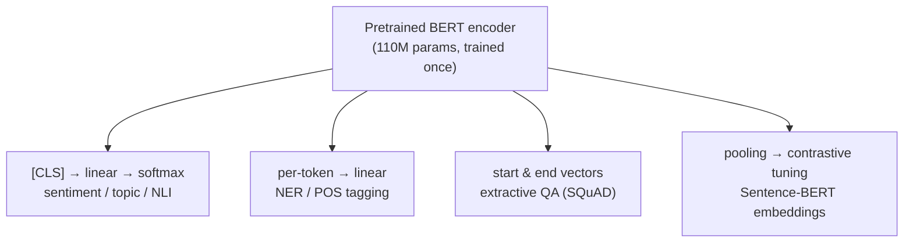
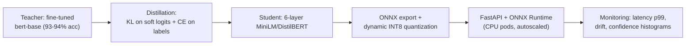

# 3.4 — BERT-family (Encoder-only Transformers)

## 1. Overview

**What is it?** BERT (Bidirectional Encoder Representations from Transformers; Devlin et al., 2018) is a Transformer *encoder* pretrained on unlabeled text with a **masked language modeling** (MLM) objective: hide random words and predict them from the surrounding context — both left *and* right. The result is a general-purpose text encoder that, with a small task head and brief fine-tuning, transfers to classification, tagging, question answering, and retrieval.

**Why does it exist?** Left-to-right language models (the GPT lineage) see only preceding context when representing a word. But "understanding" tasks — is this review positive? which entity is this? does passage answer question? — benefit from bidirectional context: the meaning of "bank" in "the bank was steep" is disambiguated by words on *both* sides. Naively conditioning on both sides in a generative LM would let each word see itself; MLM's trick of masking-then-predicting makes bidirectional conditioning trainable.

**What problem does it solve?** It replaced task-specific architectures with one recipe: pretrain once on billions of words, fine-tune cheaply per task. BERT set state-of-the-art on 11 NLP benchmarks at release and launched the "pretrain → fine-tune" paradigm that still defines applied NLP.

**Where is it used?** Google deployed BERT in Search query understanding in 2019 (initially ~10% of English queries, later essentially all). Today the family — RoBERTa, DistilBERT, DeBERTa, ELECTRA, and the Sentence-Transformers/SBERT branch — powers search ranking, content moderation, NER pipelines, cross-encoder rerankers in [RAG](09-rag.md) systems, and the embedding models behind [vector databases](10-vector-databases.md). While generative work moved to decoder-only LLMs, encoder-only models remain the cost-efficient workhorses of *understanding* tasks.

## 2. Learning Objectives

After this chapter you will be able to:

- Explain why bidirectional context needs the MLM objective rather than standard next-token prediction.
- Write down the MLM loss, the 15% / 80-10-10 masking recipe, and justify each design choice.
- Describe BERT's architecture precisely: layers, hidden size, heads, segment embeddings, `[CLS]`/`[SEP]`, and the 512-token limit.
- Explain Next Sentence Prediction and why RoBERTa showed it was unnecessary.
- Fine-tune BERT for sequence classification, token classification (NER), and extractive QA, with the standard hyperparameter recipe.
- Compare RoBERTa, DistilBERT, ALBERT, DeBERTa, and ELECTRA — what each changed and why it matters.
- Explain ELECTRA's replaced-token detection and its sample-efficiency argument.
- Explain why raw BERT embeddings are poor sentence vectors and how Sentence-BERT (bi-encoders, contrastive training) fixes them.
- Choose between bi-encoders and cross-encoders for retrieval vs reranking.
- Diagnose common fine-tuning failures (catastrophic forgetting, seed instability, truncation) and apply production optimizations (distillation, quantization, dynamic padding).

## 3. Prerequisites

| Chapter | Why it is needed |
|---|---|
| [Transformer Architecture](../phase-2-deep-learning/10-transformer.md) | BERT *is* the Transformer encoder stack; this chapter only changes the training objective. |
| [Attention & Self-Attention](../phase-2-deep-learning/09-attention.md) | Bidirectional (unmasked) self-attention is the mechanism that mixes left and right context. |
| [Tokenization](01-tokenization.md) | BERT uses WordPiece with `[CLS]`, `[SEP]`, `[MASK]` special tokens. |
| [Word Embeddings](02-word-embeddings.md) | BERT's contextual vectors are the direct fix for the static-embedding polysemy problem. |
| [Probability & Statistics](../phase-0-prerequisites/04-probability-statistics.md) | Cross-entropy over masked positions; sampling masks is a probabilistic procedure. |
| [Loss Functions](../phase-2-deep-learning/04-loss-functions.md) | MLM, NSP, and fine-tuning heads are all cross-entropy variants. |

The contrast with [GPT Pretraining](05-gpt-pretraining.md) (causal, generative) runs through the whole chapter; [Seq2Seq](03-seq2seq.md) covered the encoder-decoder middle ground.

## 4. Intuition

MLM is a **fill-in-the-blank exam at planetary scale**. Take any sentence, hide a word — "The doctor asked the nurse to hand ___ the scalpel" — and predicting the blank forces you to understand syntax (a pronoun fits), semantics (an operating room scene), and world knowledge (who holds scalpels). No human labeled anything: the text itself is the answer key. Do this billions of times and the network is forced to build rich internal representations of language just to keep winning the game.

Why *bidirectional*? Imagine reading a mystery novel through a slit that shows only words to the left of your finger. You can still guess what comes next (that's GPT's game), but many judgments are easier if you can also peek ahead. "I went to the bank to ___": is it "deposit" or "fish"? The *following* sentence settles it. Understanding tasks are open-book both directions; generation is inherently left-to-right. BERT chooses the former and gives up the latter — it cannot write text, by design.

The everyday story for fine-tuning: BERT pretraining is like a liberal-arts education — broad, expensive, done once. Fine-tuning is a two-week onboarding for a specific job: you don't re-educate the person, you add a thin layer of job-specific skill (a small classification head) and lightly adjust what's already there (small learning rate, few epochs). That's why a model pretrained for weeks on TPUs fine-tunes to 93% IMDB accuracy in under an hour on one GPU.

> [!NOTE]
> One sentence to keep: **GPT learns to write; BERT learns to read.** Everything else in this chapter is engineering around that division of labor.

## 5. Real-world Motivation

- **Google** announced in October 2019 that BERT powers Search query understanding — "one of the biggest leaps forward in the history of Search" — helping with prepositions and context ("2019 brazil traveler to usa need a visa": direction matters).
- **Microsoft** developed DeBERTa, which topped the SuperGLUE leaderboard (surpassing human baseline in 2021); encoder models run across Bing ranking and Office intelligence features.
- **Meta** built RoBERTa and uses encoder-family classifiers at scale for integrity work — hate-speech and policy-violation detection over billions of posts, where per-inference cost rules out giant generative models.
- **HuggingFace**'s most-downloaded models have long included BERT-family checkpoints (`bert-base-uncased`, `distilbert`, `all-MiniLM-L6-v2`) — evidence of massive production usage.
- **OpenAI, Cohere, and the RAG ecosystem**: modern retrieval stacks pair a bi-encoder embedding model with a cross-encoder reranker — both descendants of BERT — in front of the generative LLM (see [RAG](09-rag.md)).
- **Amazon and e-commerce** broadly fine-tune encoder models for product classification, review analysis, and search relevance where latency budgets are single-digit milliseconds.

## 6. Mathematical Foundations

### 6.1 Notation

- $x = (x_1, \dots, x_n)$ — input WordPiece token IDs, $n \le 512$.
- $\tilde{x}$ — the corrupted input after masking; $\mathcal{M} \subset \{1..n\}$ — the set of masked positions.
- $L$ — number of Transformer layers; $d$ — hidden size; $A$ — attention heads. BERT-base: $L{=}12, d{=}768, A{=}12$ (110M params); BERT-large: $L{=}24, d{=}1024, A{=}16$ (340M).
- $h_i^{(\ell)} \in \mathbb{R}^d$ — hidden state of position $i$ at layer $\ell$.
- $E \in \mathbb{R}^{V \times d}$ — token embedding matrix, $V = 30{,}522$ WordPieces.

### 6.2 Input representation

Each position's input embedding is a sum of three learned embeddings:

$$
h_i^{(0)} = E_{x_i} + P_i + S_{s(i)}
$$

where $P_i$ is the (learned, absolute) position embedding for position $i$, and $S_{s(i)}$ is the *segment* embedding — $s(i) \in \{A, B\}$ marks whether the token belongs to the first or second sentence of a pair (needed for NSP and sentence-pair tasks; passed as `token_type_ids` in code). Input format: `[CLS] sentence A [SEP] sentence B [SEP]`.

### 6.3 The MLM objective

Select each token independently for corruption with probability $p_{\text{mask}} = 0.15$. For a selected position:

- with probability 0.8: replace with `[MASK]`;
- with probability 0.1: replace with a *random* vocabulary token;
- with probability 0.1: keep the original token.

The loss is cross-entropy **only over selected positions**:

$$
\mathcal{L}_{\text{MLM}} = -\sum_{i \in \mathcal{M}} \log p_\theta\!\left(x_i \mid \tilde{x}\right), \qquad
p_\theta(x_i \mid \tilde{x}) = \text{softmax}\!\left(W_{\text{mlm}}\, h_i^{(L)} + b\right)_{x_i}
$$

where $W_{\text{mlm}}$ is typically tied to the embedding matrix $E$.

**Why the 80/10/10 split?** If selected tokens were *always* `[MASK]`, the model could learn to produce rich representations only at `[MASK]` positions — but `[MASK]` never appears at fine-tuning time, creating a pretrain/fine-tune mismatch. Random replacements (10%) force every position to be treated as potentially corrupted, so the encoder must maintain good contextual representations everywhere; unchanged tokens (10%) teach it that the observed token is sometimes the answer, anchoring representations to the input.

**Why 15%?** A bias-variance-style trade-off in supervision density: mask too little and each example yields almost no training signal (slow learning per FLOP); mask too much and the context becomes so degraded that the task is ill-posed. 15% was chosen empirically; later work (e.g., "Should You Mask 15%?") showed larger models tolerate 30–40% masking — the number is a tunable, not a law.

**Bidirectionality is the point:** since attention is unmasked, $h_i^{(L)}$ depends on *all* of $\tilde{x}$ — left and right. The masking is what prevents the trivial solution of copying $x_i$ from the input (each predicted token is hidden or corrupted at its own position).

### 6.4 Next Sentence Prediction (and its demise)

Original BERT added a binary task: 50% of the time sentence B truly follows A, 50% it is a random sentence; predict which, from the `[CLS]` representation:

$$
\mathcal{L}_{\text{NSP}} = -\log p_\theta(\text{IsNext} \mid h_{\text{[CLS]}}^{(L)}), \qquad
\mathcal{L} = \mathcal{L}_{\text{MLM}} + \mathcal{L}_{\text{NSP}}
$$

RoBERTa's ablations showed NSP does not help — random-sentence discrimination is largely solvable by *topic* cues, teaching little — and dropping it while training on full-length contiguous text slightly *improved* downstream results. Modern encoder pretraining omits NSP.

### 6.5 Fine-tuning heads

All fine-tuning adds a small head on top of the pretrained encoder and trains everything end-to-end with a small learning rate:

- **Sequence classification:** $p(y \mid x) = \text{softmax}(W_c\, h_{\text{[CLS]}}^{(L)})$ with $W_c \in \mathbb{R}^{C \times d}$ for $C$ classes; cross-entropy loss.
- **Token classification (NER/POS):** a shared linear layer applied per position: $p(y_i \mid x) = \text{softmax}(W_t\, h_i^{(L)})$; loss summed over (first-subword) positions.
- **Extractive QA (SQuAD):** two vectors $w_s, w_e \in \mathbb{R}^d$ score each position as answer start/end: $p_{\text{start}}(i) = \text{softmax}_i(w_s^\top h_i^{(L)})$, similarly for end; loss is the sum of the two cross-entropies; at inference pick the best valid $(i \le j)$ span.

The standard recipe (from the paper, still current): learning rate $2\text{–}5 \times 10^{-5}$ (AdamW), 2–4 epochs, batch 16–32, linear warmup (~6–10% of steps) then linear decay, weight decay 0.01.

### 6.6 ELECTRA: replaced-token detection

ELECTRA (Clark et al., 2020) attacks MLM's inefficiency: only 15% of positions produce loss. Instead, a small *generator* (an MLM) fills masked positions with plausible tokens; the *discriminator* (the model you keep) classifies **every** position as original vs replaced:

$$
\mathcal{L}_{\text{disc}} = -\sum_{i=1}^{n} \Big[ \mathbb{1}[x_i^{\text{corrupt}} = x_i] \log D_i + \mathbb{1}[x_i^{\text{corrupt}} \ne x_i] \log (1 - D_i) \Big]
$$

where $D_i = \sigma(w^\top h_i^{(L)})$ is the per-position "is-original" probability. Supervision at 100% of positions (vs 15%) plus a binary (vs $V$-way) task yields much better compute efficiency: ELECTRA-small approaches BERT-base quality at a fraction of the pretraining FLOPs. Note this is *not* a GAN — the generator trains with ordinary MLM, not to fool the discriminator.

### 6.7 Sentence embeddings: why SBERT exists

For semantic search over $N$ documents, a *cross-encoder* (concatenate query and document, run BERT, score) needs $N$ forward passes per query — infeasible. A *bi-encoder* embeds query and documents independently and compares by cosine, enabling precomputation and ANN indexes. But naive BERT vectors (`[CLS]` or mean pooling, untuned) perform *worse than GloVe* on sentence similarity — the space is anisotropic and not trained for cosine comparison. Sentence-BERT (Reimers & Gurevych, 2019) fine-tunes a siamese BERT with contrastive objectives; the modern standard is the in-batch-negatives InfoNCE loss over positive pairs $(a_i, b_i)$:

$$
\mathcal{L} = -\frac{1}{B}\sum_{i=1}^{B} \log \frac{\exp(\cos(u_i, v_i)/\tau)}{\sum_{j=1}^{B} \exp(\cos(u_i, v_j)/\tau)}
$$

where $u_i, v_i$ are pooled embeddings of a positive pair, every other in-batch $v_j$ serves as a negative, and $\tau$ (e.g., 0.05) is a temperature. This is the training recipe behind `all-MiniLM-L6-v2`, E5, BGE, and the embedding models used throughout [RAG](09-rag.md).

## 7. Visual Explanation

MLM pretraining data flow:


Fine-tuning: one pretrained trunk, many small heads:



Attention visibility, BERT vs GPT (ASCII):

```
BERT (bidirectional):            GPT (causal):
      the cat sat on                  the cat sat on
the    ✓   ✓   ✓  ✓             the    ✓   ✗   ✗  ✗
cat    ✓   ✓   ✓  ✓             cat    ✓   ✓   ✗  ✗
sat    ✓   ✓   ✓  ✓             sat    ✓   ✓   ✓  ✗
on     ✓   ✓   ✓  ✓             on     ✓   ✓   ✓  ✓
every token sees everything      each token sees only the past
→ great for understanding        → required for generation
```

## 8. Algorithm

**MLM pretraining:**

1. Sample text spans; tokenize with WordPiece; pack as `[CLS] A [SEP] B [SEP]` up to 512 tokens.
2. For each non-special token, select it with probability 0.15; apply the 80/10/10 corruption.
3. Forward through the encoder (full bidirectional attention); compute logits at selected positions only.
4. Cross-entropy loss vs original tokens; AdamW step (peak LR $1\times10^{-4}$, warmup 10k steps, linear decay); repeat for ~1M steps at batch 256.

**Fine-tuning for classification:**

1. Tokenize each example as `[CLS] text [SEP]` (pair tasks: `[CLS] a [SEP] b [SEP]` with `token_type_ids`); pad/truncate to a chosen max length.
2. Add a randomly initialized head $W_c \in \mathbb{R}^{C \times d}$ on the `[CLS]` output (or on mean-pooled tokens).
3. Train **all** parameters with LR $2\times10^{-5}$, 2–4 epochs, warmup 6–10%, weight decay 0.01, batch 16–32.
4. Select the checkpoint by validation metric; small datasets: run 3–5 seeds and report the median (fine-tuning is seed-sensitive).

```text
# Pseudocode: one MLM training step
tokens = wordpiece(text)                       # ids, length n ≤ 512
mask_pos = {i : rand() < 0.15 and not special(i)}
corrupted = copy(tokens)
for i in mask_pos:
    r = rand()
    if   r < 0.8: corrupted[i] = MASK_ID
    elif r < 0.9: corrupted[i] = random_vocab_id()
    # else: keep original token
H = encoder(embed(corrupted))                  # (n, d), bidirectional
logits = H[mask_pos] @ E.T + b                 # tied output projection
loss = cross_entropy(logits, tokens[mask_pos]) # ONLY masked positions
loss.backward(); adamw.step()
```

## 9. Worked Example

**Tiny masking example by hand.** Sentence: "the cat sat on the mat" → WordPiece IDs (schematically) `[CLS] the cat sat on the mat [SEP]` — 6 content tokens. With $p=0.15$, expect $6 \times 0.15 = 0.9$ ≈ 1 selected token per such sentence. Say position 3 ("sat") is selected and the 80% branch fires: input becomes `[CLS] the cat [MASK] on the mat [SEP]`.

Suppose the output head over a toy 5-word vocabulary {sat, ran, mat, dog, the} produces logits at the masked position: $z = (3.1,\ 1.2,\ 0.4,\ -0.5,\ 0.8)$. Softmax:

$$
p(\text{sat}) = \frac{e^{3.1}}{e^{3.1}+e^{1.2}+e^{0.4}+e^{-0.5}+e^{0.8}} = \frac{22.2}{22.2+3.32+1.49+0.61+2.23} = \frac{22.2}{29.85} \approx 0.744
$$

Loss at this position: $-\log 0.744 \approx 0.296$. Had the model predicted uniformly, loss would be $-\log(1/5) = 1.609$ — so this position contributes a strong "already learned" signal. The batch loss averages such terms over all masked positions; pretraining drives the average from $\approx \ln V \approx 10.3$ (real vocab) down to ~1.5–2.5.

**Realistic scale.** Fine-tune `bert-base-uncased` on IMDB sentiment (25k train examples, max length 256): one epoch ≈ 10 minutes on a single modern GPU; expected test accuracy ≈ 93–94%. The same trunk fine-tuned on CoNLL-2003 NER reaches ~92 F1; on SQuAD v1.1, ~88–90 F1 — three tasks, three small heads, one pretrained model, which is precisely the paradigm shift BERT introduced.

## 10. Python from Scratch

The MLM *data pipeline and loss* in pure NumPy — the part that is genuinely BERT-specific. (The encoder itself is the Transformer from [chapter 2.10](../phase-2-deep-learning/10-transformer.md); we treat it as a black-box function here rather than re-deriving attention.)

```python
import numpy as np

rng = np.random.default_rng(0)
V, MASK, CLS, SEP, PAD = 30522, 103, 101, 102, 0   # BERT's actual special ids

def mlm_corrupt(ids, p=0.15):
    """Apply BERT's 80/10/10 corruption. ids: (n,) int array."""
    ids = ids.copy()
    special = np.isin(ids, [CLS, SEP, PAD])          # never mask special tokens
    sel = (rng.random(len(ids)) < p) & ~special      # (n,) bool: selected 15%
    labels = np.full(len(ids), -100)                 # -100 = ignore in loss
    labels[sel] = ids[sel]                           # remember originals
    r = rng.random(len(ids))
    ids[sel & (r < 0.8)] = MASK                      # 80% → [MASK]
    rand_branch = sel & (r >= 0.8) & (r < 0.9)       # 10% → random token
    ids[rand_branch] = rng.integers(1000, V, size=rand_branch.sum())
    # remaining 10%: keep original (do nothing)
    return ids, labels

def mlm_loss(H, E, b, labels):
    """CE over masked positions only.
    H: (n, d) final hidden states; E: (V, d) tied embeddings; b: (V,)."""
    pos = np.where(labels != -100)[0]                # masked positions
    logits = H[pos] @ E.T + b                        # (m, V) tied projection
    logits -= logits.max(axis=1, keepdims=True)     # stability shift
    logp = logits - np.log(np.exp(logits).sum(axis=1, keepdims=True))
    nll = -logp[np.arange(len(pos)), labels[pos]]    # pick gold token logprob
    return nll.mean(), len(pos)

# --- demo with a random "encoder" ---
n, d = 16, 64
ids = np.array([CLS] + list(rng.integers(1000, V, n - 2)) + [SEP])
corrupted, labels = mlm_corrupt(ids)
E = rng.normal(scale=0.02, size=(V, d))              # embedding table
H = rng.normal(size=(n, d))                          # stand-in encoder output
loss, m = mlm_loss(H, E, np.zeros(V), labels)
print(f"masked {m}/{n} positions, loss {loss:.2f}")  # ≈ ln(30522) ≈ 10.3 untrained
```

Block-by-block: `mlm_corrupt` implements selection (15%), the three branches via one uniform draw `r`, and the `-100` ignore-label convention that HuggingFace also uses; `mlm_loss` shows the tied output projection ($H E^\top$) and the log-sum-exp-stable cross-entropy restricted to masked positions. Expected output: with a random encoder, loss ≈ $\ln V \approx 10.3$ — a sanity constant worth memorizing. Complexity: corruption is $O(n)$; the loss is $O(m \cdot V \cdot d)$ for $m$ masked positions, which is why the vocabulary projection dominates MLM step cost.

> [!WARNING]
> **Common bug:** computing the loss over *all* positions instead of only masked ones (i.e., ignoring the `-100` convention). Training still "works" but most supervision becomes trivial copy-through, the loss looks deceptively low, and downstream quality quietly suffers. Always check that `labels` are `-100` everywhere except the ~15% selected positions.

## 11. Library Implementation

Fine-tuning for classification with HuggingFace, plus sentence embeddings:

```python
import numpy as np
from datasets import load_dataset
from transformers import (AutoTokenizer, AutoModelForSequenceClassification,
                          TrainingArguments, Trainer, DataCollatorWithPadding)

# 1) Data: IMDB sentiment, two classes.
ds = load_dataset("imdb")
tok = AutoTokenizer.from_pretrained("bert-base-uncased")

def tokenize(batch):
    # truncate to 256 to double throughput vs 512 with minimal accuracy loss
    return tok(batch["text"], truncation=True, max_length=256)
ds = ds.map(tokenize, batched=True)

# 2) Model: pretrained trunk + freshly initialized 2-class head on [CLS].
model = AutoModelForSequenceClassification.from_pretrained(
    "bert-base-uncased", num_labels=2)
# (expected warning: classifier weights newly initialized — that is correct)

# 3) The canonical fine-tuning recipe.
args = TrainingArguments(
    output_dir="bert-imdb",
    learning_rate=2e-5,              # small LR: nudge, don't overwrite
    num_train_epochs=2,              # 2-4 epochs is standard
    per_device_train_batch_size=16,
    warmup_ratio=0.06,               # linear warmup then decay
    weight_decay=0.01,
    eval_strategy="epoch",
    fp16=True,                       # mixed precision: ~2x throughput
)
def metrics(p):
    return {"acc": (p.predictions.argmax(-1) == p.label_ids).mean()}

trainer = Trainer(model=model, args=args,
                  train_dataset=ds["train"], eval_dataset=ds["test"],
                  data_collator=DataCollatorWithPadding(tok),  # dynamic padding
                  compute_metrics=metrics)
trainer.train()   # expect ~93-94% test accuracy after 2 epochs
```

```python
# ---------- Sentence embeddings: bi-encoder for search ----------
from sentence_transformers import SentenceTransformer, util

st = SentenceTransformer("all-MiniLM-L6-v2")   # 6-layer distilled encoder, 384-d
docs = ["How do I reset my password?",
        "Shipping takes 3-5 business days.",
        "You can change your password in account settings."]
emb = st.encode(docs, normalize_embeddings=True)     # (3, 384), unit norm
q = st.encode("forgot my login credentials", normalize_embeddings=True)
print(util.cos_sim(q, emb))
# tensor([[0.62, 0.05, 0.55]]) → password docs rank top, shipping doesn't
```

Key lines: the "newly initialized" warning confirms the head is fresh while the trunk is pretrained; `DataCollatorWithPadding` pads per-batch (dynamic padding) rather than to a global 512, typically a 2–4× speedup; `normalize_embeddings=True` makes cosine similarity a plain dot product, matching how [vector databases](10-vector-databases.md) index them.

## 12. Code Walkthrough

Tracing one fine-tuning batch through `AutoModelForSequenceClassification` ($B=16$, padded length 256, BERT-base):

| Tensor | Shape | Meaning |
|---|---|---|
| `input_ids` | `(16, 256)` | WordPiece IDs: `[CLS] review [SEP]` + `[PAD]`s |
| `attention_mask` | `(16, 256)` | 1 for real tokens, 0 for padding (excluded from attention) |
| `token_type_ids` | `(16, 256)` | all 0 (single-sentence task; segment B unused) |
| embeddings out | `(16, 256, 768)` | token + position + segment sums, LayerNorm'd |
| per-layer attention | `(16, 12, 256, 256)` | 12 heads; padding columns masked to $-\infty$ pre-softmax |
| `last_hidden_state` | `(16, 256, 768)` | contextual vectors for every position |
| pooled `[CLS]` | `(16, 768)` | position 0 through a tanh pooler layer |
| `logits` | `(16, 2)` | class scores from the new head |
| `loss` | scalar | mean cross-entropy over the batch |

**Inputs:** the three ID tensors from the tokenizer. **Intermediate values worth checking:** embedding-layer output norms are stable (~LayerNorm'd); attention rows for pad positions carry no probability mass. **Expected results:** untrained-head loss starts at $\ln 2 \approx 0.693$ for two balanced classes (another sanity constant); after two epochs it sits near 0.15–0.2 with ~93% accuracy. If loss starts far above $\ln C$, labels are misaligned; if accuracy hugs 50%, check that the learning rate isn't so high (e.g., $10^{-3}$) that it destroyed the pretrained weights in epoch one — catastrophic forgetting in action.

## 13. Complexity Analysis

Let $n$ = sequence length, $d$ = hidden size, $L$ = layers, $B$ = batch.

- **Time (forward):** each layer costs $O(n^2 d)$ for self-attention plus $O(n d^2)$ for projections/FFN, so $O(L(n^2 d + n d^2))$ total. At $n = 512, d = 768$: the $nd^2$ term dominates ($512 \cdot 768^2 \approx 3\times10^8$ vs $512^2 \cdot 768 \approx 2\times10^8$) — quadratic attention only takes over for long-context variants. Crucially, one forward pass encodes the whole input — no autoregressive loop, which is why encoders are far cheaper to serve than generators of comparable size.
- **Space:** parameters 110M (base) / 340M (large) → 440 MB / 1.3 GB in fp32, half in fp16. Activations for training: $O(B L n d)$ plus attention maps $O(B L A n^2)$ — the usual gradient-checkpointing target.
- **Pretraining cost:** ~1M steps × batch 256 × 512 tokens ≈ $1.3\times10^{11}$ token-forwards (days on TPU pods in 2018) — the "do once, amortize forever" investment.
- **Fine-tuning cost:** 2–4 epochs over 10k–100k examples: minutes to a few hours on one GPU.
- **Bi-encoder retrieval:** offline $O(N)$ document encodings; per query one encoding + ANN search ($O(\log N)$-ish). **Cross-encoder:** $O(k)$ full forwards to rerank $k$ candidates — hence the retrieve-then-rerank split.

## 14. Advantages

- **Bidirectional context:** disambiguates meaning using both sides — the reason a 110M-parameter BERT still beats much larger causal models per-FLOP on classification/NLI-style benchmarks.
- **Extreme fine-tuning economy:** one pretrained trunk adapts to a new task with a linear head, ~1 GPU-hour, and a few thousand labels (e.g., 93% IMDB in one epoch).
- **Cheap, parallel inference:** whole input encoded in one pass — no token-by-token loop; DistilBERT-class models serve at ~1–5 ms on GPU, viable even on CPU. This is why moderation and search-ranking fleets run encoders, not LLMs.
- **Strong retrieval backbone:** SBERT-style bi-encoders power semantic search and RAG retrieval; cross-encoders remain the strongest rerankers per parameter (bge-reranker, Cohere Rerank lineage).
- **Mature production toolchain:** ONNX export, INT8 quantization, distilled 6-layer variants — years of hardening make deployment low-risk.

## 15. Disadvantages

- **Cannot generate text:** no causal factorization, no coherent sampling. Using BERT for generation is a category error — reach for [GPT-family](05-gpt-pretraining.md) or [seq2seq](03-seq2seq.md) models.
- **512-token ceiling:** learned absolute position embeddings stop at 512; longer documents need truncation, sliding windows, or long-context variants (Longformer, BigBird) with their own trade-offs.
- **Pretrain/fine-tune mismatch:** `[MASK]` never appears downstream; the 80/10/10 recipe mitigates but does not eliminate this (ELECTRA's redesign is partly a response).
- **Per-task fine-tuning debt:** every task needs its own trained checkpoint to maintain and monitor, whereas one instruction-tuned LLM covers many tasks zero-shot — the central operational trade-off in modern NLP stacks.
- **Raw embeddings are poor sentence vectors:** untuned `[CLS]`/mean pooling underperforms GloVe on STS; contrastive fine-tuning (SBERT) is mandatory for retrieval use.
- **Static knowledge and inherited bias:** a 2018/2019 pretraining corpus froze both world knowledge and its social biases into the weights; both must be audited for user-facing use.

## 16. Common Mistakes

- **Learning rate an order of magnitude too high.** $10^{-3}$ wipes the pretrained weights within an epoch (catastrophic forgetting); accuracy pins at chance. *Fix:* $2\text{–}5\times10^{-5}$ with warmup, always.
- **Tokenizer/checkpoint mismatch.** Pairing `bert-base-cased` weights with the uncased tokenizer silently degrades everything. *Fix:* load both from the same name; assert `tok.vocab_size == model.config.vocab_size`.
- **Wrong or missing `token_type_ids` for pair tasks.** NLI/QA formats need segment A/B; passing all zeros for pairs costs points quietly. *Fix:* use `tok(text_a, text_b, ...)` — it sets them correctly.
- **Evaluating a single seed on a small dataset.** BERT fine-tuning variance across seeds can exceed 2 points on small GLUE tasks; a "winning" change may be noise. *Fix:* 3–5 seeds, report mean/median.
- **NER labels misaligned with WordPieces.** "Washington" → `Wash ##ington` needs the label on the first subword and `-100` on continuations; naive alignment corrupts training. *Fix:* use `word_ids()` from the fast tokenizer to map labels.
- **Truncation eating the signal.** Sentiment of a long review may live in the final sentence; default truncation keeps the head. *Fix:* check length distributions; consider head+tail truncation or a long-context variant.
- **Using raw BERT as an embedding model.** Cosine over untuned `[CLS]` vectors ranks poorly. *Fix:* use a sentence-transformers checkpoint trained contrastively.

## 17. Best Practices

- [ ] Default recipe: AdamW, LR $2\times10^{-5}$, 2–4 epochs, batch 16–32, warmup 6–10%, weight decay 0.01, linear decay, fp16/bf16.
- [ ] Start from the right trunk: `roberta-base` usually beats `bert-base` at equal cost; `distilbert`/MiniLM when latency-bound; `deberta-v3-base` when accuracy-bound.
- [ ] Use dynamic padding and length-bucketed batches; cap `max_length` at your data's real p95, not 512.
- [ ] For pair tasks, verify the exact input format (`[CLS] a [SEP] b [SEP]`, correct `token_type_ids`) matches the checkpoint's pretraining convention.
- [ ] Early-stop on validation; keep the best checkpoint, not the last.
- [ ] Multiple seeds for datasets < 10k examples; report variance.
- [ ] Retrieval: bi-encoder for recall over the corpus, cross-encoder to rerank the top 50–100 — the standard two-stage stack.
- [ ] Before shipping: audit for bias on your domain's sensitive slices; freeze and version tokenizer + weights + label map together.
- [ ] Consider [LoRA/PEFT](07-lora-peft.md) when you must serve many task-adapters from one trunk.

## 18. Optimization Techniques

- **Distillation:** DistilBERT (6 layers) keeps ~97% of GLUE at 40% fewer parameters and ~60% faster inference; MiniLM distills attention distributions and dominates the embedding-model leaderboards per FLOP. Task-specific distillation (teacher logits on your dataset) recovers even more.
- **Quantization:** post-training dynamic INT8 (ONNX Runtime / PyTorch) gives ~2–4× CPU speedup at typically <1 point accuracy cost; encoders quantize more gracefully than generative models.
- **Dynamic padding + sequence bucketing:** batch to the longest-in-batch, group similar lengths — 2–4× throughput on skewed length distributions.
- **Mixed precision (fp16/bf16):** ~2× training throughput on tensor-core GPUs; standard.
- **Gradient checkpointing:** trade ~30% extra compute for activation memory, enabling larger batches or longer sequences on one GPU.
- **Layer freezing / [LoRA](07-lora-peft.md):** freeze the bottom half of layers for small datasets (regularizes and speeds up); LoRA adapters cut trainable parameters ~100× with minimal quality loss.
- **Embedding-cache + ANN serving:** precompute document embeddings once; serve queries against an HNSW/IVF index ([Vector Databases](10-vector-databases.md)); re-encode only changed documents.
- **FlashAttention / fused kernels:** drop-in attention speedups that matter at 512 tokens and dominate for long-context variants.

## 19. Industry Applications

- **Web search:** Google Search query understanding (announced 2019); Bing similarly reported large-scale Transformer encoders in ranking. Query-document relevance is a classic cross-encoder task.
- **Content moderation:** Meta's integrity systems classify policy-violating content at billions-of-items scale — latency and cost force encoder-sized models rather than LLMs for the first pass.
- **RAG pipelines everywhere:** bi-encoder retrievers (E5, BGE, MiniLM) + cross-encoder rerankers (bge-reranker, Cohere Rerank) form the retrieval half of production [RAG](09-rag.md) systems.
- **Customer support:** ticket intent classification and routing (Zendesk-class platforms), FAQ retrieval, duplicate-question detection.
- **Healthcare and legal NLP:** domain-pretrained variants (BioBERT, ClinicalBERT, LegalBERT) extract entities and classify documents where compliance demands auditable, on-premise-sized models.
- **Finance:** FinBERT-style sentiment on news/filings feeding trading and risk signals; NER for KYC document processing.
- **E-commerce:** product categorization, attribute extraction, review sentiment, and semantic product search at Amazon-scale catalogs.

## 20. Interview Questions

### Beginner

**Q1: Explain masked language modeling versus causal language modeling.**
**A:** MLM corrupts ~15% of tokens and predicts them from *both* left and right context using unmasked attention — good for understanding, incapable of generation. Causal LM predicts each next token from left context only via a causal attention mask — generative, but each representation is one-directional.

**Q2: What are `[CLS]` and `[SEP]` for?**
**A:** `[CLS]` is a special first token whose final hidden state serves as an aggregate sequence representation for classification heads. `[SEP]` marks sentence boundaries, separating segments A and B in pair tasks (with matching segment embeddings / `token_type_ids`).

**Q3: Why is fine-tuning BERT so cheap compared to pretraining?**
**A:** Pretraining learned general language representations over ~3.3B words once. Fine-tuning only nudges those weights (LR $\sim 2\times10^{-5}$) and trains a tiny head for 2–4 epochs over thousands of examples — minutes to hours on one GPU versus days on TPU pods.

**Q4: Difference between BERT-base and BERT-large?**
**A:** Base: 12 layers, hidden 768, 12 heads, 110M parameters. Large: 24 layers, hidden 1024, 16 heads, 340M. Large scores a few points higher on most benchmarks but was also famously unstable to fine-tune on small datasets (degenerate seeds).

**Q5: Can you use BERT to write a paragraph? Why or why not?**
**A:** No — it has no causal factorization $\prod_t p(y_t\mid y_{<t})$ to sample from. It can fill isolated blanks, but iterative mask-filling produces incoherent text; generation needs a decoder-style model.

### Intermediate

**Q1: Justify the 80/10/10 corruption split.**
**A:** Always using `[MASK]` creates a token never seen at fine-tuning, so the encoder could learn `[MASK]`-only shortcuts. The 10% random replacement forces every position to be encoded robustly (any token might be corrupted); the 10% identity teaches that the visible token is sometimes correct, anchoring representations to inputs. Ablations in the paper show the mixed strategy transfers best.

**Q2: What did RoBERTa change, and what was the lesson?**
**A:** Same architecture; better training: 10× data (160 GB), larger batches, longer training, dynamic masking (fresh masks per epoch instead of static per-example masks), no NSP, full-length sequences, tuned hyperparameters. It outperformed BERT across the board — the lesson being that BERT was significantly *undertrained*, and training procedure can matter as much as architecture.

**Q3: Explain ELECTRA's efficiency argument quantitatively.**
**A:** MLM back-propagates loss through 15% of positions and solves a 30k-way classification; ELECTRA's discriminator gets a binary label at 100% of positions. Denser signal per sequence means fewer FLOPs to a given quality: ELECTRA-small ≈ BERT-base GLUE quality at roughly an order of magnitude less pretraining compute.

**Q4: Why do raw BERT embeddings fail for semantic search, and what does SBERT do?**
**A:** Pretraining never optimizes for cosine-comparable sentence vectors; the space is anisotropic and `[CLS]` is tuned for NSP-ish signals — untuned pooling underperforms GloVe on STS. SBERT fine-tunes a siamese/bi-encoder with contrastive objectives (triplet, or in-batch-negatives InfoNCE), directly shaping the space so cosine similarity means semantic similarity, and enabling precomputed document vectors.

**Q5: Bi-encoder vs cross-encoder — architecture, cost, accuracy?**
**A:** Bi-encoder encodes query and document separately; similarity is a dot product — documents precomputable, ANN-indexable, $O(1)$ model calls per query; but no query-document token interaction, so ranking is coarser. Cross-encoder concatenates the pair and lets attention interact — markedly more accurate — but needs a full forward per pair, so it only reranks a short candidate list. Production: bi-encoder recall → cross-encoder rerank.

**Q6: How does DeBERTa's disentangled attention differ from BERT's position handling?**
**A:** BERT adds absolute position embeddings into the input once. DeBERTa keeps content and position separate: attention scores sum content-to-content, content-to-relative-position, and position-to-content terms, letting the model reason about relative distances explicitly at every layer (plus absolute position injected near the output). This — with v3's ELECTRA-style pretraining — pushed encoder SOTA on SuperGLUE past the human baseline.

### Advanced

**Q1: BERT-large fine-tuning on small datasets was notoriously unstable. Why, and what fixes exist?**
**A:** Causes: a randomly initialized head sends large gradients into a deep pretrained stack early on; the original BERTAdam omitted bias correction, destabilizing the first (warmup) steps; small datasets amplify variance. Fixes: proper AdamW bias correction, longer warmup, lower LR, re-initializing the top few encoder layers, longer training with early stopping, and layer-wise LR decay (lower LR for lower layers). Empirically these turn most "degenerate seeds" into stable runs.

**Q2: Compare ALBERT's parameter-reduction techniques and their true costs.**
**A:** (1) Factorized embeddings: $V\times d$ becomes $V\times k + k\times d$ with $k \ll d$, shrinking the vocabulary matrix. (2) Cross-layer parameter sharing: one set of layer weights reused $L$ times — parameters drop ~10×, but *compute does not*: you still execute $L$ layers, so inference is no faster. ALBERT also replaced NSP with sentence-order prediction (harder, more useful). Lesson: parameter count and serving cost are different axes.

**Q3: Your NER model must process 4,000-token contracts with BERT's 512 limit. Options and trade-offs?**
**A:** (1) Sliding windows with stride and overlap: simple; entities at boundaries need overlap-resolution logic; cost scales with windows. (2) Longformer/BigBird: sparse attention to 4k+ tokens natively; different checkpoints, slightly weaker per-token quality on short text. (3) Hierarchical: segment, encode, aggregate — good for document-level labels, awkward for token-level. (4) Retrieval-style filtering to relevant sections first. For token-level NER, overlapping windows with first-subword label aggregation is the usual production answer.

**Q4: Derive why in-batch negatives make contrastive embedding training efficient, and name a pitfall.**
**A:** With batch size $B$ of positive pairs, each anchor treats the other $B-1$ passage embeddings as negatives: one forward pass yields $B(B-1)$ negative comparisons "for free" — the InfoNCE denominator — so effective supervision scales quadratically with batch size, which is why embedding models train with huge batches (and cross-device negative sharing). Pitfalls: false negatives (an in-batch "negative" that is actually relevant) inject noise, and trivially easy random negatives teach little — hence hard-negative mining (e.g., BM25 or ANN-mined near-misses) in E5/BGE-style recipes.

**Q5: When would you still choose a fine-tuned encoder over prompting a modern LLM, and vice versa?**
**A:** Encoder wins when: high-volume/low-latency classification (millions of items/day at ms budgets), abundant labeled data, on-prem or cost ceilings, need for calibrated probabilities and stable, auditable behavior. LLM wins when: few or no labels (zero/few-shot), tasks needing generation or reasoning, rapidly changing label schemas, or long-tail instructions. Many stacks combine them: encoder as the cheap first-pass filter, LLM for the ambiguous residue — optimizing cost × quality jointly.

## 21. Coding Exercises

### Easy

1. **Mask filling.** Use `pipeline("fill-mask", model="bert-base-uncased")` on 10 sentences; inspect top-5 predictions and find one case where left-only context would plausibly fail but bidirectional context succeeds. *Hint:* put the disambiguating word *after* the mask.
2. **SST-2 fine-tune.** Fine-tune `distilbert-base-uncased` on SST-2 with the Section-11 recipe; report accuracy (expect ~90–91%). *Hint:* 2 epochs suffice; watch validation loss for overfitting in epoch 3.

### Medium

1. **NER on CoNLL-2003.** Fine-tune `bert-base-cased` (cased matters for names!) for token classification; handle WordPiece label alignment with `word_ids()`; report entity-level F1 with `seqeval` (target ≥ 90). *Hint:* label only first subwords; set continuations to `-100`.
2. **Pooling bake-off.** For `bert-base-uncased` (untuned) and `all-MiniLM-L6-v2`, compare `[CLS]` vs mean pooling on STS-B (Spearman). *Hint:* expect untuned BERT ≈ 0.45–0.58 and MiniLM ≈ 0.82+ — quantify why SBERT exists.
3. **MLM data collator from scratch.** Reimplement the 80/10/10 corruption as a PyTorch collate function and validate it statistically against `DataCollatorForLanguageModeling` (fraction masked, fraction random) over 10k samples. *Hint:* chi-square-eyeball the branch frequencies.

### Hard

1. **Cross-encoder reranker.** Train a `bert-base` cross-encoder on MS MARCO passage pairs (binary relevance); evaluate MRR@10 reranking the top-100 BM25 candidates; compare against the bi-encoder-only baseline. *Hint:* sample hard negatives from BM25 ranks 10–100, not random passages.
2. **Continued pretraining for a domain.** Take 100 MB of domain text (e.g., PubMed abstracts), run MLM continued pretraining on `bert-base` for ~50k steps, then fine-tune both original and domain-adapted checkpoints on a domain classification task; quantify the gain. *Hint:* keep the original tokenizer; the win comes from re-weighted representations, not new tokens.

## 22. Mini Project

**Toxicity classifier on Jigsaw Toxic Comments.**

1. Load the Jigsaw dataset (Kaggle); it is multi-label (toxic, obscene, threat, insult...) — start with the binary `toxic` column; note the ~10:1 class imbalance.
2. Tokenize with `distilbert-base-uncased`, `max_length=192` (check the length histogram first).
3. Fine-tune with the standard recipe; because of imbalance, track F1 and PR-AUC, not accuracy.
4. Tune the decision threshold on validation PR curves for a chosen operating point (e.g., precision ≥ 0.9).
5. Slice-test for bias: compare false-positive rates on comments containing identity terms (the classic Jigsaw pitfall — identity mentions ≠ toxicity).
6. Export to ONNX with dynamic INT8 quantization; measure CPU latency before/after (expect ~2–3× speedup) and re-verify F1.

## 23. Medium Project

**Semantic search over 100k documents with SBERT + FAISS.**

1. Corpus: 100k Wikipedia paragraphs or MS MARCO passages; hold out 500 query-relevant pairs for evaluation.
2. Encode the corpus with `all-MiniLM-L6-v2` (`normalize_embeddings=True`), batched on GPU; store `(N, 384)` float32 (~150 MB).
3. Index with FAISS: start `IndexFlatIP` (exact) as ground truth, then `IndexHNSWFlat`; measure recall@10 of HNSW vs exact and query latency for both.
4. Add a cross-encoder reranker (`cross-encoder/ms-marco-MiniLM-L-6-v2`) over the top-50; measure MRR@10 uplift (typically substantial).
5. Wrap in a FastAPI service: `/search?q=` → embed → ANN → rerank → JSON; load-test at 50 RPS and profile the bottleneck (usually the cross-encoder — cap its candidate count).
6. Write the evaluation report: recall/MRR/latency table for (exact, HNSW) × (with, without reranker) — the canonical retrieval-stack trade-off study. This becomes the retrieval half of a [RAG](09-rag.md) system.

## 24. Advanced Project

**Distill, quantize, and ship: a production-grade classification service.**

*Architecture:*



*Implementation phases:*

1. **Teacher:** fine-tune `bert-base-uncased` on your classification dataset (reuse the Mini Project or SST-2); freeze it as the quality ceiling.
2. **Distillation:** train the student with $\mathcal{L} = \alpha\, T^2\, \mathrm{KL}(\sigma(z_t/T)\,\|\,\sigma(z_s/T)) + (1-\alpha)\,\mathrm{CE}(y, z_s)$, temperature $T \in [2,4]$, $\alpha \approx 0.7$; optionally distill on *unlabeled* in-domain text scored by the teacher (data-free augmentation). Target: within 1 point of the teacher.
3. **Compression:** export to ONNX; apply dynamic INT8; verify accuracy delta < 0.5 points; benchmark CPU latency at batch 1 and 8 (target p99 < 20 ms at batch 1).
4. **Serving:** FastAPI + ONNX Runtime with dynamic batching; tokenizer in-process (fast tokenizer); health checks; version the (tokenizer, weights, threshold, label-map) tuple as one artifact.
5. **Evaluation harness:** shadow-traffic comparison of student vs teacher; confidence-histogram drift alarms; a golden-set regression suite in CI.

*Possible improvements:* structured pruning of attention heads before distillation; QAT (quantization-aware training) to claw back INT8 losses; a LoRA-adapter scheme ([LoRA & PEFT](07-lora-peft.md)) to serve multiple tasks from one student trunk; an escalation path where low-confidence inputs route to an LLM judge.

## 25. Summary

- BERT is a Transformer encoder pretrained with masked language modeling: corrupt 15% of tokens (80% `[MASK]`, 10% random, 10% unchanged), predict them from bidirectional context; loss on masked positions only.
- Bidirectional attention makes BERT a *reader*, not a writer: unmatched per-FLOP on understanding tasks, incapable of generation.
- Input = token + position + segment embeddings; `[CLS]` pools sequence meaning, `[SEP]` separates sentence pairs; context caps at 512 tokens.
- NSP was dropped by RoBERTa, whose real message was that training scale and procedure (data, batches, dynamic masking) matter as much as architecture.
- Fine-tuning recipe to memorize: AdamW, LR $2\times10^{-5}$, 2–4 epochs, warmup ~6%, batch 16–32 — plus multiple seeds on small data.
- Family map: RoBERTa = trained right; DistilBERT/MiniLM = smaller-faster via distillation; ALBERT = parameter sharing (not faster!); DeBERTa = disentangled relative-position attention (accuracy SOTA); ELECTRA = replaced-token detection (compute-efficient pretraining).
- Raw BERT vectors are poor sentence embeddings; SBERT-style contrastive bi-encoders fix the space for cosine retrieval; cross-encoders rerank best.
- The production retrieval stack is bi-encoder recall → cross-encoder rerank → (optionally) LLM generation, i.e., BERT descendants front modern RAG.
- Encoders dominate high-volume, low-latency inference niches (search, moderation, routing) precisely because one parallel forward pass replaces token-by-token generation.
- Loss sanity constants: untrained MLM ≈ $\ln V \approx 10.3$; untrained binary head ≈ $\ln 2 \approx 0.693$ — check them before believing any training curve.

## 26. Cheat Sheet

| Item | Formula / value |
|---|---|
| MLM loss | $-\sum_{i\in\mathcal{M}} \log p_\theta(x_i \mid \tilde{x})$, masked positions only |
| Corruption recipe | select 15%; then 80% `[MASK]` / 10% random / 10% keep |
| Input embedding | $E_{x_i} + P_i + S_{s(i)}$ (token + position + segment) |
| BERT-base / large | 12L, 768d, 12H, 110M / 24L, 1024d, 16H, 340M; max 512 tokens |
| Fine-tune recipe | AdamW, LR $2\text{–}5\times10^{-5}$, 2–4 epochs, warmup 6–10%, wd 0.01 |
| ELECTRA | discriminate original vs replaced at **every** position (binary CE) |
| InfoNCE (SBERT) | $-\log \frac{e^{\cos(u_i,v_i)/\tau}}{\sum_j e^{\cos(u_i,v_j)/\tau}}$, in-batch negatives |
| Layer cost | $O(n^2 d + n d^2)$ per layer; one parallel pass, no generation loop |

**Model picker:** latency-bound → DistilBERT/MiniLM; accuracy-bound → DeBERTa-v3; embeddings → `all-MiniLM-L6-v2`/BGE/E5; rerank → cross-encoder; long docs → Longformer.

**One-liners:** GPT writes, BERT reads; loss on masks only (`-100` elsewhere); cased model for NER; bi-encoder for recall, cross-encoder for precision; check $\ln V$ / $\ln C$ starting losses.

**Gotchas:** LR $10^{-3}$ destroys the trunk; raw BERT ≠ sentence embeddings; ALBERT saves parameters, not FLOPs; `[MASK]` never appears downstream; seed variance is real on small data.

## 27. Further Reading

**Books**
- Tunstall, von Werra & Wolf, *Natural Language Processing with Transformers* — the practical BERT/fine-tuning reference.
- Jurafsky & Martin, *Speech and Language Processing* (3rd ed. draft) — chapters on contextual embeddings and transfer learning.

**Research Papers**
- Devlin et al. (2018), "BERT: Pre-training of Deep Bidirectional Transformers for Language Understanding".
- Liu et al. (2019), "RoBERTa: A Robustly Optimized BERT Pretraining Approach".
- Sanh et al. (2019), "DistilBERT, a distilled version of BERT".
- Lan et al. (2020), "ALBERT: A Lite BERT for Self-supervised Learning of Language Representations".
- Clark et al. (2020), "ELECTRA: Pre-training Text Encoders as Discriminators Rather Than Generators".
- He et al. (2021), "DeBERTa: Decoding-enhanced BERT with Disentangled Attention" (and DeBERTaV3).
- Reimers & Gurevych (2019), "Sentence-BERT: Sentence Embeddings using Siamese BERT-Networks".
- Rogers, Kovaleva & Rumshisky (2020), "A Primer in BERTology: What We Know About How BERT Works".
- Mosbach et al. (2021), "On the Stability of Fine-tuning BERT".

**Documentation**
- HuggingFace Transformers docs (BERT, fine-tuning tutorials); sentence-transformers documentation (training and loss overviews).

**GitHub Repositories**
- `google-research/bert`; `huggingface/transformers`; `UKPLab/sentence-transformers`; `facebookresearch/fairseq` (RoBERTa).

**Datasets**
- GLUE / SuperGLUE (benchmarks); SQuAD v1.1/v2.0 (QA); CoNLL-2003 (NER); MS MARCO (retrieval); STS-B (sentence similarity); Jigsaw Toxic Comments.

**YouTube / Videos**
- Stanford CS224N lecture on pretraining (BERT and friends); HuggingFace course videos on fine-tuning.

**Blogs**
- Jay Alammar, "The Illustrated BERT, ELMo, and co." and "A Visual Guide to Using BERT for the First Time"; Chris McCormick's BERT fine-tuning tutorials; the Google AI blog post "Understanding searches better than ever before".
