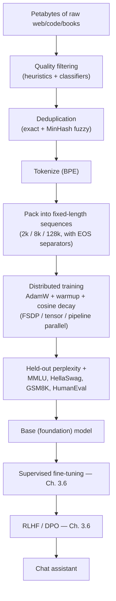
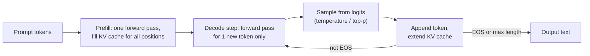

# 3.5 — GPT-family (Decoders) & LLM Pretraining

## 1. Overview

**What is it?** A GPT (Generative Pretrained Transformer) is a Transformer *decoder* — a stack of masked self-attention and feed-forward layers — trained on one deceptively simple objective: **predict the next token**. Given trillions of tokens of text and code scraped from the internet, the model learns grammar, world facts, reasoning patterns, and programming idioms, all as a side effect of getting better at that single prediction task.

**Why does it exist?** Before GPT-style pretraining, every NLP task needed its own labeled dataset and its own model. The GPT line of work (GPT-1 in 2018 through GPT-4 and beyond) showed that a single generatively-pretrained model can be adapted to almost any language task — first by fine-tuning, then, astonishingly, just by *prompting*. Scaling the same recipe (more parameters, more data, more compute) kept producing qualitatively new capabilities.

**What problem does it solve?** It produces a *foundation model*: a general-purpose engine for text generation, understanding, and reasoning on which everything downstream — chat assistants, coding copilots, agents, RAG systems — is built via fine-tuning ([Chapter 3.7](07-lora-peft.md)), alignment ([Chapter 3.6](06-rlhf-dpo.md)), or prompting ([Chapter 3.8](08-prompt-engineering.md)).

**Where is it used?** ChatGPT, Claude, Gemini, Llama, Mistral, DeepSeek, GitHub Copilot, Cursor — every modern large language model you have interacted with is, at its core, a scaled-up next-token predictor.

## 2. Learning Objectives

After this chapter you will be able to:

- Write down the next-token prediction (autoregressive language modeling) objective and explain why it is exactly maximum-likelihood estimation.
- Define perplexity, compute it by hand for a tiny example, and interpret its value.
- Explain and implement greedy decoding, temperature scaling, top-k, and top-p (nucleus) sampling.
- State the Chinchilla scaling law, define every symbol, and use it to decide how many tokens to train a model of a given size on.
- Estimate the training FLOPs of an LLM using the \(C \approx 6ND\) rule and its memory footprint from parameter, optimizer, and activation costs.
- Describe the full pretraining data pipeline: crawling, filtering, deduplication, tokenization, and sequence packing.
- Explain what emergent abilities are, give concrete examples, and summarize the debate about whether they are real or metric artifacts.
- Implement a KV cache from scratch and explain why it turns generation from \(O(T^2)\) per token into \(O(T)\).
- Train a small GPT end-to-end on a text corpus and generate samples from it.
- Recognize the main inference optimizations used in production: FlashAttention, PagedAttention, speculative decoding, quantization.

## 3. Prerequisites

| Chapter | Why you need it |
|---|---|
| [Attention & Self-Attention](../phase-2-deep-learning/09-attention.md) | GPT's core computation is masked (causal) self-attention. |
| [Transformer](../phase-2-deep-learning/10-transformer.md) | GPT is the decoder half of the Transformer; you must know the block structure. |
| [Tokenization](01-tokenization.md) | The model predicts *tokens*, not words — BPE vocabularies define the prediction space. |
| [Loss Functions](../phase-2-deep-learning/04-loss-functions.md) | The training loss is cross-entropy over the vocabulary. |
| [Optimizers](../phase-2-deep-learning/05-optimizers.md) | Pretraining uses AdamW with warmup + cosine decay; you should know why. |
| [BERT & Encoders](04-bert.md) | Understanding the encoder/masked-LM alternative clarifies what makes decoders generative. |

## 4. Intuition

Imagine the world's most obsessive game of "finish my sentence." You hand a friend the text *"The capital of France is"* and ask them to guess the next word. To guess well, they need vocabulary and grammar. To guess *"Paris"*, they need geography. To finish *"import numpy as"* with *"np"*, they need programming conventions. To finish *"Therefore, x ="* in a math proof, they need to actually do the math.

That is the whole trick: **next-token prediction is a lossless compression of every skill needed to produce the text.** If the training corpus contains encyclopedias, novels, forum arguments, and GitHub repositories, then predicting it well *requires* absorbing facts, style, dialogue, and code.

An everyday analogy: think of an apprentice chef who never gets explicit lessons but watches thousands of hours of cooking videos and is quizzed constantly — "what does the chef do next?" At first they only learn surface patterns (knives follow cutting boards). With enough exposure, predicting the next action forces them to internalize *why* chefs do things — the recipe logic itself. GPT is that apprentice, and the internet is its endless cooking channel.

A second key intuition: generation is just prediction run in a loop. The model predicts a probability distribution over the next token, we pick one (sampling), append it to the input, and repeat. There is no separate "generation module" — the crystal ball and the author are the same network.

## 5. Real-world Motivation

- **OpenAI** built GPT-3 (175B parameters, 2020) and demonstrated that a single pretrained model could translate, summarize, answer questions, and write code from a few in-prompt examples — no gradient updates. GPT-4 and its successors power ChatGPT, one of the fastest-growing consumer products in history.
- **Meta** open-sourced the Llama family (Llama 2, Llama 3), letting the entire industry build on strong pretrained bases; thousands of fine-tuned derivatives exist on Hugging Face.
- **Google DeepMind** trains the Gemini family and produced the *Chinchilla* paper that redefined how the industry allocates compute between model size and data.
- **Microsoft** integrates GPT models into GitHub Copilot, Office Copilot, and Bing — pretraining on code (as in Codex, StarCoder, DeepSeek-Coder) turned out to be one of the most commercially valuable specializations.
- **Anthropic**, **Mistral**, **DeepSeek**, and **xAI** all compete on the efficiency frontier: better data curation and architecture tweaks (grouped-query attention, mixture-of-experts) to get more capability per FLOP.

The economics explain the obsession: pretraining a frontier model costs tens of millions of dollars in compute, so getting the scaling recipe right (Section 6.4) is worth entire research teams.

## 6. Mathematical Foundations

### 6.1 The autoregressive factorization

Any joint distribution over a token sequence \(x = (x_1, \ldots, x_T)\) factorizes exactly by the chain rule of probability:

$$
P(x_1, \ldots, x_T) = \prod_{t=1}^{T} P(x_t \mid x_1, \ldots, x_{t-1}) = \prod_{t=1}^{T} P(x_t \mid x_{<t})
$$

where \(x_t\) is the token at position \(t\), \(T\) is the sequence length, and \(x_{<t}\) denotes all tokens before position \(t\). This is not an approximation — it is an identity. A GPT parameterizes each conditional \(P_\theta(x_t \mid x_{<t})\) with a Transformer decoder whose causal mask guarantees position \(t\) only attends to positions \(\le t\).

### 6.2 The training objective

We minimize the negative log-likelihood (cross-entropy) over the corpus:

$$
\mathcal{L}(\theta) = -\sum_{t=1}^{T} \log P_\theta(x_t \mid x_{<t})
$$

Here \(\theta\) is the set of all model parameters. Concretely, the model outputs *logits* \(z \in \mathbb{R}^{V}\) at each position (\(V\) = vocabulary size, typically 32k–128k), converts them to probabilities via softmax:

$$
P_\theta(x_t = i \mid x_{<t}) = \frac{e^{z_i}}{\sum_{j=1}^{V} e^{z_j}}
$$

and the loss at each position is \(-\log\) of the probability assigned to the true next token. Minimizing this is exactly **maximum-likelihood estimation** of a multinomial distribution at every position — every training token is a supervised label, which is why "self-supervised" pretraining has effectively unlimited labels.

### 6.3 Perplexity

Perplexity is the exponentiated average per-token loss:

$$
\text{PPL} = \exp\!\left(\frac{1}{T}\sum_{t=1}^{T} -\log P_\theta(x_t \mid x_{<t})\right)
$$

**Interpretation:** perplexity is the geometric mean of the inverse probabilities — "on average, the model is as confused as if it were choosing uniformly among PPL tokens." A perplexity of 1 means perfect prediction; a perplexity of \(V\) means the model is no better than uniform guessing. Modern LLMs achieve single-digit perplexity on web text. Perplexity is only comparable between models that share a tokenizer, because it is measured *per token*, and different tokenizers split text into different numbers of tokens.

### 6.4 Scaling laws and Chinchilla

Kaplan et al. (2020) found that loss falls as a power law in parameters \(N\), data \(D\), and compute \(C\). Hoffmann et al. (2022, "Chinchilla") refined the picture with a parametric fit:

$$
L(N, D) = E + \frac{A}{N^\alpha} + \frac{B}{D^\beta}
$$

- \(L\): final training loss (nats/token);
- \(N\): number of model parameters; \(D\): number of training tokens;
- \(E \approx 1.69\): irreducible entropy of natural text — the loss even an infinite model with infinite data cannot beat;
- \(A, B, \alpha, \beta\): fitted constants (\(\alpha \approx 0.34\), \(\beta \approx 0.28\) in the paper).

Training compute is well approximated by

$$
C \approx 6\,N\,D \ \text{FLOPs}
$$

(2 FLOPs per parameter per token for the forward pass, roughly 4 for backward). Minimizing \(L(N, D)\) subject to \(6ND = C\) fixed gives the **Chinchilla-optimal** allocation: \(N\) and \(D\) should scale together, roughly

$$
D^\ast \approx 20\,N^\ast
$$

— about **20 tokens per parameter**. GPT-3 (175B params, 300B tokens ≈ 1.7 tokens/param) was badly undertrained; Chinchilla (70B params, 1.4T tokens) matched it at a quarter of the size. Modern open models (Llama 3 at 15T tokens for 8B params) deliberately *over*train past the Chinchilla point because inference cost depends on \(N\) alone — a smaller model trained longer is cheaper to serve forever.

### 6.5 Sampling strategies

At generation time we must pick a token from \(P_\theta(\cdot \mid x_{<t})\). Let \(z_i\) be the logit for token \(i\).

| Strategy | Rule | Effect |
|---|---|---|
| Greedy | \(\arg\max_i z_i\) | Deterministic; prone to repetition loops |
| Temperature \(\tau\) | \(p_i \propto e^{z_i / \tau}\) | \(\tau < 1\) sharpens (more confident), \(\tau > 1\) flattens (more random); \(\tau \to 0\) recovers greedy |
| Top-k | Zero out all but the \(k\) largest logits, renormalize | Removes the long tail of unlikely tokens |
| Top-p (nucleus) | Keep the smallest set of tokens whose cumulative probability \(\ge p\), renormalize | Adaptive cutoff: small set when confident, large when uncertain |
| Min-p | Keep tokens with \(p_i \ge p_{\min} \cdot \max_j p_j\) | Scales the cutoff with peak confidence |
| Repetition penalty | Divide (or subtract from) logits of already-generated tokens | Fights degenerate loops |

Typical production defaults: \(\tau = 0.7\), top-p \(= 0.9\). For code or math, lower temperature (0–0.3) is standard.

### 6.6 Emergent abilities

Wei et al. (2022) documented capabilities that appear roughly *discontinuously* with scale: multi-step arithmetic, in-context learning of novel tasks, chain-of-thought reasoning ([Chapter 3.8](08-prompt-engineering.md)) that helps only above ~50–100B parameters. Schaeffer et al. (2023) countered that many "emergences" are artifacts of discontinuous metrics (exact-match accuracy) applied to smoothly improving log-likelihoods. The practical takeaway: capability curves on hard tasks are nonlinear in scale, so extrapolating small-model results is dangerous in both directions.

## 7. Visual Explanation

The full lifecycle from raw data to a chat model:



And the inner loop of autoregressive generation with a KV cache:



ASCII view of the causal mask for \(T = 4\) (✓ = allowed to attend):

```
          key 1  key 2  key 3  key 4
query 1     ✓      ·      ·      ·
query 2     ✓      ✓      ·      ·
query 3     ✓      ✓      ✓      ·
query 4     ✓      ✓      ✓      ✓
```

## 8. Algorithm

**Pretraining:**

1. **Curate data.** Combine sources (Common Crawl derivatives like C4/RefinedWeb/FineWeb, code from GitHub, books, Wikipedia, arXiv). Filter for quality (language ID, perplexity filters, ML quality classifiers), remove PII and toxic content, deduplicate exactly (hashes) and fuzzily (MinHash/LSH). Deduplication measurably improves downstream quality and reduces memorization.
2. **Tokenize** the whole corpus with a trained BPE tokenizer ([Chapter 3.1](01-tokenization.md)).
3. **Pack** tokens into fixed-length training sequences (e.g., 4096 tokens), inserting an end-of-document token between documents so the model learns document boundaries.
4. **Train** the Transformer decoder with AdamW (\(\beta_1{=}0.9, \beta_2{=}0.95\), weight decay 0.1), linear warmup (~1–2k steps) then cosine decay to ~10% of peak LR, global batch sizes of 1M–4M tokens, gradient clipping at 1.0, bf16 mixed precision.
5. **Evaluate** continuously: held-out perplexity plus downstream benchmarks (MMLU for knowledge, HellaSwag for commonsense, GSM8K for math, HumanEval for code) — see [Chapter 3.12](12-llm-evaluation.md).
6. **Hand off** the base model to alignment ([Chapter 3.6](06-rlhf-dpo.md)).

**Generation** (pseudocode):

```
function generate(model, prompt_ids, max_new, temperature, top_p):
    kv_cache = model.prefill(prompt_ids)          # one pass over the prompt
    ids = prompt_ids
    repeat max_new times:
        logits = model.decode_step(ids[-1], kv_cache)   # 1 token, uses cache
        logits = logits / temperature
        probs  = softmax(logits)
        probs  = nucleus_filter(probs, top_p)           # keep smallest set ≥ p
        next   = sample(probs)
        if next == EOS: break
        ids.append(next)
    return ids
```

## 9. Worked Example

**Tiny example by hand.** Vocabulary = {`the`, `cat`, `sat`, `mat`}, \(V = 4\). The model sees context "the cat" and outputs logits \(z = [0.5,\ 0.1,\ 2.0,\ 0.2]\) for the next token. True next token: `sat` (index 3).

Softmax denominator: \(e^{0.5} + e^{0.1} + e^{2.0} + e^{0.2} = 1.649 + 1.105 + 7.389 + 1.221 = 11.364\).

$$
P(\texttt{sat}) = \frac{7.389}{11.364} = 0.650, \qquad \mathcal{L}_t = -\log 0.650 = 0.431
$$

If the average loss over a 100-token evaluation set is 0.431 nats/token, perplexity is \(e^{0.431} \approx 1.54\) — the model is as uncertain as choosing among ~1.5 equally likely tokens. Now apply temperature \(\tau = 0.5\): logits double to \([1.0, 0.2, 4.0, 0.4]\), and \(P(\texttt{sat})\) jumps to \(\approx 0.93\) — sharper. With \(\tau = 2\), \(P(\texttt{sat})\) drops to \(\approx 0.44\) — flatter.

**Top-p by hand.** Sorted probabilities: \([0.65, 0.145, 0.107, 0.097]\). With \(p = 0.7\): cumulative sums are \(0.65, 0.795, \ldots\) — we need `sat` plus one more token to exceed 0.7, so the nucleus is {`sat`, `the`}, renormalized to \([0.817, 0.183]\).

**Realistic scale.** Llama-3-8B: \(N = 8\times10^9\), trained on \(D = 15\times10^{12}\) tokens. Training compute \(C \approx 6ND = 7.2 \times 10^{23}\) FLOPs. At 400 TFLOP/s effective throughput per H100 GPU, that is \(\approx 1.8\times10^{9}\) GPU-seconds ≈ 21,000 GPU-days — why frontier pretraining requires clusters of thousands of GPUs for weeks.

## 10. Python from Scratch

Sampling strategies and a KV cache sketch in pure NumPy — no ML framework, no magic:

```python
import numpy as np

def softmax(z):
    z = z - z.max()                      # subtract max for numerical stability
    e = np.exp(z)
    return e / e.sum()

def sample_next(logits, temperature=1.0, top_k=None, top_p=None, rng=None):
    """Pick the next token id from a logits vector of shape (V,)."""
    rng = rng or np.random.default_rng()
    logits = logits / temperature        # tau < 1 sharpens, tau > 1 flattens

    if top_k is not None:                # keep only the k largest logits
        kth = np.sort(logits)[-top_k]    # value of the k-th largest logit
        logits = np.where(logits < kth, -np.inf, logits)

    probs = softmax(logits)

    if top_p is not None:                # nucleus: smallest set with cum prob >= p
        order = np.argsort(-probs)       # indices sorted by descending prob
        csum = np.cumsum(probs[order])
        # first index where cumulative prob reaches p; keep everything up to it
        cutoff = np.searchsorted(csum, top_p) + 1
        keep = order[:cutoff]
        mask = np.full_like(probs, 0.0)
        mask[keep] = probs[keep]
        probs = mask / mask.sum()        # renormalize the surviving mass

    return rng.choice(len(probs), p=probs)

# --- toy demo: V=4 vocabulary from the worked example ---
logits = np.array([0.5, 0.1, 2.0, 0.2])
print(sample_next(logits, temperature=0.7, top_p=0.9))   # usually prints 2 ("sat")
```

A minimal KV cache for one attention head, showing why cached decoding is \(O(T)\) per step instead of \(O(T^2)\):

```python
class KVCache:
    """Stores keys/values for all past positions of one attention head."""
    def __init__(self, d_head):
        self.K = np.zeros((0, d_head))   # (t, d_head) — grows by 1 row per step
        self.V = np.zeros((0, d_head))

    def step(self, q_new, k_new, v_new):
        # append this step's key/value — computed ONCE, reused forever
        self.K = np.vstack([self.K, k_new])          # (t+1, d_head)
        self.V = np.vstack([self.V, v_new])
        # attention for the single new query against all cached keys
        scores = self.K @ q_new / np.sqrt(len(q_new))  # (t+1,)
        attn = softmax(scores)                          # (t+1,)
        return attn @ self.V                            # (d_head,) context vector
```

Without the cache, generating token \(t\) recomputes keys/values for all \(t\) past positions; total work over \(T\) tokens is \(O(T^2)\) *per layer just in recomputation*. With the cache, each step does one new K/V projection and one \((t)\)-length dot-product — the recomputation vanishes.

> [!WARNING]
> **Common bug:** implementing top-p by keeping tokens *strictly below* the cumulative threshold. If the single most likely token already has probability > p, you would keep *zero* tokens and crash (or sample from garbage). Always include the token that crosses the threshold — that is what `+ 1` above does.

## 11. Library Implementation

Training loop for a small GPT (reusing the MiniGPT decoder from the [Transformer chapter](../phase-2-deep-learning/10-transformer.md)):

```python
import torch
import torch.nn.functional as F

V = 50257                                             # vocabulary size
opt = torch.optim.AdamW(model.parameters(),
                        lr=3e-4,                      # peak learning rate
                        betas=(0.9, 0.95),            # beta2=0.95 standard for LLMs
                        weight_decay=0.1)             # decoupled weight decay
warmup = 1000
sched = torch.optim.lr_scheduler.LambdaLR(
    opt, lambda s: min(1.0, s / warmup))              # linear warmup (add cosine decay for real runs)

for step, (x, y) in enumerate(loader):
    # x: (B, T) input token ids; y: (B, T) = x shifted left by one position
    logits = model(x)                                 # (B, T, V) — one prediction per position
    loss = F.cross_entropy(logits.view(-1, V),        # (B*T, V)
                           y.view(-1))                # (B*T,) — mean NLL per token
    opt.zero_grad()
    loss.backward()
    torch.nn.utils.clip_grad_norm_(model.parameters(), 1.0)  # prevents loss spikes
    opt.step(); sched.step()
    if step % 100 == 0:
        print(f"step {step}  loss {loss.item():.3f}  ppl {loss.exp().item():.1f}")
```

Inference with a pretrained model via Hugging Face:

```python
from transformers import AutoTokenizer, AutoModelForCausalLM

tok = AutoTokenizer.from_pretrained("meta-llama/Meta-Llama-3-8B")
model = AutoModelForCausalLM.from_pretrained(
    "meta-llama/Meta-Llama-3-8B",
    torch_dtype="bfloat16",      # halves memory vs fp32 with negligible quality loss
    device_map="auto")           # spreads layers across available GPUs

ids = tok("The capital of France is", return_tensors="pt").to(model.device)
out = model.generate(**ids,
                     max_new_tokens=50,
                     do_sample=True,          # sampling, not greedy
                     temperature=0.7,
                     top_p=0.9,
                     pad_token_id=tok.eos_token_id)  # avoids a warning/bug: Llama has no pad token
print(tok.decode(out[0], skip_special_tokens=True))
# Expected: "The capital of France is Paris. Paris is known for..." (varies per sample)
```

> [!TIP]
> The single most common inference bug is a **tokenizer/model mismatch** — loading a checkpoint with a different tokenizer produces fluent-looking garbage because the token-id → embedding mapping is scrambled. Always load both from the same repo.

## 12. Code Walkthrough

For one training step of the loop above, with batch size \(B = 8\), context \(T = 1024\), vocab \(V = 50257\), model width \(d = 768\) (GPT-2-small scale):

| Tensor | Shape | Meaning |
|---|---|---|
| `x` | (8, 1024) | Input token ids |
| `y` | (8, 1024) | Targets: `x` shifted left by one, with an EOS/next-doc token at the end |
| token embeddings | (8, 1024, 768) | Learned vector per token, plus positional information |
| per-layer activations | (8, 1024, 768) | Hidden states after each of the 12 blocks |
| KV cache (inference only) | 2 × (8, n_heads, t, d_head) per layer | Cached keys and values for all past positions |
| `logits` | (8, 1024, 50257) | Unnormalized next-token scores for every position |
| `loss` | scalar | Mean cross-entropy over all 8×1024 positions |

Expected behavior: loss starts near \(\ln V \approx 10.8\) (uniform guessing over 50k tokens) and, on a small Shakespeare corpus, drops below 1.5 within a few thousand steps. **Every position trains simultaneously** — this is *teacher forcing*: during training the model always conditions on the *true* prefix, never on its own samples, which is why one forward pass yields \(B \times T\) supervised examples.

The logits tensor is often the single largest activation: \(8 \times 1024 \times 50257 \times 2\) bytes ≈ 0.8 GB in bf16 — one reason fused/chunked cross-entropy kernels matter at scale.

## 13. Complexity Analysis

**Training time.** Total FLOPs \(C \approx 6ND\) (Section 6.4): the forward pass costs ~\(2N\) FLOPs per token (every parameter participates in one multiply-accumulate), and the backward pass roughly twice that. Attention adds \(O(L \cdot T^2 \cdot d)\) per sequence (\(L\) layers, \(T\) context, \(d\) width), which is minor at \(T \le 4\)k but dominates at 100k+ contexts — motivating FlashAttention and sparse/linear attention variants.

**Training memory** per parameter with AdamW in mixed precision: 2 bytes (bf16 weights) + 4 bytes (fp32 master weights) + 8 bytes (Adam first/second moments) + 2 bytes (gradients) ≈ **16 bytes/param** — a 7B model needs ~112 GB before activations, hence sharded training (FSDP/ZeRO). Activations add \(O(B \cdot T \cdot d \cdot L)\), cut ~\(\sqrt{L}\)-fold by gradient checkpointing.

**Inference.** With a KV cache, each generated token costs \(O(N)\) FLOPs for the MLPs/projections plus \(O(t \cdot d \cdot L)\) for attention against \(t\) cached positions — linear per token, quadratic total. The KV cache itself occupies \(2 \cdot L \cdot T \cdot n_{kv} \cdot d_{head} \cdot 2\) bytes; for Llama-3-8B at 8k context this is ~1 GB *per sequence*, which is why grouped-query attention (fewer KV heads) and PagedAttention exist.

## 14. Advantages

- **One objective, unlimited labels.** Every token of the internet is a training example; no annotation cost. Example: The Pile and FineWeb provide trillions of "labels" for free.
- **General-purpose via prompting.** A single model handles translation, summarization, coding, and QA — GPT-3's few-shot results eliminated per-task model zoos.
- **Predictable scaling.** Loss follows power laws, so labs can forecast a big run's quality from small pilot runs — GPT-4's technical report describes exactly this methodology.
- **Composable foundation.** Everything downstream (RLHF, LoRA, RAG, agents — Chapters 3.6–3.11) builds on the same base model.
- **Emergent few-shot reasoning.** Above certain scales, chain-of-thought prompting unlocks math and logic performance no small model shows.

## 15. Disadvantages

- **Enormous compute and cost.** Frontier pretraining runs cost \$10M–\$100M+; only a handful of organizations can perform them.
- **Hallucination.** The objective rewards *plausible* continuations, not *true* ones; the model will confidently invent citations and API functions. Mitigations (RAG — [Chapter 3.9](09-rag.md)) treat symptoms, not the cause.
- **Static knowledge.** The model knows nothing after its data cutoff; updating requires retraining or retrieval.
- **Expensive, sequential inference.** Tokens are generated one at a time; latency and cost per query dwarf classical NLP models.
- **Data contamination and memorization.** Benchmarks leak into training crawls, inflating scores; verbatim memorization raises copyright and privacy issues.
- **When not to use it:** regex-solvable extraction, sub-5ms latency paths, or tasks demanding exact deterministic outputs.

## 16. Common Mistakes

- **Mismatched tokenizer at inference** → fluent garbage. *Fix:* always load model and tokenizer from the same checkpoint.
- **Forgetting `eos_token_id`/`pad_token_id` in `generate()`** → the model rambles to `max_new_tokens` or crashes on batched generation. *Fix:* set `pad_token_id=tok.eos_token_id` for models without a pad token.
- **Off-by-one in targets** — training with `y = x` instead of `x` shifted left teaches the model to copy its input (loss ≈ 0, useless model). *Fix:* verify `y[t] == x[t+1]` on a sample batch.
- **Benchmark contamination** — evaluating on data present in the training crawl. *Fix:* n-gram decontamination of eval sets against the corpus.
- **Comparing perplexity across tokenizers** — a model with a coarser tokenizer looks worse per token. *Fix:* compare bits-per-byte, or hold the tokenizer fixed.
- **No warmup / no gradient clipping** → loss spikes and divergence early in training. *Fix:* linear warmup + clip at 1.0, and monitor gradient norms.

## 17. Best Practices

- [ ] Deduplicate training data (exact + MinHash); it improves quality and reduces memorization.
- [ ] Decontaminate evaluation benchmarks from the training set before trusting any score.
- [ ] Use AdamW with \(\beta_2 = 0.95\), weight decay 0.1, warmup + cosine decay; log loss, LR, and grad-norm curves.
- [ ] Train in bf16 (not fp16) to avoid loss-scale instabilities at scale.
- [ ] Size model vs data with Chinchilla as a floor, then overtrain if inference cost matters (it usually does).
- [ ] Checkpoint frequently and keep optimizer state — pretraining runs fail and must resume.
- [ ] Evaluate on a suite ([Chapter 3.12](12-llm-evaluation.md)), never a single benchmark.
- [ ] For deployment: greedy/low temperature for factual or code tasks, top-p ~0.9 for creative ones; always cap `max_new_tokens`.

## 18. Optimization Techniques

- **Mixed precision (bf16):** halves memory and roughly doubles throughput on modern GPUs; keep fp32 master weights in the optimizer.
- **FlashAttention:** computes exact attention without materializing the \(T \times T\) score matrix — memory drops from \(O(T^2)\) to \(O(T)\), with large wall-clock speedups.
- **Gradient checkpointing:** discard activations in the forward pass, recompute in backward; trades ~30% extra compute for ~\(\sqrt{L}\) less activation memory.
- **Parallelism:** data parallel + FSDP/ZeRO (shard params/grads/optimizer states), tensor parallel (split matmuls across GPUs), pipeline parallel (split layers), expert parallel for MoE.
- **KV cache + grouped-query attention (GQA):** cache keys/values; share KV heads across query heads to shrink the cache 4–8×.
- **PagedAttention (vLLM):** manage KV cache in fixed-size pages like virtual memory — near-zero fragmentation, much higher serving throughput.
- **Speculative decoding:** a small draft model proposes \(k\) tokens; the large model verifies them in one parallel pass — 2–3× generation speedup with *identical* output distribution.
- **Quantization (INT8/INT4/FP8):** shrink weights for inference; see [Chapter 3.7](07-lora-peft.md) for NF4 and [Model Compression](../phase-6-advanced/04-model-compression.md).

## 19. Industry Applications

- **Conversational assistants:** ChatGPT (OpenAI), Claude (Anthropic), Gemini (Google) — pretraining + alignment, served at massive scale.
- **Coding assistants:** GitHub Copilot and Cursor build on code-heavy pretraining (Codex lineage, StarCoder, DeepSeek-Coder); code data also measurably improves general reasoning.
- **Open-weight ecosystems:** Meta's Llama releases power thousands of fine-tuned commercial and research derivatives.
- **Enterprise platforms:** Microsoft Azure OpenAI, Amazon Bedrock, and Google Vertex AI resell foundation-model inference as infrastructure.
- **Efficiency-focused labs:** Mistral (sliding-window attention, MoE in Mixtral) and DeepSeek (multi-head latent attention, aggressive MoE) compete on capability per training and serving dollar.
- **Production example:** a typical LLM API deployment runs a GQA model under vLLM with PagedAttention, FP8 weights, continuous batching, and speculative decoding — the full Section 18 stack in one serving binary.

## 20. Interview Questions

### Beginner

**Q: What objective is a GPT trained on, and what loss function implements it?**
A: Next-token prediction: maximize \(\sum_t \log P_\theta(x_t \mid x_{<t})\), implemented as cross-entropy between the model's softmax distribution and the true next token at every position. It is maximum-likelihood estimation of the autoregressive factorization.

**Q: What is perplexity and how do you interpret PPL = 20?**
A: The exponentiated average negative log-likelihood per token, \(e^{\mathcal{L}/T}\). PPL = 20 means the model is on average as uncertain as if choosing uniformly among 20 tokens. Lower is better; it is only comparable across models sharing a tokenizer.

**Q: How does a GPT differ from BERT?**
A: GPT is a decoder with a causal mask, trained to predict the next token, so it can generate text. BERT ([Chapter 3.4](04-bert.md)) is a bidirectional encoder trained with masked-LM; it excels at understanding/classification but cannot naturally generate.

**Q: What does temperature do during sampling?**
A: It divides the logits before softmax: \(\tau < 1\) sharpens the distribution toward the argmax (more deterministic), \(\tau > 1\) flattens it (more diverse/random); \(\tau \to 0\) recovers greedy decoding.

**Q: Why does the same model that "predicts text" also generate text?**
A: Generation is prediction in a loop: sample one token from the predicted distribution, append it to the context, and predict again until EOS or a length limit.

### Intermediate

**Q: State the Chinchilla result and its practical implication.**
A: For a fixed compute budget \(C \approx 6ND\), loss \(L(N,D) = E + A/N^\alpha + B/D^\beta\) is minimized when parameters and tokens scale together, roughly \(D \approx 20N\). Implication: many earlier models (GPT-3) were undertrained; and since serving cost depends on \(N\), production models are deliberately trained *past* Chinchilla-optimal on far more tokens.

**Q: Explain top-p (nucleus) sampling vs top-k.**
A: Top-k keeps a fixed number \(k\) of highest-probability tokens. Top-p keeps the smallest set whose cumulative probability ≥ \(p\), so the candidate-set size adapts: small when the model is confident, large when it's uncertain. Top-p avoids top-k's failure modes of cutting valid options (peaked distribution, small tail) or including junk (flat distribution).

**Q: What is a KV cache and what does it store?**
A: During generation, the keys and values of all past positions in every attention layer are computed once and cached; each new token only computes its own Q/K/V and attends against the cache. It stores tensors of shape (layers × KV-heads × past-length × head-dim) for K and V, reducing per-token cost from recomputing the whole prefix to a single-token forward pass.

**Q: What is teacher forcing and why does it make training efficient?**
A: During training the model conditions on the *true* prefix at every position (not its own samples), so all \(T\) positions of a sequence are trained in parallel in one forward pass under the causal mask — \(B \times T\) supervised examples per batch.

**Q: Why can't you compare perplexities of Llama and GPT-2 directly?**
A: They use different tokenizers, so "per token" means different amounts of text. Compare bits-per-byte (normalizing by raw text length) instead.

### Advanced

**Q: Derive the \(C \approx 6ND\) FLOP estimate.**
A: Each parameter participates in one multiply-accumulate per token in the forward pass ≈ \(2N\) FLOPs/token. The backward pass computes gradients w.r.t. both activations and weights, ≈ \(4N\) FLOPs/token. Total \(6N\) per token × \(D\) tokens. This ignores attention's \(O(T^2 d)\) term, which is small relative to \(12 d^2\) per layer when \(T \ll 6d\).

**Q: Are emergent abilities real or a measurement artifact?**
A: Both views have evidence. Wei et al. showed sharp capability jumps (arithmetic, CoT) at scale thresholds. Schaeffer et al. showed many jumps disappear under smooth metrics (token-level likelihood improves continuously; exact-match accuracy is a step function of it). Practically: underlying competence improves smoothly, but *task-level* performance can still transition sharply, which matters for deployment risk.

**Q: How does speculative decoding accelerate generation without changing the output distribution?**
A: A cheap draft model proposes \(k\) tokens; the target model scores all \(k\) in one parallel forward pass. Each draft token is accepted with probability \(\min(1, p_{\text{target}}/p_{\text{draft}})\); on the first rejection, a corrected token is sampled from the residual distribution \(\propto \max(0, p_{\text{target}} - p_{\text{draft}})\). This rejection-sampling scheme provably yields exact samples from the target model while amortizing its cost.

**Q: Why does grouped-query attention (GQA) exist, and what does it trade off?**
A: The KV cache is the memory bottleneck for long-context serving. GQA shares each K/V head across a group of query heads (e.g., 32 Q heads, 8 KV heads), shrinking the cache 4× with minimal quality loss; multi-query attention (1 KV head) is the extreme case with a larger quality trade-off.

**Q: Why did Llama 3 train an 8B model on 15T tokens (~1,875 tokens/param), far past Chinchilla-optimal?**
A: Chinchilla optimizes *training* compute only. Total lifecycle cost includes inference, which scales with \(N\) per query forever. Overtraining a small model shifts cost from serving to a one-time training bill, and the loss curve, while past its compute-optimal point, keeps improving.

## 21. Coding Exercises

### Easy

1. **Implement temperature + top-k sampling** as a function `sample(logits, temperature, top_k)` in NumPy. Verify \(\tau \to 0\) matches argmax. *Hint:* mask non-top-k logits with \(-\infty\) before softmax.
2. **Compute perplexity** of a unigram model on a small text: estimate token frequencies, compute average NLL, exponentiate. *Hint:* smooth zero counts (add-one) or held-out tokens give infinite PPL.

### Medium

1. **Implement top-p (nucleus) sampling** including the edge case where the top token alone exceeds \(p\). Test on peaked and flat distributions. *Hint:* sort descending, cumulative-sum, keep through the crossing index.
2. **Add repetition penalty** to your sampler: divide logits of previously generated tokens by penalty \(\rho > 1\) (careful: for negative logits, *multiply*). Show it breaks a repetition loop in a greedy decoder. *Hint:* follow the CTRL-paper formulation.
3. **Reproduce a nanoGPT loss curve** on TinyShakespeare (~1 MB): character-level model, plot train/val loss, generate samples every 500 steps and watch coherence emerge. *Hint:* a 4-layer, 128-dim model trains in minutes on a laptop GPU.

### Hard

1. **Implement a KV cache** in a small PyTorch GPT: add a `past_kv` argument to attention, verify cached generation is token-identical to uncached (greedy), and benchmark the speedup at 512+ tokens. *Hint:* the causal mask for a single new query against \(t\) cached keys is all-ones — no mask needed at decode time.
2. **Fit a mini scaling law:** train 4 models (0.5M–10M params) on token budgets from 1M–50M, fit \(L = E + A/N^\alpha + B/D^\beta\) by least squares, and predict a 5th configuration's loss before running it. *Hint:* fit in log space; expect noisy exponents at this scale.
3. **Implement greedy speculative decoding** with a 2-layer draft model and your full model as verifier; verify outputs match plain greedy decoding exactly and measure accepted-tokens-per-step. *Hint:* under greedy, acceptance is simply "draft argmax == target argmax".

## 22. Mini Project

**Train nanoGPT on your own corpus.**

1. Collect ~10 MB of text you like (a public-domain author from Project Gutenberg, your own notes, a codebase).
2. Train a character-level or BPE tokenizer ([Chapter 3.1](01-tokenization.md)) and encode the corpus into a single token array.
3. Build batches by sampling random windows: `x = data[i:i+T]`, `y = data[i+1:i+T+1]` with \(T = 256\).
4. Implement or reuse a 4–6 layer decoder (from [Chapter 2.10](../phase-2-deep-learning/10-transformer.md)); train with the Section 11 loop for ~5,000 steps.
5. Every 500 steps, log validation loss and generate a 200-token sample at \(\tau \in \{0.5, 0.8, 1.2\}\).
6. Deliverable: loss curves plus a short write-up on how sample quality changes with training steps and temperature.

## 23. Medium Project

**Domain-continual pretraining.**

1. Choose a domain corpus (e.g., PubMed abstracts, legal opinions, or your company's docs) of 50–500 MB.
2. Load a small open base model (e.g., a 1–3B parameter Llama/Qwen variant) and measure its perplexity on held-out domain text — your baseline.
3. Continue pretraining with the causal-LM objective on the domain data, using LoRA ([Chapter 3.7](07-lora-peft.md)) to fit on one GPU; mix in ~10–20% general web text to limit catastrophic forgetting.
4. Track domain perplexity *and* general-benchmark scores (e.g., a HellaSwag subset) throughout training.
5. Ablate the replay ratio (0%, 10%, 30% general data) and report the domain-gain vs general-loss trade-off curve.
6. Deliverable: a report recommending a replay ratio, with perplexity and benchmark tables.

## 24. Advanced Project

**Pretrain a ~300M-parameter LLM from scratch on ~6B tokens.**

*Architecture:* 24-layer decoder, \(d = 1024\), 16 heads (GQA with 4 KV heads), SwiGLU MLPs, RMSNorm, rotary position embeddings, 32k BPE vocabulary — a scaled-down Llama.


*Implementation phases:*

1. **Data:** download a FineWeb-Edu sample; run dedup and eval-set decontamination; train the tokenizer; pre-tokenize to a memory-mapped binary.
2. **Model & infra:** implement the architecture; wrap in FSDP; add bf16, gradient checkpointing, grad-norm logging, and resumable checkpointing. Validate with a 10M-param smoke run first.
3. **Training:** run to 6B tokens (~Chinchilla-optimal for 300M); watch for loss spikes; keep tokens/sec and MFU (model FLOPs utilization) dashboards.
4. **Evaluation:** run lm-evaluation-harness at each checkpoint; plot benchmark scores vs tokens seen.
5. **Analysis:** compare your loss trajectory against a Chinchilla-law prediction fitted from your own smaller pilot runs.

*Possible improvements:* extend context to 8k with RoPE scaling; add a cooldown phase on high-quality data (as in recent open recipes); distill or quantize the final model and measure the quality/latency trade-off; add an inference server with KV caching and continuous batching.

## 25. Summary

- A GPT is a Transformer decoder trained by maximum likelihood on next-token prediction — the chain-rule factorization makes this exact, not approximate.
- Cross-entropy loss and perplexity (\(e^{\mathcal{L}/T}\)) are the core training and evaluation quantities; perplexity is tokenizer-dependent.
- Generation = prediction in a loop; sampling strategy (temperature, top-k, top-p) controls the determinism/diversity trade-off.
- Chinchilla: compute-optimal training uses ~20 tokens per parameter; production models deliberately overtrain smaller models because inference cost scales with \(N\).
- Training compute ≈ \(6ND\) FLOPs; memory ≈ 16 bytes/param with AdamW in mixed precision — the numbers that dictate cluster design.
- Data curation (filtering, dedup, decontamination) is as important as architecture; it is a primary competitive differentiator between labs.
- Emergent abilities appear nonlinearly with scale; whether they are "real" discontinuities or metric artifacts is debated, but the deployment implications are the same.
- The KV cache makes generation affordable; GQA, PagedAttention, speculative decoding, and quantization make it fast and cheap in production.
- Teacher forcing lets every token position train in parallel — the source of pretraining's data efficiency per step.
- The base model is only the start: [Chapter 3.6](06-rlhf-dpo.md) turns it into an assistant.

## 26. Cheat Sheet

| Formula | Meaning |
|---|---|
| \(\mathcal{L} = -\sum_t \log P_\theta(x_t \mid x_{<t})\) | Causal LM loss (cross-entropy, MLE) |
| \(\text{PPL} = e^{\mathcal{L}/T}\) | Perplexity: effective branching factor |
| \(p_i \propto e^{z_i/\tau}\) | Temperature sampling |
| \(L(N,D) = E + A/N^\alpha + B/D^\beta\) | Chinchilla loss law |
| \(D^\ast \approx 20N\) | Chinchilla-optimal tokens per parameter |
| \(C \approx 6ND\) | Training FLOPs |
| ~16 bytes/param | Training memory (bf16 + AdamW states) |

**Defaults:** AdamW \((\beta_1{=}0.9, \beta_2{=}0.95)\), wd 0.1, warmup + cosine decay, grad clip 1.0, bf16; inference \(\tau = 0.7\), top-p 0.9 (creative) or \(\tau \le 0.3\) (code/factual).

**One-liners:** loss should start at \(\ln V\); targets are inputs shifted left by one; same tokenizer for train and inference; never compare PPL across tokenizers; decontaminate before you celebrate a benchmark.

**Gotchas:** top-p must include the threshold-crossing token; Llama has no pad token — use EOS; the logits tensor \((B,T,V)\) can dominate activation memory; fp16 (not bf16) pretraining diverges at scale.

## 27. Further Reading

**Books**
- Jurafsky & Martin, *Speech and Language Processing* (3rd ed. draft) — n-grams to LLMs.
- Sebastian Raschka, *Build a Large Language Model (From Scratch)*.

**Research papers**
- Radford et al., *Improving Language Understanding by Generative Pre-Training* (GPT-1, 2018) and *Language Models are Unsupervised Multitask Learners* (GPT-2, 2019).
- Brown et al., *Language Models are Few-Shot Learners* (GPT-3, 2020).
- Kaplan et al., *Scaling Laws for Neural Language Models* (2020); Hoffmann et al., *Training Compute-Optimal Large Language Models* (Chinchilla, 2022).
- Holtzman et al., *The Curious Case of Neural Text Degeneration* (nucleus sampling, 2019).
- Wei et al., *Emergent Abilities of Large Language Models* (2022); Schaeffer et al., *Are Emergent Abilities of Large Language Models a Mirage?* (2023).
- Touvron et al., *LLaMA* / *Llama 2* papers; the *Llama 3 Herd of Models* report (2024).
- Leviathan et al., *Fast Inference from Transformers via Speculative Decoding* (2023); Kwon et al., *Efficient Memory Management for LLM Serving with PagedAttention* (vLLM, 2023).

**Documentation:** Hugging Face Transformers `generate()` docs; vLLM docs; PyTorch FSDP tutorial.

**GitHub repositories:** karpathy/nanoGPT and karpathy/llm.c; EleutherAI/lm-evaluation-harness; EleutherAI/gpt-neox; vllm-project/vllm.

**Datasets:** FineWeb / FineWeb-Edu, The Pile, C4, RefinedWeb, TinyShakespeare, The Stack (code).

**YouTube/Videos:** Andrej Karpathy, "Let's build GPT: from scratch, in code, spelled out" and "Let's reproduce GPT-2 (124M)".

**Blogs:** "The Illustrated GPT-2" (Jay Alammar); Chinchilla explainer posts (e.g., "chinchilla's wild implications"); Lilian Weng's blog on controllable generation and inference optimization.
