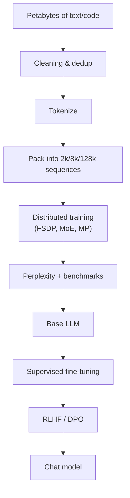

# 3.5 — GPT-family (Decoders) & LLM Pretraining

## 1. Intuition first
A GPT is a Transformer decoder trained to predict the next token. Given trillions of tokens from the internet, it learns grammar, facts, reasoning patterns, and code style — all from that one simple objective.

## 2. Why the topic exists
Scaling next-token prediction with enough compute + data produces emergent capabilities: in-context learning, reasoning, tool use, code synthesis.

## 3. What problem it solves
General-purpose text generation and reasoning. Foundation model that downstream tasks are built on via fine-tuning or prompting.

## 4. Mathematics

### 4.1 Next-token prediction
For sequence $x_1, \ldots, x_T$:

$$
\mathcal{L} = -\sum_{t=1}^T \log P_\theta(x_t \mid x_{<t})
$$

Equivalent to minimizing per-token perplexity: $\text{PPL} = e^{\mathcal{L}/T}$.

### 4.2 Autoregressive generation
$p(x) = \prod_t p(x_t \mid x_{<t})$. Sample or take argmax at each step.

### 4.3 Sampling strategies
- Greedy: $\arg\max$.
- Temperature: $p_i \propto \exp(z_i / \tau)$.
- Top-k: keep top-$k$ logits.
- Top-p (nucleus): smallest set of tokens whose cumulative prob ≥ $p$.
- Typical, mirostat, min-p.
- Repetition penalty, presence/frequency penalties.

### 4.4 Chinchilla scaling laws (Hoffmann 2022)
Optimal training uses ~20 tokens per parameter. Loss follows

$$
L(N, D) = E + \frac{A}{N^\alpha} + \frac{B}{D^\beta}
$$

with $N$ = params, $D$ = tokens.

### 4.5 Emergence
Some abilities (in-context learning, chain-of-thought, arithmetic) appear at scale thresholds.

## 5. Every formula explained
- CE = MLE of a next-token multinomial.
- Perplexity = geometric-mean inverse probability.
- Chinchilla: predicts loss achievable given compute budget.

## 6. Variables
$T$ context length; $N$ parameters; $D$ training tokens; $\tau$ temperature; $k, p$ top-k / top-p.

## 7. Algorithm — pretraining
1. Curate & clean data (Common Crawl, C4, RefinedWeb, The Pile, custom).
2. Tokenize.
3. Pack into fixed-length sequences with proper doc-separator.
4. Train Transformer-decoder with AdamW + cosine schedule + warmup.
5. Evaluate on held-out perplexity + downstream benchmarks (HellaSwag, MMLU, GSM8K, HumanEval).
6. Continue with instruction tuning (3.6).

## 8. Simple example
Nano-GPT on TinyShakespeare produces Shakespeare-flavored gibberish that becomes coherent as scale grows.

## 9. Real-world example
- GPT-3 (175B), GPT-4, Claude, Gemini, LLaMA-3, Mistral, DeepSeek — all next-token predictors scaled up.
- Coding models (StarCoder, DeepSeek-Coder) trained on code corpora.

## 10. Diagram


## 11. Implementation from scratch
Use MiniGPT from 2.10 + training loop:
```python
opt = torch.optim.AdamW(model.parameters(), lr=3e-4, weight_decay=0.1)
sched = torch.optim.lr_scheduler.LambdaLR(opt, lambda s: min(1, s / warmup))
for step, (x, y) in enumerate(loader):
    logits = model(x)               # (B, T, V)
    loss = F.cross_entropy(logits.view(-1, V), y.view(-1))
    opt.zero_grad(); loss.backward()
    torch.nn.utils.clip_grad_norm_(model.parameters(), 1.0)
    opt.step(); sched.step()
```

## 12. Implementation using libraries
```python
from transformers import AutoTokenizer, AutoModelForCausalLM
tok = AutoTokenizer.from_pretrained("meta-llama/Meta-Llama-3-8B")
m = AutoModelForCausalLM.from_pretrained("meta-llama/Meta-Llama-3-8B", torch_dtype="bfloat16", device_map="auto")
ids = tok("The capital of France is", return_tensors="pt").to(m.device)
print(tok.decode(m.generate(**ids, max_new_tokens=50, do_sample=True, top_p=0.9, temperature=0.7)[0]))
```

## 13. Time complexity
Compute-bound: $C \approx 6 N D$ FLOPs (Kaplan). Wall-time scales roughly linearly with $ND$.

## 14. Space complexity
Model params (fp16 → 2 bytes/param), optimizer states (Adam ~ 12 bytes/param for fp32 master), activations (mitigated by checkpointing).

## 15. Advantages
Universal task performer via prompting; strong few-shot; emergent behaviors.

## 16. Disadvantages
Massive compute; hallucinations; static knowledge; expensive inference; safety concerns.

## 17. Interview questions
1. Next-token prediction — why is it enough?
2. Perplexity — definition and interpretation.
3. Chinchilla — statement and implications.
4. Sampling strategies compared.
5. Why LLMs hallucinate.
6. In-context learning — mechanism (induction heads).
7. Grouped-query attention / multi-query attention.
8. KV cache — what it stores.
9. Speculative decoding.
10. RLHF outline (see 3.6).

## 18. Common mistakes
- Wrong tokenizer at inference.
- Forgetting eos_token_id / pad token during generation.
- Data leakage between pretraining and eval benchmarks.

## 19. Optimization techniques
Mixed precision, FlashAttention, tensor/pipeline/expert parallelism, KV cache, PagedAttention (vLLM), speculative decoding, quantization (INT8/INT4/FP8).

## 20. Coding exercises
1. Implement top-p sampling.
2. Add repetition penalty.
3. Implement KV cache from scratch.
4. Reproduce a nanoGPT loss curve on TinyShakespeare.

## 21. Mini project
Train nanoGPT on 10 MB of your favorite corpus and generate samples.

## 22. Medium project
Continual pretraining on a domain (e.g., medical) with LLaMA-2 7B using LoRA (see 3.7).

## 23. Advanced project
Train a 300M-parameter LLM on 6B tokens with FSDP + activation checkpointing; evaluate on HellaSwag, PIQA, ARC.

## 24. Where it is used in industry
ChatGPT, Claude, Copilot, Gemini, LLM APIs, coding assistants, agents.

## 25. How companies use it
- OpenAI/Anthropic/Google train mega-models; deploy behind APIs.
- Meta open-sources LLaMA weights to enable an ecosystem.
- Startups (Mistral, DeepSeek, xAI) build efficient LLMs.

## 26. When NOT to use it
- Simple keyword extraction / regex tasks.
- Real-time (< 5ms) inference with tight cost constraints.
- Cases requiring exact deterministic output.
