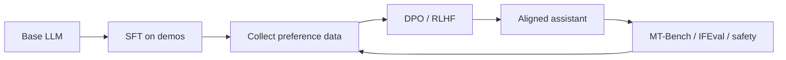

# 3.6 — Instruction Tuning, RLHF, and DPO

## 1. Intuition first
A raw pretrained LLM is a "completion engine" — it predicts what would probably follow. To make it a helpful assistant, we teach it to follow instructions (**SFT**) and prefer responses that humans like over responses they dislike (**RLHF / DPO**).

## 2. Why the topic exists
Pretraining alone yields a smart but wild model. Alignment turns it into a usable, safer product.

## 3. What problem it solves
Alignment: making models follow instructions, be helpful, honest, and harmless (HHH).

## 4. Mathematics

### 4.1 Supervised Fine-Tuning (SFT)
Given (instruction, response) pairs, train with next-token CE on the response only. Standard chat templates: `<|user|> … <|assistant|> …`.

### 4.2 Reward Modeling
Collect preference data: for prompt $x$, humans rank responses $y_w \succ y_l$. Train reward model $r_\phi$ under the Bradley-Terry model:

$$
\mathcal{L}_r = -\mathbb{E}_{(x, y_w, y_l)} \log \sigma(r_\phi(x, y_w) - r_\phi(x, y_l))
$$

### 4.3 RLHF (PPO)
Optimize policy $\pi_\theta$ (init from SFT) to maximize expected reward with KL regularization to a frozen reference $\pi_\text{ref}$:

$$
\max_\theta \mathbb{E}_{x, y\sim \pi_\theta}\big[r_\phi(x, y) - \beta \log \tfrac{\pi_\theta(y|x)}{\pi_\text{ref}(y|x)}\big]
$$

Solved with PPO clipped surrogate.

### 4.4 DPO (Direct Preference Optimization, Rafailov 2023)
Skip the RM + PPO; closed-form loss on preference pairs:

$$
\mathcal{L}_\text{DPO} = -\mathbb{E}\Big[\log \sigma\Big(\beta \log \tfrac{\pi_\theta(y_w|x)}{\pi_\text{ref}(y_w|x)} - \beta \log \tfrac{\pi_\theta(y_l|x)}{\pi_\text{ref}(y_l|x)}\Big)\Big]
$$

Just cross-entropy on preferences → simpler, more stable than PPO. Modern alignment default.

### 4.5 Variants
- IPO (identity-preference)
- KTO (Kahneman-Tversky) — no pairs needed.
- ORPO / SimPO — single-step alignment, no ref model.
- Self-play / RLAIF (constitutional AI, Anthropic).

## 5. Every formula explained
- Bradley-Terry: probability that human prefers $y_w$ = logistic in reward difference.
- KL term keeps aligned model from drifting too far from base (avoids "reward hacking").
- DPO's identity: optimal RLHF policy has a closed-form relationship with reward differences; plug it in and you get the loss above.

## 6. Variables
$\pi_\theta$ policy; $\pi_\text{ref}$ frozen reference; $r_\phi$ reward model; $\beta$ KL coefficient; $y_w, y_l$ preferred/dispreferred completions.

## 7. Algorithm — modern alignment pipeline
1. Pretrain base LLM.
2. SFT on 10k–100k high-quality (instruction, response) examples.
3. Collect preferences $(x, y_w, y_l)$ (human or model-generated with AI judge).
4. DPO (or KTO / ORPO) — one training run over preferences.
5. Eval: MT-Bench, AlpacaEval, IFEval, safety benchmarks.
6. Iterate.

## 8. Simple example
Given (prompt, chosen, rejected) triplets, DPO makes the model log-prob of chosen strictly higher than rejected while staying close to reference.

## 9. Real-world example
- ChatGPT: RLHF (PPO) originally, evolved to more efficient methods.
- Claude: constitutional AI + RL from AI Feedback (RLAIF).
- Llama-3-Instruct: SFT + DPO.

## 10. Diagram


## 11. Implementation from scratch — DPO loss (PyTorch)
```python
import torch, torch.nn.functional as F
def dpo_loss(policy_chosen_logp, policy_rejected_logp,
             ref_chosen_logp, ref_rejected_logp, beta=0.1):
    pi_logratio = policy_chosen_logp - policy_rejected_logp
    ref_logratio = ref_chosen_logp - ref_rejected_logp
    logits = beta * (pi_logratio - ref_logratio)
    return -F.logsigmoid(logits).mean()
```

## 12. Implementation using libraries
```python
# TRL from HuggingFace
from trl import DPOTrainer, DPOConfig
cfg = DPOConfig(beta=0.1, learning_rate=5e-7, per_device_train_batch_size=2,
                gradient_accumulation_steps=8, num_train_epochs=1, output_dir="dpo")
trainer = DPOTrainer(model=model, ref_model=ref_model, args=cfg,
                     train_dataset=preferences, tokenizer=tok)
trainer.train()
```

Also see `trl.SFTTrainer`, `PPOTrainer`, `KTOTrainer`, `ORPOTrainer`.

## 13. Time complexity
SFT: ordinary fine-tuning cost. DPO: ~2× SFT cost (needs policy + ref forward passes; ref can be shared adapter). PPO: 5–10× more expensive.

## 14. Space complexity
Need reference model (unless using LoRA-only where you can disable adapters to compute ref logits).

## 15. Advantages
Makes LLMs safe & useful; DPO is simple and stable.

## 16. Disadvantages
Requires preference data (expensive to curate); reward hacking; over-refusal ("sorry, I can't help with that").

## 17. Interview questions
1. Difference between SFT and RLHF.
2. Why do we need KL regularization?
3. Derive DPO from the RLHF objective.
4. Reward hacking — examples & mitigations.
5. Constitutional AI vs RLHF.
6. Bradley-Terry model — why?
7. When would you use PPO over DPO?
8. What are IFEval, MT-Bench, AlpacaEval?
9. Preference data collection challenges.
10. Explain rejection sampling fine-tuning.

## 18. Common mistakes
- SFT with too high LR → catastrophic forgetting.
- Missing chat template → model outputs raw completions.
- Ref model out of sync with base.
- Overweighting safety → useless assistant.

## 19. Optimization techniques
LoRA-based DPO to fit in single GPU; RAFT / RSO; iterative DPO with online preferences; RLAIF for label generation at scale.

## 20. Coding exercises
1. SFT LLaMA-2 7B with LoRA on a small instruction dataset.
2. DPO train on Anthropic HH-RLHF.
3. Compare DPO vs KTO vs ORPO on your dataset.
4. Build a simple reward model with a preference dataset.

## 21. Mini project
Instruction-tune a 1B-parameter open model with SFT + DPO on 5k preference pairs.

## 22. Medium project
Build a preference-collection UI + train a small reward model.

## 23. Advanced project
Implement RLHF (PPO) with a critic and clipped surrogate on top of Hugging Face TRL; compare with DPO baseline on the same dataset.

## 24. Where it is used in industry
Every consumer LLM: ChatGPT, Claude, Gemini, Copilot, LLaMA-Instruct, Mistral-Instruct.

## 25. How companies use it
- OpenAI / Anthropic: primary alignment lever.
- Meta: SFT + DPO in LLaMA-3.
- Cohere / Mistral: DPO variants.

## 26. When NOT to use it
- Base LLMs used for perplexity benchmarks or research.
- Domain fine-tuning where a plain SFT / continued pretraining suffices.
