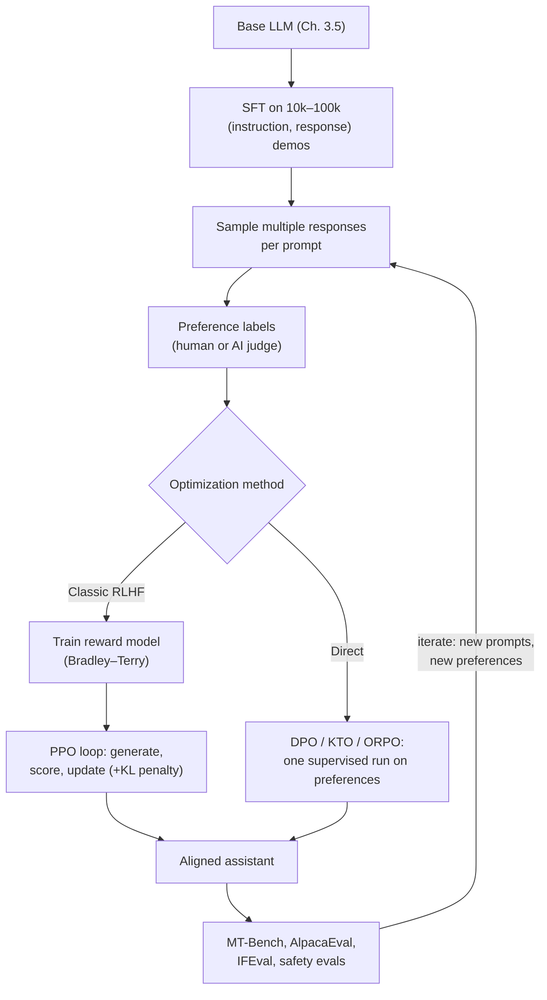
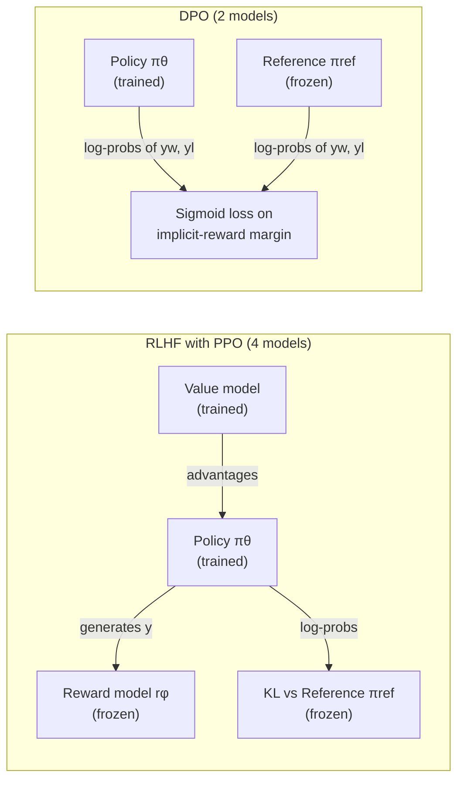
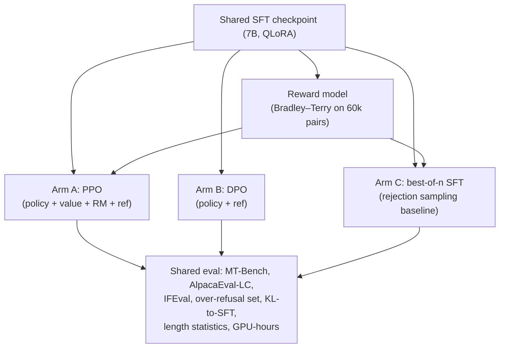

# 3.6 — Instruction Tuning, RLHF, and DPO

## 1. Overview

**What is it?** This chapter covers *alignment*: the set of post-training techniques — supervised fine-tuning (SFT), reinforcement learning from human feedback (RLHF), and direct preference optimization (DPO) — that turn a raw pretrained language model into a helpful, safe assistant.

**Why does it exist?** A base model from [Chapter 3.5](05-gpt-pretraining.md) is a *completion engine*: ask it "How do I bake bread?" and it may continue with "How do I make pasta? How do I roast chicken?" — because lists of questions are common on the internet. It imitates the training distribution; it does not *follow instructions* or *prefer good answers over bad ones*. Alignment fixes both.

**What problem does it solve?** It optimizes the model against *human preferences* rather than raw likelihood: be helpful, honest, and harmless (the "HHH" criteria); follow the instruction; refuse genuinely dangerous requests; format answers the way people want. Preferences are much easier for humans to *express by comparison* ("answer A is better than answer B") than to demonstrate perfectly, which is the key insight the entire pipeline exploits.

**Where is it used?** Every consumer LLM you have used — ChatGPT, Claude, Gemini, Llama-Instruct, Mistral-Instruct — is an aligned model. The difference between a base checkpoint and its "-Instruct"/"-Chat" sibling is exactly the content of this chapter.

## 2. Learning Objectives

After this chapter you will be able to:

- Explain why a pretrained base model does not follow instructions, and how SFT changes that.
- Apply chat templates correctly and mask the loss so only assistant tokens are trained.
- Derive the Bradley–Terry reward-modeling loss from a probabilistic model of pairwise preferences.
- Write the KL-regularized RLHF objective, define every symbol, and explain what the KL penalty prevents.
- Describe how PPO is applied to language models, including the clipped surrogate and why a value model is needed.
- Derive the DPO loss from the RLHF objective step by step, including the closed-form optimal policy.
- Implement the DPO loss in a few lines of PyTorch and train a model with Hugging Face TRL.
- Compare DPO with its variants (IPO, KTO, ORPO, SimPO) and know when each applies.
- Explain RLAIF and constitutional AI, and why labs use AI feedback at scale.
- Recognize reward hacking, over-refusal, and length bias, and name mitigations for each.
- Choose an evaluation suite (MT-Bench, AlpacaEval, IFEval, safety evals) for an aligned model.

## 3. Prerequisites

| Chapter | Why you need it |
|---|---|
| [GPT & LLM Pretraining](05-gpt-pretraining.md) | Alignment starts from a pretrained base model and its next-token loss. |
| [Transformer](../phase-2-deep-learning/10-transformer.md) | Policy, reference, and reward models are all Transformer decoders. |
| [Loss Functions](../phase-2-deep-learning/04-loss-functions.md) | Bradley–Terry and DPO are logistic losses; SFT is cross-entropy. |
| [Reinforcement Learning](../phase-6-advanced/01-reinforcement-learning.md) | RLHF uses policy-gradient methods (PPO); read at least the policy-gradient section. |
| [LoRA & PEFT](07-lora-peft.md) | In practice, alignment is usually run with parameter-efficient adapters. |
| [LLM Evaluation](12-llm-evaluation.md) | You cannot align what you cannot measure. |

## 4. Intuition

Think of a base LLM as a brilliant new employee who has read the entire internet but has never had a job. They can *say* anything, but they don't know what you *want*. Alignment is their onboarding, in three stages:

1. **SFT — show them examples.** You hand them a folder of model answers: "when a customer asks X, a great response looks like Y." They imitate. After a few thousand examples they format answers well and stay on topic. But imitation has a ceiling: they can only be as good as the demonstrations, and they can't learn what *not* to do from examples of what *to* do.
2. **Preference feedback — grade their work.** Now, instead of writing model answers (slow, expensive), you show them two of their own drafts and say "this one is better." Comparing is far easier than authoring — you can instantly tell which of two essays is better even if you couldn't write either. From thousands of comparisons, they infer your taste.
3. **Optimization with a leash — improve, but don't go weird.** They now optimize hard for your approval. Danger: an employee who optimizes purely for approval learns to flatter, pad answers with impressive-sounding filler, and never admit uncertainty — *gaming the metric* rather than being good. So you add a rule: "improve, but stay recognizably the professional you were after onboarding." That rule is the **KL penalty**: the aligned model must stay close to the reference model.

The everyday analogy for DPO specifically: RLHF is like hiring a full-time judge (the reward model), having the employee write new drafts every day, scoring each, and nudging behavior — a whole bureaucratic loop. DPO notices that if the leash rule is fixed, the judge's verdicts can be baked *directly* into a study guide: "raise the probability of the preferred draft, lower the rejected one, measured relative to who you were before." Same destination, no bureaucracy.

## 5. Real-world Motivation

- **OpenAI** invented the modern recipe with InstructGPT (2022): SFT → reward model → PPO. Its striking headline: a 1.3B *aligned* model was preferred by humans over the 175B *base* GPT-3. ChatGPT is a direct descendant of this pipeline.
- **Anthropic** built Claude with *constitutional AI*: a written constitution of principles guides AI-generated critiques and preference labels (RLAIF), reducing dependence on human labelers and making values auditable.
- **Meta** aligned Llama 2-Chat with iterative RLHF (rejection sampling + PPO) and Llama 3-Instruct with a pipeline including SFT, rejection sampling, and DPO — evidence that DPO-style methods are production-grade at the frontier.
- **Google** aligns the Gemini family with human-feedback pipelines; alignment quality is a primary axis of competition among consumer assistants.
- **The open-source ecosystem** (Zephyr from Hugging Face, Tulu from AI2, countless community models) standardized on SFT + DPO because it runs on academic budgets — a training run over preference pairs instead of a multi-model RL loop.

Business reality: alignment is where "impressive demo" becomes "shippable product." Unaligned models produce unusable, off-topic, or unsafe output often enough to be commercially untenable.

## 6. Mathematical Foundations

### 6.1 Supervised fine-tuning (SFT)

Given a dataset of (instruction, response) pairs \(\{(x^{(i)}, y^{(i)})\}\), SFT minimizes the same causal-LM cross-entropy as pretraining, but **only over response tokens**:

$$
\mathcal{L}_{\text{SFT}}(\theta) = -\mathbb{E}_{(x,y)}\left[\sum_{t=1}^{|y|} \log \pi_\theta\!\left(y_t \mid x, y_{<t}\right)\right]
$$

where \(\pi_\theta\) is the model (a "policy," anticipating the RL view), \(x\) is the formatted prompt, and \(y_t\) the \(t\)-th response token. Prompt tokens are excluded from the loss by masking their positions (label = −100 in PyTorch conventions): we want the model to *produce* answers, not to *predict* user questions. Prompts are formatted with a **chat template**, e.g. `<|user|> … <|assistant|> …`, and the template must match the one used at inference exactly.

### 6.2 Reward modeling with Bradley–Terry

Collect preference triples \((x, y_w, y_l)\): for prompt \(x\), annotators saw two responses and preferred \(y_w\) (winner) over \(y_l\) (loser). Assume each response has a latent scalar quality \(r^*(x, y)\), and model the probability that a human prefers \(y_w\) with the **Bradley–Terry model**:

$$
P(y_w \succ y_l \mid x) = \frac{e^{r^*(x, y_w)}}{e^{r^*(x, y_w)} + e^{r^*(x, y_l)}} = \sigma\!\big(r^*(x, y_w) - r^*(x, y_l)\big)
$$

where \(\sigma(z) = 1/(1+e^{-z})\) is the sigmoid. Only the *difference* of rewards matters — rewards are identifiable up to an additive per-prompt constant, a fact DPO will exploit. Train a reward model \(r_\phi\) (usually the SFT model with its LM head swapped for a scalar head, reading the reward at the final token) by maximum likelihood:

$$
\mathcal{L}_R(\phi) = -\mathbb{E}_{(x, y_w, y_l)}\Big[\log \sigma\big(r_\phi(x, y_w) - r_\phi(x, y_l)\big)\Big]
$$

This is logistic regression on reward differences — the same functional form as Elo ratings in chess.

### 6.3 The RLHF objective and the KL penalty

Now optimize the policy \(\pi_\theta\) (initialized from the SFT model) to produce high-reward responses, **without drifting far from a frozen reference** \(\pi_{\text{ref}}\) (a copy of the SFT model):

$$
\max_\theta \; \mathbb{E}_{x \sim \mathcal{D},\; y \sim \pi_\theta(\cdot\mid x)}\Big[r_\phi(x, y)\Big] - \beta\, \mathbb{D}_{\mathrm{KL}}\Big[\pi_\theta(\cdot \mid x)\,\big\|\,\pi_{\text{ref}}(\cdot \mid x)\Big]
$$

Symbols: \(\mathcal{D}\) is the prompt distribution; \(\beta > 0\) is the KL coefficient; the KL divergence \(\mathbb{D}_{\mathrm{KL}} = \mathbb{E}_{y\sim\pi_\theta}[\log \pi_\theta(y|x) - \log \pi_{\text{ref}}(y|x)]\) measures how far the policy has moved. The KL term exists because \(r_\phi\) is only a *proxy* trained on limited data: unconstrained maximization finds adversarial responses that score high but are degenerate (endless polite filler, keyword stuffing) — **reward hacking**, an instance of Goodhart's law. The penalty also preserves generation diversity and pretraining knowledge.

### 6.4 PPO for language models

Sampling \(y\) and computing rewards is non-differentiable, so we use policy gradients. Generation is framed as an RL episode: state = prompt plus tokens so far, action = next token, reward = \(r_\phi(x,y)\) at the end minus the per-token KL penalty \(\beta \log\frac{\pi_\theta(y_t|\cdot)}{\pi_{\text{ref}}(y_t|\cdot)}\). PPO maximizes the clipped surrogate:

$$
\mathcal{L}_{\text{PPO}}(\theta) = \mathbb{E}_t\Big[\min\big(\rho_t(\theta)\, \hat{A}_t,\; \mathrm{clip}(\rho_t(\theta),\, 1-\epsilon,\, 1+\epsilon)\, \hat{A}_t\big)\Big]
$$

where \(\rho_t(\theta) = \frac{\pi_\theta(a_t \mid s_t)}{\pi_{\theta_{\text{old}}}(a_t \mid s_t)}\) is the probability ratio between current and rollout-time policies, \(\hat{A}_t\) the advantage estimate (from a learned value model, via GAE), and \(\epsilon \approx 0.2\) the clip range. Clipping stops any single update from moving the policy too far (see [Reinforcement Learning](../phase-6-advanced/01-reinforcement-learning.md)). The price: **four** models in memory (policy, reference, reward, value), plus a generate–score–update loop that is slow and hyperparameter-sensitive.

### 6.5 DPO: the full derivation

DPO's insight: the RLHF objective has a **closed-form solution**, and substituting it back eliminates both the reward model and the RL loop.

**Step 1 — solve the KL-regularized objective analytically.** For a fixed prompt \(x\), we maximize over distributions \(\pi\):

$$
\max_\pi \; \mathbb{E}_{y \sim \pi}\big[r(x,y)\big] - \beta\, \mathbb{D}_{\mathrm{KL}}\big[\pi \,\|\, \pi_{\text{ref}}\big]
$$

Write the objective as \(-\beta \, \mathbb{E}_{y\sim\pi}\left[\log \frac{\pi(y|x)}{\pi_{\text{ref}}(y|x)\, e^{r(x,y)/\beta}}\right]\). Define the normalized distribution

$$
\pi^*(y \mid x) = \frac{1}{Z(x)}\, \pi_{\text{ref}}(y \mid x)\, \exp\!\Big(\frac{r(x,y)}{\beta}\Big), \qquad Z(x) = \sum_{y} \pi_{\text{ref}}(y \mid x)\, e^{r(x,y)/\beta}
$$

Then the objective equals \(-\beta\,\mathbb{D}_{\mathrm{KL}}[\pi \| \pi^*] + \beta \log Z(x)\). Since \(Z(x)\) doesn't depend on \(\pi\) and KL is minimized (= 0) iff \(\pi = \pi^*\), **the optimal policy is exactly \(\pi^*\)**: reweight the reference by exponentiated reward, softened by \(\beta\).

**Step 2 — invert to express the reward in terms of the policy.** Take logs and rearrange:

$$
r(x, y) = \beta \log \frac{\pi^*(y \mid x)}{\pi_{\text{ref}}(y \mid x)} + \beta \log Z(x)
$$

The reward is the (scaled) log-ratio between optimal policy and reference, plus a term that depends only on \(x\).

**Step 3 — substitute into Bradley–Terry.** Preferences depend only on *reward differences* for the same prompt, so the intractable \(\beta \log Z(x)\) **cancels**:

$$
P(y_w \succ y_l \mid x) = \sigma\Big( \beta \log \tfrac{\pi^*(y_w|x)}{\pi_{\text{ref}}(y_w|x)} - \beta \log \tfrac{\pi^*(y_l|x)}{\pi_{\text{ref}}(y_l|x)} \Big)
$$

**Step 4 — maximum likelihood on preferences, with \(\pi_\theta\) in place of \(\pi^*\).** The negative log-likelihood is the **DPO loss**:

$$
\mathcal{L}_{\text{DPO}}(\theta) = -\mathbb{E}_{(x, y_w, y_l)}\left[\log \sigma\Big(\underbrace{\beta \log \tfrac{\pi_\theta(y_w|x)}{\pi_{\text{ref}}(y_w|x)}}_{\hat{r}_w \text{: implicit reward of } y_w} - \underbrace{\beta \log \tfrac{\pi_\theta(y_l|x)}{\pi_{\text{ref}}(y_l|x)}}_{\hat{r}_l \text{: implicit reward of } y_l}\Big)\right]
$$

The policy has become **its own implicit reward model**: \(\hat r(x,y) = \beta\log\frac{\pi_\theta(y|x)}{\pi_{\text{ref}}(y|x)}\). Training is plain supervised binary classification over preference pairs — no sampling, no value model, no PPO — yet the optimum coincides with the RLHF optimum under the Bradley–Terry assumption. The gradient is instructive:

$$
\nabla_\theta \mathcal{L}_{\text{DPO}} = -\beta\, \mathbb{E}\Big[ \underbrace{\sigma(\hat{r}_l - \hat{r}_w)}_{\text{weight: large when model is wrong}} \big( \nabla_\theta \log \pi_\theta(y_w|x) - \nabla_\theta \log \pi_\theta(y_l|x) \big) \Big]
$$

— push up the chosen response, push down the rejected one, with force proportional to how badly the implicit reward currently misranks the pair.

### 6.6 The variant zoo

| Method | Data needed | Reference model? | Key idea |
|---|---|---|---|
| **DPO** (2023) | Pairs \((x, y_w, y_l)\) | Yes | Closed-form RLHF; sigmoid on implicit-reward margin |
| **IPO** (2023) | Pairs | Yes | Squared loss pushing the margin to a *target* \(1/(2\beta)\) instead of \(\to\infty\); resists overfitting when preferences are near-deterministic |
| **KTO** (2024) | *Unpaired* good/bad examples | Yes | Kahneman–Tversky prospect-theory loss; thumbs-up/down data is far cheaper than pairs |
| **ORPO** (2024) | Pairs | **No** | Adds an odds-ratio penalty to the SFT loss; SFT and alignment in one run |
| **SimPO** (2024) | Pairs | **No** | Length-normalized average log-prob as implicit reward + target margin \(\gamma\); combats length bias |

### 6.7 RLAIF and constitutional AI

Human preference labels are the pipeline's cost bottleneck. **RLAIF** replaces the human annotator with a strong LLM judge; empirically, AI labels approach human-label quality for helpfulness at a fraction of the cost. **Constitutional AI** (Anthropic) structures this: a written list of principles ("choose the response less likely to assist a crime…") drives (1) a supervised phase where the model critiques and revises its own harmful outputs, and (2) an RLAIF phase where the judge labels preferences according to the constitution. Values become an auditable document instead of an opaque labeler pool.

## 7. Visual Explanation

The modern alignment pipeline:



What each of the four RLHF models does during one PPO step — versus DPO's two:



## 8. Algorithm

**The end-to-end alignment recipe:**

1. **Pretrain** (or download) a base model.
2. **SFT:** fine-tune on 10k–100k high-quality demonstrations formatted with a chat template, loss on assistant tokens only. Quality beats quantity (the LIMA result: ~1k excellent demos can suffice for style).
3. **Collect preferences:** sample 2+ responses per prompt from the SFT model (temperature ~0.8–1.0 for diversity); have humans or an AI judge pick the better one → \((x, y_w, y_l)\) triples.
4. **Optimize:** run DPO (or KTO/ORPO), or classic RM + PPO if you need online RL.
5. **Evaluate:** MT-Bench / AlpacaEval / Arena-style pairwise win-rates for helpfulness, IFEval for instruction following, safety benchmarks for harmlessness. Check for length bias and over-refusal explicitly.
6. **Iterate:** sample from the newly aligned model, collect fresh preferences, realign (iterative/online DPO). One round is rarely enough at the frontier.

**DPO training step, pseudocode:**

```
for each batch of (x, y_w, y_l):
    # log-prob of a response = sum of token log-probs, prompt tokens masked out
    logp_w      = sum_token_logprobs(policy,  x, y_w)
    logp_l      = sum_token_logprobs(policy,  x, y_l)
    ref_logp_w  = sum_token_logprobs(reference, x, y_w)   # frozen, no grad
    ref_logp_l  = sum_token_logprobs(reference, x, y_l)

    margin = beta * ((logp_w - ref_logp_w) - (logp_l - ref_logp_l))
    loss   = -log_sigmoid(margin)                # binary classification
    loss.backward(); optimizer.step()
```

## 9. Worked Example

**Tiny example by hand.** One preference pair; suppose (summed over response tokens):

- Policy: \(\log \pi_\theta(y_w|x) = -12.0\), \(\log \pi_\theta(y_l|x) = -11.0\) — the policy currently *prefers the rejected answer*.
- Reference: \(\log \pi_{\text{ref}}(y_w|x) = -12.5\), \(\log \pi_{\text{ref}}(y_l|x) = -10.5\).
- \(\beta = 0.1\).

Implicit rewards: \(\hat{r}_w = 0.1 \times (-12.0 - (-12.5)) = 0.05\); \(\hat{r}_l = 0.1 \times (-11.0 - (-10.5)) = -0.05\). Margin \(= 0.05 - (-0.05) = 0.1\).

$$
\mathcal{L}_{\text{DPO}} = -\log \sigma(0.1) = -\log(0.525) = 0.644
$$

Note the subtlety: although the policy assigns higher raw probability to \(y_l\), its implicit reward already ranks \(y_w\) higher, because rewards are measured **relative to the reference** — the policy has moved *toward* \(y_w\) and *away from* \(y_l\) compared to where it started. The gradient weight \(\sigma(-0.1) = 0.475\) is close to its maximum of 0.5, so this pair still drives a substantial update. If training later pushes the margin to 3.0, the loss falls to \(-\log\sigma(3.0) = 0.049\) and the pair contributes little — DPO automatically focuses on pairs it still gets wrong.

**Reward-model example.** With \(r_\phi(x, y_w) = 2.1\) and \(r_\phi(x, y_l) = 0.6\): \(P(y_w \succ y_l) = \sigma(1.5) = 0.818\), loss \(= -\log 0.818 = 0.201\). If annotators agree with the model ~82% of the time on held-out pairs, this is roughly the best achievable loss — human preference data is noisy (typical inter-annotator agreement is only 65–80%), which caps reward-model accuracy.

**Realistic scale.** Zephyr-7B-β: Mistral-7B base → SFT on UltraChat (~200k dialogues) → DPO on UltraFeedback (~64k GPT-4-judged preference pairs), \(\beta = 0.01\), ~1–3 epochs. Total post-training compute: a few hundred A100-hours — versus tens of thousands of GPU-hours for the pretraining it builds on. Alignment is cheap relative to pretraining; its cost lives in the *data*.

## 10. Python from Scratch

DPO in NumPy, from token log-probabilities up, with a gradient check — no framework magic:

```python
import numpy as np

def sigmoid(z):
    return 1.0 / (1.0 + np.exp(-z))

def response_logprob(token_logprobs, response_mask):
    """Sum log-probs over response tokens only.
    token_logprobs: (T,) log-prob the model gave each realized token.
    response_mask:  (T,) 1 for assistant tokens, 0 for prompt tokens.
    """
    return float((token_logprobs * response_mask).sum())

def dpo_loss_and_margin(pol_w, pol_l, ref_w, ref_l, beta=0.1):
    """All inputs are scalar summed log-probs for one (x, y_w, y_l) triple."""
    r_w = beta * (pol_w - ref_w)        # implicit reward of chosen response
    r_l = beta * (pol_l - ref_l)        # implicit reward of rejected response
    margin = r_w - r_l
    loss = -np.log(sigmoid(margin))     # -log sigma(margin): logistic loss
    # d(loss)/d(pol_w) = -beta * sigma(-margin); d/d(pol_l) = +beta * sigma(-margin)
    grad_w = -beta * sigmoid(-margin)   # increases chosen log-prob
    grad_l = +beta * sigmoid(-margin)   # decreases rejected log-prob
    return loss, margin, grad_w, grad_l

# --- Section 9 numbers reproduced exactly ---
loss, margin, gw, gl = dpo_loss_and_margin(-12.0, -11.0, -12.5, -10.5, beta=0.1)
print(f"margin={margin:.3f} loss={loss:.3f}")   # margin=0.100 loss=0.644
print(f"grad wrt logp_w={gw:.4f}, logp_l={gl:.4f}")  # -0.0475, +0.0475

# --- finite-difference check of the analytic gradient ---
eps = 1e-6
l2, *_ = dpo_loss_and_margin(-12.0 + eps, -11.0, -12.5, -10.5, beta=0.1)
print(f"numeric grad ≈ {(l2 - loss)/eps:.4f}")  # ≈ -0.0475: matches
```

Every quantity is a plain float; the gradient shows DPO's mechanics — the same \(\sigma(-\text{margin})\) weight scales a push *up* on the chosen response and *down* on the rejected one.

> [!WARNING]
> **Common bug:** summing log-probs over *all* tokens including the prompt. Since \(y_w\) and \(y_l\) share the prompt, prompt terms mostly cancel in the margin — but padding tokens do **not** cancel when responses have different lengths, silently corrupting the loss. Always apply the response mask (and never include pad positions).

## 11. Library Implementation

The DPO loss in PyTorch (this is essentially TRL's core), then the full trainer:

```python
import torch
import torch.nn.functional as F

def dpo_loss(policy_chosen_logp, policy_rejected_logp,
             ref_chosen_logp, ref_rejected_logp, beta=0.1):
    """Each argument: (B,) tensor of summed response log-probs."""
    pi_logratio  = policy_chosen_logp - policy_rejected_logp   # (B,)
    ref_logratio = ref_chosen_logp - ref_rejected_logp         # (B,) no grad
    logits = beta * (pi_logratio - ref_logratio)               # implicit-reward margin
    loss = -F.logsigmoid(logits).mean()                        # numerically stable -log sigma
    # standard diagnostics: implicit rewards and ranking accuracy
    chosen_rewards   = beta * (policy_chosen_logp - ref_chosen_logp).detach()
    rejected_rewards = beta * (policy_rejected_logp - ref_rejected_logp).detach()
    reward_acc = (chosen_rewards > rejected_rewards).float().mean()
    return loss, reward_acc
```

Production training with Hugging Face TRL:

```python
from trl import DPOTrainer, DPOConfig
from transformers import AutoModelForCausalLM, AutoTokenizer

model = AutoModelForCausalLM.from_pretrained("my-sft-model", torch_dtype="bfloat16")
ref_model = AutoModelForCausalLM.from_pretrained("my-sft-model", torch_dtype="bfloat16")
tok = AutoTokenizer.from_pretrained("my-sft-model")

cfg = DPOConfig(
    beta=0.1,                          # KL strength; 0.01–0.5 is the usual sweep range
    learning_rate=5e-7,                # ~100x smaller than SFT LRs — DPO is sensitive
    per_device_train_batch_size=2,
    gradient_accumulation_steps=8,     # effective batch 16; DPO likes larger batches
    num_train_epochs=1,                # >1–3 epochs on preferences usually overfits
    max_length=1024, max_prompt_length=512,
    output_dir="dpo-out",
)
# dataset rows: {"prompt": ..., "chosen": ..., "rejected": ...}
trainer = DPOTrainer(model=model, ref_model=ref_model, args=cfg,
                     train_dataset=preference_dataset, processing_class=tok)
trainer.train()
# Watch: train/loss falling from ~0.693 (= ln 2, random ranking),
# rewards/accuracies climbing toward 0.7–0.9, rewards/margins growing.
```

The same library provides `SFTTrainer` (stage 1), `RewardTrainer` (Bradley–Terry), `PPOTrainer` (classic RLHF), and `KTOTrainer`/`ORPOTrainer`. With LoRA adapters ([Chapter 3.7](07-lora-peft.md)), pass `ref_model=None`: TRL computes reference log-probs by *disabling the adapter* — one model in memory instead of two.

> [!TIP]
> A DPO loss stuck at ~0.693 means the margin is ~0 for every pair — usually a data bug (chosen/rejected columns swapped or identical) rather than a modeling problem. \(\ln 2\) is the "coin-flip" baseline; know it by heart.

## 12. Code Walkthrough

Shapes for one DPO batch, \(B = 4\) pairs, max sequence length \(T = 1024\), vocab \(V = 32{,}000\):

| Tensor | Shape | Meaning |
|---|---|---|
| `chosen_input_ids` / `rejected_input_ids` | (4, 1024) | Prompt + response token ids (padded) |
| `chosen_labels` | (4, 1024) | Copy of input ids with prompt & pad positions set to −100 |
| policy logits | (4, 1024, 32000) | Next-token scores; computed for chosen and rejected (often concatenated into one (8, 1024, V) pass) |
| per-token log-probs | (4, 1024) | `log_softmax(logits)` gathered at the realized next token |
| `policy_chosen_logp` | (4,) | Masked sum over response tokens |
| `ref_*_logp` | (4,) | Same, from the frozen reference under `torch.no_grad()` |
| `logits` (margin) | (4,) | \(\beta[(\text{pol}_w - \text{ref}_w) - (\text{pol}_l - \text{ref}_l)]\) |
| `loss` | scalar | Mean \(-\log\sigma(\text{margin})\) |

Expected training dynamics: loss starts at ≈ 0.693 and decreases; `rewards/accuracies` (fraction of pairs where implicit chosen-reward > rejected-reward) climbs from 0.5 toward 0.7–0.9; **both** chosen and rejected implicit rewards typically drift *negative* (the policy loses probability mass on both, relative to the reference) while their *margin* grows — normal DPO behavior, alarming only if chosen rewards collapse steeply, which signals \(\beta\) too low or LR too high. Memory note: two models × (weights + one set of activations), but no optimizer state for the reference — and none at all for it with the LoRA adapter-toggling trick.

## 13. Complexity Analysis

**SFT:** identical to fine-tuning — \(O(6ND_{\text{SFT}})\) FLOPs for \(N\) parameters and \(D_{\text{SFT}}\) training tokens; hours on one node for a 7B model with adapters.

**Reward model:** one forward pass per response, two per pair; training cost comparable to SFT on the same token count.

**DPO:** per step, 4 sequence forward passes (policy and reference, chosen and rejected) + 2 backward — roughly **2–3× the cost of SFT** on equal data, and ~half the model memory doubles for the reference (zero extra with adapter-toggling). No generation during training.

**PPO:** per step — autoregressive *generation* (the dominant cost: sequential token-by-token decoding), reward + reference scoring, value estimates, then several optimization epochs on the rollout. With four models resident, expect **5–10× DPO's wall-clock and ~2× its memory**. This asymmetry, plus PPO's hyperparameter fragility, is why direct methods dominate outside the largest labs.

**Space:** DPO = 2 model copies (1 trainable); PPO = 4 copies (2 trainable, with optimizer states). For a 7B model in bf16 with AdamW, a trainable copy costs ~112 GB unsharded ([Chapter 3.5](05-gpt-pretraining.md), Section 13) — hence LoRA everywhere.

## 14. Advantages

- **Comparative feedback is cheap and reliable.** Annotators judge "A vs B" far faster and more consistently than they author gold answers — the economic foundation of the whole pipeline.
- **Small aligned beats huge unaligned.** InstructGPT's 1.3B aligned model out-preferred 175B base GPT-3 — alignment buys quality that would otherwise cost 100× the parameters.
- **DPO is simple and stable.** One supervised run, two models, standard tooling; Zephyr-7B and Llama-3-Instruct demonstrate it at small and frontier scale respectively.
- **The KL leash preserves capability.** Aligned models keep pretraining knowledge and diversity instead of collapsing onto reward-model quirks.
- **RLAIF scales feedback.** Constitutional AI turns values into an editable document and slashes labeling cost — Anthropic's production approach for harmlessness.
- **Negative examples teach refusal.** Unlike SFT, preference optimization can *push down* bad behavior, not just imitate good behavior.

## 15. Disadvantages

- **Preference data is the bottleneck.** High-quality, diverse pairs are expensive; noisy or biased labels (typical agreement 65–80%) directly cap alignment quality.
- **Reward hacking / Goodhart.** Proxy rewards get gamed: sycophancy, confident-sounding filler, and *length bias* (judges and reward models systematically prefer longer answers) are all documented failure modes.
- **Over-refusal.** Overweighting safety produces models that decline benign requests ("As an AI, I can't help with that") — a real product-quality tax.
- **Alignment tax.** Post-training can slightly degrade some base capabilities (calibration, certain benchmarks) as the distribution narrows.
- **DPO is offline.** It only reweights responses that exist in the dataset; it cannot discover novel high-reward behavior the way online RL sampling can — one reason frontier labs still run RL loops.
- **PPO is operationally brutal.** Four models, sensitive hyperparameters, and hard-to-debug divergences.
- **Whose preferences?** Aggregated annotator labels encode particular demographics and values — a normative problem no loss function solves.

## 16. Common Mistakes

- **SFT learning rate too high** → catastrophic forgetting of pretraining knowledge. *Fix:* 1e-5–2e-5 full-tune (higher for LoRA), few epochs, monitor a general benchmark during training.
- **Chat template mismatch** between training and inference → the model sees malformed input and outputs raw completions. *Fix:* use `tokenizer.apply_chat_template` everywhere; never hand-concatenate role strings.
- **Loss computed on prompt tokens** during SFT/DPO → wasted capacity and corrupted DPO margins. *Fix:* mask prompt and pad positions to −100; verify by decoding the supervised positions of one batch.
- **Wrong reference model** — using the base model instead of the SFT checkpoint as \(\pi_{\text{ref}}\) makes the KL anchor meaningless. *Fix:* the reference is always the model that *initialized* preference training.
- **Too many DPO epochs** → implicit rewards diverge, generations degrade even as train loss falls. *Fix:* 1 epoch default; early-stop on generation evals, not on training loss.
- **DPO learning rate copied from SFT** (e.g., 2e-5) → immediate policy collapse. *Fix:* start at 5e-7–1e-6.
- **Trusting reward-model score / eval win-rate blindly** → you optimize length and sycophancy. *Fix:* length-controlled evals (e.g., length-controlled AlpacaEval), spot-check transcripts by hand.

## 17. Best Practices

- [ ] Invest in SFT data quality first — a clean, diverse 10k-demo set beats a noisy 100k one; deduplicate and decontaminate against your eval prompts.
- [ ] Generate preference candidates *from your own SFT model* (on-policy-ish data) rather than only from other models' outputs; DPO works markedly better on-distribution.
- [ ] Sweep \(\beta\) (0.01–0.5) and LR (5e-7–5e-6) jointly; they interact.
- [ ] Track `rewards/accuracies`, `rewards/margins`, and KL-to-reference during training; validate with *generations*, not loss.
- [ ] Use LoRA + adapter-toggling for the reference to halve memory; QLoRA makes 70B alignment feasible on one node.
- [ ] Evaluate on a suite: MT-Bench + length-controlled AlpacaEval (helpfulness), IFEval (instruction following), plus safety and over-refusal sets (e.g., XSTest-style benign prompts).
- [ ] Run alignment *iteratively*: align → sample → relabel → realign beats a single big offline round.
- [ ] Keep a frozen "pre-alignment" checkpoint and diff behavior systematically — regressions hide in corners benchmarks miss.
- [ ] Document your labeling guidelines and judge prompts; they *are* the value specification of your model.

## 18. Optimization Techniques

- **LoRA/QLoRA alignment:** run SFT and DPO as adapters over a 4-bit base ([Chapter 3.7](07-lora-peft.md)); a 7B DPO run fits on a 24 GB GPU.
- **Reference-free methods:** ORPO and SimPO drop \(\pi_{\text{ref}}\) entirely — one model in memory, one training stage.
- **Precomputed reference log-probs:** since \(\pi_{\text{ref}}\) is frozen, compute its log-probs over the dataset once, cache to disk, and halve per-step compute.
- **Rejection sampling fine-tuning (best-of-n / RAFT):** sample \(n\) responses, keep the reward-model's top-1, SFT on the winners — a strong, simple baseline used in Llama 2's pipeline.
- **Iterative/online DPO:** regenerate preferences from the current policy each round, recovering much of online RL's benefit at DPO's cost.
- **GRPO (group relative policy optimization):** a PPO variant that replaces the learned value model with group-normalized rewards over \(n\) samples per prompt — cheaper online RL, used by DeepSeek for reasoning models.
- **Packing & sequence bucketing** for SFT throughput; bf16 + FlashAttention as always ([Chapter 3.5](05-gpt-pretraining.md), Section 18).

## 19. Industry Applications

- **OpenAI — ChatGPT/InstructGPT:** the canonical SFT → RM → PPO pipeline; RLHF is the reason ChatGPT was usable by the general public where raw GPT-3 was not.
- **Anthropic — Claude:** constitutional AI + RLAIF for harmlessness at scale; the constitution approach has been partially adopted across the industry.
- **Meta — Llama 2/3 Instruct:** iterative rounds mixing rejection sampling, PPO (Llama 2), and DPO (Llama 3); the open weights made "-Instruct" the default deliverable of open-source labs.
- **Google — Gemini:** human-feedback post-training across text and multimodal capabilities.
- **DeepSeek:** GRPO-based RL for math/code reasoning (DeepSeek-R1 lineage) — preference-style RL extended from "politeness" to verifiable correctness rewards.
- **Production example:** a typical enterprise assistant team fine-tunes an open base with QLoRA SFT on curated support transcripts, runs one or two iterative DPO rounds on AI-judged preferences from real (consented, anonymized) traffic, gates releases on IFEval + an internal over-refusal suite, and monitors live thumbs-up/down as a KTO-ready feedback stream.

## 20. Interview Questions

### Beginner

**Q: What is the difference between SFT and RLHF?**
A: SFT is supervised imitation of demonstration responses via cross-entropy — it teaches format and instruction-following but only mimics. RLHF optimizes the model against human *preferences* (via a reward model or directly), so it can push good behavior above and bad behavior below what demonstrations alone convey.

**Q: Why doesn't a pretrained base model follow instructions?**
A: It was trained only to continue text as found in its corpus. An instruction is just context to continue plausibly — often with more questions or a list, not an answer. Nothing in the pretraining objective rewards *complying*.

**Q: What are the three classic stages of the InstructGPT pipeline?**
A: (1) SFT on human demonstrations; (2) reward-model training on human preference comparisons via Bradley–Terry; (3) PPO optimization of the policy against the reward model with a KL penalty to the SFT model.

**Q: What does "HHH" stand for?**
A: Helpful, Honest, Harmless — Anthropic's shorthand for the alignment goals of an assistant.

**Q: In DPO, what data does one training example consist of?**
A: A triple: prompt \(x\), preferred response \(y_w\), rejected response \(y_l\). The loss increases the policy's relative log-probability of \(y_w\) over \(y_l\), measured against a frozen reference model.

### Intermediate

**Q: Why is preference data collected as comparisons rather than absolute scores?**
A: Humans are inconsistent at absolute scoring (scale drift, annotator disagreement on calibration) but much more reliable at pairwise judgments. Bradley–Terry converts comparisons into a latent scalar reward, and only reward *differences* matter for the downstream optimization anyway.

**Q: What exactly does the KL penalty prevent, and what happens if β is too large or too small?**
A: It stops the policy from exploiting reward-model errors (reward hacking) and from losing pretraining capability/diversity. Too large β → the model barely changes (alignment ineffective). Too small β → degenerate high-reward outputs: repetitive filler, sycophancy, mode collapse.

**Q: Explain the Bradley–Terry loss and its connection to logistic regression.**
A: It models \(P(y_w \succ y_l) = \sigma(r(x,y_w) - r(x,y_l))\); maximizing likelihood is exactly logistic regression where the "logit" is the reward difference. It is also the model behind Elo ratings.

**Q: Why is DPO so much cheaper than PPO?**
A: No generation during training (PPO's dominant cost is sequential sampling), no reward model, no value model, no rollout buffer — just forward passes of policy and frozen reference on fixed data with a logistic loss. Four resident models become two (or one, with adapter-toggling).

**Q: What is KTO's practical advantage over DPO?**
A: It needs only *unpaired* binary feedback (this response was good / bad), which is exactly what production thumbs-up/down telemetry provides — no need to show users two responses for the same prompt.

**Q: What is length bias in preference optimization?**
A: Human and AI judges systematically favor longer responses, so reward models and DPO absorb "longer = better," and aligned models bloat. Mitigations: length-controlled evaluation (AlpacaEval-LC), length-normalized objectives (SimPO), explicit length penalties in the judge prompt.

### Advanced

**Q: Derive the DPO loss from the RLHF objective.**
A: (1) The KL-regularized objective \(\max_\pi \mathbb{E}[r] - \beta\,\mathrm{KL}(\pi\|\pi_{\text{ref}})\) is solved in closed form by \(\pi^*(y|x) \propto \pi_{\text{ref}}(y|x)e^{r(x,y)/\beta}\) — rewrite the objective as a KL to this Gibbs distribution, minimized at equality. (2) Invert: \(r(x,y) = \beta\log\frac{\pi^*(y|x)}{\pi_{\text{ref}}(y|x)} + \beta\log Z(x)\). (3) Substitute into Bradley–Terry: the intractable \(\log Z(x)\) cancels in the reward difference. (4) Maximize preference likelihood with \(\pi_\theta\) standing in for \(\pi^*\): \(\mathcal{L} = -\log\sigma\big(\beta\log\frac{\pi_\theta(y_w|x)}{\pi_{\text{ref}}(y_w|x)} - \beta\log\frac{\pi_\theta(y_l|x)}{\pi_{\text{ref}}(y_l|x)}\big)\).

**Q: When would you still choose PPO (or another online RL method) over DPO?**
A: When you have a *reliable programmatic or trained reward* and want the policy to discover behavior not present in any offline dataset — e.g., verifiable rewards for math/code (unit tests pass), long-horizon agent tasks, or frontier-scale assistants where online exploration measurably beats offline reweighting. DPO can only shift mass among responses similar to its dataset.

**Q: Both DPO implicit rewards (chosen and rejected) usually go negative during training. Is that a bug?**
A: No. The implicit reward is relative to the reference; DPO's gradient only constrains the *margin*. The policy often reduces probability of both dataset responses (moving mass to other sequences) while widening their gap. It becomes pathological only when chosen log-probs collapse rapidly — a sign of too-low β or too-high LR, and the motivation for IPO's bounded-margin objective.

**Q: What is the difference between DPO's and IPO's treatment of near-deterministic preferences?**
A: DPO's logistic loss keeps pushing the margin toward infinity when a pair is always labeled one way, causing overfitting and reference drift. IPO replaces it with a squared loss toward a *finite target margin* \(1/(2\beta)\), keeping the policy bounded near the reference even with clean labels.

**Q: Sketch how constitutional AI generates its training signal.**
A: Phase 1 (SL-CAI): the model answers red-team prompts, then *critiques and revises* its own answers according to sampled constitutional principles; the revisions become SFT data. Phase 2 (RLAIF): an AI judge picks between response pairs according to the constitution, producing preference labels that train a reward model / preference optimizer — harmlessness alignment with almost no human harm-labeling.

**Q: How does GRPO remove the value model that PPO needs?**
A: Instead of a learned critic estimating per-token values, GRPO samples a *group* of \(n\) responses per prompt and uses the group-normalized reward (each response's reward minus the group mean, divided by group std) as the advantage for all its tokens. This trades variance for the memory/compute of a value network — attractive when rewards are cheap to evaluate, as with verifiable math/code rewards.

## 21. Coding Exercises

### Easy

1. **Implement the Bradley–Terry loss** for a batch of reward pairs `(r_w, r_l)` in PyTorch and verify that loss = \(\ln 2\) when rewards are equal. *Hint:* use `F.logsigmoid(r_w - r_l)` for numerical stability.
2. **Apply a chat template correctly:** take 5 (instruction, response) pairs, format them with `tokenizer.apply_chat_template`, and build label tensors with prompt tokens masked to −100. Decode the unmasked positions to verify only assistant text is supervised. *Hint:* tokenize prompt-only and full conversation separately; mask the prompt-length prefix.

### Medium

1. **Train a reward model** on 5–10k pairs from Anthropic HH-RLHF using a small backbone (e.g., a 0.5–1B model) with a scalar head; report held-out ranking accuracy. *Hint:* read the reward at the final non-pad token; expect 65–75% accuracy — the data is noisy.
2. **Run DPO with TRL** on a small SFT model using a few thousand UltraFeedback pairs; plot loss, `rewards/accuracies`, and `rewards/margins`; compare generations before/after on 20 held-out prompts. *Hint:* β = 0.1, LR = 5e-7, 1 epoch.
3. **Compare DPO vs KTO vs ORPO** on the same preference dataset (unpair it for KTO) with an LLM-judge win-rate over the SFT baseline. *Hint:* judge with position-swapped pairs to cancel position bias.

### Hard

1. **Implement DPO from scratch in PyTorch** — batched response log-prob extraction with prompt masking, the loss, and the adapter-toggling reference trick with LoRA; match TRL's loss on the same batch to 1e-4. *Hint:* `logits[:, :-1]` gathered at `labels[:, 1:]`; sum where labels ≠ −100.
2. **Build a minimal PPO loop with TRL's `PPOTrainer`** on a sentiment reward (a classifier as \(r_\phi\)) over a small GPT-2; track KL-to-reference and show reward hacking when you set the KL coefficient near zero. *Hint:* the hacked outputs are fun to read — save samples every 50 steps.
3. **Iterative DPO:** after round 1, sample 4 responses per prompt from the new policy, label pairs with an AI judge, retrain; measure per-round win-rate and length drift over 3 rounds. *Hint:* use length-controlled win-rate or you will "improve" by bloating.

## 22. Mini Project

**Align a small open model end-to-end.**

1. Pick a ~1B base model (e.g., a small Llama/Qwen/Pythia variant) and verify it does *not* follow instructions (try 10 prompts).
2. SFT with `SFTTrainer` + LoRA on ~10k examples from an open instruction set (e.g., a cleaned Alpaca/UltraChat subset), loss on assistant tokens only.
3. Take ~5k preference pairs (UltraFeedback subset) and run one epoch of DPO (β = 0.1, LR = 5e-7).
4. Evaluate: the same 10 prompts qualitatively, plus an LLM-judged win-rate of DPO-model vs SFT-model on 100 held-out prompts (position-swapped judging).
5. Deliverable: a table of base vs SFT vs DPO behavior with example transcripts and the win-rate.

## 23. Medium Project

**Build a preference-collection loop and reward model.**

1. Stand up a minimal web UI (Gradio/Streamlit) that shows one prompt and two model-generated responses side by side with A/B/tie buttons; log \((x, y_A, y_B, \text{choice})\) to a database.
2. Generate candidates from your Mini-Project SFT model at temperature 0.9; collect ~2k human judgments (recruit friends; measure inter-annotator agreement on a 100-pair overlap set).
3. Train a Bradley–Terry reward model; report held-out accuracy and compare it with your measured human agreement ceiling.
4. Analyze biases: plot reward against response length and against presence of hedging phrases; quantify length bias.
5. Use the reward model for best-of-8 sampling at inference and measure the win-rate lift over best-of-1.
6. Deliverable: the labeled dataset, the reward model, and a bias report.

## 24. Advanced Project

**RLHF vs DPO head-to-head on one dataset.**

*Architecture:*



*Implementation phases:*

1. **Common base:** SFT a 7B model with QLoRA on a curated instruction set; freeze this checkpoint as \(\pi_{\text{ref}}\) and the initialization for all arms.
2. **Reward model:** train on UltraFeedback-style pairs; validate ranking accuracy and audit length bias before any RL.
3. **Arm A (PPO):** TRL `PPOTrainer` with per-token KL penalty; sweep the KL coefficient; log reward, KL, and sample transcripts continuously.
4. **Arm B (DPO):** same pairs, β/LR sweep, 1 epoch; optionally a second *iterative* round with on-policy pairs.
5. **Arm C (baseline):** best-of-8 rejection sampling with the reward model, SFT on winners — the cheap baseline both arms must beat.
6. **Evaluation:** identical suite for all arms, including length-controlled win-rates, over-refusal on benign prompts, and total GPU-hours; write up the compute-vs-quality frontier.

*Possible improvements:* add a GRPO arm with a verifiable reward (unit-test pass rate on code prompts); add KTO trained on unpaired thumbs data; distill the best arm into a smaller model; run a safety red-teaming pass and report jailbreak rates before/after alignment.

## 25. Summary

- Base models imitate the internet; alignment (SFT → preference optimization) turns them into assistants that follow instructions and match human preferences.
- SFT is cross-entropy on demonstration responses only — chat template and prompt-masking correctness are non-negotiable.
- Preferences are collected as comparisons because comparing is easier and more reliable than authoring or absolute scoring; Bradley–Terry turns comparisons into a scalar reward via a logistic model.
- The RLHF objective maximizes reward minus a β-weighted KL to a frozen reference; the KL leash is what prevents reward hacking and capability loss.
- PPO implements this with four resident models and a generate–score–update loop — powerful but expensive and fragile.
- DPO solves the same objective in closed form: the optimal policy is \(\pi_{\text{ref}} e^{r/\beta}/Z\); inverting for \(r\) and plugging into Bradley–Terry cancels \(Z\) and yields a simple logistic loss on implicit-reward margins.
- The policy in DPO is its own reward model: \(\hat r = \beta \log(\pi_\theta/\pi_{\text{ref}})\).
- Variants trade data and memory requirements: KTO (unpaired data), ORPO/SimPO (no reference model), IPO (bounded margins).
- RLAIF and constitutional AI replace human labelers with principled AI judges — the scalability lever of frontier alignment.
- Watch for reward hacking, length bias, and over-refusal; evaluate with length-controlled win-rates, IFEval, and safety suites, never training loss alone.
- Alignment compute is small next to pretraining; the real cost and the real moat is preference *data* quality.

## 26. Cheat Sheet

| Formula | Meaning |
|---|---|
| \(\mathcal{L}_{\text{SFT}} = -\sum_t \log \pi_\theta(y_t \mid x, y_{<t})\) | SFT: CE on response tokens only |
| \(P(y_w \succ y_l) = \sigma(r_w - r_l)\) | Bradley–Terry preference model |
| \(\mathcal{L}_R = -\log\sigma(r_\phi(x,y_w) - r_\phi(x,y_l))\) | Reward-model loss |
| \(\max_\theta \mathbb{E}[r_\phi] - \beta\,\mathrm{KL}(\pi_\theta\|\pi_{\text{ref}})\) | RLHF objective |
| \(\pi^*(y|x) \propto \pi_{\text{ref}}(y|x)\, e^{r(x,y)/\beta}\) | Its closed-form solution |
| \(\mathcal{L}_{\text{DPO}} = -\log\sigma\big(\beta\log\tfrac{\pi_\theta(y_w|x)}{\pi_{\text{ref}}(y_w|x)} - \beta\log\tfrac{\pi_\theta(y_l|x)}{\pi_{\text{ref}}(y_l|x)}\big)\) | DPO loss |
| \(\hat r(x,y) = \beta\log\tfrac{\pi_\theta(y|x)}{\pi_{\text{ref}}(y|x)}\) | DPO implicit reward |

**Defaults:** SFT LR 1e-5–2e-5 (full) / ~1e-4 (LoRA), 1–3 epochs. DPO β = 0.1 (sweep 0.01–0.5), LR 5e-7, 1 epoch, effective batch ≥ 16. PPO clip ε = 0.2, adaptive KL control.

**One-liners:** DPO loss starts at ln 2 ≈ 0.693; reference = the checkpoint that initialized preference training; mask prompts to −100; both implicit rewards drifting negative is normal — watch the *margin*; evaluate generations, not loss.

**Gotchas:** chat-template mismatch silently ruins everything; SFT-scale LRs destroy DPO; unmasked padding corrupts margins when response lengths differ; judges love long answers — length-control your evals; more DPO epochs ≠ better model.

## 27. Further Reading

**Books**
- Nathan Lambert, *RLHF Book* (online) — the most complete treatment of the full pipeline.
- Sutton & Barto, *Reinforcement Learning: An Introduction* — policy-gradient foundations.

**Research papers**
- Christiano et al., *Deep RL from Human Preferences* (2017) — the origin of preference-based RL.
- Stiennon et al., *Learning to Summarize from Human Feedback* (2020).
- Ouyang et al., *Training Language Models to Follow Instructions with Human Feedback* (InstructGPT, 2022).
- Bai et al., *Training a Helpful and Harmless Assistant…* (HH-RLHF, 2022) and *Constitutional AI: Harmlessness from AI Feedback* (2022).
- Rafailov et al., *Direct Preference Optimization: Your Language Model is Secretly a Reward Model* (2023).
- Azar et al., *A General Theoretical Paradigm… * (IPO, 2023); Ethayarajh et al., *KTO* (2024); Hong et al., *ORPO* (2024); Meng et al., *SimPO* (2024).
- Schulman et al., *Proximal Policy Optimization Algorithms* (2017); Shao et al., *DeepSeekMath* (GRPO, 2024).
- Tunstall et al., *Zephyr: Direct Distillation of LM Alignment* (2023); Zhou et al., *LIMA: Less Is More for Alignment* (2023).

**Documentation:** Hugging Face TRL docs (`SFTTrainer`, `DPOTrainer`, `PPOTrainer`, `KTOTrainer`); OpenAI's InstructGPT blog post; Anthropic's Constitutional AI post.

**GitHub repositories:** huggingface/trl; huggingface/alignment-handbook (Zephyr recipes); allenai/open-instruct (Tulu); OpenRLHF/OpenRLHF; eric-mitchell/direct-preference-optimization.

**Datasets:** Anthropic HH-RLHF, UltraChat, UltraFeedback, OpenAssistant (OASST), Stanford Human Preferences (SHP), HelpSteer.

**YouTube/Videos:** Nathan Lambert's RLHF talks; Hugging Face alignment-handbook walkthroughs; Rafailov's DPO conference talk.

**Blogs:** Hugging Face "Illustrating RLHF"; Chip Huyen, "RLHF: Reinforcement Learning from Human Feedback"; Lilian Weng, "Reward Hacking"; Interconnects (Nathan Lambert) for ongoing alignment developments.
