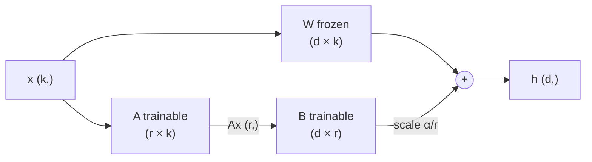
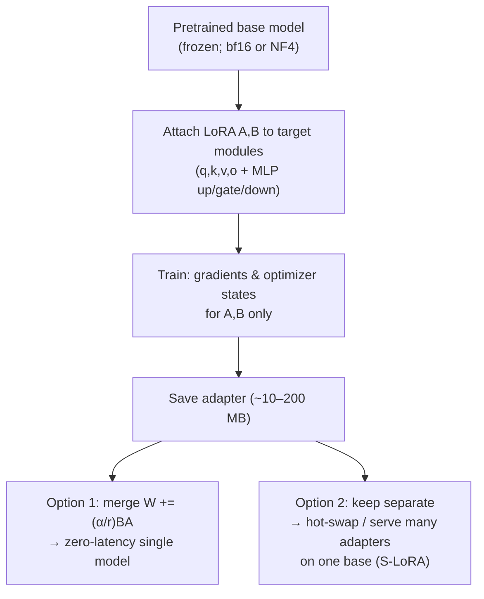
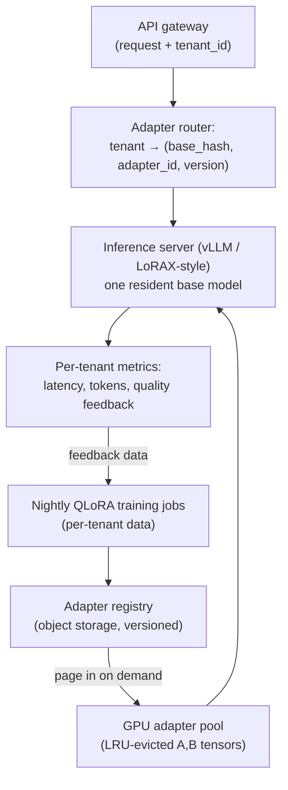

# 3.7 — Parameter-Efficient Fine-Tuning (LoRA, QLoRA, Adapters)

## 1. Overview

**What is it?** Parameter-efficient fine-tuning (PEFT) is a family of techniques that adapt a large pretrained model to a new task or domain by training only a *tiny fraction* of parameters — typically 0.1–1% — while the original weights stay frozen. The flagship method is **LoRA** (Low-Rank Adaptation), which learns a low-rank additive update \(\Delta W = BA\) to each targeted weight matrix; **QLoRA** extends it by holding the frozen base in 4-bit precision.

**Why does it exist?** Full fine-tuning of a 70B-parameter model needs on the order of a terabyte of GPU memory once you count optimizer states — a multi-node cluster job. And every fine-tuned variant is another full copy of the weights to store and serve. PEFT collapses both costs: training fits on one GPU, and each task adaptation is a file of a few megabytes.

**What problem does it solve?** Cheap, fast, storable customization of foundation models: domain adaptation (legal, medical, your company's docs), instruction tuning and alignment ([Chapter 3.6](06-rlhf-dpo.md)), style control, and per-customer personalization — potentially thousands of variants sharing one base model.

**Where is it used?** Practically every fine-tuning workflow outside frontier labs runs on LoRA or QLoRA: Hugging Face's PEFT ecosystem, fine-tuning services from Together AI, Predibase, and Databricks, and multi-tenant serving stacks that hot-swap hundreds of adapters on a single deployed base model.

## 2. Learning Objectives

After this chapter you will be able to:

- Explain why full fine-tuning of large models is memory-prohibitive, with the actual bytes-per-parameter arithmetic.
- State the low-rank hypothesis and the LoRA reparameterization \(W' = W + \frac{\alpha}{r}BA\), defining every symbol.
- Choose rank \(r\), scaling \(\alpha\), and target modules for a given task, and explain the trade-offs.
- Explain why \(B\) is initialized to zero and \(A\) randomly.
- Implement a LoRA linear layer from scratch in NumPy and in PyTorch, and verify merged-weight equivalence.
- Describe QLoRA: NF4 quantization, double quantization, paged optimizers, and why gradients can flow "through" a quantized matrix.
- Compare LoRA with adapters (Houlsby), prefix tuning, prompt tuning, IA³, and DoRA, and know when each wins.
- Merge an adapter into base weights for zero-latency inference, and articulate when *not* to merge.
- Explain multi-adapter serving (S-LoRA-style batching) for multi-tenant products.
- Count trainable parameters and estimate memory savings for any LoRA configuration.

## 3. Prerequisites

| Chapter | Why you need it |
|---|---|
| [Transformer](../phase-2-deep-learning/10-transformer.md) | LoRA attaches to the Transformer's linear projections (attention Q/K/V/O and MLP). |
| [Attention & Self-Attention](../phase-2-deep-learning/09-attention.md) | You must know what the q/k/v/o projections *do* to choose target modules sensibly. |
| [GPT & LLM Pretraining](05-gpt-pretraining.md) | PEFT adapts pretrained models; the memory arithmetic there motivates everything here. |
| [Backpropagation](../phase-2-deep-learning/02-backpropagation.md) | Understanding which parameters receive gradients (and which don't) is the whole point. |
| [Instruction Tuning, RLHF, DPO](06-rlhf-dpo.md) | The most common PEFT workload is SFT/DPO with adapters. |

## 4. Intuition

A pretrained LLM is like a grand piano that took a factory years to build. You want it tuned for jazz. You do *not* rebuild the piano — you adjust a small set of tuning pins. The piano (base weights, billions of parameters) stays intact; your adjustment (the adapter, millions of parameters) is small, reversible, and you can keep a different set of pin positions for jazz, classical, and honky-tonk, swapping between them in seconds.

Why should a *small* adjustment be enough? Here is the everyday story. A seasoned doctor switching hospitals doesn't relearn medicine — they learn the new hospital's forms, formularies, and phrasing conventions. The knowledge delta between "generally competent" and "competent *here*" is tiny compared to the knowledge itself. Fine-tuning a pretrained model is the same: the *change* in weights needed for a downstream task empirically has low **intrinsic dimensionality** — it can be described with far fewer numbers than the weights themselves. LoRA takes this literally: it forces the weight change to be a low-rank matrix, i.e., a product of two thin matrices.

One more picture for "low-rank": a rank-1 update to a 4096×4096 matrix is like adjusting the whole matrix with a single "direction × recipe" pair — 8,192 numbers steering 16.7 million. Rank \(r\) gives you \(r\) such steering directions. For most adaptations, 8–64 directions per matrix suffice.

## 5. Real-world Motivation

- **Microsoft** invented LoRA (Hu et al., 2021) precisely because deploying a separately fine-tuned 175B GPT-3 per customer was economically absurd; low-rank adapters made per-task customization of frontier models tractable.
- **The University of Washington team behind QLoRA** (Dettmers et al., 2023) showed a 65B model fine-tuning on a *single 48 GB GPU*, producing the Guanaco models — the moment serious LLM adaptation became accessible to individuals and small labs.
- **Hugging Face** built the `peft` library around these methods; the overwhelming majority of the hundreds of thousands of fine-tuned model repositories on the Hub are LoRA adapters, not full checkpoints.
- **Predibase and Together AI** run businesses on serving many customer LoRAs over shared base models (Predibase's LoRAX serves hundreds of adapters per GPU); **Databricks** and **Amazon** (SageMaker/Bedrock) offer PEFT fine-tuning as a managed product.
- **Apple** has described using adapter-based specialization for on-device foundation models — one small base with task-specific adapters swapped per feature, exactly the multi-adapter pattern this chapter teaches.

The economics: full fine-tuning of a 70B model is a multi-node job with a ~140 GB artifact per variant; a LoRA run is a single-GPU job with a ~100 MB artifact. That is the difference between "platform feature" and "research project."

## 6. Mathematical Foundations

### 6.1 The cost of full fine-tuning

Fine-tuning all \(N\) parameters with AdamW in mixed precision costs roughly **16 bytes/parameter**: 2 (bf16 weights) + 4 (fp32 master copy) + 8 (Adam moments) + 2 (gradients) — see [Chapter 3.5](05-gpt-pretraining.md), Section 13. For \(N = 70\)B that is ~1.1 TB before activations. PEFT attacks the 14 bytes/param of *training state* by shrinking the set of trainable parameters ~1000-fold; QLoRA additionally attacks the 2 bytes/param of frozen weights by quantizing to ~0.5 bytes.

### 6.2 LoRA: the low-rank reparameterization

Let \(W \in \mathbb{R}^{d \times k}\) be a frozen pretrained weight matrix (output dimension \(d\), input dimension \(k\)). LoRA introduces two trainable matrices:

$$
A \in \mathbb{R}^{r \times k}, \qquad B \in \mathbb{R}^{d \times r}, \qquad r \ll \min(d, k)
$$

and replaces the layer's computation with

$$
h = W x + \frac{\alpha}{r}\, B A\, x
$$

where \(x \in \mathbb{R}^{k}\) is the input, \(h \in \mathbb{R}^{d}\) the output, \(r\) the **rank** of the update, and \(\alpha\) a scaling hyperparameter. The effective weight is

$$
W' = W + \frac{\alpha}{r} B A
$$

**Why this is a rank constraint:** \(BA\) is a \(d \times k\) matrix, but \(\mathrm{rank}(BA) \le r\) because it factors through an \(r\)-dimensional bottleneck. Any rank-\(r\) matrix can be written this way (by truncated SVD), so LoRA searches exactly the set of rank-\(\le r\) updates.

**Parameter count:** \(r(d + k)\) instead of \(dk\). For \(d = k = 4096\), \(r = 8\): 65,536 trainable vs 16.7M — a **256× reduction** for that matrix.

**Initialization:** \(A\) is initialized randomly (Kaiming-uniform), \(B = 0\). Therefore \(BA = 0\) at step 0 and the adapted model is *exactly* the pretrained model — training starts from a known-good function and moves away smoothly. (Initializing both randomly would inject noise into every forward pass before any learning happens; initializing both to zero would kill all gradients, since \(\partial \mathcal{L}/\partial A \propto B^\top\).)

**The \(\alpha/r\) scaling:** the update's magnitude naturally grows with \(r\) (more summed rank-1 terms), so dividing by \(r\) keeps the update scale roughly constant as you sweep rank — you can change \(r\) without retuning the learning rate. A common heuristic is \(\alpha = 2r\) (scale factor 2), or \(\alpha = r\) (scale 1). **rsLoRA** argues the theoretically stable scaling at higher ranks is \(\alpha/\sqrt{r}\).

**Gradients** flow only to \(A\) and \(B\):

$$
\frac{\partial \mathcal{L}}{\partial B} = \frac{\alpha}{r}\, \frac{\partial \mathcal{L}}{\partial h}\, (A x)^\top, \qquad
\frac{\partial \mathcal{L}}{\partial A} = \frac{\alpha}{r}\, B^\top \frac{\partial \mathcal{L}}{\partial h}\, x^\top
$$

\(W\) receives no gradient and needs no optimizer state — the source of the memory savings.

**Merging:** because the update is a plain additive matrix, after training you can compute \(W' = W + \frac{\alpha}{r}BA\) once and discard the adapter — inference is then *identical in cost* to the base model. Zero added latency, unlike bottleneck adapters or prefix methods.

### 6.3 QLoRA: 4-bit bases with NF4

QLoRA = frozen base quantized to 4 bits + bf16 LoRA adapters + two systems tricks.

**NF4 (NormalFloat-4):** pretrained weights are approximately normally distributed, \(w \sim \mathcal{N}(0, \sigma^2)\). NF4 places its 16 representable values at the **quantiles of a standard normal**, so each of the 16 bins holds equal probability mass of a normal distribution — information-theoretically optimal bin placement for normal data, unlike uniformly spaced INT4 levels. Weights are quantized per block of 64 with an absmax scale: \(w \approx s \cdot q\), where \(q\) is the nearest NF4 code and \(s = \max|w_{\text{block}}|\) is a bf16 scale per block.

**Double quantization:** the per-block scales themselves are quantized to 8 bits (with a second-level scale per 256 blocks), saving ~0.37 bits/param — from ~4.5 to ~4.13 effective bits.

**Paged optimizers:** optimizer states live in unified memory and page between CPU and GPU on demand, absorbing the memory spikes of long sequences instead of crashing.

**Why gradients still work:** the forward pass *dequantizes* \(W\) to bf16 on the fly and computes \(h = \hat{W}x + \frac{\alpha}{r}BAx\). Gradients w.r.t. \(A, B\) need \(\partial h/\partial(BA x)\), which doesn't involve differentiating through the quantizer at all — \(W\) is a frozen constant, quantized or not. The only cost is quantization *error* in \(\hat W\); empirically, the LoRA update partially compensates for it, and QLoRA matches 16-bit LoRA on language benchmarks.

Memory for a 65B base: \(65\text{B} \times 0.52\ \text{bytes} \approx 34\) GB — fits one 48 GB GPU with room for adapters, activations, and paged optimizer traffic.

### 6.4 The rest of the PEFT family

| Method | What is trained | Extra inference latency | Typical trainable % |
|---|---|---|---|
| **LoRA** | Low-rank \(BA\) added to linear layers | Zero (after merging) | 0.1–1% |
| **Adapters** (Houlsby, 2019) | Bottleneck MLPs (\(d \to m \to d\), \(m \ll d\)) inserted *serially* after sublayers | Yes — extra sequential layers | 0.5–5% |
| **Prefix tuning** (2021) | \(p\) learned key/value vectors prepended to attention at *every layer* | Yes — longer effective sequence | ~0.1% |
| **Prompt tuning** (2021) | \(p\) learned embedding vectors prepended to the *input only* ("soft prompt") | Minimal | ~0.01% |
| **IA³** (2022) | Per-layer element-wise rescaling vectors \(l_k, l_v, l_{ff}\) on keys/values/FFN activations | Negligible; not mergeable into a single matrix product in general | ~0.01% |
| **DoRA** (2024) | Magnitude vector + LoRA on the direction | Zero (after merging) | ~ LoRA + tiny |

Formulas for the two non-obvious ones. **IA³** rescales activations elementwise: \(K' = l_k \odot K\), \(V' = l_v \odot V\), \(h' = l_{ff} \odot \phi(W_1 x)\), where \(\odot\) is elementwise product and each \(l\) is a learned vector initialized to ones. **DoRA** decomposes a weight into magnitude and direction, \(W = m \cdot \frac{V}{\|V\|_c}\) (\(\|\cdot\|_c\) = per-column norm), trains \(m\) directly and applies LoRA to \(V\):

$$
W' = m \cdot \frac{W_0 + BA}{\|W_0 + BA\|_c}
$$

This matches how full fine-tuning actually changes weights (mostly directional changes with independent magnitude shifts) and closes part of LoRA's quality gap at low ranks; like LoRA, it merges to zero extra latency.

Prompt/prefix tuning shine when the base model must remain a completely untouched black box (e.g., adapting via an embedding API) and at very large model scales, where prompt tuning famously matches full fine-tuning (Lester et al., 2021); LoRA dominates the mid-scale open-model regime.

## 7. Visual Explanation

The LoRA forward path — a small bypass around a frozen highway:



ASCII shape of the bottleneck for \(d = k = 4096\), \(r = 8\):

```
        x (4096)
        │
   ┌────┴─────────────────┐
   │                      │
   ▼                      ▼
 W: 4096×4096          A: 8×4096      ← 16.7M frozen vs 32k trainable
 (frozen)                 │ (8)
   │                      ▼
   │                   B: 4096×8      ← 32k trainable, init 0
   │                      │
   └────► (+) ◄── ×(α/r) ─┘
          │
          ▼
        h (4096)
```

Training vs serving lifecycle:



## 8. Algorithm

**Fine-tuning with LoRA, step by step:**

1. Load the pretrained model; set `requires_grad=False` on every parameter. (For QLoRA: load the base in NF4 via bitsandbytes.)
2. Choose **target modules** — by default all attention projections (q, k, v, o) *and* MLP matrices (up/gate/down). Attention-only is a common but usually inferior shortcut; the QLoRA paper found targeting all linear layers matters more than raising rank.
3. For each target \(W\), create \(A\) (Kaiming-init) and \(B\) (zeros); the layer now computes \(Wx + \frac{\alpha}{r}B(Ax)\). Pick \(r\) (8–64) and \(\alpha\) (often \(2r\)); optionally LoRA dropout ~0.05.
4. Train normally (AdamW, LR ~1e-4–3e-4 — roughly 10× higher than full-fine-tune LRs, because you're training freshly initialized small matrices). Only \(A, B\) accumulate gradients and optimizer state.
5. Save the adapter: just the \(A, B\) tensors and config — megabytes.
6. Deploy: **merge** (\(W \mathrel{+}= \frac{\alpha}{r}BA\)) for single-task, lowest-latency serving; **keep separate** for multi-adapter serving or continued training.

**Pseudocode:**

```
function lora_forward(x, W_frozen, A, B, alpha, r):
    return W_frozen @ x + (alpha / r) * (B @ (A @ x))
    # order matters: A@x is (r,), then B@(...) is (d,)
    # computing (B@A) first would materialize a d×k matrix — wasteful

function train_lora(model, data, targets={q,k,v,o,up,gate,down}, r=16, alpha=32):
    freeze(model.parameters)
    for layer in model.layers, name in targets:
        layer[name].A = kaiming_init(r, k);  layer[name].B = zeros(d, r)
    opt = AdamW(all A and B, lr=2e-4)
    for batch in data:
        loss = causal_lm_loss(model(batch))   # same loss as SFT (Ch. 3.6)
        loss.backward()                       # touches only A, B
        opt.step(); opt.zero_grad()

function merge(W, A, B, alpha, r):
    return W + (alpha / r) * (B @ A)          # one-time cost, zero runtime overhead
```

## 9. Worked Example

**Tiny example by hand.** Let \(d = k = 2\), \(r = 1\), \(\alpha = 1\) (so scale \(\alpha/r = 1\)):

$$
W = \begin{pmatrix} 1 & 0 \\ 0 & 1 \end{pmatrix}, \quad
A = \begin{pmatrix} 1 & 2 \end{pmatrix} \in \mathbb{R}^{1\times 2}, \quad
B = \begin{pmatrix} 0.5 \\ -0.5 \end{pmatrix} \in \mathbb{R}^{2\times 1}, \quad
x = \begin{pmatrix} 1 \\ 1 \end{pmatrix}
$$

Bypass path: \(Ax = 1\cdot1 + 2\cdot1 = 3\) (a scalar, since \(r=1\)); then \(B(Ax) = (1.5, -1.5)^\top\). Main path: \(Wx = (1, 1)^\top\). Output: \(h = (2.5, -0.5)^\top\).

Merged weight: \(BA = \begin{pmatrix} 0.5 & 1 \\ -0.5 & -1 \end{pmatrix}\), so \(W' = \begin{pmatrix} 1.5 & 1 \\ -0.5 & 0 \end{pmatrix}\), and indeed \(W'x = (2.5, -0.5)^\top\) — merged and unmerged paths agree exactly. Note \(BA\) has rank 1: its second column is twice the first. Trainable parameters: \(r(d+k) = 4\) vs \(dk = 4\) — no savings at this toy size; the ratio \(\frac{r(d+k)}{dk}\) only becomes tiny when \(d, k \gg r\).

**Realistic scale.** Llama-3-8B, LoRA with \(r = 16\) on all linear layers (q, k, v, o, gate, up, down across 32 layers, \(d_{\text{model}} = 4096\), MLP dim 14336, GQA k/v output 1024). Per layer: q and o contribute \(16(4096{+}4096) = 131\)k each; k and v \(16(4096{+}1024) = 82\)k each; gate and up \(16(4096{+}14336) = 295\)k each; down \(16(14336{+}4096) = 295\)k. Total ≈ \(1.31\)M/layer × 32 ≈ **42M trainable parameters — 0.52% of 8B**. Adapter file: ~84 MB in bf16. Optimizer states: ~0.6 GB instead of ~110 GB for full fine-tuning.

## 10. Python from Scratch

A complete LoRA linear layer in NumPy, with manual gradients and a merge-equivalence check:

```python
import numpy as np

rng = np.random.default_rng(0)

class LoRALinearNumpy:
    def __init__(self, d, k, r=4, alpha=8):
        self.W = rng.normal(0, 0.02, (d, k))       # "pretrained" weight — frozen
        self.A = rng.normal(0, 1/np.sqrt(k), (r, k))  # random init (like Kaiming)
        self.B = np.zeros((d, r))                  # zero init → BA = 0 at start
        self.scale = alpha / r

    def forward(self, x):                          # x: (batch, k)
        self.x = x                                 # cache input for backward
        self.Ax = x @ self.A.T                     # (batch, r)  — the bottleneck
        return x @ self.W.T + self.scale * (self.Ax @ self.B.T)  # (batch, d)

    def backward(self, dh):                        # dh: (batch, d) = dLoss/dh
        # gradients ONLY for A and B — W is frozen, gets no gradient
        self.dB = self.scale * dh.T @ self.Ax      # (d, r)
        self.dA = self.scale * (dh @ self.B).T @ self.x  # (r, k)
        return dh @ (self.W + self.scale * self.B @ self.A)  # dLoss/dx, (batch, k)

    def merge(self):
        return self.W + self.scale * self.B @ self.A   # W' for deployment

layer = LoRALinearNumpy(d=6, k=4, r=2)
x = rng.normal(size=(3, 4))                        # batch of 3 inputs

# Property 1: at init, LoRA output == frozen output (B = 0)
assert np.allclose(layer.forward(x), x @ layer.W.T)

# take one "training step" so the adapter is non-trivial
layer.backward(np.ones((3, 6)))
layer.A -= 0.1 * layer.dA; layer.B -= 0.1 * layer.dB

# Property 2: unmerged forward == merged forward (exactly)
assert np.allclose(layer.forward(x), x @ layer.merge().T)
print("init-identity and merge-equivalence both hold")
```

Line-by-line notes: `Ax` is the \((batch, r)\) bottleneck activation — the whole memory story of LoRA in one small tensor. `backward` shows that \(dB\) needs only the cached bottleneck and \(dA\) needs the input — cheap. The returned `dLoss/dx` uses the *effective* weight, since downstream layers see the sum of both paths.

Complexity: forward adds \(O(\text{batch} \cdot r(d + k))\) FLOPs on top of the frozen \(O(\text{batch} \cdot dk)\) — under 1% overhead for \(r \ll d, k\).

> [!WARNING]
> **Common bug:** computing the bypass as `(B @ A) @ x`. Mathematically identical, but it materializes the full \(d \times k\) matrix every forward pass, destroying LoRA's compute advantage. Always compute `B @ (A @ x)` — bottleneck first.

## 11. Library Implementation

From-scratch in PyTorch, then production PEFT + QLoRA:

```python
import torch, torch.nn as nn

class LoRALinear(nn.Module):
    def __init__(self, in_f, out_f, r=8, alpha=16, dropout=0.05):
        super().__init__()
        self.W = nn.Linear(in_f, out_f, bias=False)
        self.W.weight.requires_grad_(False)          # freeze the pretrained path
        self.A = nn.Parameter(torch.empty(r, in_f))
        nn.init.kaiming_uniform_(self.A, a=5**0.5)   # matches nn.Linear's default init
        self.B = nn.Parameter(torch.zeros(out_f, r)) # zero → identity at step 0
        self.scale = alpha / r
        self.drop = nn.Dropout(dropout)              # regularizes the adapter path only

    def forward(self, x):                            # x: (B, T, in_f)
        return self.W(x) + self.scale * (self.drop(x) @ self.A.T @ self.B.T)

    @torch.no_grad()
    def merge(self):                                 # fold adapter into W for serving
        self.W.weight += self.scale * (self.B @ self.A)
```

Production path with Hugging Face PEFT:

```python
from peft import LoraConfig, get_peft_model, TaskType
from transformers import AutoModelForCausalLM, BitsAndBytesConfig
import torch

# --- QLoRA: load the frozen base in 4-bit NF4 ---
bnb = BitsAndBytesConfig(
    load_in_4bit=True,
    bnb_4bit_quant_type="nf4",              # normal-quantile code points (Sec. 6.3)
    bnb_4bit_compute_dtype=torch.bfloat16,  # dequantize-to-bf16 for each matmul
    bnb_4bit_use_double_quant=True,         # quantize the block scales too
)
base = AutoModelForCausalLM.from_pretrained(
    "meta-llama/Meta-Llama-3-8B", quantization_config=bnb, device_map="auto")

# --- attach LoRA ---
cfg = LoraConfig(
    task_type=TaskType.CAUSAL_LM,
    r=16, lora_alpha=32, lora_dropout=0.05,          # alpha = 2r heuristic
    target_modules=["q_proj", "k_proj", "v_proj", "o_proj",
                    "gate_proj", "up_proj", "down_proj"],  # ALL linear layers
)
model = get_peft_model(base, cfg)
model.print_trainable_parameters()
# -> trainable params: 41,943,040 || all params: 8,072,204,288 || trainable%: 0.5196

# train with any standard loop or trl.SFTTrainer (Ch. 3.6), then:
model.save_pretrained("my-adapter")                  # writes ~84 MB, not 16 GB
merged = model.merge_and_unload()                    # W += (alpha/r) BA everywhere
```

> [!TIP]
> `merge_and_unload()` on a 4-bit base dequantizes to merge — do final merges into a bf16/fp16 copy of the base, then (re)quantize for serving if needed. Merging into NF4 weights directly accumulates quantization error.

## 12. Code Walkthrough

Shapes for one training step of QLoRA-SFT on Llama-3-8B, batch \(B = 4\), sequence \(T = 1024\), one q_proj layer (\(4096 \to 4096\)), \(r = 16\):

| Tensor | Shape | Meaning |
|---|---|---|
| `x` (layer input) | (4, 1024, 4096) | Hidden states entering q_proj |
| `W` (NF4, packed) | 4096 × 4096 @ 4 bits | Frozen base weight, ~8.4 MB (vs 33.6 MB bf16) |
| `A` | (16, 4096) | Trainable down-projection, bf16 |
| `x @ A.T` | (4, 1024, 16) | Bottleneck activation — tiny |
| `B` | (4096, 16) | Trainable up-projection, init 0 |
| adapter output | (4, 1024, 4096) | Scaled by α/r = 2, added to frozen path |
| grads + Adam states | only for A, B | ~42M params × 16 B ≈ 0.7 GB for the whole model |

Expected results: `print_trainable_parameters()` reports ~0.52%; total GPU memory for the 8B QLoRA run ≈ 5 GB weights + ~1 GB adapter training state + activations — comfortable on a 24 GB card with gradient checkpointing. Sanity checks worth automating: (1) at step 0, adapted logits equal base logits bit-for-bit (B = 0); (2) after training, merged-model logits equal unmerged logits to fp tolerance; (3) loss decreases while `base_model` parameters remain unchanged (`hash` a weight before/after).

## 13. Complexity Analysis

**Training time.** The forward pass still costs the full frozen-model FLOPs — LoRA does not make the *model* smaller — plus a negligible \(O(r(d+k))\) per target matrix (< 1% for \(r \le 64\)). The savings are in backward and the optimizer: weight-gradient computation for frozen matrices is skipped, and the optimizer updates ~0.5% of parameters. In practice LoRA steps run ~1.2–2× faster than full-FT steps; QLoRA trades some of that back for dequantization overhead (~1.5–2× slower than bf16 LoRA) in exchange for the memory win.

**Training memory.** Trainable state: \(16 \cdot r \sum (d_i + k_i)\) bytes ≈ 0.7 GB for the 8B example, vs ~110 GB full-FT — a 150× reduction of exactly the component that made full FT infeasible. Frozen weights: 2 bytes/param bf16, ~0.52 bytes/param NF4 with double quantization. Activations are *unchanged* (same architecture) — still the reason to use gradient checkpointing.

**Storage:** \(O(r \sum(d_i + k_i))\) per task ≈ tens of MB, vs \(O(N)\) ≈ 16 GB per full fine-tune. A thousand customer variants: 84 GB of adapters vs 16 TB of checkpoints.

**Inference:** merged — identical to base, zero overhead. Unmerged — one extra rank-\(r\) matmul pair per target layer (~1–3% latency), the price of hot-swappability.

## 14. Advantages

- **Single-GPU adaptation of huge models.** QLoRA fine-tuned 65B on one 48 GB GPU (Guanaco); 7–8B models fine-tune on consumer 24 GB cards.
- **Tiny artifacts.** An 84 MB adapter vs a 16 GB checkpoint makes storage, versioning, A/B testing, and rollback trivial — Hugging Face Hub hosts hundreds of thousands of adapters for this reason.
- **Zero-latency deployment via merging.** Unlike bottleneck adapters or prefix tuning, merged LoRA is computationally indistinguishable from the base model.
- **Multi-tenant serving.** One base + hundreds of hot-swapped adapters (S-LoRA, Predibase LoRAX) makes per-customer models economically viable.
- **Quality parity on most adaptation tasks.** For instruction tuning, domain style, and classification, LoRA at adequate rank matches full fine-tuning (QLoRA's Guanaco matched 16-bit full FT on benchmarks).
- **Less catastrophic forgetting.** The frozen base preserves pretraining knowledge; the low-rank constraint acts as a regularizer — helpful for small datasets where full FT overfits.

## 15. Disadvantages

- **A quality gap on hard, capability-shifting tasks.** For large-distribution-shift workloads (heavy math/code reasoning gains, new languages), full fine-tuning or continued pretraining still wins; low rank caps how much new "signal" fits.
- **New knowledge injection is weak.** LoRA excels at *style/behavior* adaptation but is a poor vehicle for teaching large volumes of new facts — that is continued pretraining's job ([Chapter 3.5](05-gpt-pretraining.md)), or retrieval's ([Chapter 3.9](09-rag.md)).
- **Hyperparameter surface.** Rank, alpha, target modules, LR, and dropout interact; a bad combination silently underfits.
- **QLoRA drift outside language.** NF4 assumes normally distributed weights; heavily quantization-sensitive layers or non-language domains can degrade — and merging into quantized weights compounds error.
- **Unmerged serving overhead and complexity.** Multi-adapter stacks add batching, routing, and memory-management machinery.
- **Not applicable when you can't touch weights at all** — for API-only black boxes, you're limited to prompt-side methods ([Chapter 3.8](08-prompt-engineering.md)).

## 16. Common Mistakes

- **Targeting only attention (q, v) and skipping the MLP.** The original paper's minimal recipe underperforms on modern LLMs; the QLoRA finding is that *all-linear* targeting beats raising rank. *Fix:* include gate/up/down projections by default.
- **Using full-fine-tune learning rates (1e-5).** Freshly initialized adapters need ~10× more. *Fix:* start at 1–3e-4 for SFT-scale tasks.
- **Rank too small for the task.** \(r = 4\) is fine for style, underfits multi-skill instruction tuning. *Fix:* sweep \(r \in \{8, 16, 64\}\); if 64 still underfits, the task may need full FT.
- **Forgetting to merge (or to account for unmerged overhead) in latency-critical serving.** *Fix:* merge for single-adapter deployments; benchmark both paths.
- **Merging into a 4-bit base.** Accumulates quantization error. *Fix:* merge into a bf16 copy, then quantize the merged model.
- **Saving/loading only the adapter but changing the base version.** An adapter is meaningless deltas against *specific* base weights. *Fix:* pin and record the exact base checkpoint hash with every adapter.
- **Initializing B randomly** (in hand-rolled implementations) → the model starts as a *perturbed* base and early loss spikes. *Fix:* B = 0, A random — always.

## 17. Best Practices

- [ ] Default recipe for LLM SFT: QLoRA NF4 base, \(r = 16\), \(\alpha = 32\), dropout 0.05, all linear target modules, LR 2e-4 cosine, gradient checkpointing on.
- [ ] Verify the three invariants after wiring anything by hand: step-0 identity, merge equivalence, frozen-base immutability.
- [ ] Log `print_trainable_parameters()` in every run — a wrong `target_modules` regex fails *silently* with 0 matched layers.
- [ ] Sweep rank on a subset before the full run; plot task metric vs \(r\) — it usually saturates early.
- [ ] Record base-model checkpoint + revision alongside each saved adapter; treat (base, adapter) as an atomic versioned pair.
- [ ] Use LoRA for DPO/RLHF too ([Chapter 3.6](06-rlhf-dpo.md)) — disabling the adapter gives you the reference model for free.
- [ ] For serving: merge for single-tenant, keep separate + batch for multi-tenant; re-evaluate the merged model, not just the training-time model.
- [ ] Evaluate for *forgetting*: run a general benchmark (e.g., an MMLU subset) before and after, not just the target-task metric.

## 18. Optimization Techniques

- **QLoRA (NF4 + double quant + paged optimizers):** the standard memory floor — ~0.52 bytes/param for the frozen base.
- **Gradient checkpointing:** activations dominate LoRA training memory; checkpointing is nearly mandatory at long sequence lengths.
- **LoRA+:** use a higher learning rate for \(B\) than \(A\) (~16×); improves convergence speed and final quality, especially at low rank.
- **rsLoRA:** scale by \(\alpha/\sqrt{r}\) instead of \(\alpha/r\) for stable training at high ranks (64–256).
- **DoRA:** magnitude/direction decomposition; closes low-rank quality gaps for ~zero extra serving cost after merging.
- **Adapter merging arithmetic:** average or task-weight multiple adapters (\(W + \sum_i \lambda_i \frac{\alpha}{r} B_i A_i\)) to compose skills — cheap multi-task models via "task vectors."
- **S-LoRA / LoRAX-style serving:** keep adapters in a paged GPU memory pool, gather per-request \(A, B\) into batched custom kernels — hundreds of concurrent adapters per GPU at a few percent throughput cost.
- **Flash attention + packing:** orthogonal throughput wins from [Chapter 3.5](05-gpt-pretraining.md) all still apply.

## 19. Industry Applications

- **Microsoft:** LoRA originated there for GPT-3 customization; Azure AI fine-tuning offerings are adapter-based.
- **Apple:** on-device foundation model with per-feature adapters (summarization, notification triage) swapped over one shared base — the multi-adapter pattern at consumer scale.
- **Predibase (LoRAX) and Together AI:** commercial platforms whose core economics are many fine-tunes per GPU via multi-adapter serving.
- **Databricks / Amazon SageMaker & Bedrock:** managed PEFT fine-tuning as the default enterprise customization path for open models.
- **Hugging Face ecosystem:** the `peft` library is the de facto standard; most community fine-tunes of Llama/Mistral/Qwen ship as LoRA adapters.
- **Production example:** a SaaS support-bot vendor keeps one Llama-3-8B base per region, trains a QLoRA adapter per enterprise customer on their ticket history (single-GPU nightly jobs), stores adapters in object storage keyed by (base-hash, customer, version), and serves them via a LoRAX-style router that pages adapters onto GPUs on demand — thousands of "custom models" on a handful of machines.

## 20. Interview Questions

### Beginner

**Q: What problem does LoRA solve, in one sentence?**
A: It makes fine-tuning large models affordable by training only a small low-rank additive update \(BA\) to frozen weights, cutting trainable parameters (and optimizer memory) by ~100–1000× while keeping quality close to full fine-tuning.

**Q: Write the LoRA forward computation and name each symbol.**
A: \(h = Wx + \frac{\alpha}{r}BAx\): \(W\) the frozen \(d\times k\) pretrained weight, \(A \in \mathbb{R}^{r\times k}\) and \(B \in \mathbb{R}^{d\times r}\) the trainable factors, \(r\) the rank, \(\alpha\) a scaling constant, \(x\) the input.

**Q: Why is B initialized to zero?**
A: So \(BA = 0\) at step 0 and the adapted model is exactly the pretrained model — training starts from a known-good function. Both-zero would kill gradients; both-random would perturb the model before learning begins.

**Q: How big is a saved LoRA adapter compared to the full model?**
A: Megabytes vs gigabytes — e.g., ~84 MB for r=16 on all linear layers of an 8B model vs ~16 GB for the full bf16 checkpoint.

**Q: What does "merging" an adapter mean?**
A: Computing \(W' = W + \frac{\alpha}{r}BA\) once and replacing \(W\), so inference has exactly the base model's cost — zero added latency.

### Intermediate

**Q: Why does a low-rank update suffice for fine-tuning?**
A: Empirically, the weight *change* during task adaptation has low intrinsic dimensionality — the delta between "generally capable" and "task-adapted" lives in a small subspace (Aghajanyan et al., 2020; Hu et al., 2021). LoRA constrains the search to rank-\(r\) matrices, which is enough for most behavior/style/domain adaptation, though not for large capability shifts.

**Q: What is the role of α, and why divide by r?**
A: The update's scale is \(\frac{\alpha}{r}\|BA\|\); dividing by \(r\) keeps the update magnitude roughly constant as rank changes, decoupling the rank sweep from the learning-rate sweep. \(\alpha = 2r\) is a common heuristic; rsLoRA argues \(\alpha/\sqrt{r}\) is the stable scaling at high ranks.

**Q: How does QLoRA fit 65B-model fine-tuning on one GPU? Name its three components.**
A: (1) NF4 4-bit quantization of the frozen base, with code points at normal-distribution quantiles (optimal for normally distributed weights); (2) double quantization of the per-block scales (~0.37 bits/param saved); (3) paged optimizers that spill optimizer state to CPU on memory spikes. Base ≈ 34 GB, adapters + states ≈ small, total < 48 GB.

**Q: Compare LoRA, adapters, prefix tuning, and prompt tuning on inference latency.**
A: Merged LoRA: zero overhead. Bottleneck adapters: extra *serial* layers → permanent latency add. Prefix tuning: longer effective KV sequence at every layer → attention cost grows. Prompt tuning: a few extra input tokens → minimal. This latency profile is a major reason LoRA won.

**Q: Which layers should you attach LoRA to?**
A: Default to *all* linear layers — attention q/k/v/o plus MLP up/gate/down. The QLoRA ablation showed all-linear targeting matters more than increasing rank; attention-only recipes systematically underfit modern LLMs.

**Q: Why do gradients flow correctly even though the QLoRA base is quantized?**
A: \(W\) is frozen — no gradient is ever taken *through* the quantizer. The forward dequantizes \(\hat W\) to bf16 as a constant; gradients only reach \(A\) and \(B\), whose path is ordinary bf16 arithmetic. Quantization affects the forward *values* (error the adapter can partly compensate), not gradient correctness.

### Advanced

**Q: Derive the trainable-parameter count and break-even rank for LoRA on a d×k matrix.**
A: LoRA trains \(r(d+k)\) parameters vs \(dk\). Savings require \(r < \frac{dk}{d+k}\) (the harmonic-mean-like bound); for square \(d = k\), break-even is \(r = d/2\). Practical \(r \le 64 \ll d/2 = 2048\) explains the ~0.5% ratios.

**Q: What is DoRA and why does it help at low rank?**
A: DoRA decomposes each weight as magnitude × direction, \(W' = m \cdot \frac{W_0 + BA}{\|W_0 + BA\|_c}\), training the magnitude vector \(m\) directly and applying LoRA only to the direction. Analysis of full fine-tuning shows it changes directions and magnitudes with distinct patterns that plain LoRA couples together; decoupling them recovers quality at low rank, and the result still merges to zero extra latency.

**Q: How does S-LoRA serve hundreds of adapters on one GPU efficiently?**
A: It keeps all adapters in host memory, pages the *active* ones into a unified GPU memory pool (same paging idea as PagedAttention for KV cache), and uses custom batched kernels that gather per-request \((A_i, B_i)\) so heterogeneous requests share one base-model forward pass. Base compute is amortized across tenants; adapter compute is a small rank-\(r\) addition per request.

**Q: When would you choose full fine-tuning over LoRA despite the cost?**
A: Large distribution shifts (new language, new modality-ish domains like protein sequences), pushing frontier reasoning capability, or continued pretraining on billions of tokens — cases where the required weight change exceeds any practical rank budget or where you need to move embeddings/all layers coherently. Also when the model is small enough (< ~1B) that full FT is already cheap.

**Q: Can you compose multiple LoRA adapters? What are the failure modes?**
A: Yes — add the scaled updates (\(W + \sum_i \lambda_i \frac{\alpha_i}{r_i} B_i A_i\)) or merge sequentially; "task arithmetic" can even subtract behaviors. Failure modes: interference between adapters trained on overlapping subspaces (quality drops nonlinearly with count), scale mismatch (different α/r conventions), and adapters trained on *different base versions*, which are meaningless to combine.

## 21. Coding Exercises

### Easy

1. **Implement `LoRALinear`** (PyTorch, Section 11) and verify the step-0 identity: outputs equal a plain frozen `nn.Linear` for random inputs. *Hint:* `torch.allclose` with default tolerance should pass exactly, since B = 0 makes the bypass literally zero.
2. **Parameter accounting:** write a function that, given \((d, k, r)\) lists for a model's linear layers, reports trainable count, percentage, and adapter file size in MB (bf16). Check it against `print_trainable_parameters()` on a real model. *Hint:* 2 bytes per bf16 parameter.

### Medium

1. **Rank sweep:** fine-tune a small model (e.g., 0.5–1B) on 5k instruction pairs at \(r \in \{4, 8, 16, 64\}\) with \(\alpha = 2r\); plot eval loss vs \(r\) and find the saturation point. *Hint:* keep LR fixed — the α/r scaling exists precisely so you can.
2. **Target-module ablation:** same setup, compare attention-only vs MLP-only vs all-linear at equal *trainable parameter count* (adjust \(r\) to compensate). *Hint:* this reproduces the QLoRA paper's most-cited ablation.
3. **Merge-and-verify:** train any adapter, call `merge_and_unload()`, and assert merged vs unmerged logits agree within fp tolerance on 100 inputs; then measure tokens/sec for both. *Hint:* compare in the same dtype; NF4 bases must be dequantized first.

### Hard

1. **Implement NF4 quantization in NumPy:** compute the 16 normal-quantile code points, quantize a weight matrix in blocks of 64 with absmax scaling, dequantize, and report RMS error vs uniform INT4 on (a) Gaussian weights and (b) uniform weights. *Hint:* NF4 should win clearly on (a) and can lose on (b) — that's the point.
2. **Mini multi-adapter server:** load one base and 3 adapters; serve requests tagged with an adapter id, batching same-adapter requests, and hot-swap without reloading the base. Measure per-adapter latency overhead vs merged. *Hint:* PEFT's `set_adapter` / `add_adapter` APIs handle the swap.
3. **Implement DoRA on top of your LoRALinear:** add the column-norm decomposition and trainable magnitude; compare against plain LoRA at \(r = 4\) on a small task. *Hint:* detach the norm in the denominator as in the paper to stabilize training.

## 22. Mini Project

**Fine-tune a 3B model on one GPU with LoRA.**

1. Load an open ~3B base model (e.g., a small Llama/Qwen/Phi variant) with the QLoRA `BitsAndBytesConfig` from Section 11.
2. Attach LoRA (\(r = 16\), \(\alpha = 32\), all linear modules); confirm ~0.5% trainable.
3. Fine-tune with `trl.SFTTrainer` on ~10k Alpaca-style instruction pairs (LR 2e-4, 1–2 epochs, gradient checkpointing).
4. Verify the three invariants (step-0 identity, merge equivalence, frozen base unchanged).
5. Compare base vs adapted generations on 20 held-out instructions; save the adapter and note its size on disk.
6. Deliverable: adapter file, a before/after transcript table, and your GPU memory readings vs the full-FT estimate.

## 23. Medium Project

**Domain adaptation with QLoRA and a forgetting audit.**

1. Assemble a domain corpus (legal opinions, medical abstracts, or your codebase docs — ~50–200 MB) and a domain eval task (QA pairs or classification).
2. Baseline a 7–8B instruct model on: the domain task, and a general suite (MMLU subset + IFEval subset).
3. Train QLoRA on the domain data (continued pretraining objective for raw text, or SFT for QA pairs); sweep \(r \in \{8, 16, 64\}\).
4. Re-run both eval suites per configuration; plot domain gain vs general-capability loss (the forgetting frontier).
5. Try mixing 10–20% general instruction data into training and show its effect on the frontier.
6. Deliverable: a report recommending rank + data mixture, with the frontier plot and example outputs.

## 24. Advanced Project

**Multi-tenant LoRA serving platform.**

*Architecture:*



*Implementation phases:*

1. **Registry:** store adapters in object storage keyed by (base-model hash, tenant, version); enforce base-compatibility checks at upload.
2. **Serving core:** deploy vLLM with multi-LoRA enabled (or LoRAX); implement the router and an LRU adapter pool; batch same-adapter requests where possible.
3. **Training pipeline:** containerized single-GPU QLoRA jobs per tenant with the Section 17 default recipe; automatic eval gate (domain metric + forgetting check) before an adapter version goes live.
4. **Benchmarking:** measure throughput and p95 latency at 1, 10, 50, 200 resident adapters vs the merged-single-model baseline; find the overhead curve.
5. **Operations:** canary new adapter versions on a traffic slice; per-tenant rollback = registry pointer flip.

*Possible improvements:* speculative decoding with a shared draft model; adapter merging for tenants with multiple skill adapters; distill hot tenants' adapters into merged quantized models when they outgrow shared serving; add KTO-style training on the live thumbs-up/down stream ([Chapter 3.6](06-rlhf-dpo.md)).

## 25. Summary

- Full fine-tuning costs ~16 bytes/parameter of training state; PEFT shrinks the *trainable* set ~1000× and QLoRA shrinks the *frozen* weights to ~0.52 bytes/param.
- LoRA reparameterizes each targeted weight as \(W + \frac{\alpha}{r}BA\) with \(A\) random-init, \(B\) zero-init — the model starts exactly at the pretrained function.
- The \(\alpha/r\) scaling decouples rank sweeps from learning-rate tuning; \(\alpha = 2r\) is the common default, rsLoRA's \(\alpha/\sqrt{r}\) for high ranks.
- Target *all* linear layers (attention + MLP); this matters more than raising rank.
- LoRA learning rates are ~10× full-FT rates (start at 2e-4); rank 8–64 covers most adaptation tasks.
- QLoRA = NF4 (normal-quantile 4-bit codes) + double quantization + paged optimizers; gradients are exact because the quantized base is a frozen constant.
- Merging (\(W \mathrel{+}= \frac{\alpha}{r}BA\)) gives zero-latency inference; keeping adapters separate enables hot-swapping and S-LoRA-style multi-tenant serving.
- LoRA excels at behavior/style/domain adaptation; large capability shifts and bulk knowledge injection still favor full fine-tuning or continued pretraining, and fresh knowledge favors RAG.
- Alternatives occupy niches: prompt/prefix tuning for black-box or extreme-scale settings, IA³ for minimal parameters, DoRA to close low-rank quality gaps.
- An adapter is only meaningful with its exact base checkpoint — version them as a pair.

## 26. Cheat Sheet

| Formula | Meaning |
|---|---|
| \(h = Wx + \frac{\alpha}{r}BAx\) | LoRA forward (bypass around frozen \(W\)) |
| \(W' = W + \frac{\alpha}{r}BA\) | Merged weight (zero-latency serving) |
| \(r(d+k)\) vs \(dk\) | Trainable params: LoRA vs full |
| \(\mathrm{rank}(BA) \le r\) | Why the bottleneck is a rank constraint |
| \(W' = m \cdot \frac{W_0 + BA}{\|W_0+BA\|_c}\) | DoRA (magnitude + direction) |
| ~0.52 bytes/param | NF4 + double-quant frozen base |

**Defaults:** \(r = 16\), \(\alpha = 32\), dropout 0.05, all linear target modules, LR 2e-4 (SFT) / lower for DPO, AdamW, gradient checkpointing on, NF4 + bf16 compute for QLoRA.

**One-liners:** B starts at zero — step 0 is the base model; compute \(B(Ax)\), never \((BA)x\); merge into bf16, not into 4-bit; adapter + base hash travel together; check `trainable%` every run.

**Gotchas:** wrong `target_modules` names match nothing and fail silently; full-FT learning rates underfit adapters 10×; attention-only targeting underperforms; unmerged adapters cost 1–3% latency; NF4 assumes normal-ish weights.

## 27. Further Reading

**Books**
- Sebastian Raschka, *Build a Large Language Model (From Scratch)* — includes a practical LoRA appendix.
- Lewis Tunstall et al., *Natural Language Processing with Transformers* — fine-tuning workflows context.

**Research papers**
- Hu et al., *LoRA: Low-Rank Adaptation of Large Language Models* (2021).
- Dettmers et al., *QLoRA: Efficient Finetuning of Quantized LLMs* (2023).
- Aghajanyan et al., *Intrinsic Dimensionality Explains the Effectiveness of Language Model Fine-Tuning* (2020) — the "why low rank works" foundation.
- Houlsby et al., *Parameter-Efficient Transfer Learning for NLP* (adapters, 2019).
- Li & Liang, *Prefix-Tuning* (2021); Lester et al., *The Power of Scale for Parameter-Efficient Prompt Tuning* (2021).
- Liu et al., *Few-Shot Parameter-Efficient Fine-Tuning is Better and Cheaper than In-Context Learning* (IA³ / T-Few, 2022).
- Liu et al., *DoRA: Weight-Decomposed Low-Rank Adaptation* (2024); Kalajdzievski, *rsLoRA* (2023); Hayou et al., *LoRA+* (2024).
- Sheng et al., *S-LoRA: Serving Thousands of Concurrent LoRA Adapters* (2023).
- Ilharco et al., *Editing Models with Task Arithmetic* (2022) — adapter/weight composition.

**Documentation:** Hugging Face PEFT docs (LoraConfig, merging, multi-adapter); bitsandbytes docs (NF4, double quantization); vLLM multi-LoRA serving docs.

**GitHub repositories:** huggingface/peft; bitsandbytes-foundation/bitsandbytes; predibase/lorax; S-LoRA/S-LoRA; huggingface/trl (PEFT-integrated SFT/DPO).

**Datasets:** Alpaca (and cleaned variants), Dolly-15k, OpenAssistant (OASST), UltraChat — the standard PEFT-scale instruction sets.

**YouTube/Videos:** Tim Dettmers' QLoRA talk; Hugging Face PEFT workshop recordings; Sebastian Raschka's LoRA-from-scratch walkthroughs.

**Blogs:** Sebastian Raschka, "Practical Tips for Finetuning LLMs Using LoRA"; Hugging Face blog posts on PEFT and 4-bit quantization; Lightning AI's LoRA-from-scratch series; Answer.AI on FSDP+QLoRA for 70B training on consumer GPUs.
