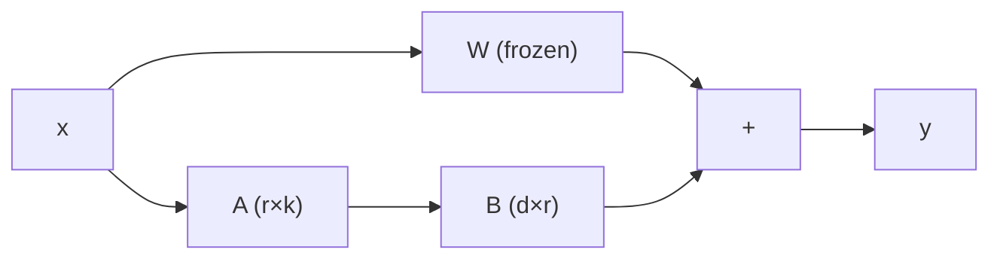

# 3.7 — Parameter-Efficient Fine-Tuning (LoRA, QLoRA, Adapters)

## 1. Intuition first
Full fine-tuning of a 70B model needs 500+ GB of GPU memory. But fine-tuning changes weights by a *low-rank* delta most of the time. So instead of updating $W$, learn a small $\Delta W = BA$ where $A, B$ are tiny matrices. Now you can fine-tune giant models on a single consumer GPU.

## 2. Why the topic exists
Democratize LLM adaptation. Cut memory, storage, and training cost by 10–100×.

## 3. What problem it solves
Efficient customization of large pretrained models for many downstream tasks / domains.

## 4. Mathematics

### 4.1 LoRA (Hu et al. 2021)
Freeze pretrained $W \in \mathbb{R}^{d\times k}$. Introduce $A \in \mathbb{R}^{r\times k}$, $B \in \mathbb{R}^{d\times r}$ with rank $r \ll \min(d,k)$. Effective weight:

$$
W' = W + \frac{\alpha}{r} B A
$$

Only $A, B$ are trained → far fewer trainable params.

At inference, merge $W' = W + \tfrac{\alpha}{r} B A$ → zero extra latency.

### 4.2 QLoRA (Dettmers 2023)
Store $W$ in **4-bit NF4** quantization, keep LoRA adapters in bf16, use paged optimizer to fit 65B fine-tuning on a single A100.

### 4.3 Other PEFT
- **Adapters** (Houlsby): tiny bottleneck FFN inserted per layer.
- **Prefix tuning**: prepend learned key/value vectors to attention.
- **Prompt tuning**: prepend learned embedding tokens.
- **IA³**: rescale activations per layer with tiny vectors.
- **DoRA**: decompose LoRA into magnitude + direction.

## 5. Every formula explained
- Rank-$r$ update captures the intrinsic dimensionality of task adaptation.
- $\alpha/r$ scaling keeps updates consistent across ranks.
- 4-bit NF4 optimally quantizes normally-distributed weights.

## 6. Variables
$r$ rank; $\alpha$ scaling; $A, B$ LoRA matrices; NF4 = normalized-float 4-bit.

## 7. Algorithm — training with LoRA
1. Load pretrained model, freeze all params.
2. Attach LoRA modules to target linear layers (usually q, k, v, o, and MLP up/down).
3. Compute forward as $Wx + \tfrac{\alpha}{r} B(Ax)$.
4. Backprop only $A, B$.
5. Save adapter (~ MBs); merge later if desired.

## 8. Simple example
Fine-tuning `bert-base` with LoRA at $r=8$: 0.3% trainable params, 99% task accuracy of full fine-tune.

## 9. Real-world example
- Fine-tuning LLaMA-3 on your company's docs with QLoRA on one 24-GB GPU.
- Serving hundreds of tenant-specific LoRA adapters on a single base model (S-LoRA).

## 10. Diagram
```
   x ──►  W (frozen)  ──► + ──► out
       └► A (small) ─► B (small) ─►
```



## 11. Implementation from scratch — LoRA linear layer
```python
import torch, torch.nn as nn
class LoRALinear(nn.Module):
    def __init__(self, in_f, out_f, r=8, alpha=16):
        super().__init__()
        self.W = nn.Linear(in_f, out_f, bias=False); self.W.requires_grad_(False)
        self.A = nn.Parameter(torch.zeros(r, in_f)); nn.init.kaiming_uniform_(self.A, a=5**0.5)
        self.B = nn.Parameter(torch.zeros(out_f, r))
        self.scale = alpha / r
    def forward(self, x):
        return self.W(x) + self.scale * (x @ self.A.T @ self.B.T)
```

## 12. Implementation using libraries
```python
from peft import LoraConfig, get_peft_model, TaskType
cfg = LoraConfig(task_type=TaskType.CAUSAL_LM, r=16, lora_alpha=32,
                 target_modules=["q_proj", "k_proj", "v_proj", "o_proj"],
                 lora_dropout=0.05)
model = get_peft_model(base_model, cfg)
model.print_trainable_parameters()   # e.g., 0.4% trainable
```

QLoRA:
```python
from transformers import BitsAndBytesConfig
bnb = BitsAndBytesConfig(load_in_4bit=True, bnb_4bit_quant_type="nf4",
                         bnb_4bit_compute_dtype=torch.bfloat16, bnb_4bit_use_double_quant=True)
base = AutoModelForCausalLM.from_pretrained("meta-llama/Llama-3-8B", quantization_config=bnb)
```

## 13. Time complexity
Forward: nearly free extra cost. Backward: only through $A, B$ → dramatically fewer FLOPs than full FT.

## 14. Space complexity
Adapter storage O(r × (d + k)) per layer — usually MBs. Full FT would be O(d × k) per layer.

## 15. Advantages
Fits big models on small hardware; small adapter files; multi-tenant serving; matches full-FT quality on most tasks.

## 16. Disadvantages
Slight quality gap for hard reasoning tasks vs full FT; requires careful rank/alpha tuning; QLoRA quantization can drift on non-language domains.

## 17. Interview questions
1. Explain LoRA mathematically.
2. Why does low rank suffice?
3. LoRA vs full fine-tune trade-offs.
4. How does QLoRA fit 65B on a single GPU?
5. What are target modules for LoRA?
6. Difference between LoRA, adapters, prefix tuning, prompt tuning.
7. Explain rank & alpha tuning.
8. When would LoRA underperform full FT?
9. What is DoRA?
10. Multi-adapter serving strategies.

## 18. Common mistakes
- Attaching LoRA only to attention while ignoring MLP.
- Too small $r$ → underfit.
- Not merging adapters at inference when latency matters.

## 19. Optimization techniques
DoRA, LoRA+ (different LR for $A$ and $B$), rsLoRA (rank-stabilized), S-LoRA multi-tenant serving.

## 20. Coding exercises
1. Implement LoRA linear + swap into a small transformer.
2. Compare rank 4, 8, 16, 64 on a small SFT task.
3. Try LoRA on attention vs MLP only vs both.
4. Merge adapter into base weights and verify equivalence.

## 21. Mini project
Fine-tune a 3B model with LoRA on Alpaca-style instructions on a single GPU.

## 22. Medium project
Domain fine-tuning (legal / medical) with QLoRA on 100k documents; evaluate on held-out task.

## 23. Advanced project
Serve 50 tenant-specific LoRA adapters on a single base model via S-LoRA / vLLM.

## 24. Where it is used in industry
Every fine-tuning workflow at Hugging Face, Databricks, Anyscale, most LLM startups.

## 25. How companies use it
- Domain LLMs (Bloomberg GPT variants).
- Multi-tenant SaaS: per-customer adapters.
- Model shops (Predibase, Together AI) train thousands of LoRAs.

## 26. When NOT to use it
- Fundamental capability additions (new modalities, huge behavior shifts) may need full or continual pretraining.
- Very small models where full FT is already cheap.
