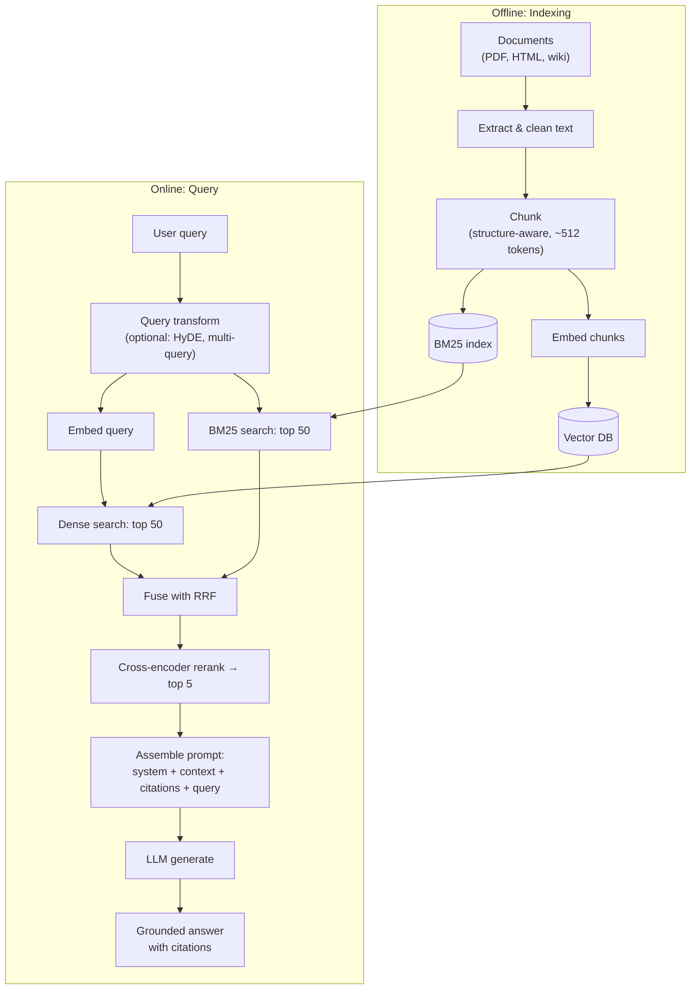
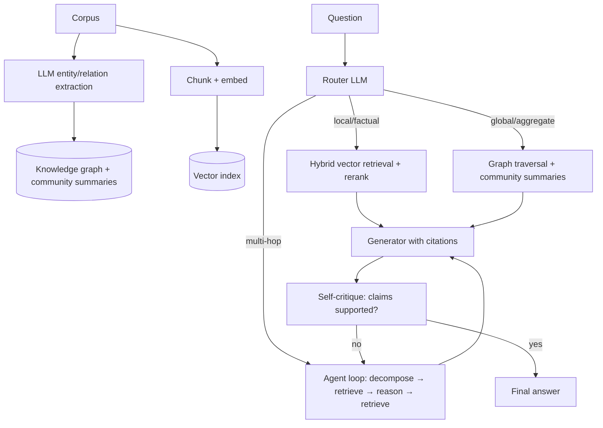

# 3.9 — Retrieval-Augmented Generation (RAG)

## 1. Overview

**What is it?** Retrieval-Augmented Generation (RAG) is an architecture that combines an information-retrieval system with a large language model (LLM). Instead of asking the model to answer from its frozen parametric memory, we first *retrieve* the most relevant documents for the user's query from an external corpus, then *inject* them into the prompt, and finally let the model *generate* an answer grounded in that retrieved evidence.

**Why does it exist?** An LLM's knowledge is baked in at pretraining time (see [GPT & Pretraining](05-gpt-pretraining.md)). It cannot know your company's internal wiki, yesterday's news, or a contract signed last week. Worse, when the model doesn't know something, it often *hallucinates* — it produces fluent, confident, wrong text. RAG exists to close both gaps: freshness and grounding.

**What problem does it solve?** RAG gives LLMs current, factual, source-attributable answers over any private or specialized corpus — without retraining the model. Updating knowledge becomes a data-engineering problem (re-index the documents) instead of an ML-training problem (fine-tune or re-pretrain).

**Where is it used?** Enterprise search and "chat with your docs" products, customer-support assistants, legal and medical question answering, coding assistants that pull repository context, and consumer search products like Perplexity. RAG is arguably the single most deployed LLM architecture in industry today.

## 2. Learning Objectives

After this chapter you will be able to:

- Explain the end-to-end RAG pipeline: ingest → chunk → embed → index → retrieve → rerank → generate.
- Choose and justify a chunking strategy (fixed, recursive, semantic, structural) for a given corpus.
- Contrast dense (bi-encoder), sparse (BM25/SPLADE), and hybrid retrieval, and combine them with Reciprocal Rank Fusion (RRF).
- Derive and compute cosine similarity, BM25, and RRF scores by hand on a toy example.
- Explain why cross-encoder rerankers beat bi-encoders on precision and where they fit in the pipeline.
- Apply query transformations — HyDE, multi-query expansion, and query decomposition — and explain when each helps.
- Describe advanced RAG patterns: parent-document retrieval, contextual compression, Self-RAG, Graph RAG, and agentic RAG.
- Implement a minimal but complete RAG system from scratch in NumPy plus an embedding model.
- Build a production-style pipeline with a vector database, hybrid retrieval, and a reranker.
- Evaluate retrieval (Recall@k, MRR, nDCG) separately from generation (faithfulness, answer relevance) using `ragas`.
- Diagnose the most common RAG failure modes (bad chunking, missing reranker, prompt injection via retrieved content).
- Decide between RAG, fine-tuning, and long-context stuffing for a given business problem.

## 3. Prerequisites

| Chapter | Why you need it |
|---|---|
| [k-Nearest Neighbors](../phase-1-classical-ml/06-knn.md) | Retrieval is literally k-NN search in embedding space. |
| [Attention & Self-Attention](../phase-2-deep-learning/09-attention.md) | Cross-encoder rerankers score query–document pairs with full attention. |
| [The Transformer](../phase-2-deep-learning/10-transformer.md) | Both the embedding model and the generator are Transformers. |
| [Tokenization](01-tokenization.md) | Chunk sizes and context budgets are measured in tokens, not characters. |
| [Word Embeddings](02-word-embeddings.md) | Dense retrieval generalizes word vectors to sentence/passage vectors. |
| [BERT & Encoders](04-bert.md) | Most embedding models and rerankers are BERT-style encoders. |
| [GPT & Pretraining](05-gpt-pretraining.md) | Explains why LLM knowledge is frozen and where hallucinations come from. |
| [Prompt Engineering](08-prompt-engineering.md) | The final generation step is prompt construction with retrieved context. |

The next chapter, [Vector Databases & ANN](10-vector-databases.md), covers the index data structures that make retrieval fast at scale; this chapter treats the index as a black box.

## 4. Intuition

**Analogy: the open-book exam.** A closed-book exam tests what you memorized months ago; you might misremember and confidently write something wrong. An open-book exam lets you look up the exact page before answering. RAG turns every LLM query into an open-book exam: the "book" is your corpus, the "looking up" is retrieval, and the "answer in your own words, citing the page" is generation.

**Everyday story.** Imagine a new employee, Dana, on her first day at a support desk. She's smart and articulate (that's the pretrained LLM) but knows nothing about the company's refund policy. A naive approach is to send her to a six-month training program (fine-tuning) — expensive, slow, and it must be repeated every time the policy changes. The practical approach: give her a well-organized policy binder and teach her to look up the relevant page before answering each ticket. Dana + binder + lookup skill = RAG. When the policy changes, you swap a page in the binder — no retraining needed.

The three design questions that dominate everything else:

1. **How do you split the binder into pages?** (chunking)
2. **How do you find the right page fast?** (retrieval: dense, sparse, hybrid, reranking)
3. **How do you make Dana actually use the page instead of her stale memory?** (prompting, grounding, evaluation)

## 5. Real-world Motivation

- **Microsoft** built Copilot for Microsoft 365 around retrieval over your emails, documents, and meetings (the Microsoft Graph) — the LLM never saw your data at training time, so retrieval is the only way to answer "what did Priya say about Q3 targets?".
- **Perplexity** made retrieval the product: every answer is generated from freshly retrieved web results with inline citations.
- **OpenAI** ships retrieval as a first-class feature (file search in the Assistants/Responses APIs) because "chat over your documents" is the most requested enterprise capability.
- **Meta AI (FAIR)** introduced the term in the 2020 paper *"Retrieval-Augmented Generation for Knowledge-Intensive NLP Tasks"* (Lewis et al.), showing retrieval-augmented models beat parametric-only models on open-domain QA.
- **GitHub Copilot** and **Cursor** retrieve relevant code from your repository to condition completions — code RAG.
- **Legal AI** products such as Harvey retrieve statutes, cases, and contracts, because a hallucinated citation in a legal brief is a fireable offense (and has literally happened in court).

The economics matter too: re-indexing a corpus costs cents; fine-tuning a frontier model costs thousands of dollars and days, and still can't guarantee the model recalls a specific clause verbatim.

## 6. Mathematical Foundations

### 6.1 Dense retrieval: cosine similarity

An embedding model $E$ maps text to a vector in $\mathbb{R}^d$ (typically $d \in [384, 3072]$). Given query $q$ and document chunk $c$, the relevance score is the cosine similarity:

$$\text{sim}(q, c) = \frac{E(q) \cdot E(c)}{\lVert E(q) \rVert \, \lVert E(c) \rVert}$$

where $E(q) \cdot E(c) = \sum_{j=1}^{d} E(q)_j \, E(c)_j$ is the dot product and $\lVert v \rVert = \sqrt{\sum_j v_j^2}$ is the Euclidean (L2) norm. If we pre-normalize all embeddings to unit length ($\lVert v \rVert = 1$), cosine similarity reduces to a plain dot product — this is why every serious pipeline normalizes at embed time.

Embedding models are trained with a **contrastive objective** (InfoNCE). For a query $q$ with one positive passage $c^+$ and a set of negatives $\{c^-_1, \dots, c^-_n\}$:

$$\mathcal{L} = -\log \frac{\exp(\text{sim}(q, c^+)/\tau)}{\exp(\text{sim}(q, c^+)/\tau) + \sum_{i=1}^{n} \exp(\text{sim}(q, c^-_i)/\tau)}$$

Here $\tau > 0$ is a temperature hyperparameter that sharpens the softmax. Minimizing $\mathcal{L}$ pulls the query toward its positive and pushes it away from negatives — exactly the geometry retrieval needs.

### 6.2 Sparse retrieval: BM25

BM25 is the classic lexical (keyword) scoring function. For query $q$ containing terms $t$ and document $D$:

$$\text{BM25}(q, D) = \sum_{t \in q} \text{IDF}(t) \cdot \frac{f(t, D)\,(k_1 + 1)}{f(t, D) + k_1 \left(1 - b + b \cdot \frac{|D|}{\text{avgdl}}\right)}$$

Symbols: $f(t, D)$ is the count of term $t$ in $D$; $|D|$ is the document length in tokens; $\text{avgdl}$ is the mean document length in the corpus; $k_1 \approx 1.2$ controls term-frequency saturation (a word appearing 50 times is not 50× more relevant than once); $b \approx 0.75$ controls length normalization. The inverse document frequency is

$$\text{IDF}(t) = \ln\!\left(\frac{N - n_t + 0.5}{n_t + 0.5} + 1\right)$$

where $N$ is the total number of documents and $n_t$ the number of documents containing $t$ — rare terms score higher. BM25 is unbeatable at exact matches (product codes, error strings, names) where dense embeddings blur details.

### 6.3 Hybrid fusion: Reciprocal Rank Fusion (RRF)

Dense and sparse retrievers return *rankings*, not comparable scores. RRF fuses them using only ranks. For document $d$ appearing at rank $r_i(d)$ in retriever $i$'s list:

$$\text{RRF}(d) = \sum_{i} \frac{1}{k + r_i(d)}$$

where $k$ is a smoothing constant (the standard value is $k = 60$, from the original Cormack et al. paper) and ranks start at 1. Intuition: rank 1 contributes $\frac{1}{61} \approx 0.0164$, rank 10 contributes $\frac{1}{70} \approx 0.0143$ — top ranks matter but no single retriever dominates. RRF requires zero score calibration, which is why it's the default in Elasticsearch, Qdrant, and most production stacks.

### 6.4 Reranking: cross-encoder score

A bi-encoder embeds $q$ and $c$ *independently*, so interaction between query words and document words is limited to one dot product. A **cross-encoder** concatenates them and runs full self-attention:

$$s(q, c) = f_\theta(\texttt{[CLS]}\; q \;\texttt{[SEP]}\; c)$$

where $f_\theta$ is a BERT-style encoder with a scalar regression/classification head on the `[CLS]` token. Every query token attends to every document token, giving far better precision — at the cost of one full forward pass *per candidate pair*, which is why cross-encoders rerank only the top 50–100 candidates rather than searching millions.

### 6.5 Retrieval evaluation metrics

Given a labeled set where each query has known relevant chunks:

- **Recall@k**: fraction of queries whose relevant chunk appears in the top $k$: $\text{Recall@}k = \frac{|\text{relevant} \cap \text{top-}k|}{|\text{relevant}|}$.
- **MRR (Mean Reciprocal Rank)**: $\text{MRR} = \frac{1}{|Q|}\sum_{q \in Q} \frac{1}{\text{rank}_q}$ where $\text{rank}_q$ is the position of the first relevant result. Rewards putting the answer at the very top.
- **nDCG@k** (normalized Discounted Cumulative Gain): $\text{DCG@}k = \sum_{i=1}^{k} \frac{2^{rel_i} - 1}{\log_2(i+1)}$, normalized by the ideal DCG. Handles graded relevance ($rel_i \in \{0,1,2,\dots\}$) and discounts lower positions logarithmically.

### 6.6 Generation evaluation (ragas-style)

- **Faithfulness**: fraction of claims in the answer that are supported by the retrieved context. Computed by decomposing the answer into atomic claims (via an LLM) and verifying each against the context: $\text{faithfulness} = \frac{\#\text{supported claims}}{\#\text{total claims}}$.
- **Answer relevance**: does the answer address the question? Estimated by generating questions from the answer and measuring their embedding similarity to the original query.
- **Context precision / recall**: is the retrieved context relevant (precision), and does it contain everything needed (recall)?

## 7. Visual Explanation

The full production pipeline, with the offline indexing path on top and the online query path below:



And the anatomy of the final prompt as ASCII art:

```
+--------------------------------------------------+
| SYSTEM: Answer ONLY from the context below.      |
|         Cite sources as [1], [2]. If the answer  |
|         is not in the context, say "I don't      |
|         know."                                   |
+--------------------------------------------------+
| CONTEXT:                                         |
|  [1] (refund-policy.md#enterprise) "Enterprise   |
|      customers may request refunds within 60..." |
|  [2] (refund-policy.md#process) "All refund      |
|      requests are processed within 5 business..."|
+--------------------------------------------------+
| USER: What is our refund policy for enterprise   |
|       customers?                                 |
+--------------------------------------------------+
```

## 8. Algorithm

A production-grade RAG pipeline, step by step:

1. **Ingest**: pull documents from sources (drive, wiki, DB); extract text, tables, and image captions; normalize encodings; deduplicate.
2. **Chunk**: split with structure awareness — respect headings, paragraphs, code blocks, and tables; typical target 256–512 tokens with 10–15 % overlap; attach metadata (source URI, section title, timestamp, access-control tags).
3. **Embed & index**: encode every chunk with a strong embedding model (normalize!); upsert into a vector DB; optionally build a BM25 index over the same chunks.
4. **Query transform (optional)**: rewrite the user query (HyDE, multi-query, decomposition) to improve recall.
5. **Retrieve**: dense top-$K$ and sparse top-$K$ (e.g., $K = 50$ each), with metadata filters (tenant, date, permissions) applied *inside* the search.
6. **Fuse**: combine the two ranked lists with RRF.
7. **Rerank**: score the fused top ~50 candidates with a cross-encoder; keep top $k$ (5–8).
8. **Assemble prompt**: system instruction demanding grounding + numbered context chunks with source metadata + the user question.
9. **Generate**: call the LLM; stream the answer.
10. **Post-process**: verify citations point at real chunks; enforce output format; refuse if no supporting context was found.
11. **Log & evaluate**: store query, retrieved IDs, scores, answer; run offline evals (Recall@k, faithfulness) on every pipeline change.

Pseudocode:

```text
# --- offline ---
for doc in corpus:
    for chunk in structure_aware_chunks(doc, size=512, overlap=64):
        vec = normalize(embed(chunk.text))
        vector_db.upsert(id=chunk.id, vector=vec, payload=chunk.metadata)
        bm25_index.add(chunk.id, chunk.text)

# --- online ---
def answer(query, filters):
    dense  = vector_db.search(normalize(embed(query)), top=50, filter=filters)
    sparse = bm25_index.search(query, top=50, filter=filters)
    fused  = rrf_fuse([dense, sparse], k=60)            # ranks -> scores
    top    = cross_encoder.rerank(query, fused[:50])[:5]
    prompt = build_prompt(system_rules, top, query)      # numbered citations
    out    = llm.generate(prompt)
    assert citations_valid(out, top)                     # post-check
    log(query, top, out)
    return out
```

## 9. Worked Example

### Tiny example by hand

Corpus of three chunks; we use 2-dimensional embeddings so we can compute everything on paper. Suppose the (already normalized) embeddings are:

| Chunk | Text (abridged) | Embedding |
|---|---|---|
| $c_1$ | "Enterprise refunds allowed within 60 days" | $(0.9,\ 0.44)$ |
| $c_2$ | "Office holiday schedule for 2026" | $(0.1,\ 0.99)$ |
| $c_3$ | "Refund requests processed in 5 business days" | $(0.8,\ 0.6)$ |

Query $q$ = "enterprise refund policy", embedding $(0.95,\ 0.31)$.

**Dense scores** (dot products, since everything is normalized):

- $\text{sim}(q, c_1) = 0.95 \cdot 0.9 + 0.31 \cdot 0.44 = 0.855 + 0.136 = 0.991$
- $\text{sim}(q, c_2) = 0.95 \cdot 0.1 + 0.31 \cdot 0.99 = 0.095 + 0.307 = 0.402$
- $\text{sim}(q, c_3) = 0.95 \cdot 0.8 + 0.31 \cdot 0.6 = 0.760 + 0.186 = 0.946$

Dense ranking: $c_1 (1), c_3 (2), c_2 (3)$.

**BM25** (say the term "refund" appears in $c_1$ and $c_3$; "enterprise" only in $c_1$): BM25 ranking $c_1 (1), c_3 (2), c_2 (3)$ — but imagine BM25 instead ranked $c_3$ first because "refund requests" matches twice: $c_3 (1), c_1 (2), c_2 (3)$.

**RRF fusion** with $k = 60$:

- $\text{RRF}(c_1) = \frac{1}{60+1} + \frac{1}{60+2} = 0.01639 + 0.01613 = 0.03252$
- $\text{RRF}(c_3) = \frac{1}{60+2} + \frac{1}{60+1} = 0.01613 + 0.01639 = 0.03252$
- $\text{RRF}(c_2) = \frac{1}{60+3} + \frac{1}{60+3} = 0.01587 + 0.01587 = 0.03174$

$c_1$ and $c_3$ tie at the top (both are genuinely relevant); $c_2$ is last. A cross-encoder reranker would then break the tie using full attention over the query–chunk pair — for "enterprise refund policy", $c_1$ mentions "enterprise" explicitly and wins.

**Final prompt** contains $c_1$ then $c_3$ as context [1] and [2]; the LLM answers: *"Enterprise customers may request refunds within 60 days [1]; requests are processed within 5 business days [2]."*

### Realistic scale

A real deployment over a 10,000-page policy wiki: ~40,000 chunks of 400 tokens, embedded at $d = 1024$ (≈ 160 MB of float32 vectors), indexed in Qdrant with HNSW. Hybrid retrieval pulls 50+50 candidates in ~15 ms, a `bge-reranker-base` cross-encoder reranks 50 pairs in ~80 ms on GPU, and the LLM call dominates at 1–3 s. Retrieval quality on a 300-question gold set: Recall@5 ≈ 0.92 hybrid+rerank vs 0.78 dense-only — the reranker is usually the single highest-ROI component.

## 10. Python from Scratch

A complete, dependency-light RAG core: chunking, embedding (we call a `SentenceTransformer` only to get vectors — the retrieval logic itself is pure NumPy), hybrid retrieval with RRF, and prompt assembly.

```python
import numpy as np
import re
from collections import Counter
from sentence_transformers import SentenceTransformer  # only to obtain embeddings


def chunk_text(text: str, size: int = 80, overlap: int = 20) -> list[str]:
    """Split text into word-based chunks with overlap.

    Words as a proxy for tokens keeps the example simple; production
    code should count real tokens (see chapter 3.1 Tokenization).
    """
    words = text.split()
    chunks, start = [], 0
    while start < len(words):
        chunks.append(" ".join(words[start:start + size]))
        start += size - overlap            # slide window; overlap keeps context at boundaries
    return chunks


class BM25:
    """Minimal BM25 over whitespace-tokenized chunks."""
    def __init__(self, docs: list[str], k1: float = 1.2, b: float = 0.75):
        self.k1, self.b = k1, b
        self.docs = [re.findall(r"\w+", d.lower()) for d in docs]
        self.N = len(self.docs)
        self.avgdl = np.mean([len(d) for d in self.docs])
        self.df = Counter()                          # document frequency per term
        for d in self.docs:
            self.df.update(set(d))

    def score(self, query: str, i: int) -> float:
        doc, s = self.docs[i], 0.0
        tf = Counter(doc)
        for t in re.findall(r"\w+", query.lower()):
            if t not in tf:
                continue
            idf = np.log((self.N - self.df[t] + 0.5) / (self.df[t] + 0.5) + 1)
            denom = tf[t] + self.k1 * (1 - self.b + self.b * len(doc) / self.avgdl)
            s += idf * tf[t] * (self.k1 + 1) / denom
        return s

    def search(self, query: str, k: int) -> list[int]:
        scores = np.array([self.score(query, i) for i in range(self.N)])
        return list(np.argsort(-scores)[:k])         # indices, best first


class MiniRAG:
    def __init__(self, encoder: str = "all-MiniLM-L6-v2"):
        self.enc = SentenceTransformer(encoder)
        self.chunks: list[str] = []
        self.emb: np.ndarray | None = None            # shape (N, 384) for MiniLM
        self.bm25: BM25 | None = None

    def add_documents(self, texts: list[str]) -> None:
        for t in texts:
            self.chunks.extend(chunk_text(t))
        # normalize_embeddings=True -> cosine == dot product later
        self.emb = self.enc.encode(self.chunks, normalize_embeddings=True)
        self.bm25 = BM25(self.chunks)

    def retrieve(self, query: str, k: int = 4, fetch: int = 20) -> list[str]:
        qv = self.enc.encode([query], normalize_embeddings=True)[0]  # (384,)
        sims = self.emb @ qv                                          # (N,) dot products
        dense_rank = list(np.argsort(-sims)[:fetch])
        sparse_rank = self.bm25.search(query, fetch)
        # Reciprocal Rank Fusion, k=60 (Cormack et al. default)
        rrf = Counter()
        for rank_list in (dense_rank, sparse_rank):
            for r, idx in enumerate(rank_list, start=1):
                rrf[idx] += 1.0 / (60 + r)
        top = [idx for idx, _ in rrf.most_common(k)]
        return [self.chunks[i] for i in top]

    def build_prompt(self, query: str, contexts: list[str]) -> str:
        ctx = "\n".join(f"[{i+1}] {c}" for i, c in enumerate(contexts))
        return (
            "Answer ONLY from the context. Cite sources as [n]. "
            "If the answer is not in the context, say you don't know.\n\n"
            f"CONTEXT:\n{ctx}\n\nQUESTION: {query}\nANSWER:"
        )
```

Expected behavior: `retrieve("enterprise refund policy")` returns the refund chunks first; the assembled prompt is ready to send to any LLM. Complexity of `retrieve` is $O(N \cdot d)$ for the dense pass (brute force — fine below ~100k chunks) plus $O(N \cdot |q|)$ for BM25.

> [!WARNING]
> **Common bug:** forgetting `normalize_embeddings=True` (or normalizing documents but not the query). Dot products then mix magnitude with direction, silently degrading ranking quality — the code runs fine and returns *plausible but worse* results, which makes this bug painful to detect. Always normalize both sides, or use explicit cosine similarity.

## 11. Library Implementation

Production stack: Qdrant (vector DB) + `sentence-transformers` (embeddings + reranker) + any chat LLM. Every block explained.

```python
from qdrant_client import QdrantClient, models
from sentence_transformers import SentenceTransformer, CrossEncoder

# 1) Components ---------------------------------------------------------
embedder = SentenceTransformer("BAAI/bge-small-en-v1.5")     # 384-dim bi-encoder
reranker = CrossEncoder("BAAI/bge-reranker-base")            # cross-encoder, scalar score
client = QdrantClient(":memory:")                            # swap for a real server URL

# 2) Create a collection (cosine distance; vectors must be normalized) --
client.create_collection(
    collection_name="docs",
    vectors_config=models.VectorParams(size=384, distance=models.Distance.COSINE),
)

# 3) Index chunks with metadata payloads --------------------------------
chunks = [...]                                    # list of {"text": ..., "source": ..., "section": ...}
vectors = embedder.encode([c["text"] for c in chunks], normalize_embeddings=True)
client.upsert(
    collection_name="docs",
    points=[
        models.PointStruct(id=i, vector=vectors[i].tolist(), payload=chunks[i])
        for i in range(len(chunks))
    ],
)

# 4) Query: dense search with a metadata filter, then rerank ------------
def answer(query: str, llm, source_filter: str | None = None, k: int = 5):
    qv = embedder.encode([query], normalize_embeddings=True)[0]
    flt = (
        models.Filter(must=[models.FieldCondition(
            key="source", match=models.MatchValue(value=source_filter))])
        if source_filter else None
    )
    hits = client.query_points("docs", query=qv, limit=50, query_filter=flt).points

    # Cross-encoder scores each (query, chunk) pair jointly — O(candidates) forward passes
    pairs = [(query, h.payload["text"]) for h in hits]
    scores = reranker.predict(pairs)                          # shape (50,)
    top = [h for _, h in sorted(zip(scores, hits), key=lambda t: -t[0])][:k]

    context = "\n".join(f"[{i+1}] ({h.payload['source']}) {h.payload['text']}"
                        for i, h in enumerate(top))
    prompt = (f"Answer only from the context; cite [n].\n\n"
              f"CONTEXT:\n{context}\n\nQUESTION: {query}")
    return llm.generate(prompt)
```

For rapid prototyping, LlamaIndex compresses all of this to five lines (`VectorStoreIndex.from_documents(...)` → `as_query_engine(similarity_top_k=5)`), and LangChain offers the same via `RetrievalQA` — but you should understand the explicit version above before trusting a framework's defaults (default chunk sizes and missing rerankers are the top two causes of "RAG doesn't work").

Evaluation with `ragas`:

```python
from ragas import evaluate
from ragas.metrics import faithfulness, answer_relevancy, context_precision, context_recall
from datasets import Dataset

ds = Dataset.from_dict({
    "question": questions,          # list[str]
    "answer": answers,              # model outputs
    "contexts": contexts,           # list[list[str]] retrieved chunks per question
    "ground_truth": ground_truths,  # gold answers (needed for context_recall)
})
report = evaluate(ds, metrics=[faithfulness, answer_relevancy,
                               context_precision, context_recall])
print(report)   # e.g. {'faithfulness': 0.91, 'answer_relevancy': 0.88, ...}
```

## 12. Code Walkthrough

Tracing one query, "What is our refund policy for enterprise customers?", through the library implementation:

| Tensor / value | Shape | Meaning |
|---|---|---|
| `qv` | `(384,)` | Unit-normalized query embedding from `bge-small` |
| `vectors` (index time) | `(N, 384)` | Unit-normalized chunk embeddings, N chunks |
| `hits` | list of 50 | Dense top-50 candidates with cosine scores and payloads |
| `pairs` | list of 50 tuples | (query, chunk-text) pairs fed to the cross-encoder |
| `scores` | `(50,)` | Cross-encoder relevance logits (unbounded floats; only order matters) |
| `top` | list of 5 | Reranked top-5 chunks that enter the prompt |
| `context` string | ~2,000 tokens | Numbered, source-attributed evidence block |
| LLM output | ~150 tokens | Answer with `[1]`, `[2]` citations |

Expected intermediate values: dense cosine scores for on-topic chunks land around 0.75–0.90 with `bge-small`; off-topic chunks around 0.3–0.5 (embedding similarity scores are model-specific — never hard-code a "relevance threshold" from one model onto another). Cross-encoder scores separate much more sharply, often > 5 logits between a true match and a near-miss, which is exactly why the reranker improves precision.

Inputs: user query string plus optional metadata filter. Output: grounded answer string plus (in production) the list of chunk IDs used, logged for evaluation and citation verification.

## 13. Complexity Analysis

Let $N$ = number of chunks, $d$ = embedding dimension, $K$ = candidates retrieved, $k$ = final context chunks, $L$ = LLM context length.

- **Indexing (offline)**: $O(N)$ embedding forward passes (each $O(T^2 d)$ in the chunk length $T$, per Transformer attention); ANN index build is $O(N \log N)$ for HNSW (details in [Vector Databases](10-vector-databases.md)). Space: $O(N d)$ floats — 4 GB per million chunks at $d = 1024$ in float32.
- **Dense retrieval (online)**: brute force $O(N d)$; with an ANN index, empirically $O(\log N)$ — millisecond-scale even at $N = 10^8$.
- **BM25**: $O(\sum_{t \in q} n_t)$ via inverted lists — sub-millisecond in practice.
- **RRF fusion**: $O(K)$ — trivial.
- **Reranking**: $O(K)$ cross-encoder forward passes, each $O((|q| + |c|)^2 d)$ — this is the throughput bottleneck of the retrieval stage; batch it on GPU.
- **Generation**: $O(L^2)$ attention over the prompt plus $O(L)$ per generated token — the LLM call dominates end-to-end latency (typically > 80 % of it), which is why teams obsess over keeping $k$ small and chunks tight.

## 14. Advantages

- **Grounded answers with citations.** A support bot can quote the exact policy paragraph; users (and auditors) can verify. Perplexity's entire UX is built on this.
- **Instant knowledge updates.** Re-index a changed document in seconds; no retraining. A pricing change goes live in the assistant the moment the page is re-embedded.
- **Private data without training exposure.** Your contracts never enter anyone's training set; they are only read at inference time, with per-user access-control filters enforced at retrieval.
- **Cheaper than fine-tuning for knowledge.** Embedding 1M chunks costs a few dollars; fine-tuning cannot reliably memorize a specific clause anyway.
- **Smaller models become viable.** A 8B model + great retrieval often beats a 70B model without it on domain QA, cutting serving cost dramatically.
- **Debuggability.** When the answer is wrong, you can inspect exactly which chunks were retrieved — a luxury pure LLMs never offer.

## 15. Disadvantages

- **Retrieval failures cascade.** If the right chunk isn't retrieved, the best LLM on Earth cannot answer correctly — and may hallucinate confidently instead. Garbage in, fluent garbage out.
- **Pipeline complexity.** Chunker, embedder, index, fusion, reranker, prompt, evals — many components, each with hyperparameters, each a possible silent failure point.
- **Latency overhead.** Retrieval + reranking adds 50–300 ms before the LLM even starts; unacceptable for some real-time uses.
- **Context bloat and "lost in the middle".** Stuffing 20 chunks degrades quality: LLMs attend best to the beginning and end of context (Liu et al., 2023).
- **Multi-hop questions break naive RAG.** "Which customers affected by the March outage also have SLA credits?" requires combining evidence no single chunk contains.
- **Security surface.** Retrieved content is untrusted input; a document containing "ignore previous instructions…" is a prompt-injection vector.
- **When NOT to use RAG:** pure style/opinion tasks with no factual corpus, simple keyword lookup a SQL query solves, or hard sub-100 ms latency budgets.

## 16. Common Mistakes

- **Fixed-size chunking that shreds structure.** A 512-token window slices tables in half and splits a heading from its body. Fix: recursive/structural chunking that respects headings, paragraphs, and code blocks.
- **No reranker.** Dense top-k has good recall but noisy precision; the LLM gets distracted by near-miss chunks. Fix: always rerank top-50 → top-5; it's the cheapest big win.
- **Mismatched or un-normalized embeddings.** Query embedded with model A, corpus with model B (e.g., after an upgrade) — similarities are meaningless. Fix: version your embedding model in the index metadata and re-embed on upgrade.
- **Ignoring the model's query prefix conventions.** Models like `e5` require `"query: ..."` / `"passage: ..."` prefixes; omitting them costs several recall points silently.
- **Evaluating only end-to-end.** If the final answer is wrong you can't tell whether retrieval or generation failed. Fix: measure Recall@k on a gold set separately from faithfulness.
- **Trusting retrieved content.** Indexing user-uploaded or web documents without sanitization invites prompt injection. Fix: treat context as data, delimit it clearly, instruct the model to never follow instructions found in context, and filter suspicious content.
- **No "I don't know" path.** Without an abstention instruction and a minimum-relevance check, the model answers from parametric memory when retrieval comes back empty — the exact hallucination RAG was meant to prevent.

## 17. Best Practices

Production checklist:

- [ ] **Chunking**: structure-aware, 256–512 tokens, 10–15 % overlap; prepend section titles/breadcrumbs to each chunk ("contextual chunk headers").
- [ ] **Metadata**: source URI, section, timestamp, language, tenant/ACL tags on every chunk; enforce permissions *in the retrieval filter*, never in the prompt.
- [ ] **Hybrid retrieval + RRF** as the default; dense-only is acceptable only after you've measured it's enough on your data.
- [ ] **Cross-encoder reranker** on top-50; budget its GPU cost.
- [ ] **Evaluate embedding models on your corpus** (MTEB rankings don't transfer perfectly); build a 100–300 question gold set before tuning anything.
- [ ] **Prompt contract**: answer only from context, cite sources, abstain when unsupported; post-verify citations programmatically.
- [ ] **Log everything** (query, retrieved IDs, scores, answer, latency) — it's your future eval set and your incident-debugging tool.
- [ ] **CI gate on evals**: block deploys that drop Recall@5 or faithfulness beyond a threshold (see [LLM Evaluation](12-llm-evaluation.md) and [LLMOps](../phase-5-mlops/07-llmops.md)).
- [ ] **Index lifecycle**: incremental upserts, deletion propagation (GDPR!), re-embedding plan for model upgrades.

> [!TIP]
> Spend your first optimization week on chunking and the reranker, not on swapping LLMs. Retrieval quality bounds everything downstream.

## 18. Optimization Techniques

- **Query transforms.** *HyDE*: ask the LLM to write a hypothetical answer document, embed *that* instead of the raw query — a hypothetical answer lives closer to real answer passages in embedding space than a short question does. *Multi-query*: generate 3–5 paraphrases, retrieve for each, RRF-fuse. *Decomposition*: split multi-hop questions into sub-questions retrieved independently.
- **Parent-document retrieval.** Index small chunks (precise matching) but return their larger parent section (rich context) to the LLM — best of both granularities.
- **Contextual compression.** After retrieval, use a cheap LLM or extractive filter to strip irrelevant sentences from each chunk before prompting — fights context bloat.
- **Sentence-window retrieval.** Index single sentences; at answer time expand to a ±2-sentence window.
- **MMR (Maximal Marginal Relevance)** for diversity: greedily pick chunks maximizing $\lambda \, \text{sim}(q, c) - (1-\lambda) \max_{c' \in S} \text{sim}(c, c')$ so five near-duplicate chunks don't crowd out a complementary one.
- **Caching**: cache query embeddings and full answers for repeated queries (support desks see heavy repetition); cache KV-prefixes of the static system prompt.
- **Quantization**: int8 or binary embeddings cut vector memory 4–32× with modest recall loss (details in [Vector Databases](10-vector-databases.md)).
- **Self-RAG / adaptive retrieval**: let the model decide *whether* retrieval is needed (skip it for "write a haiku") and critique whether retrieved chunks are actually useful.
- **Graph RAG**: build an entity–relation knowledge graph over the corpus; answer global/aggregate questions ("what themes recur across all incident reports?") by traversing communities — where vanilla chunk retrieval fails structurally.
- **Agentic RAG**: wrap retrieval in a loop — retrieve, reason, notice a gap, retrieve again — using the patterns from [LLM Agents](11-agents.md).

## 19. Industry Applications

- **Enterprise assistants**: Microsoft 365 Copilot, Glean, Slack AI, Notion AI — retrieval over corporate documents with per-user permissions.
- **Consumer search**: Perplexity and Google's AI Overviews generate answers from freshly retrieved web pages with citations.
- **Coding**: GitHub Copilot and Cursor retrieve relevant files, symbols, and docs from your repository to ground completions and chat.
- **Legal**: Harvey and Casetext retrieve statutes, precedents, and contract clauses — the citation requirement makes RAG mandatory, not optional.
- **Healthcare**: clinical documentation assistants retrieve guidelines and patient-record snippets under strict access control.
- **Customer support**: Intercom Fin and similar bots answer from help-center articles, with deflection rates directly tied to Recall@k.
- **E-commerce**: semantic product search and "ask about this product" features at Amazon and Shopify-ecosystem vendors.

## 20. Interview Questions

### Beginner

**Q1. What is RAG and what two problems does it solve?**
A. RAG retrieves relevant documents for a query and injects them into the LLM prompt before generation. It solves (1) stale/missing knowledge — the model can use data it never saw in training, including private corpora — and (2) hallucination — answers are grounded in retrieved evidence and can carry citations.

**Q2. Walk through the RAG pipeline end to end.**
A. Offline: ingest documents → chunk (structure-aware, ~256–512 tokens) → embed each chunk → store in a vector DB (plus optional BM25 index). Online: embed the query → retrieve top-K similar chunks (optionally hybrid + RRF) → rerank to top-k → assemble a prompt with the chunks as cited context → LLM generates a grounded answer → post-verify citations and log.

**Q3. Why do we chunk documents instead of embedding whole documents?**
A. Embedding models have input limits and long texts average many topics into one blurry vector, hurting retrieval precision. Small chunks give sharp, topic-specific vectors; overlap prevents losing information at boundaries. Also, the LLM context budget forces us to pass focused excerpts, not entire documents.

**Q4. What is cosine similarity and why normalize embeddings?**
A. Cosine similarity measures the angle between vectors: $\frac{u \cdot v}{\lVert u \rVert \lVert v \rVert}$. After normalizing all vectors to unit length it equals the plain dot product, which is faster and is what most vector DBs' "cosine" mode assumes — un-normalized vectors mix magnitude into the score and corrupt rankings.

**Q5. RAG vs fine-tuning — when do you use each?**
A. RAG for *knowledge*: facts that change, private data, anything needing citations or instant updates. Fine-tuning for *behavior*: style, format, domain vocabulary, task specialization. They compose — many production systems fine-tune a small model for format and use RAG for facts.

### Intermediate

**Q1. Dense vs sparse vs hybrid retrieval — trade-offs?**
A. Dense (bi-encoder) captures semantics and paraphrase ("cancel subscription" ≈ "stop billing") but blurs exact strings. Sparse (BM25) nails exact matches — IDs, error codes, names — but misses synonyms. Hybrid runs both and fuses with RRF, typically beating either alone; it's the production default because corpora always contain both semantic and lexical queries.

**Q2. Explain RRF and why it's preferred over weighted score combination.**
A. $\text{RRF}(d) = \sum_i \frac{1}{k + r_i(d)}$ sums reciprocal ranks (k≈60) across retrievers. It uses only *ranks*, so it needs no calibration between incomparable score scales (cosine ∈ [−1,1] vs unbounded BM25). Weighted score fusion requires per-corpus normalization and re-tuning whenever a component changes; RRF just works.

**Q3. Why does a cross-encoder reranker outperform the bi-encoder that did retrieval?**
A. A bi-encoder compresses query and document into vectors *independently*; their only interaction is a dot product. A cross-encoder feeds the concatenated pair through full self-attention, letting every query token attend to every document token — far more expressive relevance modeling. It's too slow to search millions of documents (one forward pass per pair) but perfect for scoring the top-50 candidates.

**Q4. What is HyDE and when does it help?**
A. HyDE (Hypothetical Document Embeddings) asks the LLM to draft a hypothetical *answer* to the query, then embeds that draft for retrieval instead of the query. It helps because short questions and long answer-passages live in different regions of embedding space — a fake answer is geometrically closer to real answers. Best for question-style queries over answer-style corpora; it adds an LLM call of latency and can hurt when the hypothetical is off-topic.

**Q5. How do you evaluate a RAG system properly?**
A. Separately per stage. Retrieval: build a gold set of (query → relevant chunk IDs), measure Recall@k, MRR, nDCG. Generation: faithfulness (claims supported by context), answer relevance, and context precision/recall — automatable with `ragas` using an LLM judge. Plus operational metrics: latency, cost, abstention rate. End-to-end-only evaluation can't tell you *which* component to fix.

**Q6. How do you defend a RAG system against prompt injection through retrieved documents?**
A. Treat retrieved text as untrusted data: clearly delimit context, instruct the model never to follow instructions inside it, sanitize/scan documents at ingestion, restrict what the generation step can do (no tool calls triggered by context), and post-verify outputs (citation checks, output filters). Defense in depth — no single measure suffices.

### Advanced

**Q1. Your Recall@50 is 0.95 but final answers are wrong 30 % of the time. Diagnose.**
A. Retrieval recall is fine, so the failure is downstream: (a) precision — the right chunk is in the 50 but the reranker or top-k cutoff drops it; check Recall@5 after reranking; (b) "lost in the middle" — relevant chunk present but ignored; try fewer, better chunks or reordering; (c) generation unfaithfulness — model overrides context with parametric beliefs; strengthen the grounding prompt, lower temperature, add citation verification; (d) chunking — the chunk contains the topic but not the complete answer; try parent-document retrieval.

**Q2. Design RAG for multi-hop questions like "Which of our customers affected by the March outage have SLA credits?"**
A. Naive single-shot retrieval fails because no chunk contains both facts. Options: query decomposition (sub-question 1: customers affected by March outage; sub-question 2: SLA credit holders; intersect), agentic RAG (iterative retrieve-reason-retrieve loop), or Graph RAG (pre-extract entities/relations so the join is a graph traversal). Evaluate on multi-hop benchmarks like HotpotQA/MuSiQue; expect to pay extra LLM calls for the decomposition.

**Q3. How would you handle embedding-model upgrades in a live system with 500M chunks?**
A. Embeddings from different models are incompatible — you cannot mix them in one index. Plan: dual-write new content to both old and new indexes; backfill re-embedding in batches (rate-limited, cost-estimated); shadow-evaluate the new index on the gold set; cut over per-tenant behind a flag; keep the old index until rollback risk passes. Version the model name in index metadata to make mismatches impossible.

**Q4. When does Graph RAG structurally beat vector RAG, and what does it cost?**
A. For *global* or *aggregate* questions ("what are the recurring themes across all 500 incident reports?") where the answer isn't localized in any top-k chunks — vector retrieval can only surface a few chunks, but a graph with community summaries can synthesize corpus-wide structure. Costs: an expensive LLM-driven extraction pass over the whole corpus at index time, graph storage/maintenance, and harder incremental updates.

**Q5. Argue for and against replacing RAG with a 1M-token context window.**
A. For: no pipeline, no retrieval failures, the model sees everything. Against: (1) cost — attention over 1M tokens per query is orders of magnitude more expensive than retrieving 5 chunks; (2) latency scales with context; (3) recall degrades in ultra-long contexts ("needle in a haystack" holds for single facts but multi-fact reasoning degrades); (4) corpora are often billions of tokens — still far beyond any window; (5) no access control granularity. Practical synthesis: long context *reduces* how precise retrieval must be (retrieve 50 generous chunks instead of 5 perfect ones) but doesn't eliminate retrieval for real corpora.

## 21. Coding Exercises

### Easy

1. **Chunker comparison.** Implement fixed-size and paragraph-aware chunking over a Markdown file; print chunks that split a table or code block in half. *Hint: split on `\n\n` first, then merge paragraphs greedily up to the token budget.*
2. **Cosine retrieval.** Using `sentence-transformers`, embed 50 sentences and implement top-5 retrieval with pure NumPy. Verify results change (get worse) when you skip normalization. *Hint: compare `np.argsort` orderings with and without dividing by norms.*

### Medium

1. **Hybrid + RRF.** Add BM25 (e.g., `rank_bm25`) to your dense retriever and fuse with RRF ($k = 60$). Construct three queries where hybrid beats dense-only (hint: queries containing exact identifiers like error codes). *Hint: log per-retriever ranks to see who found what.*
2. **Reranker A/B.** Retrieve top-50 dense candidates, rerank with `BAAI/bge-reranker-base`, and measure Recall@5 before vs after on a 50-question gold set you write. *Hint: even 50 hand-labeled questions reveal a consistent gap.*
3. **HyDE.** Implement HyDE with any chat model and measure whether it improves MRR on your gold set. *Hint: embed the hypothetical answer only — not query + answer concatenated.*

### Hard

1. **ragas harness.** Build a full evaluation harness: generate a synthetic gold set from your corpus (LLM-generated Q→chunk pairs, human-spot-checked), run `ragas` faithfulness/relevance/context-precision, and produce a per-component report identifying whether retrieval or generation is the bottleneck. *Hint: hold out 20 % of chunks when generating questions to test abstention behavior.*
2. **Multi-hop RAG.** Implement query decomposition + iterative retrieval and benchmark against single-shot RAG on 30 HotpotQA questions. *Hint: cap the loop at 3 hops and RRF-fuse evidence across hops before the final generation.*

## 22. Mini Project

**Chat with your PDFs** — a local, end-to-end RAG app.

1. Set up a Python environment with `pypdf`, `sentence-transformers`, `qdrant-client` (in-memory mode), and `streamlit`.
2. Write an ingestion script: extract text per page with `pypdf`, chunk to ~400 tokens with 50-token overlap, attach `{filename, page}` metadata.
3. Embed chunks with `bge-small-en-v1.5` (normalized) and upsert into Qdrant.
4. Implement `retrieve(query, k=5)` and a grounding prompt with numbered citations `[filename p.X]`.
5. Wire a Streamlit chat UI: text box → retrieve → call an LLM API → render answer + expandable "sources" panel showing the exact chunks.
6. Add the abstention rule ("say you don't know if the context lacks the answer") and test it with a question your PDFs cannot answer.
7. Write 20 gold questions and report Recall@5 in the app's sidebar.

## 23. Medium Project

**Enterprise-grade documentation assistant** with hybrid retrieval, reranking, and CI evals.

1. Corpus: clone a real open-source project's docs (e.g., the Qdrant or FastAPI docs) and ingest Markdown with structure-aware chunking (respect headings; prepend breadcrumb titles to each chunk).
2. Stand up Qdrant via Docker; index dense vectors plus a BM25 index (Qdrant sparse vectors or a separate `rank_bm25` service).
3. Implement hybrid retrieval with RRF, then `bge-reranker-base` reranking (top-50 → top-5), with metadata filters by doc section.
4. Add multi-query expansion (3 LLM paraphrases, fused) behind a feature flag.
5. Build a 150-question gold set (mix lexical, semantic, and multi-hop questions); implement Recall@k/MRR computation.
6. Add `ragas` generation metrics; run the full suite in GitHub Actions on every PR and fail if Recall@5 drops > 3 points (pattern from [CI/CD for ML](../phase-5-mlops/04-cicd-ml.md)).
7. Serve behind FastAPI with request logging (query, retrieved IDs, latency percentiles); load-test to find your reranker's throughput ceiling.

## 24. Advanced Project

**Graph-RAG + agentic self-critique pipeline**, benchmarked on multi-hop QA.

Architecture:



Implementation phases:

1. **Baseline**: hybrid + rerank RAG (from the medium project) evaluated on 200 HotpotQA + 100 MuSiQue questions — record EM/F1, faithfulness, cost per question.
2. **Graph construction**: LLM-extract (entity, relation, entity) triples per chunk; build the graph in NetworkX or Neo4j; cluster with Leiden and generate community summaries (the Microsoft GraphRAG recipe).
3. **Router**: a small classifier prompt that routes each question to vector / graph / agentic paths; log routing decisions.
4. **Agentic loop**: decomposition, per-hop retrieval, evidence accumulation, max 3 hops; self-critique step verifies every claim against gathered evidence and triggers one retry on failure.
5. **Benchmark & ablate**: report each path's contribution; ablate the reranker, the router, and the critique step to quantify each.

Possible improvements: fine-tune the embedding model on synthetic (query, chunk) pairs from your corpus; distill the router into a cheap classifier; add answer caching; extend the critique into full Self-RAG-style retrieval-necessity prediction.

## 25. Summary

- RAG = retrieve relevant chunks → inject into prompt → generate grounded, citable answers; it fixes stale knowledge and reduces hallucination without retraining.
- Chunking is the foundation: structure-aware, 256–512 tokens, overlap, rich metadata — bad chunking caps everything downstream.
- Dense retrieval captures semantics; BM25 captures exact matches; hybrid + RRF ($\sum_i 1/(k + r_i)$) is the production default.
- Cross-encoder reranking of top-50 → top-5 is usually the single highest-ROI upgrade in the pipeline.
- Query transforms (HyDE, multi-query, decomposition) buy recall at the price of extra LLM calls.
- Advanced patterns — parent-document retrieval, contextual compression, Self-RAG, Graph RAG, agentic RAG — address specific failure modes, not everything at once.
- Evaluate retrieval (Recall@k, MRR, nDCG) *separately* from generation (faithfulness, answer relevance via `ragas`); end-to-end-only evals can't localize failures.
- Retrieved content is untrusted input — defend against prompt injection at ingestion, prompting, and output-verification layers.
- The LLM call dominates latency and cost; retrieval's job is to make a *small, precise* context so the expensive call is short and right.
- RAG for knowledge, fine-tuning for behavior, long context as a complement — not competitors.

## 26. Cheat Sheet

| Formula | Meaning |
|---|---|
| $\text{sim}(q,c) = \hat{E}(q) \cdot \hat{E}(c)$ | Cosine similarity (unit-normalized embeddings) |
| $\text{RRF}(d) = \sum_i \frac{1}{60 + r_i(d)}$ | Rank fusion across retrievers |
| $\text{BM25}: \sum_t \text{IDF}(t)\frac{f(k_1+1)}{f + k_1(1-b+b\frac{|D|}{avgdl})}$ | Lexical relevance; $k_1{=}1.2$, $b{=}0.75$ |
| $\text{MRR} = \frac{1}{|Q|}\sum \frac{1}{\text{rank}_q}$ | First-relevant-result quality |
| faithfulness $= \frac{\text{supported claims}}{\text{total claims}}$ | Generation groundedness |

Defaults that rarely hurt: chunk 256–512 tokens, 10–15 % overlap; retrieve top-50 hybrid; rerank to top-5; RRF $k = 60$; temperature ≤ 0.3 for grounded QA.

One-liners:

- Normalize embeddings, always; version your embedding model.
- Rerankers before bigger LLMs.
- Measure retrieval and generation separately.
- Prepend section breadcrumbs to chunks.
- Give the model permission to say "I don't know."

Gotchas: `e5`-style models need `query:`/`passage:` prefixes; similarity thresholds don't transfer between models; deleting a document must delete its chunks *and* its BM25 postings; "lost in the middle" — put the best chunk first or last.

## 27. Further Reading

**Research Papers**
- Lewis et al., 2020 — *Retrieval-Augmented Generation for Knowledge-Intensive NLP Tasks* (the original RAG paper).
- Karpukhin et al., 2020 — *Dense Passage Retrieval for Open-Domain Question Answering* (DPR).
- Gao et al., 2022 — *Precise Zero-Shot Dense Retrieval without Relevance Labels* (HyDE).
- Cormack, Clarke & Buettcher, 2009 — *Reciprocal Rank Fusion outperforms Condorcet and individual rank learning methods*.
- Liu et al., 2023 — *Lost in the Middle: How Language Models Use Long Contexts*.
- Asai et al., 2023 — *Self-RAG: Learning to Retrieve, Generate, and Critique through Self-Reflection*.
- Edge et al., 2024 — *From Local to Global: A Graph RAG Approach to Query-Focused Summarization* (Microsoft GraphRAG).
- Gao et al., 2023 — *Retrieval-Augmented Generation for Large Language Models: A Survey*.

**Documentation**
- ragas docs (docs.ragas.io); Qdrant docs; LlamaIndex "Building Performant RAG" guides; LangChain retrieval docs; Sentence-Transformers docs (sbert.net); MTEB leaderboard on Hugging Face.

**GitHub Repositories**
- `explodinggradients/ragas`, `run-llama/llama_index`, `langchain-ai/langchain`, `microsoft/graphrag`, `FlagOpen/FlagEmbedding` (bge models & rerankers), `beir-cellar/beir` (retrieval benchmark).

**Datasets / Benchmarks**
- Natural Questions, HotpotQA, MuSiQue (multi-hop), MS MARCO (retrieval), BEIR suite.

**Videos / Blogs**
- Stanford CS25 lectures on retrieval-augmented LMs; Jerry Liu (LlamaIndex) talks on production RAG; Anthropic's "Contextual Retrieval" blog post; Pinecone learning center RAG series.
