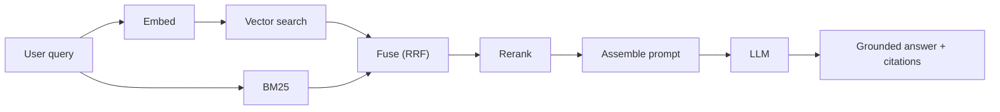

# 3.9 — Retrieval-Augmented Generation (RAG)

## 1. Intuition first
An LLM's knowledge is frozen at training time. RAG gives it a live library: retrieve the most relevant documents for a query, stuff them into the prompt, and let the model answer using them. This grounds outputs in real, verifiable sources.

## 2. Why the topic exists
- Hallucinations.
- Knowledge cutoff.
- Private / proprietary data unavailable in pretraining.
- Cheaper than repeated fine-tuning.

## 3. What problem it solves
Give LLMs current, factual, source-attributable answers over any private or specialized corpus.

## 4. Mathematics / Design

### 4.1 Basic architecture
Query → embed → nearest-neighbor search in vector DB → retrieve top-$k$ chunks → build prompt with context → LLM generates answer.

### 4.2 Chunking strategies
- Fixed size (e.g., 512 tokens with 50-token overlap).
- Recursive (by paragraph → sentence → char).
- Semantic (embed sentences, group by similarity).
- Structural (respect headings, code blocks, tables).

### 4.3 Retrieval
- Dense (bi-encoder embeddings): `bge`, `e5`, `nomic-embed`, `text-embedding-3-large`.
- Sparse: BM25 / SPLADE.
- Hybrid: reciprocal rank fusion (RRF) or weighted score.
- Rerank: cross-encoder like `bge-reranker` or Cohere Rerank.

### 4.4 Query transforms
HyDE (hypothetical doc), multi-query expansion, query decomposition (multi-hop).

### 4.5 Advanced RAG
- Parent-document retrieval (retrieve small chunks, return large parent context).
- Contextual compression.
- Self-RAG (model decides when to retrieve).
- Graph RAG (build a knowledge graph, traverse for context).
- Agentic RAG (loop: retrieve → reason → retrieve again).

### 4.6 Evaluation
- Retrieval: MRR, Recall@k, nDCG.
- Generation: faithfulness, answer relevance, groundedness, latency, cost. Tools: `ragas`, `trulens`.

## 5. Every "formula" explained
- Cosine similarity between query and doc embeddings ranks retrieval.
- RRF: $\sum_i \tfrac{1}{k + r_i(d)}$ combines rankings from multiple retrievers.

## 6. Variables
$k$ top-k; chunk size; overlap; retrieval score; rerank score.

## 7. Algorithm — a solid production RAG
1. Ingest & normalize documents; extract text, tables, images.
2. Chunk with structure awareness.
3. Embed chunks with a strong encoder; index in vector DB (Pinecone, Qdrant, Weaviate, Milvus, pgvector).
4. Optionally build BM25 index for sparse retrieval.
5. At query time: hybrid retrieve top-$K$ (e.g. 50).
6. Rerank with cross-encoder → top-$k$ (e.g. 5–8).
7. Assemble prompt with citations; call LLM.
8. Post-process: verify citations; enforce format.
9. Log everything; run offline evals.

## 8. Simple example
"What is our refund policy for enterprise customers?" → retrieve 3 relevant policy sections → answer with citations.

## 9. Real-world example
- ChatGPT with browsing / retrieval.
- Cursor / GitHub Copilot Workspace pulling code context.
- Legal AI (Harvey, CaseText) retrieving cases.
- Enterprise search over Google Drive / Confluence.

## 10. Diagram


## 11. Implementation from scratch — minimal RAG
```python
import numpy as np
from sentence_transformers import SentenceTransformer

class MiniRAG:
    def __init__(self, encoder="all-MiniLM-L6-v2"):
        self.enc = SentenceTransformer(encoder); self.docs = []; self.emb = None
    def add(self, texts):
        self.docs.extend(texts)
        new = self.enc.encode(texts, normalize_embeddings=True)
        self.emb = new if self.emb is None else np.vstack([self.emb, new])
    def retrieve(self, q, k=5):
        qv = self.enc.encode([q], normalize_embeddings=True)[0]
        sims = self.emb @ qv
        idx = np.argpartition(-sims, k)[:k]
        return [self.docs[i] for i in idx[np.argsort(-sims[idx])]]
```

## 12. Implementation using libraries
```python
# LangChain / LlamaIndex are heavier but production-friendly
from llama_index.core import VectorStoreIndex, SimpleDirectoryReader
docs = SimpleDirectoryReader("docs/").load_data()
index = VectorStoreIndex.from_documents(docs)
qe = index.as_query_engine(similarity_top_k=5)
print(qe.query("What is our refund policy?"))
```

Or a lower-level stack: `qdrant-client` + `openai` + `cohere-rerank`.

## 13. Time complexity
Retrieval sub-linear via ANN; LLM call is the dominant cost.

## 14. Space complexity
Vector DB stores O(N × d) floats + optional payload.

## 15. Advantages
Grounded, updatable, source-attributed, cheaper than continual pretraining.

## 16. Disadvantages
Retrieval failures cascade into wrong answers; long context bloat; complex pipeline.

## 17. Interview questions
1. Explain the RAG pipeline end-to-end.
2. Chunking strategies — trade-offs.
3. Dense vs sparse vs hybrid retrieval.
4. What is a cross-encoder reranker?
5. HyDE — what and why?
6. How to evaluate RAG?
7. Multi-hop RAG — approaches.
8. When does RAG fail?
9. Guardrails against prompt injection through retrieved content.
10. Fine-tune vs RAG — when to use each.

## 18. Common mistakes
- Chunking by fixed tokens ignoring structure (tables split).
- No reranker → recall @ high $k$ but noisy context.
- Injecting untrusted retrieved content without sanitization.
- Not measuring retrieval separately from generation.

## 19. Optimization techniques
Hybrid + rerank; parent-doc retrieval; contextual compression; caching; embedding model choice (evaluate on your data!); metadata filters; MMR for diversity.

## 20. Coding exercises
1. Build a naive RAG on Wikipedia dump; measure hallucinations.
2. Add BM25 hybrid retrieval.
3. Add a cross-encoder reranker.
4. Build a `ragas` evaluation harness.

## 21. Mini project
Chat with your PDFs — Streamlit app over a local corpus using pgvector.

## 22. Medium project
Enterprise-grade RAG over technical docs with hybrid retrieval, reranker, citations, and evals.

## 23. Advanced project
Graph-RAG + agentic self-critique pipeline; benchmark against baseline on multi-hop QA (HotpotQA / MuSiQue).

## 24. Where it is used in industry
Chatbots over docs; enterprise search; support assistants; legal / medical Q&A; code agents.

## 25. How companies use it
- Perplexity, Notion AI, Glean, Slack AI.
- Legal AI (Harvey).
- Every SaaS "chat with your data" feature.

## 26. When NOT to use it
- Simple keyword lookup without semantic need.
- When the model must express an opinion/style not grounded in corpus.
- Ultra-low-latency environments — retrieval adds latency.
