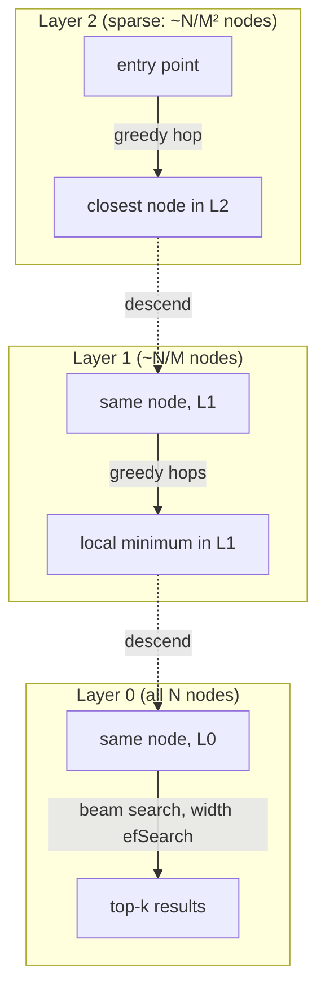
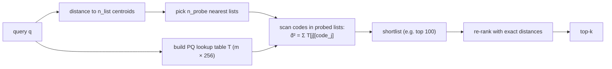
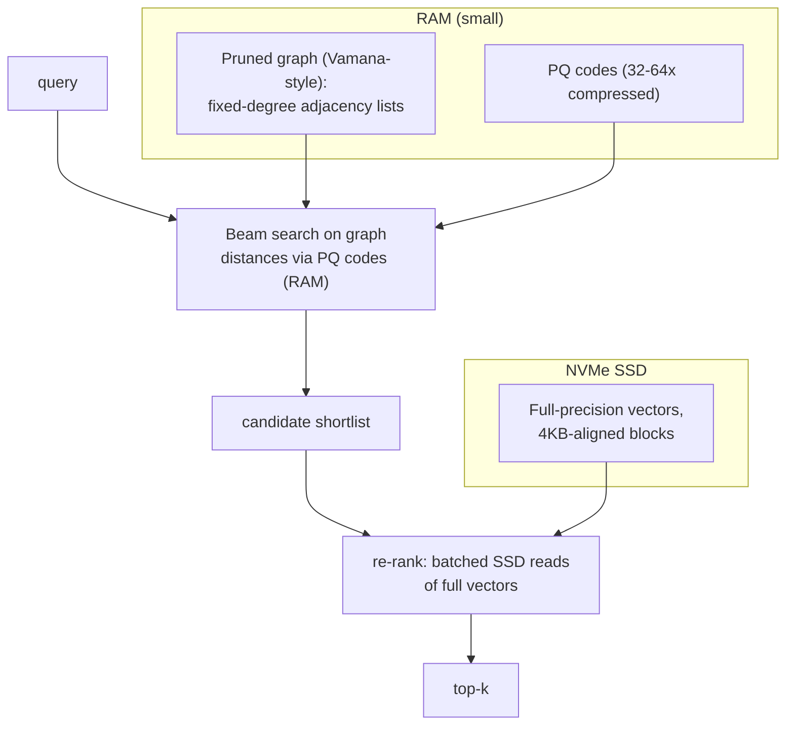

# 3.10 — Vector Databases & Approximate Nearest Neighbors

## 1. Overview

**What is it?** A vector database stores high-dimensional embedding vectors and answers one query extremely fast: *"which stored vectors are most similar to this query vector?"* Under the hood it relies on **Approximate Nearest Neighbor (ANN)** index structures — IVF, Product Quantization, HNSW, and friends — because exact search over millions of vectors is too slow for online serving.

**Why does it exist?** Modern ML represents everything — sentences, images, songs, users, products — as embeddings (see [Word Embeddings](02-word-embeddings.md)). Once your data is vectors, every interesting question becomes nearest-neighbor search: semantic search, RAG retrieval, recommendation, deduplication, anomaly detection. Exact k-NN (from [k-Nearest Neighbors](../phase-1-classical-ml/06-knn.md)) is $O(N \cdot d)$ per query; at $N = 10^9$ vectors that is seconds per query and terabytes of RAM. ANN indexes trade a tiny amount of *recall* for orders-of-magnitude speedups.

**What problem does it solve?** Sub-linear top-$k$ similarity search at scale, plus the database-ish features real systems need: metadata filtering, updates and deletes, persistence, replication, and multi-tenancy.

**Where is it used?** Every RAG system (the retrieval half of [RAG](09-rag.md)), image search at Pinterest, candidate generation in recommenders at Spotify and YouTube, near-duplicate detection, and fraud/similarity matching. Products in the space include FAISS (library), Qdrant, Milvus, Weaviate, Pinecone (databases), and pgvector (Postgres extension).

## 2. Learning Objectives

After this chapter you will be able to:

- State why exact k-NN fails at scale and define the recall/latency/memory trade-off triangle of ANN search.
- Choose the right similarity metric (cosine, dot product, L2) and explain when they are equivalent.
- Explain and implement IVF (inverted file) indexing with k-means coarse quantization and the `nprobe` knob.
- Derive Product Quantization: sub-vector splitting, codebooks, asymmetric distance computation, and memory savings math.
- Explain HNSW layer by layer: skip-list intuition, greedy graph search, and the roles of `M`, `efConstruction`, and `efSearch`.
- Compute by hand a tiny PQ encoding and an IVF probe on paper.
- Build, tune, and benchmark FAISS indexes (Flat, IVF-PQ, HNSW) and measure recall@k against a brute-force ground truth.
- Use Qdrant and pgvector for database-style workloads with payload/metadata filtering.
- Explain pre-filtering vs post-filtering and why filtered ANN search is hard.
- Select an index family by dataset size, latency budget, and memory budget.
- Handle operational concerns: updates/deletes, re-indexing, sharding, and embedding-model versioning.

## 3. Prerequisites

| Chapter | Why you need it |
|---|---|
| [k-Nearest Neighbors](../phase-1-classical-ml/06-knn.md) | ANN is k-NN made fast; the exact algorithm is our correctness baseline. |
| [K-Means Clustering](../phase-1-classical-ml/12-kmeans.md) | IVF's coarse quantizer and PQ's codebooks are both k-means. |
| [Word Embeddings](02-word-embeddings.md) | The vectors we index come from embedding models. |
| [The Transformer](../phase-2-deep-learning/10-transformer.md) | Modern embedding models are Transformer encoders. |
| [RAG](09-rag.md) | The main consumer of vector search in the LLM stack. |

## 4. Intuition

**Analogy: finding a friend in a city.** Exact search is knocking on every door in the city — guaranteed to find them, hopelessly slow. **IVF** is knowing which *neighborhood* they live in: check only the two or three most likely neighborhoods. **PQ** is storing a compressed description of every resident ("tall, red jacket") instead of a full photograph — you can scan compressed descriptions blazingly fast, then verify the finalists with real photos. **HNSW** is asking for directions: start with someone who knows the city at highway level ("head north"), then street level ("third block"), then house level ("the blue door") — each layer refines your position, and you never look at more than a handful of options per layer.

**Everyday story.** A librarian (exact search) checks every single book to answer "what's most similar to this novel?" — perfect but takes all day. A smarter librarian first organized books into themed sections (IVF's clusters). An even smarter one wrote index cards with one-line summaries (PQ codes) she can flip through in minutes. The smartest built a web of "if you liked this, walk over to that shelf" cross-references (HNSW's graph) and just follows the trail of increasingly similar books. All three occasionally miss the true best match — that's the *approximate* in ANN — but 98 % of the time they hand you the same book in 1/1000th of the time.

The one number to internalize: **recall@k** — the fraction of the true k nearest neighbors your index actually returns. Everything in this chapter is about buying more recall per millisecond and per gigabyte.

## 5. Real-world Motivation

- **Meta (Facebook AI)** built and open-sourced **FAISS** to search billions of image and text embeddings; it remains the reference ANN library and powers similarity search across Meta's products.
- **Google** developed **ScaNN** for its internal retrieval workloads and published DiskANN-competitive research; vector retrieval backs semantic features across Search and YouTube recommendations (candidate generation searches embedding space for "videos similar to what this user likes").
- **Microsoft** created **DiskANN** to serve billion-scale indexes from SSD with a few GB of RAM — used in Bing's vector search infrastructure.
- **Spotify** open-sourced **Annoy** (an early tree-based ANN library) for music recommendation candidate retrieval.
- **Pinterest** runs visual search ("find similar pins") over billions of image embeddings — an ANN query per user interaction.
- **Amazon** offers vector search in OpenSearch and uses embedding retrieval in product search and recommendations.
- The entire **RAG industry** (chapter [3.9](09-rag.md)) sits on top of vector databases: Qdrant, Pinecone, Weaviate, Milvus, Chroma, and pgvector exist mostly because of it.

The economics: a brute-force scan of 100M × 768-dim float32 vectors touches ~300 GB per query. An HNSW index answers the same query touching a few thousand vectors in ~2 ms. That is the difference between "impossible product" and "web-scale feature."

## 6. Mathematical Foundations

### 6.1 Similarity metrics

For query $q \in \mathbb{R}^d$ and stored vector $x \in \mathbb{R}^d$:

- **Euclidean (L2)**: $d_{L2}(q, x) = \lVert q - x \rVert_2 = \sqrt{\sum_{j=1}^{d} (q_j - x_j)^2}$ — smaller is more similar.
- **Dot product (inner product)**: $s_{IP}(q, x) = q \cdot x = \sum_j q_j x_j$ — larger is more similar; sensitive to vector magnitude.
- **Cosine**: $s_{cos}(q, x) = \frac{q \cdot x}{\lVert q \rVert \lVert x \rVert}$ — angle only, magnitude-invariant.

Key identity: for **unit-normalized** vectors ($\lVert q \rVert = \lVert x \rVert = 1$),

$$d_{L2}^2(q, x) = \lVert q \rVert^2 + \lVert x \rVert^2 - 2\,q \cdot x = 2 - 2\,s_{cos}(q, x)$$

so cosine, dot product, and L2 all induce the *same ranking*. This is why "normalize your embeddings" solves most metric-mismatch bugs: after normalization the metric choice stops mattering.

### 6.2 The problem statement and recall

Exact k-NN: given database $X = \{x_1, \dots, x_N\}$, return $\text{top-}k_{\;x \in X}\; s(q, x)$. Cost: $O(N d)$ multiply-adds per query.

ANN quality metric — **recall@k**:

$$\text{recall@}k = \frac{|\,\text{ANN top-}k \;\cap\; \text{exact top-}k\,|}{k}$$

Typical production targets: recall@10 ∈ [0.95, 0.99] at single-digit-millisecond latency.

### 6.3 IVF — Inverted File index

Train k-means (see [K-Means](../phase-1-classical-ml/12-kmeans.md)) with $n_{list}$ centroids $\{\mu_1, \dots, \mu_{n_{list}}\}$ on a sample of the data. Each vector is assigned to its nearest centroid's *posting list*:

$$\text{list}(x) = \arg\min_{c} \lVert x - \mu_c \rVert^2$$

At query time, compute distances from $q$ to all $n_{list}$ centroids ($O(n_{list} \cdot d)$), select the $n_{probe}$ nearest lists, and scan only the vectors inside them. Expected scan cost with balanced lists:

$$O\!\left(n_{list} \cdot d + n_{probe} \cdot \frac{N}{n_{list}} \cdot d\right)$$

Setting $n_{list} \approx \sqrt{N}$ balances the two terms, giving $O(\sqrt{N} \cdot d)$ per query. The knob $n_{probe}$ trades recall for latency: vectors near cluster *boundaries* may live in a list you didn't probe — the fundamental IVF error source.

### 6.4 PQ — Product Quantization

Goal: compress each $d$-dim float32 vector (e.g., $768 \times 4 = 3072$ bytes) to a few bytes while still allowing approximate distance computation.

1. **Split** each vector into $m$ sub-vectors of dimension $d/m$: $x = [x^{(1)}, x^{(2)}, \dots, x^{(m)}]$.
2. **Train** a separate k-means codebook of $2^{n_{bits}}$ centroids (typically $2^8 = 256$) for each sub-space: codebook $C^{(j)} = \{c^{(j)}_1, \dots, c^{(j)}_{256}\}$.
3. **Encode** each sub-vector by its nearest centroid's index: $\text{code}(x) = [i_1, i_2, \dots, i_m]$, where $i_j = \arg\min_i \lVert x^{(j)} - c^{(j)}_i \rVert^2$. Storage: $m$ bytes per vector (with 8-bit codes).

The effective number of representable centroids is $256^m$ — with $m = 96$ that is $256^{96} \approx 10^{231}$ virtual cells, from only $96 \times 256$ actually stored centroids. That factorization is the "product" in Product Quantization.

**Asymmetric Distance Computation (ADC).** At query time the query stays *uncompressed*. Precompute a lookup table $T \in \mathbb{R}^{m \times 256}$:

$$T[j][i] = \lVert q^{(j)} - c^{(j)}_i \rVert^2$$

costing $O(256 \cdot d)$ once per query. Then the approximate squared distance to any database vector is $m$ table lookups and adds:

$$\hat{d}^2(q, x) = \sum_{j=1}^{m} T[j][\,\text{code}(x)_j\,]$$

Scanning millions of codes becomes a memory-bandwidth-bound table-summing loop — this is what makes IVF-PQ scan giant posting lists cheaply. Compression for $d = 768$, $m = 96$: $3072 \to 96$ bytes = **32×** smaller (plus small codebook overhead). The price: quantization error, so PQ results are usually **re-ranked** with exact distances on a shortlist of stored full vectors (or refined codes).

### 6.5 HNSW — Hierarchical Navigable Small World

A graph-based index combining two ideas:

- **NSW (Navigable Small World) graph**: connect each vector to ~$M$ near neighbors (plus a few long-range links). Greedy search — repeatedly move to the neighbor closest to $q$ — finds near neighbors in few hops, like six-degrees-of-separation routing.
- **Hierarchy (the skip-list trick)**: build multiple layers. Every node is in layer 0; each node independently appears in higher layers with exponentially decaying probability

$$P(\text{level} \geq \ell) = e^{-\ell / m_L}, \qquad m_L = \frac{1}{\ln M}$$

so layer $\ell$ has roughly $N / M^{\ell}$ nodes. Search starts at the sparse top layer (long "highway" hops), greedily descends layer by layer, and finishes with a beam search of width $ef_{search}$ on layer 0.

Parameters and their effects:

| Parameter | Role | Typical | Effect of increasing |
|---|---|---|---|
| $M$ | max neighbors per node (layer > 0; layer 0 gets $2M$) | 16–48 | better recall, more memory ($\sim M \times 8$ bytes/node/layer), slower build |
| $ef_{construction}$ | beam width during insertion | 100–500 | better graph quality, slower build |
| $ef_{search}$ | beam width during query | 50–500 | better recall, higher latency (roughly linear) |

Empirical query complexity: $O(\log N)$ distance computations — the hierarchy makes hop count logarithmic, like a skip list in metric space. Memory: full vectors **plus** the graph, so HNSW is fast but memory-hungry; combine with PQ or scalar quantization when RAM is tight.

### 6.6 The trade-off triangle

Every ANN design point picks two of three: **high recall**, **low latency**, **low memory**. Flat = recall + (memory at small N); HNSW = recall + latency, pays memory; IVF-PQ = latency + memory, pays recall (recovered via re-ranking); DiskANN = memory (RAM) + recall, pays some latency by touching SSD.

## 7. Visual Explanation

HNSW search, top layer to bottom:



IVF-PQ query path:



PQ encoding as ASCII art ($d = 8$, $m = 4$, so each sub-vector has 2 dims):

```
vector x (8 floats, 32 bytes):
  [0.12  0.90 | 0.55  0.31 | 0.77  0.02 | 0.44  0.68]
     sub1         sub2         sub3         sub4
      |            |            |            |
  nearest of    nearest of   nearest of   nearest of
  256 cents     256 cents    256 cents    256 cents
  in space 1    in space 2   in space 3   in space 4
      v            v            v            v
code(x) = [ 17,        203,          9,         151 ]   (4 bytes)
```

## 8. Algorithm

### Choosing and building an index (decision procedure)

1. **N < 100k or offline batch**: use exact search (FAISS `IndexFlat`); nothing to tune, recall = 1.0.
2. **N up to ~10M, RAM available, low latency needed**: HNSW. Set $M = 16$–$32$, $ef_{construction} = 200$; tune $ef_{search}$ to hit your recall target.
3. **N = 10M–1B or RAM-constrained**: IVF-PQ. Set $n_{list} \approx \sqrt{N}$ (or $4\sqrt{N}$ to $16\sqrt{N}$ at large N), $m$ such that $d/m \in [4, 12]$, 8-bit codes; tune $n_{probe}$; re-rank a shortlist with exact distances.
4. **Billion-scale on one machine**: DiskANN (graph + PQ on SSD) or sharded IVF-PQ.
5. Always: hold out ~1k queries, compute exact ground truth once, and plot recall@10 vs latency while sweeping the runtime knob ($ef_{search}$ or $n_{probe}$).

### HNSW insertion & search pseudocode

```text
INSERT(x):
    level = floor(-ln(U(0,1)) * mL)                # random level, exponential decay
    start from global entry point at top layer
    for layer from top down to level+1:
        greedy-descend: hop to neighbor closest to x     # 1 candidate is enough
    for layer from min(level, top) down to 0:
        W = beam_search(x, width=efConstruction, layer)  # candidate neighbors
        neighbors = select_best(W, M)                    # diversity-pruned top-M
        connect x <-> neighbors                          # prune any node exceeding M links
    if level > top_layer: entry_point = x

SEARCH(q, k):
    v = entry_point
    for layer from top down to 1:
        v = greedy_descend(q, v, layer)            # single-path greedy walk
    W = beam_search(q, start=v, width=efSearch, layer=0)
    return k best of W
```

### IVF-PQ build & query pseudocode

```text
BUILD:
    centroids  = kmeans(sample(X), n_list)               # coarse quantizer
    codebooks  = [kmeans(subvectors(X, j), 256) for j in 1..m]
    for x in X:
        list_id = argmin_c ||x - centroids[c]||
        code    = [argmin_i ||x_sub_j - codebooks[j][i]|| for j in 1..m]
        postings[list_id].append((id(x), code))

QUERY(q, k, n_probe):
    lists = n_probe nearest centroids to q
    T[j][i] = ||q_sub_j - codebooks[j][i]||²             # LUT: m × 256
    for (id, code) in postings of chosen lists:
        d̂²(id) = Σ_j T[j][code[j]]                       # m adds per vector
    shortlist = top ~4k by d̂²
    return top-k of shortlist by exact distance          # re-rank
```

## 9. Worked Example

### Tiny PQ example by hand

Take $d = 4$, $m = 2$ (two 2-dim sub-spaces), and tiny codebooks of 2 centroids each (instead of 256, to fit on paper):

- Sub-space 1 codebook: $c^{(1)}_0 = (0, 0)$, $c^{(1)}_1 = (1, 1)$
- Sub-space 2 codebook: $c^{(2)}_0 = (0, 1)$, $c^{(2)}_1 = (1, 0)$

Encode $x = (0.9,\ 0.8,\ 0.1,\ 0.9)$:

- Sub-vector 1 is $(0.9, 0.8)$: distance² to $c^{(1)}_0$ is $0.81 + 0.64 = 1.45$; to $c^{(1)}_1$ is $0.01 + 0.04 = 0.05$ → code 1.
- Sub-vector 2 is $(0.1, 0.9)$: distance² to $c^{(2)}_0$ is $0.01 + 0.01 = 0.02$; to $c^{(2)}_1$ is $0.81 + 0.81 = 1.62$ → code 0.

So $\text{code}(x) = [1, 0]$ — the 16-byte vector became 2 (tiny) codes.

Query $q = (1.0,\ 1.0,\ 0.0,\ 1.0)$. Build the lookup table:

- $T[1][0] = \lVert(1,1) - (0,0)\rVert^2 = 2.0$; $\;T[1][1] = \lVert(1,1) - (1,1)\rVert^2 = 0.0$
- $T[2][0] = \lVert(0,1) - (0,1)\rVert^2 = 0.0$; $\;T[2][1] = \lVert(0,1) - (1,0)\rVert^2 = 2.0$

Approximate distance to $x$: $\hat{d}^2 = T[1][1] + T[2][0] = 0.0 + 0.0 = 0.0$. Exact distance²: $(0.1)^2 + (0.2)^2 + (0.1)^2 + (0.1)^2 = 0.07$. The PQ estimate (0.0) is off by the quantization error but ranks $x$ correctly as very close — exactly the behavior we rely on, and why we re-rank a shortlist with exact distances.

### Tiny IVF probe by hand

Six 1-dim points $X = \{1, 2, 3, 10, 11, 12\}$, $n_{list} = 2$ → k-means finds centroids $\mu_1 = 2$, $\mu_2 = 11$; posting lists $L_1 = \{1,2,3\}$, $L_2 = \{10,11,12\}$. Query $q = 4$, $n_{probe} = 1$: distances to centroids are $|4-2| = 2$ and $|4-11| = 7$, so we scan only $L_1$ and return 3 — correct, having touched half the data. But for $q = 6.4$: centroid distances $4.4$ vs $4.6$ still pick $L_1$, returning 3 (distance 3.4) — while the true nearest neighbor overall is... also 3? Check: $|6.4-10| = 3.6 > 3.4$, fine. Now $q = 6.6$: we still probe $L_1$ (distance $4.6 < 4.4$? No — $|6.6-2|=4.6$, $|6.6-11|=4.4$ → we probe $L_2$!) and return 10 (distance 3.4), missing the true neighbor... 3 at distance 3.6? No — 10 is correct. The instructive case is $q = 6.4$ with the *other* list probed: points near the *boundary* between clusters are exactly where $n_{probe} = 1$ loses recall, and why raising $n_{probe}$ to 2 here restores recall = 1.0 at 2× scan cost.

### Realistic scale

1M × 768-dim embeddings (3 GB raw). HNSW ($M = 32$, $ef_c = 200$): build ~5–10 min multi-threaded, ~2 ms/query at recall@10 ≈ 0.98 with $ef_s = 100$, RAM ≈ 3 GB vectors + ~0.5 GB graph. IVF-PQ ($n_{list} = 4096$, $m = 96$): index ~100 MB (32× compression), ~1–3 ms at recall@10 ≈ 0.92, recovered to ≈ 0.97 by re-ranking top-200 with full vectors kept on disk.

## 10. Python from Scratch

Brute force (the ground truth), IVF, and PQ — pure NumPy, every block explained.

```python
import numpy as np

rng = np.random.default_rng(0)


def kmeans(X, k, iters=25):
    """Plain k-means: returns (centroids, assignments). O(iters * N * k * d)."""
    C = X[rng.choice(len(X), k, replace=False)].copy()     # init: random points
    for _ in range(iters):
        # squared L2 to every centroid via (a-b)² = a² - 2ab + b²  -> shape (N, k)
        d2 = ((X**2).sum(1)[:, None] - 2 * X @ C.T + (C**2).sum(1)[None, :])
        a = d2.argmin(1)                                    # nearest centroid per point
        for j in range(k):                                  # recompute means
            if (a == j).any():
                C[j] = X[a == j].mean(0)
    return C, a


class BruteForce:
    """Exact k-NN: the recall=1.0 baseline. Query cost O(N·d)."""
    def __init__(self, X): self.X = X
    def query(self, q, k=10):
        d2 = ((self.X - q) ** 2).sum(1)                     # (N,) squared distances
        idx = np.argpartition(d2, k)[:k]                    # O(N) partial select
        return idx[np.argsort(d2[idx])]                     # sort only the k finalists


class IVF:
    """Inverted file index: probe only n_probe nearest clusters."""
    def __init__(self, X, n_list=64):
        self.X = X
        self.C, assign = kmeans(X, n_list)                  # coarse quantizer
        self.lists = {j: np.where(assign == j)[0] for j in range(n_list)}

    def query(self, q, k=10, n_probe=4):
        cd = ((self.C - q) ** 2).sum(1)                     # distance to centroids
        probe = np.argsort(cd)[:n_probe]                    # closest n_probe lists
        cand = np.concatenate([self.lists[j] for j in probe])
        d2 = ((self.X[cand] - q) ** 2).sum(1)               # scan candidates only
        top = np.argpartition(d2, min(k, len(cand) - 1))[:k]
        return cand[top[np.argsort(d2[top])]]


class PQ:
    """Product quantizer: m sub-spaces × 256 centroids, asymmetric distances."""
    def __init__(self, X, m=8, n_cent=256):
        N, d = X.shape
        assert d % m == 0
        self.m, self.ds = m, d // m                          # sub-vector dim
        self.books = []                                      # m codebooks (256, ds)
        self.codes = np.empty((N, m), dtype=np.uint8)        # 1 byte per sub-space
        for j in range(m):
            sub = X[:, j * self.ds:(j + 1) * self.ds]
            C, a = kmeans(sub, n_cent)
            self.books.append(C)
            self.codes[:, j] = a                             # encode: nearest centroid id

    def query(self, q, k=10):
        # Build lookup table T: (m, 256) squared distances query-sub -> centroid
        T = np.stack([((self.books[j] - q[j*self.ds:(j+1)*self.ds])**2).sum(1)
                      for j in range(self.m)])
        # ADC scan: d̂²(x) = sum_j T[j, code_j]  — pure table lookups, no float math on X
        d2 = T[np.arange(self.m)[:, None], self.codes.T].sum(0)   # (N,)
        idx = np.argpartition(d2, k)[:k]
        return idx[np.argsort(d2[idx])]


# ---- benchmark: recall of IVF and PQ against brute force -----------------
N, d = 20_000, 64
X = rng.standard_normal((N, d)).astype(np.float32)
q = rng.standard_normal(d).astype(np.float32)

bf, ivf, pq = BruteForce(X), IVF(X, n_list=64), PQ(X, m=8)
truth = set(bf.query(q, 10))
print("IVF recall@10:", len(truth & set(ivf.query(q, 10))) / 10)   # ~0.8-1.0, rises with n_probe
print("PQ  recall@10:", len(truth & set(pq.query(q, 10))) / 10)    # ~0.5-0.8, needs re-ranking
```

Expected output: IVF recall around 0.8–1.0 depending on `n_probe`; raw PQ recall noticeably lower (quantization error) — which is precisely why real systems re-rank a PQ shortlist with exact distances. Memory: PQ stores `N × 8` bytes of codes vs `N × 64 × 4` bytes raw — a 32× reduction.

> [!WARNING]
> **Common bug:** `np.argpartition(d2, k)` with `k >= len(d2)` raises an error, and forgetting to *sort the selected k* (`argpartition` returns them unordered) silently produces correctly-selected but wrongly-ordered results — recall@k looks fine while rank-sensitive metrics like MRR degrade mysteriously.

## 11. Library Implementation

### FAISS — three index families, tuned and benchmarked

```python
import faiss
import numpy as np
import time

d, N = 768, 1_000_000
X = np.random.rand(N, d).astype(np.float32)     # FAISS requires float32, C-contiguous
faiss.normalize_L2(X)                            # in-place unit norm -> IP == cosine
Q = X[:1000].copy()                              # 1k queries for benchmarking

# 1) Exact baseline (inner product because vectors are normalized)
flat = faiss.IndexFlatIP(d)
flat.add(X)
_, gt = flat.search(Q, 10)                       # ground-truth top-10, shape (1000, 10)

# 2) HNSW: 32 links/node, beefy construction beam
hnsw = faiss.IndexHNSWFlat(d, 32, faiss.METRIC_INNER_PRODUCT)
hnsw.hnsw.efConstruction = 200                   # build-time beam width
hnsw.add(X)                                      # build: minutes, multi-threaded
hnsw.hnsw.efSearch = 64                          # runtime knob: recall vs latency
_, I = hnsw.search(Q, 10)

# 3) IVF-PQ: 4096 lists, 96 sub-quantizers × 8 bits = 96 bytes/vector
quant = faiss.IndexFlatIP(d)
ivfpq = faiss.IndexIVFPQ(quant, d, 4096, 96, 8, faiss.METRIC_INNER_PRODUCT)
ivfpq.train(X[:200_000])                         # k-means for lists + codebooks
ivfpq.add(X)
ivfpq.nprobe = 32                                # runtime knob
_, I2 = ivfpq.search(Q, 10)

recall = lambda I: (np.array([len(set(a) & set(b)) for a, b in zip(I, gt)]) / 10).mean()
print("HNSW  recall@10:", recall(I))             # expect ~0.95-0.99
print("IVFPQ recall@10:", recall(I2))            # expect ~0.85-0.95; re-rank to improve
```

The `train` call matters: IVF-PQ learns its centroids from data — training on unrepresentative samples (or too few: aim for ≥ 39 × n_list points, FAISS warns otherwise) hurts recall permanently.

### Qdrant — database features: filtering, payloads, persistence

```python
from qdrant_client import QdrantClient, models

client = QdrantClient(url="http://localhost:6333")   # Docker: qdrant/qdrant
client.create_collection(
    "products",
    vectors_config=models.VectorParams(size=768, distance=models.Distance.COSINE),
    hnsw_config=models.HnswConfigDiff(m=16, ef_construct=200),
)
client.upsert("products", points=[
    models.PointStruct(id=i, vector=vecs[i].tolist(),
                       payload={"category": cats[i], "price": prices[i]})
    for i in range(len(vecs))
])
# Filtered search: the filter is applied DURING graph traversal (pre-filtering),
# so results are always k items matching the filter — no post-hoc starvation.
hits = client.query_points(
    "products", query=qvec, limit=10,
    query_filter=models.Filter(must=[
        models.FieldCondition(key="category", match=models.MatchValue(value="shoes")),
        models.FieldCondition(key="price", range=models.Range(lte=100)),
    ]),
).points
```

### pgvector — when your vectors should live next to your rows

```sql
CREATE EXTENSION vector;
CREATE TABLE items (id bigserial PRIMARY KEY, doc text, category text,
                    embedding vector(768));
-- HNSW index using cosine distance operator class
CREATE INDEX ON items USING hnsw (embedding vector_cosine_ops)
    WITH (m = 16, ef_construction = 200);
SET hnsw.ef_search = 100;
-- k-NN with a relational filter, transactionally consistent with your data
SELECT id, doc, embedding <=> $1 AS dist
FROM items WHERE category = 'shoes'
ORDER BY embedding <=> $1 LIMIT 10;
```

pgvector wins when you already run Postgres, need joins/transactions with vectors, and N is ≲ tens of millions; dedicated engines win on scale, filtered-search sophistication, and horizontal sharding.

## 12. Code Walkthrough

Tracing the FAISS benchmark above:

| Tensor / value | Shape / type | Meaning |
|---|---|---|
| `X` | `(1_000_000, 768)` float32 | Normalized database vectors (~3 GB) |
| `Q` | `(1000, 768)` float32 | Query batch |
| `gt` | `(1000, 10)` int64 | Exact top-10 IDs — the recall ground truth |
| `hnsw.hnsw.efSearch` | int | Runtime beam width; recall/latency dial |
| `I` (HNSW) | `(1000, 10)` int64 | Approximate top-10 IDs |
| `ivfpq` codes (internal) | `(1_000_000, 96)` uint8 | PQ codes, 96 MB total vs 3 GB raw |
| `ivfpq.nprobe` | int | Number of posting lists scanned per query |
| `I2` (IVF-PQ) | `(1000, 10)` int64 | Approximate top-10 IDs from compressed scan |

Expected results on typical hardware: Flat ≈ 50–200 ms/query single-thread (batched it amortizes better); HNSW ≈ 0.5–3 ms at recall 0.95–0.99; IVF-PQ ≈ 1–3 ms at recall 0.85–0.95 using 30× less memory. Inputs are always float32 and, for cosine semantics, normalized *before* both `add` and `search` — normalizing only one side is the classic silent-quality-loss bug. Outputs are (distances, indices) pairs; with `METRIC_INNER_PRODUCT`, *larger* scores are better, the opposite of L2 — check which convention your metric uses before sorting.

## 13. Complexity Analysis

Let $N$ = vectors, $d$ = dimension, $k$ = results, $M$ = HNSW links, $m$ = PQ sub-quantizers.

| Index | Build time | Query time | Memory |
|---|---|---|---|
| Flat (exact) | $O(N)$ copy | $O(N d)$ | $4 N d$ bytes |
| IVF-Flat | $O(N d \cdot iters)$ k-means + assign | $O(n_{list} d + n_{probe} \frac{N}{n_{list}} d)$ ≈ $O(\sqrt{N} d)$ | $4 N d$ + centroids |
| IVF-PQ | above + $m$ codebook k-means | $O(n_{list} d + 256 d + n_{probe} \frac{N}{n_{list}} m)$ | $N m$ bytes + codebooks |
| HNSW | $O(N \log N \cdot M d)$ empirical | $O(\log N \cdot M d \cdot \frac{ef_s}{M})$ ≈ $O(ef_s \cdot d \log N)$-ish; empirically $O(\log N)$ hops | $4 N d + \sim 8 N M$ bytes |

Reasoning: IVF query = centroid scan + probed-list scan; the $\sqrt{N}$ bound follows from optimizing $n_{list}$. PQ replaces $d$ float ops per candidate with $m$ table lookups — a $d/m$ (e.g., 8×) arithmetic reduction *and* a 32× memory-bandwidth reduction, which matters more since ADC scans are bandwidth-bound. HNSW's logarithmic behavior comes from the skip-list-style hierarchy: each layer halves-ish the "distance" to the target region in a constant number of hops. All ANN bounds are empirical/expected — worst cases (adversarial data, disconnected graph regions) can be much worse, which is why you *measure* recall on your data rather than trust asymptotics.

## 14. Advantages

- **Sub-linear search at massive scale.** HNSW answers queries over 100M vectors in single-digit milliseconds — Pinterest-style visual search would be impossible with exact scan.
- **Tunable trade-offs.** One knob ($ef_{search}$ / $n_{probe}$) moves you along the recall/latency curve at runtime, per query class if you like (cheap for autocomplete, thorough for legal search).
- **Massive compression.** PQ's 32–64× memory reduction turns a 3 TB corpus into a 50–100 GB index — the difference between a GPU cluster and one big server.
- **Database features.** Qdrant/Milvus/pgvector add filtering, persistence, replication, and multi-tenancy so ANN behaves like infrastructure, not a research script.
- **Metadata filtering during traversal.** Modern engines filter *inside* the index walk, so "top-10 shoes under $100" returns exactly 10 valid results efficiently.
- **Composability.** IVF+PQ, HNSW+SQ, graph-on-SSD (DiskANN) — the building blocks stack to fit nearly any budget.

## 15. Disadvantages

- **Approximation risk.** That 2 % recall loss is invisible in aggregate but can be *the* missing legal clause in a RAG answer; high-stakes retrieval may need exact re-check layers.
- **Tuning burden.** Recall depends on data distribution; defaults that shine on benchmark datasets can underperform on your embeddings. There is no universally correct `nprobe`.
- **Index build cost and staleness.** IVF/PQ training and HNSW construction take minutes to hours at scale; some indexes degrade as data drifts from the training sample.
- **Updates and deletes are second-class.** HNSW deletion is typically tombstoning (graph links remain); heavy churn degrades graphs and requires periodic rebuilds. IVF lists imbalance as data drifts.
- **Memory hunger (HNSW).** Full vectors plus graph links in RAM; at $N = 10^9$, $d = 768$ that's ~3 TB before the graph — hence PQ/DiskANN.
- **Filtered search corner cases.** Highly selective filters (0.1 % of data matches) can defeat graph traversal — the walk keeps hitting non-matching nodes; engines fall back to brute force over the filtered subset, with different latency.
- **Curse of dimensionality.** Distances concentrate in high $d$; ANN structures rely on intrinsic dimensionality being much lower than $d$, which is true for embeddings but not for arbitrary data.

## 16. Common Mistakes

- **Wrong metric.** Indexing with L2 while the embedding model was trained for cosine (or vice versa). Fix: normalize vectors and use inner product, making all three metrics rank identically.
- **Normalizing documents but not queries** (or upgrading the embedding model for queries only). Rankings silently degrade. Fix: one shared embedding+normalization code path; store the model version in index metadata.
- **`efConstruction` / training data too small.** A hastily built HNSW graph or an IVF trained on 5k unrepresentative vectors permanently caps recall — no runtime knob fixes a bad build. Fix: $ef_c \geq 200$; train IVF/PQ on ≥ 39 × n_list representative samples.
- **Benchmarking without ground truth.** Measuring only latency ("it's fast!") while recall quietly sits at 0.6. Fix: always compute exact top-k for ~1k held-out queries first.
- **Assuming `argpartition`-style results are sorted** (in your own code) or that FAISS IP scores sort ascending like L2. Fix: check the metric's polarity; sort finalists explicitly.
- **Post-filtering with fixed k.** Retrieve top-10 then filter by category → often 0–2 results survive. Fix: use engines with native pre-filtering, or over-fetch adaptively.
- **Ignoring deletes.** Deleted documents keep surfacing (tombstones not compacted) — a GDPR incident waiting to happen. Fix: schedule compaction/rebuilds; verify deletion propagation in tests.

## 17. Best Practices

- [ ] Normalize embeddings at write *and* query time; standardize on inner product.
- [ ] Build a ground-truth set (1k queries × exact top-100) *before* tuning anything; track recall@10 and p99 latency on every index change.
- [ ] Start simple: Flat < 100k vectors → HNSW to ~10M → IVF-PQ / DiskANN beyond; don't buy complexity you don't need.
- [ ] Size HNSW as $M = 16$–$32$, $ef_c = 200$; expose $ef_s$ as a config, not a constant.
- [ ] For IVF: $n_{list} \approx 4\sqrt{N}$, train on a representative sample, monitor list balance.
- [ ] Keep full-precision vectors (on disk is fine) for re-ranking PQ shortlists.
- [ ] Version everything: embedding model, index parameters, build timestamp — mixed-version indexes are unrecoverable.
- [ ] Plan the re-embedding migration path (dual-write, backfill, shadow-eval, cutover) from day one.
- [ ] Shard by tenant when multi-tenant: smaller per-tenant indexes are faster and isolate noisy neighbors.
- [ ] Test filtered-search latency at your *most selective* realistic filter, not the average one.
- [ ] Monitor recall drift in production by periodically re-checking a query sample against brute force (see [Monitoring & Drift](../phase-5-mlops/05-monitoring-drift.md)).

## 18. Optimization Techniques

- **Scalar quantization (SQ)**: store int8 instead of float32 — 4× memory cut, ~1 % recall loss, trivial to enable in FAISS (`IndexHNSWSQ`) and Qdrant. Usually the first compression to try.
- **Binary quantization**: 1 bit per dimension (32× smaller); Hamming-distance pre-screen + full-precision re-rank. Works surprisingly well for high-dim modern embeddings (e.g., with Matryoshka-trained models).
- **OPQ (Optimized PQ)**: learn a rotation matrix before PQ so sub-spaces have balanced variance — a nearly-free recall bump over plain PQ (`OPQ96,IVF4096,PQ96` in FAISS index-factory syntax).
- **Re-ranking / refinement**: fetch a 4–10× oversized shortlist from the compressed index, re-score with exact distances. Recovers most of PQ's lost recall for pennies.
- **Batching**: FAISS search is dramatically faster for query batches (BLAS-friendly); batch offline jobs and micro-batch online traffic.
- **GPU FAISS**: `IndexIVFPQ` on GPU delivers 10–50× QPS for large batch workloads (embedding dedup, offline candidate generation).
- **DiskANN / memory-mapped indexes**: graph + PQ codes in RAM, full vectors on NVMe — billion-scale on a single 64 GB box at a few ms/query.
- **Dimensionality reduction**: Matryoshka embeddings or PCA (see [PCA](../phase-1-classical-ml/13-pca.md)) to 256–384 dims often lose < 2 % retrieval quality while halving every cost downstream.
- **Caching**: hot-query result caches (support queries repeat heavily) and centroid-distance caches for IVF.

## 19. Industry Applications

- **RAG retrieval** — every production RAG stack ([chapter 3.9](09-rag.md)) runs on a vector index; Qdrant, Pinecone, Weaviate, Milvus, and pgvector compete on exactly this workload.
- **Visual search** — Pinterest ("find similar pins") and Google Lens search billions of image embeddings per user action.
- **Recommendation candidate generation** — YouTube and Spotify embed users and items into a shared space and use ANN to fetch hundreds of candidates that a heavier ranker then scores.
- **Semantic product search** — Amazon and e-commerce platforms match queries like "warm jacket for rainy commute" against product embeddings where keyword search fails.
- **Deduplication and copyright matching** — near-duplicate detection over embeddings at web-crawl scale (training-data dedup for LLMs uses exactly this machinery).
- **Fraud and abuse** — matching new accounts/transactions against embeddings of known-bad patterns.
- **Facial and voice recognition** — 1:N identification is a single ANN query over a gallery of identity embeddings.

## 20. Interview Questions

### Beginner

**Q1. Why can't we just use exact k-NN for large-scale vector search?**
A. Exact search is $O(N \cdot d)$ per query and must touch every vector: at $N = 10^9$, $d = 768$ that's ~3 TB of memory traffic per query — seconds of latency and enormous cost. ANN indexes answer the same query touching a tiny fraction of the data, trading ~1–5 % recall for 100–10,000× speedups.

**Q2. What is recall@k in the ANN context?**
A. The fraction of the true (exact) k nearest neighbors that the approximate index returns: $|\text{ANN top-}k \cap \text{exact top-}k| / k$. It's the standard quality metric; production targets are usually 0.95–0.99 at the desired latency.

**Q3. Cosine vs dot product vs L2 — how do you choose?**
A. If you unit-normalize all vectors, all three produce the same ranking ($d^2_{L2} = 2 - 2\cos$), so normalize and use inner product. Un-normalized dot product additionally rewards vector magnitude — useful in some recommender setups where popularity is encoded in the norm, harmful for text similarity.

**Q4. In one sentence each: how do IVF, PQ, and HNSW speed up search?**
A. IVF clusters vectors and scans only the few clusters nearest the query; PQ compresses vectors to a few bytes so scanning is cheap memory-bandwidth work; HNSW builds a multi-layer neighbor graph and greedily walks it from coarse to fine, touching $O(\log N)$ nodes.

**Q5. What is `nprobe` and what happens as you increase it?**
A. The number of IVF posting lists scanned per query. Higher `nprobe` → more candidates scanned → higher recall and higher latency, converging to exact search when all lists are probed. It's IVF's main runtime tuning knob.

### Intermediate

**Q1. Explain HNSW's hierarchy. Why not a single-layer NSW graph?**
A. Each node appears in higher layers with exponentially decaying probability, so upper layers are sparse "highways." Search greedily descends: long hops at top layers localize the query region in few steps; layer 0's dense graph plus a beam of width $ef_{search}$ finishes precisely. A single-layer graph would need many more hops from a random entry point (and risks getting stuck in local minima far from the target); the hierarchy is a skip-list in metric space giving empirically logarithmic hop counts.

**Q2. Walk through PQ's memory math and its query trick.**
A. Split $d = 768$ into $m = 96$ sub-vectors of 8 dims; each sub-vector is encoded as its nearest of 256 learned centroids → 1 byte each → 96 bytes vs 3072 bytes float32 (32×). At query time keep the query uncompressed, precompute a $(m \times 256)$ table of query-sub-to-centroid distances, then any database vector's approximate distance is $m$ table lookups summed (ADC). Effective resolution is $256^{96}$ virtual cells from tiny codebooks — the "product" structure.

**Q3. Why is metadata filtering hard for ANN indexes, and how do engines solve it?**
A. Post-filtering (search then filter) can return fewer than k results when the filter is selective, and over-fetching guesses badly. Pre-filtering inside graph traversal must avoid disconnecting the graph — Qdrant handles it by conditionally evaluating filters during HNSW walk and building additional links for common filter fields; engines also fall back to brute force over the filtered subset when the filter is very selective, since scanning 0.1 % of N exactly may be cheaper than fighting the graph.

**Q4. Your HNSW recall is 0.85 and the target is 0.98. What do you tune, in what order?**
A. First raise $ef_{search}$ (runtime-only, latency cost roughly linear) — often sufficient. If recall plateaus below target, the graph itself is weak: rebuild with higher $ef_{construction}$ (e.g., 200→400) and/or higher $M$ (16→32; costs memory). Also verify non-index causes: metric mismatch, un-normalized vectors, or duplicate/degenerate embeddings.

**Q5. How would you scale vector search to one billion vectors?**
A. Options: (a) IVF-PQ on one large box — ~100 GB of codes at 96 B/vector, with full vectors on SSD for re-ranking; (b) DiskANN — graph plus PQ in RAM, vectors on NVMe, few-ms queries with modest RAM; (c) shard across nodes (by hash or tenant), fan out queries, merge top-k — what Milvus/Elasticsearch do. Combine with int8/PQ compression, and always maintain a ground-truth recall harness because errors compound at scale.

**Q6. When is pgvector the right choice over a dedicated vector DB?**
A. When vectors are an *attribute* of relational data you already manage in Postgres: you get transactions, joins, backups, and access control for free, with one system to operate. It's a great fit up to roughly tens of millions of vectors and moderate QPS. Dedicated engines win when you need horizontal sharding, sophisticated filtered ANN, GPU indexes, or vector-first performance at very large scale.

### Advanced

**Q1. Derive why $n_{list} \approx \sqrt{N}$ is optimal for IVF-Flat.**
A. Query cost ≈ $c_1 n_{list} d$ (centroid scan) + $c_2 n_{probe} \frac{N}{n_{list}} d$ (list scan). Treating $n_{probe}$ as constant and minimizing over $n_{list}$: take the derivative $c_1 d - c_2 n_{probe} N d / n_{list}^2 = 0 \Rightarrow n_{list} = \sqrt{c_2 n_{probe} N / c_1} = \Theta(\sqrt{N})$, giving total cost $\Theta(\sqrt{N} d)$. In practice constants push optimal $n_{list}$ to $4\sqrt{N}$–$16\sqrt{N}$, and imbalanced lists shift it further.

**Q2. HNSW deletions: why are they problematic and what do production systems do?**
A. Removing a node deletes graph edges that other routes depend on — naive removal can disconnect regions and silently hurt recall for unrelated queries. Systems tombstone instead: the node is flagged, skipped in results, but still routes traffic. Heavy churn accumulates tombstones (wasted memory, slower walks), so engines periodically compact/rebuild segments (Qdrant's segment optimizer, Lucene-style merges in Elasticsearch). Design consequence: for high-churn workloads, prefer IVF-style or segment-based architectures over one monolithic HNSW.

**Q3. Why does PQ need re-ranking, and how do you size the shortlist?**
A. PQ distance is biased and noisy: quantization error means the estimated distance $\hat d$ deviates from the true $d$, so true neighbors may sit at PQ-rank 30 instead of top-10. Re-rank by fetching the top $R$ candidates by PQ distance and re-scoring with full-precision vectors. Size $R$ empirically: plot recall@k vs $R$ on ground truth; typical $R = 4k$–$20k$... i.e., 4–20× the final k. Diminishing returns set in when residual misses come from candidates that never entered the probed lists at all (an IVF problem, fixed by `nprobe`, not by $R$).

**Q4. Your filtered queries (filter matches 0.5 % of vectors) have 10× the latency of unfiltered ones. Explain and fix.**
A. The HNSW walk keeps landing on non-matching nodes: with 0.5 % selectivity, ~199 of every 200 visited nodes are discarded, so the beam must expand enormously to gather k valid results. Fixes: (a) let the engine brute-force scan the filtered subset — 0.5 % of N exact comparisons is often faster; good engines (Qdrant) do this cost-based switch automatically; (b) partition the index by the hot filter field (per-tenant collections); (c) build filter-aware graph links for common categorical fields; (d) denormalize: separate small indexes for high-selectivity segments.

**Q5. Compare DiskANN's design to HNSW-in-RAM for a 1B-vector, 50 GB-RAM budget.**
A. HNSW-in-RAM is infeasible: 1B × 768 × 4 B ≈ 3 TB of vectors alone. DiskANN stores a flat (single-layer, pruned Vamana) graph and PQ-compressed vectors in RAM (~100–150 GB can shrink to fit with aggressive PQ) with full vectors on NVMe; each query does a beam search using PQ distances in RAM and a handful of SSD reads (batched, 4 KB-aligned) for re-ranking — landing at ~5–10 ms with recall ≥ 0.95. The trade: SSD latency in the loop and more complex build (graph construction over billions of points is a distributed job), in exchange for ~20× cheaper hardware.

## 21. Coding Exercises

### Easy

1. **Metric equivalence.** Generate 10k random vectors; empirically verify that after L2 normalization, rankings by cosine, dot product, and negative L2 are identical for 100 queries. *Hint: compare `np.argsort` outputs; before normalization, count how often the top-1 differs.*
2. **Recall curve.** With FAISS `IndexFlat` as ground truth, plot recall@10 vs `nprobe` ∈ {1, 2, 4, ..., 64} for `IndexIVFFlat` on 100k vectors. *Hint: recall should approach 1.0 as `nprobe` → `nlist`.*

### Medium

1. **Index shoot-out.** On 1M real embeddings (e.g., encode Wikipedia sentences with `bge-small`), benchmark Flat vs HNSW vs IVF-PQ: recall@10, p50/p99 latency, index size, build time — one table. *Hint: use `faiss.omp_set_num_threads` consistently and measure single-query latency separately from batched throughput.*
2. **PQ from scratch + re-ranking.** Extend the from-scratch PQ in section 10 with a re-ranking step (top-100 by ADC → exact re-score) and show recall@10 recovering from ~0.6 to ~0.95. *Hint: keep the raw `X` around for re-scoring; measure the extra cost.*
3. **Filtered search behavior.** In Qdrant, index 1M points with a `category` payload (100 categories) and compare latency/recall of filtered queries at selectivity 10 %, 1 %, 0.1 %. *Hint: watch for the engine's internal switch to brute-force scanning at high selectivity.*

### Hard

1. **Mini-HNSW.** Implement a two-layer navigable small-world index in NumPy: random level assignment, greedy descent on layer 1, beam search on layer 0. Compare recall/hops against brute force on 100k vectors. *Hint: keep neighbor lists as fixed-size int arrays; the beam is a max-heap of (distance, id).*
2. **Recall-drift monitor.** Build a production-style harness: nightly job samples 200 live queries, computes exact ground truth on a replica, alerts if recall@10 drops > 2 points; simulate drift by inserting 20 % new out-of-distribution vectors into an IVF index trained on the old distribution. *Hint: IVF is the index most sensitive to distribution drift — show it.*

## 22. Mini Project

**Semantic search over your Markdown notes with FAISS.**

1. Collect a folder of Markdown notes; split into paragraphs (keep file + heading as metadata).
2. Embed paragraphs with `sentence-transformers` (`bge-small-en-v1.5`), normalized, into a `(N, 384)` float32 matrix.
3. Build `faiss.IndexFlatIP` first; wrap a CLI: type a query, see top-5 paragraphs with file/heading.
4. Swap in `IndexHNSWFlat(384, 32)`; verify results match Flat on 50 test queries (recall@5).
5. Persist with `faiss.write_index` and a JSON sidecar for metadata; add incremental indexing for new notes.
6. Stretch: add a `--since 2025` date filter (post-filter with over-fetch) and observe the result-starvation problem firsthand.

## 23. Medium Project

**Qdrant-backed retrieval service with filters and a benchmark suite.**

1. Run Qdrant in Docker; design a collection for a product-catalog dataset (e.g., Amazon reviews subset): 768-dim vectors + payloads (category, price, rating, date).
2. Ingest 1–5M points with batched upserts; record ingestion throughput.
3. Implement a FastAPI search endpoint: query text → embed → filtered ANN search → JSON results.
4. Build the benchmark harness: 1k queries with brute-force ground truth (compute once with FAISS Flat on the same vectors); measure recall@10 and p50/p95/p99 latency across $ef_s \in \{32, 64, 128, 256\}$ and filter selectivities {none, 10 %, 1 %}.
5. Add scalar quantization (int8) in Qdrant's collection config; re-run the benchmark and quantify memory saved vs recall lost.
6. Write the runbook: how to re-embed on model upgrade (dual-write → backfill → shadow-compare → cutover), following [LLMOps](../phase-5-mlops/07-llmops.md) practices.

## 24. Advanced Project

**A DiskANN-inspired billion-scale-capable index on commodity hardware.**

Architecture:



Implementation phases:

1. **Vamana graph construction** (Python + NumPy, then optimize hot loops with Numba/C++): iterative insert with greedy search + $\alpha$-pruned neighbor selection ($\alpha \approx 1.2$), fixed out-degree $R = 32$–$64$.
2. **PQ layer**: train OPQ+PQ codebooks; store codes contiguously; implement ADC lookup-table scanning.
3. **SSD layout**: pack each node's full vector + adjacency list into aligned 4 KB blocks; implement batched `pread`-style access (or `mmap`) for the re-rank phase.
4. **Search**: beam search using PQ distances only; final re-rank of top-100 via SSD reads; target ≥ 0.95 recall@10 at < 10 ms on 100M synthetic + real embeddings with < 16 GB RAM.
5. **Evaluation**: recall/latency/RAM curves vs FAISS IVF-PQ and HNSW baselines; ablate $\alpha$, $R$, beam width, and PQ bytes.

Possible improvements: incremental insert with in-place graph repair (FreshDiskANN-style), filtered search support, io_uring async SSD reads, and sharding across machines with scatter-gather top-k merging.

## 25. Summary

- Vector search = k-NN over embeddings; exact search is $O(Nd)$ per query and dies at scale, so production uses **approximate** indexes measured by **recall@k**.
- Normalize embeddings: cosine, dot product, and L2 then rank identically, eliminating the most common metric bugs.
- **IVF** clusters the data and probes a few lists ($n_{list} \approx \sqrt{N}$, tune $n_{probe}$); boundary vectors are its failure mode.
- **PQ** compresses vectors 32–64× via per-sub-space codebooks and scans with lookup-table (ADC) distances; re-rank a shortlist with exact distances to recover recall.
- **HNSW** is a hierarchical neighbor graph with empirically $O(\log N)$ search; tune $M$/$ef_{construction}$ at build, $ef_{search}$ at runtime; it pays in memory and awkward deletes.
- The trade-off triangle: recall, latency, memory — pick two; DiskANN buys RAM savings with SSD reads.
- Choose by scale: Flat < 100k, HNSW to ~10M, IVF-PQ/DiskANN beyond; always benchmark against brute-force ground truth on *your* data.
- Metadata filtering must happen *inside* the search (pre-filtering); post-filtering starves results under selective filters.
- Databases (Qdrant, Milvus, pgvector) add filtering, persistence, and ops on top of the same index math; pgvector wins when vectors belong next to relational data.
- Operations dominate long-term cost: deletes/tombstones, drift-induced recall decay, and embedding-model migrations all need explicit plans.

## 26. Cheat Sheet

| Formula / fact | Meaning |
|---|---|
| $d^2_{L2} = 2 - 2\cos(q,x)$ (unit vectors) | Metrics equivalent after normalization |
| $\text{recall@}k = \frac{|\text{ANN} \cap \text{exact}|}{k}$ | ANN quality metric |
| IVF cost $\approx O(n_{list} d + n_{probe}\frac{N}{n_{list}} d)$ | Optimal $n_{list} \sim \sqrt{N}$ |
| PQ storage $= N \cdot m$ bytes (8-bit codes) | e.g. 768-dim float32 → 96 B = 32× |
| ADC: $\hat d^2 = \sum_j T[j][\text{code}_j]$ | m table lookups per candidate |
| HNSW level: $P(\ell) \propto e^{-\ell/m_L}$, $m_L = 1/\ln M$ | Exponentially sparse layers |

Defaults: HNSW $M = 16$–$32$, $ef_c = 200$, $ef_s = 64$–$128$; IVF $n_{list} = 4\sqrt{N}$, $n_{probe} = 8$–$64$; PQ sub-dim $d/m \in [4, 12]$, 8-bit codes; re-rank shortlist 4–20× k.

One-liners:

- Normalize everything; use inner product.
- Ground truth before tuning; recall before latency bragging.
- $ef_{search}$/`nprobe` are runtime dials; $M$/$ef_c$/codebooks are baked at build.
- Keep full vectors somewhere for re-ranking.
- Filters belong inside the search, not after it.

Gotchas: FAISS wants float32 C-contiguous arrays; IP scores sort descending (L2 ascending); IVF-PQ must be `train()`ed on representative data; HNSW deletes are tombstones — schedule compaction; never mix embedding-model versions in one collection.

## 27. Further Reading

**Research Papers**
- Malkov & Yashunin, 2016 — *Efficient and robust approximate nearest neighbor search using Hierarchical Navigable Small World graphs* (HNSW).
- Jégou, Douze & Schmid, 2011 — *Product Quantization for Nearest Neighbor Search* (PQ/IVFADC).
- Ge et al., 2013 — *Optimized Product Quantization* (OPQ).
- Subramanya et al., 2019 — *DiskANN: Fast Accurate Billion-point Nearest Neighbor Search on a Single Node*.
- Guo et al., 2020 — *Accelerating Large-Scale Inference with Anisotropic Vector Quantization* (ScaNN).
- Douze et al., 2024 — *The FAISS Library* (comprehensive systems paper).

**Documentation**
- FAISS wiki (github.com/facebookresearch/faiss/wiki) — especially "Guidelines to choose an index"; Qdrant docs (qdrant.tech/documentation); pgvector README; Milvus and Weaviate docs.

**GitHub Repositories**
- `facebookresearch/faiss`, `qdrant/qdrant`, `pgvector/pgvector`, `nmslib/hnswlib`, `microsoft/DiskANN`, `google-research/scann`, `erikbern/ann-benchmarks` (the standard benchmark harness).

**Datasets / Benchmarks**
- ANN-Benchmarks suite (SIFT1M, GloVe, DEEP1B); BigANN challenge datasets; MS MARCO embeddings for text-retrieval-flavored benchmarks.

**Videos / Blogs**
- Pinecone's "Faiss: The Missing Manual" series; Qdrant blog posts on filtered HNSW and quantization; James Briggs' vector-search YouTube series; Matthijs Douze's FAISS talks.
