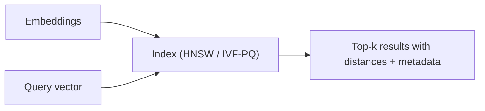

# 3.10 — Vector Databases & Approximate Nearest Neighbors

## 1. Intuition first
A vector DB stores high-dimensional embeddings and answers "what are the most similar vectors to this query?" quickly, even over billions of items. Under the hood it uses approximate nearest neighbor (ANN) indexes because exact search is too slow.

## 2. Why the topic exists
RAG, semantic search, recommendations, dedupe — everything needs fast KNN over embeddings.

## 3. What problem it solves
Sub-linear top-k similarity search at scale, plus metadata filtering.

## 4. Mathematics / Algorithms

### 4.1 Metrics
Cosine (normalized dot), Euclidean, dot product.

### 4.2 IVF (Inverted File)
Cluster vectors with k-means; at query, search a few nearest clusters.

### 4.3 PQ (Product Quantization)
Split each vector into sub-vectors; quantize each sub-vector via k-means (256 centroids → 1 byte each). Massive memory savings.

### 4.4 HNSW (Hierarchical Navigable Small World)
Graph-based multi-layer index: greedy walk from the top layer. Best-in-class for many workloads; O(log n) practical query.

### 4.5 ScaNN
Google's tree + hashing + reranking; excellent recall/latency trade-off.

### 4.6 DiskANN
Compressed graph on SSD → billion-scale with tiny RAM.

## 5. Every formula explained
- ANN trades recall (fraction of true neighbors) for latency and memory.
- Typical recall targets: 0.95–0.99 at 10 ms per query for millions of vectors.

## 6. Variables
$d$ dimension; $N$ vectors; $k$ top-k; recall@k; QPS; index build time.

## 7. Algorithm — choosing an index
- Small (<100k): brute force.
- Medium (~1M): HNSW.
- Large (>10M): IVF-PQ or HNSW-PQ.
- Extra-large / cost-sensitive: DiskANN or IVF-PQ.

## 8. Simple example
Load 1M sentence embeddings → HNSW index (build minutes) → 2ms query latency at recall@10 ≈ 0.98.

## 9. Real-world example
- Pinterest visual search on billions of image embeddings.
- Spotify song recommendations.
- Every RAG chatbot.

## 10. Diagram


## 11. Implementation from scratch — brute force + IVF sketch
```python
import numpy as np
class BruteANN:
    def __init__(self):
        self.data = None
    def add(self, X): self.data = X if self.data is None else np.vstack([self.data, X])
    def query(self, q, k=10):
        d = np.linalg.norm(self.data - q, axis=1)
        idx = np.argpartition(d, k)[:k]
        return idx[np.argsort(d[idx])]

class IVF:
    def __init__(self, n_clusters=32):
        from sklearn.cluster import MiniBatchKMeans
        self.km = MiniBatchKMeans(n_clusters=n_clusters, n_init=3)
    def fit(self, X):
        self.km.fit(X); self.buckets = {c: np.where(self.km.labels_ == c)[0] for c in range(self.km.n_clusters)}
        self.X = X
    def query(self, q, k=10, nprobe=4):
        cluster_dists = np.linalg.norm(self.km.cluster_centers_ - q, axis=1)
        cands = np.concatenate([self.buckets[c] for c in np.argsort(cluster_dists)[:nprobe]])
        d = np.linalg.norm(self.X[cands] - q, axis=1)
        idx = cands[np.argpartition(d, min(k, len(cands)-1))[:k]]
        return idx
```

## 12. Implementation using libraries
```python
# FAISS
import faiss, numpy as np
d = 768
index = faiss.IndexHNSWFlat(d, 32)   # M=32
index.hnsw.efConstruction = 200; index.hnsw.efSearch = 50
index.add(np.asarray(X, dtype=np.float32))
D, I = index.search(np.asarray(q, dtype=np.float32).reshape(1, -1), 10)
```

Managed: Pinecone, Weaviate, Qdrant, Milvus, Chroma, pgvector (Postgres extension), Elasticsearch dense_vector.

## 13. Time complexity
HNSW query: ~O(log n) empirically. IVF-PQ: O(nprobe × avg cluster size).

## 14. Space complexity
Dense: N × d × 4 bytes. PQ: N × M bytes (M = # sub-vectors) — up to 50× smaller.

## 15. Advantages
Fast; scalable; supports metadata filters; managed options simplify ops.

## 16. Disadvantages
Recall/latency trade-off; index tuning; extra infra.

## 17. Interview questions
1. HNSW — how does it work?
2. IVF vs HNSW.
3. Product quantization intuition.
4. Recall vs latency trade-offs.
5. How would you scale to a billion vectors?
6. Metadata filtering strategies.
7. How to update / delete in an ANN index?
8. Reranking with cross-encoders.
9. Comparing FAISS / Qdrant / Weaviate.
10. When would you not need a vector DB (just SQL)?

## 18. Common mistakes
- Wrong metric (cosine vs dot vs L2).
- Building indexes with too small `efConstruction`.
- Ignoring vector normalization requirements.
- Mixing embedding models across queries and docs.

## 19. Optimization techniques
Quantization (int8, PQ), disk-based indexes, sharding by tenant, GPU-based FAISS, IVF-OPQ, learned indexes.

## 20. Coding exercises
1. Build FAISS-HNSW on 1M Wikipedia embeddings; measure QPS/recall.
2. Compare exact vs HNSW vs IVF-PQ.
3. Add metadata filter (e.g., category) via pre-/post-filtering.
4. Implement PQ from scratch on random vectors.

## 21. Mini project
Local FAISS-backed semantic search over your Markdown notes.

## 22. Medium project
Deploy Qdrant for a RAG app with filters and hybrid retrieval; benchmark performance.

## 23. Advanced project
Implement DiskANN-inspired index on SSD in Rust or Python-C++ hybrid; scale to 100M vectors on a laptop.

## 24. Where it is used in industry
Semantic search, RAG, recommenders, dedup, fraud, image search.

## 25. How companies use it
Pinterest, YouTube, Spotify, all LLM startups.

## 26. When NOT to use it
- Tiny collections where brute force is fine.
- Non-embedding queries — relational DB / search engine may suffice.
