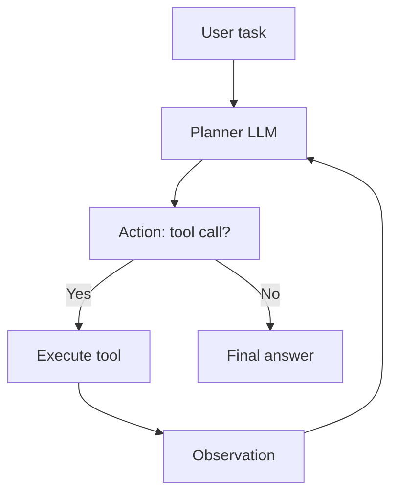

# 3.11 — LLM Agents & Tool Use

## 1. Intuition first
An agent = LLM + tools + memory + a loop. The model plans, calls a tool (search, code exec, DB, API), reads the result, and continues until the task is done. This turns a text generator into a thing that acts in the world.

## 2. Why the topic exists
Many real tasks need actions beyond text: browse the web, run code, query a DB, send emails, book a flight. Agents give LLMs hands.

## 3. What problem it solves
Automate multi-step, tool-using workflows: research, coding, data analysis, customer support automation, browser automation.

## 4. Mathematics / Design patterns

### 4.1 ReAct (Reason + Act)
Alternate `Thought` → `Action` → `Observation` in the prompt / trajectory until `Final Answer`.

### 4.2 Function calling / tool schema
Give the model a JSON schema of tools; it decides when and how to call them; runtime executes and feeds results back.

### 4.3 Planner-executor / Reflexion
LLM plans steps, executes, reflects on failures, retries.

### 4.4 Multi-agent
Multiple specialized agents cooperate (Manager, Coder, Reviewer). AutoGen, CrewAI patterns.

### 4.5 Memory
- Scratchpad (in-context).
- Long-term (vector store of past interactions).
- Episodic vs semantic memory.

### 4.6 Guardrails
- Tool allowlists.
- Sandboxed code execution.
- Rate limits.
- Prompt-injection defense.
- Human-in-the-loop for high-stakes actions.

## 5. Every "formula" explained
No formulas — but structured formats matter. Tool schemas resemble typed function signatures.

## 6. Variables
Tools; max steps; temperature; budget; memory.

## 7. Algorithm — a robust ReAct loop
```
state = initial_prompt + user_query
for step in 1..max_steps:
    llm_response = LLM(state, tool_schemas)
    if tool_call:
        result = execute_tool(tool_call)
        state += tool_call + result
    else:
        return llm_response  # final answer
```

## 8. Simple example
Query: "What was the temperature in Paris yesterday?"
Agent → `search("Paris weather yesterday")` → observes result → composes answer.

## 9. Real-world example
- Cursor / GitHub Copilot Workspace: coding agents.
- Perplexity: search agent.
- Devin / SWE-agent: software engineering agent on real repos.
- Anthropic's Computer Use.

## 10. Diagram


## 11. Implementation from scratch — minimal agent loop
```python
import json
def agent(query, tools, model, max_steps=6):
    messages = [{"role": "system",
                 "content": f"You have tools: {json.dumps([t['schema'] for t in tools])}. Reply with either a JSON tool_call or a final answer."},
                {"role": "user", "content": query}]
    for _ in range(max_steps):
        out = model.chat(messages)
        try:
            call = json.loads(out)
            tool = next(t for t in tools if t["name"] == call["tool"])
            result = tool["fn"](**call["args"])
            messages.append({"role": "assistant", "content": out})
            messages.append({"role": "tool", "content": json.dumps(result)})
        except Exception:
            return out       # final answer
    return "max steps reached"
```

## 12. Implementation using libraries
- OpenAI Assistants / tool calls (`tools=[{...}]`).
- LangChain / LangGraph.
- LlamaIndex agents.
- CrewAI (multi-agent).
- AutoGen (Microsoft).
- smolagents / haystack.
- Cursor CLI / claude-code (as products).

## 13. Time complexity
Latency scales linearly with number of tool-call round-trips × LLM latency.

## 14. Space complexity
Context grows with observations — cap and summarize.

## 15. Advantages
Automates complex workflows; up-to-date info via tools; extensible.

## 16. Disadvantages
Latency; cost; brittleness; safety concerns; hard to evaluate.

## 17. Interview questions
1. Describe ReAct.
2. Difference between tool calling and JSON mode.
3. How do multi-agent systems coordinate?
4. Memory strategies for long-running agents.
5. Prompt injection through tool outputs — how to mitigate?
6. Evaluate an agent — what metrics?
7. Human-in-the-loop patterns.
8. When to prefer a pipeline over an agent.
9. Reflection / self-critique patterns.
10. Cost / latency budgeting.

## 18. Common mistakes
- Unbounded loops (missing max steps).
- No cost / rate limit.
- Trusting tool outputs blindly.
- Not restricting tool permissions (RCE risk).
- Overusing agents for simple tasks.

## 19. Optimization techniques
Speculative planning; caching intermediate tool results; parallel tool calls; smaller planner + bigger executor; LATS/ToT for search; verifier models.

## 20. Coding exercises
1. Build a ReAct agent with `search` and `calculator` tools.
2. Add memory (vector store of past conversations).
3. Add a reflection step; measure gain on multi-hop QA.
4. Implement rate limiting + max-step budget.

## 21. Mini project
Data-analysis agent: given a CSV, answer questions by generating & executing pandas code in a sandbox.

## 22. Medium project
Web-research agent producing sourced markdown reports on a topic.

## 23. Advanced project
Coding agent that fixes bugs in a small repo by planning → editing → running tests → iterating. Benchmark on a curated set of issues.

## 24. Where it is used in industry
Cursor, Windsurf, GitHub Copilot Workspace, Devin, Perplexity, Claude Code, Anthropic Computer Use, enterprise RPA replacements.

## 25. How companies use it
- Coding agents inside IDEs.
- Support automation.
- Sales research automation.
- Data ops.

## 26. When NOT to use it
- Deterministic pipelines that don't need reasoning between steps.
- Sub-second-latency applications.
- Anywhere a bug could cause irreversible damage without human approval.
