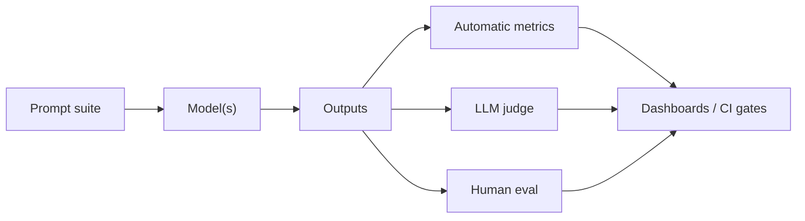

# 3.12 — LLM Evaluation

## 1. Intuition first
LLM outputs are open-ended; "accuracy" doesn't apply. You need a mix of automatic metrics, task-specific benchmarks, LLM-as-judge, and human evals — all pinned to actual product KPIs.

## 2. Why the topic exists
Models improve constantly; without rigorous evals you cannot tell if a change is real, or notice regressions, or compare vendors honestly.

## 3. What problem it solves
Reliable, comparable, actionable quality assessment of LLM systems.

## 4. Methods & Metrics

### 4.1 Perplexity
Intrinsic; good for pretraining loss curves.

### 4.2 Reference-based
BLEU, ROUGE, METEOR, chrF (n-gram overlap). BERTScore / BLEURT / COMET (embedding-based).

### 4.3 Reference-free
LLM-as-judge (GPT-4 judges output), pairwise (Chatbot Arena Elo), rubric-based.

### 4.4 Public benchmarks
- Knowledge: MMLU, TruthfulQA.
- Reasoning: GSM8K, MATH, ARC-Challenge, BBH.
- Code: HumanEval, MBPP, SWE-Bench, LiveCodeBench.
- Multi-turn instruct: MT-Bench, AlpacaEval, IFEval.
- Long-context: LongBench, RULER.
- Multilingual: FLORES.

### 4.5 Task-specific evals
Curated gold sets per production use case with domain-specific rubrics.

### 4.6 Safety
Toxicity, jailbreak resistance, bias, PII leak. Tools: `garak`, `perspective API`, `Llama-Guard`.

### 4.7 RAG evals
Faithfulness, answer relevance, context precision/recall (ragas), factual consistency.

### 4.8 Agent evals
Task completion rate, tool-call precision/recall, cost per task, human evaluation.

## 5. Every "formula" explained
- Elo rating: pairwise updates $R \leftarrow R + K(S - E)$.
- LLM-as-judge Cohen's kappa vs human raters to validate the judge.

## 6. Variables
Prompt count; win-rate; latency; cost per query; refusal rate.

## 7. Algorithm — building an eval harness
1. Define product KPIs and translate into offline evals.
2. Curate a small (100–500) gold set.
3. Add automatic metrics (BLEU/BERTScore, ragas, code tests).
4. Add LLM judges with rubric and per-rubric scores.
5. Occasionally validate with human raters.
6. Add live A/B monitoring in production.
7. Track over time; block regressions in CI.

## 8. Simple example
For a summarization endpoint: measure ROUGE-L, faithfulness via LLM judge, and monitor user thumbs-up rate.

## 9. Real-world example
Chatbot Arena crowdsources pairwise votes to rank frontier models.

## 10. Diagram


## 11. Implementation from scratch
```python
def exact_match(pred, gold):
    return pred.strip().lower() == gold.strip().lower()

def llm_judge(client, prompt, response, rubric):
    system = f"You are a strict grader. Rubric: {rubric}. Reply with JSON {{score: 1..5, reason: '...'}}."
    j = client.chat(system=system, user=f"Prompt: {prompt}\nResponse: {response}")
    return j  # parse JSON, validate
```

## 12. Implementation using libraries
- `lm-evaluation-harness` (EleutherAI) for benchmarks.
- `ragas` for RAG.
- `promptfoo`, `evals` (OpenAI), `deepeval`.
- `arize-phoenix`, `trulens` for tracing + evals.
- `garak` for red-teaming.

## 13. Time / cost complexity
Big — evals often cost as much as training runs. Sample intelligently.

## 14. Space
Store all prompts/responses/scores for auditability.

## 15. Advantages
Prevents regressions; empowers principled iteration.

## 16. Disadvantages
LLM judges have biases (verbosity, position); benchmarks can be contaminated; human eval is expensive.

## 17. Interview questions
1. Why is accuracy inadequate for LLMs?
2. LLM-as-judge — pitfalls and mitigations.
3. Explain BERTScore vs BLEU.
4. How to detect benchmark contamination.
5. Elo rating for Chatbot Arena.
6. How to evaluate RAG?
7. How to evaluate agents?
8. Design a red-team suite.
9. Perplexity vs downstream benchmark disagreement — why?
10. How to prevent eval-set overfitting during development.

## 18. Common mistakes
- Optimizing to a single metric.
- Testing on training data.
- Comparing models with different sampling temperatures.
- Ignoring latency and cost when comparing quality.

## 19. Optimization techniques
Adaptive evaluation (harder examples for stronger models), calibration of judges, ensemble of judges, human spot-checks.

## 20. Coding exercises
1. Wire `lm-evaluation-harness` and run MMLU on a small open model.
2. Build an LLM-judge pipeline with rubric-based scoring.
3. Reproduce a leaderboard entry for `alpaca-eval`.
4. Add a regression test to CI that fails if score drops > 2%.

## 21. Mini project
Automated eval dashboard for your RAG system with ragas + custom rubrics.

## 22. Medium project
Setup Chatbot-Arena-style pairwise voting for internal models.

## 23. Advanced project
Design an eval suite for a coding agent: unit tests, code quality, cost, and human review; integrate into CI.

## 24. Where it is used in industry
Every company shipping LLMs: OpenAI, Anthropic, Meta, Cohere, Databricks, all SaaS AI features.

## 25. How companies use it
- Nightly benchmark runs.
- Pre-release safety gates.
- Continuous A/B tests in production.

## 26. When NOT to use it
There's no "not". Even prototypes benefit from a 20-example gold set.
