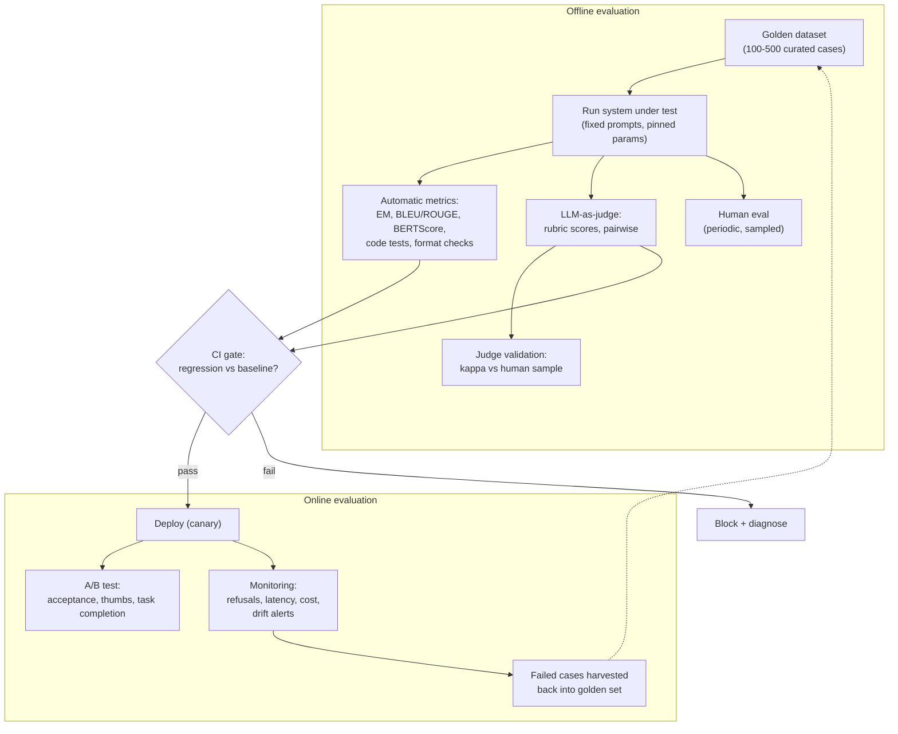
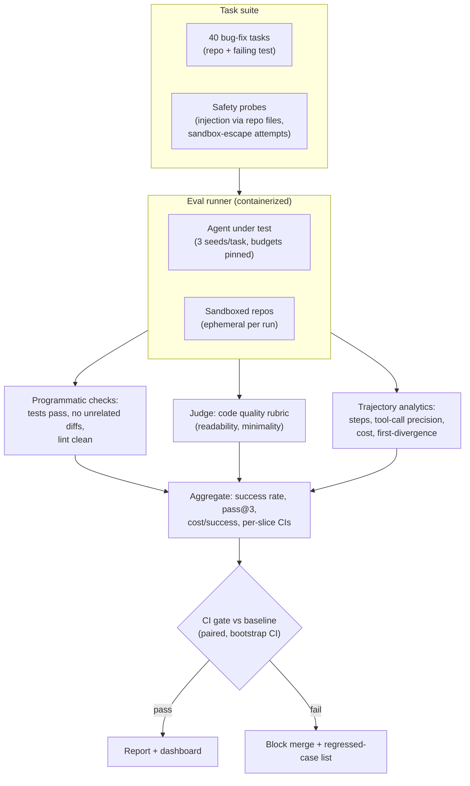

# 3.12 — LLM Evaluation

## 1. Overview

**What is it?** LLM evaluation is the discipline of measuring the quality of language-model outputs and LLM-based systems — with automatic metrics (perplexity, BLEU, BERTScore), public benchmarks (MMLU, GSM8K, HumanEval), model-graded judgments (LLM-as-judge, pairwise arenas), human evaluation, and production monitoring — and wiring those measurements into the development loop so every change is tested before it ships.

**Why does it exist?** Classical ML has a luxury LLMs lack: a single scalar like accuracy or RMSE (see [Evaluation Metrics](../phase-1-classical-ml/14-evaluation-metrics.md)) computed against an unambiguous label. LLM outputs are open-ended — a summary can be faithful but bland, fluent but wrong, correct but unhelpfully long. There is no one right answer to compare against, and quality is multi-dimensional: correctness, faithfulness, helpfulness, safety, style, latency, cost.

**What problem does it solve?** Without rigorous evals you cannot tell whether a prompt tweak helped, whether the new model version regressed your product, or which vendor to choose — you're steering by vibes. Evaluation converts "it feels better" into "faithfulness +4 points, refusal rate unchanged, cost −12 %, ship it."

**Where is it used?** Every serious LLM effort: labs (OpenAI, Anthropic, Google) gate releases on benchmark and safety suites; product teams gate deploys on regression evals in CI; the community ranks models via Chatbot Arena and open leaderboards. Evaluation is to LLM engineering what testing is to software engineering — the thing that makes iteration safe.

## 2. Learning Objectives

After this chapter you will be able to:

- Explain why classical accuracy fails for open-ended generation and enumerate the axes of LLM quality.
- Define and compute perplexity, and explain its uses and limits as an intrinsic metric.
- Compute reference-based metrics — BLEU, ROUGE, and BERTScore — by hand on toy examples and know when each misleads.
- Design an LLM-as-judge pipeline with rubrics, and name and mitigate its biases (position, verbosity, self-preference).
- Validate a judge against human raters using agreement statistics (Cohen's kappa).
- Explain Elo/Bradley–Terry ratings as used by Chatbot Arena and update a rating by hand.
- Navigate the public benchmark landscape (MMLU, GSM8K, HumanEval, MT-Bench, IFEval, and others) and spot contamination risks.
- Evaluate RAG systems (faithfulness, context precision/recall via `ragas`) and agents (task success, pass@k, tool-call accuracy).
- Build safety evals: toxicity, jailbreak resistance, PII leakage, refusal calibration.
- Construct a golden dataset and an evaluation harness for a real product use case.
- Integrate evals into CI/CD as regression gates and into production as online monitoring.
- Avoid the classic traps: single-metric optimization, eval-set overfitting, contaminated comparisons.

## 3. Prerequisites

| Chapter | Why you need it |
|---|---|
| [Evaluation Metrics](../phase-1-classical-ml/14-evaluation-metrics.md) | Precision/recall/F1 thinking carries over; this chapter extends it to open-ended text. |
| [Loss Functions](../phase-2-deep-learning/04-loss-functions.md) | Perplexity is exponentiated cross-entropy. |
| [GPT & Pretraining](05-gpt-pretraining.md) | You must know what next-token prediction optimizes to see what perplexity measures. |
| [BERT & Encoders](04-bert.md) | BERTScore uses contextual encoder embeddings. |
| [RLHF & DPO](06-rlhf-dpo.md) | Preference data and reward models are evaluation machinery turned into training signal. |
| [Prompt Engineering](08-prompt-engineering.md) | Judge prompts and rubrics are prompt engineering under adversarial pressure. |
| [RAG](09-rag.md) | RAG-specific metrics (faithfulness, context precision) evaluate that pipeline. |
| [LLM Agents](11-agents.md) | Agent evals (task success, trajectories) build on the agent loop. |

Deployment-side integration (dashboards, drift alarms) is covered in [LLMOps](../phase-5-mlops/07-llmops.md) and [CI/CD for ML](../phase-5-mlops/04-cicd-ml.md).

## 4. Intuition

**Analogy: grading essays vs grading multiple choice.** A multiple-choice exam grades itself — the answer key is the metric (that's classification accuracy). An essay exam cannot be graded by string matching: two excellent essays share almost no sentences, and a terrible essay can reuse many words from a model answer. Schools solve this with *rubrics* (argument quality, evidence, clarity — scored separately), *trained graders* (calibrated against each other), and *moderation* (second opinions on borderline cases). LLM evaluation rebuilds exactly this apparatus: rubrics become metric definitions and judge prompts, trained graders become LLM judges validated against humans, moderation becomes human spot-checks and agreement statistics.

**Everyday story.** Imagine hiring a chef. You could measure how closely each dish matches a reference photo (BLEU/ROUGE — superficial overlap). You could hire a food critic to score each dish on taste, presentation, and originality (LLM-as-judge with a rubric — scalable but the critic has biases: maybe they favor big portions, i.e., verbosity). You could run blind taste-offs between two chefs and count wins (pairwise arena → Elo). Or you could open the restaurant and watch what customers reorder (online metrics, A/B tests). No single method suffices; a good hiring decision — like a good model decision — triangulates all of them.

The single most important mindset: **your eval is a proxy**. Optimize any proxy hard enough and it detaches from the real goal (Goodhart's law). Great evaluation practice is the craft of building proxies that stay honest.

## 5. Real-world Motivation

- **OpenAI**, **Anthropic**, and **Google DeepMind** publish benchmark tables (MMLU, GSM8K, HumanEval, and successors) with every model release, and run internal safety/red-team evals as release gates — Anthropic's Responsible Scaling Policy and OpenAI's Preparedness Framework are, at bottom, evaluation regimes with thresholds.
- **LMSYS Chatbot Arena** became the community's most trusted ranking by sidestepping benchmark contamination entirely: millions of crowdsourced, blind, pairwise human votes feed a Bradley–Terry/Elo model.
- **Meta** ships Llama models alongside eval suites and safety classifiers (Llama Guard), because open-weight releases are judged on reproducible benchmark evidence.
- **Microsoft** and **Amazon** bake evaluation tooling into Azure AI Foundry and Bedrock respectively — enterprises demand regression testing before swapping models under production workloads.
- **Product teams everywhere** learned the hard way: a model upgrade that improved average quality but doubled the refusal rate on legitimate queries, or a prompt "improvement" that silently broke JSON output for 3 % of requests. The teams that catch these before customers do are the ones with eval harnesses wired into CI.

The cost asymmetry drives investment: a nightly eval run costs tens of dollars; an undetected regression in a customer-facing assistant costs trust, revenue, and weeks of firefighting.

## 6. Mathematical Foundations

### 6.1 Perplexity

A language model assigns probability to a token sequence $w_1, \dots, w_N$ autoregressively. Perplexity is the exponentiated average negative log-likelihood:

$$\text{PPL} = \exp\!\left(-\frac{1}{N} \sum_{i=1}^{N} \log p_\theta(w_i \mid w_{<i})\right)$$

where $p_\theta(w_i \mid w_{<i})$ is the model's probability for token $w_i$ given all preceding tokens, and $N$ is the number of tokens scored. Interpretation: the model's average *effective branching factor* — a perplexity of 20 means the model is, on average, as uncertain as if choosing uniformly among 20 tokens. It is exactly $\exp(\text{cross-entropy loss})$ from [Loss Functions](../phase-2-deep-learning/04-loss-functions.md); lower is better. Caveats: perplexity is only comparable between models sharing a tokenizer and eval corpus, it measures *fit to text*, not helpfulness or truth, and instruction-tuned models can have worse perplexity than their base models while being far more useful.

### 6.2 BLEU

BLEU scores a candidate $C$ against references by modified n-gram precision. For n-gram size $n$:

$$p_n = \frac{\sum_{g \in \text{n-grams}(C)} \min(\text{count}_C(g),\ \text{count}_{\text{ref}}(g))}{\sum_{g \in \text{n-grams}(C)} \text{count}_C(g)}$$

The clip ($\min$) stops a candidate from farming credit by repeating one matching word. BLEU combines $p_1 \dots p_4$ geometrically with a brevity penalty:

$$\text{BLEU} = \text{BP} \cdot \exp\!\left(\sum_{n=1}^{4} \frac{1}{4} \log p_n\right), \qquad \text{BP} = \begin{cases} 1 & c > r \\ e^{1 - r/c} & c \le r \end{cases}$$

where $c$ is candidate length and $r$ reference length — the penalty stops trivially short outputs from achieving high precision.

### 6.3 ROUGE

ROUGE is recall-oriented (born for summarization). ROUGE-N is n-gram *recall* against the reference: $\text{ROUGE-N} = \frac{\text{matched n-grams}}{\text{n-grams in reference}}$. ROUGE-L uses the longest common subsequence (LCS): with $\text{LCS}(C, R)$ the length of the longest (not necessarily contiguous) common subsequence,

$$P = \frac{\text{LCS}}{|C|}, \quad R = \frac{\text{LCS}}{|R|}, \quad \text{ROUGE-L} = \frac{(1+\beta^2) P R}{\beta^2 P + R}$$

an F-measure over LCS precision and recall ($\beta$ weights recall). Both BLEU and ROUGE share a fatal blind spot: "The cat sat on the mat" vs "A feline rested on the rug" scores ≈ 0 despite identical meaning.

### 6.4 BERTScore

Fix the paraphrase blindness with contextual embeddings (from [BERT](04-bert.md)). Embed candidate tokens $\{c_i\}$ and reference tokens $\{r_j\}$; greedy-match by cosine similarity:

$$R_{\text{BERT}} = \frac{1}{|R|} \sum_{r_j \in R} \max_{c_i \in C} \cos(\mathbf{e}(r_j), \mathbf{e}(c_i)), \qquad P_{\text{BERT}} = \frac{1}{|C|} \sum_{c_i \in C} \max_{r_j \in R} \cos(\mathbf{e}(c_i), \mathbf{e}(r_j))$$

$$F_{\text{BERT}} = \frac{2 P_{\text{BERT}} R_{\text{BERT}}}{P_{\text{BERT}} + R_{\text{BERT}}}$$

where $\mathbf{e}(\cdot)$ is the contextual embedding. Now "feline" matches "cat". Cost: a forward pass per text; still reference-bound.

### 6.5 Elo / Bradley–Terry ratings

Chatbot Arena ranks models from pairwise human votes. Under Bradley–Terry, the probability model $A$ (rating $R_A$) beats model $B$ (rating $R_B$) is

$$E_A = \frac{1}{1 + 10^{(R_B - R_A)/400}}$$

After a match with outcome $S_A \in \{1, \tfrac{1}{2}, 0\}$ (win/tie/loss), the online Elo update is

$$R_A \leftarrow R_A + K\,(S_A - E_A)$$

with $K$ the update step size (e.g., 32); $B$ updates symmetrically. Arena actually fits the Bradley–Terry model to *all* votes jointly (order-independent maximum likelihood, with confidence intervals) rather than streaming Elo, but the intuition is identical: ratings are calibrated so rating gaps predict win probabilities — a 400-point gap ⇒ ~90.9 % expected win rate.

### 6.6 Validating judges: Cohen's kappa

An LLM judge is only trustworthy if it agrees with humans beyond chance. For two raters labeling the same items, with observed agreement $p_o$ and chance agreement $p_e$ (from the raters' marginal label frequencies):

$$\kappa = \frac{p_o - p_e}{1 - p_e}$$

$\kappa = 1$ is perfect agreement, $0$ is chance level. Rules of thumb: $\kappa > 0.6$ substantial, $> 0.8$ near-perfect. Compute judge–human kappa on a 100–200 item sample before trusting judge scores at scale — and re-validate when you change the judge model or rubric.

### 6.7 pass@k for code

With $n$ samples per problem of which $c$ pass the unit tests, the unbiased estimator of the probability that at least one of $k$ samples passes:

$$\text{pass@}k = \mathbb{E}\left[1 - \frac{\binom{n-c}{k}}{\binom{n}{k}}\right]$$

The naive $1 - (1 - c/n)^k$ is biased; the combinatorial form (Chen et al., HumanEval) is exact.

## 7. Visual Explanation

The evaluation stack, offline to online:



The judge-bias landscape as ASCII art:

```
LLM-AS-JUDGE BIASES              MITIGATIONS
--------------------             ---------------------------------
position bias                --> score both orders (A,B) and (B,A);
 (prefers first answer)          count only consistent verdicts
verbosity bias               --> rubric: penalize padding; length-
 (longer looks better)           controlled win rates (AlpacaEval 2)
self-preference bias         --> judge != any evaluated model;
 (likes its own style)           ensemble of judge models
sycophancy to phrasing       --> hide system identities; neutral
 ("expert wrote this")           templates, no meta-information
rubric drift                 --> pin judge model+version; re-run
 (scores shift over time)        anchor set; track judge stability
```

## 8. Algorithm

Building an evaluation harness for an LLM product, step by step:

1. **Define what "good" means**: translate product KPIs into 3–6 measurable dimensions (e.g., correctness, faithfulness, format compliance, tone, safety, latency/cost).
2. **Curate a golden dataset**: 100–500 cases sampled from real (or realistic) traffic, stratified across intents, difficulty, and edge cases; each case carries input, any needed context, and either a gold answer, a checklist, or a rubric. Version it like code.
3. **Attach programmatic checks first**: exact match where possible, unit tests for code, JSON-schema validation for structured output, regex/citation checks — cheap, deterministic, trustworthy.
4. **Add reference-based metrics** where references exist (ROUGE/BERTScore for summarization) — as *signals*, not gates.
5. **Build LLM judges** for the dimensions that need judgment: one rubric per dimension, scored separately (never one mushy 1–10 "quality"); require the judge to quote evidence before scoring; use a strong model ≠ the model under test.
6. **Validate the judges**: 100–200 items double-scored by humans; compute Cohen's kappa; iterate on the rubric until $\kappa > 0.6$; freeze judge model + prompt versions.
7. **Establish the baseline**: run the current production system; record per-metric distributions (not just means) and cost/latency.
8. **Gate changes in CI**: every prompt/model/pipeline PR re-runs the harness; fail on statistically meaningful regressions (paired comparison per case beats comparing means).
9. **Deploy behind online evals**: canary + A/B with product metrics (acceptance rate, task completion, escalations); alert on refusal-rate and format-error drift.
10. **Close the loop**: harvest production failures into the golden set monthly; re-validate judges quarterly; retire saturated cases.

Pseudocode for the core harness:

```text
function evaluate(system, golden_set, judges, baseline):
    results = []
    for case in golden_set:
        out = system.run(case.input, seed=fixed, temperature=pinned)
        row = {id: case.id, output: out,
               checks: run_programmatic_checks(out, case),       # bools
               metrics: run_reference_metrics(out, case.gold),   # floats
               judged: {dim: judge(dim).score(case, out)          # rubric scores
                        for dim in judges}}
        results.append(row)
    report = aggregate(results)                     # means + CIs + per-slice
    regressions = paired_compare(results, baseline) # per-case deltas, sign test
    return report, regressions

# CI gate
report, reg = evaluate(candidate, golden, judges, prod_baseline)
fail_build if any(reg.significant and reg.worse)
```

## 9. Worked Example

### Tiny examples by hand

**Perplexity.** A model scores the 4-token sequence "the cat sat down" with token probabilities $0.2,\ 0.1,\ 0.25,\ 0.5$. Average negative log-likelihood:

$$-\frac{1}{4}\left(\ln 0.2 + \ln 0.1 + \ln 0.25 + \ln 0.5\right) = -\frac{1}{4}(-1.609 - 2.303 - 1.386 - 0.693) = \frac{5.991}{4} = 1.498$$

$$\text{PPL} = e^{1.498} \approx 4.47$$

The model is as uncertain as a uniform choice over ~4.5 tokens at each step.

**BLEU-1 with clipping.** Reference: "the cat is on the mat" ("the" appears twice). Candidate: "the the the cat" (4 unigrams). Clipped matches: "the" → $\min(3, 2) = 2$; "cat" → $\min(1,1) = 1$. So $p_1 = 3/4 = 0.75$ — without clipping it would be a gamed $4/4$. Brevity penalty: $c = 4 < r = 6$, so $\text{BP} = e^{1 - 6/4} = e^{-0.5} \approx 0.607$; BLEU-1 $\approx 0.607 \times 0.75 = 0.455$.

**Elo update.** GPT-X ($R_A = 1300$) loses to Claude-Y ($R_B = 1250$). Expected score: $E_A = 1/(1 + 10^{(1250-1300)/400}) = 1/(1 + 10^{-0.125}) = 0.571$. With $K = 32$, $S_A = 0$: $R_A \leftarrow 1300 + 32(0 - 0.571) = 1281.7$; Claude-Y gains the same 18.3 points. An upset (losing while favored) moves ratings more than an expected result — exactly the calibration property we want.

**Cohen's kappa.** Judge and human label 100 answers pass/fail. Both say pass on 50, both fail on 20, judge-pass/human-fail 20, judge-fail/human-pass 10. $p_o = (50+20)/100 = 0.70$. Marginals: judge passes 70 %, human passes 60 % → $p_e = 0.7 \times 0.6 + 0.3 \times 0.4 = 0.54$. $\kappa = (0.70 - 0.54)/(1 - 0.54) = 0.348$ — only *fair* agreement despite 70 % raw overlap: this judge is not yet trustworthy, fix the rubric.

### Realistic scale

A summarization endpoint's harness: 300 golden documents; per candidate summary compute ROUGE-L and BERTScore against references, a 3-dimension judge (faithfulness, coverage, conciseness — each 1–5 with quoted evidence), plus format checks (length limit, no first person). Nightly run: ~900 judge calls ≈ \$5–15 and 20 minutes. Judge validated at $\kappa = 0.71$ against two human raters on 150 items. CI gate: block if faithfulness mean drops > 0.15 or any-case format failures exceed 1 %. This caught a real regression when a model upgrade increased eloquence but introduced unsupported claims — ROUGE moved *up* while judged faithfulness fell, a divergence no single metric would reveal.

## 10. Python from Scratch

Core metrics in pure Python/NumPy — no evaluation libraries, no magic.

```python
import numpy as np
from collections import Counter


def perplexity(token_logprobs: list[float]) -> float:
    """PPL from per-token log-probabilities (natural log).
    Input: log p(w_i | w_<i) for each scored token. Output: scalar >= 1."""
    nll = -np.mean(token_logprobs)          # average negative log-likelihood
    return float(np.exp(nll))               # exp(cross-entropy)


def ngrams(tokens: list[str], n: int) -> Counter:
    return Counter(tuple(tokens[i:i+n]) for i in range(len(tokens) - n + 1))


def bleu(candidate: str, reference: str, max_n: int = 4) -> float:
    """Sentence BLEU with clipping and brevity penalty (single reference)."""
    c, r = candidate.split(), reference.split()
    log_precisions = []
    for n in range(1, max_n + 1):
        cand_ngr, ref_ngr = ngrams(c, n), ngrams(r, n)
        if not cand_ngr:                    # candidate shorter than n
            return 0.0
        # clip: candidate n-gram credit capped at reference count
        overlap = sum(min(cnt, ref_ngr[g]) for g, cnt in cand_ngr.items())
        p_n = overlap / sum(cand_ngr.values())
        if p_n == 0:                        # geometric mean would be 0
            return 0.0
        log_precisions.append(np.log(p_n))
    bp = 1.0 if len(c) > len(r) else np.exp(1 - len(r) / max(len(c), 1))
    return float(bp * np.exp(np.mean(log_precisions)))


def rouge_l(candidate: str, reference: str, beta: float = 1.2) -> float:
    """ROUGE-L F-measure via LCS dynamic programming. O(|C|*|R|) time/space."""
    c, r = candidate.split(), reference.split()
    # dp[i][j] = LCS length of c[:i], r[:j]
    dp = np.zeros((len(c) + 1, len(r) + 1), dtype=int)
    for i in range(1, len(c) + 1):
        for j in range(1, len(r) + 1):
            dp[i][j] = dp[i-1][j-1] + 1 if c[i-1] == r[j-1] \
                       else max(dp[i-1][j], dp[i][j-1])
    lcs = dp[-1][-1]
    if lcs == 0:
        return 0.0
    p, rec = lcs / len(c), lcs / len(r)
    return float((1 + beta**2) * p * rec / (beta**2 * p + rec))


def elo_update(r_a: float, r_b: float, score_a: float, k: float = 32.0):
    """One pairwise result: score_a in {1, 0.5, 0}. Returns new ratings."""
    e_a = 1.0 / (1.0 + 10 ** ((r_b - r_a) / 400))   # expected score for A
    delta = k * (score_a - e_a)
    return r_a + delta, r_b - delta                  # zero-sum update


def cohens_kappa(labels_1: list, labels_2: list) -> float:
    """Agreement beyond chance between two raters over the same items."""
    n = len(labels_1)
    p_o = sum(a == b for a, b in zip(labels_1, labels_2)) / n
    cats = set(labels_1) | set(labels_2)
    # chance agreement from marginal label frequencies
    p_e = sum((labels_1.count(c) / n) * (labels_2.count(c) / n) for c in cats)
    return (p_o - p_e) / (1 - p_e) if p_e < 1 else 1.0


def pass_at_k(n: int, c: int, k: int) -> float:
    """Unbiased pass@k (Chen et al.): n samples, c correct."""
    if n - c < k:
        return 1.0
    # 1 - C(n-c, k)/C(n, k), computed stably as a running product
    return 1.0 - float(np.prod(1.0 - k / np.arange(n - c + 1, n + 1)))


# --- sanity checks (expected output in comments) ---------------------------
print(perplexity(np.log([0.2, 0.1, 0.25, 0.5]).tolist()))  # ~4.47 (matches §9)
print(bleu("the the the cat", "the cat is on the mat"))    # 0.0 (no 2-gram match)
print(rouge_l("the cat sat", "the cat sat down"))          # ~0.86
print(elo_update(1300, 1250, 0.0))                          # (~1281.7, ~1268.3)
print(cohens_kappa([1]*70 + [0]*30, [1]*50 + [0]*20 + [1]*20 + [0]*10))
print(pass_at_k(n=20, c=5, k=3))                            # ~0.58
```

Every function is $O(\text{text length})$ except `rouge_l` at $O(|C| \cdot |R|)$ for the LCS table.

> [!WARNING]
> **Common bug:** mixing log bases. API token log-probs are natural log; some formulas are written base-2 ($\text{PPL} = 2^{H}$ with $H$ in bits). Exponentiate with the *same* base you averaged in, or your perplexity is off by a power. A quick sanity check: a uniform model over $V$ tokens must give PPL exactly $V$.

## 11. Library Implementation

### Benchmarks with lm-evaluation-harness

EleutherAI's harness is the standard for reproducible benchmark numbers (it backs open leaderboards):

```bash
pip install lm-eval
# Zero-shot-style eval of a small open model on two benchmarks
lm_eval --model hf \
    --model_args pretrained=Qwen/Qwen2.5-1.5B-Instruct,dtype=bfloat16 \
    --tasks mmlu,gsm8k \
    --num_fewshot 5 \
    --batch_size auto \
    --output_path results/
```

Each task pins its prompt template, few-shot format, and scoring rule — the details that make two papers' "MMLU" numbers differ by 5 points when done ad hoc. Always report harness + version alongside scores.

### RAG evaluation with ragas

```python
from ragas import evaluate
from ragas.metrics import faithfulness, answer_relevancy, context_precision, context_recall
from datasets import Dataset

ds = Dataset.from_dict({
    "question": questions,           # list[str]
    "answer": answers,               # system outputs
    "contexts": contexts,            # list[list[str]]: retrieved chunks per question
    "ground_truth": gold_answers,    # needed for context_recall
})
report = evaluate(ds, metrics=[faithfulness, answer_relevancy,
                               context_precision, context_recall])
print(report)   # {'faithfulness': 0.91, 'answer_relevancy': 0.87, ...}
```

Under the hood each metric is an LLM-judge recipe (e.g., faithfulness decomposes the answer into claims and verifies each against the contexts) — so ragas scores inherit judge biases and judge costs; validate on your domain.

### A production-grade LLM judge (direct API)

```python
import json
from openai import OpenAI

client = OpenAI()

RUBRIC = """Score the RESPONSE on FAITHFULNESS to the CONTEXT (1-5):
5 = every claim directly supported by the context
3 = mostly supported; minor unsupported details
1 = contradicts the context or is largely unsupported
First list each claim and quote its supporting context (or write UNSUPPORTED),
then give the score."""

def judge_faithfulness(question: str, context: str, response: str) -> dict:
    result = client.chat.completions.create(
        model="gpt-4o",                      # judge model != model under test
        temperature=0,                        # determinism for reproducibility
        response_format={"type": "json_object"},
        messages=[
            {"role": "system", "content": RUBRIC +
             '\nReply as JSON: {"claims": [...], "score": 1-5, "reason": "..."}'},
            {"role": "user", "content":
             f"QUESTION: {question}\nCONTEXT: {context}\nRESPONSE: {response}"},
        ],
    )
    out = json.loads(result.choices[0].message.content)
    assert out["score"] in {1, 2, 3, 4, 5}    # validate before trusting
    return out
```

Design choices that matter: temperature 0; *evidence before score* (quoting forces the judge to check, not vibe); one dimension per judge; JSON schema validation; judge model distinct from evaluated models to dodge self-preference. For pairwise judging, run both orders (A,B) and (B,A) and keep only consistent verdicts — the standard position-bias mitigation from the MT-Bench paper. Harness frameworks — `promptfoo` (YAML-configured CI evals), `deepeval` (pytest-style assertions), OpenAI `evals`, Arize Phoenix / TruLens (tracing + evals) — wrap these patterns; `garak` covers red-team probing.

## 12. Code Walkthrough

Tracing one golden case through the faithfulness judge above:

| Value | Type / size | Meaning |
|---|---|---|
| `question` | str, ~30 tokens | "What is the enterprise refund window?" |
| `context` | str, ~400 tokens | The retrieved policy chunks shown to the system under test |
| `response` | str, ~80 tokens | The system's answer being evaluated |
| judge prompt | ~700 tokens | Rubric + case, assembled into two messages |
| `out["claims"]` | list of 3 | e.g., claim "window is 60 days" → quoted support; claim "includes partial refunds" → `UNSUPPORTED` |
| `out["score"]` | int 1–5 | 3 (one unsupported claim) |
| `out["reason"]` | str | One-sentence justification |

Expected behavior: a fully grounded answer scores 5 with every claim quoted; a fabricated detail drops it to 3; a contradiction to 1. Across the golden set you aggregate to a mean ± bootstrap CI *and* a per-case table — the per-case view is what lets CI do paired comparisons ("case 117 regressed from 5 to 2") instead of staring at a 0.05 mean shift. Cost per case ≈ 800 input + 150 output tokens ≈ \$0.005 with a frontier judge; 300 cases × 3 dimensions ≈ \$4.50 per full run — cheap enough to run on every PR.

Determinism caveat: even at temperature 0, provider-side changes can shift judge outputs across weeks. Pin the judge model version, and keep a 30-case *anchor set* with known scores — if anchors move, your judge moved, not your system.

## 13. Complexity Analysis

Let $M$ = golden-set size, $D$ = judged dimensions, $S$ = samples per case (for stochastic systems), $L$ = mean tokens per judge/system call.

- **Time**: one harness run makes $O(M \cdot S)$ system calls plus $O(M \cdot D)$ judge calls; wall-clock is set by API throughput — with 20-way concurrency, 300 cases × 3 dimensions ≈ 900 calls ≈ 5–20 minutes. Reference metrics are negligible ($O(M \cdot L)$ CPU; ROUGE-L is $O(L^2)$ per pair, still microseconds-scale).
- **Cost**: $O(M(S + D) \cdot L \cdot c_{token})$ — dollars per run at product scale, hundreds for full benchmark sweeps of big models. This is why golden sets are hundreds, not tens of thousands, of cases: statistical power vs budget. A mean difference of ~0.2 on a 1–5 scale needs roughly $M \gtrsim 200$ paired cases for reliable detection; paired (per-case) comparisons need far fewer samples than unpaired ones for the same power.
- **Space**: store every run's full artifacts — prompts, outputs, scores, versions — $O(M \cdot L)$ text per run; trivial in bytes, invaluable for audits and regressions archaeology.
- **Human eval**: the true bottleneck — minutes per item per rater, so it's spent only on judge validation samples and high-stakes decisions; everything else is automated against it.

## 14. Advantages

- **Catches regressions before users do.** A CI eval gate flags the model upgrade that broke JSON outputs for 3 % of cases — found in 15 minutes instead of via support tickets.
- **Makes iteration scientific.** "New prompt: faithfulness +0.3, conciseness −0.1, cost flat" replaces vibes; teams with harnesses iterate 5–10× faster because every experiment gets a verdict.
- **Enables honest vendor/model comparison.** Running *your* golden set across GPT/Claude/Llama beats leaderboard-shopping: public benchmarks don't weight your intents.
- **LLM judges scale human-like judgment.** Validated judges score thousands of outputs per hour for dollars — MT-Bench showed GPT-4 judgments agree with humans about as much as humans agree with each other (~80 %+).
- **Pairwise arenas resist contamination.** Chatbot Arena's live human votes can't be memorized from training data, which is why the community trusts it over static benchmarks for overall capability.
- **Safety evals convert policy into tests.** Jailbreak suites and refusal-calibration sets turn "be safe but helpful" into measurable, gateable numbers.

## 15. Disadvantages

- **Judges are biased.** Position bias (first answer favored), verbosity bias (longer favored — raw AlpacaEval was gameable by length until length-controlled versions), self-preference (judges favor their own model family), and sycophancy to confident phrasing. Unmitigated judge scores can be systematically wrong.
- **Benchmark contamination.** Test sets leak into pretraining data; a model can "ace" GSM8K by memory. Symptoms: benchmark scores far above real-world performance; contamination-checking (n-gram overlap, perturbed variants like GSM-Symbolic) is imperfect.
- **Goodhart's law.** Optimize ROUGE and you get extractive parroting; optimize judge scores and you get judge-pleasing verbosity; optimize benchmarks and you get benchmark-tuned models. Every metric decays under optimization pressure.
- **Reference-based metrics miss meaning.** BLEU/ROUGE score paraphrases near zero and reward superficial overlap — they correlate with quality only weakly for open-ended generation.
- **Cost and latency.** Judge-heavy suites cost real money per run; full benchmark sweeps of large models cost thousands in GPU/API time — teams under-evaluate to save budget and pay in regressions.
- **Static evals go stale.** Saturated benchmarks (models near ceiling) stop discriminating; golden sets drift from live traffic; safety suites lag new jailbreak techniques.
- **Statistical malpractice is easy.** Comparing single runs of stochastic systems, different temperatures across models, or unpaired means without CIs produces confident nonsense.

## 16. Common Mistakes

- **One mushy "quality 1–10" judge.** A single scalar hides which dimension moved and invites bias. Fix: one rubric per dimension, evidence-before-score, separate scores.
- **Trusting an unvalidated judge.** Plausible-sounding scores ≠ correct scores. Fix: measure judge–human kappa on 100+ items before relying on it; re-validate after any judge change.
- **Comparing models at different sampling settings.** Temperature 0.9 vs 0.1 confounds everything. Fix: pin temperature/seeds/max-tokens per comparison; for stochastic systems, multiple samples per case.
- **Testing on data the model trained on.** Includes your own few-shot examples leaking into the eval set, and public benchmark contamination. Fix: date-split or private test sets; contamination checks; perturbed benchmark variants.
- **Optimizing against the eval set.** Iterating prompts until the golden set is happy = overfitting the proxy. Fix: dev/test splits for eval sets too — tune on dev, report on a rarely-touched test split.
- **Comparing unpaired means.** "4.02 vs 3.97" says nothing. Fix: paired per-case deltas, sign tests or bootstrap CIs, and a regression list ("these 7 cases got worse").
- **Ignoring cost and latency in quality comparisons.** Model B wins by +0.1 faithfulness at 3× cost and 2× latency — that's usually a loss. Fix: report quality *with* cost/latency; decide on the frontier, not one axis.
- **A refusal-blind harness.** A model that refuses everything scores "safe" and can even dodge quality penalties. Fix: track refusal rate on *legitimate* queries as a first-class metric.

## 17. Best Practices

Production checklist:

- [ ] **Golden set from real traffic**: 100–500 stratified cases, versioned in git, refreshed monthly with harvested production failures; a held-out test split you touch rarely.
- [ ] **Programmatic checks first**: schemas, unit tests, exact match, citation validity — deterministic checks are your bedrock; judges only where judgment is genuinely needed.
- [ ] **Rubric-per-dimension judges** with evidence-before-score, temperature 0, JSON-validated output, judge model ≠ evaluated models, both orders for pairwise.
- [ ] **Judge validation**: kappa vs humans > 0.6 before trust; 30-case anchor set to detect judge drift; pin judge model versions.
- [ ] **Statistics**: paired per-case comparisons, bootstrap CIs, multiple seeds for stochastic systems; never ship on an unpaired mean delta.
- [ ] **CI integration**: harness runs on every prompt/model/pipeline PR; hard gates on safety and format metrics, soft gates (review required) on quality means (see [CI/CD for ML](../phase-5-mlops/04-cicd-ml.md)).
- [ ] **Full artifact logging**: prompts, outputs, scores, model/prompt/judge versions per run — reproducibility and audit.
- [ ] **Online completion of the loop**: A/B tests on product metrics, refusal/format/latency drift alarms, failure harvesting (see [LLMOps](../phase-5-mlops/07-llmops.md) and [Monitoring & Drift](../phase-5-mlops/05-monitoring-drift.md)).
- [ ] **Safety suite**: jailbreak probes (e.g., `garak`), PII-leak checks, toxicity screens, and refusal calibration — run pre-release, every release.
- [ ] **Report honestly**: eval harness + version, prompt templates, sampling params, and CIs alongside every number you publish internally.

> [!TIP]
> The highest-leverage artifact is a small, ruthlessly curated golden set with paired CI comparisons. Twenty well-chosen cases wired into CI beat a thousand-case suite that runs quarterly.

## 18. Optimization Techniques

- **Cheap-first cascades**: run free deterministic checks on everything; run judges only on cases that pass (or only on a sample) — typically cuts judge spend 3–10×.
- **Small stratified samples with paired stats**: paired per-case comparison needs far fewer cases than unpaired for the same statistical power; stratify by intent so rare-but-critical slices are always represented.
- **Judge distillation**: log frontier-judge verdicts, then fine-tune a small model (or calibrate a classifier) to replicate them for high-volume online scoring; keep the frontier judge for weekly calibration.
- **Ensemble and calibrate judges**: median of 3 diverse judges reduces single-judge bias; anchor items with known scores detect drift and allow recalibration.
- **Caching and batching**: content-hash caching of (input, output, judge-version) triples — unchanged cases in a PR cost nothing to re-judge; batch APIs cut cost ~50 % for nightly runs.
- **Adaptive/IRT-style evaluation**: give harder items to stronger systems (item-response theory) to rank with fewer total queries — how modern benchmark subsets (e.g., tinyBenchmarks) shrink MMLU 50× with minimal ranking loss.
- **Length-controlled and format-normalized comparisons**: strip formatting artifacts and control for length (AlpacaEval 2's LC win rate) so you measure content, not padding.
- **Prompt-cache the rubric**: identical judge prefix across thousands of calls → cached-input pricing.

## 19. Industry Applications

- **Release gating at labs**: OpenAI, Anthropic, and Google DeepMind run benchmark + safety suites (internal and public: MMLU-Pro, GPQA, SWE-bench, safety frameworks) as ship/no-ship gates for new models.
- **Community ranking**: LMSYS Chatbot Arena's pairwise-vote Bradley–Terry leaderboard is the de facto public scoreboard; Hugging Face's Open LLM Leaderboard standardizes open-model comparisons via lm-evaluation-harness.
- **Enterprise model selection**: platform teams at banks and insurers run private golden sets across vendors before contracts — Azure AI Foundry and Amazon Bedrock ship built-in evaluation tooling for exactly this workflow.
- **Product regression testing**: teams shipping assistants (Notion AI, Intercom Fin-class products) wire promptfoo/deepeval-style suites into CI so prompt and model changes are gated like code changes.
- **RAG quality programs**: enterprise search/RAG teams track ragas-style faithfulness and retrieval recall per release ([chapter 3.9](09-rag.md)).
- **Agent benchmarking**: coding-agent vendors compete publicly on SWE-bench Verified; support-agent vendors report task-completion and escalation rates ([chapter 3.11](11-agents.md)).
- **Red-teaming as a service**: safety evals (jailbreak resistance, PII leakage) are now procurement requirements in regulated industries, with tools like garak and Llama Guard in the loop.

## 20. Interview Questions

### Beginner

**Q1. Why can't we evaluate LLMs with plain accuracy?**
A. Accuracy needs a single unambiguous correct label per input. Open-ended generation has unboundedly many good outputs (two great summaries share few words) and quality is multi-dimensional — correctness, faithfulness, style, safety, cost. Evaluation therefore combines programmatic checks where labels exist, reference metrics, model-graded rubrics, human judgment, and online product metrics.

**Q2. Define perplexity and interpret a value of 20.**
A. $\text{PPL} = \exp(-\frac{1}{N}\sum_i \log p(w_i \mid w_{<i}))$ — exponentiated average negative log-likelihood, i.e., $e^{\text{cross-entropy}}$. PPL 20 means the model is on average as uncertain as choosing uniformly among 20 tokens. It's only comparable across models with the same tokenizer and corpus, and it measures fit to text, not usefulness — instruction-tuned models can have higher perplexity yet be far better assistants.

**Q3. BLEU vs ROUGE — what's the core difference and the shared weakness?**
A. BLEU is n-gram *precision*-oriented (with clipping and a brevity penalty; born for translation); ROUGE is *recall*-oriented against the reference (born for summarization; ROUGE-L uses longest common subsequence). Shared weakness: both count surface overlap, so a perfect paraphrase scores near zero and word-level copying scores well — they miss meaning.

**Q4. What is LLM-as-judge, and name two of its biases.**
A. Using a strong LLM to score outputs against a rubric, or to pick a winner between two outputs — scaling human-like judgment cheaply. Known biases: position bias (favors the first-presented answer in pairwise setups), verbosity bias (favors longer answers), and self-preference (favors outputs in its own model family's style).

**Q5. What is a golden dataset and roughly how big should one be?**
A. A curated, versioned set of evaluation cases drawn from real or realistic traffic — each with input, needed context, and gold answers/checklists/rubrics — used as the fixed yardstick for offline evals and CI gates. Typically 100–500 cases: large enough for statistical power on paired comparisons, small enough to run cheaply on every change.

### Intermediate

**Q1. Design an LLM-as-judge pipeline that mitigates its known biases.**
A. One rubric per quality dimension (never a mushy overall score), with concrete level descriptions; require the judge to extract claims/quote evidence *before* scoring; temperature 0, JSON-schema-validated output; judge model different from every evaluated model (self-preference); for pairwise, evaluate both orders and count only consistent verdicts (position bias); penalize padding in the rubric or use length-controlled win rates (verbosity bias); validate against 100+ human-labeled items with Cohen's kappa > 0.6; maintain an anchor set to detect judge drift; pin judge model versions.

**Q2. Explain how Chatbot Arena produces its leaderboard and why that design resists contamination.**
A. Users chat blind with two anonymous models and vote for the better response; votes feed a Bradley–Terry model — $P(A \text{ beats } B) = 1/(1 + 10^{(R_B - R_A)/400})$ — fit jointly over all votes with confidence intervals (streaming Elo is the online approximation). It resists contamination because prompts are live, novel human traffic that can't be in any training set, and identities are hidden so brand bias can't operate. Weaknesses: reflects the voter population's preferences (verbosity, formatting), and covers chat quality, not agentic or domain-specific competence.

**Q3. How do you detect benchmark contamination when a model's GSM8K score looks suspicious?**
A. (1) N-gram/substring overlap scans between the test set and pretraining data (when accessible); (2) perturbation tests — rename variables/numbers or use templated variants (GSM-Symbolic style): a memorizer's score collapses, a reasoner's holds; (3) compare against a private, freshly written set matched in difficulty — a large public-vs-private gap indicts contamination; (4) check completion behavior — can the model reproduce test items verbatim from partial prompts? (5) prefer post-training-cutoff or continuously refreshed benchmarks (LiveBench, LiveCodeBench, Arena).

**Q4. You must compare two stochastic RAG pipelines. Describe a statistically sound protocol.**
A. Same golden set through both pipelines with pinned settings; multiple samples per case if temperature > 0 (or set 0 where acceptable). Compare *paired* per-case scores — compute per-case deltas, then a sign test/Wilcoxon or bootstrap CI on the mean delta; paired designs cancel per-case difficulty variance and need far fewer cases than unpaired. Report per-dimension results (faithfulness, retrieval recall, latency, cost) plus a list of specific regressed cases; slice by intent to catch "wins on average, loses on the critical slice."

**Q5. How do you evaluate an agent differently from a chatbot?**
A. Agents produce trajectories with side effects, not just text. Primary metric: task success rate via *programmatic* checks (tests pass, database ends in the right state, correct file produced) — judges only where outcomes aren't checkable. Add pass@k (multiple attempts), tool-call precision/recall (over/under-calling), steps/cost/latency per task, and trajectory-level failure analysis (where did the run first diverge?). Multiple seeds per task are mandatory since trajectories are highly stochastic; benchmarks: SWE-bench, GAIA, WebArena, τ-bench (see [chapter 3.11](11-agents.md)).

**Q6. What belongs in a safety evaluation suite?**
A. Jailbreak resistance (adversarial prompt suites, automated probes like garak); harmful-content generation checks per policy category; PII leakage (canary strings, extraction attempts); prompt-injection susceptibility for tool-using systems; bias/fairness slices; and — critically — *refusal calibration*: over-refusal on legitimate queries measured alongside under-refusal on harmful ones, because a model that refuses everything trivially "wins" one-sided safety metrics. Run pre-release and on every model/prompt change; classifiers like Llama Guard help automate screening.

### Advanced

**Q1. Perplexity improved but downstream task performance dropped after continued pretraining. Explain how, and what you'd measure instead.**
A. Perplexity averages fit over all tokens on a particular corpus; continued pretraining can improve fit to that distribution while eroding capabilities it barely weights — instruction following (chat formats are rare in raw text), rare-but-critical reasoning tokens (the few tokens carrying an answer are swamped by boilerplate in the average), or knowledge outside the new corpus (catastrophic forgetting). Perplexity is also tokenizer/corpus-relative. Measure instead: a capability battery (reasoning, instruction following via IFEval, domain tasks), your product golden set, and targeted probes for the capability the pretraining was meant to improve — treating perplexity as a training-health signal, not a quality metric.

**Q2. Your team optimized prompts against the golden set for two months. Judge scores rose from 3.8 to 4.5 but user satisfaction is flat. Diagnose and fix.**
A. Classic proxy overfitting (Goodhart): iterating against a fixed eval set optimizes its idiosyncrasies — and judge-pleasing artifacts (verbosity, confident tone, rubric keyword matching) — rather than user value. Diagnose: score the tuned system on a *fresh* sample of live traffic and on a held-out test split never used during tuning; if the gain shrinks, it was overfit. Also re-validate the judge (kappa on new human labels) — the prompt changes may exploit judge biases. Fix: dev/test discipline for eval sets, periodic refresh from production, length-controlled judging, online A/B as the final arbiter, and rotating a human-review sample to catch judge-invisible failures.

**Q3. Design the complete evaluation architecture for a customer-support LLM product, offline to online.**
A. *Offline*: golden set (~300 cases stratified by intent, severity, language; refreshed monthly from production); programmatic checks (policy-forbidden phrases, format, citation validity, PII regex); judges for correctness-vs-KB (faithfulness rubric), tone, and resolution completeness — validated at kappa > 0.6, anchored, version-pinned; safety suite (jailbreaks, PII, over-refusal on legitimate queries). *CI*: every prompt/model PR runs the harness; hard gates on safety/format, paired-stats soft gates on quality; artifacts logged. *Deployment*: canary on 5 % traffic with auto-rollback on drift alarms (refusal rate, format errors, latency). *Online*: A/B on deflection rate, CSAT, escalation rate; judge-scored sample of live conversations daily (distilled judge for volume, frontier judge for calibration); failure harvesting into the golden set; quarterly human-eval calibration. The loop — production failures becoming next month's eval cases — is what makes the system improve rather than drift.

**Q4. When can you trust a small (e.g., 8B) fine-tuned judge over a frontier judge, and how would you build it?**
A. Trust it for *narrow, high-volume, well-defined* judging (your domain's faithfulness rubric) after demonstrating agreement: collect 5–20k frontier-judge verdicts (with evidence) on your traffic, fine-tune the small model to reproduce score + rationale, then validate on held-out items against both frontier judge and humans (target kappa within ~0.05 of the frontier judge's own human agreement). Keep the frontier judge for weekly calibration on anchor items and for out-of-distribution cases (route by confidence). Don't trust a small judge for open-ended pairwise comparison across diverse tasks — that's where scale of judgment still matters. The payoff: ~100× cheaper per verdict, enabling judging *all* production traffic instead of samples.

**Q5. Argue for and against making a public benchmark (e.g., MMLU) a KPI for your model team.**
A. For: comparable across the industry, cheap to run, well-understood, motivates broad capability, and external stakeholders (customers, press) anchor on it. Against: contamination makes gains ambiguous; Goodhart pressure produces benchmark-tuned models whose gains don't transfer (test-set-specific formats, memorized answers); saturation near the ceiling destroys discrimination; MMLU-style multiple choice measures neither generation quality nor your product's task; and public KPIs invite eval-hacking incentives. Synthesis: track public benchmarks as *health indicators* with contamination checks and perturbed variants, but set KPIs on private, refreshed, product-aligned suites plus online metrics — public for comparability, private for truth.

## 21. Coding Exercises

### Easy

1. **Metric sanity suite.** Using section 10's implementations, construct cases proving each metric's blind spot: a perfect paraphrase scoring ~0 BLEU, a word-salad scoring high ROUGE-1, and a repetitive candidate whose BLEU clipping matters. *Hint: for the ROUGE case, shuffle the reference's words.*
2. **Perplexity from an API.** Request token log-probs from any LLM API for 20 sentences (10 normal, 10 scrambled); compute perplexity per sentence and verify scrambled text scores dramatically higher. *Hint: natural log in, `np.exp` out; check the uniform-model sanity bound.*

### Medium

1. **Judge with bias mitigation.** Build a pairwise judge comparing two summarizers over 50 documents: both presentation orders, consistency filtering, and a verbosity check (does win rate correlate with length?). Report raw vs mitigated win rates. *Hint: if >20 % of verdicts flip with order, your judge prompt needs work before the results mean anything.*
2. **Validate a judge with kappa.** Hand-label 100 outputs pass/fail on faithfulness; run your rubric judge on the same items; compute Cohen's kappa; iterate the rubric until κ > 0.6, documenting what changed. *Hint: most disagreements cluster in "partially supported" cases — make the rubric decide them explicitly.*
3. **Mini-benchmark run.** Use `lm-evaluation-harness` to evaluate two small open models on GSM8K and IFEval; reproduce the numbers twice to confirm determinism; write a one-page comparison including harness version and settings. *Hint: `--num_fewshot` and prompt format explain most "same benchmark, different number" mysteries.*

### Hard

1. **CI regression gate.** Build a GitHub Actions workflow: on PR, run a 100-case golden set through the pipeline, compute paired per-case deltas vs the main-branch baseline artifact, and fail if a sign test shows significant regression or any safety/format check fails. Include caching so unchanged cases aren't re-judged. *Hint: store baseline scores as a versioned artifact keyed by golden-set hash.*
2. **Contamination probe.** For one open model, test GSM8K memorization: (a) measure exact-continuation rates on test items from partial prompts, (b) create 50 perturbed variants (changed numbers/names) and compare accuracy on originals vs perturbations. Quantify the gap and write up your contamination verdict. *Hint: a >10-point original-vs-perturbed gap is a strong memorization signal.*

## 22. Mini Project

**Evaluation dashboard for your RAG system** (builds on the [RAG chapter](09-rag.md) mini project).

1. Assemble a golden set: 60 questions over your PDF corpus — 40 answerable (with gold answers and the gold chunk IDs), 20 unanswerable (to measure abstention).
2. Implement retrieval metrics: Recall@5 and MRR against gold chunk IDs.
3. Implement generation metrics: `ragas` faithfulness and answer relevancy, plus a programmatic citation-validity check and an abstention check on the unanswerable set.
4. Build the runner: one command executes the pipeline over the golden set, writes a timestamped JSON artifact (outputs, scores, versions, cost).
5. Build the dashboard (Streamlit): metric trends across runs, per-case drill-down showing question, retrieved chunks, answer, and scores; highlight cases that regressed vs the previous run.
6. Make one deliberate change (e.g., halve chunk size) and use the dashboard to write a 5-sentence verdict backed by the paired deltas.

## 23. Medium Project

**Internal pairwise arena with Bradley–Terry rankings.**

1. Pick 3–4 systems to rank (different models or prompt variants on your task) and 100 diverse prompts.
2. Build a blind voting UI (Streamlit/Gradio): show a prompt and two anonymized responses in random order and position; collect win/tie votes from teammates.
3. Add an LLM-judge voter with position-bias mitigation (both orders, consistency filter) as a second "rater population."
4. Implement rating computation two ways: streaming Elo ($K = 32$) and maximum-likelihood Bradley–Terry over all votes (logistic regression on pairwise outcomes); compare stability by bootstrap-resampling votes for confidence intervals.
5. Measure human–judge agreement (kappa on overlapping pairs); analyze whether the judge's votes shift rankings relative to humans-only.
6. Deliverables: leaderboard with CIs, agreement report, and a write-up of at least one bias you detected (position, verbosity, or self-preference) with numbers.

## 24. Advanced Project

**Full evaluation platform for a coding agent, integrated into CI.**

Architecture:



Implementation phases:

1. **Task suite**: 40 curated bug-fix tasks across 3 repos (each: broken code + failing test + reference fix), stratified by difficulty; 10 safety tasks (a repo file containing injection text, an attempted network call, an out-of-scope file deletion — agent must resist all three).
2. **Runner**: containerized execution, 3 seeds per task, pinned model/prompt/budget versions; full trajectory capture (every prompt, tool call, observation, token count).
3. **Metrics**: primary — unit-test success rate and pass@3; secondary — no-unrelated-changes check (diff scope), judge-scored code quality (validated rubric), steps/cost/latency per task, tool-call precision; safety — probe pass rate as a hard gate.
4. **Statistics & gating**: paired per-task comparison against the stored baseline, bootstrap CIs, hard gates (safety, success-rate floor) and soft gates (quality means); GitHub Actions integration with artifact storage.
5. **Analytics**: first-divergence analysis clustering failures by step type (wrong file located / bad edit / misread test output); dashboard with per-slice trends across agent versions.

Possible improvements: distill the code-quality judge into a small local model for per-commit runs; add mutation-testing to harden the unit-test oracle; auto-harvest hard production failures into the suite; IRT-based task subset selection to cut CI time 5× while preserving ranking fidelity.

## 25. Summary

- Open-ended generation breaks accuracy; LLM evaluation triangulates programmatic checks, reference metrics, LLM judges, human eval, and online product metrics.
- Perplexity ($e^{\text{cross-entropy}}$) is a training-health signal — tokenizer/corpus-relative, and uncorrelated with helpfulness past a point.
- BLEU/ROUGE count surface n-gram overlap and miss paraphrase; BERTScore fixes meaning-matching with contextual embeddings but still needs references.
- LLM-as-judge scales judgment cheaply but carries position, verbosity, and self-preference biases — mitigate with per-dimension rubrics, evidence-before-score, both-order pairwise, judge ≠ evaluated model, and validate with Cohen's kappa > 0.6 against humans.
- Arena-style pairwise voting + Bradley–Terry/Elo gives contamination-resistant capability rankings; rating gaps calibrate to win probabilities.
- Public benchmarks (MMLU, GSM8K, HumanEval, IFEval, …) are comparable but contaminatable and saturable — use perturbed variants and private sets for truth.
- RAG evals separate retrieval (Recall@k, MRR) from generation (faithfulness, relevance); agent evals center on programmatic task success, pass@k, and trajectory analysis with multiple seeds.
- Safety suites must measure over-refusal alongside under-refusal — one-sided safety metrics are trivially gameable.
- Statistics matter: paired per-case comparisons with CIs, pinned sampling settings, dev/test splits for eval sets themselves.
- Wire evals into CI as regression gates and into production as monitoring + failure harvesting — evaluation is a loop, not a report.
- Every metric is a proxy under Goodhart pressure; the craft is keeping proxies honest through validation, refresh, and triangulation.

## 26. Cheat Sheet

| Formula | Meaning |
|---|---|
| $\text{PPL} = \exp(-\frac{1}{N}\sum \log p(w_i \mid w_{<i}))$ | Exponentiated cross-entropy; uniform over V ⇒ PPL = V |
| $\text{BLEU} = \text{BP} \cdot \exp(\frac{1}{4}\sum_{n=1}^{4} \log p_n)$ | Clipped n-gram precision, brevity penalty |
| $\text{ROUGE-L} = F_\beta(\text{LCS-precision}, \text{LCS-recall})$ | Longest-common-subsequence overlap |
| $F_{\text{BERT}}$: greedy max-cosine token matching | Embedding-based reference similarity |
| $E_A = \frac{1}{1 + 10^{(R_B - R_A)/400}}$; $R \mathrel{+}= K(S - E)$ | Elo expectation and update (K ≈ 32) |
| $\kappa = \frac{p_o - p_e}{1 - p_e}$ | Rater agreement beyond chance; trust judge at κ > 0.6 |
| pass@k $= 1 - \binom{n-c}{k}/\binom{n}{k}$ | Unbiased multi-sample code-eval estimator |

Defaults: golden set 100–500 cases; judge at temperature 0, JSON output, one dimension per rubric; 100–200 items for judge validation; 3+ seeds for agents; paired stats always.

One-liners:

- Programmatic checks before judges; judges before humans; humans for calibration.
- Evidence before score; both orders for pairwise.
- Judge model ≠ evaluated model; pin every version.
- Track refusal rate on legitimate queries — always.
- Public benchmarks for comparability, private sets for truth.
- Yesterday's production failure is tomorrow's golden case.

Gotchas: log-base mixups in perplexity; comparing models at different temperatures; eval-set overfitting from prompt iteration; contamination inflating benchmark scores; judge drift after provider updates (keep an anchor set); mean deltas without paired tests; verbosity gaming pairwise win rates.

## 27. Further Reading

**Research Papers**
- Papineni et al., 2002 — *BLEU: a Method for Automatic Evaluation of Machine Translation*; Lin, 2004 — *ROUGE: A Package for Automatic Evaluation of Summaries*.
- Zhang et al., 2019 — *BERTScore: Evaluating Text Generation with BERT*.
- Chen et al., 2021 — *Evaluating Large Language Models Trained on Code* (HumanEval, pass@k).
- Hendrycks et al., 2020 — *Measuring Massive Multitask Language Understanding* (MMLU); Cobbe et al., 2021 — *Training Verifiers to Solve Math Word Problems* (GSM8K).
- Zheng et al., 2023 — *Judging LLM-as-a-Judge with MT-Bench and Chatbot Arena*.
- Chiang et al., 2024 — *Chatbot Arena: An Open Platform for Evaluating LLMs by Human Preference*.
- Dubois et al., 2024 — *Length-Controlled AlpacaEval*; Zhou et al., 2023 — *Instruction-Following Evaluation for Large Language Models* (IFEval).
- Mirzadeh et al., 2024 — *GSM-Symbolic* (contamination/robustness probing); Es et al., 2023 — *RAGAS: Automated Evaluation of Retrieval Augmented Generation*.

**Documentation**
- lm-evaluation-harness docs; ragas docs (docs.ragas.io); promptfoo docs; OpenAI evals guide; Anthropic's evaluation-design documentation; Hugging Face Open LLM Leaderboard methodology pages.

**GitHub Repositories**
- `EleutherAI/lm-evaluation-harness`, `explodinggradients/ragas`, `promptfoo/promptfoo`, `confident-ai/deepeval`, `openai/evals`, `NVIDIA/garak` (red-teaming), `Arize-ai/phoenix`, `lm-sys/FastChat` (MT-Bench/Arena code).

**Datasets / Benchmarks**
- MMLU / MMLU-Pro, GSM8K, MATH, GPQA, HumanEval, MBPP, SWE-bench, MT-Bench, AlpacaEval 2, IFEval, TruthfulQA, LongBench, RULER, LiveBench, BFCL.

**Videos / Blogs**
- Hamel Husain — "Your AI Product Needs Evals"; Eugene Yan's posts on evaluation patterns; LMSYS blog (Arena methodology and analyses); OpenAI and Anthropic engineering posts on eval design; Chip Huyen's writing on AI system evaluation.
