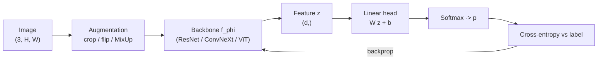
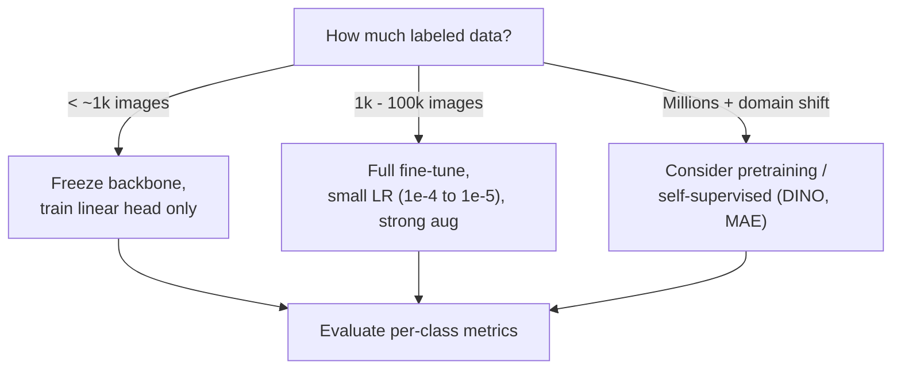
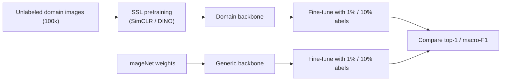

# 4.1 — Image Classification

## 1. Overview

**What is it?** Image classification is the task of assigning one label (or the top-k most likely labels) to an entire image from a fixed set of $C$ categories. Given a photo, the model answers a single question: "What is this?"

**Why does it exist?** It is the simplest computer-vision task with a crisp, measurable objective (accuracy on a held-out set), which made it the perfect benchmark for the deep-learning revolution. AlexNet's 2012 victory on ImageNet — cutting top-5 error from ~26% to ~15% — is the event that convinced the field that deep convolutional networks work at scale.

**What problem does it solve?** It lets machines recognize objects, scenes, and attributes: is this a cat or a dog, a benign or malignant lesion, a defective or intact product? Just as importantly, the *backbones* trained on classification (ResNet, ConvNeXt, ViT) transfer to nearly every downstream vision task — detection ([Object Detection](02-object-detection.md)), segmentation ([Segmentation](03-segmentation.md)), and multimodal models ([Multimodal Models](05-multimodal.md)) all start from a classification-pretrained encoder.

**Where is it used?** Photo organization (Google Photos, Apple Photos), content moderation at every social platform, e-commerce catalog tagging, medical imaging triage, wildlife monitoring, agricultural crop inspection, and manufacturing quality control.

## 2. Learning Objectives

After this chapter you will be able to:

- Formulate image classification as softmax + cross-entropy optimization and derive the gradient of the loss with respect to the logits.
- Explain why transfer learning works and choose between feature extraction, partial fine-tuning, and full fine-tuning.
- Build a complete training pipeline: dataset, transforms, dataloader, model, optimizer, scheduler, evaluation.
- Apply and justify modern augmentation: RandomResizedCrop, ColorJitter, RandAugment, MixUp, and CutMix.
- Use label smoothing and explain mathematically what it does to the target distribution.
- Handle class imbalance with re-sampling, re-weighting, and class-balanced losses.
- Use the `timm` library to access hundreds of pretrained backbones with a one-line API.
- Diagnose fine-grained classification problems and know the standard remedies (higher resolution, stronger backbones, specialized pooling).
- Evaluate with top-1/top-5 accuracy, per-class F1, and confusion matrices, and know when each matters.
- Optimize training and inference with mixed precision, `torch.compile`, and distillation.

## 3. Prerequisites

| Chapter | Why you need it |
|---|---|
| [CNNs](../phase-2-deep-learning/07-cnn.md) | Convolutional backbones (ResNet, ConvNeXt) are the workhorse feature extractors here. |
| [Transformers](../phase-2-deep-learning/10-transformer.md) | Vision Transformers (ViT) treat image patches as tokens; you need attention basics. |
| [Loss Functions](../phase-2-deep-learning/04-loss-functions.md) | Cross-entropy, its gradient, and weighted variants are the core training signal. |
| [Optimizers](../phase-2-deep-learning/05-optimizers.md) | AdamW + cosine schedules are the default classification recipe. |
| [Regularization](../phase-2-deep-learning/06-regularization-dl.md) | Augmentation, label smoothing, and weight decay are regularizers; this chapter builds on those ideas. |
| [Backpropagation](../phase-2-deep-learning/02-backpropagation.md) | Fine-tuning decisions (which layers to freeze) require understanding gradient flow. |

## 4. Intuition

Imagine teaching a child to recognize animals with flashcards. You show a card, the child guesses, you say "right" or "wrong, it's a zebra", and over thousands of cards the child gets better. Image classification training is exactly this loop: show an image, let the network guess a probability for each class, and nudge its weights so the correct class gets more probability next time.

The **analogy for transfer learning**: a radiologist who learns to read chest X-rays does not start from zero when learning to read knee MRIs — she already understands edges, textures, anatomy, and contrast. Similarly, a network pretrained on ImageNet's 1.28M images has already learned generic visual features (edges → textures → parts → objects, layer by layer). To classify your 2,000 photos of machine parts, you keep that visual vocabulary and only re-teach the final "decision layer" — or gently adjust the whole network with a small learning rate.

The **everyday story for augmentation**: if you only ever saw your cat sitting on the same sofa in the same lighting, you might fail to recognize her outdoors at dusk. Augmentation synthetically varies crops, colors, and orientations so the network learns "cat-ness" rather than "this exact pixel arrangement". MixUp goes further: it blends two flashcards together (60% cat + 40% dog) and asks the child to give a blended answer — this discourages overconfident, brittle decisions.

## 5. Real-world Motivation

- **Google Photos** and **Apple Photos** run on-device classifiers so you can search "beach" or "dog" in your library without uploading images.
- **Meta** (Facebook/Instagram) uses classification at massive scale for content moderation (NSFW, violence, spam imagery) and for feed/Explore ranking signals.
- **Amazon** classifies product images into catalog taxonomies and detects listing-policy violations.
- **Tesla** uses classification sub-tasks inside its perception stack (e.g., traffic-light state, lane-type attributes) alongside detection.
- **Medical AI** companies build dermatology lesion classifiers and radiology triage systems; Google Health published dermatology classification work covering hundreds of skin conditions.
- **Manufacturing**: defect classification on production lines (chip wafers, textiles, automotive paint) is one of the highest-ROI industrial CV applications.

The economics: a pretrained backbone plus a few thousand labeled images and a few GPU-hours yields production-grade accuracy for most business categories. This is the cheapest entry point into applied deep learning.

## 6. Mathematical Foundations

### 6.1 Model and softmax

Let $x \in \mathbb{R}^{3 \times H \times W}$ be an input image with height $H$, width $W$, and 3 color channels. A backbone $f_\phi$ (CNN or ViT with parameters $\phi$) maps it to a feature vector $z = f_\phi(x) \in \mathbb{R}^d$, where $d$ is the embedding dimension (2048 for ResNet-50, 768 for ViT-B). A linear head with weights $W \in \mathbb{R}^{C \times d}$ and bias $b \in \mathbb{R}^{C}$ produces **logits**:

$$
o = W z + b \in \mathbb{R}^{C}
$$

Softmax converts logits to a probability distribution over the $C$ classes:

$$
p_k = \frac{e^{o_k}}{\sum_{j=1}^{C} e^{o_j}}, \qquad k = 1, \dots, C
$$

Here $p_k$ is the predicted probability of class $k$; the denominator normalizes so $\sum_k p_k = 1$.

### 6.2 Cross-entropy loss and its gradient

With one-hot target $y \in \{0,1\}^C$ (where $y_c = 1$ for the true class $c$), the cross-entropy loss is:

$$
\mathcal{L}_{CE} = -\sum_{k=1}^{C} y_k \log p_k = -\log p_c
$$

**Derivation of the gradient w.r.t. logits** (a classic interview question). Write $\mathcal{L} = -o_c + \log \sum_j e^{o_j}$. Then:

$$
\frac{\partial \mathcal{L}}{\partial o_k} = -\mathbb{1}[k=c] + \frac{e^{o_k}}{\sum_j e^{o_j}} = p_k - y_k
$$

The gradient is simply **predicted probability minus target** — elegant, bounded in $[-1, 1]$, and numerically stable when softmax and log are fused (as in `nn.CrossEntropyLoss`).

### 6.3 Label smoothing

Instead of a hard one-hot target, label smoothing with coefficient $\epsilon$ (typically 0.1) uses the soft target

$$
\tilde y_k = (1-\epsilon)\, y_k + \frac{\epsilon}{C}
$$

so the loss becomes $\mathcal{L}_{LS} = (1-\epsilon)(-\log p_c) + \frac{\epsilon}{C}\sum_k (-\log p_k)$. Effect: the optimal logit gap between the true class and others becomes finite, preventing over-confident predictions and improving calibration and generalization (used in Inception-v3, ViT, and virtually every modern recipe).

### 6.4 MixUp and CutMix

**MixUp** samples a mixing coefficient $\lambda \sim \mathrm{Beta}(\alpha, \alpha)$ (typically $\alpha = 0.2$) and constructs

$$
\tilde x = \lambda x_i + (1-\lambda) x_j, \qquad \tilde y = \lambda y_i + (1-\lambda) y_j
$$

i.e., a pixel-wise blend of two images with correspondingly blended targets. **CutMix** instead pastes a rectangular patch of image $j$ onto image $i$; the label weight $\lambda$ equals the fraction of area kept from image $i$. Both regularize by forcing linear behavior between training examples and are standard in `timm` training recipes.

### 6.5 Class-imbalanced losses

With $n_k$ samples in class $k$, plain CE is dominated by frequent classes. Remedies:

- **Inverse-frequency weighting**: weight class $k$ by $w_k \propto 1/n_k$ (or $1/\sqrt{n_k}$, gentler).
- **Class-balanced loss** (Cui et al., 2019): $w_k = \frac{1-\beta}{1-\beta^{n_k}}$ with $\beta \approx 0.999$, based on the "effective number of samples".
- **Re-sampling**: oversample rare classes with a `WeightedRandomSampler` so each batch is roughly balanced.
- **Focal loss** (covered in depth in [Object Detection](02-object-detection.md)) down-weights easy examples: $-(1-p_c)^\gamma \log p_c$.

### 6.6 Metrics

- **Top-1 accuracy**: fraction of images whose highest-probability prediction is correct.
- **Top-5 accuracy**: fraction where the true class is among the 5 highest-probability predictions (standard on ImageNet's 1000 classes, where near-synonyms exist).
- **Per-class F1 / confusion matrix**: essential for imbalanced datasets, where 99% accuracy can hide total failure on a 1%-prevalence class.

## 7. Visual Explanation

The end-to-end pipeline:



Transfer-learning decision flow:



ASCII view of what the backbone does spatially (ResNet-style):

```
(3, 224, 224) -> conv stem -> (64, 56, 56) -> stage2 -> (512, 28, 28)
             -> stage3 -> (1024, 14, 14) -> stage4 -> (2048, 7, 7)
             -> global average pool -> (2048,) -> Linear -> (C,)
```

## 8. Algorithm

The standard fine-tuning recipe:

1. **Choose a pretrained backbone** (ResNet-50, ConvNeXt-B, or ViT-B via `timm`), pretrained on ImageNet-1k/21k.
2. **Replace the classification head** with a fresh `Linear(d, C)` for your $C$ classes.
3. **Build augmentation**: train = RandomResizedCrop(224) + HorizontalFlip + RandAugment + MixUp/CutMix; eval = Resize(256) + CenterCrop(224). Normalize with the *same* statistics used in pretraining.
4. **Optimizer**: AdamW, lr ≈ 1e-4 (head can use 10× larger lr than backbone), weight decay 0.05, cosine schedule with 3–5 warmup epochs.
5. **Loss**: cross-entropy with label smoothing 0.1; class-balanced weights or a weighted sampler if imbalanced.
6. **Train** 20–100 epochs with mixed precision; track top-1 on a validation split; keep the best checkpoint (or an EMA of weights).
7. **Evaluate**: top-1/top-5, per-class F1, confusion matrix; inspect the worst classes' errors visually.

Pseudocode:

```text
model = pretrained_backbone(num_classes=C)
opt   = AdamW(model.parameters(), lr=1e-4, weight_decay=0.05)
sched = CosineAnnealing(opt, T_max=epochs, warmup=5)

for epoch in range(epochs):
    for x, y in train_loader:                  # x: (B,3,224,224), y: (B,)
        x, y_soft = mixup_or_cutmix(x, y)      # y_soft: (B,C) soft targets
        with autocast():                       # mixed precision
            logits = model(x)                  # (B, C)
            loss = soft_cross_entropy(logits, y_soft, label_smoothing=0.1)
        loss.backward(); opt.step(); opt.zero_grad()
    sched.step()
    validate(model)                            # top-1, per-class F1
```

## 9. Worked Example

### Tiny example by hand

Suppose $C = 3$ (cat, dog, bird), and the model outputs logits $o = (2.0, 1.0, 0.1)$ for a cat image ($c = \text{cat}$).

1. Exponentials: $e^{2.0} = 7.389$, $e^{1.0} = 2.718$, $e^{0.1} = 1.105$. Sum $= 11.212$.
2. Softmax: $p = (0.659, 0.242, 0.099)$.
3. Cross-entropy loss: $-\log 0.659 = 0.417$.
4. Gradient w.r.t. logits: $p - y = (0.659 - 1, 0.242, 0.099) = (-0.341, 0.242, 0.099)$. The true-class logit gets pushed **up** (negative gradient), the others down.
5. With label smoothing $\epsilon = 0.1$: target becomes $(0.9 + 0.1/3,\ 0.1/3,\ 0.1/3) = (0.933, 0.033, 0.033)$, and the gradient is $p - \tilde y = (-0.274, 0.209, 0.066)$ — a gentler push, which is the whole point.

### Realistic example

Fine-tune ResNet-18 on CIFAR-10 (50k train / 10k test, 10 classes, 32×32 images upscaled to 224): with RandomResizedCrop + flip + RandAugment, AdamW lr 1e-4, cosine schedule, label smoothing 0.1, 100 epochs → typically **~94–95% top-1**. Adding MixUp + CutMix usually gains another ~0.5%. Training from scratch instead of pretrained weights costs roughly 2–3 points at this data scale — that gap is transfer learning's value, and it grows dramatically as your dataset shrinks.

## 10. Python from Scratch

Build the classification head, softmax cross-entropy, and its gradient in pure NumPy. (For the backbone itself, see the from-scratch CNN in [CNNs](../phase-2-deep-learning/07-cnn.md); here we assume features $z$ are given, which is exactly the "linear probe" setting.)

```python
import numpy as np

rng = np.random.default_rng(0)

# ---- Synthetic "features": 200 samples, d=64 dims, C=3 classes ----
# In real transfer learning, z would come from a frozen pretrained backbone.
d, C, N = 64, 3, 200
true_W = rng.normal(size=(C, d))
z = rng.normal(size=(N, d))                      # features, shape (N, d)
y = np.argmax(z @ true_W.T + rng.normal(scale=0.5, size=(N, C)), axis=1)  # labels (N,)

# ---- Trainable linear head ----
W = rng.normal(scale=0.01, size=(C, d))          # weights (C, d)
b = np.zeros(C)                                  # bias (C,)

def softmax(o):
    # Subtract row-max for numerical stability: exp(1000) would overflow.
    o = o - o.max(axis=1, keepdims=True)
    e = np.exp(o)
    return e / e.sum(axis=1, keepdims=True)      # (N, C), rows sum to 1

def forward_loss(z, y, W, b, eps=0.1):
    o = z @ W.T + b                              # logits (N, C)
    p = softmax(o)                               # probabilities (N, C)
    # Label-smoothed targets: (1-eps)*onehot + eps/C
    Y = np.full((len(y), C), eps / C)
    Y[np.arange(len(y)), y] += 1 - eps
    loss = -(Y * np.log(p + 1e-12)).sum(axis=1).mean()
    grad_o = (p - Y) / len(y)                    # dL/dlogits, the p - y result
    return loss, p, grad_o

lr = 0.5
for step in range(300):
    loss, p, grad_o = forward_loss(z, y, W, b)
    # Backprop through the linear layer: o = z W^T + b
    grad_W = grad_o.T @ z                        # (C, d)
    grad_b = grad_o.sum(axis=0)                  # (C,)
    W -= lr * grad_W
    b -= lr * grad_b
    if step % 100 == 0:
        acc = (p.argmax(1) == y).mean()
        print(f"step {step:3d}  loss {loss:.3f}  top-1 {acc:.2%}")

# Expected output: loss falls from ~1.1 toward ~0.5 (label smoothing puts a
# floor on the loss); top-1 climbs above 95% on this separable toy data.
```

Complexity: each step is $O(N d C)$ for the matrix products. **Common bug**: forgetting the row-max subtraction in softmax — with real logits in the tens, `np.exp` overflows to `inf` and the loss becomes `nan`.

## 11. Library Implementation

A complete, production-shaped PyTorch fine-tuning script using `timm`:

```python
import torch, torch.nn as nn
import timm
from timm.data import resolve_data_config, create_transform
from timm.data.mixup import Mixup
from torch.utils.data import DataLoader
from torchvision import datasets

device = "cuda" if torch.cuda.is_available() else "cpu"
NUM_CLASSES = 10

# 1) Backbone: any of ~1000 pretrained models by name. num_classes replaces the head.
model = timm.create_model("convnext_tiny", pretrained=True,
                          num_classes=NUM_CLASSES).to(device)

# 2) Transforms matched to the model's pretraining (input size, mean/std).
cfg = resolve_data_config({}, model=model)
train_tf = create_transform(**cfg, is_training=True,
                            auto_augment="rand-m9-mstd0.5")  # RandAugment
val_tf   = create_transform(**cfg, is_training=False)

train_ds = datasets.ImageFolder("data/train", train_tf)
val_ds   = datasets.ImageFolder("data/val", val_tf)
train_dl = DataLoader(train_ds, batch_size=64, shuffle=True,
                      num_workers=4, pin_memory=True)
val_dl   = DataLoader(val_ds, batch_size=128, num_workers=4)

# 3) MixUp + CutMix: timm's Mixup handles both and produces soft targets.
mixup = Mixup(mixup_alpha=0.2, cutmix_alpha=1.0,
              label_smoothing=0.1, num_classes=NUM_CLASSES)

# 4) Optimizer: lower LR for pretrained backbone, higher for the fresh head.
head_params = [p for n, p in model.named_parameters() if "head" in n]
body_params = [p for n, p in model.named_parameters() if "head" not in n]
opt = torch.optim.AdamW([{"params": body_params, "lr": 1e-4},
                         {"params": head_params, "lr": 1e-3}],
                        weight_decay=0.05)
sched = torch.optim.lr_scheduler.CosineAnnealingLR(opt, T_max=30)
scaler = torch.amp.GradScaler()                     # mixed precision
crit = nn.CrossEntropyLoss()                        # accepts soft targets

for epoch in range(30):
    model.train()
    for x, y in train_dl:
        x, y = x.to(device), y.to(device)
        x, y_soft = mixup(x, y)                     # y_soft: (B, C) soft labels
        with torch.autocast(device_type="cuda", dtype=torch.float16):
            loss = crit(model(x), y_soft)
        scaler.scale(loss).backward()
        scaler.step(opt); scaler.update(); opt.zero_grad()
    sched.step()

    # Validation: no MixUp, no augmentation, model.eval() disables dropout/BN updates.
    model.eval(); correct = total = 0
    with torch.no_grad():
        for x, y in val_dl:
            pred = model(x.to(device)).argmax(1).cpu()
            correct += (pred == y).sum().item(); total += len(y)
    print(f"epoch {epoch}: top-1 {correct/total:.2%}")
```

**Common bug**: normalizing with your own dataset statistics instead of the pretraining statistics baked into `resolve_data_config` — the backbone then sees inputs from a shifted distribution and accuracy drops several points silently.

## 12. Code Walkthrough

Tensor shapes through the pipeline (ConvNeXt-Tiny, batch size $B = 64$, $C = 10$):

| Tensor | Shape | Meaning |
|---|---|---|
| `x` | (64, 3, 224, 224) | Batch of normalized RGB images |
| `y` | (64,) | Integer class indices |
| `y_soft` after MixUp | (64, 10) | Soft (blended + smoothed) target distributions |
| backbone features | (64, 768, 7, 7) | Final spatial feature map |
| pooled features `z` | (64, 768) | Global-average-pooled embedding |
| logits | (64, 10) | Pre-softmax scores |
| `loss` | scalar | Mean soft cross-entropy over the batch |

Inputs: image folder with one subdirectory per class. Outputs: a checkpoint achieving (on a typical 10-class, ~10k-image dataset) **92–97% top-1** after 30 epochs. Intermediate values worth logging: training loss per 100 steps (should fall smoothly; MixUp keeps it higher than un-mixed loss — that is expected, not a bug), learning rate, and validation top-1 per epoch. Expected behavior: validation accuracy rises quickly for ~5 epochs (mostly the head learning), then improves slowly as the backbone adapts.

## 13. Complexity Analysis

- **Time (forward)**: $O(\text{FLOPs of backbone})$ per image. Reference points: ResNet-50 ≈ 4.1 GFLOPs, ConvNeXt-T ≈ 4.5 GFLOPs, ViT-B/16 ≈ 17.6 GFLOPs at 224². ViT FLOPs scale *quadratically* in token count, hence quadratically in resolution ($(H/16)^2$ tokens); CNN FLOPs scale linearly in pixel count.
- **Time (training)**: forward + backward ≈ 3× forward FLOPs, times dataset size × epochs. Fine-tuning ResNet-50 on 10k images for 30 epochs is minutes on a single modern GPU.
- **Space**: weights are 25M params (~100 MB fp32) for ResNet-50, 86M (~350 MB) for ViT-B. During training, **activations dominate**: they scale with batch size × resolution and typically use several GB; this is why gradient checkpointing and mixed precision matter.
- **Inference latency**: 1–10 ms/image on a data-center GPU; tens of ms on mobile NPUs for MobileNet-class models.

## 14. Advantages

- **Mature and reliable**: for common categories, fine-tuned classifiers reach human-level accuracy — e.g., ImageNet top-5 error dropped below the ~5% human benchmark back in 2015.
- **Cheap transfer learning**: a few hundred labeled images per class often suffice; a retail team can build a 50-class product classifier in a day.
- **Simple deployment**: one forward pass, one argmax — no post-processing like NMS; easy to serve behind a REST API or on-device.
- **Foundation for everything else**: the same backbones power detection, segmentation, and CLIP-style models, so classification skills transfer directly.
- **Interpretable evaluation**: confusion matrices point straight at problem classes (e.g., "husky vs. wolf"), guiding targeted data collection.

## 15. Disadvantages

- **One label per image**: fails when images contain multiple objects of interest — a street scene is not "a car"; you need [detection](02-object-detection.md) or multi-label formulations.
- **No localization**: the model cannot tell you *where* the object is (Grad-CAM heatmaps are approximate diagnostics, not outputs).
- **Labeled-data hunger for rare/fine-grained classes**: distinguishing 200 bird species needs expert labels; generic ImageNet features are often insufficient without higher resolution and targeted fine-tuning.
- **Spurious correlations**: models latch onto backgrounds (cows on grass) and fail out-of-distribution (cows on beaches) — a documented failure mode.
- **Calibration issues**: raw softmax confidences are typically overconfident; safety-critical uses need temperature scaling or conformal methods.

## 16. Common Mistakes

- **Wrong normalization statistics**: using `[0.5, 0.5, 0.5]` when the backbone was pretrained with ImageNet stats `[0.485, 0.456, 0.406] / [0.229, 0.224, 0.225]`. Fix: derive transforms from the model config (`timm`'s `resolve_data_config`).
- **Forgetting `model.eval()` at validation/inference**: BatchNorm keeps updating running stats and dropout stays active, corrupting both metrics and the model. Fix: `model.eval()` + `torch.no_grad()`.
- **Training only the head when full fine-tuning would win**: linear probing is right for tiny datasets, but with thousands of images per class, full fine-tuning at low LR typically gains several points.
- **Too high a learning rate on pretrained weights**: 1e-2 destroys pretrained features in the first epochs ("catastrophic forgetting"). Use 1e-4/1e-5 with warmup.
- **Evaluating with training augmentation**: RandomResizedCrop at eval time adds noise to your metric; use deterministic Resize + CenterCrop.
- **Judging imbalanced data by accuracy**: 99% accuracy on a 1%-positive dataset can mean the model predicts the majority class always. Report per-class F1.
- **Data leakage between splits**: near-duplicate frames (video, burst photos) landing in both train and val inflate accuracy. Deduplicate before splitting.

## 17. Best Practices

Production checklist:

- [ ] Start from a pretrained backbone via `timm`; only train from scratch with millions of images.
- [ ] Match input size and normalization to the pretraining config.
- [ ] AdamW + cosine schedule + 3–5 epoch warmup; head LR 10× backbone LR.
- [ ] Label smoothing 0.1; MixUp (α=0.2) + CutMix (α=1.0) for datasets > ~5k images.
- [ ] `WeightedRandomSampler` or class-balanced loss when imbalance exceeds ~10:1.
- [ ] Keep an EMA (exponential moving average) of weights; evaluate the EMA model.
- [ ] Version your datasets; log a confusion matrix every epoch; review the top-20 most-confident errors by eye.
- [ ] Calibrate confidences (temperature scaling on the validation set) before exposing probabilities to users.
- [ ] Export to ONNX/TensorRT and verify numerical parity (max abs diff < 1e-3) before deployment.
- [ ] Monitor input distribution drift in production (e.g., new camera, new lighting) — the silent killer of deployed classifiers.

## 18. Optimization Techniques

- **Mixed precision (AMP)**: fp16/bf16 forward-backward roughly doubles throughput and halves activation memory; use `torch.autocast` + `GradScaler` (fp16) or plain autocast (bf16 on A100/H100).
- **`torch.compile`**: graph-compiles the model; typically 20–50% speedup on modern GPUs with one line.
- **channels-last memory format**: `model.to(memory_format=torch.channels_last)` speeds up convolutions on tensor cores by ~10–30%.
- **Larger effective batch via gradient accumulation** when GPU memory is tight.
- **Gradient checkpointing** for large ViTs: recompute activations in backward, trading ~30% time for ~60% activation memory.
- **Inference**: export to TensorRT/ONNX Runtime; INT8 quantization (post-training or QAT) gives 2–4× speedup with <0.5% accuracy loss for most backbones.
- **Distillation**: train a MobileNetV3/EfficientNet-Lite student from your fine-tuned teacher's soft logits for edge deployment; commonly recovers 95–99% of teacher accuracy at 5–10× lower latency.
- **Test-time augmentation (TTA)**: average predictions over flips/crops for +0.2–0.5% accuracy when latency permits.

## 19. Industry Applications

- **Google Photos / Apple Photos**: on-device scene and object classification powering library search — a production example of distilled, quantized mobile classifiers.
- **Content moderation**: Meta, YouTube, and TikTok classify uploaded media for policy violations at billions-of-images scale; recall on rare harmful classes is the KPI, driving class-imbalance techniques.
- **E-commerce**: Amazon and Shopify-ecosystem tools classify product photos into taxonomy nodes and detect image-quality issues.
- **Healthcare**: dermatology assistants (Google's DermAssist research), diabetic-retinopathy screening deployed in India and Thailand, pathology slide triage (PathAI).
- **Agriculture & conservation**: plant-disease classification apps for farmers; Wildlife Insights classifies camera-trap species to accelerate ecology research.
- **Manufacturing**: wafer-defect classification at semiconductor fabs; automotive paint and weld inspection — often the *production example* with the strictest latency and reliability budgets.

## 20. Interview Questions

### Beginner

**Q1. What does softmax do, and why do we pair it with cross-entropy?**
A: Softmax maps arbitrary real logits to a probability distribution (positive, sums to 1). Cross-entropy then measures how much probability the model assigns to the true class ($-\log p_c$). Paired, they yield the simple, stable gradient $p - y$ on the logits.

**Q2. What is the difference between top-1 and top-5 accuracy?**
A: Top-1 counts a prediction correct only if the argmax class is right; top-5 counts it correct if the true class appears in the five highest-probability predictions. Top-5 is standard on ImageNet because among 1000 fine-grained classes several answers can be defensible.

**Q3. Why do we normalize images with the pretraining mean and std?**
A: The pretrained backbone learned features for inputs in a specific distribution. Feeding differently-scaled inputs shifts every activation, degrading features. Normalization statistics are part of the model contract.

**Q4. What is transfer learning and when should you freeze the backbone?**
A: Reusing a network pretrained on a large dataset for a new task. Freeze the backbone (train only the head) when data is very scarce (hundreds of images) or when compute is limited; fine-tune everything at low LR when you have thousands of images or a domain shift.

**Q5. Why must you call `model.eval()` before validation?**
A: It switches BatchNorm to use fixed running statistics and disables dropout. Without it, metrics are computed with stochastic/incorrectly-normalized forward passes and BN statistics get polluted by validation data.

### Intermediate

**Q1. Derive the gradient of softmax cross-entropy with respect to the logits.**
A: $\mathcal{L} = -o_c + \log\sum_j e^{o_j}$, so $\partial \mathcal{L} / \partial o_k = -\mathbb{1}[k=c] + p_k = p_k - y_k$. See §6.2 for the step-by-step version.

**Q2. How do MixUp and CutMix differ, and why do they help?**
A: MixUp blends two whole images pixel-wise with weight $\lambda \sim \mathrm{Beta}(\alpha,\alpha)$ and blends labels identically; CutMix pastes a rectangular region of one image into another, weighting labels by area. Both create dense soft-labeled interpolations that regularize decision boundaries, reduce overconfidence and memorization, and improve robustness. CutMix additionally preserves local image statistics, often training better localizable features.

**Q3. Your dataset is 100:1 imbalanced. Walk through your options.**
A: (1) Re-sampling: oversample minorities with a weighted sampler — simple, effective, risk of overfitting rare samples; (2) re-weighting: inverse-frequency or class-balanced ($\frac{1-\beta}{1-\beta^{n_k}}$) loss weights; (3) focal loss to focus on hard examples; (4) collect/synthesize more minority data; (5) two-stage: train on balanced sampling, then fine-tune the head on the true distribution. Always evaluate with per-class F1, not accuracy.

**Q4. What does label smoothing do to the optimal logits?**
A: With hard targets, CE keeps pushing the true-class logit toward $+\infty$ relative to others. With smoothing $\epsilon$, the optimum is a finite logit gap of $\log\frac{(1-\epsilon)(C-1) + \epsilon\,(C-1)/C \cdot C}{\epsilon}$-order — practically, it caps confidence, improves calibration, and slightly improves generalization, at the cost of less-separated features (which can hurt distillation).

**Q5. CNN vs ViT for classification — how do you choose?**
A: With small-to-medium data (<100k images), CNNs/ConvNeXt or heavily-augmented ViTs (DeiT recipes) perform similarly; vanilla ViTs need more data or stronger regularization because they lack convolutional inductive biases (locality, translation equivariance). At large scale, ViTs scale better and dominate. Also consider resolution scaling (ViT cost grows quadratically) and deployment hardware (CNNs are friendlier to some edge accelerators).

### Advanced

**Q1. Why does high accuracy on a validation set sometimes not transfer to production?**
A: Distribution shift (new cameras, demographics, seasons), spurious correlations learned from the training set (background, watermarks), leakage between train/val (near-duplicates), and label noise whose structure differs in production. Mitigations: careful split hygiene, out-of-distribution test sets, error audits, drift monitoring, and retraining pipelines.

**Q2. Explain fine-grained classification and three techniques that help.**
A: Fine-grained tasks distinguish visually similar subcategories (bird species, car models) where discriminative cues are small local parts. Helps: (1) higher input resolution (448²+) so parts are resolvable; (2) stronger/pretrained-on-larger-data backbones (ImageNet-21k, CLIP encoders); (3) specialized pooling or part-attention (bilinear pooling, attention over patches), plus aggressive augmentation and long training. Also curated hard-negative mining.

**Q3. How would you distill a large classifier into a mobile one, and why do soft labels help?**
A: Train the student on a weighted sum of hard-label CE and KL divergence to the teacher's temperature-softened logits: soft labels carry "dark knowledge" — inter-class similarity structure (this husky image is 70% husky, 25% malamute) — a richer, per-example training signal than one-hot labels, improving student generalization especially with limited data.

**Q4. Your model is overconfident. How do you calibrate it and how do you measure calibration?**
A: Measure with Expected Calibration Error (ECE) and reliability diagrams (bin predictions by confidence, compare to empirical accuracy). Fix cheaply with temperature scaling: learn a single scalar $T$ on validation data minimizing NLL of $\mathrm{softmax}(o/T)$; it changes confidences but not the argmax. Label smoothing and MixUp during training also improve calibration.

**Q5. When does test-time augmentation help and what is its cost?**
A: TTA averages predictions over deterministic transforms (horizontal flip, multi-crop), reducing variance from pose/crop sensitivity — typically +0.2–0.5% top-1. Cost is a multiplicative inference-latency factor equal to the number of views, so it suits offline/batch scoring, not real-time serving.

## 21. Coding Exercises

### Easy

1. **Linear probe**: load `timm` ResNet-50, freeze all parameters, train only a new `Linear` head on CIFAR-10. Report top-1. *Hint: set `requires_grad=False` on backbone params and pass only head params to the optimizer.*
2. **Confusion matrix**: after training, compute and plot a 10×10 confusion matrix and print the three most-confused class pairs. *Hint: `sklearn.metrics.confusion_matrix`, then argsort off-diagonal entries.*

### Medium

1. **MixUp from scratch**: implement MixUp (sample $\lambda \sim \mathrm{Beta}(0.2, 0.2)$, permute the batch, blend images and one-hot labels) and verify training loss stays higher but validation accuracy improves. *Hint: `torch.randperm(B)` gives the pairing; the loss must accept soft targets.*
2. **Imbalance study**: subsample CIFAR-10 so one class has 50× fewer images; compare plain CE vs weighted sampler vs class-balanced loss on per-class recall. *Hint: `WeightedRandomSampler` with weights $1/n_{y_i}$.*
3. **Backbone bake-off**: with identical training budgets, compare `efficientnet_b0`, `convnext_tiny`, and `vit_small_patch16_224` from `timm` on your dataset; report accuracy vs latency (ms/image). *Hint: time with `torch.cuda.Event` after warmup.*

### Hard

1. **Full modern recipe**: reproduce a timm-style training run (RandAugment + MixUp + CutMix + label smoothing + EMA + cosine) and ablate each component, reporting the accuracy delta of removing it. *Hint: fix seeds and data order to isolate effects.*
2. **Grad-CAM auditor**: implement Grad-CAM, generate heatmaps for the model's 50 most-confident *errors*, and identify a spurious correlation in your data. *Hint: hook the last conv layer's activations and gradients; weight channels by pooled gradients.*
3. **INT8 deployment**: export your model to ONNX, apply post-training INT8 quantization, and report accuracy delta and CPU latency speedup. *Hint: calibrate with ~500 representative images.*

## 22. Mini Project

**Cats-vs-dogs classifier with a web API.**

1. Download the Kaggle Cats vs Dogs dataset (~25k images); split 80/10/10 train/val/test, deduplicating first.
2. Fine-tune `timm` `resnet18` (pretrained) for 5 epochs with RandomResizedCrop + flip; expect >98% test accuracy.
3. Add label smoothing 0.1 and compare validation confidence histograms with and without it.
4. Export the model with `torch.jit.script` or ONNX.
5. Wrap it in a FastAPI endpoint: accept an uploaded image, apply eval transforms, return `{"label": ..., "confidence": ...}`.
6. Add a confidence threshold below which the API returns "uncertain" — measure how many test images fall there.

## 23. Medium Project

**Fine-grained species classifier (100 bird classes) with imbalance handling.**

1. Take a 100-class subset of iNaturalist or CUB-200; keep the natural long-tailed class distribution.
2. Baseline: fine-tune `convnext_tiny` at 224²; log per-class F1 and identify the 10 worst classes.
3. Add class-balanced sampling and MixUp/CutMix; quantify per-class recall improvement on tail classes.
4. Increase resolution to 384² and measure the fine-grained gain vs. the ~3× FLOPs cost.
5. Add EMA weights and TTA (horizontal flip); report final macro-F1 and a confusion matrix.
6. Write a one-page error analysis: which species pairs are confused and why (plumage, pose, background)?

## 24. Advanced Project

**Self-supervised pretraining vs supervised transfer under label scarcity.**

Architecture: a two-phase pipeline — (1) self-supervised pretraining (SimCLR or DINO) on ~100k *unlabeled* domain images; (2) fine-tuning with only 1% and 10% labeled subsets; compared against an ImageNet-supervised baseline.



Implementation phases:

1. Assemble the unlabeled corpus; build the augmentation pipeline SSL requires (two random views per image).
2. Implement/borrow SimCLR (contrastive InfoNCE — the same loss family you will meet in [Multimodal Models](05-multimodal.md)) or run DINO via its reference repo; pretrain ~100–300 epochs.
3. Create stratified 1% and 10% labeled splits; fine-tune both backbones identically.
4. Evaluate: top-1, macro-F1, and per-class recall; also run linear probes to compare raw feature quality.
5. Ablate: augmentation strength, pretraining epochs, and projection-head design.

Possible improvements: semi-supervised fine-tuning (FixMatch pseudo-labeling) on top of the SSL backbone; distill the winner into a MobileNet for edge deployment; test robustness on a corrupted-image benchmark (CIFAR-C-style).

## 25. Summary

- Image classification = backbone features → linear head → softmax → cross-entropy; the logit gradient is simply $p - y$.
- Transfer learning from ImageNet-pretrained backbones is the default; full fine-tuning at low LR usually beats head-only training once you have thousands of images.
- Augmentation is the biggest single lever: RandomResizedCrop + flips always; RandAugment + MixUp + CutMix for medium+ datasets.
- Label smoothing (ε = 0.1) caps confidence, improves calibration, and is in every modern recipe.
- Handle class imbalance explicitly — weighted sampling or class-balanced losses — and evaluate with per-class F1, never plain accuracy.
- `timm` gives you ~1000 pretrained backbones, correct transforms, and MixUp utilities in a few lines.
- Fine-grained classification needs higher resolution, stronger backbones, and targeted data work.
- Always: pretraining-matched normalization, `model.eval()` at inference, deduplicated splits.
- Optimize with AMP, `torch.compile`, channels-last, and INT8/distillation for deployment.
- Classification backbones and skills are the foundation for detection, segmentation, and multimodal chapters ahead.

## 26. Cheat Sheet

| Formula | Meaning |
|---|---|
| $p_k = e^{o_k}/\sum_j e^{o_j}$ | Softmax over logits |
| $\mathcal{L}_{CE} = -\log p_c$ | Cross-entropy, true class $c$ |
| $\partial\mathcal{L}/\partial o_k = p_k - y_k$ | Logit gradient |
| $\tilde y = (1-\epsilon)y + \epsilon/C$ | Label smoothing target |
| $\tilde x = \lambda x_i + (1-\lambda)x_j$ | MixUp, $\lambda\sim\mathrm{Beta}(\alpha,\alpha)$ |
| $w_k = \frac{1-\beta}{1-\beta^{n_k}}$ | Class-balanced weight |

Defaults that work: AdamW lr 1e-4 (backbone) / 1e-3 (head), wd 0.05, cosine + 5-epoch warmup, label smoothing 0.1, MixUp α 0.2, CutMix α 1.0, batch 64–256, 30–100 epochs, EMA decay 0.999.

One-liners: `timm.create_model(name, pretrained=True, num_classes=C)`; eval transform = Resize(256) + CenterCrop(224); ImageNet stats mean `[0.485,0.456,0.406]`, std `[0.229,0.224,0.225]`.

Gotchas: `model.eval()` before validation; pretraining-matched normalization; per-class F1 for imbalance; MixUp raises train loss by design; don't RandomResizedCrop at eval.

## 27. Further Reading

**Books**
- Goodfellow, Bengio, Courville — *Deep Learning* (ch. 9, CNNs).
- Howard & Gugger — *Deep Learning for Coders with fastai and PyTorch* (practical fine-tuning recipes).

**Research Papers**
- Krizhevsky et al., "ImageNet Classification with Deep CNNs" (AlexNet, 2012).
- He et al., "Deep Residual Learning" (ResNet, 2015).
- Dosovitskiy et al., "An Image is Worth 16×16 Words" (ViT, 2020).
- Liu et al., "A ConvNet for the 2020s" (ConvNeXt, 2022).
- Zhang et al., "mixup: Beyond Empirical Risk Minimization" (2017); Yun et al., "CutMix" (2019).
- Cubuk et al., "RandAugment" (2019); Cui et al., "Class-Balanced Loss" (2019).
- Touvron et al., "DeiT: Data-efficient Image Transformers" (2020).

**Documentation**
- `timm` documentation (Hugging Face); torchvision models & transforms docs; PyTorch AMP docs.

**GitHub Repositories**
- `huggingface/pytorch-image-models` (timm); `facebookresearch/dino`; `google-research/simclr`.

**Datasets**
- ImageNet-1k, CIFAR-10/100, Oxford-IIIT Pets, CUB-200-2011, iNaturalist, Food-101.

**YouTube/Videos**
- Stanford CS231n lectures (image classification, CNNs); Andrej Karpathy's CS231n classics.

**Blogs**
- timm training recipe write-ups (Ross Wightman); PyTorch blog posts on `torch.compile` and channels-last performance.
