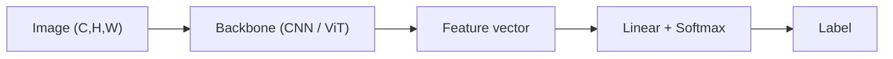

# 4.1 — Image Classification

## 1. Intuition first
Given an image, predict one label (or top-k labels) from a fixed set. It is the "Hello World" of computer vision and the pretraining task for most CV backbones.

## 2. Why the topic exists
Foundational task with clear metrics; drove the deep-learning revolution (AlexNet 2012). Backbones trained on ImageNet transfer to nearly every downstream vision task.

## 3. What problem it solves
Recognize objects / scenes / attributes.

## 4. Mathematics
- Model: CNN or ViT → feature vector → linear head → softmax → cross-entropy.
- Metrics: top-1 / top-5 accuracy, confusion matrix, per-class F1.
- Data augmentation is often the biggest lever (Random-Resized-Crop, ColorJitter, MixUp, CutMix, RandAugment).

## 5. Every formula explained
Softmax CE = standard. Label smoothing $L = (1-\epsilon) L_{ce} + \epsilon \bar L$ regularizes.

## 6. Variables
$C$ classes, $H\times W$ image size, batch $B$, top-k.

## 7. Algorithm — training recipe
1. Load pretrained backbone (ResNet-50, ConvNeXt, ViT-B).
2. Replace head with `Linear(d, C)`.
3. Fine-tune with strong augmentation, cosine schedule, AdamW, label smoothing.
4. Use class-balanced sampling for imbalanced data.
5. Evaluate top-1, top-5, per-class.

## 8. Simple example
Fine-tune ResNet-18 on CIFAR-10 → 94% in 100 epochs with basic aug.

## 9. Real-world example
- Google Photos, iOS Photos: on-device classification.
- Instagram Explore tagging.
- Retail: product image classification.
- Medical: dermatology lesion classification.

## 10. Diagram


## 11. Implementation from scratch
See 2.7 for CNN and 2.10 for ViT. Add cross-entropy + augmentation.

## 12. Implementation using libraries
```python
import torch, torch.nn as nn
from torchvision import models, transforms, datasets

tf = transforms.Compose([
    transforms.RandomResizedCrop(224), transforms.RandomHorizontalFlip(),
    transforms.ToTensor(), transforms.Normalize([0.485,0.456,0.406],[0.229,0.224,0.225]),
])
train = datasets.ImageFolder("data/train", tf)
loader = torch.utils.data.DataLoader(train, batch_size=64, shuffle=True, num_workers=4)

model = models.resnet50(weights="IMAGENET1K_V2")
model.fc = nn.Linear(model.fc.in_features, num_classes)
```

Even easier: `timm` (`create_model("convnext_base", pretrained=True, num_classes=C)`).

## 13. Time complexity
Forward per image: O(FLOPs of backbone). ResNet-50 ≈ 4 GFLOPs.

## 14. Space complexity
Model 100MB–1GB; activations dominant during training.

## 15. Advantages
Solved for common categories; pretrained backbones are ubiquitous.

## 16. Disadvantages
Requires labeled data (mitigated by transfer learning / SSL); struggles with fine-grained categories without special training.

## 17. Interview questions
1. Softmax + CE gradient derivation.
2. Explain top-1 vs top-5 accuracy.
3. Data augmentation strategies.
4. Class imbalance mitigations.
5. CNN vs ViT for classification.
6. Transfer learning vs fine-tune vs feature extract.
7. What is label smoothing?
8. Effect of larger input resolution.
9. Test-time augmentation.
10. Fine-grained classification challenges.

## 18. Common mistakes
- Using wrong normalization stats.
- Forgetting `model.eval()` / dropout at inference.
- Training only the head when full fine-tune would work better.

## 19. Optimization techniques
Mixed precision, `torch.compile`, channels-last memory format, TensorRT for inference, distillation to MobileNet for edge.

## 20. Coding exercises
1. Fine-tune ResNet-50 on 5-class custom dataset.
2. Reproduce a top-1 accuracy on a small subset with strong augmentation.
3. Try `timm` with EfficientNet vs ConvNeXt.
4. Add MixUp + CutMix.

## 21. Mini project
Cat vs dog classifier with FastAPI serving.

## 22. Medium project
Fine-grained classification on iNaturalist subset (100 species).

## 23. Advanced project
Self-supervised pretraining (SimCLR or DINO) on unlabeled images → fine-tune with 1% labels; compare with supervised.

## 24. Where it is used in industry
Photo organizers, e-commerce, moderation, medical imaging, wildlife monitoring.

## 25. How companies use it
- Google Photos, Apple Photos, Facebook Photo tagging.
- Content moderation at every social platform.
- Retail catalog classification.

## 26. When NOT to use it
- Multi-label / localized tasks — use detection / segmentation.
- Extremely rare-class problems without pretraining or SSL.
