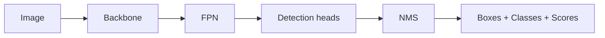

# 4.2 — Object Detection

## 1. Intuition first
Instead of one label per image, detection outputs **many boxes** — each with a class label and confidence. It answers "*what* is *where* in this image?"

## 2. Why the topic exists
Real-world perception needs both categorization and localization: self-driving, security, robotics, retail analytics.

## 3. What problem it solves
Localize + classify objects, handle multiple instances per image, real-time inference.

## 4. Mathematics

### 4.1 Bounding-box representation
$(x_1, y_1, x_2, y_2)$ or $(x_c, y_c, w, h)$ (YOLO style).

### 4.2 IoU (Intersection over Union)
$$
\text{IoU}(A, B) = \frac{|A \cap B|}{|A \cup B|}
$$

### 4.3 Losses
- Classification: BCE / focal loss.
- Box regression: L1, Smooth-L1, GIoU/DIoU/CIoU.
- Objectness (YOLO): BCE.

### 4.4 Non-Maximum Suppression (NMS)
Greedy: sort by confidence, keep highest, remove overlapping (IoU > τ). Soft-NMS decays scores instead.

### 4.5 Two-stage detectors (Faster R-CNN)
Region Proposal Network → ROI features → head classifies + refines boxes.

### 4.6 One-stage detectors (YOLO, SSD, RetinaNet)
Predict boxes directly at multiple scales; faster, comparable accuracy with focal loss.

### 4.7 Transformer detectors (DETR)
Set prediction with Hungarian matching; no NMS.

### 4.8 Anchor vs anchor-free
YOLOv3/v4 use anchors. YOLOv6/v8, FCOS, DETR are anchor-free.

## 5. Every formula explained
- IoU thresholds define positive matches (typically 0.5).
- Focal loss $-\alpha_t (1-p_t)^\gamma \log p_t$ addresses foreground/background imbalance.
- GIoU generalizes IoU to non-overlapping boxes.

## 6. Variables
Anchor scales/aspect ratios; feature-pyramid levels; class-count; IoU thresholds.

## 7. Algorithm — YOLO v8 sketch
1. Backbone (CSPDarknet / EfficientNet).
2. Neck (FPN + PAN) fuses multi-scale features.
3. Head predicts (box, class, objectness) at each grid cell / anchor.
4. Losses: BCE + CIoU + distribution focal loss.
5. NMS post-processing (unless anchor-free set prediction).

## 8. Simple example
Detect pedestrians in a dash-cam image: model outputs 12 boxes, 3 kept after NMS.

## 9. Real-world example
- Tesla Autopilot perception.
- Retail shelf monitoring.
- Sports analytics (ball / player detection).
- Wildlife camera-trap analysis.

## 10. Diagram
```
Image → Backbone → FPN → Heads → NMS → boxes+classes
```



## 11. Implementation from scratch
Substantial (thousands of LOC). Study a minimal repo like `nanoDetR` or `yolov5-lite` for structure.

## 12. Implementation using libraries
```python
from ultralytics import YOLO
model = YOLO("yolov8n.pt")
model.train(data="my_coco.yaml", epochs=100, imgsz=640)
res = model("frame.jpg")
res[0].plot()          # visualize
```

Others: `torchvision.models.detection`, `mmdetection`, `detectron2` (Faster R-CNN, Mask R-CNN, DETR).

## 13. Time complexity
YOLOv8n: ~ ms per image on modern GPU. Larger variants slower.

## 14. Space complexity
Models 10–200 MB; activations depend on input resolution.

## 15. Advantages
Real-time; strong pretrained models available; fine-tune with hundreds of images.

## 16. Disadvantages
Annotation-hungry; small-object detection is hard; NMS artifacts.

## 17. Interview questions
1. Define IoU and its role.
2. How does NMS work? Soft-NMS?
3. Anchor vs anchor-free.
4. One-stage vs two-stage detectors.
5. What is focal loss and why?
6. FPN — feature pyramid rationale.
7. DETR — set prediction; Hungarian matching.
8. Evaluation: mAP at different IoU (COCO metric).
9. Data augmentation for detection (mosaic, mixup, hsv).
10. How to detect very small objects.

## 18. Common mistakes
- Wrong annotation format (xyxy vs xywh).
- No mosaic aug at start of training.
- Test-time image size differing from training.
- Class imbalance not addressed.

## 19. Optimization techniques
TensorRT, ONNX, INT8 quantization, distillation to YOLOv8n / MobileNet, multi-scale training, TTA.

## 20. Coding exercises
1. Train YOLOv8 on a small custom dataset (Roboflow).
2. Evaluate mAP@[0.5:0.95] on COCO val.
3. Convert model to ONNX; benchmark on CPU.
4. Implement NMS from scratch.

## 21. Mini project
Real-time webcam object detector with Streamlit / Gradio.

## 22. Medium project
Traffic-flow analyzer counting vehicles and estimating speed from video.

## 23. Advanced project
Reproduce DETR from scratch and beat it with an efficient variant (Deformable DETR / RT-DETR) on COCO subset.

## 24. Where it is used in industry
Self-driving, robotics, security cameras, sports analytics, retail, agriculture, wildlife.

## 25. How companies use it
- Tesla, Waymo, Cruise for perception.
- Amazon Go stores.
- Sports broadcasters (Second Spectrum).

## 26. When NOT to use it
- When exact pixel masks matter → use segmentation.
- Extremely resource-constrained edge without acceleration.
