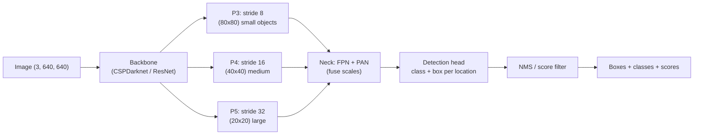
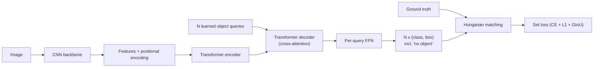
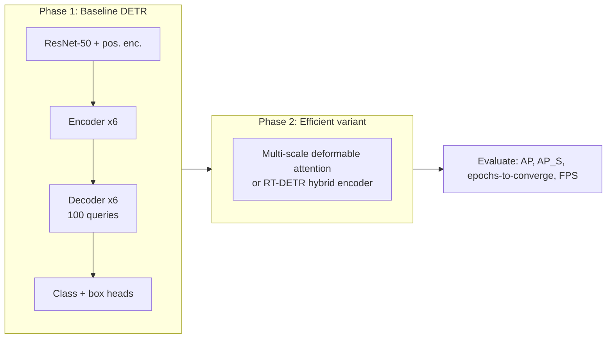

# 4.2 — Object Detection

## 1. Overview

**What is it?** Object detection extends classification from "what is in this image?" to "**what** is **where**?" Instead of one label per image, a detector outputs a variable-length set of predictions, each consisting of a bounding box, a class label, and a confidence score.

**Why does it exist?** Real-world perception rarely deals with one centered object. A street scene contains dozens of cars, pedestrians, and signs; a retail shelf holds hundreds of products. Detection was the natural next step after classification matured, and it forced the field to solve new problems: localization, handling multiple instances, extreme foreground/background imbalance, and duplicate suppression.

**What problem does it solve?** Simultaneous localization and classification of every object instance in an image, often in real time (30+ FPS for driving and video analytics).

**Where is it used?** Autonomous driving (Tesla, Waymo), cashierless retail (Amazon Go), security and traffic cameras, sports analytics, robotics grasping, agriculture (fruit counting), and wildlife camera traps.

## 2. Learning Objectives

After this chapter you will be able to:

- Represent bounding boxes in the two standard formats and convert between them.
- Compute IoU by hand and explain its role in matching, NMS, and evaluation.
- Implement Non-Maximum Suppression (NMS) from scratch and explain Soft-NMS.
- Derive focal loss and explain why one-stage detectors need it.
- Contrast anchor-based and anchor-free detection heads.
- Explain the two-stage pipeline (Faster R-CNN: RPN → RoI head) and the one-stage pipeline (YOLO/RetinaNet).
- Describe DETR's set-prediction formulation and Hungarian matching, and why it removes NMS.
- Explain feature pyramid networks (FPN) and why multi-scale features matter for small objects.
- Compute and interpret COCO mAP@[0.5:0.95].
- Train and deploy a YOLO-family model on a custom dataset, including format pitfalls and quantized inference.

## 3. Prerequisites

| Chapter | Why you need it |
|---|---|
| [Image Classification](01-image-classification.md) | Detectors are classification backbones plus localization heads; transfer learning carries over. |
| [CNNs](../phase-2-deep-learning/07-cnn.md) | Backbones, strides, and receptive fields determine what a detection head can see. |
| [Loss Functions](../phase-2-deep-learning/04-loss-functions.md) | Detection combines classification (BCE/focal) and regression (L1/IoU-based) losses. |
| [Transformers](../phase-2-deep-learning/10-transformer.md) | DETR uses a transformer encoder-decoder with learned queries. |
| [Attention](../phase-2-deep-learning/09-attention.md) | Cross-attention between object queries and image features is DETR's core mechanism. |

## 4. Intuition

Think of a security guard scanning a crowded lobby. Classification is asking the guard "is there a person here?" — one bit of information. Detection is asking "point at every person and tell me who looks like staff, visitor, or delivery" — the guard must enumerate, localize, and label all of them, and must not count the same person twice.

**The duplicate problem** is central. Imagine handing 100 interns one photo each of the same lobby and asking each to mark people. You'll get many near-identical rectangles around each person. Someone has to merge them: keep the most confident rectangle per person and discard overlapping duplicates. That merging step is exactly Non-Maximum Suppression.

**The imbalance problem**: an image with 3 objects and a detector that examines ~100,000 candidate locations sees 99.99% "background" candidates. Training naively, the loss is swamped by easy background examples — like studying for an exam by re-reading the pages you already know. Focal loss says: spend your attention on the questions you keep getting wrong.

**Anchors vs anchor-free**: anchors are pre-drawn stencils (tall, wide, small, large boxes) at every location — the model just says "this stencil, nudged a bit". Anchor-free methods skip the stencils: each location directly predicts "how far is the object boundary from me in each direction?" — like describing a room by measuring distances from where you stand to each wall.

## 5. Real-world Motivation

- **Tesla** runs multi-camera detection networks in the car for vehicles, pedestrians, traffic lights, and lane markings — hard real-time constraints on an embedded accelerator drove their move to efficient multi-task heads.
- **Waymo** and other AV companies fuse camera detection with lidar; the camera detector must be reliable at long range where objects are tens of pixels — the small-object regime.
- **Amazon Go** stores track shoppers and items with ceiling cameras; detection plus tracking underlies the "just walk out" checkout.
- **Meta** and other platforms use detection to localize policy-violating content within images (e.g., weapon detection), not just classify the whole image.
- **Sports analytics** (e.g., Second Spectrum for the NBA) detect and track players and ball at broadcast frame rates.
- **Agriculture/industry**: fruit-counting for yield estimation, PCB component inspection, hard-hat compliance monitoring on construction sites.

The common thread: businesses pay for *where* and *how many*, not just *whether*.

## 6. Mathematical Foundations

### 6.1 Box representations

Two conventions, both ubiquitous:

- **Corner format** $(x_1, y_1, x_2, y_2)$: top-left and bottom-right corners (Pascal VOC, torchvision).
- **Center format** $(x_c, y_c, w, h)$: center, width, height (YOLO, often normalized to $[0,1]$ by image size).

Conversion: $x_1 = x_c - w/2$, $x_2 = x_c + w/2$ (similarly for $y$). COCO annotations use a third variant, $(x_1, y_1, w, h)$. Mixing these silently is the single most common detection bug.

### 6.2 Intersection over Union (IoU)

For boxes $A$ and $B$ with areas $|A|, |B|$:

$$
\text{IoU}(A,B) = \frac{|A \cap B|}{|A \cup B|} = \frac{|A \cap B|}{|A| + |B| - |A \cap B|}
$$

The intersection is itself a box: $w_I = \max(0, \min(x_2^A, x_2^B) - \max(x_1^A, x_1^B))$, similarly $h_I$; $|A \cap B| = w_I h_I$. IoU $\in [0,1]$ is scale-invariant and is used for (1) matching predictions to ground truth during training, (2) NMS overlap tests, and (3) the evaluation thresholds in mAP.

### 6.3 IoU-based regression losses: GIoU, DIoU, CIoU

Plain IoU as a loss ($\mathcal{L} = 1 - \text{IoU}$) has zero gradient when boxes don't overlap. **GIoU** fixes this using the smallest enclosing box $E$:

$$
\text{GIoU} = \text{IoU} - \frac{|E| - |A \cup B|}{|E|}, \qquad \mathcal{L}_{GIoU} = 1 - \text{GIoU}
$$

The penalty term measures wasted space in the enclosure, giving a signal even for disjoint boxes ($\text{GIoU} \in [-1, 1]$). **DIoU** adds a direct penalty on the normalized center distance $\rho^2(A,B)/c^2$ (where $c$ is the enclosing-box diagonal), converging faster. **CIoU** further adds an aspect-ratio consistency term; it is the default box loss in modern YOLO versions.

### 6.4 Focal loss

One-stage detectors evaluate $\sim 10^4$–$10^5$ candidate locations, of which only dozens are positive. With $p_t$ defined as the predicted probability of the *true* class (i.e., $p_t = p$ for positives, $1-p$ for negatives), focal loss (Lin et al., 2017) is:

$$
\mathcal{L}_{focal} = -\alpha_t (1 - p_t)^\gamma \log p_t
$$

- $\gamma \geq 0$ is the **focusing parameter** (default 2): if an example is easy ($p_t = 0.9$), the factor $(1-p_t)^\gamma = 0.01$ cuts its loss 100×; hard examples ($p_t = 0.1$) keep nearly full weight.
- $\alpha_t \in [0,1]$ is a class-balance weight (default $\alpha = 0.25$ for positives).

Setting $\gamma = 0$ recovers weighted BCE. Focal loss is what made one-stage RetinaNet match two-stage accuracy.

### 6.5 Non-Maximum Suppression (NMS) and Soft-NMS

Greedy NMS, per class: sort boxes by confidence; repeatedly take the top box, output it, and **delete** all remaining boxes with $\text{IoU} > \tau$ (typically $\tau = 0.45$–$0.7$) against it. **Soft-NMS** replaces deletion with score decay, e.g. Gaussian: $s_i \leftarrow s_i \exp(-\text{IoU}^2/\sigma)$ — overlapping boxes survive with lower scores, which helps in crowded scenes (two pedestrians genuinely overlapping).

### 6.6 Anchors and matching

Anchor-based heads place $k$ reference boxes (e.g., 3 scales × 3 aspect ratios) at every feature-map cell and regress offsets $(t_x, t_y, t_w, t_h)$; Faster R-CNN parameterizes $t_w = \log(w/w_a)$ relative to anchor width $w_a$. An anchor is a positive match if its IoU with some ground-truth box exceeds ~0.5 (assignment rules vary). **Anchor-free** heads (FCOS, YOLOv8) instead predict, at each location inside an object, the distances $(l, t, r, b)$ to the four box edges, plus a "centerness" or quality score — removing anchor hyperparameters entirely.

### 6.7 DETR: detection as set prediction

DETR feeds CNN features (plus positional encodings) into a transformer encoder; a decoder with $N$ learned **object queries** (e.g., $N=100$) cross-attends to image features and outputs $N$ (box, class) predictions, where "no object" ($\varnothing$) is a class. Training finds the optimal one-to-one assignment $\hat\sigma$ between predictions and ground truths via the **Hungarian algorithm**, minimizing a matching cost:

$$
\hat\sigma = \arg\min_{\sigma} \sum_{i} \Big[ -\mathbb{1}[c_i \neq \varnothing]\, \hat p_{\sigma(i)}(c_i) + \mathbb{1}[c_i \neq \varnothing]\, \mathcal{L}_{box}(b_i, \hat b_{\sigma(i)}) \Big]
$$

where $c_i, b_i$ are ground-truth class and box, $\hat p_{\sigma(i)}$ the matched prediction's class probability, and $\mathcal{L}_{box}$ combines L1 and GIoU. Because each ground truth is matched to exactly one prediction, the model *learns* not to duplicate — **no NMS needed**. Deformable DETR and RT-DETR fix vanilla DETR's slow convergence and make it real-time.

### 6.8 Evaluation: COCO mAP

For one class and one IoU threshold: rank all predictions by confidence; each is a true positive (TP) if it matches an unmatched ground truth with IoU above threshold, else a false positive (FP). Precision $P = TP/(TP+FP)$ and recall $R = TP/N_{gt}$ traced over the ranking give a precision–recall curve; **AP** is the area under it (with interpolation). **COCO mAP** averages AP over all classes *and* over 10 IoU thresholds $\{0.50, 0.55, \dots, 0.95\}$ — written mAP@[0.5:0.95] — rewarding precise localization. COCO also reports AP$_S$/AP$_M$/AP$_L$ by object size, exposing small-object weakness.

## 7. Visual Explanation

Modern one-stage detector pipeline:



FPN idea: top-down pathway upsamples semantically strong deep features and adds them to shallow high-resolution features via lateral 1×1 convs, so every scale gets both resolution *and* semantics:

```
  C5 (deep, coarse) ──1x1──► P5 ──up──► + ──► P4 ──up──► + ──► P3
                                        ▲                ▲
  C4 ────────────────1x1────────────────┘                │
  C3 ────────────────1x1─────────────────────────────────┘
```

DETR data flow:



## 8. Algorithm

Training a modern YOLO-style detector:

1. **Preprocess**: letterbox-resize images to 640×640; apply mosaic augmentation (stitch 4 images), random affine, HSV jitter, horizontal flip.
2. **Forward**: backbone extracts features; FPN+PAN neck fuses strides {8, 16, 32}; the head predicts, per location, class logits and box distances (anchor-free).
3. **Assign**: match predictions to ground truths with a task-aligned assigner (score combines classification confidence and IoU).
4. **Loss**: BCE (or varifocal) for classification + CIoU for boxes + distribution focal loss for box-edge distributions; sum with weights.
5. **Optimize**: SGD/AdamW with warmup + cosine decay; EMA of weights; disable mosaic for the last ~10 epochs.
6. **Inference**: forward pass → filter by confidence (e.g., >0.25) → per-class NMS (IoU 0.45–0.7) → final detections.

NMS pseudocode:

```text
function NMS(boxes, scores, tau):
    keep = []
    order = argsort(scores, descending=True)
    while order not empty:
        i = order[0]; keep.append(i)
        ious = IoU(boxes[i], boxes[order[1:]])
        order = order[1:][ious <= tau]     # drop overlapping boxes
    return keep
# Soft-NMS variant: instead of dropping, scores[j] *= exp(-ious[j]^2 / sigma)
```

## 9. Worked Example

### Tiny example by hand: IoU and NMS

Ground truth pedestrian box $G = (20, 20, 60, 80)$ (corner format; area $40 \times 60 = 2400$). The detector outputs three boxes:

| Box | Coords | Score | Area |
|---|---|---|---|
| $A$ | (22, 24, 62, 82) | 0.92 | $40 \times 58 = 2320$ |
| $B$ | (25, 30, 65, 85) | 0.80 | $40 \times 55 = 2200$ |
| $C$ | (100, 40, 140, 100) | 0.65 | $40 \times 60 = 2400$ |

**IoU(A, G)**: intersection $x$-range $[\max(20,22), \min(60,62)] = [22,60]$ → $w_I = 38$; $y$-range $[24, 80]$ → $h_I = 56$; $|A \cap G| = 2128$. Union $= 2400 + 2320 - 2128 = 2592$. $\text{IoU} = 2128/2592 = 0.821$ — a positive match at any standard threshold.

**NMS with $\tau = 0.5$**: sort → $A (0.92), B (0.80), C (0.65)$. Keep $A$. IoU(A, B): intersection $[25,62]\times[30,82] = 37 \times 52 = 1924$; union $= 2320 + 2200 - 1924 = 2596$; IoU $= 0.741 > 0.5$ → suppress $B$. IoU(A, C) $= 0$ (disjoint) → keep $C$. Output: $\{A, C\}$ — one pedestrian, plus whatever $C$ is (a false positive if nothing is there, which mAP will penalize).

**Focal loss check**: for an easy background candidate with $p_t = 0.99$, $\gamma = 2$: modulation $(1-0.99)^2 = 10^{-4}$ — its loss is cut 10,000×, freeing capacity for hard examples.

### Realistic example

Fine-tuning YOLOv8n (3.2M params) on a 2,000-image hard-hat dataset (2 classes) for 100 epochs at 640² takes under an hour on one consumer GPU and typically reaches mAP@0.5 ≈ 0.90+, mAP@[0.5:0.95] ≈ 0.55–0.65 — production-viable for site-safety alerts after threshold tuning.

## 10. Python from Scratch

IoU, NMS, and AP in pure NumPy — the three primitives every detection engineer must own:

```python
import numpy as np

def iou_matrix(a, b):
    """IoU between every pair. a: (N,4), b: (M,4), corner format -> (N,M)."""
    # Pairwise intersection corners via broadcasting: (N,1,4) vs (1,M,4)
    tl = np.maximum(a[:, None, :2], b[None, :, :2])       # top-left  (N,M,2)
    br = np.minimum(a[:, None, 2:], b[None, :, 2:])       # bottom-right
    wh = np.clip(br - tl, 0, None)                        # clamp: disjoint -> 0
    inter = wh[..., 0] * wh[..., 1]                       # (N,M)
    area_a = (a[:, 2]-a[:, 0]) * (a[:, 3]-a[:, 1])        # (N,)
    area_b = (b[:, 2]-b[:, 0]) * (b[:, 3]-b[:, 1])        # (M,)
    union = area_a[:, None] + area_b[None, :] - inter
    return inter / np.maximum(union, 1e-9)                # avoid 0/0

def nms(boxes, scores, tau=0.5):
    """Greedy NMS. Returns indices of kept boxes."""
    order = scores.argsort()[::-1]                        # high -> low
    keep = []
    while order.size:
        i = order[0]; keep.append(i)
        if order.size == 1: break
        ious = iou_matrix(boxes[i:i+1], boxes[order[1:]])[0]
        order = order[1:][ious <= tau]                    # survivors only
    return np.array(keep)

def average_precision(pred_boxes, pred_scores, gt_boxes, iou_thr=0.5):
    """Single-class AP at one IoU threshold (all-point interpolation)."""
    order = pred_scores.argsort()[::-1]
    pred_boxes = pred_boxes[order]
    matched = np.zeros(len(gt_boxes), bool)               # each GT matches once
    tp = np.zeros(len(pred_boxes)); fp = np.zeros(len(pred_boxes))
    for k, pb in enumerate(pred_boxes):
        if len(gt_boxes) == 0: fp[k] = 1; continue
        ious = iou_matrix(pb[None], gt_boxes)[0]
        j = ious.argmax()
        if ious[j] >= iou_thr and not matched[j]:
            tp[k] = 1; matched[j] = True                  # true positive
        else:
            fp[k] = 1                                     # duplicate or bad loc
    ctp, cfp = tp.cumsum(), fp.cumsum()
    recall = ctp / max(len(gt_boxes), 1)
    precision = ctp / np.maximum(ctp + cfp, 1e-9)
    # Precision envelope + area under PR curve
    for i in range(len(precision)-2, -1, -1):
        precision[i] = max(precision[i], precision[i+1])
    return np.trapz(precision, recall)

# --- Demo on the hand-worked example ---
boxes  = np.array([[22,24,62,82],[25,30,65,85],[100,40,140,100]], float)
scores = np.array([0.92, 0.80, 0.65])
gt     = np.array([[20,20,60,80]], float)
print("kept:", nms(boxes, scores, 0.5))                   # -> [0, 2]
kept = nms(boxes, scores, 0.5)
print("AP@0.5:", average_precision(boxes[kept], scores[kept], gt))
# Expected: kept=[0,2]; AP = 1.0*recall part then FP -> AP ≈ 1.0 here since
# the TP (box A) outranks the FP (box C).
```

Complexity: `iou_matrix` is $O(NM)$; greedy NMS is $O(N^2)$ worst case. **Common bug**: forgetting `np.clip(..., 0, ...)` on intersection width/height — disjoint boxes then produce *negative* widths whose product is a bogus positive intersection.

## 11. Library Implementation

Training and deploying with Ultralytics YOLO, plus torchvision's Faster R-CNN for the two-stage side:

```python
# ---------- One-stage: Ultralytics YOLOv8 ----------
from ultralytics import YOLO

model = YOLO("yolov8n.pt")            # nano model pretrained on COCO (3.2M params)
model.train(
    data="hardhat.yaml",              # paths + class names; labels in YOLO txt format
    epochs=100, imgsz=640,            # train and eval at the same size!
    batch=16, patience=20,            # early stopping on plateau
    mosaic=1.0, close_mosaic=10,      # disable mosaic for final 10 epochs
)
metrics = model.val()                 # COCO-style: mAP50, mAP50-95, per-class
res = model("site_camera.jpg", conf=0.25, iou=0.45)   # conf filter + NMS IoU
res[0].boxes.xyxy                     # (n,4) tensor of kept boxes
res[0].plot()                         # visualization with labels

model.export(format="onnx", half=True)  # deploy: ONNX fp16 (also engine=TensorRT)

# ---------- Two-stage: torchvision Faster R-CNN ----------
import torchvision
from torchvision.models.detection.faster_rcnn import FastRCNNPredictor

m = torchvision.models.detection.fasterrcnn_resnet50_fpn_v2(weights="DEFAULT")
in_feat = m.roi_heads.box_predictor.cls_score.in_features
m.roi_heads.box_predictor = FastRCNNPredictor(in_feat, num_classes=3)  # 2 + bg
# Training expects: images = list[Tensor(3,H,W)], targets = list[dict] with
# "boxes" (n,4 xyxy) and "labels" (n,) — note the LIST API, not batched tensors.
loss_dict = m(images, targets)        # dict: loss_classifier, loss_box_reg,
                                      #       loss_objectness, loss_rpn_box_reg
loss = sum(loss_dict.values())
```

**Common bug**: YOLO label files use *normalized center format* `class x_c y_c w h` in $[0,1]$; feeding pixel-space or corner-format values trains a model that predicts garbage with no error message — always visually plot a few label files on their images before training.

## 12. Code Walkthrough

Shapes through YOLOv8n at 640×640 input (anchor-free head, 80 COCO classes):

| Tensor | Shape | Meaning |
|---|---|---|
| input | (B, 3, 640, 640) | Letterboxed, normalized image batch |
| P3 features | (B, 64, 80, 80) | Stride-8 map — small objects |
| P4 features | (B, 128, 40, 40) | Stride-16 map — medium objects |
| P5 features | (B, 256, 20, 20) | Stride-32 map — large objects |
| head output (concat) | (B, 84, 8400) | 8400 = 80²+40²+20² locations; 84 = 4 box + 80 class |
| after conf filter | (n₁, 6) | x1,y1,x2,y2,score,class — typically 50–300 rows |
| after NMS | (n₂, 6) | Final detections, typically 1–50 rows |

Inputs: images + label files. Outputs: per-image detection tensors and validation metrics (`mAP50`, `mAP50-95`, per-class AP, PR curves saved as plots). Intermediate values to check: assigner statistics (positives per image, should be roughly #objects × 8–13 for task-aligned assignment) and the three loss components — box loss should fall steadily; a flat classification loss with falling box loss suggests label/class-mapping errors. Expected result on a clean 2-class dataset: mAP50 above 0.85 within 50 epochs.

## 13. Complexity Analysis

- **Backbone+neck+head time**: $O(\text{FLOPs})$, dominated by convolution; YOLOv8n ≈ 8.7 GFLOPs at 640² (~1–2 ms on a modern data-center GPU; real-time on edge accelerators), YOLOv8x ≈ 258 GFLOPs. Cost scales linearly with pixel count for CNN detectors.
- **NMS**: worst-case $O(N^2)$ pairwise IoU on $N$ surviving boxes ($N \sim 10^2$–$10^3$ after confidence filtering) — microseconds in practice, but per-class looping and CPU–GPU sync can dominate latency in naive implementations (use batched/fused NMS).
- **Hungarian matching (DETR training)**: $O(N^3)$ in the number of queries per image ($N = 100$ → trivial); it runs only at training time.
- **DETR attention**: encoder self-attention is $O(L^2 d)$ in token count $L = HW/s^2$ — the reason vanilla DETR is expensive at high resolution and why Deformable DETR samples sparse points instead.
- **Space**: model weights 6 MB (YOLOv8n) to ~250 MB (DETR-DC5, YOLOv8x); training memory is dominated by multi-scale activations and grows linearly with batch size and quadratically with input resolution.

## 14. Advantages

- **Real-time capable**: YOLO-family models exceed 100 FPS on GPUs and 30 FPS on edge devices — enabling live video analytics (traffic monitoring at intersections).
- **Excellent transfer learning**: COCO-pretrained detectors fine-tune with a few hundred images per class; a farm can build a fruit detector over a weekend.
- **Localization unlocks counting, tracking, and measurement**: retail shelf-share analytics, vehicle counting, and player tracking all sit on top of detection boxes.
- **Mature ecosystem**: Ultralytics, torchvision, Detectron2, and MMDetection provide reproducible training, evaluation, and export pipelines.
- **Composable outputs**: boxes feed straight into trackers (ByteTrack), OCR crops, or [segmentation](03-segmentation.md) prompts (SAM takes boxes as prompts).

## 15. Disadvantages

- **Annotation cost**: drawing tight boxes is ~10× the cost of image-level labels; crowded scenes (retail shelves) are worse.
- **Small objects remain hard**: an object spanning 10×10 pixels is barely one cell at stride 8; AP$_S$ on COCO is typically half of AP$_L$. Remedies (higher resolution, tiling/SAHI) cost compute.
- **NMS artifacts**: greedy NMS deletes correct boxes for genuinely overlapping objects (crowds, occlusion) and its thresholds are dataset-dependent hand-tuning.
- **Boxes are coarse**: rotated, thin, or amorphous objects (cables, spills) are poorly captured — use rotated boxes or [segmentation](03-segmentation.md).
- **Domain shift sensitivity**: a detector trained on daytime dash-cams degrades at night/rain; production systems need continual data collection.
- **Class imbalance and long tails**: rare classes get starved; per-class AP must be monitored, not just overall mAP.

## 16. Common Mistakes

- **Box-format confusion** (xyxy vs xywh vs normalized cxcywh): always plot labels on images before training; write explicit converters with tests.
- **Train/eval resolution mismatch**: evaluating at a different `imgsz` than training silently costs several mAP points. Keep them identical (or multi-scale train deliberately).
- **Forgetting that "background" is not a labeled class** in YOLO but *is* class 0 in torchvision Faster R-CNN — off-by-one class-index bugs are rampant.
- **Leaving mosaic on until the end**: mosaic distorts the object-scale distribution; disable it for the last ~10 epochs (`close_mosaic`) for a consistent final-accuracy boost.
- **Too-low confidence threshold in production**: mAP is computed over all thresholds, but deployment needs one operating point — choose it from the PR curve for your precision/recall requirement.
- **Ignoring per-class metrics**: overall mAP can look fine while the rarest (and often most important) class is at 0.2 AP.
- **Double-counting in custom evaluation**: each ground truth may match at most one prediction; forgetting the `matched` flag inflates AP.

## 17. Best Practices

- [ ] Start from COCO-pretrained weights; never train a detector from scratch on small data.
- [ ] Audit labels first: plot 50 random annotated images; run a class-count histogram; fix format issues before touching hyperparameters.
- [ ] Use mosaic + HSV + flip augmentation; disable mosaic for the final epochs.
- [ ] Train and evaluate at the same resolution; choose resolution from your smallest object of interest (aim for objects ≥ ~16 px on the feature map's input).
- [ ] Track mAP@0.5, mAP@[0.5:0.95], and per-class AP every epoch; keep the best checkpoint by mAP@[0.5:0.95].
- [ ] Pick the deployment confidence/NMS thresholds from the validation PR curve, not defaults.
- [ ] For crowded scenes, evaluate Soft-NMS or a DETR-family (NMS-free) model.
- [ ] Version datasets and use hard-negative mining: add unlabeled frames where the model false-positives (empty backgrounds are cheap, valuable negatives).
- [ ] Export to ONNX/TensorRT and verify boxes match PyTorch outputs (IoU > 0.99 on sample images) before shipping.
- [ ] In production, log low-confidence and high-density frames for the next labeling round (active learning).

## 18. Optimization Techniques

- **TensorRT / ONNX Runtime export**: 2–5× latency reduction; fuse NMS into the engine (EfficientNMS plugin) to avoid CPU round-trips.
- **INT8 quantization**: post-training quantization with ~500 calibration images typically costs <1 mAP point for 2–4× speedup; use QAT if it costs more.
- **Distillation**: train YOLOv8n from a YOLOv8l teacher's predictions on unlabeled domain data — cheap accuracy for edge models.
- **Multi-scale training**: randomly vary input size (e.g., 480–800) each batch; improves scale robustness at no inference cost.
- **Tiling / SAHI for small objects**: slice large images (e.g., 4000² satellite/drone frames) into overlapping 640² tiles at inference, then merge with NMS — the standard trick for tiny-object regimes.
- **Batched inference & mixed precision**: fp16 inference is near-free accuracy-wise; batch video frames for throughput-oriented pipelines.
- **Test-time augmentation** (flip + multi-scale, merged by weighted box fusion): +1–2 mAP for offline/batch analytics where latency doesn't matter.
- **Cache-friendly video pipelines**: decode on GPU (NVDEC), keep tensors on-device end-to-end; the model is often not the bottleneck — the pipeline is.

## 19. Industry Applications

- **Autonomous driving**: Tesla's vision stack, Waymo's camera pipeline, Mobileye — multi-camera, multi-class detection under hard latency budgets is the canonical production detection system.
- **Retail**: Amazon Go item/person detection; shelf-monitoring startups (Trax, Focal Systems) detect out-of-stocks and planogram violations.
- **Security & smart cities**: intrusion detection, traffic counting, license-plate localization feeding OCR.
- **Sports**: ball/player detection and tracking for broadcast graphics and team analytics (Second Spectrum, Hawk-Eye).
- **Agriculture**: fruit counting for yield forecasts, weed detection for precision spraying (John Deere's See & Spray).
- **Healthcare**: lesion and instrument detection in endoscopy video; cell detection in microscopy.
- **Conservation**: camera-trap animal detection (MegaDetector is a widely used open model that filters millions of empty frames for ecologists).

## 20. Interview Questions

### Beginner

**Q1. Define IoU and give its three uses in detection.**
A: IoU = intersection area / union area of two boxes, in $[0,1]$. Used for (1) assigning predictions/anchors to ground truths during training, (2) the overlap test inside NMS, and (3) the thresholds that define true positives in mAP evaluation.

**Q2. Why does a detector need NMS?**
A: Dense heads predict at thousands of locations, so each object triggers many overlapping high-score boxes. NMS keeps the highest-scoring box per object and removes neighbors above an IoU threshold, converting redundant predictions into a clean set.

**Q3. What is the difference between one-stage and two-stage detectors?**
A: Two-stage (Faster R-CNN): a region proposal network first finds ~1–2k candidate regions, then a second head classifies and refines each — accurate but slower. One-stage (YOLO, RetinaNet): predict classes and boxes directly on the dense feature map in a single pass — faster, and with focal loss, comparably accurate.

**Q4. What do the numbers in "mAP@0.5" and "mAP@[0.5:0.95]" mean?**
A: The IoU threshold(s) defining a correct detection. mAP@0.5 counts loose matches; COCO's mAP@[0.5:0.95] averages AP over ten thresholds from 0.5 to 0.95, so it rewards precise localization.

**Q5. Name the two common box formats and one bug they cause.**
A: Corner (x1,y1,x2,y2) and center (xc,yc,w,h), often normalized. Mixing them (e.g., feeding pixel corner coordinates where normalized center format is expected) trains a detector to predict garbage silently.

### Intermediate

**Q1. Derive why focal loss helps one-stage detectors.**
A: Dense heads produce ~10⁵ candidates, nearly all easy negatives. Total BCE loss is then dominated by well-classified background: even a small per-example loss × 10⁵ examples swamps the few positives. Focal loss multiplies BCE by $(1-p_t)^\gamma$: easy examples ($p_t \to 1$) are down-weighted polynomially, refocusing gradient on hard examples. With $\gamma=2$, an example at $p_t=0.9$ contributes 100× less; RetinaNet showed this closes the one-stage/two-stage accuracy gap.

**Q2. Why do we need GIoU/DIoU/CIoU instead of plain IoU loss?**
A: $1-\text{IoU}$ has zero gradient for non-overlapping boxes (IoU = 0 regardless of distance). GIoU adds an enclosing-box penalty giving a gradient toward overlap; DIoU adds normalized center-distance for faster convergence; CIoU adds aspect-ratio consistency. They also naturally couple the four coordinates, unlike independent L1 terms.

**Q3. Explain FPN and why it helps small objects.**
A: Deep layers have strong semantics but coarse resolution (stride 32 — a 20-pixel object is < 1 cell); shallow layers have resolution but weak semantics. FPN builds a top-down pathway that upsamples deep features and merges them with shallow ones via lateral connections, so predictions for small objects come from a stride-8 map that also carries deep semantic information.

**Q4. How does Soft-NMS differ from NMS and when does it matter?**
A: NMS hard-deletes boxes overlapping the kept box; Soft-NMS decays their scores (linearly or with a Gaussian in IoU) so they can still be output. In crowded scenes (pedestrians occluding each other) two correct boxes may overlap above the NMS threshold; Soft-NMS avoids deleting the second true object, improving recall.

**Q5. Anchor-based vs anchor-free: trade-offs?**
A: Anchors provide shape priors that stabilize early training and handle multiple objects per location, but add hyperparameters (scales, ratios, matching thresholds) that need dataset tuning and generate huge negative sets. Anchor-free (FCOS, YOLOv8) predicts distances to box edges from each location — fewer hyperparameters, simpler heads, comparable accuracy with good assigners (ATSS/TAL), and is the current default in the YOLO family.

### Advanced

**Q1. Walk through DETR's loss end to end. Why is Hungarian matching essential?**
A: DETR outputs a fixed set of $N$ predictions. To compute a loss you need a correspondence between predictions and ground truths; the Hungarian algorithm finds the minimum-cost one-to-one assignment where cost combines class probability and box L1+GIoU. The loss then applies CE (with "no-object" for unmatched queries, down-weighted) plus box losses on matched pairs. One-to-one matching penalizes duplicates during training — bipartite uniqueness is what lets DETR drop NMS. Without optimal matching, an arbitrary assignment would give inconsistent gradients (the same prediction pulled toward different objects across steps) and destroy convergence.

**Q2. Why did vanilla DETR converge slowly, and how did Deformable DETR fix it?**
A: Dense global cross-attention starts near-uniform, so queries take many epochs (~500) to learn where to look, and encoder self-attention is $O(L^2)$ in tokens, limiting resolution and hurting small objects. Deformable attention lets each query attend to a small learned set of sampling points around a reference location across multi-scale features — sparse, localized, linear-cost — cutting training to ~50 epochs and improving AP$_S$.

**Q3. Your detector's mAP@0.5 is high but mAP@[0.5:0.95] is low. Diagnose.**
A: Detection/classification is fine but localization is sloppy — boxes match at IoU 0.5 but fail at 0.75+. Causes: weak box loss (switch L1→CIoU), low-resolution features for the object scale, annotation jitter in training data, or excessive NMS merging. Check per-IoU AP breakdown and visualize predicted vs GT boxes; consider higher input resolution, a stronger regression head (distribution focal loss), or cleaner labels.

**Q4. How do you evaluate and improve small-object detection specifically?**
A: Evaluate AP$_S$ (COCO: area < 32²). Improve: raise input resolution; use tiling/SAHI at inference; add a stride-4 pyramid level; use copy-paste augmentation of small objects; check the assigner assigns enough positives to tiny GTs; verify annotations exist for small instances (annotators skip them). Trade-off everything against latency budget.

**Q5. Design the detection component for a drone-based crop-inspection product.**
A: Requirements: ~4k imagery, tiny objects (weeds ~15 px), offline batch processing (latency relaxed), and onboard triage (tight). Approach: two models — an onboard quantized YOLO-nano at 640² tiles for triage/streaming decisions, and a server-side high-resolution model (YOLO-large or RT-DETR) run with SAHI tiling and TTA + weighted box fusion for the agronomy report. Data flywheel: log low-confidence tiles for labeling; retrain monthly. Metrics: per-class AP plus counting error (business KPI), since double counting across tile overlaps must be handled by cross-tile NMS.

## 21. Coding Exercises

### Easy

1. **IoU + conversion utilities**: implement `xywh_to_xyxy`, `xyxy_to_xywh`, and pairwise IoU; verify with the hand-worked example in §9 (expected IoU(A,G) = 0.821). *Hint: clamp intersection width/height at 0.*
2. **NMS from scratch**: implement greedy NMS and test that the §9 example keeps boxes {A, C}; then add Gaussian Soft-NMS and compare kept scores. *Hint: sort once, then filter the index array each iteration.*

### Medium

1. **Custom-data YOLO**: label ~200 images of a 2-class problem (e.g., with Roboflow or CVAT), train YOLOv8n for 100 epochs, and report mAP50 and per-class AP. *Hint: visually verify label files on images before training.*
2. **PR-curve operating point**: from your trained model's validation predictions, sweep confidence thresholds, plot precision vs recall, and select the threshold achieving ≥ 0.9 precision; report its recall. *Hint: reuse the AP code from §10, but expose the PR arrays.*
3. **ONNX benchmark**: export the model to ONNX, run it with ONNX Runtime on CPU, and compare latency and output boxes vs PyTorch (assert IoU > 0.99 on 20 images). *Hint: match preprocessing exactly — letterboxing included.*

### Hard

1. **Mini AP evaluator**: implement full COCO-style evaluation (per-class AP averaged over IoU 0.5:0.05:0.95, with size buckets) and validate against `pycocotools` on a small dataset within ±0.5 AP. *Hint: greedy matching must process predictions in descending score order globally per class.*
2. **Anchor-free head on a frozen backbone**: build an FCOS-style single-level head (class + l,t,r,b + centerness) on frozen ResNet features and train it on a small dataset (e.g., a subset of Pascal VOC). *Hint: positives = locations inside a GT box; regress distances normalized by stride.*
3. **Hungarian matching**: implement DETR's matching cost and use `scipy.optimize.linear_sum_assignment` to train a toy set-prediction model that outputs 10 queries for images containing 1–3 colored rectangles. *Hint: include the no-object class in the loss, weighted 0.1.*

## 22. Mini Project

**Real-time webcam object detector.**

1. Install `ultralytics` and OpenCV; load pretrained `yolov8n.pt` (80 COCO classes).
2. Capture webcam frames with `cv2.VideoCapture(0)`; run inference per frame at 640².
3. Draw boxes, class names, and scores; overlay FPS (aim for > 15 FPS on CPU with the nano model).
4. Add a confidence slider (Gradio or OpenCV trackbar) and observe the precision/recall trade-off live.
5. Add per-class filtering (e.g., only "person" and "cup") and a simple event: log a timestamped screenshot when a person enters the frame.
6. Stretch: export to ONNX and swap in ONNX Runtime; measure the FPS gain.

## 23. Medium Project

**Traffic-flow analyzer from video.**

1. Obtain a fixed-camera traffic video (many open datasets/streams exist); define a counting line in image coordinates.
2. Detect vehicles per frame with YOLOv8s (classes: car, truck, bus, motorcycle).
3. Add tracking (ByteTrack, built into Ultralytics via `model.track`) to get persistent IDs across frames.
4. Count line crossings per class per direction; estimate speed from pixel displacement × a homography-calibrated pixels-to-meters factor.
5. Handle failure cases: occlusion at rush hour (tune NMS IoU / try Soft-NMS), headlight blooming at night (augment or schedule model per time-of-day).
6. Produce a dashboard (Streamlit) with hourly counts, class mix, and speed distributions; validate counts against a 10-minute hand-annotated clip and report counting error.

## 24. Advanced Project

**NMS-free detection: reproduce and improve DETR on a COCO subset.**

Architecture: ResNet-50 backbone → transformer encoder (6 layers) → decoder (6 layers, 100 object queries) → class + box FFNs, trained with Hungarian matching and CE + L1 + GIoU losses; then an efficiency upgrade phase.



Implementation phases:

1. **Data**: build a 10–20 class COCO subset (~20k images) to keep experiments tractable; set up `pycocotools` evaluation.
2. **Baseline**: implement or adapt DETR (the official repo is compact); train with auxiliary decoder losses at every layer — verify they matter by ablation.
3. **Diagnose**: reproduce the known pathologies — slow convergence, weak AP$_S$ — with training curves and per-size AP.
4. **Improve**: implement multi-scale deformable attention (or integrate RT-DETR); target ≥ baseline AP at ≤ 1/5 the epochs, and measure FPS at 640².
5. **Analysis**: visualize decoder cross-attention maps per query; show queries specialize by location/size.

Possible improvements: denoising queries (DN-DETR) for faster convergence; IoU-aware query selection (DINO-DETR); distill to a YOLO student and compare the crowded-scene behavior (NMS-free vs NMS) on CrowdHuman.

## 25. Summary

- Detection outputs a *set* of (box, class, score) triples; the three primitive tools are IoU, NMS, and mAP.
- IoU drives matching, suppression, and evaluation; IoU-based losses (GIoU/DIoU/CIoU) fix the zero-gradient problem of plain IoU for disjoint boxes.
- Focal loss $-\alpha_t(1-p_t)^\gamma \log p_t$ solves the extreme foreground/background imbalance of dense one-stage heads.
- Two-stage = propose then refine (Faster R-CNN); one-stage = dense direct prediction (YOLO/RetinaNet); with focal loss and good assigners the accuracy gap is largely closed.
- Anchor-free heads (FCOS, YOLOv8) predict edge distances directly, removing anchor hyperparameters.
- FPN gives every object scale a feature map with both resolution and semantics; small objects live or die by it.
- DETR reframes detection as set prediction with Hungarian one-to-one matching — no anchors, no NMS; Deformable/RT-DETR make it converge fast and run real-time.
- COCO mAP@[0.5:0.95] averages over classes and IoU thresholds; always also read per-class and per-size AP.
- The most common practical failures are label-format bugs, train/eval resolution mismatch, and unexamined per-class metrics.
- Production detection = pretrained weights + label audits + PR-curve-chosen thresholds + TensorRT/INT8 export + an active-learning data flywheel.

## 26. Cheat Sheet

| Formula | Meaning |
|---|---|
| $\text{IoU} = \frac{|A\cap B|}{|A|+|B|-|A\cap B|}$ | Overlap measure in [0,1] |
| $\mathcal{L}_{GIoU} = 1 - \text{IoU} + \frac{|E|-|A\cup B|}{|E|}$ | Box loss with gradient for disjoint boxes |
| $\mathcal{L}_{focal} = -\alpha_t(1-p_t)^\gamma \log p_t$ | Down-weights easy examples; γ=2, α=0.25 |
| Soft-NMS: $s_i \leftarrow s_i e^{-\text{IoU}^2/\sigma}$ | Decay instead of delete |
| mAP@[0.5:0.95] | AP averaged over classes × 10 IoU thresholds |

Defaults: input 640², conf threshold 0.25 (tune from PR curve), NMS IoU 0.45–0.7, mosaic on (off last 10 epochs), COCO-pretrained init, SGD/AdamW + cosine + warmup, EMA on.

Formats: YOLO labels = `class xc yc w h` normalized; COCO = `[x1, y1, w, h]` pixels; torchvision = `xyxy` pixels with background = class 0.

Gotchas: clamp IoU intersection at 0; one GT matches one prediction in AP; per-class AP over global mAP; same imgsz train/eval; plot labels before training.

## 27. Further Reading

**Books**
- Szeliski — *Computer Vision: Algorithms and Applications* (2nd ed., recognition chapters).

**Research Papers**
- Girshick et al., "Rich feature hierarchies" (R-CNN, 2014); Ren et al., "Faster R-CNN" (2015).
- Redmon et al., "You Only Look Once" (2016) and the YOLO lineage through YOLOv8+.
- Lin et al., "Feature Pyramid Networks" (2017); Lin et al., "Focal Loss for Dense Object Detection" (RetinaNet, 2017).
- Tian et al., "FCOS: Fully Convolutional One-Stage Object Detection" (2019).
- Carion et al., "End-to-End Object Detection with Transformers" (DETR, 2020); Zhu et al., "Deformable DETR" (2020); Lv et al., "RT-DETR" (2023).
- Rezatofighi et al., "Generalized IoU" (2019); Bodla et al., "Soft-NMS" (2017).

**Documentation**
- Ultralytics YOLO docs; torchvision detection reference; Detectron2 and MMDetection docs; COCO evaluation (`pycocotools`).

**GitHub Repositories**
- `ultralytics/ultralytics`; `facebookresearch/detr`; `facebookresearch/detectron2`; `open-mmlab/mmdetection`; `obss/sahi` (tiling).

**Datasets**
- COCO, Pascal VOC, Open Images, Objects365, CrowdHuman, VisDrone, BDD100K (driving).

**YouTube/Videos**
- Stanford CS231n detection lecture; Joseph Redmon's YOLO talks; Yannic Kilcher's DETR paper review.

**Blogs**
- Lilian Weng, "Object Detection Part 4"; Roboflow blog (practical training guides); Jonathan Hui's detection series.
