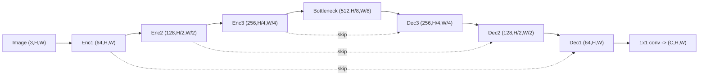
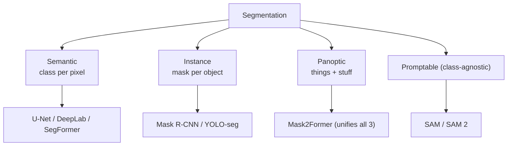
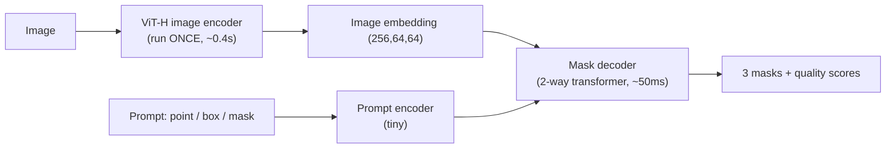
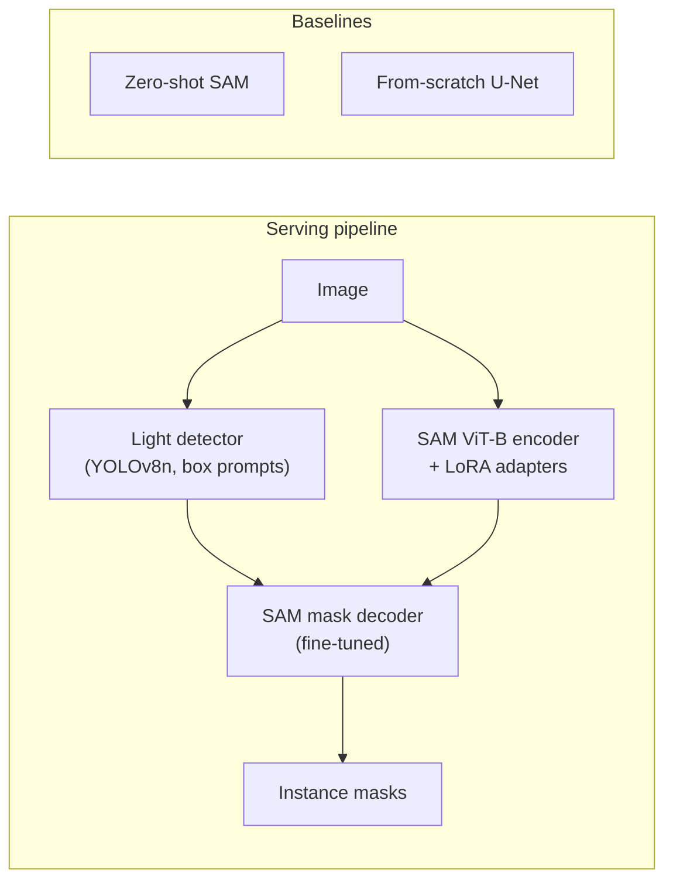

# 4.3 — Segmentation (Semantic, Instance, Panoptic, SAM)

## 1. Overview

**What is it?** Segmentation assigns a label to **every pixel** in an image. It comes in three flavors: **semantic** segmentation labels each pixel with a class ("road", "car", "sky") without distinguishing instances; **instance** segmentation produces a separate mask per object instance (car #1 vs car #2); **panoptic** segmentation unifies both — every pixel gets a class, and countable "things" (cars, people) also get instance IDs while amorphous "stuff" (sky, road) does not.

**Why does it exist?** Boxes from [object detection](02-object-detection.md) are too coarse for many applications: a tumor's exact boundary determines surgical margins; a self-driving car needs the precise drivable-area contour; background replacement in video calls must follow hair strands, not rectangles.

**What problem does it solve?** Pixel-accurate spatial understanding: object masks, scene parsing, anatomy delineation, land-use mapping, matting.

**Where is it used?** Medical imaging (tumor/organ segmentation), autonomous driving (lane and free-space estimation), AR effects (Snapchat/Instagram filters), satellite analytics (building footprints, deforestation), video conferencing background blur, and — since Meta's Segment Anything Model (SAM) — as a promptable foundation capability that can segment nearly anything without task-specific training.

## 2. Learning Objectives

After this chapter you will be able to:

- Precisely distinguish semantic, instance, and panoptic segmentation and choose the right formulation for a problem.
- Explain the U-Net architecture — encoder, decoder, skip connections — and why it dominates medical imaging.
- Derive the Dice loss from the Dice coefficient and explain why it beats cross-entropy on imbalanced masks.
- Compute per-pixel cross-entropy, IoU/Jaccard, Dice, and panoptic quality (PQ), and know when each metric misleads.
- Explain dilated (atrous) convolutions and ASPP in DeepLab.
- Describe Mask R-CNN's extension of Faster R-CNN, including RoIAlign.
- Explain mask-classification architectures (MaskFormer/Mask2Former) that unify all three segmentation tasks.
- Describe SAM's promptable-segmentation architecture (image encoder, prompt encoder, mask decoder) and its uses.
- Implement a full U-Net in PyTorch and train it with a combined CE + Dice loss.
- Avoid the classic pitfalls: wrong mask interpolation, misleading accuracy on imbalanced masks, boundary errors.

## 3. Prerequisites

| Chapter | Why you need it |
|---|---|
| [CNNs](../phase-2-deep-learning/07-cnn.md) | Encoders, strides, transposed convolutions, and receptive fields are the building blocks. |
| [Image Classification](01-image-classification.md) | Segmentation encoders are pretrained classification backbones; transfer learning applies. |
| [Object Detection](02-object-detection.md) | Mask R-CNN extends Faster R-CNN; Mask2Former borrows DETR-style set prediction and Hungarian matching. |
| [Loss Functions](../phase-2-deep-learning/04-loss-functions.md) | Per-pixel CE and its weighted variants are the starting point for segmentation losses. |
| [Autoencoders](../phase-2-deep-learning/11-autoencoders.md) | The encoder-decoder (bottleneck) pattern of U-Net is an autoencoder shape with skip connections. |
| [Transformers](../phase-2-deep-learning/10-transformer.md) | Mask2Former and SAM use transformer decoders with learned queries / prompt tokens. |

## 4. Intuition

Classification looks at a photo and says "there's a dog". Detection draws a rectangle around the dog. Segmentation **colors in the dog** — pixel by pixel, like the world's most careful coloring-book artist who never goes outside the lines.

**An analogy for the three flavors**: imagine a crowd photo. Semantic segmentation is highlighting everything that is "person" in one color — a single "people" blob. Instance segmentation gives each person their own color. Panoptic segmentation colors each person individually *and* paints the sky, street, and buildings with per-class colors — no pixel left unlabeled.

**An everyday story for U-Net's skip connections**: think of an art restorer photographing a painting at many zoom levels. To understand *what* is depicted, she steps back (the encoder downsamples, gaining context but losing detail). To repaint a damaged region *exactly*, she needs the close-up photos again (the decoder upsamples, and skip connections hand it the original high-resolution views from each level). Without skips, the decoder would know "there's a boundary around here somewhere" but couldn't place it to the pixel.

**Why Dice loss?** Suppose you're grading a treasure-hunt map where the treasure zone covers 1% of the map. A student who marks *nothing* is "99% accurate" under per-pixel accuracy — clearly a useless grade. Dice instead asks: of the area you marked and the true area, how much overlaps? Marking nothing scores zero. That is why imbalanced-mask problems (tumors, defects, thin structures) train and evaluate with overlap measures.

## 5. Real-world Motivation

- **Meta** released the Segment Anything Model (SAM, 2023) trained on 1.1 billion masks — a foundation model that turned segmentation from a per-task training problem into a promptable capability, and is used across industry for auto-labeling.
- **Medical AI**: PathAI segments tissue in pathology slides; radiotherapy planning products segment organs-at-risk in CT (errors directly change radiation dose delivered to healthy tissue); the U-Net paper (2015) from a medical-imaging lab is among the most-cited papers in all of computer science.
- **Tesla / Waymo**: drivable-area, lane, and curb segmentation complements object detection in the driving stack — you cannot box "the road".
- **Google**: Pixel phones' portrait mode uses person segmentation/matting; Google Meet's background blur runs a segmentation model in the browser at real-time rates.
- **Satellite/GIS**: Microsoft released 100M+ AI-segmented US building footprints; Planet Labs and others map agriculture and deforestation from orbit.
- **Content creation**: Adobe Photoshop's "Select Subject"/"Remove Background" and TikTok/Snap AR effects are production segmentation systems used by hundreds of millions.

## 6. Mathematical Foundations

### 6.1 Problem statement

For an image $x \in \mathbb{R}^{3 \times H \times W}$, semantic segmentation learns $f_\theta(x) \in \mathbb{R}^{C \times H \times W}$: per-pixel logits over $C$ classes. Applying softmax per pixel gives $p_{k,i}$ — the probability that pixel $i$ belongs to class $k$. The label map is $g \in \{1..C\}^{H \times W}$.

### 6.2 Per-pixel cross-entropy

$$
\mathcal{L}_{CE} = -\frac{1}{HW} \sum_{i=1}^{HW} \log p_{g_i, i}
$$

i.e., ordinary cross-entropy (see [Loss Functions](../phase-2-deep-learning/04-loss-functions.md)) averaged over all pixels. Each pixel is an independent classification example — which is exactly the problem when 99% of pixels are background: the loss gradient is dominated by the majority class.

### 6.3 Dice coefficient and Dice loss

For a binary problem, let $p_i \in [0,1]$ be the predicted foreground probability at pixel $i$ and $g_i \in \{0,1\}$ the ground truth. The **Dice coefficient** (a.k.a. F1 on pixels) is:

$$
\text{Dice} = \frac{2\sum_i p_i g_i + \varepsilon}{\sum_i p_i + \sum_i g_i + \varepsilon}
$$

- Numerator = 2 × (soft) intersection; denominator = total predicted mass + total true mass.
- $\varepsilon$ (e.g., 1) is a smoothing constant preventing $0/0$ on empty masks and stabilizing gradients.

The **Dice loss** is $\mathcal{L}_{Dice} = 1 - \text{Dice}$. Because both numerator and denominator scale with foreground size, the loss is *invariant to class imbalance*: a tiny tumor and a huge organ contribute comparably. Derivative intuition: $\partial \mathcal{L}_{Dice}/\partial p_i$ depends on the *global* sums, coupling all pixels — unlike CE where each pixel is independent. In practice the most robust default is the **combined loss** $\mathcal{L} = \mathcal{L}_{CE} + \lambda\, \mathcal{L}_{Dice}$ (often $\lambda = 1$): CE gives smooth, well-conditioned per-pixel gradients early; Dice enforces overlap on the minority class.

### 6.4 IoU / Jaccard, and relatives

$$
\text{IoU} = \frac{\sum_i p_i g_i}{\sum_i p_i + \sum_i g_i - \sum_i p_i g_i}, \qquad \text{IoU} = \frac{\text{Dice}}{2 - \text{Dice}}
$$

IoU and Dice are monotonically related (Dice is always ≥ IoU); Jaccard/Lovász losses optimize IoU more directly. **Tversky loss** generalizes Dice with separate weights $\alpha, \beta$ on false positives and false negatives — useful when missing a lesion is far worse than over-segmenting it (set $\beta > \alpha$). **Focal Tversky** adds a $\gamma$ exponent for hard-example focus; **boundary losses** weight pixels near mask edges to sharpen contours.

### 6.5 Metrics

- **Pixel accuracy**: fraction of correctly labeled pixels — misleading under imbalance (§4).
- **mIoU**: IoU computed per class over the whole dataset, then averaged across classes — the standard for Cityscapes/ADE20K.
- **Dice score**: standard in medical imaging (per-case, then averaged).
- **Boundary F1 (BF score)**: precision/recall of predicted boundaries within a pixel tolerance — catches sloppy edges that area metrics forgive.
- **Panoptic Quality**: for panoptic tasks,

$$
\text{PQ} = \underbrace{\frac{\sum_{(p,g) \in TP} \text{IoU}(p,g)}{|TP|}}_{\text{segmentation quality (SQ)}} \times \underbrace{\frac{|TP|}{|TP| + \frac{1}{2}|FP| + \frac{1}{2}|FN|}}_{\text{recognition quality (RQ)}}
$$

where predicted and ground-truth segments match (TP) iff IoU > 0.5. PQ multiplies "how good are the matched masks" by "how many segments did you find/hallucinate".

### 6.6 Dilated convolution and ASPP (DeepLab)

A dilated (atrous) convolution with rate $r$ samples the input with gaps: a 3×3 kernel with $r=2$ covers a 5×5 receptive field with 9 weights. This grows the receptive field **without** downsampling or extra parameters — crucial because segmentation needs both context (large receptive field) and resolution (no aggressive pooling). DeepLab's **ASPP** (Atrous Spatial Pyramid Pooling) applies parallel dilated convs at multiple rates (e.g., 6, 12, 18) plus global pooling, concatenating the results — capturing multi-scale context at full feature resolution. DeepLab-v3+ adds a light decoder for sharper boundaries.

### 6.7 Mask R-CNN and RoIAlign

Mask R-CNN = Faster R-CNN + a small FCN **mask head** that predicts a $28 \times 28$ binary mask per RoI, per class (loss: per-pixel BCE on the true class's mask only). Its key fix is **RoIAlign**: RoIPool snapped RoI coordinates to the feature grid (quantization shifting features by up to ~0.5 cell — fatal for pixel tasks); RoIAlign instead bilinearly interpolates feature values at exact fractional locations, preserving pixel alignment and adding ~10 points of mask AP.

### 6.8 Mask classification: MaskFormer / Mask2Former

Instead of per-pixel classification, predict a set of $N$ (mask, class) pairs: a transformer decoder with $N$ learned queries (as in [DETR](02-object-detection.md)) attends to image features; each query yields a class prediction and a mask embedding that is dot-producted with per-pixel features to form a mask. Training uses Hungarian matching between predicted and ground-truth segments. Because "a set of labeled masks" describes semantic, instance, *and* panoptic outputs equally well, **one architecture handles all three tasks** — Mask2Former added masked (local) cross-attention and multi-scale features to make it accurate and trainable, and it became state-of-the-art across all three benchmarks.

### 6.9 SAM: promptable segmentation

SAM has three parts: (1) a heavy **image encoder** (ViT-H, MAE-pretrained) run **once** per image to produce an embedding; (2) a lightweight **prompt encoder** for points, boxes, and coarse masks; (3) a fast **mask decoder** (two-way transformer) combining both to output masks in ~50 ms — enabling interactive use. It predicts **3 masks per prompt** with quality scores to resolve ambiguity (a point on a shirt could mean shirt, person, or crowd). Trained on the SA-1B dataset (11M images, 1.1B masks) via a model-in-the-loop labeling engine. SAM is **class-agnostic**: it produces masks, not labels — pair it with a detector or [CLIP](05-multimodal.md) for semantics. SAM 2 extends this to video with a streaming memory mechanism.

## 7. Visual Explanation

U-Net architecture (the canonical diagram):

```
Input ──► [64] ──► [64] ─────────skip──────────────► [64] ──► [64] ──► 1x1 conv ──► C maps
            │ pool                                     ▲ up
            ▼                                          │
          [128] ──► [128] ────────skip───────────► [128] ──► [128]
              │ pool                                 ▲ up
              ▼                                      │
            [256] ──► [256] ──────skip─────────► [256] ──► [256]
                 │ pool                            ▲ up
                 ▼                                 │
                [512] ──► [512] ── bottleneck ─────┘
          (encoder: context)              (decoder: localization)
```



Task taxonomy and model families:



SAM's split design — heavy encoder once, light decoder per prompt:



## 8. Algorithm

Training a U-Net for binary segmentation:

1. **Prepare pairs** $(x, g)$: image + mask, resized/cropped identically; masks interpolated with **nearest-neighbor** only.
2. **Augment**: flips, rotations, elastic deformation (medical), color jitter, coarse dropout — applied identically to image and mask (except color ops, image-only).
3. **Forward**: encoder halves resolution and doubles channels per stage; bottleneck; decoder upsamples and concatenates the matching encoder feature (skip) at each stage; final 1×1 conv gives per-pixel logits.
4. **Loss**: $\mathcal{L} = \mathcal{L}_{BCE} + \mathcal{L}_{Dice}$ on logits (BCE with logits for stability).
5. **Optimize**: AdamW lr 1e-4 → cosine decay; batch as large as memory allows (BN statistics suffer below ~8; use GroupNorm if tiny batches).
6. **Validate**: Dice/mIoU per epoch; save best; visually inspect predicted masks every few epochs (metrics hide systematic boundary errors).
7. **Infer**: sigmoid + threshold 0.5 (tune on validation); optionally post-process (largest connected component, morphological closing).

Pseudocode:

```text
for epoch in range(E):
    for x, g in loader:               # x: (B,3,H,W), g: (B,1,H,W) in {0,1}
        logits = unet(x)              # (B,1,H,W)
        p = sigmoid(logits)
        loss = bce_with_logits(logits, g) + (1 - dice(p, g))
        loss.backward(); opt.step(); opt.zero_grad()
    dice_val = evaluate(val_loader)   # threshold 0.5
    save_if_best(dice_val)
```

## 9. Worked Example

### Tiny example by hand: Dice vs accuracy on a 4×4 image

Ground truth mask (1 = lesion, 16 pixels total, 4 foreground):

```
0 0 0 0        prediction A:  0 0 0 0      prediction B:  0 0 0 0
0 1 1 0                       0 1 0 0                     0 0 0 0
0 1 1 0                       0 1 1 0                     0 0 0 0
0 0 0 0                       0 0 0 0                     0 0 0 0
```

**Prediction A** (3 pixels marked, all correct): intersection $= 3$; $\sum p = 3$, $\sum g = 4$.
- Dice $= \frac{2 \cdot 3}{3 + 4} = 6/7 = 0.857$; IoU $= \frac{3}{3+4-3} = 0.75$ (check: $0.857/(2-0.857) = 0.75$ ✓).
- Pixel accuracy $= 15/16 = 0.938$.

**Prediction B** (predicts nothing): Dice $= \frac{0 + \varepsilon}{0 + 4 + \varepsilon} \approx 0$; but pixel accuracy $= 12/16 = 0.75$ — and if the lesion covered only 1% of a real image, accuracy would be 0.99. This is the entire argument for overlap metrics in one arithmetic exercise.

### Realistic example

Train the U-Net from §10/§11 on Oxford-IIIT Pets (37 breeds, ~7,400 images with trimap masks, binarized to pet-vs-background) at 256²: with flips + color jitter and BCE+Dice for 40 epochs, expect validation Dice ≈ 0.90–0.93. Upgrading the encoder to an ImageNet-pretrained ResNet-34 (via `segmentation-models-pytorch`) typically adds 2–3 Dice points and halves the epochs needed — the transfer-learning lesson from [classification](01-image-classification.md) applied to dense prediction.

## 10. Python from Scratch

Dice loss, IoU metric, and a minimal encoder-decoder forward pass in NumPy — to see exactly what the tensors do:

```python
import numpy as np

def dice_loss(p, g, eps=1.0):
    """Soft Dice loss. p: predicted probs (B,H,W) in [0,1]; g: {0,1} (B,H,W)."""
    inter = (p * g).sum(axis=(1, 2))              # per-sample intersection (B,)
    denom = p.sum(axis=(1, 2)) + g.sum(axis=(1, 2))
    dice = (2 * inter + eps) / (denom + eps)      # eps saves empty masks: 0/0 -> 1
    return 1 - dice.mean()

def iou_score(pred_mask, g):
    """Hard IoU after thresholding. Both binary arrays (H,W)."""
    inter = np.logical_and(pred_mask, g).sum()
    union = np.logical_or(pred_mask, g).sum()
    return inter / union if union > 0 else 1.0    # empty-vs-empty is perfect

# ---- Verify against the hand example in section 9 ----
g = np.zeros((4, 4)); g[1:3, 1:3] = 1             # 4 true pixels
pA = np.zeros((4, 4)); pA[1, 1] = pA[2, 1] = pA[2, 2] = 1
print(1 - dice_loss(pA[None], g[None], eps=0))    # -> 0.857 (Dice)
print(iou_score(pA > 0.5, g > 0.5))               # -> 0.75

# ---- Minimal conv encoder-decoder forward (stride/upsample mechanics) ----
def conv2d(x, w):
    """Valid 3x3 convolution, padding=1. x: (C_in,H,W), w: (C_out,C_in,3,3)."""
    C_out = w.shape[0]; H, W = x.shape[1:]
    xp = np.pad(x, ((0, 0), (1, 1), (1, 1)))       # keep spatial size
    out = np.zeros((C_out, H, W))
    for co in range(C_out):
        for i in range(H):
            for j in range(W):                     # O(C_out*C_in*9*H*W)
                out[co, i, j] = (xp[:, i:i+3, j:j+3] * w[co]).sum()
    return np.maximum(out, 0)                      # ReLU

def maxpool2(x):     # (C,H,W) -> (C,H/2,W/2)
    C, H, W = x.shape
    return x.reshape(C, H//2, 2, W//2, 2).max(axis=(2, 4))

def upsample2(x):    # nearest-neighbor (C,H,W) -> (C,2H,2W)
    return x.repeat(2, axis=1).repeat(2, axis=2)

rng = np.random.default_rng(0)
x  = rng.normal(size=(3, 32, 32))                  # input image
e1 = conv2d(x, rng.normal(scale=0.1, size=(8, 3, 3, 3)))    # (8,32,32)
e2 = conv2d(maxpool2(e1), rng.normal(scale=0.1, size=(16, 8, 3, 3)))  # (16,16,16)
d1 = upsample2(e2)                                 # (16,32,32) back to full res
cat = np.concatenate([d1, e1], axis=0)             # skip connection: (24,32,32)
out = conv2d(cat, rng.normal(scale=0.1, size=(1, 24, 3, 3)))  # (1,32,32) logits
print(out.shape)   # (1, 32, 32) — one logit per pixel
```

**Common bug**: computing Dice on *logits* instead of probabilities — the sums go negative and the "loss" becomes meaningless; always apply sigmoid/softmax first (or use a loss that fuses it). Complexity: naive convolution is $O(C_{out} C_{in} k^2 H W)$ per layer — the reason real implementations use im2col/cuDNN.

## 11. Library Implementation

A complete U-Net in PyTorch (expanded from the classic recipe), plus the high-level libraries used in practice:

```python
import torch, torch.nn as nn

class DoubleConv(nn.Module):
    """(Conv 3x3 -> BN -> ReLU) x2 — the basic U-Net block."""
    def __init__(self, c_in, c_out):
        super().__init__()
        self.net = nn.Sequential(
            nn.Conv2d(c_in, c_out, 3, padding=1, bias=False),
            nn.BatchNorm2d(c_out), nn.ReLU(inplace=True),
            nn.Conv2d(c_out, c_out, 3, padding=1, bias=False),
            nn.BatchNorm2d(c_out), nn.ReLU(inplace=True))
    def forward(self, x): return self.net(x)

class UNet(nn.Module):
    def __init__(self, c_in=3, c_out=1, f=64):
        super().__init__()
        self.d1 = DoubleConv(c_in, f);    self.p1 = nn.MaxPool2d(2)
        self.d2 = DoubleConv(f, f*2);     self.p2 = nn.MaxPool2d(2)
        self.d3 = DoubleConv(f*2, f*4);   self.p3 = nn.MaxPool2d(2)
        self.b  = DoubleConv(f*4, f*8)                       # bottleneck
        self.u3 = nn.ConvTranspose2d(f*8, f*4, 2, stride=2)  # learned 2x upsample
        self.c3 = DoubleConv(f*8, f*4)    # f*8 because of skip concatenation
        self.u2 = nn.ConvTranspose2d(f*4, f*2, 2, stride=2)
        self.c2 = DoubleConv(f*4, f*2)
        self.u1 = nn.ConvTranspose2d(f*2, f, 2, stride=2)
        self.c1 = DoubleConv(f*2, f)
        self.out = nn.Conv2d(f, c_out, 1)                    # 1x1: per-pixel logits
    def forward(self, x):
        d1 = self.d1(x)                    # (B, 64,  H,   W)
        d2 = self.d2(self.p1(d1))          # (B, 128, H/2, W/2)
        d3 = self.d3(self.p2(d2))          # (B, 256, H/4, W/4)
        b  = self.b(self.p3(d3))           # (B, 512, H/8, W/8)
        u3 = self.c3(torch.cat([self.u3(b), d3], dim=1))   # skip: cat on channels
        u2 = self.c2(torch.cat([self.u2(u3), d2], dim=1))
        u1 = self.c1(torch.cat([self.u1(u2), d1], dim=1))
        return self.out(u1)                # (B, c_out, H, W)

class DiceBCELoss(nn.Module):
    def __init__(self, eps=1.0):
        super().__init__(); self.bce = nn.BCEWithLogitsLoss(); self.eps = eps
    def forward(self, logits, target):
        p = torch.sigmoid(logits)
        inter = (p * target).sum(dim=(2, 3))
        dice = (2*inter + self.eps) / (p.sum(dim=(2,3)) + target.sum(dim=(2,3)) + self.eps)
        return self.bce(logits, target) + (1 - dice).mean()

model = UNet(); loss_fn = DiceBCELoss()
x = torch.randn(4, 3, 256, 256); y = (torch.rand(4, 1, 256, 256) > 0.7).float()
print(loss_fn(model(x), y))   # scalar; untrained model gives ~1.6-1.8
```

Production-grade alternatives (know these; don't reinvent):

```python
# Pretrained-encoder U-Net: 2-3 Dice points free, in one line
import segmentation_models_pytorch as smp
model = smp.Unet("resnet34", encoder_weights="imagenet", classes=1)

# Instance segmentation: torchvision Mask R-CNN, or Ultralytics YOLOv8-seg
import torchvision
mrcnn = torchvision.models.detection.maskrcnn_resnet50_fpn_v2(weights="DEFAULT")

# Promptable segmentation with SAM
from segment_anything import sam_model_registry, SamPredictor
sam = sam_model_registry["vit_h"](checkpoint="sam_vit_h_4b8939.pth")
pred = SamPredictor(sam)
pred.set_image(img_rgb)                       # heavy encoder runs ONCE here
masks, scores, _ = pred.predict(
    point_coords=np.array([[500, 375]]),      # one foreground click
    point_labels=np.array([1]),               # 1 = foreground, 0 = background
    multimask_output=True)                    # 3 candidate masks + scores
```

**Common bug**: with the from-scratch U-Net, odd input sizes (e.g., 250×250) break the skip concatenations because pooled-then-upsampled maps no longer match encoder maps — pad inputs to multiples of $2^{\#\text{poolings}}$ (here 8, commonly 16 or 32).

## 12. Code Walkthrough

Tensor shapes through the U-Net (batch $B=4$, input 256², binary output):

| Tensor | Shape | Meaning |
|---|---|---|
| `x` | (4, 3, 256, 256) | Normalized RGB batch |
| `d1` | (4, 64, 256, 256) | Full-resolution encoder features (→ skip 1) |
| `d2` | (4, 128, 128, 128) | Stride-2 features (→ skip 2) |
| `d3` | (4, 256, 64, 64) | Stride-4 features (→ skip 3) |
| `b` | (4, 512, 32, 32) | Bottleneck: max context, min resolution |
| `u3` input | (4, 512, 64, 64) | 256 upsampled + 256 skipped, concatenated |
| output logits | (4, 1, 256, 256) | One logit per pixel |
| `target` | (4, 1, 256, 256) | Binary float mask |
| loss | scalar | BCE + (1 − Dice), ≈ 1.7 untrained, < 0.3 trained |

Inputs: image/mask pairs (masks as single-channel PNGs with integer class IDs — never JPEG, whose compression corrupts labels). Outputs: logits → sigmoid → threshold 0.5 → binary mask. Expected results on Oxford Pets: training loss falls below 0.4 within 10 epochs; validation Dice reaches ~0.90 by epoch 40. Diagnostic to watch: if Dice on validation is high but masks look blocky, your ground-truth masks were probably resized with bilinear interpolation somewhere (class IDs blended into invalid values).

## 13. Complexity Analysis

- **Time**: convolution dominates: $O(\sum_\ell C_{in}^\ell C_{out}^\ell k^2 H_\ell W_\ell)$. The U-Net above is ~30 GFLOPs at 256² — note the *decoder roughly doubles* cost vs a classification backbone since it processes high-resolution maps again. Cost scales linearly with pixel count: 512² is 4× the FLOPs of 256².
- **Mask R-CNN**: backbone+FPN as in detection, plus per-RoI mask heads — cost grows with the number of detected instances (each RoI runs a small FCN).
- **Mask2Former**: masked cross-attention restricts each query to its current mask's footprint, avoiding the $O(NHW)$ dense attention of naive designs.
- **SAM**: encoder ViT-H ≈ 0.6B params, ~0.4 s/image on GPU, but runs once; each prompt then costs ~50 ms in the decoder — the amortization that makes interactive annotation feasible.
- **Space**: activations at full resolution dominate training memory — a (B, 64, 512, 512) fp32 tensor is 4 GB at B=64. This is why segmentation batches are small (2–16) and why crops, mixed precision, and gradient checkpointing are standard.

## 14. Advantages

- **Pixel-precise outputs** enable measurement: tumor volume in mm³, roof area for solar quotes, crop coverage per hectare — boxes cannot do this.
- **Handles amorphous "stuff"**: road, sky, water, and vegetation have no meaningful box; segmentation is the only formulation that fits.
- **Strong pretrained ecosystem**: pretrained encoders (via `smp`, `timm`), Cityscapes/ADE20K checkpoints, and Mask2Former weights transfer well.
- **SAM changed the labeling economics**: promptable, class-agnostic masks let one annotator do the work of ten (click → mask → correct), and auto-labeling pipelines bootstrap datasets for smaller task-specific models.
- **Unified modern architectures**: one Mask2Former handles semantic, instance, and panoptic — less engineering surface in production.

## 15. Disadvantages

- **Annotation is expensive**: a precise polygon mask takes minutes vs seconds for a box; Cityscapes reported ~1.5 h per fully annotated image. (SAM-assisted labeling mitigates but does not eliminate this.)
- **Boundary errors persist**: thin structures (hair, wires, vessel branches) and low-contrast edges are systematically undersegmented; area metrics barely notice.
- **Small objects and class imbalance**: a distant pedestrian is a few dozen pixels; rare classes need loss weighting or oversampling to learn at all.
- **Memory-hungry training**: full-resolution activations force small batches and cropping strategies, complicating BatchNorm and hyperparameters.
- **SAM limitations**: class-agnostic (needs a companion model for labels), heavy encoder for edge deployment (use MobileSAM/EfficientSAM), and quality drops on domains far from natural images (some medical modalities) without fine-tuning.
- **Domain shift**: a scanner/camera change can silently degrade masks; medical deployments require per-site validation.

## 16. Common Mistakes

- **Bilinear interpolation of label masks**: resizing a mask with bilinear blends class IDs (a pixel between class 3 and 7 becomes "5"). Always use `interpolation=NEAREST` for masks; bilinear only for images.
- **Storing masks as JPEG**: lossy compression corrupts class IDs near edges. Use PNG.
- **Evaluating with pixel accuracy on imbalanced masks**: report Dice/mIoU per class (see the §9 hand example for why).
- **Dice-only loss from scratch**: pure Dice has noisy gradients early (denominator near zero, all-background batches); combine with CE/BCE.
- **Augmentation desync**: applying a random flip to the image but not the mask (or with a different random seed). Use a joint-transform library (Albumentations) that transforms both together.
- **Softmax over the wrong dimension**: per-pixel softmax must be over the channel dim (`dim=1` for (B,C,H,W)); `dim=-1` silently normalizes over image width.
- **Ignoring the `ignore_index`**: many datasets (Cityscapes: 255) mark void pixels; including them in the loss teaches the model garbage. Pass `ignore_index` to the loss.
- **Thresholding at 0.5 blindly**: the optimal operating threshold on the validation set is often 0.3–0.7 depending on loss balance; tune it.

## 17. Best Practices

- [ ] Use a pretrained encoder (`smp.Unet("resnet34", encoder_weights="imagenet")`) unless your modality is far from natural images — then consider self-supervised pretraining on unlabeled domain data.
- [ ] Default loss: CE (or BCE) + Dice, equal weights; move to Tversky/focal variants only with a measured reason.
- [ ] Masks: PNG, integer IDs, nearest-neighbor resizing, `ignore_index` handled.
- [ ] Train on random crops (e.g., 512² from 2048² images) + flips; evaluate with sliding-window or full-image inference.
- [ ] Small batch? Replace BatchNorm with GroupNorm.
- [ ] Report per-class IoU/Dice and inspect the worst classes' predictions visually every few epochs.
- [ ] Post-process deliberately: largest-connected-component for single-object tasks; avoid heavy CRF-style smoothing unless boundary metrics prove it helps.
- [ ] For labeling pipelines: SAM (or SAM 2 for video) with human-in-the-loop clicks, then train a compact task-specific model for deployment.
- [ ] Medical: cross-validate per patient (never split slices of one patient across train/val), and report per-case Dice with confidence intervals.
- [ ] Version datasets and masks; a mask-format regression (palette PNG → RGB PNG) can silently zero your labels.

## 18. Optimization Techniques

- **Mixed precision + gradient checkpointing**: the twin levers for full-resolution training; checkpointing the encoder cuts activation memory ~50% for ~30% extra time.
- **Crop-based training + sliding-window inference**: train at 512², infer on 4096² imagery with overlapping tiles and blended (Gaussian-weighted) seams.
- **Deep supervision**: auxiliary losses on decoder intermediate outputs (as in nnU-Net) speed convergence and improve small-structure recall.
- **Copy-paste augmentation**: paste instance masks onto new backgrounds — large gains for instance segmentation (used in modern COCO recipes).
- **Test-time augmentation**: average logits over flips/rotations; +0.5–1 Dice for offline workloads.
- **Distilled/efficient SAM variants**: MobileSAM, EfficientSAM, FastSAM for edge/interactive use — 10–50× faster encoders at modest quality cost.
- **Export & quantize**: ONNX/TensorRT with fp16 is standard; check boundary quality after INT8 (dense outputs are more quantization-sensitive than classification logits).
- **nnU-Net's meta-lesson**: automated configuration (patch size, batch, normalization, augmentation) tuned per dataset beats hand-tuned exotic architectures on most medical benchmarks — spend effort on data handling, not architecture novelty.

## 19. Industry Applications

- **Healthcare**: radiotherapy organ-at-risk segmentation (production systems from Varian, RaySearch); PathAI's tissue segmentation in pathology; cardiac MRI chamber segmentation for ejection-fraction measurement — the production example where Dice points translate to clinical outcomes.
- **Autonomous driving**: Tesla's drivable-space and lane segmentation; Mobileye's road-feature extraction; HD-map creation from fleet imagery.
- **Consumer imaging**: Google Pixel portrait mode, Zoom/Meet/Teams background blur, Adobe "Select Subject", TikTok green-screen effects.
- **Geospatial**: Microsoft's building-footprint releases; crop-type mapping for insurance; disaster-response flood mapping from satellites.
- **Retail & manufacturing**: shelf-product masks for planogram compliance; PCB solder-joint and weld-seam defect segmentation, where the defect is 0.1% of pixels — imbalance techniques in production.
- **Meta's SAM ecosystem**: auto-labeling in Roboflow/CVAT/Label Studio; SAM 2 for video object segmentation in editing tools.

## 20. Interview Questions

### Beginner

**Q1. Semantic vs instance vs panoptic segmentation — define each.**
A: Semantic: one class label per pixel, no instance identity (all cars are "car"). Instance: a separate mask per countable object instance (car #1, car #2), typically ignoring background "stuff". Panoptic: every pixel gets a class, and "thing" pixels also get an instance ID — the union of both, evaluated with PQ.

**Q2. Why are skip connections essential in U-Net?**
A: The encoder discards spatial detail as it downsamples to gain context; the decoder must place boundaries precisely. Skips hand the decoder the encoder's high-resolution features at each scale, so it can combine "what" (deep context) with "exactly where" (shallow detail). Without them, outputs are blurry and boundaries drift.

**Q3. Why does pixel accuracy mislead on a tumor-segmentation task?**
A: When foreground is ~1% of pixels, predicting all-background scores 99% accuracy while being clinically useless. Overlap metrics (Dice/IoU) score that prediction 0 because they only credit intersected foreground.

**Q4. What does a 1×1 convolution do at the end of a segmentation network?**
A: It maps the final feature map (B, f, H, W) to per-pixel class logits (B, C, H, W) — a per-pixel linear classifier applied at every location, with no spatial mixing.

**Q5. How must masks be resized, and why?**
A: Nearest-neighbor only. Bilinear/bicubic averaging blends discrete class IDs into invalid intermediate values (between "class 3" and "class 7" is not "class 5").

### Intermediate

**Q1. Derive the Dice loss and explain its gradient behavior vs cross-entropy.**
A: Dice $= \frac{2\sum p_i g_i + \varepsilon}{\sum p_i + \sum g_i + \varepsilon}$; loss $= 1 - $ Dice. CE treats each pixel independently, so gradients are dominated by the majority class under imbalance. Dice's gradient at each pixel depends on global sums (intersection and totals), making the loss scale-invariant to foreground size — a small structure's pixels get proportionally large influence. Downside: when $\sum p + \sum g$ is small, gradients are noisy — hence CE + Dice combos.

**Q2. Explain dilated convolutions and ASPP. Why not just pool more?**
A: Pooling grows receptive field but destroys resolution — fatal for dense prediction. A dilated conv with rate $r$ spaces kernel taps $r$ pixels apart, growing receptive field with no downsampling or extra weights. ASPP runs parallel dilated convs at multiple rates plus image-level pooling, capturing multi-scale context at full feature resolution; DeepLab-v3+ adds a decoder for boundary sharpness.

**Q3. What is RoIAlign and why did it matter so much for Mask R-CNN?**
A: RoIPool quantized RoI boundaries and bin edges to integer feature coordinates, shifting features by up to half a cell — tolerable for classification, disastrous for pixel-aligned masks. RoIAlign samples feature values at exact fractional positions via bilinear interpolation (no quantization), preserving spatial correspondence and improving mask AP by ~10 points.

**Q4. Your model's Dice is 0.9 but clinicians reject the masks. What might metrics be hiding?**
A: Area metrics forgive boundary sloppiness (a dilated/eroded boundary changes Dice little but can be clinically unacceptable), missed small satellite lesions (dominated by the big one), and topology errors (holes, disconnected fragments). Check boundary F1 / Hausdorff distance, per-lesion detection rate, and visual review protocols.

**Q5. How does mask classification (MaskFormer) differ from per-pixel classification, and why does it unify tasks?**
A: Per-pixel classification predicts a class at each pixel — natural for semantic only. Mask classification predicts $N$ (binary mask, class) pairs via learned queries with Hungarian-matched training. "A set of labeled masks" expresses semantic output (one mask per class), instance output (one per object), and panoptic output (both) — so one architecture and loss covers all three; Mask2Former made it SOTA with masked attention and multi-scale features.

### Advanced

**Q1. Explain SAM's architecture and the engineering reason for its encoder/decoder split.**
A: SAM = heavy ViT-H image encoder (MAE-pretrained) producing a 64×64×256 embedding once per image; a tiny prompt encoder embedding points/boxes/masks; and a fast two-way-transformer mask decoder producing 3 candidate masks + IoU-quality scores per prompt (multimask handles prompt ambiguity: part vs object vs group). The split amortizes the ~0.4 s encoder over many ~50 ms prompt interactions — the property that enables interactive annotation and its data engine (11M images / 1.1B masks).

**Q2. Design a segmentation labeling pipeline that minimizes human time for a new industrial-defect dataset.**
A: (1) SAM-assisted labeling: annotator clicks defects, corrects with +/- points; (2) train a compact U-Net/Mask2Former on the first few hundred masks; (3) model pre-annotates new images, humans only correct — measure correction time vs from-scratch; (4) active learning: prioritize images where the model is uncertain (entropy) or SAM's candidate masks disagree; (5) periodically audit inter-annotator agreement on a gold set. Track cost as human-minutes per accepted mask.

**Q3. Panoptic Quality: define it and explain a failure mode it exposes that mIoU doesn't.**
A: PQ = SQ × RQ, where segments match iff IoU > 0.5; SQ = mean IoU of matched pairs, RQ = F1 over segment detection. mIoU can look fine when a model merges five adjacent cars into one blob (pixels mostly right); PQ punishes it: four cars become FNs and the blob may fail matching — recognition quality collapses. PQ thus measures instance *enumeration*, not just pixel coverage.

**Q4. When would you fine-tune SAM vs train a dedicated model, and how would you fine-tune it cheaply?**
A: Fine-tune SAM when you need promptable/interactive masks in a shifted domain (e.g., ultrasound) and have modest data — freeze the image encoder, adapt the mask decoder, or insert LoRA adapters into encoder attention layers (a few percent of params). Train a dedicated compact model when you need fixed-class, high-throughput, edge-deployable inference — SAM's encoder is too heavy and it lacks class semantics anyway. Common production pattern: SAM for labeling, compact model for serving.

**Q5. Your Cityscapes model degrades on rainy-night footage. Give a systematic remediation plan.**
A: Quantify: evaluate per-class IoU on a labeled rainy-night set — identify which classes fail (typically road markings, pedestrians). Data: collect and label (SAM-assisted) target-domain frames; add photometric augmentation approximating rain/glare; consider style-transfer or synthetic rain augmentation. Training: fine-tune with a mixed sampler (day + night), monitor day performance for forgetting; consider domain-adversarial or self-training (pseudo-labels on unlabeled night video with confidence thresholds). Deployment: add an input-domain detector to flag low-confidence conditions; validate per-condition before rollout.

## 21. Coding Exercises

### Easy

1. **Metrics kit**: implement Dice, IoU, and pixel accuracy for binary masks; verify Dice = 0.857 and IoU = 0.75 on the §9 hand example, and confirm the Dice↔IoU identity numerically. *Hint: `IoU = Dice/(2-Dice)`.*
2. **Mask hygiene checker**: write a script that scans a mask folder and flags non-PNG files, masks containing unexpected class IDs, and image/mask size mismatches. *Hint: `np.unique(mask)` should be a subset of your class set.*

### Medium

1. **Pets U-Net**: train the §11 U-Net on Oxford-IIIT Pets (binarized trimaps) at 256²; report validation Dice; then swap in `smp.Unet("resnet34", encoder_weights="imagenet")` and quantify the pretrained-encoder gain. *Hint: nearest-neighbor mask resizing; joint transforms via Albumentations.*
2. **Loss ablation**: on the same setup, compare BCE-only vs Dice-only vs BCE+Dice on (a) final Dice, (b) training stability in the first 5 epochs, (c) performance when you artificially shrink foreground (erode masks). *Hint: fix seeds; plot loss curves together.*
3. **SAM auto-labeler**: use `SamAutomaticMaskGenerator` to produce masks for 100 unlabeled images, filter by predicted IoU and area, and hand-review 20 — report acceptance rate and time saved vs manual polygons. *Hint: sort masks by `stability_score`.*

### Hard

1. **Sliding-window inference**: implement tiled inference for 2048² images with a 512² model — overlapping tiles, Gaussian-weighted blending — and show it beats naive downscale-infer-upscale on boundary F1. *Hint: accumulate weighted logits and a weight map, divide at the end.*
2. **Mini panoptic evaluation**: implement PQ from scratch (greedy IoU>0.5 matching, SQ×RQ) and validate on synthetic scenes of colored shapes against `panopticapi`. *Hint: match each GT segment to at most one prediction.*
3. **Boundary-aware training**: add a boundary loss (distance-transform-weighted BCE near edges) to CE+Dice and measure the boundary-F1 improvement on thin structures (use a vessel or crack dataset). *Hint: `scipy.ndimage.distance_transform_edt` on GT masks builds the weight map.*

## 22. Mini Project

**Background blur for video calls.**

1. Get a person-segmentation dataset (e.g., the Supervisely persons set or P3M) and train a small U-Net (or start from MODNet/MediaPipe Selfie Segmentation for comparison) at 256².
2. Build the demo: webcam frame → person mask → Gaussian-blur background → composite with the sharp foreground.
3. Feather the mask edge (Gaussian blur on the mask itself) to avoid halo artifacts around hair.
4. Measure FPS; if below 15, shrink input resolution or the model width and re-measure quality.
5. Add temporal smoothing (exponential moving average of masks across frames) and observe flicker reduction.
6. Stretch: export to ONNX and run in the browser via onnxruntime-web.

## 23. Medium Project

**Lung/organ segmentation on public CT data.**

1. Download a public CT segmentation dataset (e.g., the Medical Segmentation Decathlon lung or spleen task); understand the NIfTI format and Hounsfield-unit windowing.
2. Preprocess: clip HU to a task-appropriate window (e.g., [-1000, 400] for lung), normalize, resample to uniform voxel spacing.
3. Baseline: 2D U-Net on axial slices with BCE+Dice; evaluate **per-case** Dice with patient-level splits (never mix a patient's slices across splits).
4. Upgrade: 3D patch-based U-Net (e.g., 96³ patches) and compare per-case Dice and inference time against 2D.
5. Add deep supervision and TTA (flips); report final per-case Dice mean ± std and worst-case analysis.
6. Compare your best configuration against nnU-Net's automated pipeline on the same split; write up where and why yours differs.

## 24. Advanced Project

**Domain-specialized SAM: fine-tune with LoRA and beat a from-scratch U-Net at 10% labels.**

Architecture: SAM ViT-B image encoder with LoRA adapters in attention layers + fine-tuned mask decoder, prompted by boxes from a lightweight detector; baselines are zero-shot SAM and a from-scratch U-Net, evaluated under 10%/50%/100% label budgets on a specialized domain (choose: polyp endoscopy, solar panels from aerial imagery, or crack detection).



Implementation phases:

1. **Data**: assemble the domain dataset; create 10%/50%/100% stratified label budgets; define per-case Dice + boundary F1 + instance-level recall as metrics.
2. **Baselines**: (a) zero-shot SAM with GT-box prompts (upper bound on prompt quality), (b) U-Net trained per budget.
3. **Fine-tune**: insert LoRA (rank 4–8) into SAM encoder attention; unfreeze the mask decoder; train with Dice+focal on mask logits; ablate LoRA rank and decoder-only vs decoder+LoRA.
4. **End-to-end**: train the YOLO prompt-detector on the same budget; evaluate the full pipeline (detector boxes, not GT boxes) — measure how prompt noise degrades masks.
5. **Report**: label-efficiency curves (Dice vs label budget) for all systems; latency table (encoder-once amortization vs U-Net single pass).

Possible improvements: distill the fine-tuned pipeline into a single compact model for edge deployment; extend to video with SAM 2's memory mechanism; add a text-prompt path via Grounding-DINO for open-vocabulary prompting.

## 25. Summary

- Segmentation labels every pixel: semantic (classes), instance (per-object masks), panoptic (both); Mask2Former-style mask classification unifies all three.
- U-Net = contracting encoder + expanding decoder + skip connections; skips are what make boundaries precise, and the pattern still dominates medical imaging.
- Per-pixel CE fails under imbalance; Dice/IoU losses are foreground-size-invariant; CE + Dice is the robust default.
- Dice and IoU are monotonically related (IoU = Dice/(2−Dice)); report per-class values, never pixel accuracy alone.
- DeepLab's dilated convolutions and ASPP buy receptive field without losing resolution; Mask R-CNN adds a mask head to Faster R-CNN, enabled by RoIAlign's quantization-free pooling.
- PQ = SQ × RQ evaluates panoptic outputs, punishing merged/hallucinated instances that mIoU forgives.
- SAM: promptable, class-agnostic masks from a once-per-image heavy encoder + per-prompt fast decoder; it transformed labeling economics, and fine-tuned/distilled variants cover specialized domains and edge devices.
- Mask handling discipline — PNG, integer IDs, nearest-neighbor resizing, `ignore_index` — prevents the most common silent failures.
- Memory, not compute, is the training bottleneck: crops, mixed precision, checkpointing, GroupNorm for small batches.
- Production pattern: SAM-assisted labeling → compact task model → tiled/TTA inference → per-domain validation and drift monitoring.

## 26. Cheat Sheet

| Formula | Meaning |
|---|---|
| $\text{Dice} = \frac{2\sum p g + \varepsilon}{\sum p + \sum g + \varepsilon}$ | Overlap score; loss = 1 − Dice |
| $\text{IoU} = \frac{\text{Dice}}{2-\text{Dice}}$ | Dice↔IoU conversion |
| Tversky $= \frac{\sum pg}{\sum pg + \alpha \sum p\bar g + \beta \sum \bar p g}$ | FP/FN-weighted Dice generalization |
| $\text{PQ} = \text{SQ} \times \text{RQ}$ | Panoptic quality (match iff IoU>0.5) |
| dilated conv RF: $k + (k-1)(r-1)$ | Effective kernel span at rate $r$ |

Defaults: loss = CE(+`ignore_index`) + Dice; AdamW 1e-4 + cosine; crops 512², batch 8–16 (GroupNorm if smaller); masks = PNG + nearest; threshold tuned on val; encoder pretrained.

Model picker: semantic → U-Net/DeepLab/SegFormer; instance → Mask R-CNN/YOLO-seg; all-in-one → Mask2Former; interactive/labeling → SAM; edge → MobileSAM or small U-Net.

Gotchas: never bilinear-resize masks; Dice needs probabilities not logits; per-patient splits in medical; pad inputs to multiples of the total stride; Dice-only training is unstable early.

## 27. Further Reading

**Books**
- Szeliski — *Computer Vision: Algorithms and Applications* (segmentation chapter).
- Zhou et al. (eds.) — *Handbook of Medical Image Computing and Computer Assisted Intervention*.

**Research Papers**
- Long et al., "Fully Convolutional Networks for Semantic Segmentation" (2015).
- Ronneberger et al., "U-Net" (2015); Isensee et al., "nnU-Net" (2021).
- Chen et al., DeepLab v1–v3+ series (2015–2018).
- He et al., "Mask R-CNN" (2017); Kirillov et al., "Panoptic Segmentation" (2019).
- Cheng et al., "MaskFormer" (2021) and "Mask2Former" (2022); Xie et al., "SegFormer" (2021).
- Kirillov et al., "Segment Anything" (2023); Ravi et al., "SAM 2" (2024).
- Milletari et al., "V-Net" (Dice loss, 2016).

**Documentation**
- `segmentation-models-pytorch` docs; torchvision segmentation models; Detectron2/MMSegmentation docs; Albumentations (joint image/mask transforms).

**GitHub Repositories**
- `facebookresearch/segment-anything` and `sam2`; `qubvel/segmentation_models.pytorch`; `MIC-DKFZ/nnUNet`; `facebookresearch/Mask2Former`; `open-mmlab/mmsegmentation`.

**Datasets**
- Cityscapes, ADE20K, COCO (panoptic), Pascal VOC, Oxford-IIIT Pets, Medical Segmentation Decathlon, LiTS, ISIC (skin), SA-1B.

**YouTube/Videos**
- Stanford CS231n segmentation/detection lecture; Meta AI's SAM introduction; Yannic Kilcher's Segment Anything paper review.

**Blogs**
- Jeremy Jordan, "An overview of semantic image segmentation"; Meta AI blog posts on SAM and SAM 2; nnU-Net design-principles write-ups.
