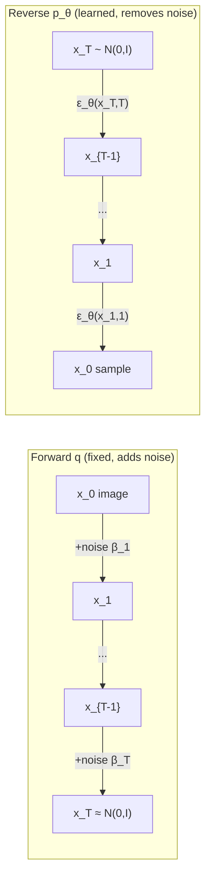
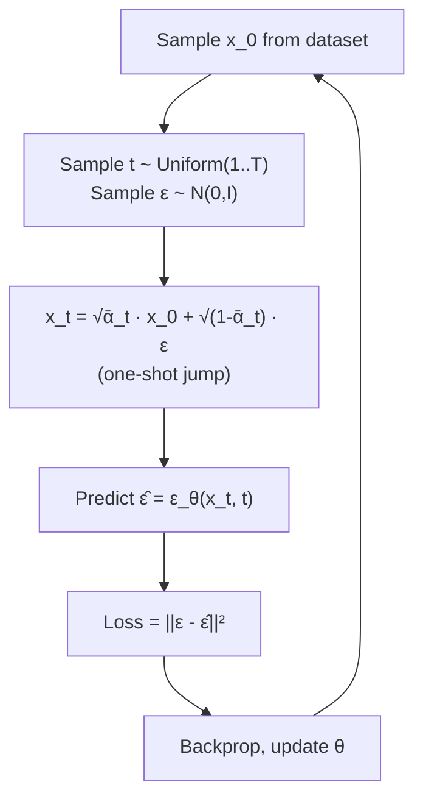
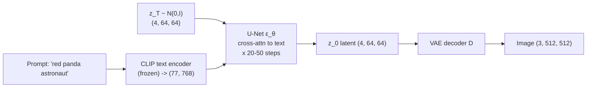
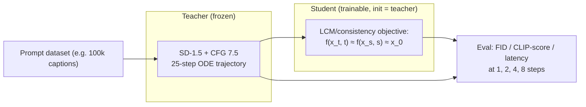

# 4.4 — Diffusion Models (DDPM, Stable Diffusion)

## 1. Overview

**What is it?** A diffusion model is a generative model that learns to reverse a gradual noising process. The *forward* process takes a real image and destroys it step by step with Gaussian noise until nothing but noise remains. The *reverse* process — the learned part — starts from pure noise and removes it step by step, ending with a sample that looks like it came from the training distribution.

**Why does it exist?** [GANs](../phase-2-deep-learning/12-gan.md) produce sharp samples but train unstably (adversarial min-max, mode collapse); [VAEs](../phase-2-deep-learning/11-autoencoders.md) train stably but produce blurry samples. Diffusion models achieve both: a single, simple regression loss (no adversary) and sample quality that surpassed GANs on standard benchmarks ("Diffusion Models Beat GANs on Image Synthesis", 2021). Since then they have become the backbone of essentially all state-of-the-art image, video, and audio generation.

**What problem does it solve?** Sampling from complex, high-dimensional data distributions — generating photorealistic images from text, in-painting, super-resolution, video synthesis, molecular conformations — optionally *conditioned* on text, images, poses, or depth maps.

**Where is it used?** Stable Diffusion and SDXL (Stability AI), DALL·E 2/3 (OpenAI), Imagen (Google), Emu (Meta), Midjourney, Adobe Firefly's generative fill, Sora and Runway for video, and even AlphaFold 3, which uses a diffusion module for molecular structure generation.

## 2. Learning Objectives

After this chapter you will be able to:

- Define the forward noising process and derive its closed-form marginal $q(x_t \mid x_0)$ step by step.
- Derive the reverse posterior $q(x_{t-1} \mid x_t, x_0)$ and its mean/variance using Bayes' rule on Gaussians.
- Explain how the variational bound reduces to the simple noise-prediction MSE loss $\|\epsilon - \epsilon_\theta(x_t, t)\|^2$.
- Implement DDPM training and ancestral sampling from scratch in PyTorch.
- Derive the DDIM update, explain why it permits deterministic sampling and step skipping.
- Explain classifier-free guidance (CFG), derive its score interpretation, and reason about the guidance-scale trade-off.
- Explain latent diffusion (Stable Diffusion): why diffusing in a VAE latent space cuts cost ~50×, and the roles of the VAE, U-Net, and text encoder.
- Describe ControlNet: trainable encoder copy, zero convolutions, and why it preserves the base model.
- Compare noise schedules (linear vs cosine) and samplers (DDPM, DDIM, DPM-Solver).
- Fine-tune Stable Diffusion with LoRA and generate with the `diffusers` library.
- Diagnose the classic failure modes: wrong normalization, too few solver steps, over-guidance artifacts.

## 3. Prerequisites

| Chapter | Why you need it |
|---|---|
| [Autoencoders & VAE](../phase-2-deep-learning/11-autoencoders.md) | Latent diffusion runs inside a VAE latent space; the ELBO derivation pattern reappears here. |
| [GANs](../phase-2-deep-learning/12-gan.md) | The generative-model baseline diffusion is compared against; know mode collapse and adversarial training. |
| [CNNs](../phase-2-deep-learning/07-cnn.md) | The denoiser is a U-Net (conv encoder-decoder with skips — see also [Segmentation](03-segmentation.md)). |
| [Transformers](../phase-2-deep-learning/10-transformer.md) | Text conditioning enters via cross-attention; DiT replaces the U-Net with a transformer. |
| [Loss Functions](../phase-2-deep-learning/04-loss-functions.md) | The training loss is an MSE; understanding likelihood-based losses helps with the ELBO. |
| [Multimodal Models](05-multimodal.md) | Stable Diffusion's text encoder is CLIP's; read that chapter for how text embeddings are trained (can be read after). |

## 4. Intuition

Imagine a drop of ink in a glass of water. Physics makes diffusion easy in one direction: the ink spreads until the water is uniformly gray. Nobody needs to learn that. The hard direction is the reverse: given gray water, reconstruct where the ink drop was. Diffusion models learn exactly this reversal — but crucially, they learn it *one tiny step at a time*. Un-mixing the ink completely is impossible; making the water "slightly less mixed" is a small, learnable operation. Chain a thousand such small steps and you can go from formless noise to a sharp image.

**A sculptor's story**: Michelangelo supposedly said the statue is already inside the marble; he just removes everything that isn't the statue. A diffusion sampler is that sculptor. It starts with a block of random noise and, at each step, a neural network points out "this part is noise, chip it away." Early steps carve rough shapes (global composition); late steps polish fine details (texture, edges). The text prompt is the commission: "carve me a red panda astronaut" — at every step, the network's noise estimate is nudged by the prompt.

**Why train on noise prediction?** During training we play a rigged game: we take a real photo, add a *known* amount of noise, and ask the network "what noise did I just add?" Because we know the answer, this is plain supervised regression — no adversary, no instability. The magic is that a network that can subtract noise at *every* noise level, from "barely dusty" to "pure static," implicitly knows what real images look like at every scale of structure.

## 5. Real-world Motivation

- **Stability AI's Stable Diffusion** (2022) — an open-weights latent diffusion model — triggered an ecosystem of fine-tunes, LoRAs, and tools; it runs on consumer GPUs precisely because of the latent-space trick taught in this chapter.
- **OpenAI's DALL·E 2/3** brought text-to-image to hundreds of millions of users; DALL·E 2 popularized diffusion decoders over CLIP embeddings.
- **Adobe Firefly** ships diffusion inside Photoshop ("Generative Fill"), a production deployment with strict latency and content-safety constraints.
- **Google's Imagen/Imagen 2** power image generation in Google's products; Google Research's cosine schedule and classifier-free guidance papers are core curriculum here.
- **Midjourney** built a subscription business measured in hundreds of millions of dollars on diffusion aesthetics.
- **Video**: OpenAI's Sora and Runway's Gen-3 are diffusion(-transformer) models over spatiotemporal latents.
- **Science**: AlphaFold 3 (DeepMind) generates atomic coordinates with a diffusion module; diffusion is used for molecule and protein design at Isomorphic Labs and elsewhere.

One algorithmic idea — iterative denoising — spans art tools, film pre-visualization, ad creative, game assets, and drug discovery.

## 6. Mathematical Foundations

This is the heart of the chapter. We build DDPM from first principles, then DDIM and guidance.

### 6.1 The forward (noising) process

Fix a number of steps $T$ (e.g., 1000) and a **noise schedule** $\beta_1, \dots, \beta_T$ with small increasing values (e.g., linearly from $10^{-4}$ to $0.02$). Define the forward Markov chain that gradually corrupts a data sample $x_0 \sim q(x_0)$:

$$
q(x_t \mid x_{t-1}) = \mathcal{N}\!\left(x_t;\ \sqrt{1-\beta_t}\, x_{t-1},\ \beta_t I\right)
$$

Symbols: $x_t$ is the noisy image at step $t$; $\beta_t \in (0,1)$ is the variance of noise added at step $t$; the mean shrinks $x_{t-1}$ by $\sqrt{1-\beta_t}$ so the overall variance stays bounded (variance-preserving). Define $\alpha_t = 1 - \beta_t$ and the cumulative product $\bar\alpha_t = \prod_{s=1}^t \alpha_s$.

**Derivation of the closed-form marginal.** Write one step with reparameterization ($\epsilon_i \sim \mathcal{N}(0, I)$ i.i.d.):

$$
x_t = \sqrt{\alpha_t}\, x_{t-1} + \sqrt{1-\alpha_t}\, \epsilon_{t-1}
$$

Substitute the same expression for $x_{t-1}$:

$$
x_t = \sqrt{\alpha_t \alpha_{t-1}}\, x_{t-2} + \sqrt{\alpha_t (1-\alpha_{t-1})}\, \epsilon_{t-2} + \sqrt{1-\alpha_t}\, \epsilon_{t-1}
$$

The last two terms are independent zero-mean Gaussians; their sum is Gaussian with variance equal to the sum of variances: $\alpha_t(1-\alpha_{t-1}) + (1-\alpha_t) = 1 - \alpha_t \alpha_{t-1}$. So $x_t = \sqrt{\alpha_t\alpha_{t-1}}\,x_{t-2} + \sqrt{1-\alpha_t\alpha_{t-1}}\,\bar\epsilon$. Recursing down to $x_0$:

$$
\boxed{\,q(x_t \mid x_0) = \mathcal{N}\!\left(x_t;\ \sqrt{\bar\alpha_t}\, x_0,\ (1-\bar\alpha_t) I\right) \iff x_t = \sqrt{\bar\alpha_t}\, x_0 + \sqrt{1-\bar\alpha_t}\, \epsilon,\quad \epsilon \sim \mathcal{N}(0, I)\,}
$$

This is why training is cheap: we can jump to **any** noise level $t$ in one shot, no need to simulate $t$ sequential steps. As $t \to T$, $\bar\alpha_T \to 0$, so $x_T \approx \mathcal{N}(0, I)$ — all information about $x_0$ is destroyed, and sampling can start from pure noise.

### 6.2 The reverse process and its true posterior

We want $q(x_{t-1} \mid x_t)$, but it's intractable (it requires knowing the whole data distribution). However, *conditioned on $x_0$*, the reverse step **is** tractable. By Bayes' rule:

$$
q(x_{t-1} \mid x_t, x_0) = \frac{q(x_t \mid x_{t-1})\, q(x_{t-1} \mid x_0)}{q(x_t \mid x_0)}
$$

All three factors are Gaussians in $x_{t-1}$ (the first from §6.1's single step; the second from the closed-form marginal). Multiplying Gaussian densities and completing the square in $x_{t-1}$ (collect the quadratic and linear coefficients of $x_{t-1}$ in the exponent) yields another Gaussian:

$$
q(x_{t-1} \mid x_t, x_0) = \mathcal{N}\!\left(x_{t-1};\ \tilde\mu_t(x_t, x_0),\ \tilde\beta_t I\right)
$$

with

$$
\tilde\mu_t(x_t, x_0) = \frac{\sqrt{\bar\alpha_{t-1}}\,\beta_t}{1-\bar\alpha_t}\, x_0 + \frac{\sqrt{\alpha_t}\,(1-\bar\alpha_{t-1})}{1-\bar\alpha_t}\, x_t, \qquad \tilde\beta_t = \frac{1-\bar\alpha_{t-1}}{1-\bar\alpha_t}\, \beta_t
$$

Interpretation: the ideal denoising step is a precision-weighted blend of "where the clean image says you should be" and "where you are now," with a small known variance $\tilde\beta_t$.

### 6.3 The learned reverse process and the ELBO

We approximate the reverse chain with a model $p_\theta(x_{t-1} \mid x_t) = \mathcal{N}(x_{t-1};\ \mu_\theta(x_t, t),\ \sigma_t^2 I)$, starting from $p(x_T) = \mathcal{N}(0, I)$. Exactly as in the [VAE](../phase-2-deep-learning/11-autoencoders.md), maximize a variational lower bound on $\log p_\theta(x_0)$; it decomposes into per-step KL divergences:

$$
\mathcal{L}_{ELBO} = \mathbb{E}_q\Big[ \underbrace{D_{KL}\big(q(x_T|x_0)\,\|\,p(x_T)\big)}_{L_T \approx 0} + \sum_{t=2}^{T} \underbrace{D_{KL}\big(q(x_{t-1}|x_t,x_0)\,\|\,p_\theta(x_{t-1}|x_t)\big)}_{L_{t-1}} - \underbrace{\log p_\theta(x_0|x_1)}_{L_0} \Big]
$$

Each $L_{t-1}$ is a KL between two Gaussians with (chosen) equal variances, which reduces to a scaled squared distance between means:

$$
L_{t-1} = \frac{1}{2\sigma_t^2}\, \big\| \tilde\mu_t(x_t, x_0) - \mu_\theta(x_t, t) \big\|^2 + \text{const}
$$

### 6.4 From mean prediction to noise prediction

From the closed-form marginal, $x_0 = \frac{1}{\sqrt{\bar\alpha_t}}\left(x_t - \sqrt{1-\bar\alpha_t}\,\epsilon\right)$. Substitute this into $\tilde\mu_t$ and simplify (algebra using $\beta_t = 1-\alpha_t$ and $1-\bar\alpha_t = 1 - \alpha_t\bar\alpha_{t-1}$):

$$
\tilde\mu_t = \frac{1}{\sqrt{\alpha_t}}\left( x_t - \frac{\beta_t}{\sqrt{1-\bar\alpha_t}}\, \epsilon \right)
$$

So the ideal mean is just "$x_t$ minus a scaled version of the noise that was added." Parameterize the model the same way — let a network $\epsilon_\theta(x_t, t)$ predict the noise, and set

$$
\mu_\theta(x_t, t) = \frac{1}{\sqrt{\alpha_t}}\left( x_t - \frac{\beta_t}{\sqrt{1-\bar\alpha_t}}\, \epsilon_\theta(x_t, t) \right)
$$

Then $L_{t-1} = \frac{\beta_t^2}{2\sigma_t^2 \alpha_t (1-\bar\alpha_t)} \|\epsilon - \epsilon_\theta(x_t, t)\|^2$. Ho et al. (2020) found that **dropping the per-step weights** works better in practice (it implicitly re-weights toward perceptually important mid/high noise levels), giving the famous simple objective:

$$
\boxed{\ \mathcal{L}_{simple} = \mathbb{E}_{x_0 \sim q,\ t \sim \mathcal{U}\{1..T\},\ \epsilon \sim \mathcal{N}(0,I)}\ \big\| \epsilon - \epsilon_\theta\big(\sqrt{\bar\alpha_t}\,x_0 + \sqrt{1-\bar\alpha_t}\,\epsilon,\ t\big) \big\|^2\ }
$$

Train by: sample an image, a random step $t$, random noise; noise the image in one shot; regress the noise. That's the whole algorithm. (Equivalent parameterizations exist: predicting $x_0$ directly, or the **v-prediction** $v = \sqrt{\bar\alpha_t}\,\epsilon - \sqrt{1-\bar\alpha_t}\,x_0$ used by SD 2.x — same theory, different conditioning of the regression target.)

**Score-function view**: $\epsilon_\theta$ is a scaled estimate of the score $\nabla_{x_t} \log q(x_t)$: specifically $\nabla_{x_t}\log q(x_t) \approx -\epsilon_\theta(x_t,t)/\sqrt{1-\bar\alpha_t}$. Diffusion sampling is (approximately) noisy gradient ascent on data log-likelihood — this view unifies DDPM with score-based SDE models and explains guidance below.

### 6.5 DDPM ancestral sampling

Given trained $\epsilon_\theta$: start $x_T \sim \mathcal{N}(0, I)$; for $t = T, \dots, 1$:

$$
x_{t-1} = \frac{1}{\sqrt{\alpha_t}} \left( x_t - \frac{\beta_t}{\sqrt{1-\bar\alpha_t}}\, \epsilon_\theta(x_t, t) \right) + \sigma_t z, \qquad z \sim \mathcal{N}(0, I)\ (z = 0\text{ at } t=1)
$$

with $\sigma_t^2 = \beta_t$ or $\tilde\beta_t$. This needs $T \approx 1000$ network evaluations — the cost problem DDIM solves.

### 6.6 DDIM: deterministic, few-step sampling

DDIM (Song et al., 2020) observes that the training loss only depends on the *marginals* $q(x_t|x_0)$, not on the Markov chain — so we may choose a **different, non-Markovian** generative process with the same marginals. First estimate the clean image implied by the current noise prediction:

$$
\hat x_0 = \frac{x_t - \sqrt{1-\bar\alpha_t}\, \epsilon_\theta(x_t, t)}{\sqrt{\bar\alpha_t}}
$$

Then jump to any earlier step $s < t$ by *re-noising the estimate deterministically*:

$$
x_s = \sqrt{\bar\alpha_s}\, \hat x_0 + \sqrt{1-\bar\alpha_s - \sigma^2}\, \epsilon_\theta(x_t, t) + \sigma z
$$

With $\sigma = 0$ the update is fully deterministic: same $x_T$ → same image. Consequences: (1) you can take large jumps, so **20–50 steps** suffice instead of 1000; (2) deterministic sampling defines an invertible mapping (useful for image editing via inversion); (3) it is the Euler discretization of an underlying probability-flow ODE — higher-order solvers of that ODE (DPM-Solver, DPM-Solver++, UniPC) get good samples in 10–20 steps.

### 6.7 Classifier-free guidance (CFG)

To condition on text $y$, feed a text embedding into the network: $\epsilon_\theta(x_t, t, y)$. Classifier guidance would add the gradient of a separately-trained classifier $\nabla_{x_t} \log p(y|x_t)$ to the score; CFG (Ho & Salimans, 2022) removes the classifier: during training, randomly **drop the condition** (replace $y$ with a null token $\varnothing$, ~10% of the time), so one network learns both conditional and unconditional scores. At sampling time, extrapolate:

$$
\hat\epsilon = \epsilon_\theta(x_t, t, \varnothing) + w\,\big( \epsilon_\theta(x_t, t, y) - \epsilon_\theta(x_t, t, \varnothing) \big)
$$

where $w \geq 1$ is the **guidance scale** ($w=1$ recovers the plain conditional model; common values 5–9). In score terms this samples from a sharpened distribution $\propto p(x)\,p(y|x)^w$: the difference of the two predictions isolates the "direction that makes the image match the prompt," and $w$ amplifies it. Trade-off: higher $w$ → better prompt alignment and saturation, but less diversity and, when overdone ($w \gtrsim 15$), burned colors and artifacts. **Negative prompts** replace $\varnothing$ with an embedding of things to avoid — guidance then pushes away from them. Note CFG doubles inference cost (two forward passes per step) unless batched.

### 6.8 Noise schedules

The linear schedule ($\beta$: $10^{-4} \to 0.02$) destroys information too fast for low-resolution images — the last third of steps are almost pure noise and wasted. The **cosine schedule** (Nichol & Dhariwal, 2021) sets $\bar\alpha_t = \frac{f(t)}{f(0)}$, $f(t) = \cos^2\!\big(\frac{t/T + s}{1+s}\cdot\frac{\pi}{2}\big)$ with small offset $s = 0.008$, spreading information decay more evenly and improving log-likelihood and FID. Modern practice also enforces **zero terminal SNR** (so $x_T$ is *exactly* pure noise, fixing a train/test mismatch that caused washed-out samples in SD 1.x lineage models).

### 6.9 Latent diffusion (Stable Diffusion)

Pixel-space diffusion at 512×512×3 is brutally expensive: every one of the ~$10^6$ dimensions is denoised ~50 times. Latent Diffusion Models (Rombach et al., 2022) first train a **VAE** (with perceptual + light adversarial losses) that compresses images $512^2 \times 3 \to 64^2 \times 4$ latents ($8\times$ spatial downsampling, 48× fewer values) with nearly imperceptible reconstruction loss. Diffusion then runs entirely in latent space:

$$
z_0 = \mathcal{E}(x_0), \qquad \mathcal{L} = \mathbb{E}_{z_0, \epsilon, t}\|\epsilon - \epsilon_\theta(z_t, t, \tau(y))\|^2, \qquad x = \mathcal{D}(z_0^{sampled})
$$

where $\mathcal{E}/\mathcal{D}$ are the VAE encoder/decoder and $\tau$ is a frozen **CLIP text encoder** (see [Multimodal Models](05-multimodal.md)) whose token embeddings enter the U-Net through **cross-attention** at multiple resolutions: image features are queries, text tokens are keys/values (see [Attention](../phase-2-deep-learning/09-attention.md)). The result: training and sampling get ~an-order-of-magnitude cheaper, enabling consumer-GPU inference. SDXL scales the U-Net and uses two text encoders; DiT-based models (SD3, Flux, Sora) replace the U-Net with a transformer over latent patches and typically train with flow matching — a related objective with straighter sampling trajectories.

### 6.10 ControlNet

Text is a weak handle for *spatial* structure ("put the head exactly here"). ControlNet (Zhang et al., 2023) adds spatial conditioning (edge maps, poses, depth, sketches) to a **frozen** pretrained diffusion model: make a **trainable copy** of the U-Net encoder blocks; feed it the condition image; inject its outputs into the frozen U-Net's decoder via **zero convolutions** — 1×1 convs initialized to all zeros. At initialization the copy contributes exactly nothing, so the model starts as the intact pretrained model, and the condition's influence grows smoothly during fine-tuning. This trains with relatively small paired datasets (~50k–500k) without catastrophic forgetting, and different ControlNets (pose, canny, depth) can be composed at inference.

## 7. Visual Explanation

Forward vs reverse process:



DDPM training loop:



Stable Diffusion inference architecture:



Noise-level anatomy of sampling (what gets decided when):

```
t = T ....... high noise ....... composition, layout, pose
t = T/2 ..... medium noise ..... object shapes, colors, lighting
t → 1 ....... low noise ........ textures, edges, fine detail
```

## 8. Algorithm

**Training (DDPM):**

1. Precompute schedule: $\beta_t$, $\alpha_t = 1-\beta_t$, $\bar\alpha_t = \prod \alpha_s$ for $t = 1..T$.
2. Repeat: sample minibatch $x_0$, per-example $t \sim \mathcal{U}\{1..T\}$ and $\epsilon \sim \mathcal{N}(0,I)$.
3. Form $x_t = \sqrt{\bar\alpha_t}\,x_0 + \sqrt{1-\bar\alpha_t}\,\epsilon$ (one shot).
4. Compute loss $\|\epsilon - \epsilon_\theta(x_t, t)\|^2$; backprop; update $\theta$ (AdamW); update EMA of weights.
5. For conditional models: pass the condition embedding, dropping it to $\varnothing$ with probability ~0.1 (enables CFG).

**Sampling (DDIM, $S$ steps with CFG):**

1. Choose an increasing sub-sequence of timesteps $\{\tau_1 < \dots < \tau_S\} \subset \{1..T\}$ (e.g., evenly spaced 50 of 1000).
2. $x_{\tau_S} \sim \mathcal{N}(0, I)$.
3. For $i = S, \dots, 1$: compute $\hat\epsilon = \epsilon_\theta(x, \tau_i, \varnothing) + w(\epsilon_\theta(x, \tau_i, y) - \epsilon_\theta(x, \tau_i, \varnothing))$; estimate $\hat x_0 = (x - \sqrt{1-\bar\alpha_{\tau_i}}\hat\epsilon)/\sqrt{\bar\alpha_{\tau_i}}$; step $x \leftarrow \sqrt{\bar\alpha_{\tau_{i-1}}}\hat x_0 + \sqrt{1-\bar\alpha_{\tau_{i-1}}}\,\hat\epsilon$.
4. Decode with the VAE if latent-space; clamp/denormalize to image range.

Pseudocode:

```text
# --- training step ---
t   = randint(1, T, size=B)
eps = randn_like(x0)
x_t = sqrt(abar[t]) * x0 + sqrt(1 - abar[t]) * eps
loss = mse(eps_theta(x_t, t, drop(cond, p=0.1)), eps)

# --- DDIM sampling with CFG ---
x = randn(B, C, H, W)
for t_now, t_next in step_pairs:                  # e.g. 981 -> 961 -> ... -> 1
    e_u = eps_theta(x, t_now, null_cond)
    e_c = eps_theta(x, t_now, cond)
    e   = e_u + w * (e_c - e_u)                   # guidance
    x0_hat = (x - sqrt(1 - abar[t_now]) * e) / sqrt(abar[t_now])
    x = sqrt(abar[t_next]) * x0_hat + sqrt(1 - abar[t_next]) * e   # sigma = 0
return vae.decode(x)
```

## 9. Worked Example

### Tiny example by hand: one training step on a 1-pixel "image"

Let the data be scalar $x_0 = 0.8$, with $T = 1000$ and a linear schedule. Suppose we sample $t = 500$, where the cumulative product happens to be $\bar\alpha_{500} \approx 0.25$, and we draw $\epsilon = -0.5$.

1. **Noise it (one shot)**: $x_t = \sqrt{0.25}\cdot 0.8 + \sqrt{0.75}\cdot(-0.5) = 0.5 \cdot 0.8 - 0.866 \cdot 0.5 = 0.4 - 0.433 = -0.033$. Halfway through the schedule, the signal (0.4) and the noise (−0.433) are comparable — the "image" is barely visible.
2. **Predict**: say the untrained network outputs $\epsilon_\theta = -0.2$.
3. **Loss**: $(\epsilon - \epsilon_\theta)^2 = (-0.5 + 0.2)^2 = 0.09$. The gradient pushes $\epsilon_\theta$ toward $-0.5$.
4. **What a perfect prediction implies**: with $\epsilon_\theta = -0.5$, the implied clean image is $\hat x_0 = (x_t - \sqrt{1-\bar\alpha_t}\,\epsilon_\theta)/\sqrt{\bar\alpha_t} = (-0.033 + 0.866\cdot 0.5)/0.5 = 0.4/0.5 = 0.8$ ✓ — recovering $x_0$ exactly. This identity ($\hat x_0$ from $\hat\epsilon$) is the workhorse inside every sampler.
5. **One DDIM jump** to $s$ with $\bar\alpha_s = 0.64$: $x_s = \sqrt{0.64}\cdot 0.8 + \sqrt{0.36}\cdot(-0.5) = 0.64 - 0.3 = 0.34$ — deterministically less noisy, on the trajectory toward $x_0$.

### Realistic example

Train the §10-style tiny U-Net on MNIST (28×28, normalized to $[-1,1]$), $T = 1000$, cosine or linear schedule, batch 128, AdamW 2e-4, ~30 epochs (~15 min on one GPU): DDPM sampling with 1000 steps produces recognizable digits; DDIM with 50 steps produces nearly identical quality at 20× the speed. Adding class-conditioning (embed the digit label, drop it 10% of training) and sampling with $w = 3$ makes the requested digit reliably appear — CFG in miniature.

## 10. Python from Scratch

DDPM forward process, training loss, and both samplers in NumPy — every equation from §6 in executable form:

```python
import numpy as np
rng = np.random.default_rng(0)

# ---------- Schedule ----------
T = 1000
betas = np.linspace(1e-4, 0.02, T)          # linear schedule
alphas = 1.0 - betas
abar = np.cumprod(alphas)                    # ᾱ_t, shape (T,)
# abar[0] ≈ 0.9999 (barely noisy), abar[-1] ≈ 4e-5 (pure noise)

def q_sample(x0, t, eps):
    """Closed-form forward jump: x_t = √ᾱ_t x0 + √(1-ᾱ_t) ε."""
    return np.sqrt(abar[t]) * x0 + np.sqrt(1 - abar[t]) * eps

# ---------- A 'model': oracle for a 2D toy distribution ----------
# Data: points on a circle of radius 2. A real model would be a neural net;
# here we demo the MATH with a hand-made denoiser estimating eps from x_t.
def sample_data(n):
    ang = rng.uniform(0, 2*np.pi, n)
    return np.stack([2*np.cos(ang), 2*np.sin(ang)], axis=1)   # (n, 2)

def eps_model(x_t, t):
    """Crude denoiser: project x_t to the circle to estimate x0, invert the
    forward equation to get the implied noise. Stands in for ε_θ."""
    x0_hat = 2 * x_t / (np.linalg.norm(x_t, axis=1, keepdims=True) + 1e-8)
    return (x_t - np.sqrt(abar[t]) * x0_hat) / np.sqrt(1 - abar[t])

# ---------- Training loss (what a neural net would minimize) ----------
x0 = sample_data(4)
t = rng.integers(0, T, size=(4, 1))
eps = rng.normal(size=x0.shape)
x_t = q_sample(x0, t, eps)
loss = np.mean((eps_model(x_t, t) - eps) ** 2)
print(f"loss of oracle denoiser: {loss:.3f}")   # small but not 0 (crude oracle)

# ---------- DDPM ancestral sampling ----------
def ddpm_sample(n):
    x = rng.normal(size=(n, 2))                          # x_T ~ N(0, I)
    for t in range(T - 1, -1, -1):
        e = eps_model(x, np.array([[t]]))
        mean = (x - betas[t] / np.sqrt(1 - abar[t]) * e) / np.sqrt(alphas[t])
        z = rng.normal(size=x.shape) if t > 0 else 0     # no noise at last step
        x = mean + np.sqrt(betas[t]) * z
    return x

# ---------- DDIM sampling: 50 steps instead of 1000 ----------
def ddim_sample(n, steps=50):
    ts = np.linspace(T - 1, 0, steps).astype(int)
    x = rng.normal(size=(n, 2))
    for i in range(len(ts) - 1):
        t, s = ts[i], ts[i + 1]
        e = eps_model(x, np.array([[t]]))
        x0_hat = (x - np.sqrt(1 - abar[t]) * e) / np.sqrt(abar[t])
        x = np.sqrt(abar[s]) * x0_hat + np.sqrt(1 - abar[s]) * e   # σ = 0
    return x

for name, s in [("DDPM", ddpm_sample(500)), ("DDIM-50", ddim_sample(500))]:
    r = np.linalg.norm(s, axis=1)
    print(f"{name}: radius mean {r.mean():.2f} ± {r.std():.2f}")
# Expected: both ≈ 2.00 ± small — samples land on the data circle.
# DDIM does it with 20x fewer denoiser calls.
```

Complexity: sampling cost = (number of steps) × (denoiser cost); everything else is $O(n)$ arithmetic. **Common bug**: indexing the schedule off-by-one (is `abar[0]` step 1 or step 0?) — mixing conventions between training and sampling produces subtly wrong noise levels and blurry samples with no error message. Pick one convention and assert `abar[-1] < 1e-3`.

## 11. Library Implementation

A trainable PyTorch DDPM with time embeddings, then the `diffusers` production path:

```python
import torch, torch.nn as nn, math

class SinusoidalTimeEmb(nn.Module):
    """Transformer-style embedding of the scalar timestep t."""
    def __init__(self, dim): super().__init__(); self.dim = dim
    def forward(self, t):                                  # t: (B,)
        half = self.dim // 2
        freqs = torch.exp(-math.log(10000) * torch.arange(half, device=t.device) / half)
        ang = t[:, None].float() * freqs[None]             # (B, half)
        return torch.cat([ang.sin(), ang.cos()], dim=-1)   # (B, dim)

class Block(nn.Module):
    """Conv block with additive time conditioning (FiLM-lite)."""
    def __init__(self, c_in, c_out, t_dim):
        super().__init__()
        self.conv1 = nn.Conv2d(c_in, c_out, 3, padding=1)
        self.conv2 = nn.Conv2d(c_out, c_out, 3, padding=1)
        self.temb = nn.Linear(t_dim, c_out)                # project t into channels
        self.act = nn.SiLU()
    def forward(self, x, t):
        h = self.act(self.conv1(x))
        h = h + self.temb(t)[:, :, None, None]             # broadcast over H,W
        return self.act(self.conv2(h))

class TinyUNet(nn.Module):
    """Minimal U-Net for 28x28: down 28->14, bottleneck, up 14->28 with skip."""
    def __init__(self, c=1, base=64, t_dim=128):
        super().__init__()
        self.time = nn.Sequential(SinusoidalTimeEmb(t_dim),
                                  nn.Linear(t_dim, t_dim), nn.SiLU())
        self.d1 = Block(c, base, t_dim)
        self.down = nn.Conv2d(base, base, 4, stride=2, padding=1)   # 28 -> 14
        self.mid = Block(base, base * 2, t_dim)
        self.up = nn.ConvTranspose2d(base * 2, base, 4, stride=2, padding=1)
        self.u1 = Block(base * 2, base, t_dim)             # *2: skip concat
        self.out = nn.Conv2d(base, c, 1)
    def forward(self, x, t):
        temb = self.time(t)
        h1 = self.d1(x, temb)                              # (B, 64, 28, 28)
        h2 = self.mid(self.down(h1), temb)                 # (B, 128, 14, 14)
        h3 = self.up(h2)                                   # (B, 64, 28, 28)
        return self.out(self.u1(torch.cat([h3, h1], 1), temb))

T = 1000
betas = torch.linspace(1e-4, 0.02, T)
abar = torch.cumprod(1 - betas, dim=0)

model = TinyUNet()
opt = torch.optim.AdamW(model.parameters(), lr=2e-4)

def train_step(x0):                                        # x0 in [-1, 1] !
    t = torch.randint(0, T, (x0.size(0),))
    eps = torch.randn_like(x0)
    a = abar[t].view(-1, 1, 1, 1)
    x_t = a.sqrt() * x0 + (1 - a).sqrt() * eps             # forward jump
    loss = ((model(x_t, t) - eps) ** 2).mean()             # L_simple
    opt.zero_grad(); loss.backward(); opt.step()
    return loss.item()
# Expected: on MNIST, loss falls from ~1.0 to ~0.02-0.05 over a few epochs.
```

Production path with Hugging Face `diffusers`:

```python
import torch
from diffusers import StableDiffusionPipeline, DPMSolverMultistepScheduler

pipe = StableDiffusionPipeline.from_pretrained(
    "runwayml/stable-diffusion-v1-5", torch_dtype=torch.float16).to("cuda")
# Swap in a fast solver: good quality at 20-25 steps instead of 50 DDIM steps.
pipe.scheduler = DPMSolverMultistepScheduler.from_config(pipe.scheduler.config)

img = pipe("a cinematic photo of a red panda astronaut, 85mm",
           negative_prompt="blurry, low quality, deformed",
           guidance_scale=7.5,               # CFG weight w
           num_inference_steps=25).images[0]
img.save("panda.png")

# LoRA fine-tuning and ControlNet also live in diffusers:
# - train: `diffusers` examples/dreambooth or examples/text_to_image with --lora
# - use:   pipe.load_lora_weights("path/to/lora"); ControlNetModel.from_pretrained(...)
```

**Common bug**: training on images in $[0, 1]$ while the sampler assumes $[-1, 1]$ — samples come out gray/washed-out because the model's output distribution is offset. Normalize with `x*2 - 1` and decode with `(x+1)/2`.

## 12. Code Walkthrough

Shapes through Stable Diffusion 1.5 inference (batch 1, 512², 25 solver steps, CFG):

| Tensor | Shape | Meaning |
|---|---|---|
| prompt tokens | (1, 77) | CLIP-tokenized text, padded to 77 |
| text embeddings | (2, 77, 768) | Conditional + unconditional (for CFG), stacked |
| initial latent $z_T$ | (1, 4, 64, 64) | Gaussian noise in VAE latent space |
| U-Net input per step | (2, 4, 64, 64) | Latent duplicated for cond/uncond passes |
| U-Net output $\hat\epsilon$ | (2, 4, 64, 64) | Noise predictions; combined via $w$ |
| final latent $z_0$ | (1, 4, 64, 64) | Denoised latent after 25 steps |
| VAE decode | (1, 3, 512, 512) | Image in $[-1,1]$ → rescaled to $[0,255]$ |

Inputs: text prompt (and optional negative prompt, seed). Outputs: image(s). Intermediate values worth inspecting: decode $\hat x_0$ at steps 5/10/20 to *watch* composition→detail refinement (§7's anatomy); the norm of $(\epsilon_c - \epsilon_u)$, which measures how much the prompt is steering. Expected results: 25-step DPM-Solver++ at $w = 7.5$ ≈ visually equal to 50-step DDIM; total ~1–2 s on a modern data-center GPU in fp16. For the from-scratch MNIST model: loss ~0.03 after 30 epochs, recognizable digits from 50-step DDIM.

## 13. Complexity Analysis

- **Training time**: each step is one U-Net forward+backward on a batch — $O(\text{FLOPs}_{UNet})$ regardless of $T$ (thanks to the closed-form jump; $T$ only sets the *distribution* of difficulty). SD 1.x-scale pretraining consumed ~$10^5$ A100-hours over billions of image-text pairs; fine-tuning/LoRA needs minutes to hours.
- **Sampling time**: $S \times$ (U-Net forward), ×2 with CFG. SD1.5 U-Net ≈ 860M params; 25 steps × 2 ≈ 50 forwards. Distillation (LCM, SDXL-Turbo, consistency models) collapses $S$ to 1–4.
- **Latent-space saving**: pixel diffusion at $512^2\times 3$ vs latent at $64^2 \times 4$: $786{,}432 / 16{,}384 = 48\times$ fewer values per denoiser call — the core reason Stable Diffusion is feasible on consumer GPUs.
- **Attention cost**: U-Net self-attention at latent resolution $r$ is $O(r^4 d)$ in the sequence length $r^2$ — the resolution bottleneck; memory-efficient attention (xFormers / `scaled_dot_product_attention`) removes the quadratic *memory* term.
- **Space**: SD1.5 ≈ 4 GB fp16 total (U-Net + VAE + text encoder); SDXL ≈ 7 GB. Training memory adds optimizer states and activations; gradient checkpointing + 8-bit Adam make single-GPU fine-tuning possible.

## 14. Advantages

- **Training stability**: one MSE regression, no adversarial game — no mode collapse, no discriminator balancing; small teams reliably train domain models (fashion, interiors, textures).
- **Sample quality and diversity**: beat GANs on FID (ADM, 2021) and set the state of the art in every modality since; diversity comes free from the stochastic prior.
- **Likelihood grounding**: the ELBO connects to log-likelihood; the score/SDE view gives principled samplers, inversion, and editing.
- **Controllability**: text via cross-attention + CFG; spatial structure via ControlNet; identity/style via LoRA/DreamBooth; region control via inpainting masks — the richest conditioning toolbox of any generative family.
- **Graceful compute-quality dial**: more sampler steps → better quality; fewer → faster. Products expose this directly (draft vs final render).
- **Amortizable ecosystem**: one pretrained base (SD/SDXL/Flux) serves thousands of downstream fine-tunes — like the pretraining story of [GPT](../phase-3-nlp-llm/05-gpt-pretraining.md) but for images.

## 15. Disadvantages

- **Slow sampling vs GANs**: a GAN generates in one forward pass; naive diffusion needs 20–1000. Distilled few-step models close the gap at some quality/diversity cost.
- **Expensive pretraining**: competitive text-to-image bases require billions of curated pairs and GPU-months — you fine-tune, you rarely pretrain.
- **Text rendering and precise counting/composition remain weak**: "a sign that says OPEN" or "exactly five apples" often fail (improving with DiT-scale models, still unreliable).
- **Over-guidance artifacts**: high CFG saturates colors and burns highlights; quality is sensitive to sampler/steps/scale interactions that require empirical tuning.
- **Data governance risks**: memorization/regurgitation of training images has been demonstrated at low rates; copyright and consent questions are live legal issues; safety filters are mandatory in products.
- **Latent VAE artifacts**: fine text, faces at small scale, and high-frequency patterns can be degraded by the VAE round-trip itself, independent of the diffusion model.

## 16. Common Mistakes

- **Wrong data range**: training expects $[-1, 1]$; feeding $[0,1]$ (or forgetting to un-normalize on decode) yields gray, low-contrast samples. Assert ranges at both ends.
- **Schedule/indexing mismatches**: off-by-one between training and sampling timestep conventions, or sampling with a different schedule than trained — always serialize the schedule with the checkpoint.
- **Too few steps on a naive sampler**: 10-step *DDPM* is garbage; 10-step *DPM-Solver++* is decent. Match step count to solver order.
- **Forgetting condition dropout during training**: without ~10% null-conditioning, CFG at inference extrapolates from an unconditional model that never existed — outputs degrade badly.
- **Evaluating without EMA weights**: raw online weights sample noticeably worse; always sample from the EMA copy.
- **Mismatched text encoder**: pairing a checkpoint with a different CLIP variant than it was trained with (SD1.x vs SD2.x use different encoders) silently destroys prompt following.
- **CFG scale copy-pasted across models**: $w = 7.5$ is an SD1.5 habit; distilled models want $w \in [0, 2]$ and some flow models bake guidance in. Read the model card.
- **Fine-tuning the VAE accidentally**: the VAE and text encoder are usually frozen; unfreezing them with the U-Net at high LR causes latent-space drift and rainbow artifacts.

## 17. Best Practices

- [ ] Normalize to $[-1,1]$; assert `abar[-1] < 1e-3` (or enforce zero terminal SNR) so the prior actually matches training.
- [ ] Keep an EMA of weights (decay 0.999–0.9999); sample and ship only the EMA.
- [ ] Train with 10% condition dropout for CFG; log samples at fixed seeds/prompts every N steps to see progress qualitatively.
- [ ] Use cosine (or zero-SNR-corrected) schedules for small images; v-prediction improves stability at high resolutions.
- [ ] Fine-tuning: prefer LoRA (rank 4–32) on U-Net attention layers; DreamBooth with prior-preservation for subject identity; never full-finetune first.
- [ ] Sampling defaults: DPM-Solver++ 2M Karras, 20–30 steps, CFG 5–8, plus a modest negative prompt.
- [ ] Evaluate with FID/KID *and* CLIP-score (prompt alignment) *and* human preference — FID alone misses prompt fidelity.
- [ ] Cache text-encoder outputs when generating batches with repeated prompts; batch cond/uncond in a single forward.
- [ ] Production: seed-log every generation for reproducibility; run safety checkers on outputs; watermark (e.g., invisible watermark like SD's) where policy requires.
- [ ] Version everything together: U-Net + VAE + text encoder + scheduler config are one artifact.

## 18. Optimization Techniques

- **Fast solvers**: DDIM → DPM-Solver++/UniPC cuts steps 1000 → ~20 with no retraining.
- **Distillation**: progressive distillation, consistency models/LCM, and adversarial distillation (SDXL-Turbo, SD3-Turbo) reach 1–4 steps — the tool for interactive (<100 ms) products; expect some diversity loss.
- **Memory-efficient attention**: xFormers or PyTorch SDPA — mandatory for high resolutions; enables larger batches for training.
- **Mixed precision**: fp16/bf16 inference is standard; keep the VAE in fp32 or use a numerics-fixed VAE if you see black-image NaNs.
- **Quantization**: fp8/INT8 U-Net inference (TensorRT, torch.ao) gives 1.5–2× speedups; validate CLIP-score before/after.
- **Token merging (ToMe) and step caching (DeepCache)**: exploit redundancy across attention tokens/steps for 1.3–2× cheap speedups.
- **torch.compile + CUDA graphs**: kernel fusion across the repeated U-Net calls; biggest wins at small batch.
- **Training-side**: gradient checkpointing, 8-bit optimizers, latent pre-encoding of the dataset (encode once, train many epochs), min-SNR loss weighting for faster convergence.
- **Serving**: batch requests by (resolution, steps); pre-warm pipelines; stream intermediate previews (decode $\hat x_0$) so users perceive latency as progress.

## 19. Industry Applications

- **Creative tools (production example)**: Adobe Firefly's Generative Fill in Photoshop — latent diffusion inpainting with prompt + mask conditioning, deployed with content credentials and safety filtering at massive scale.
- **Consumer image generation**: Midjourney, DALL·E 3 (in ChatGPT), Stable Diffusion / Flux ecosystems (ComfyUI, A1111) for art, design, and marketing.
- **E-commerce & advertising**: product-scene generation (place this bottle on a marble counter), virtual try-on, catalog variation at Amazon-scale ad platforms.
- **Film/games**: concept art, texture synthesis, sky boxes; Runway and Pika for video generation and editing (rotoscoping-free VFX).
- **Mobile/on-device**: distilled few-step models running on phone NPUs (e.g., on-device image editing features in flagship phones).
- **Science and engineering**: AlphaFold 3's diffusion module for structures; molecule generation for drug discovery; super-resolution and denoising in medical imaging and astronomy (with domain-specific validation).
- **Speech/audio**: diffusion vocoders and music models (Riffusion lineage, Stable Audio).

## 20. Interview Questions

### Beginner

**Q1. Describe the forward and reverse processes in one sentence each.**
A: Forward: a fixed Markov chain that adds small Gaussian noise for $T$ steps until the image becomes indistinguishable from $\mathcal{N}(0,I)$. Reverse: a learned chain that starts from Gaussian noise and iteratively removes the predicted noise to produce a data sample.

**Q2. Why can we jump to any noise level in one step during training?**
A: Because compositions of the Gaussian steps have a closed form: $x_t = \sqrt{\bar\alpha_t}x_0 + \sqrt{1-\bar\alpha_t}\epsilon$. Summing independent Gaussians gives a Gaussian whose variance is the sum — recursing the one-step update collapses to this single expression.

**Q3. What does the network actually predict, and what is the loss?**
A: In the standard parameterization, the noise $\epsilon$ that was added: the loss is the MSE $\|\epsilon - \epsilon_\theta(x_t, t)\|^2$. (Equivalently one can predict $x_0$ or the velocity $v$ — linear re-parameterizations of the same target.)

**Q4. Why are diffusion models easier to train than GANs?**
A: Diffusion training is plain supervised regression against a known target with a single loss — no adversarial min-max, hence no mode collapse, no discriminator/generator balancing, and smooth monotone loss curves.

**Q5. What does `guidance_scale=7.5` do in Stable Diffusion?**
A: It is the CFG weight $w$: the sampler computes conditional and unconditional noise predictions and extrapolates $\hat\epsilon = \epsilon_u + w(\epsilon_c - \epsilon_u)$, amplifying the prompt's influence. Higher = more prompt-faithful but less diverse and eventually artifacted.

### Intermediate

**Q1. Sketch how the ELBO reduces to the simple MSE loss.**
A: The ELBO decomposes into per-step KLs between the true posterior $q(x_{t-1}|x_t,x_0)$ and the model $p_\theta(x_{t-1}|x_t)$ — both Gaussians, so each KL is a weighted squared distance between means. Writing the true posterior mean in terms of the noise ($\tilde\mu_t = \frac{1}{\sqrt{\alpha_t}}(x_t - \frac{\beta_t}{\sqrt{1-\bar\alpha_t}}\epsilon)$) and parameterizing the model mean identically with $\epsilon_\theta$, the mean difference becomes proportional to $\epsilon - \epsilon_\theta$. Dropping the per-$t$ weights (empirically better) gives $\mathbb{E}\|\epsilon - \epsilon_\theta(x_t,t)\|^2$.

**Q2. DDPM vs DDIM: what exactly changes, and what does it enable?**
A: Training is identical; DDIM changes only sampling. It defines a non-Markovian generative process with the same marginals, using the current $\hat\epsilon$ to estimate $\hat x_0$ and then deterministically re-noising to any earlier timestep ($\sigma = 0$). Enables: 20–50-step sampling, deterministic seed→image mapping, latent inversion for editing, and interpretation as an ODE that higher-order solvers (DPM-Solver) integrate even faster.

**Q3. Why is classifier-FREE guidance preferred over classifier guidance?**
A: Classifier guidance needs a separate classifier trained on *noisy* images at all noise levels, whose gradients are extra compute and often adversarial-ish/noisy. CFG gets the equivalent signal from the generative model itself by jointly learning conditional and unconditional scores via condition dropout — no extra model, more stable, and it works for free-form text where no classifier exists.

**Q4. Why does Stable Diffusion run the diffusion in latent space, and what are the trade-offs?**
A: A VAE compresses $512^2\times3$ pixels to $64^2\times4$ latents (~48× fewer values), so every one of the ~25–50 U-Net calls is ~an order of magnitude cheaper, making consumer-GPU inference and affordable training possible. Perceptually the VAE is nearly lossless, but it caps fine detail (small text, tiny faces), and the fixed latent grid ties output resolution to the VAE. The diffusion prior also only ever sees the latent distribution, so VAE quality bounds final quality.

**Q5. Linear vs cosine noise schedule — why does it matter?**
A: The schedule controls how fast SNR decays across $t$. Linear $\beta$ destroys most information early; for small images, many late timesteps are essentially pure noise — wasted model capacity and a train/sample mismatch. Cosine keeps $\bar\alpha_t$ decaying smoothly, distributing learning signal across steps; zero-terminal-SNR corrections further ensure $x_T$ is exactly the prior, fixing washed-out samples.

### Advanced

**Q1. Explain the score-based view and why CFG is "sampling from $p(x)p(y|x)^w$".**
A: The noise predictor estimates the score: $\nabla_{x_t}\log q(x_t) = -\epsilon_\theta/\sqrt{1-\bar\alpha_t}$. By Bayes, $\nabla\log p(x|y) = \nabla\log p(x) + \nabla\log p(y|x)$. CFG's extrapolation $\epsilon_u + w(\epsilon_c - \epsilon_u)$ corresponds to the score of $p(x)\,p(y|x)^w$ (since $\epsilon_c - \epsilon_u \propto -\nabla\log p(y|x)$): it sharpens the conditional likelihood term by temperature $w$. This explains both the improved alignment and the reduced diversity/oversaturation — you're sampling a tempered, mode-seeking distribution.

**Q2. How does ControlNet add spatial control without damaging the base model?**
A: It freezes the pretrained U-Net and trains a copy of its encoder that ingests the spatial condition; the copy's features enter the frozen decoder through zero-initialized 1×1 convolutions. At step 0 the zero convs output exactly zero, so the network is byte-identical to the base model — no degradation, no cold-start noise in gradients; the condition's influence grows only as training demands. Freezing also means small paired datasets suffice and multiple ControlNets can be composed at inference.

**Q3. You must generate images in under 100 ms. Walk through your options and their costs.**
A: (1) Distilled few-step models (LCM/Turbo/consistency): 1–4 U-Net calls — the main lever; costs some diversity and fine detail, and CFG must be reduced/baked-in. (2) Smaller U-Net or lower latent resolution: quality trade-off. (3) Systems: fp8/INT8 TensorRT engines, torch.compile + CUDA graphs, cached text embeddings, batched cond/uncond. (4) Cascade design: tiny model for instant preview, full model refines asynchronously. Typically: SDXL-Turbo-class model + TensorRT fp8 + 1–2 steps meets 100 ms on a data-center GPU at 512².

**Q4. Compare diffusion, GANs, and VAEs across quality, diversity, likelihood, and speed.**
A: Quality: diffusion ≥ GAN >> VAE (blurry). Diversity/mode coverage: diffusion ≈ VAE > GAN (mode collapse risk). Likelihood: VAE and diffusion have (bounds on) likelihood; GANs none. Sampling speed: GAN (1 pass) >> distilled diffusion (1–4) >> standard diffusion (20–1000); VAE decode is 1 pass but poor. Training stability: diffusion ≈ VAE >> GAN. Modern synthesis: diffusion for quality/control, distillation (often adversarial — GAN ideas return as a finishing step) for speed.

**Q5. What is flow matching / rectified flow, and why are new models (SD3, Flux) adopting it?**
A: Instead of a stochastic noising chain, define a deterministic interpolation $x_t = (1-t)x_0 + t\,x_1$ ($x_1$ = noise) and regress the constant velocity $x_1 - x_0$ — training a vector field whose ODE transports noise to data. Benefits: conceptually simpler continuous-time objective, straighter trajectories (fewer solver steps for the same quality), better behaved at high resolution, and easy timestep-shifting between resolutions. It is a close cousin of diffusion (same "denoiser over noise levels" skeleton) — everything in this chapter transfers.

## 21. Coding Exercises

### Easy

1. **Schedule explorer**: compute and plot $\bar\alpha_t$ and the SNR $\bar\alpha_t/(1-\bar\alpha_t)$ for linear and cosine schedules ($T=1000$); mark where SNR crosses 1. Verify `abar[-1] < 1e-3` for both. *Hint: cosine uses $\bar\alpha_t = \cos^2(\frac{t/T + 0.008}{1.008}\cdot\frac{\pi}{2})/f(0)$.*
2. **Forward-process film strip**: take one photo, render $x_t$ at $t \in \{0, 100, 250, 500, 750, 999\}$ in a row. At which $t$ does the subject stop being recognizable? *Hint: one line per frame with the closed-form jump.*

### Medium

1. **MNIST DDPM end to end**: train the §11 TinyUNet on MNIST ($[-1,1]$!, 30 epochs); implement both DDPM (1000-step) and DDIM (50-step) samplers and compare wall-clock and visual quality on a fixed seed grid. *Hint: keep an EMA copy for sampling.*
2. **Class conditioning + CFG**: add a label embedding (10 classes) summed into the time embedding, drop it to a null embedding 10% of training; sample digits at $w \in \{1, 3, 5, 10\}$ and describe the fidelity/diversity trend. *Hint: reserve index 10 as the null class.*
3. **DDIM inversion editing**: with your trained model, run DDIM *forward* (deterministically) on a real digit to recover its $x_T$, then re-sample with a different class condition — observe structure-preserving class transfer. *Hint: inversion = the same update with the timestep sequence reversed.*

### Hard

1. **DPM-Solver++ (2nd order)**: implement the two-step multistep update in the $\hat x_0$-parameterization and show it matches 50-step DDIM quality at ~15 steps on MNIST (compare pixel MSE to a 1000-step reference on fixed seeds). *Hint: work in log-SNR $\lambda_t = \log(\bar\alpha_t/(1-\bar\alpha_t))/2$ coordinates.*
2. **LoRA style fine-tune**: using `diffusers`, fine-tune SD-1.5 with LoRA (rank 8) on 30–50 images of one visual style; report CLIP-score to style captions and qualitative grids across CFG scales. *Hint: freeze VAE + text encoder; lr ~1e-4 on LoRA params only.*
3. **Minimal ControlNet**: on MNIST, condition your DDPM on edge maps (Canny of the digit) via a trainable encoder copy with zero-conv injections; verify that at init, outputs are identical to the base model, and after training, edges control the generated digit shape. *Hint: `nn.Conv2d(..., 1); nn.init.zeros_(w and b)`.*

## 22. Mini Project

**Text-to-image web app with quality/speed dials.**

1. Install `diffusers`, `transformers`, `accelerate`; load SD-1.5 in fp16 with the DPM-Solver++ scheduler.
2. Build a Gradio UI: prompt, negative prompt, seed, steps (5–50), guidance scale (1–15), resolution presets.
3. Wire seeds through `torch.Generator` for exact reproducibility; display the seed with every image.
4. Add a "draft vs final" toggle: 8 steps vs 30 steps — measure and display latency for each.
5. Show intermediate previews: decode the predicted $\hat x_0$ every 5 steps via the pipeline callback and stream to the UI.
6. Write a short report: how do steps × guidance interact? Include a 4×4 grid (steps ∈ {5,10,20,30} × $w$ ∈ {2,5,8,12}) for one fixed prompt/seed.

## 23. Medium Project

**Pose-controlled character generator (ControlNet).**

1. Set up `diffusers` with SD-1.5 + the pretrained OpenPose ControlNet; verify baseline pose-conditioned generation.
2. Build a small pipeline: input photo → OpenPose keypoint extraction → pose map → ControlNet generation with a character prompt.
3. Evaluate controllability: generate 20 images per pose across 5 poses; measure keypoint agreement between input pose and detected pose on outputs (PCK metric).
4. Train your own ControlNet on a narrow domain: collect ~20–50k (image, condition) pairs — e.g., Canny edges of product photos — and train with the `diffusers` ControlNet example script (frozen base, zero-conv init).
5. Compare your trained ControlNet vs prompt-only generation on structure adherence; ablate conditioning-scale at inference.
6. Compose two ControlNets (pose + depth) and document where they conflict.

## 24. Advanced Project

**Few-step distillation: build a 4-step model and benchmark it honestly.**

Architecture: teacher = SD-1.5 (25-step DPM-Solver++, CFG 7.5); student = same U-Net initialized from teacher, trained with a consistency/LCM-style objective to map any point on the teacher's ODE trajectory directly toward its endpoint; evaluation harness comparing FID, CLIP-score, and latency.



Implementation phases:

1. **Harness first**: implement FID (against a 10k-image reference set) and CLIP-score evaluation; baseline the teacher at 25/50 steps so all later numbers are comparable.
2. **Trajectory data**: generate teacher trajectories (guided!) for a large caption set; cache latents and text embeddings to disk to make student training I/O-bound-free.
3. **Distill**: train the student with the latent-consistency objective (self-consistency across trajectory points + boundary condition at $t\approx 0$), skip-step schedule, EMA target network.
4. **Evaluate**: FID/CLIP-score/latency at 1, 2, 4, 8 student steps vs teacher; qualitative panels on held-out prompts; measure the diversity loss (e.g., LPIPS spread across seeds per prompt).
5. **Serve**: export the 4-step student to TensorRT fp8; report end-to-end p50/p95 latency at 512².

Possible improvements: adversarial distillation head (Turbo-style) to recover fine texture; distill with rectified-flow re-parameterization for straighter trajectories; multi-teacher distillation (different CFG scales) with a guidance-scale input to the student, retaining a controllable dial.

## 25. Summary

- Diffusion = fixed forward noising + learned reverse denoising; the closed form $x_t = \sqrt{\bar\alpha_t}x_0 + \sqrt{1-\bar\alpha_t}\epsilon$ makes training a one-shot regression at random noise levels.
- The ELBO's per-step Gaussian KLs reduce (with the $\epsilon$-parameterization) to the simple loss $\|\epsilon - \epsilon_\theta(x_t, t)\|^2$; dropping the weights works better in practice.
- The true reverse posterior $q(x_{t-1}|x_t,x_0)$ is Gaussian with mean $\frac{1}{\sqrt{\alpha_t}}(x_t - \frac{\beta_t}{\sqrt{1-\bar\alpha_t}}\epsilon)$ — sampling is repeated "estimate noise, subtract a bit, add back scheduled noise."
- DDIM keeps the training marginals but samples deterministically and can skip steps: 20–50 steps; DPM-Solver++/UniPC (ODE solvers) reach ~10–20.
- Classifier-free guidance extrapolates conditional vs unconditional predictions with scale $w$, sampling $\propto p(x)p(y|x)^w$: more alignment, less diversity, artifacts if overdone; requires condition dropout at training.
- Latent diffusion (Stable Diffusion) runs everything in a VAE's 64×64×4 latent space (~48× cheaper per step) with a frozen CLIP text encoder wired in via cross-attention.
- ControlNet adds spatial conditions through a trainable encoder copy joined by zero convolutions — the frozen base is untouched at init and never forgets.
- Schedules matter: cosine/zero-terminal-SNR fix wasted steps and train/test prior mismatch; v-prediction and flow matching are modern re-parameterizations.
- Speed comes from solvers first, then distillation (LCM/Turbo: 1–4 steps), then systems (fp8, compile, caching).
- Practical killers: wrong $[-1,1]$ normalization, schedule off-by-ones, missing EMA, missing condition dropout, mismatched text encoders.

## 26. Cheat Sheet

| Formula | Meaning |
|---|---|
| $x_t = \sqrt{\bar\alpha_t}x_0 + \sqrt{1-\bar\alpha_t}\,\epsilon$ | Forward jump; $\bar\alpha_t = \prod_s (1-\beta_s)$ |
| $\mathcal{L} = \|\epsilon - \epsilon_\theta(x_t, t)\|^2$ | Training loss (simple objective) |
| $\hat x_0 = (x_t - \sqrt{1-\bar\alpha_t}\,\hat\epsilon)/\sqrt{\bar\alpha_t}$ | Implied clean image (inside every sampler) |
| $\mu = \frac{1}{\sqrt{\alpha_t}}(x_t - \frac{\beta_t}{\sqrt{1-\bar\alpha_t}}\hat\epsilon)$ | DDPM reverse mean |
| $x_s = \sqrt{\bar\alpha_s}\hat x_0 + \sqrt{1-\bar\alpha_s}\,\hat\epsilon$ | DDIM step ($\sigma=0$, deterministic) |
| $\hat\epsilon = \epsilon_u + w(\epsilon_c - \epsilon_u)$ | Classifier-free guidance |
| $\nabla\log q(x_t) = -\epsilon_\theta/\sqrt{1-\bar\alpha_t}$ | Score connection |

Defaults: $T=1000$; linear β 1e-4→0.02 (or cosine); AdamW 1e-4–2e-4; EMA 0.999+; condition dropout 0.1; sampling = DPM-Solver++ 2M, 20–30 steps, CFG 5–8; SD latents (4, H/8, W/8); data in $[-1,1]$.

One-liners: more steps ≠ always better past ~30 with good solvers; distilled models need low/no CFG; decode $\hat x_0$ mid-sampling for previews; seed + scheduler config = reproducibility.

Gotchas: $[0,1]$ vs $[-1,1]$; sampling without EMA; schedule off-by-one; VAE in fp16 NaNs (use fp32/fixed VAE); CFG doubles compute per step.

## 27. Further Reading

**Books**
- Murphy — *Probabilistic Machine Learning: Advanced Topics* (diffusion chapter).
- Foster — *Generative Deep Learning*, 2nd ed. (diffusion chapters, code-first).

**Research Papers**
- Sohl-Dickstein et al., "Deep Unsupervised Learning using Nonequilibrium Thermodynamics" (2015) — the origin.
- Ho, Jain, Abbeel, "Denoising Diffusion Probabilistic Models" (2020) — DDPM.
- Song et al., "Denoising Diffusion Implicit Models" (2020) — DDIM; Song et al., "Score-Based Generative Modeling through SDEs" (2021).
- Nichol & Dhariwal, "Improved DDPM" (2021); Dhariwal & Nichol, "Diffusion Models Beat GANs" (2021).
- Ho & Salimans, "Classifier-Free Diffusion Guidance" (2022).
- Rombach et al., "High-Resolution Image Synthesis with Latent Diffusion Models" (2022) — Stable Diffusion.
- Zhang, Rao, Agrawala, "Adding Conditional Control to Text-to-Image Diffusion Models" (ControlNet, 2023).
- Lu et al., "DPM-Solver++" (2022); Song et al., "Consistency Models" (2023); Peebles & Xie, "Scalable Diffusion Models with Transformers" (DiT, 2023); Lipman et al., "Flow Matching" (2022).

**Documentation**
- Hugging Face `diffusers` docs (pipelines, schedulers, training examples); ComfyUI docs for node-based workflows.

**GitHub Repositories**
- `huggingface/diffusers`; `CompVis/latent-diffusion` and `Stability-AI/generative-models`; `lllyasviel/ControlNet`; `openai/guided-diffusion`; `lucidrains/denoising-diffusion-pytorch` (clean minimal DDPM).

**Datasets**
- LAION-5B / LAION-Aesthetics (web image-text), COCO captions (evaluation), CelebA-HQ / FFHQ (faces), ImageNet (class-conditional benchmarks).

**YouTube/Videos**
- "What are Diffusion Models?" (Ari Seff); Outlier's "Diffusion Models | Paper Explanation | Math Explained"; Yannic Kilcher on DDPM and latent diffusion; MIT 6.S184 lectures on flow and diffusion models.

**Blogs**
- Lilian Weng, "What are Diffusion Models?" — the canonical derivation walkthrough; Yang Song's blog on score-based models; Sander Dieleman's posts on diffusion distillation and guidance; Hugging Face "Annotated Diffusion Model".
