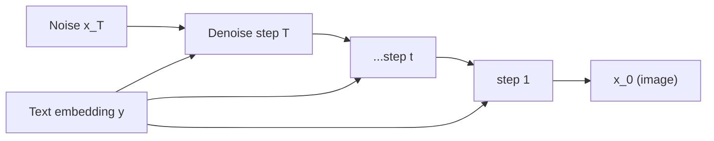

# 4.4 — Diffusion Models (DDPM, Stable Diffusion)

## 1. Intuition first
Start from pure noise. Learn to gradually denoise it into a sample from your training distribution. Training is easier than GANs (single loss, no adversary), and results now dominate image / audio / video generation.

## 2. Why the topic exists
- Better sample quality than GANs.
- Stable training.
- Controllable via text / images / poses (ControlNet).

## 3. What problem it solves
Generate high-fidelity images/audio/video/molecules from noise, optionally conditioned on text.

## 4. Mathematics

### 4.1 Forward (noising) process (fixed)
For $x_0 \sim p_\text{data}$, define $x_t = \sqrt{\bar\alpha_t}\, x_0 + \sqrt{1 - \bar\alpha_t}\, \epsilon$ with $\epsilon \sim \mathcal{N}(0, I)$ and cumulative $\bar\alpha_t = \prod_{s=1}^t (1 - \beta_s)$.

### 4.2 Reverse (denoising) process (learned)
Model $\epsilon_\theta(x_t, t)$ predicts the noise added at step $t$. Loss (Ho et al. 2020):

$$
L = \mathbb{E}_{x_0, \epsilon, t} \|\epsilon - \epsilon_\theta(x_t, t)\|^2
$$

Sampling reverses noise step by step (DDPM, DDIM, DPM-Solver, ODE solvers).

### 4.3 Classifier-free guidance
Train jointly with/without condition; at inference $\hat\epsilon = (1+w) \epsilon_\theta(x_t | y) - w \epsilon_\theta(x_t | \varnothing)$. Larger $w$ → stronger alignment to condition.

### 4.4 Latent Diffusion (Stable Diffusion)
Encode images with a VAE into small latent (e.g. 64×64) → run diffusion in latent space → decode. 10× cheaper training + sampling.

### 4.5 ControlNet
Add a copy of the UNet trained to accept extra structural condition (pose, edges, depth) via zero-conv connections.

### 4.6 DDIM / DPM-Solver
Deterministic / higher-order solvers → 20–50 sampling steps (vs 1000).

## 5. Every formula explained
- Forward noising is closed-form → can jump to any $t$ in one shot for training.
- Loss = MSE between true noise and predicted noise.
- Guidance interpolates conditional vs unconditional predictions.

## 6. Variables
$t \in \{1..T\}$ diffusion step; $\beta_t$ noise schedule; $\bar\alpha_t$ cumulative; $\epsilon_\theta$ noise predictor; $w$ guidance strength.

## 7. Algorithm — training & sampling

**Training:**
1. Sample $x_0$, $t$, $\epsilon$.
2. Compute $x_t$.
3. Predict noise; MSE loss.
4. Backprop.

**Sampling (DDIM):**
Start $x_T \sim \mathcal{N}(0, I)$; for $t = T, T-1, \ldots, 1$: predict $\epsilon$; step to $x_{t-1}$ using DDIM update.

## 8. Simple example
Train a small UNet on MNIST; sample denoised digits after 100 steps.

## 9. Real-world example
- Stable Diffusion, SDXL, Flux — text-to-image.
- Sora, Runway — text-to-video.
- Riffusion, MusicGen — text-to-audio.
- AlphaFold-3 uses diffusion for molecular structure.

## 10. Diagram


## 11. Implementation from scratch — DDPM (tiny)
```python
import torch, torch.nn as nn
class TinyUNet(nn.Module):
    def __init__(self, c=1, base=64):
        super().__init__()
        self.time_mlp = nn.Sequential(nn.Linear(1, base), nn.SiLU(), nn.Linear(base, base))
        self.d1 = nn.Conv2d(c, base, 3, padding=1)
        self.d2 = nn.Conv2d(base, base, 3, padding=1)
        self.u1 = nn.Conv2d(base, base, 3, padding=1)
        self.out = nn.Conv2d(base, c, 3, padding=1)
    def forward(self, x, t):
        temb = self.time_mlp(t.unsqueeze(-1).float())[:, :, None, None]
        h = torch.relu(self.d1(x) + temb)
        h = torch.relu(self.d2(h) + temb)
        h = torch.relu(self.u1(h) + temb)
        return self.out(h)

T = 1000
betas = torch.linspace(1e-4, 0.02, T)
alphas = 1 - betas; alpha_bar = torch.cumprod(alphas, 0)

def train_step(model, x0):
    t = torch.randint(0, T, (x0.size(0),))
    eps = torch.randn_like(x0)
    xt = alpha_bar[t].sqrt()[:, None, None, None] * x0 + (1 - alpha_bar[t]).sqrt()[:, None, None, None] * eps
    pred = model(xt, t)
    return ((pred - eps) ** 2).mean()
```

## 12. Implementation using libraries
```python
from diffusers import StableDiffusionPipeline
pipe = StableDiffusionPipeline.from_pretrained("runwayml/stable-diffusion-v1-5", torch_dtype=torch.float16).to("cuda")
img = pipe("a cinematic photo of a red panda astronaut", guidance_scale=7.5, num_inference_steps=30).images[0]
```

Fine-tune / ControlNet / LoRA all via `diffusers`.

## 13. Time complexity
Training: many gradient steps × UNet forward. Sampling: #steps × UNet forward.

## 14. Space complexity
UNet + VAE + text encoder (CLIP). SDXL ≈ 6 GB weights.

## 15. Advantages
State-of-the-art quality; stable training; controllable; strong open ecosystem.

## 16. Disadvantages
Slower sampling than GANs; expensive training.

## 17. Interview questions
1. Explain forward + reverse diffusion.
2. Why does the loss reduce to MSE on noise?
3. Classifier-free guidance intuition.
4. DDPM vs DDIM.
5. Latent Diffusion — why?
6. ControlNet mechanism.
7. Scale of noise schedules (linear, cosine).
8. Rectified flow / flow matching — new direction.
9. Compare diffusion vs GAN vs VAE.
10. Guidance = 1 vs > 1 vs negative prompts.

## 18. Common mistakes
- Wrong normalization ([-1, 1] vs [0, 1]).
- Using too few sampling steps with a naive solver.
- Wrong text-encoder pairing.

## 19. Optimization techniques
DPM-Solver, LCM (latent consistency), distillation to 1–4 steps (SDXL Turbo), quantized UNet, xFormers memory-efficient attention.

## 20. Coding exercises
1. Train a tiny DDPM on MNIST.
2. Implement DDIM sampler.
3. Add classifier-free guidance.
4. Fine-tune Stable Diffusion with LoRA on 20 images of yourself.

## 21. Mini project
Text-to-image demo app with Streamlit + Stable Diffusion.

## 22. Medium project
Train a ControlNet for pose-conditioned image generation.

## 23. Advanced project
Distill SDXL into a 4-step consistency model; benchmark FID vs LCM.

## 24. Where it is used in industry
Midjourney, Runway, Stability, Adobe Firefly, Meta Emu, Google Imagen.

## 25. How companies use it
- Creative tools (Photoshop generative fill).
- Marketing content generation.
- Product design.
- Scientific applications (protein / molecule generation).

## 26. When NOT to use it
- Ultra-low-latency image generation (< 100 ms) — use distilled 1-step models.
- When you need factual textual accuracy — diffusion still struggles with text-in-image.
