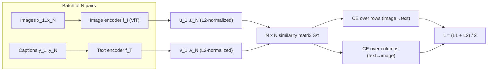
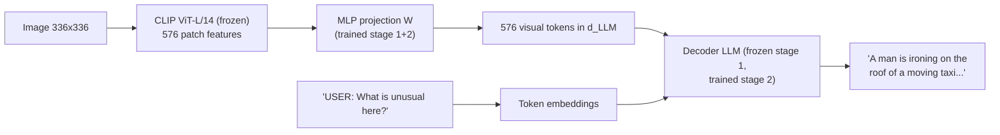
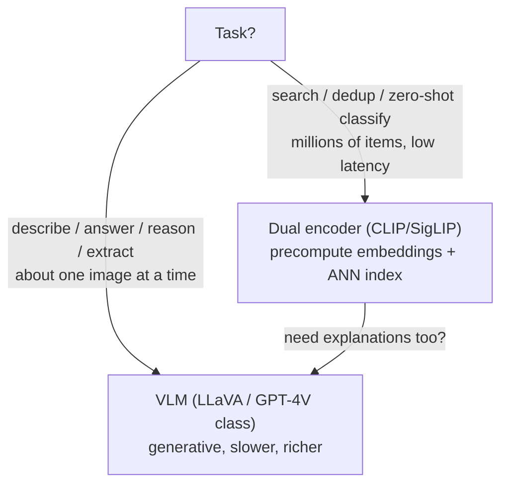
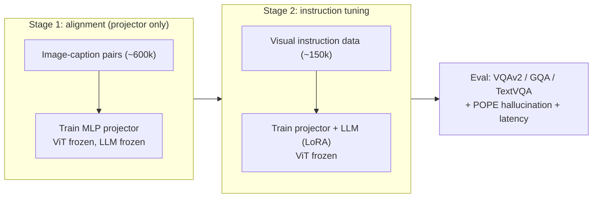

# 4.5 — Multimodal Models (CLIP, LLaVA, VLMs)

## 1. Overview

**What is it?** Multimodal models connect two or more modalities — most importantly images and text — in a single system. There are two dominant designs: **contrastive dual encoders** (CLIP, SigLIP) that embed images and texts into a *shared vector space* where matching pairs are close; and **vision-language models** (VLMs — LLaVA, GPT-4V, Gemini, Qwen-VL) that feed visual tokens into a large language model so it can *reason and generate text about images*.

**Why does it exist?** Vision models classify fixed label sets; language models know about the open world but cannot see. Aligning the two gives open-vocabulary vision: classify, retrieve, or describe *anything you can name*, without training a new head per task. CLIP (2021) showed that 400M web image-caption pairs and a contrastive loss produce zero-shot classifiers rivaling supervised baselines; LLaVA and GPT-4V showed that a projection layer is enough to make an LLM "see".

**What problem does it solve?** Cross-modal retrieval (search photos by text), zero-shot classification, image captioning, visual question answering (VQA), document/chart understanding, grounding for robotics, and providing the text encoder for [diffusion models](04-diffusion-models.md).

**Where is it used?** Google and Pinterest image search, OpenAI's GPT-4o vision, Anthropic's Claude vision, content moderation pipelines, e-commerce visual search at Amazon, robotics (Google's RT-2), and inside every text-to-image system.

## 2. Learning Objectives

After this chapter you will be able to:

- Explain contrastive learning and derive the InfoNCE / CLIP loss step by step, including the role of temperature.
- Explain why CLIP needs very large batches and how SigLIP's sigmoid loss relaxes this.
- Implement the symmetric CLIP loss in a dozen lines and train a small dual encoder.
- Perform zero-shot classification with CLIP, including prompt-template engineering.
- Build cross-modal retrieval (text→image, image→text) with normalized embeddings and nearest-neighbor search.
- Describe the LLaVA architecture — vision encoder, projection, LLM — and its two-stage training recipe.
- Compare multimodal fusion patterns: late fusion (dual encoders), cross-attention (Flamingo), early/interleaved token fusion (LLaVA, Gemini-style).
- Identify CLIP's documented failure modes: compositionality, counting, fine-grained categories, typographic attacks.
- Fine-tune CLIP or a small VLM (LoRA) for a domain task and evaluate it properly.
- Decide when a contrastive embedding model vs a generative VLM is the right tool.

## 3. Prerequisites

| Chapter | Why you need it |
|---|---|
| [Transformers](../phase-2-deep-learning/10-transformer.md) | Both CLIP's encoders and every VLM's LLM are transformers. |
| [Attention](../phase-2-deep-learning/09-attention.md) | Cross-attention is how Flamingo-style fusion injects vision into an LLM. |
| [Image Classification](01-image-classification.md) | The vision encoder is a ViT; zero-shot classification replaces the linear head with text embeddings. |
| [GPT & Pretraining](../phase-3-nlp-llm/05-gpt-pretraining.md) | VLMs are decoder LLMs with extra visual tokens; next-token training carries over unchanged. |
| [Loss Functions](../phase-2-deep-learning/04-loss-functions.md) | InfoNCE is cross-entropy over similarity scores; you need CE fluency. |
| [Diffusion Models](04-diffusion-models.md) | Stable Diffusion conditions on a CLIP text encoder — one major consumer of this chapter. |

## 4. Intuition

Imagine a vast library where photographs and their captions are filed on the same shelves: the photo of a golden retriever on a beach sits right next to the sentence "a dog playing by the sea", while a spreadsheet screenshot lives in a distant aisle. If you can build such a library — a **shared embedding space** — then search becomes geometry: embed your query (text *or* image), walk to that shelf, and everything nearby is relevant, regardless of modality.

**How do you train the librarian?** Contrastive learning is a matching game. Show the librarian 8 photos and 8 captions from 8 photo-caption pairs, shuffled. Her job: match each photo to its own caption. Every correct pairing should score high (embeddings close), every wrong pairing low (far apart). Play this game billions of times with web data and the librarian learns that "chihuahua", "small tan dog", and pictures of chihuahuas all belong together — without anyone defining a "chihuahua class".

**And the VLM?** A dual encoder can *find* the right shelf but cannot *discuss* what's on it. A VLM is like giving a brilliant blind essayist (the LLM) a translator who converts images into the essayist's native language: the vision encoder summarizes the image into a few hundred "visual words" (tokens), a small projection layer translates them into the LLM's token space, and from then on the LLM treats the image as just more context to reason over — "What's unusual about this image?" becomes answerable.

## 5. Real-world Motivation

- **OpenAI** trained CLIP to solve the labels bottleneck — its zero-shot ImageNet accuracy (76% for the largest model) matched a supervised ResNet-50 without using ImageNet labels; CLIP's text encoder then became the conditioning backbone of DALL·E 2 and Stable Diffusion. GPT-4V/GPT-4o brought VLM capability to hundreds of millions of users.
- **Google** built SigLIP (a better-scaling contrastive recipe) and Gemini, which is natively multimodal (interleaved text/image/audio/video tokens from pretraining); Google Lens and Photos search are production cross-modal retrieval.
- **Meta** uses multimodal embeddings for content moderation and marketplace search; its open releases (ImageBind, LLaMA-3.2-Vision) power much of the open ecosystem, and [SAM](03-segmentation.md)+CLIP combinations enable open-vocabulary segmentation.
- **Amazon** ships visual search (StyleSnap, camera search) — photograph a product, retrieve the catalog item — a direct dual-encoder application.
- **Pinterest** built visual discovery on joint embeddings years before CLIP and moved to CLIP-style models since.
- **Robotics**: Google DeepMind's RT-2 feeds robot camera frames through a VLM so that web-scale semantics ("pick up the extinct animal" → grabs the dinosaur toy) transfer to manipulation.

## 6. Mathematical Foundations

### 6.1 Setup: dual encoders and cosine similarity

An image encoder $f_I$ (a ViT — see [Image Classification](01-image-classification.md)) and a text encoder $f_T$ (a transformer) map inputs to $\mathbb{R}^d$ ($d = 512$–1024). Embeddings are **L2-normalized**:

$$
u_i = \frac{f_I(x_i)}{\|f_I(x_i)\|}, \qquad v_j = \frac{f_T(y_j)}{\|f_T(y_j)\|}
$$

so the similarity $s_{ij} = u_i^\top v_j = \cos(f_I(x_i), f_T(y_j)) \in [-1, 1]$.

### 6.2 The CLIP (InfoNCE) loss — derivation

Take a batch of $N$ *paired* examples $\{(x_i, y_i)\}$: image $x_i$ belongs with caption $y_i$. Intuition: for image $i$, treat "which caption matches?" as an $N$-way classification problem whose correct answer is $i$. Turn similarities into logits with a **temperature** $\tau > 0$: logits$_{ij} = s_{ij}/\tau$. The image→text loss is standard cross-entropy against label $i$:

$$
\mathcal{L}_{I \to T} = -\frac{1}{N}\sum_{i=1}^{N} \log \frac{\exp(s_{ii}/\tau)}{\sum_{j=1}^{N} \exp(s_{ij}/\tau)}
$$

Symmetrically, for each caption, "which image matches?" gives $\mathcal{L}_{T \to I}$ with the sum over the first index. The full loss:

$$
\boxed{\ \mathcal{L}_{CLIP} = \frac{1}{2}\left(\mathcal{L}_{I \to T} + \mathcal{L}_{T \to I}\right) = -\frac{1}{2N}\sum_{i}\left[ \log \frac{e^{s_{ii}/\tau}}{\sum_j e^{s_{ij}/\tau}} + \log \frac{e^{s_{ii}/\tau}}{\sum_j e^{s_{ji}/\tau}} \right]\ }
$$

**Gradient intuition**: exactly as in softmax-CE (see [Loss Functions](../phase-2-deep-learning/04-loss-functions.md)), the gradient on each logit is $p_{ij} - \mathbb{1}[i=j]$ — the positive pair is pulled together, all $N-1$ negatives in the row/column are pushed apart in proportion to how confusable they are. This is why **batch size matters**: with $N = 32{,}768$ (CLIP's actual batch), each positive competes against 32,767 negatives, giving a much harder, more informative task than with $N = 64$. InfoNCE is also a lower bound on mutual information between the modalities, with the bound capped at $\log N$ — another reason big $N$ helps.

**Temperature** $\tau$ scales logit sharpness: small $\tau$ (e.g., 0.01) makes the softmax concentrate on the hardest negatives (large gradients on near-misses); large $\tau$ spreads gradient over all negatives. CLIP *learns* $\tau$ (parameterized as $e^{\text{logit\_scale}}$, initialized to $1/0.07$, clamped at 100) — it typically anneals to ~0.01 by convergence.

### 6.3 Zero-shot classification

To classify an image into classes $\{c_1, \dots, c_C\}$ with no training: write each class as a prompt $y_k = $ "a photo of a $\{c_k\}$", embed all prompts to get $v_1..v_C$, embed the image to $u$, and predict

$$
\hat c = \arg\max_k \frac{u^\top v_k}{\tau}
$$

— the text embeddings *are* the classifier weights: a linear classifier whose weight matrix is generated from language. **Prompt templates matter** (+~5% on ImageNet): "a photo of a {}" beats the bare class name because captions in training data are sentences; ensembling 80 templates ("a photo of a big {}", "a blurry photo of a {}"…, averaging the *embeddings*) helps further.

### 6.4 SigLIP: sigmoid loss

Softmax InfoNCE couples every example in the batch through the normalizing sum — requiring the full $N \times N$ similarity matrix (communication-heavy across devices) and favoring huge batches. SigLIP (Zhai et al., 2023) treats every pair $(i, j)$ as an **independent binary classification**: is this a match?

$$
\mathcal{L}_{SigLIP} = -\frac{1}{N}\sum_{i=1}^{N}\sum_{j=1}^{N} \log \sigma\big( z_{ij} (t \cdot s_{ij} + b) \big), \qquad z_{ij} = \begin{cases} +1 & i = j \\ -1 & i \neq j \end{cases}
$$

where $\sigma$ is the sigmoid, $t$ a learnable scale, and $b$ a learnable bias (initialized negative, e.g., −10, because negatives vastly outnumber positives). No normalization across the batch means: (1) strong performance at moderate batch sizes (8–16k, and reasonable even at 4k); (2) device-friendly chunked computation. SigLIP models are the default vision encoders in current open VLMs (e.g., PaLiGemma, many LLaVA descendants).

### 6.5 VLM architecture: LLaVA

LLaVA (Liu et al., 2023) is the minimal recipe for giving an LLM vision:

1. **Vision encoder**: frozen CLIP ViT-L/14 — an image at 336² becomes a grid of $24 \times 24 = 576$ patch features $Z_v \in \mathbb{R}^{576 \times 1024}$ (penultimate-layer features, not the pooled embedding — spatial detail matters).
2. **Projection**: a trainable MLP $W$ maps each patch feature to the LLM's embedding dimension: $H_v = W Z_v \in \mathbb{R}^{576 \times d_{LLM}}$ (LLaVA-1: linear; LLaVA-1.5: 2-layer MLP).
3. **LLM**: the projected visual tokens are *prepended/inserted into the token sequence* like ordinary word embeddings: `[system]  USER: What's in this image? ASSISTANT: ...`; the decoder LLM (Vicuna/LLaMA) then trains with the ordinary next-token cross-entropy of [GPT pretraining](../phase-3-nlp-llm/05-gpt-pretraining.md), computed **only on the response tokens**.

**Two-stage training**: Stage 1 (alignment): freeze the vision encoder *and* the LLM; train only the projection on ~600k image-caption pairs — teach the translator, not the essayist. Stage 2 (visual instruction tuning): unfreeze the LLM (keep vision frozen); train on ~150k GPT-4-generated multimodal instruction conversations (questions, descriptions, reasoning about images). The striking lesson: a strong open VLM needs only a projection layer and good instruction data on top of pretrained unimodal parts.

### 6.6 Fusion patterns — the design space

| Pattern | Mechanism | Examples | Trade-offs |
|---|---|---|---|
| **Late fusion (dual encoder)** | Separate encoders; interact only via dot product | CLIP, SigLIP | Precomputable embeddings → cheap retrieval at scale; no fine-grained cross-modal reasoning |
| **Cross-attention fusion** | Frozen LLM; inserted cross-attn layers attend to vision features | Flamingo, LLaMA-3.2-Vision | LLM weights untouched (preserves text skill); adds parameters; handles interleaved media |
| **Early / token fusion** | Visual tokens concatenated into the LLM sequence | LLaVA, GPT-4o-style, Gemini | Deepest interaction, simplest architecture; visual tokens consume context; quadratic attention cost |

A fourth axis is **native multimodality** (Gemini, GPT-4o): pretrain from scratch on interleaved multimodal sequences rather than bolting vision onto a text LLM — better integration, vastly higher cost.

### 6.7 Beyond image-text

The same contrastive template aligns other modalities: **CLAP** (audio-text), **VideoCLIP** and successors (video-text, with temporal pooling or frame sampling), and **ImageBind** (six modalities aligned to images as the pivot). The math of §6.2 is unchanged — only the encoders differ.

## 7. Visual Explanation

CLIP training — the $N \times N$ similarity matrix with the diagonal as targets:



```
            captions →   y1    y2    y3    y4
   images ↓
      x1              [ 0.9   0.1   0.2   0.0 ]   ← row CE: target col 1
      x2              [ 0.2   0.8   0.1   0.1 ]
      x3              [ 0.1   0.0   0.7   0.2 ]
      x4              [ 0.0   0.2   0.1   0.9 ]
                        diagonal = positives; everything else = negatives
```

LLaVA architecture and training stages:



Choosing between the two families:



## 8. Algorithm

**CLIP training:**

1. Assemble a large paired dataset (web image, alt-text/caption) — data curation dominates final quality (LAION → DataComp lesson).
2. Per step: sample $N$ pairs; encode images and texts; L2-normalize both sets.
3. Compute the $N\times N$ matrix $S/\tau$ with learnable $\tau$.
4. Loss = mean of row-wise CE (targets = diagonal) and column-wise CE; backprop through both encoders and $\tau$.
5. Repeat for ~billions of examples (32k batch, AdamW, cosine schedule); evaluate zero-shot ImageNet + retrieval recall@K throughout.

**Zero-shot classification (inference):**

1. For each class, format prompt(s), encode, average over templates, normalize → matrix $V \in \mathbb{R}^{C \times d}$ (computed once, cached).
2. Encode image → $u$; predict $\arg\max$ of $Vu$.

**LLaVA training:**

1. Stage 1: freeze ViT + LLM; train projection on caption pairs with next-token loss on captions.
2. Stage 2: freeze ViT; train projection + LLM (optionally LoRA) on instruction conversations, loss only on assistant tokens.

Pseudocode (CLIP step):

```text
u = normalize(f_I(images))          # (N, d)
v = normalize(f_T(texts))           # (N, d)
S = (u @ v.T) * exp(logit_scale)    # (N, N), logit_scale learnable
labels = [0..N-1]                   # diagonal
loss = (CE(S, labels) + CE(S.T, labels)) / 2
```

## 9. Worked Example

### Tiny example by hand: a 2-pair batch

Batch: (cat photo, "a cat") and (dog photo, "a dog"). Suppose after encoding and normalizing, cosine similarities are:

|  | "a cat" | "a dog" |
|---|---|---|
| cat image | 0.6 | 0.2 |
| dog image | 0.1 | 0.5 |

With $\tau = 0.5$ (so logits = similarities × 2):

1. **Row 1 (cat image)**: logits $(1.2, 0.4)$. Softmax: $e^{1.2} = 3.32$, $e^{0.4} = 1.49$; $p = (0.69, 0.31)$. Loss $= -\log 0.69 = 0.371$.
2. **Row 2 (dog image)**: logits $(0.2, 1.0)$; $p = (0.31, 0.69)$; loss $= 0.371$.
3. **Columns** (text→image direction): column 1 logits $(1.2, 0.2)$ → loss $-\log(0.731) = 0.313$; column 2 logits $(0.4, 1.0)$ → loss $0.313$.
4. **Total**: $\frac{1}{2}\left(\frac{0.371+0.371}{2} + \frac{0.313+0.313}{2}\right) = 0.342$.
5. **Gradient check**: for row 1, $\partial \mathcal{L}/\partial \text{logit} = p - y = (0.69 - 1, 0.31) = (-0.31, +0.31)$ — the cat-cat similarity is pushed up, cat-dog pushed down. Now imagine 32,768 columns instead of 2: the same mechanics, but the model must beat tens of thousands of distractors — that is where discrimination sharpness comes from.

### Realistic example

Zero-shot CIFAR-10 with off-the-shelf CLIP ViT-B/32: embed the ten prompts "a photo of a {airplane, automobile, …}", classify 10,000 test images by cosine argmax — ~89% accuracy with zero training. Swapping bare class names for the prompt template gains several points; ensembling 7 templates gains ~1 more. A supervised linear probe on the same frozen features reaches ~95% — the gap is what task-specific labels still buy you.

## 10. Python from Scratch

The CLIP loss, zero-shot classification, and the batch-size effect in NumPy:

```python
import numpy as np
rng = np.random.default_rng(0)

def normalize(x):
    return x / np.linalg.norm(x, axis=-1, keepdims=True)

def clip_loss(u, v, tau=0.07):
    """Symmetric InfoNCE. u: image emb (N,d), v: text emb (N,d), both raw."""
    u, v = normalize(u), normalize(v)
    S = u @ v.T / tau                       # (N,N) logits; diagonal = positives
    N = len(S)
    # log-softmax over rows (image->text) and columns (text->image)
    def ce_diag(logits):
        logits = logits - logits.max(axis=1, keepdims=True)   # stability
        logZ = np.log(np.exp(logits).sum(axis=1))
        return -(logits[np.arange(N), np.arange(N)] - logZ).mean()
    return 0.5 * (ce_diag(S) + ce_diag(S.T))

# ---- Verify the hand example from section 9 ----
# Construct embeddings that reproduce the similarity table (d=2 suffices).
u = np.array([[1.0, 0.0], [0.0, 1.0]])                 # cat img, dog img
v = np.array([[0.6, 0.1], [0.2, 0.5]]).T.copy()        # cols were text sims
v = np.array([[0.6, 0.2], [0.1, 0.5]])                 # "a cat", "a dog"
S = u @ v.T                                            # exactly the table
print(np.round(S, 2))                                  # [[0.6 0.2],[0.1 0.5]]
# (skip normalization here to match the hand numbers exactly)
def ce_diag_raw(logits):
    logits = logits - logits.max(axis=1, keepdims=True)
    logZ = np.log(np.exp(logits).sum(axis=1))
    return -(np.diag(logits) - logZ).mean()
L = 0.5 * (ce_diag_raw(S / 0.5) + ce_diag_raw(S.T / 0.5))
print(round(L, 3))                                     # -> 0.342  ✓ matches §9

# ---- Zero-shot classification: text embeddings ARE the classifier ----
d, C = 64, 5
class_text_emb = normalize(rng.normal(size=(C, d)))    # "a photo of a {c}" x5
img = normalize(rng.normal(size=(1, d)) + class_text_emb[2])  # near class 2
pred = (img @ class_text_emb.T).argmax()
print("predicted class:", pred)                        # -> 2

# ---- Why batch size matters: loss floor for a random model is log(N) ----
for N in [8, 128, 2048]:
    u_r, v_r = rng.normal(size=(N, d)), rng.normal(size=(N, d))
    print(f"N={N:5d}  random-model loss ≈ {clip_loss(u_r, v_r):.2f}"
          f"  (log N = {np.log(N):.2f})")
# Larger N -> harder task -> more informative gradients per positive pair.
```

Complexity: the similarity matrix is $O(N^2 d)$ time and $O(N^2)$ memory — at $N = 32$k that matrix alone is 4 GB fp32, hence the distributed all-gather tricks (and SigLIP's chunkable loss). **Common bug**: forgetting L2 normalization — dot products then conflate embedding *norm* with similarity, the temperature calibration breaks, and retrieval quality silently craters.

## 11. Library Implementation

Zero-shot classification and retrieval with Hugging Face CLIP, then a VLM (LLaVA) and the from-scratch loss in PyTorch:

```python
import torch, torch.nn.functional as F
from PIL import Image
from transformers import CLIPModel, CLIPProcessor

device = "cuda" if torch.cuda.is_available() else "cpu"
model = CLIPModel.from_pretrained("openai/clip-vit-base-patch32").to(device).eval()
proc = CLIPProcessor.from_pretrained("openai/clip-vit-base-patch32")

# ---------- Zero-shot classification ----------
labels = ["cat", "dog", "car", "pizza"]
prompts = [f"a photo of a {c}" for c in labels]        # template matters (+~5%)
img = Image.open("photo.jpg")
inputs = proc(text=prompts, images=img, return_tensors="pt", padding=True).to(device)
with torch.no_grad():
    out = model(**inputs)
# logits_per_image = image_emb @ text_emb.T * logit_scale  -> (1, 4)
probs = out.logits_per_image.softmax(dim=-1)
print(dict(zip(labels, probs[0].tolist())))            # e.g. {'cat': 0.97, ...}

# ---------- Retrieval: precompute a gallery, search by text ----------
with torch.no_grad():
    img_emb = model.get_image_features(**proc(images=gallery, return_tensors="pt").to(device))
    img_emb = F.normalize(img_emb, dim=-1)             # (M, 512) — cache to disk
    q = model.get_text_features(**proc(text=["a red bicycle"],
                                       return_tensors="pt", padding=True).to(device))
    q = F.normalize(q, dim=-1)                         # (1, 512)
topk = (q @ img_emb.T).topk(5)                         # cosine sim = dot product
# For millions of images: put img_emb in a FAISS/HNSW index instead.

# ---------- The training loss (what you'd use to fine-tune) ----------
def clip_loss(image_emb, text_emb, logit_scale):
    image_emb = F.normalize(image_emb, dim=-1)
    text_emb = F.normalize(text_emb, dim=-1)
    logits = image_emb @ text_emb.T * logit_scale.exp()   # (N, N)
    labels = torch.arange(len(logits), device=logits.device)
    return (F.cross_entropy(logits, labels) +             # image -> text
            F.cross_entropy(logits.T, labels)) / 2        # text  -> image

# ---------- VLM: LLaVA-1.5 inference ----------
from transformers import LlavaForConditionalGeneration, AutoProcessor
llava = LlavaForConditionalGeneration.from_pretrained(
    "llava-hf/llava-1.5-7b-hf", torch_dtype=torch.float16).to(device)
lproc = AutoProcessor.from_pretrained("llava-hf/llava-1.5-7b-hf")
prompt = "USER: <image>\nWhat is unusual about this image? ASSISTANT:"
inp = lproc(images=img, text=prompt, return_tensors="pt").to(device, torch.float16)
ids = llava.generate(**inp, max_new_tokens=128)
print(lproc.decode(ids[0], skip_special_tokens=True))
# The <image> placeholder expands to 576 visual tokens inside the model.
```

**Common bug**: fine-tuning CLIP with a small batch (e.g., 32) and the default learned temperature — the few in-batch negatives are too easy, the loss collapses quickly while retrieval on held-out data *degrades* (embedding space deforms). Fixes: gather negatives across GPUs, use a memory bank/queue, freeze the temperature, or switch to a SigLIP-style loss.

## 12. Code Walkthrough

Tensor shapes for CLIP ViT-B/32 zero-shot (4 classes) and LLaVA-1.5-7B:

| Tensor | Shape | Meaning |
|---|---|---|
| CLIP pixel input | (1, 3, 224, 224) | Preprocessed image |
| CLIP text input | (4, 77) | Tokenized prompts, padded to 77 |
| image features | (1, 512) | Projected, then L2-normalized |
| text features | (4, 512) | One per class prompt |
| logits_per_image | (1, 4) | cosine × logit_scale (≈100 at convergence) |
| LLaVA patch features | (1, 576, 1024) | ViT-L/14 @336: 24×24 patches |
| projected visual tokens | (1, 576, 4096) | After MLP, in LLaMA embedding space |
| full input sequence | (1, ~600+, 4096) | 576 visual + text prompt tokens |
| generated ids | (1, ≤128) | Autoregressive answer tokens |

Inputs: raw image + label prompts (CLIP) or image + conversation (LLaVA). Outputs: class probabilities / free-text answer. Intermediate values worth checking: embedding norms (must be 1.0 after normalization), `logit_scale.exp()` (a healthy trained CLIP sits near 100 — i.e., $\tau \approx 0.01$), and for LLaVA, that the number of image placeholder tokens equals what the processor inserted (mismatch → cryptic shape errors). Expected results: CLIP assigns >0.9 to the correct everyday class; LLaVA-1.5-7B answers simple VQA correctly and describes unusual scenes coherently.

## 13. Complexity Analysis

- **CLIP training**: per step $O(N \cdot \text{FLOPs}_{enc}) + O(N^2 d)$ for the similarity matrix. At $N = 32$k the matrix is $10^9$ entries — distributed training all-gathers embeddings (cheap: $N \times d$) rather than images, but the softmax still couples all devices; SigLIP's pairwise loss removes that coupling. Original CLIP: hundreds of GPUs for weeks.
- **Zero-shot / retrieval inference**: one encoder forward per item; class/text embeddings precomputed. Search over $M$ gallery items is $O(Md)$ exact, or $O(\log M)$-ish with an ANN index (HNSW/FAISS) — this precomputability is *the* systems advantage of dual encoders: a Pinterest-scale index serves billions of items.
- **VLM inference**: the 576 visual tokens join the LLM context, so attention pays $O((L_{vis}+L_{txt})^2)$ — vision inflates prefill notably (576 tokens ≈ a page of text); generation cost is standard LLM decoding. High-resolution schemes (tiling into multiple 336² crops) multiply visual tokens and are the main VLM latency lever.
- **Space**: CLIP ViT-B/32 ≈ 150M params (~600 MB fp32; embeddings only 512 floats/item — 2 KB, why billion-scale indexes fit); LLaVA-1.5-7B ≈ 14 GB fp16.

## 14. Advantages

- **Zero-shot, open vocabulary**: classify or retrieve any concept you can phrase — no retraining when the taxonomy changes (a moderation team adds "surfboard on fire" as a query, not a dataset).
- **Precomputable embeddings**: gallery vectors are computed once; search is a dot product — real-time visual search over billions of items (Pinterest, Amazon).
- **Transferable encoders**: CLIP/SigLIP vision towers are the standard backbones for VLMs, open-vocabulary detection (OWL-ViT, Grounding-DINO), and diffusion conditioning — one pretrained model, many consumers.
- **VLMs collapse task pipelines**: one model handles captioning, VQA, OCR-ish reading, chart analysis, and UI understanding — replacing a zoo of task-specific systems (GPT-4o's screenshot-to-code demos).
- **Language as supervision scales**: web alt-text is nearly free compared to expert labels; performance keeps improving with data curation rather than annotation budgets.

## 15. Disadvantages

- **Compositionality failures**: CLIP-style models behave partly like bag-of-words — "a horse riding an astronaut" and "an astronaut riding a horse" score nearly the same (documented by the Winoground and ARO benchmarks).
- **Counting and spatial relations**: "three cats" vs "four cats", "left of" vs "right of" are unreliable in contrastive embeddings; VLMs are better but not solved.
- **Fine-grained recognition**: species-level or part-level distinctions underperform dedicated classifiers ([fine-grained classification](01-image-classification.md)) — captions rarely mention the discriminating detail.
- **Typographic attacks**: a literal apple with a paper label "iPod" flips CLIP's prediction — text in images leaks into the embedding.
- **VLM hallucination**: LLaVA-class models describe objects that are not present (language-prior bias), a serious risk for medical/industrial use; needs grounded evaluation (POPE and similar).
- **Data and bias**: web-scale training data embeds societal biases and noisy correlations; multimodal filtering is harder than text-only.
- **Compute economics**: pretraining is out of reach for most teams (fine-tuning is not) — you inherit the base model's blind spots.

## 16. Common Mistakes

- **Skipping L2 normalization** before dot products — similarity becomes norm-dominated and rankings are wrong. Normalize both sides, always.
- **Fine-tuning with tiny batches and the default loss** — weak negatives collapse the space (see §11's bug note). Gather negatives, freeze τ, or use sigmoid loss.
- **Bare class names as zero-shot prompts** — "a photo of a {}" and template ensembles are worth ~5 points; match templates to the domain ("a satellite image of {}").
- **Mismatched preprocessing** — CLIP's own resize/crop/normalization (via its processor) is part of the model; custom transforms silently degrade accuracy.
- **Using the pooled CLIP embedding where spatial features are needed** — VLM projectors consume the *patch grid*, not the single pooled vector; pooling first destroys localization.
- **Evaluating a fine-tuned CLIP only on the fine-tuning domain** — measure retention on a general benchmark too; contrastive fine-tunes overwrite general knowledge quickly (consider LoRA or interpolating weights).
- **Trusting VLM outputs without grounding checks** — always evaluate hallucination (e.g., POPE-style yes/no object probes) before deploying descriptions as facts.
- **Wrong chat/prompt format for the specific VLM** — each (LLaVA, Qwen-VL, Idefics) has its own image-token and role syntax; wrong format degrades quality without erroring.

## 17. Best Practices

- [ ] Default choice: SigLIP or OpenCLIP checkpoints for embeddings (check DataComp-trained variants); LLaVA-class or hosted VLMs for reasoning tasks.
- [ ] Cache and version gallery embeddings; store the model + preprocessing hash alongside them (embeddings from different checkpoints don't mix).
- [ ] Zero-shot: use domain-appropriate template ensembles; validate on a small labeled slice before trusting.
- [ ] Retrieval at scale: FAISS/HNSW index, inner-product metric on normalized vectors; re-rank top-k with a heavier model (or a VLM) if precision matters.
- [ ] Fine-tuning CLIP: LoRA on both towers, moderate LR (1e-5–1e-6 backbone), gather negatives across devices, monitor both in-domain recall@K and general zero-shot retention.
- [ ] Fine-tuning VLMs: freeze the vision tower; LoRA the LLM; compute loss only on assistant tokens; keep some general instruction data mixed in to avoid catastrophic forgetting.
- [ ] Evaluate VLMs on task metrics *plus* hallucination probes; for extraction tasks, force structured output (JSON schema) and validate programmatically.
- [ ] Safety: multimodal inputs are a jailbreak surface (instructions embedded in images) — run OCR/content filters on inputs for user-facing systems.
- [ ] Latency: batch encoder calls; for VLMs, control visual token count (resolution/tiling) — it is the dominant prefill cost.

## 18. Optimization Techniques

- **ANN indexing (FAISS/HNSW/IVF-PQ)**: sub-millisecond search over 10⁸+ embeddings; product quantization cuts memory 16–32× with small recall loss.
- **Embedding quantization**: fp16 or int8 embeddings for storage/search — validate recall@K deltas; binary/Matryoshka embeddings for extreme scale.
- **Distillation**: distill CLIP into small towers (TinyCLIP, MobileCLIP) for on-device visual search; distill VLM capabilities into smaller LLMs with generated instruction data.
- **Batched/mixed-precision encoding**: fp16/bf16 encoders with large inference batches for gallery ingestion; `torch.compile` the towers.
- **Visual-token reduction for VLMs**: lower input resolution, token pruning/merging, or resampler modules (Perceiver/Q-Former style: 576 → 64 queries) — largest single VLM latency lever.
- **KV-cache and prefix caching**: system prompts and reused images (multi-turn over one image) should hit the LLM's prefix cache.
- **LoRA / QLoRA fine-tuning**: adapt 7B VLMs on one 24 GB GPU (4-bit base + rank-16 adapters).
- **Hard-negative mining**: for retrieval fine-tunes, mine near-duplicates and confusable pairs — quality per training pair beats raw pair count.

## 19. Industry Applications

- **Visual search & discovery (production example)**: Pinterest Lens and Amazon StyleSnap — CLIP-style dual encoders + ANN indexes serving billion-item catalogs with precomputed embeddings.
- **Search & organization**: Google Photos/Lens natural-language photo search; Apple Photos on-device semantic search.
- **Assistants**: GPT-4o, Claude, and Gemini vision — screenshot debugging, chart reading, document Q&A, accessibility descriptions (Be My Eyes runs on GPT-4 vision).
- **Content moderation**: CLIP-embedding similarity to policy-concept prompts enables rapid response to novel harmful content without dataset construction; VLMs adjudicate borderline cases.
- **E-commerce operations**: attribute extraction from product photos, duplicate-listing detection via embedding similarity, review-image relevance checks.
- **Document AI**: invoice/receipt extraction, chart-to-data, UI understanding for RPA — VLMs replacing brittle OCR+rules pipelines.
- **Robotics**: Google DeepMind RT-2 (VLM → action tokens) transferring web semantics to manipulation; open-vocabulary perception in warehouse robotics.
- **Media**: automatic alt-text at Meta scale; video moment search ("find the scene where…") with video-text embeddings.

## 20. Interview Questions

### Beginner

**Q1. What does CLIP learn, in one sentence, and what are its two components?**
A: CLIP learns a shared embedding space where an image and its matching text are close in cosine similarity; it consists of an image encoder (ViT or ResNet) and a text encoder (transformer) trained jointly with a symmetric contrastive loss.

**Q2. How does zero-shot classification with CLIP work?**
A: Embed each class as a prompt ("a photo of a {class}"), embed the image, and pick the class whose text embedding has the highest cosine similarity — the text embeddings act as the weights of a linear classifier generated from language, so no training is needed.

**Q3. Why must embeddings be L2-normalized?**
A: So the dot product equals cosine similarity, measuring only direction. Without normalization, embedding norms contaminate similarity scores, temperature calibration breaks, and retrieval rankings become unreliable.

**Q4. What is the temperature τ in the CLIP loss?**
A: A scalar dividing the similarities before softmax, controlling sharpness: small τ concentrates loss/gradient on the hardest negatives; large τ spreads it. CLIP learns τ (as a clamped `logit_scale`), typically converging near τ ≈ 0.01.

**Q5. What is the difference between CLIP and LLaVA in what they can do?**
A: CLIP produces embeddings — great for matching tasks (classify, retrieve, dedup) but it cannot generate or reason. LLaVA feeds projected visual tokens into an LLM, so it can describe images, answer questions, and reason — at much higher inference cost per image.

### Intermediate

**Q1. Derive the CLIP loss from cross-entropy.**
A: For a batch of $N$ pairs, form logits $S_{ij} = u_i^\top v_j/\tau$ with normalized embeddings. Image $i$'s matching caption defines an $N$-way classification with target $i$: $\mathcal{L}_{I\to T} = -\frac{1}{N}\sum_i \log \frac{e^{S_{ii}}}{\sum_j e^{S_{ij}}}$. Symmetrize with the column-wise loss $\mathcal{L}_{T \to I}$ (softmax over images for each caption) and average. The gradient per logit is softmax probability minus the diagonal indicator — positives pulled together, negatives pushed apart proportional to confusability.

**Q2. Why does CLIP need huge batches, and how does SigLIP change this?**
A: Each positive is contrasted against the $N-1$ in-batch negatives; small $N$ makes the task easy (loss floor $\log N$), giving weak gradients and poorly discriminating embeddings — hence CLIP's 32k batch. SigLIP replaces the batch-coupled softmax with independent per-pair sigmoid binary classification (learnable scale and negative-initialized bias), removing the global normalization: quality holds up at moderate batches and the loss computes in chunks without all-device coupling.

**Q3. Walk through LLaVA's architecture and its two training stages.**
A: Frozen CLIP ViT-L/14 gives 576 patch features per image; a trainable MLP projects them into the LLM's embedding space; they are inserted into the token sequence and a decoder LLM trains with next-token loss on responses. Stage 1 trains only the projection on image-caption pairs (aligning modalities without touching either pretrained model); stage 2 trains projection + LLM on GPT-4-generated visual instruction data (teaching conversation and reasoning over images).

**Q4. Compare the three fusion patterns and when you'd choose each.**
A: Late fusion (dual encoders): modalities meet only at a dot product — choose for retrieval/classification at scale (precomputable, indexable). Cross-attention (Flamingo, LLaMA-3.2-Vision): frozen LLM with inserted layers attending to visual features — choose to preserve text ability exactly and handle interleaved media. Token fusion (LLaVA, Gemini-style): visual tokens in the LLM sequence — deepest interaction and simplest design; choose for rich reasoning; cost is context consumption and prefill latency.

**Q5. How would you fine-tune CLIP for product retrieval without ruining it?**
A: LoRA both towers (or unfreeze with LR ≤ 1e-5), train on (product image, title/attributes) pairs with cross-device negative gathering and mined hard negatives (visually similar SKUs); freeze or re-clamp temperature; monitor in-domain recall@K *and* a general benchmark for retention; if retention drops, mix general pairs into training or interpolate fine-tuned and base weights (WiSE-FT).

### Advanced

**Q1. Explain why contrastive models fail at compositionality, and one mitigation.**
A: The training objective only requires distinguishing the true caption from *other captions in the batch* — random negatives rarely differ in word order or relations, so a bag-of-words shortcut suffices to minimize the loss; the geometry never needs to encode "who does what to whom" (Winoground/ARO expose this). Mitigations: hard negatives constructed by perturbing captions (swapping subjects/objects/attributes — NegCLIP-style), composition-aware objectives, or routing composition-critical tasks to generative VLMs that process the full token sequence.

**Q2. InfoNCE and mutual information — what does the connection buy us?**
A: InfoNCE is a lower bound on the mutual information between the paired views: $I(u; v) \geq \log N - \mathcal{L}_{NCE}$. It explains (a) the batch-size effect — the bound saturates at $\log N$, so more negatives raise the ceiling on what the loss can certify; (b) what the embeddings capture — information shared between image and caption (objects, scenes) rather than modality-specific detail (exact texture, phrasing), which predicts both CLIP's strengths (semantics) and blind spots (fine detail).

**Q3. Design an image-searchable moderation system that must react to novel harmful content within hours.**
A: Dual-encoder core: embed all incoming media (SigLIP), maintain an ANN index. Policy analysts express a new pattern as text prompts and/or a handful of exemplar images → embed → similarity query the index retroactively and filter prospectively at a validated threshold (tune on a small labeled slice; monitor precision by human review sampling). Route near-threshold items to a VLM adjudicator with the written policy in its prompt for structured yes/no + rationale. Feedback loop: reviewer decisions become hard positives/negatives for periodic LoRA fine-tunes. Adversarial hardening: test typographic attacks and paraphrase probes.

**Q4. Your VLM hallucinates objects in ~15% of descriptions. Reduce it.**
A: Measure first with object-probing (POPE-style yes/no questions against grounded annotations) to separate language-prior bias from perception failure. Interventions: (1) instruction-tune with negative examples ("the image does not contain…") and grounded data (region-caption pairs); (2) increase visual evidence — higher resolution/tiling, better vision tower (SigLIP > older CLIP); (3) decoding-time: lower temperature, contrastive decoding against a text-only run of the same LLM (subtract the language prior); (4) system-level: require the model to cite bounding regions (grounded VLMs) or verify claimed objects with an open-vocabulary detector before emitting.

**Q5. When is a dual encoder strictly the wrong choice even for a matching task?**
A: When the decision requires cross-modal *interaction* beyond a single dot product: fine-grained verification ("is this the exact same product, or the counterfeit variant?"), relational queries ("the man to the left of the red car"), instruction-conditioned matching, or tiny-detail discrimination. Late fusion compresses each side independently to one vector, discarding alignment detail. The standard fix is a two-stage system: dual encoder recalls top-k cheaply; a cross-encoder or VLM re-ranks with full joint attention over both inputs.

## 21. Coding Exercises

### Easy

1. **Zero-shot CIFAR-10**: with `openai/clip-vit-base-patch32`, classify the CIFAR-10 test set zero-shot; compare bare class names vs "a photo of a {}" vs a 5-template ensemble (average the *normalized* text embeddings). *Hint: batch-encode images; expect roughly high-80s accuracy with templates.*
2. **Hand-example verification**: implement the symmetric CLIP loss and reproduce the 0.342 loss from §9's 2×2 similarity table with τ = 0.5. *Hint: skip normalization to match the raw table.*

### Medium

1. **Personal photo search**: embed 1,000+ of your photos with CLIP, build a FAISS inner-product index over normalized vectors, and search with free-text queries; evaluate qualitatively and report failure queries (counting? relations?). *Hint: `faiss.IndexFlatIP` after `F.normalize`.*
2. **Train a mini-CLIP**: train small dual encoders (e.g., ResNet-18 + a 4-layer text transformer, d = 256) on Flickr8k/30k; report recall@1/5/10 for both retrieval directions, and ablate batch size 32 vs 256 vs 1024. *Hint: learnable logit scale initialized to ln(1/0.07), clamped.*
3. **SigLIP-ify it**: swap the InfoNCE loss in exercise 2 for the sigmoid loss (learnable scale + bias, bias init −10); compare recall at batch 128 vs InfoNCE at batch 128 and 1024. *Hint: the positive/negative imbalance is N vs N²−N — the bias init matters.*

### Hard

1. **Compositionality probe**: build 200 caption pairs differing only in word order or attribute binding ("red cube left of blue ball" vs swapped); measure how often CLIP ranks the correct caption above the perturbed one, then fine-tune with such hard negatives (NegCLIP-style) and re-measure. *Hint: generate perturbations programmatically from a scene-graph template.*
2. **LoRA-tune a VLM**: fine-tune LLaVA-1.5-7B (QLoRA, 4-bit) on a small chart-QA or receipt-extraction dataset; enforce JSON output; report exact-match/field-F1 before vs after, plus a POPE-style hallucination check for regressions. *Hint: mask the loss to assistant tokens only.*
3. **Two-stage retrieval**: dual-encoder recall top-50, then re-rank with a VLM scoring prompt ("Does this image match: '{query}'? Answer 0–10"); measure nDCG gain vs latency cost on a labeled retrieval set. *Hint: cache VLM scores; batch the re-rank calls.*

## 22. Mini Project

**Semantic image search for a personal photo library.**

1. Collect 500–5,000 personal photos; encode all with CLIP ViT-B/32 (batched, fp16); save normalized embeddings + file paths to disk (`.npy` + JSON).
2. Build a Gradio app: text box → embed query → top-9 grid by cosine similarity.
3. Add image-as-query ("find similar photos") using the image tower — same index, different query encoder.
4. Add a similarity-threshold slider and observe precision/recall trade-offs on queries like "birthday cake" vs "documents/screenshots".
5. Test known failure modes: counting ("two dogs"), relations ("person left of car"), text-in-image; write up which fail and why (§15).
6. Stretch: incremental indexing — watch a folder, embed new photos on arrival.

## 23. Medium Project

**Domain-tuned CLIP for e-commerce retrieval.**

1. Take a product dataset with images and titles/attributes (e.g., a Fashion-product images dataset); split by *product ID* to prevent leakage.
2. Baseline: off-the-shelf CLIP text→image recall@1/5/10 on the test split; also record zero-shot ImageNet-100 accuracy as a retention metric.
3. Fine-tune with LoRA on both towers using the symmetric loss; gather negatives across the (single-GPU) batch — use the largest batch memory allows plus gradient accumulation *only for the encoders* (note: accumulation does not increase in-batch negatives — explain why in your report).
4. Add mined hard negatives: same-category different products in the same batch (batch construction by category).
5. Report: in-domain recall gains vs retention loss; embedding-space visualization (UMAP) before/after; the effect of freezing vs training the temperature.
6. Ship it: export embeddings for the full catalog, build a FAISS index, and demo query latency at p50/p95.

## 24. Advanced Project

**Build a small VLM from parts (LLaVA-style) and evaluate it honestly.**

Architecture: frozen SigLIP-B/16 vision tower → trainable 2-layer MLP projector → a small open LLM (e.g., 1–3B parameter class) — trained in the LLaVA two-stage recipe on open data.



Implementation phases:

1. **Plumbing**: wire the vision tower's patch features through the projector into the LLM's input embeddings; verify shapes and that a randomly-initialized projector produces coherent (if image-blind) text.
2. **Stage 1**: train the projector on caption data with next-token loss on captions only; sanity check that captions become image-relevant.
3. **Stage 2**: LoRA the LLM + train projector on instruction data (LLaVA's released data mix); loss on assistant tokens only.
4. **Evaluate**: VQAv2/GQA accuracy, TextVQA (expect weakness — small resolution), POPE hallucination rate, and generation latency vs visual-token count.
5. **Ablate**: linear vs MLP projector; pooled vs patch features; 336² vs 224² input; number of visual tokens via average-pooling the patch grid (576 → 144).

Possible improvements: add a resampler (Q-Former-style, 576 → 64 tokens) and measure quality/latency trade-off; high-resolution tiling for TextVQA; distill responses from a large hosted VLM into your instruction mix; add grounded outputs (predict boxes for mentioned objects) to reduce hallucination.

## 25. Summary

- Multimodal models come in two families: contrastive dual encoders (CLIP/SigLIP) for *matching* — retrieval, zero-shot classification — and generative VLMs (LLaVA/GPT-4V class) for *reasoning and generation* about images.
- The CLIP loss is symmetric InfoNCE: cross-entropy over an $N \times N$ similarity matrix with the diagonal as targets, on L2-normalized embeddings with learnable temperature.
- Batch size is a first-class hyperparameter: negatives come from the batch, and the loss floor is $\log N$; SigLIP's per-pair sigmoid loss decouples quality from giant batches.
- Zero-shot classification = text embeddings as classifier weights; prompt templates and ensembles are worth real accuracy points.
- LLaVA's recipe: frozen ViT patch features → trainable projection → visual tokens in an LLM, trained as alignment then visual instruction tuning — a projection layer is all the "glue" required.
- Fusion patterns trade interaction depth for cost: late fusion (indexable), cross-attention (LLM-preserving), token fusion (deepest, context-hungry).
- Known failure modes: compositionality/word order, counting, spatial relations, fine-grained categories, typographic attacks (CLIP); hallucination (VLMs).
- Production pattern for scale: dual-encoder recall over an ANN index, heavyweight (cross-encoder/VLM) re-rank on the top-k.
- Fine-tune with LoRA, gathered/hard negatives, and *retention* monitoring; VLMs with loss on assistant tokens only, vision tower frozen.
- These models are the connective tissue of modern AI: CLIP text encoders condition [diffusion models](04-diffusion-models.md), and VLM token fusion is the template for -omni-style models across audio and video.

## 26. Cheat Sheet

| Formula | Meaning |
|---|---|
| $s_{ij} = u_i^\top v_j$, $u,v$ L2-normed | Cosine similarity between modalities |
| $\mathcal{L}_{CLIP} = \frac{1}{2}(\text{CE}_{rows} + \text{CE}_{cols})$ on $S/\tau$ | Symmetric InfoNCE, diagonal = positives |
| loss floor $= \log N$ (random model) | Why batch size N matters |
| SigLIP: $-\log\sigma(z_{ij}(t\,s_{ij}+b))$ | Per-pair sigmoid; no batch coupling |
| Zero-shot: $\hat c = \arg\max_k u^\top v_{c_k}$ | Text embeddings as classifier weights |
| $I(u;v) \geq \log N - \mathcal{L}_{NCE}$ | InfoNCE = mutual-information bound |

Defaults: τ learned, init 0.07 (logit_scale clamp ≤ 100); embedding dim 512–1024; prompt "a photo of a {}" + ensembles; retrieval = normalized vectors + inner-product ANN; LLaVA = frozen ViT-L/14 @336 → 576 tokens → MLP → LLM; VLM fine-tune = LoRA, assistant-token loss only.

One-liners: normalize before every dot product; templates ≈ +5%; gradient accumulation does NOT add negatives; re-rank with a cross-encoder when precision matters; visual tokens dominate VLM prefill cost.

Gotchas: tiny-batch contrastive fine-tuning collapses the space; mismatched preprocessing; pooled vs patch features; per-model VLM prompt formats; hallucination checks before shipping descriptions.

## 27. Further Reading

**Books**
- Murphy — *Probabilistic Machine Learning: Advanced Topics* (contrastive representation learning).
- Tunstall et al. — *Natural Language Processing with Transformers* (multimodal chapter, HF-centric).

**Research Papers**
- Radford et al., "Learning Transferable Visual Models From Natural Language Supervision" (CLIP, 2021).
- Oord et al., "Representation Learning with Contrastive Predictive Coding" (InfoNCE, 2018).
- Jia et al., "Scaling Up Visual and Vision-Language Representation Learning" (ALIGN, 2021).
- Zhai et al., "Sigmoid Loss for Language Image Pre-Training" (SigLIP, 2023).
- Alayrac et al., "Flamingo: a Visual Language Model for Few-Shot Learning" (2022).
- Li et al., "BLIP-2" (Q-Former, 2023); Liu et al., "Visual Instruction Tuning" (LLaVA, 2023) and "Improved Baselines" (LLaVA-1.5, 2023).
- Thrush et al., "Winoground" (2022); Yuksekgonul et al., "When and why vision-language models behave like bags-of-words" (ARO, 2022); Li et al., "POPE" (hallucination, 2023).
- Girdhar et al., "ImageBind" (2023); Brohan et al., "RT-2" (2023); Gadre et al., "DataComp" (2023).

**Documentation**
- Hugging Face `transformers` CLIP/SigLIP/LLaVA docs; OpenCLIP documentation; FAISS wiki.

**GitHub Repositories**
- `mlfoundations/open_clip`; `openai/CLIP`; `haotian-liu/LLaVA`; `salesforce/LAVIS` (BLIP-2); `facebookresearch/ImageBind`; `facebookresearch/faiss`.

**Datasets**
- LAION-400M/5B, DataComp, COCO Captions, Flickr30k, Conceptual Captions, VQAv2, GQA, TextVQA, Winoground.

**YouTube/Videos**
- OpenAI's CLIP explainer; Yannic Kilcher on CLIP and Flamingo; Stanford CS231n multimodal lecture; talks by Lucas Beyer on SigLIP/PaLiGemma.

**Blogs**
- OpenAI blog, "CLIP: Connecting Text and Images"; Lilian Weng, "Contrastive Representation Learning"; Chip Huyen on multimodality and LMMs; Hugging Face blog posts on LLaVA and vision-language models.
