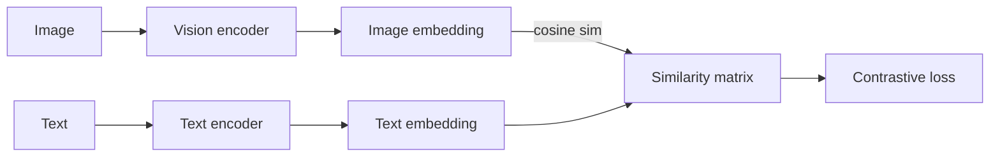

# 4.5 — Multimodal Models (CLIP, LLaVA, VLMs)

## 1. Intuition first
Learn a shared representation space between multiple modalities (text ↔ image, text ↔ audio, text ↔ video). Once aligned, you can search, classify, or generate across modalities using cosine similarity or by feeding fused features to an LLM.

## 2. Why the topic exists
Real users mix modalities: they upload photos and ask questions, generate images from prompts, transcribe audio, watch videos. Multimodal models unify these workflows.

## 3. What problem it solves
Cross-modal retrieval, zero-shot classification, image / video captioning, visual question answering, grounded generation.

## 4. Mathematics

### 4.1 CLIP (Radford 2021)
Two encoders: image $f_I$ (ViT) and text $f_T$ (Transformer). Contrastive InfoNCE loss over $N$ pairs:

$$
\mathcal{L} = -\frac{1}{2N}\sum_{i} \Big[\log \frac{\exp(s_{ii}/\tau)}{\sum_j \exp(s_{ij}/\tau)} + \log \frac{\exp(s_{ii}/\tau)}{\sum_j \exp(s_{ji}/\tau)}\Big]
$$

with $s_{ij} = \cos(f_I(x_i), f_T(y_j))$ and temperature $\tau$.

### 4.2 Downstream uses
- Zero-shot classification: embed class prompts, cosine-similarity classify.
- Retrieval: image → text or text → image nearest neighbor.
- Init for text-to-image models.

### 4.3 Vision-Language Models (LLaVA, GPT-4V, Qwen-VL, LLaMA-3-Vision)
Vision encoder (CLIP ViT / SigLIP) → projection MLP → tokens fed into an LLM alongside text tokens. Fine-tune on visual-instruction pairs.

### 4.4 Multimodal fusion patterns
Late fusion (concatenate features), cross-attention fusion (Flamingo), interleaved tokenization (Gemini).

### 4.5 Contrastive audio-text (CLAP), video-text (VideoCLIP), etc.

## 5. Every formula explained
- InfoNCE trains embeddings so paired image/text are more similar than random pairs.
- Temperature $\tau$ controls sharpness of distribution.

## 6. Variables
$f_I, f_T$ encoders; $\tau$ temperature; $N$ batch of pairs.

## 7. Algorithm — CLIP training
1. Sample large batch of (image, caption) pairs from web-scraped data.
2. Encode both; L2-normalize.
3. Compute similarity matrix $S$.
4. Symmetric CE against diagonal-as-positive labels.
5. Repeat over hundreds of GPUs for weeks.

## 8. Simple example
"A photo of a cat" vs "A photo of a dog" — embed both; the cat image is closer to the cat prompt.

## 9. Real-world example
- Image search at Pinterest / Google.
- Content moderation via CLIP prompts.
- GPT-4V / Claude 3.5 Sonnet vision: describe, chart-read, code-from-screenshot.
- Robotics grounding (RT-2 uses VLM for action).

## 10. Diagram


## 11. Implementation from scratch — CLIP loss
```python
import torch, torch.nn.functional as F
def clip_loss(image_features, text_features, temperature=0.07):
    image_features = F.normalize(image_features, dim=-1)
    text_features = F.normalize(text_features, dim=-1)
    logits = image_features @ text_features.T / temperature
    labels = torch.arange(len(image_features), device=logits.device)
    return (F.cross_entropy(logits, labels) + F.cross_entropy(logits.T, labels)) / 2
```

## 12. Implementation using libraries
```python
from transformers import CLIPModel, CLIPProcessor
proc = CLIPProcessor.from_pretrained("openai/clip-vit-base-patch32")
mdl = CLIPModel.from_pretrained("openai/clip-vit-base-patch32")
inp = proc(text=["a cat", "a dog"], images=img, return_tensors="pt", padding=True)
out = mdl(**inp); probs = out.logits_per_image.softmax(dim=-1)

# LLaVA
from transformers import LlavaForConditionalGeneration, AutoProcessor
llava = LlavaForConditionalGeneration.from_pretrained("llava-hf/llava-1.5-7b-hf")
```

## 13. Time complexity
Training expensive (huge batches for hard negatives). Inference: two forward passes.

## 14. Space complexity
Vision + text encoders + optional LLM.

## 15. Advantages
Zero-shot; general-purpose embeddings; enables downstream generative models.

## 16. Disadvantages
Data-hungry; struggles with fine-grained / compositional understanding (still an active problem).

## 17. Interview questions
1. Explain contrastive learning (InfoNCE).
2. Why does CLIP need very large batches?
3. Zero-shot classification with CLIP.
4. Difference between CLIP-style embedding models and VLMs (LLaVA).
5. Chain-of-thought for VLMs.
6. SigLIP vs CLIP.
7. How does LLaVA fuse vision tokens with text?
8. Failure modes of CLIP (compositionality, counting).
9. How to fine-tune CLIP for a new domain.
10. Video-language models — architectural differences.

## 18. Common mistakes
- Forgetting L2 normalization.
- Small batch size → weak negatives.
- Prompt templates matter ("a photo of a {}").

## 19. Optimization techniques
Larger, cleaner data (LAION, DataComp); sigmoid loss (SigLIP) for smaller batches; distillation; register tokens.

## 20. Coding exercises
1. Implement CLIP loss and train on 10k image-caption pairs.
2. Zero-shot classify CIFAR-10 with CLIP.
3. Fine-tune LLaVA-1.5 with LoRA on a small VQA dataset.
4. Reproduce a SigLIP-style loss.

## 21. Mini project
CLIP-powered semantic image search across a personal photo library.

## 22. Medium project
Fine-tune a small VLM for a specific business use case (chart reading, invoice extraction).

## 23. Advanced project
Train a joint image-text-audio embedding model on a curated dataset and evaluate cross-modal retrieval.

## 24. Where it is used in industry
Product search (Amazon, Pinterest), content moderation, VLMs in ChatGPT / Claude / Gemini, robotics.

## 25. How companies use it
- OpenAI GPT-4o vision.
- Google Gemini natively multimodal.
- Meta Segment Anything + CLIP.
- Robotics (Google RT-2).

## 26. When NOT to use it
- Ultra-fine-grained tasks (species-level) — dedicated classifier better.
- Pure text tasks — no need for vision encoder overhead.
