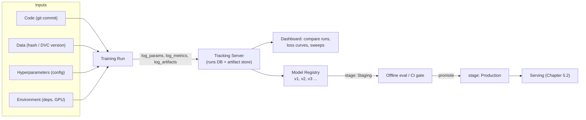
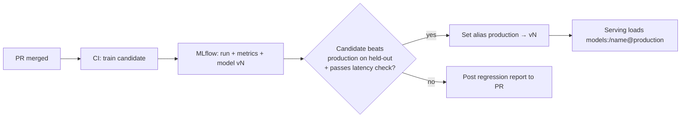

# 5.1 — Experiment Tracking (MLflow, W&B)

## 1. Overview

**What is it?** Experiment tracking is the practice of recording, for every training or evaluation run, everything needed to understand, reproduce, and compare it: hyperparameters, code version, data version, metrics over time, produced artifacts (checkpoints, plots, reports), and the environment it ran in. A **model registry** extends this by versioning the resulting models and managing their lifecycle (staging → production → archived).

**Why does it exist?** Machine learning iterates far faster than traditional software. A single engineer can launch dozens of runs per day, each differing in a learning rate, a data slice, or a random seed. Human memory and spreadsheets cannot keep up, and untracked results are effectively lost science.

**What problem does it solve?** Four problems at once: *reproducibility* (re-create any past result), *comparison* (which of these 40 runs is actually best, and on which metric?), *collaboration* (teammates can see and build on your runs), and *lineage* (which data + code + parameters produced the model that is serving traffic right now?).

**Where is it used?** In every serious ML organization, from a two-person startup logging runs with MLflow on a laptop to OpenAI- and Meta-scale internal experiment platforms tracking millions of runs. It is the first piece of MLOps infrastructure most teams adopt, and it feeds directly into [model serving](02-model-serving.md), [CI/CD for ML](04-cicd-ml.md), and [monitoring](05-monitoring-drift.md).

## 2. Learning Objectives

After this chapter you will be able to:

- Define runs, experiments, parameters, metrics, artifacts, tags, and lineage precisely.
- Explain why "final accuracy in a spreadsheet" is not reproducibility, and list the six things a run must record to be reproducible.
- Instrument any training script (scikit-learn, PyTorch, HuggingFace) with MLflow or Weights & Biases in under ten lines.
- Build a minimal run tracker from scratch in pure Python to understand what trackers actually store.
- Use a model registry to version models and promote them through staging and production stages.
- Version datasets with content hashes and DVC, and link a model to the exact data that trained it.
- Compare runs and hyperparameter sweeps fairly, controlling for seeds and data splits.
- Choose between MLflow, W&B, Neptune, Comet, and ClearML for a given team and budget.
- Avoid the classic mistakes: logging only final metrics, forgetting the git commit, leaking secrets into logged configs.
- Design the tracking layer of a production ML platform, including artifact storage and retention.

## 3. Prerequisites

| Chapter | Why you need it |
|---|---|
| [Evaluation Metrics](../phase-1-classical-ml/14-evaluation-metrics.md) | The metrics you log (accuracy, F1, AUC, loss) must be chosen and interpreted correctly before tracking them is useful. |
| [Optimizers](../phase-2-deep-learning/05-optimizers.md) | Hyperparameters like learning rate and batch size are the parameters you will track and sweep. |
| [Regularization for DL](../phase-2-deep-learning/06-regularization-dl.md) | Comparing runs fairly requires understanding how regularization settings interact with validation metrics. |
| Basic Python file/JSON handling | The from-scratch tracker in Section 10 uses only the standard library. |

Sibling chapters that build on this one: [5.4 — CI/CD for ML](04-cicd-ml.md) (the registry becomes a promotion gate) and [5.5 — Monitoring & Drift](05-monitoring-drift.md) (production metrics close the loop back to training runs).

## 4. Intuition

Think of a chemistry lab notebook. A chemist never runs a reaction without writing down the reagents, quantities, temperature, and observations — because a result you cannot reproduce is not a result. Experiment tracking is the lab notebook for ML, except it writes itself: your training script logs its "reagents" (hyperparameters, data version), "conditions" (code commit, environment, GPU), and "observations" (loss curves, metrics, checkpoints) automatically.

Here is an everyday story. On Monday you train a sentiment classifier and get 91.2% validation accuracy. On Thursday your teammate asks: "Can you re-run the 91.2 model but on the new data?" You look at your terminal history: which learning rate was that? Was it before or after you fixed the tokenizer bug? Which of the seven `model_final_v2_REAL.pt` files on disk is it? Without tracking, the honest answer is "I don't know" — and the week's work must be redone. With tracking, the answer is one query: open the dashboard, sort by `val_acc`, click the top run, and see its exact commit hash, config, data hash, and checkpoint URI.

The analogy extends to the **model registry**: it is the lab's *approved formulations shelf*. Not every experiment becomes a product; the registry holds the vetted models, each with a version number and a stage label, so the serving system always knows exactly which formulation it is shipping.

## 5. Real-world Motivation

- **OpenAI and Anthropic** train frontier models with runs costing millions of dollars; internal tooling (often built on or alongside Weights & Biases) tracks every run so that loss spikes, hardware failures, and hyperparameter decisions are auditable. At this cost per run, "we lost the config" is not an option.
- **Databricks** built MLflow (open-sourced in 2018) because its customers kept reinventing ad-hoc tracking; MLflow is now the de facto open-source standard with a tracking server, registry, and deployment tools.
- **Netflix and Meta** run internal experimentation platforms (Meta's FBLearner is a well-known example) where thousands of engineers share a common run database — enabling questions like "has anyone already tried this architecture on this dataset?"
- **Regulated industries** (banking, healthcare) are legally required to demonstrate model lineage: which data trained the credit-risk model in production? A registry with lineage is the audit trail.
- **Kaggle-style teams** at companies like Booking.com and Zalando use Neptune/W&B to coordinate dozens of parallel experiments toward one metric, avoiding duplicated work.

## 6. Mathematical Foundations

Experiment tracking is primarily an engineering discipline, so **no heavy formal mathematics is required** — there are no derivations analogous to backpropagation here. The quantitative aspects that do matter are:

**Content hashing for data versioning.** A dataset version is identified by a cryptographic hash of its bytes:

$$h = \mathrm{SHA256}(\text{bytes of dataset})$$

where $h$ is a 256-bit digest. The key property is collision resistance: if two datasets have the same $h$, they are (with overwhelming probability) byte-identical. This turns "which data did I train on?" into an exact equality check. DVC uses MD5/SHA hashes per file plus a directory-level hash.

**Fair run comparison and variance.** If you compare two configurations $A$ and $B$ using single runs, you are comparing samples from noisy distributions. With $n$ seeds each, the standard error of the mean metric is

$$\mathrm{SE} = \frac{\sigma}{\sqrt{n}}$$

where $\sigma$ is the across-seed standard deviation of the metric and $n$ the number of seeded runs. A difference between $A$ and $B$ smaller than roughly $2\,\mathrm{SE}$ is not trustworthy. This is why trackers make it cheap to log *groups* of runs and aggregate them.

**Storage cost estimation.** If you log a scalar every $k$ steps for $T$ total steps across $m$ metrics, you store $\frac{T}{k} \cdot m$ points per run — trivially small. Artifacts dominate: a 7B-parameter model checkpoint in fp16 is $7 \times 10^9 \times 2 \text{ bytes} = 14$ GB; checkpointing every epoch for 10 epochs across 20 sweep runs is $2.8$ TB. This arithmetic drives artifact retention policy (Section 18).

## 7. Visual Explanation

The tracking system sits beside the training loop and feeds the registry, which feeds serving:



And the anatomy of a single run as stored by the tracker:

```
Run 8f3a2c
├── params:    {lr: 3e-4, batch_size: 64, arch: resnet18, seed: 42}
├── tags:      {git_commit: a1b2c3d, data_hash: 9e107d9d, user: alice}
├── metrics:   train/loss: [(step 0, 2.31), (step 100, 1.02), ...]
│              val/acc:    [(epoch 1, 0.83), (epoch 2, 0.89), ...]
└── artifacts: model.pt, confusion_matrix.png, eval_report.json
```

## 8. Algorithm

The "algorithm" here is the **instrumentation protocol** — the steps every training script should follow:

1. **Initialize a run** inside a named experiment (e.g., experiment `"sentiment-bert"`, run auto-named).
2. **Log all parameters up front**: merged view of defaults + config file + CLI overrides. Partial configs are the #1 cause of irreproducibility.
3. **Log immutable identifiers as tags**: git commit hash, dirty-tree flag, dataset content hash / DVC revision, docker image tag.
4. **During training, log metrics every $N$ steps** (train loss, learning rate, gradient norm) and every epoch (validation metrics), each with an explicit step index.
5. **Log system stats** (GPU utilization, memory) — most trackers do this automatically.
6. **On completion, log artifacts**: final/best checkpoint, evaluation report, plots, and a small sample of predictions.
7. **Mark run status** (finished/failed) so crashed runs are queryable.
8. **If the run is a candidate, register the model**: push the checkpoint to the registry as a new version with metadata linking back to the run.

Pseudocode:

```text
procedure TRACKED_TRAINING(config):
    run ← tracker.start_run(experiment="my-task")
    run.log_params(flatten(config))
    run.set_tags({git: current_commit(), data: hash(dataset), seed: config.seed})
    for step, batch in enumerate(loader):
        loss ← train_step(model, batch)
        if step mod N == 0:
            run.log_metric("train/loss", loss, step)
        if end_of_epoch(step):
            m ← evaluate(model, val_set)
            run.log_metric("val/acc", m.acc, step)
            if m.acc > best: save_checkpoint(); best ← m.acc
    run.log_artifact("best.ckpt"); run.log_artifact("eval_report.json")
    run.finish(status="finished")
    if best > promotion_threshold:
        registry.register(run.id, "sentiment-model")   # becomes version k+1
```

## 9. Worked Example

**Tiny example solved by hand.** Suppose you run logistic regression on the Iris dataset three times, varying only the regularization strength $C$. You record on paper:

| Run | $C$ | penalty | seed | val_acc |
|---|---|---|---|---|
| r1 | 0.1 | l2 | 42 | 0.90 |
| r2 | 1.0 | l2 | 42 | 0.94 |
| r3 | 10.0 | l2 | 42 | 0.92 |

The "query" *best run by val_acc* returns r2. Reproducing r2 means re-running with exactly $C{=}1.0$, penalty l2, seed 42, the same code, and the same data. Notice that the table alone is insufficient if the code changed between r1 and r3 — this is precisely why the tag set includes the git commit. Now compute whether r2 beats r3 meaningfully: with a single seed each, we cannot tell; rerunning each with seeds {0, 1, 2} might give r2: mean 0.936, σ = 0.008 and r3: mean 0.928, σ = 0.010, so $\mathrm{SE} \approx 0.005$–$0.006$; a gap of 0.008 is borderline (~1.4 SE) — the tracker's grouped-run view is what makes this analysis a two-click operation instead of a manual spreadsheet.

**Realistic example.** A team fine-tunes BERT for sentiment on 500k reviews. They launch a 24-run sweep over learning rate {1e-5, 3e-5, 5e-5} × batch size {16, 32} × 4 seeds. Each run logs `train/loss` every 50 steps, `val/f1` per epoch, and its best checkpoint (~440 MB). In the dashboard they group by (lr, batch) and average over seeds: lr 3e-5, batch 32 wins with F1 0.917 ± 0.003. The best single checkpoint is registered as `sentiment-bert` **version 7**, tagged with the sweep run ID, and promoted to Staging where the [CI gate](04-cicd-ml.md) evaluates it against the production model before promotion.

## 10. Python from Scratch

To demystify trackers, here is a **minimal but functional file-based run tracker** in pure Python — no ML libraries, no server. It supports experiments, runs, params, step-wise metrics, artifacts, and querying for the best run. This is essentially what MLflow's local `mlruns/` directory does.

```python
import json, time, uuid, shutil, hashlib
from pathlib import Path

class MiniTracker:
    """A tiny MLflow-like tracker: one folder per run, JSON for metadata."""

    def __init__(self, root="./miniruns", experiment="default"):
        # Root layout: miniruns/<experiment>/<run_id>/{params.json, metrics.jsonl, artifacts/}
        self.dir = Path(root) / experiment
        self.dir.mkdir(parents=True, exist_ok=True)
        self.run_dir = None

    def start_run(self):
        run_id = uuid.uuid4().hex[:8]                      # short unique run id
        self.run_dir = self.dir / run_id
        (self.run_dir / "artifacts").mkdir(parents=True)
        # Record start time and status immediately, so crashed runs are visible.
        self._write("meta.json", {"run_id": run_id,
                                  "start_time": time.time(),
                                  "status": "RUNNING"})
        return run_id

    def log_params(self, params: dict):
        # Params are write-once: a run's config must never mutate mid-run.
        self._write("params.json", params)

    def log_metric(self, key, value, step):
        # Append-only JSON Lines: one record per (metric, step) observation.
        with open(self.run_dir / "metrics.jsonl", "a") as f:
            f.write(json.dumps({"key": key, "value": value, "step": step}) + "\n")

    def log_artifact(self, path):
        # Copy the file into the run's artifact folder and record its hash,
        # so we can later verify the artifact was not modified.
        src = Path(path)
        dst = self.run_dir / "artifacts" / src.name
        shutil.copy(src, dst)
        digest = hashlib.sha256(dst.read_bytes()).hexdigest()
        with open(self.run_dir / "artifacts.jsonl", "a") as f:
            f.write(json.dumps({"file": src.name, "sha256": digest}) + "\n")

    def end_run(self, status="FINISHED"):
        meta = json.loads((self.run_dir / "meta.json").read_text())
        meta.update(status=status, end_time=time.time())
        self._write("meta.json", meta)

    def best_run(self, metric, mode="max"):
        # Scan every run, take the best value of `metric` it ever logged,
        # then return the run whose best value is highest (or lowest).
        results = []
        for run in self.dir.iterdir():
            mfile = run / "metrics.jsonl"
            if not mfile.exists():
                continue
            vals = [json.loads(l)["value"] for l in mfile.read_text().splitlines()
                    if json.loads(l)["key"] == metric]
            if vals:
                results.append((run.name, max(vals) if mode == "max" else min(vals)))
        return max(results, key=lambda t: t[1]) if mode == "max" else min(results, key=lambda t: t[1])

    def _write(self, name, obj):
        (self.run_dir / name).write_text(json.dumps(obj, indent=2))

# --- Usage: simulate three "training runs" ---
tracker = MiniTracker(experiment="iris-baseline")
for C in [0.1, 1.0, 10.0]:
    rid = tracker.start_run()
    tracker.log_params({"C": C, "penalty": "l2", "seed": 42})
    for step in range(3):                       # fake training loop
        tracker.log_metric("val_acc", 0.85 + 0.03 * step - 0.01 * abs(C - 1), step)
    tracker.end_run()

print(tracker.best_run("val_acc"))
# Expected output: ('<run_id of C=1.0>', 0.91)  — the C=1.0 run wins
```

Complexity: logging is $O(1)$ per call (an append); `best_run` is $O(R \cdot M)$ for $R$ runs and $M$ metric records each — real trackers put this in an indexed database instead. **Common bug to watch for:** forgetting to call `end_run()` (or not using a `try/finally` / context manager) leaves runs permanently in `RUNNING` status, which is exactly how crashed runs go unnoticed in real trackers too.

## 11. Library Implementation

**MLflow** (open-source, self-hostable) — instrumenting scikit-learn:

```python
import mlflow
import mlflow.sklearn
from sklearn.linear_model import LogisticRegression
from sklearn.model_selection import train_test_split
from sklearn.datasets import load_iris

X, y = load_iris(return_X_y=True)
Xtr, Xval, ytr, yval = train_test_split(X, y, random_state=42)

mlflow.set_experiment("iris-baseline")          # groups runs under one experiment

with mlflow.start_run() as run:                 # context manager => status set even on crash
    params = {"C": 1.0, "penalty": "l2", "seed": 42}
    mlflow.log_params(params)                   # all hyperparameters, up front
    mlflow.set_tag("git_commit", "a1b2c3d")     # code version tag for reproducibility

    model = LogisticRegression(**{k: v for k, v in params.items() if k != "seed"})
    model.fit(Xtr, ytr)

    acc = model.score(Xval, yval)
    mlflow.log_metric("val_acc", acc)           # scalar metric
    mlflow.sklearn.log_model(model, name="model",
                             registered_model_name="iris-clf")  # registry: new version
    print(f"run {run.info.run_id}: val_acc={acc:.3f}")
# Expected output: run <hex id>: val_acc≈0.974
# Inspect with: `mlflow ui` → http://localhost:5000
```

**Weights & Biases** (SaaS, strongest dashboards for deep learning) — instrumenting a PyTorch loop:

```python
import wandb, torch

wandb.init(project="cifar10",                       # experiment
           config={"lr": 3e-4, "arch": "resnet18",  # params, queryable in UI
                   "batch_size": 128, "seed": 0})
cfg = wandb.config                                  # single source of truth for hyperparams

for step in range(1000):
    loss = train_step(model, batch, lr=cfg.lr)      # your training code
    if step % 50 == 0:
        # Namespaced keys ("train/", "val/") organize dashboard panels.
        wandb.log({"train/loss": loss,
                   "lr": scheduler.get_last_lr()[0]}, step=step)

wandb.log({"val/acc": evaluate(model)})
art = wandb.Artifact("cifar10-resnet18", type="model")
art.add_file("best.ckpt")                           # versioned artifact (dedup by hash)
wandb.log_artifact(art)
wandb.finish()
```

**Registry promotion with MLflow** (the bridge to [serving](02-model-serving.md)):

```python
from mlflow import MlflowClient
client = MlflowClient()
# Alias-based staging (modern MLflow replaces stage strings with aliases):
client.set_registered_model_alias("iris-clf", alias="production", version=7)
# Serving code loads by alias — deployment becomes a metadata change, not a redeploy:
model = mlflow.sklearn.load_model("models:/iris-clf@production")
```

**DVC** for data versioning pairs with either tracker: `dvc add data/train.csv` stores the file's hash in a small `.dvc` file committed to git; the run then tags that git revision, giving full data lineage.

## 12. Code Walkthrough

Tracing the MLflow example end to end:

| Item | Value / Shape | Meaning |
|---|---|---|
| `X` | `(150, 4)` float array | Iris features (inputs to training) |
| `y` | `(150,)` int array | Class labels 0–2 |
| `params` | dict of 3 items | Logged once; becomes columns in the runs table |
| `val_acc` | scalar ≈ 0.974 | Logged metric; the comparison key across runs |
| `run.info.run_id` | 32-char hex | Primary key joining params, metrics, artifacts |
| logged model | `mlruns/.../artifacts/model/` | Pickled sklearn model + `MLmodel` metadata + pinned deps |
| registry entry | `iris-clf` version *k* | Pointer to the artifact + lineage back to the run |

Flow of values: config dict → `log_params` (written to the backend store, a SQL DB or files) → training produces `acc` → `log_metric` appends `(key, value, step, timestamp)` → `log_model` uploads artifact files to the artifact store (local disk, S3, GCS) and creates registry version *k*. Later, `models:/iris-clf@production` resolves alias → version → artifact URI → downloads and deserializes the model. Expected result: identical predictions to the original in-memory model — verify with an assertion on a fixed input, which is a cheap regression test worth adding to CI.

## 13. Complexity Analysis

- **Time:** each `log_param`/`log_metric` call is $O(1)$ — a local buffer append plus an async network flush for remote trackers. Overhead is negligible (< 1 ms amortized) if you log every 10–100 steps; logging every single step of a fast loop can add measurable latency because of serialization, so batch your logging. Artifact upload is $O(\text{bytes})$ and bounded by network bandwidth — a 14 GB checkpoint on a 1 Gb/s link takes ~2 minutes.
- **Space:** metrics are tiny — $\frac{T}{k}\cdot m$ float records per run (a 100k-step run logging 10 metrics every 50 steps stores 20k records ≈ a few MB). Artifacts dominate total storage; the arithmetic from Section 6 (multi-TB per sweep for LLM-scale checkpoints) is why production setups use object storage (S3/GCS) with lifecycle rules, not the tracking server's disk.
- **Query time:** run comparison over $R$ runs is $O(R)$ with DB indexes; UI dashboards paginate, so even 10⁵-run experiments stay responsive.

## 14. Advantages

- **Reproducibility:** any past result can be re-created from its run record. Example: an auditor asks how the credit model was trained — the registry links to the run, which links to commit + data hash.
- **Fair comparison:** loss curves and grouped seed-averages beat "final number in Slack". Example: the BERT sweep in Section 9 avoids shipping a lucky-seed model.
- **Collaboration and knowledge retention:** when an engineer leaves, their runs remain queryable. Example: "has anyone tried focal loss on this task?" is a dashboard search, not an interview of the whole team.
- **Faster iteration:** autologging (e.g., `mlflow.autolog()`, W&B's HuggingFace `Trainer` integration) means near-zero instrumentation cost.
- **Deployment safety:** loading models by registry alias makes rollback a one-line metadata change (see Section 11), not an emergency redeploy.

## 15. Disadvantages

- **Vendor lock-in and cost:** SaaS trackers (W&B, Neptune) charge per seat/usage; exporting years of run history is painful. Mitigation: MLflow-compatible logging or periodic exports.
- **Storage growth:** artifact stores fill with stale checkpoints; without retention policies, costs balloon silently.
- **Discipline required:** a tracker only captures what you log. If half the team logs params and half doesn't, comparisons are still broken. Failure case: a run shows `val_acc = 0.95` but the data-loading code had an uncommitted local edit (dirty git tree) — the run is unreproducible despite being "tracked". Always log the dirty flag and refuse (or loudly warn) on dirty trees for important runs.
- **Server operations:** self-hosted MLflow at scale needs a real database, object storage, and auth — it is a service you must run.

## 16. Common Mistakes

- **Logging only the final metric.** You lose the loss curve, so you cannot diagnose divergence, overfitting onset, or compare convergence speed. *Fix:* log every $N$ steps with an explicit `step`.
- **No git commit / data hash tags.** The run's numbers are then attached to unknown code and data. *Fix:* automate tagging in a shared training entrypoint; fail on dirty trees.
- **Secrets in configs.** Logging the full environment or raw config can capture API keys and DB passwords into a dashboard visible to the whole org (or the vendor). *Fix:* redact known secret keys before `log_params`; use secret managers, never config files, for credentials.
- **Comparing runs across different validation splits.** A "better" run on an easier split is noise. *Fix:* log the split seed/hash and filter comparisons to matching splits.
- **Forgetting to mark failed runs.** Crashed runs stuck in RUNNING pollute dashboards. *Fix:* use context managers (`with mlflow.start_run():`) which set FAILED on exception.
- **One experiment for everything.** A single 5,000-run "default" experiment is unnavigable. *Fix:* one experiment per task/model family; use tags for finer slicing.

## 17. Best Practices

A production instrumentation checklist:

- [ ] Single shared training entrypoint that auto-logs params, git commit, dirty flag, data version, docker image, and seed.
- [ ] Namespaced metrics (`train/`, `val/`, `test/`, `system/`) with explicit steps.
- [ ] Log evaluation *reports* (per-class metrics, confusion matrices, sample predictions) as artifacts, not just scalars — see [Evaluation Metrics](../phase-1-classical-ml/14-evaluation-metrics.md).
- [ ] Register only candidate models; use registry aliases (`staging`, `production`) as the *only* interface serving reads from.
- [ ] Attach model cards / metadata (intended use, training data description) to registry versions.
- [ ] Enforce retention: keep best-per-sweep checkpoints, expire the rest after 30–90 days.
- [ ] Back the artifact store with object storage + lifecycle rules; back the tracking DB with a managed SQL instance.
- [ ] Make CI reproduce a pinned "golden run" occasionally to prove the reproducibility chain actually works.

> [!TIP]
> Treat the registry alias flip (`staging` → `production`) as a deployment event: gate it behind the CI checks described in [CI/CD for ML](04-cicd-ml.md) and emit an audit log entry.

## 18. Optimization Techniques

- **Autologging & callbacks:** `mlflow.autolog()`, W&B's Lightning/HF `Trainer` callbacks capture params, metrics, and checkpoints with one line — prefer them over hand-rolled logging.
- **Asynchronous/batched logging:** trackers buffer and flush in background threads; avoid per-step synchronous logging in tight loops.
- **Sweep orchestration:** use W&B Sweeps or Optuna (with its MLflow callback) for Bayesian/hyperband search instead of grid loops; the tracker stores the whole search space and importance analysis.
- **Artifact deduplication:** W&B artifacts and DVC hash content, so re-logging an unchanged file costs nothing — structure checkpoints to exploit this.
- **Large-data versioning with DVC:** never log multi-GB datasets as run artifacts; version them once with DVC and log only the revision hash.
- **Checkpoint thinning:** save `best.ckpt` + `last.ckpt` rather than every epoch; for LLM-scale training, keep sparse "milestone" checkpoints.
- **System-metric sampling:** GPU stats every 10–30 s is plenty; 1 Hz sampling across a large cluster is wasted storage.

## 19. Industry Applications

- **Databricks customers** use MLflow natively: tracking, registry, and serving in one platform; the registry alias is the production pointer for their model-serving endpoints.
- **OpenAI, Anthropic, xAI, Stability AI** are documented W&B users for large-scale training telemetry (loss curves across thousands of GPUs, sweep management).
- **Meta** operates FBLearner Flow, an internal platform where experiments, features, and models are tracked org-wide; **Netflix** similarly runs internal experimentation tooling integrated with its Metaflow orchestrator.
- **Booking.com, Zalando** (Neptune case studies) coordinate large ranking/recommendation experiment programs.
- **Regulated deployments** (credit scoring at banks, diagnostics in healthtech) rely on registry lineage for compliance audits — the production model's registry entry is the audit artifact.

## 20. Interview Questions

### Beginner

- **Q: What is the difference between a run, an experiment, a parameter, and a metric?**
  A: A run is one execution of training/eval; an experiment is a named group of related runs; a parameter is a fixed input to the run (e.g., learning rate) logged once; a metric is a measured output (e.g., loss) logged as a time series over steps.
- **Q: What must you record for a run to be reproducible?**
  A: Code version (git commit + dirty flag), data version (hash/DVC rev), full hyperparameter config, environment (dependencies, image), random seed, and the produced artifacts. Missing any one breaks the chain.
- **Q: What is a model registry and why not just save checkpoints to S3?**
  A: A registry adds versioning, stage/alias labels (staging/production), lineage back to the training run, and an API for serving to resolve "the current production model" — raw S3 paths provide none of that governance.
- **Q: What does `mlflow.autolog()` do?**
  A: It patches supported libraries (sklearn, PyTorch Lightning, HF) to automatically log params, metrics, and models without manual instrumentation.
- **Q: Why log metrics with a step index instead of just final values?**
  A: Curves reveal divergence, overfitting onset, and convergence speed; final scalars can hide a run that got lucky at the last eval.

### Intermediate

- **Q: MLflow vs W&B — how would you choose?**
  A: MLflow: open-source, self-hostable, registry included, best when you need data control or Databricks integration. W&B: SaaS with superior visualization, sweeps, and collaboration for deep learning teams; costs money and hosts your metadata. Many teams use W&B for research and MLflow registry for deployment.
- **Q: How do you version a 500 GB dataset?**
  A: Not as a run artifact. Use DVC (or lakeFS/Delta): content-hash the data, store the small pointer file in git, keep bytes in object storage; runs log the git+DVC revision.
- **Q: How do you compare two hyperparameter sweeps fairly?**
  A: Fix the data split; run multiple seeds per config; compare mean ± SE (see Section 6) on the same metric; check curves for stability, not just best points; beware of comparing best-of-N against best-of-M for N ≠ M.
- **Q: How do you handle secrets that appear in training configs?**
  A: Never put secrets in configs; inject via environment/secret managers, and redact known keys (`*_KEY`, `*_TOKEN`) before logging. Assume everything logged is org-visible.
- **Q: A teammate's run shows great metrics but you can't reproduce it. Diagnosis steps?**
  A: Check the dirty-tree flag; verify data hash matches; verify seed and nondeterministic ops (cuDNN); diff environments (dependency versions, GPU); check whether eval split differed.

### Advanced

- **Q: Design the tracking layer for a company running 10k runs/day with multi-GB artifacts.**
  A: Tracking server behind a load balancer with a managed Postgres backend; artifacts direct-to-S3 with pre-signed URLs (never through the server); per-team experiments with auth; lifecycle rules expiring non-best checkpoints; async client-side buffering; registry as the single serving interface with audit logs on alias changes.
- **Q: What is lineage and how do you implement it end-to-end?**
  A: Lineage is the directed graph data → code → run → model → deployment. Implement by tagging runs with data/commit hashes, registering models with run IDs, and having deploys record registry version — every arrow is a stored foreign key, so any production prediction traces back to training data.
- **Q: How would you detect that your "reproducibility" is silently broken?**
  A: Scheduled CI job re-runs a pinned golden run and asserts metrics within tolerance; alert on drift. Also assert bit-identical data hashes and warn on dirty-tree runs entering the registry.
- **Q: How do trackers handle distributed training (e.g., 64-GPU DDP)?**
  A: Only rank 0 logs to avoid duplicate runs; system metrics are gathered per-node and aggregated; step semantics must use a global step. A common bug is every rank calling `wandb.init`, creating 64 runs.
- **Q: When is it acceptable to *not* register a model that beats production offline?**
  A: When it fails non-metric gates: latency/size budget, fairness across subgroups, backward compatibility of output schema, or when the offline gain is within seed noise — registry promotion should be a multi-criteria decision (see [CI/CD for ML](04-cicd-ml.md)).

## 21. Coding Exercises

### Easy

1. **Instrument a script.** Take any scikit-learn training script and add MLflow: log params, one metric, and the model. Verify in `mlflow ui`. *Hint:* wrap training in `with mlflow.start_run():`.
2. **Crash visibility.** Make a run raise an exception mid-training and confirm the tracker marks it FAILED. *Hint:* the context manager handles this; try without it too.
3. **Extend MiniTracker.** Add a `set_tags()` method and a `runs_where(tag, value)` query to the from-scratch tracker in Section 10. *Hint:* store tags in `meta.json`.

### Medium

1. **Reproduce an old run.** From a tracked run's params + commit tag, write a script that checks out the commit, re-runs training, and asserts the metric matches within 1%. *Hint:* `git stash && git checkout <commit>`; watch for seed and cuDNN determinism.
2. **Registry round-trip.** Register a model, set alias `production`, load it via `models:/name@production` in a separate process, and assert identical predictions on a fixed input. *Hint:* pickle the reference predictions.
3. **Seed-variance report.** Run one config with 5 seeds, log all runs into a group, and produce mean ± SE per metric with a short "is the improvement real?" verdict versus a baseline group. *Hint:* use the MLflow search API or W&B grouping.

### Hard

1. **DVC lineage.** Version a dataset with DVC, train a model, tag the run with the DVC rev, then mutate the dataset and prove the tracker detects (via hash mismatch) that new runs used different data. *Hint:* `dvc add`, commit the `.dvc` file, log `git rev-parse HEAD`.
2. **Golden-run CI.** Build a CI job (GitHub Actions) that nightly re-executes a pinned run config and fails if `val_acc` deviates > 0.5% — a live reproducibility monitor. *Hint:* cache the dataset; pin the docker image digest.
3. **MiniTracker server.** Put a small HTTP API (FastAPI) in front of MiniTracker with endpoints for start-run/log-metric/best-run, and make two concurrent "training" clients log safely. *Hint:* file locks or a per-run append-only design avoid corruption.

## 22. Mini Project

**Track and select a Titanic model.**

1. Load the Titanic dataset (seaborn or Kaggle CSV); create a fixed train/val split with a recorded seed.
2. Write one `train.py` that accepts hyperparameters via CLI (model type, depth/C, seed).
3. Add MLflow: log all params, `val_accuracy`, `val_f1`, the confusion matrix image as an artifact, and the model.
4. Launch 10 runs across logistic regression and random forest configs.
5. In the MLflow UI, sort by `val_f1`, inspect curves/artifacts, and pick a winner.
6. Register the winner as `titanic-clf` and load it back by registry URI to score 5 example passengers.
7. Write a 5-line README stating exactly how to reproduce the winning run.

## 23. Medium Project

**Self-hosted tracking platform.**

1. Run MLflow server with a Postgres backend store and MinIO (S3-compatible) artifact store via docker-compose (three services: mlflow, postgres, minio).
2. Configure `MLFLOW_TRACKING_URI` and S3 credentials via environment variables (never in code).
3. Port the Mini Project training to log against the server from a *different* machine/container.
4. Add automatic tagging: git commit, dirty flag, dataset SHA256 — implemented in a small `tracking_utils.py` shared module.
5. Simulate a team: run a 12-run sweep from two "users"; build a comparison view filtered by tags.
6. Add a retention script that deletes artifacts of non-best runs older than 7 days (dry-run mode first).
7. Stretch: deploy the compose stack onto a small Kubernetes cluster using what you learn in [5.3 — Docker & Kubernetes](03-docker-k8s.md).

## 24. Advanced Project

**Auto-promoting model registry with CI/CD.**

Architecture: GitHub repo (code + DVC data pointers) → CI runner trains candidate → MLflow tracking + registry → evaluation gate job → alias flip → serving container reloads by alias.



Implementation phases:

1. **Phase 1 — Foundation:** repo with DVC-versioned data, shared training entrypoint with full auto-tagging, MLflow server from the Medium Project.
2. **Phase 2 — Gate:** an evaluation job that loads `@production` and the candidate, evaluates both on a *fresh* held-out set (never seen by training or sweeps), and compares with seed-noise-aware thresholds; also checks model size and p95 inference latency.
3. **Phase 3 — Promotion:** on pass, flip the alias via `MlflowClient`, write an audit record (who/what/why), and notify the team; on fail, publish a diff report as a PR comment (CML is handy here).
4. **Phase 4 — Rollback drill:** implement `promote --rollback` that flips the alias to the previous version; measure time-to-rollback.

Possible improvements: subgroup fairness checks in the gate; shadow evaluation on sampled production traffic (ties into [5.5 — Monitoring & Drift](05-monitoring-drift.md)); canary rollout of the new alias (ties into [5.4 — CI/CD for ML](04-cicd-ml.md)); artifact signing to prevent tampering between registry and serving.

## 25. Summary

- Experiment tracking turns every run into a queryable record: params, metrics over steps, artifacts, and identity tags (commit, data hash, seed, environment).
- Reproducibility requires *all six* ingredients — a missing data hash or dirty git tree silently breaks the chain.
- A model registry versions models and exposes stage aliases; serving should load models *only* through the registry, making deploy and rollback metadata operations.
- Lineage is the foreign-key graph data → run → model → deployment; it is both a debugging tool and a compliance requirement.
- The math is light but real: content hashes identify data versions; seed variance ($\mathrm{SE} = \sigma/\sqrt{n}$) decides whether run differences are meaningful; artifact-size arithmetic drives storage policy.
- A tracker is conceptually simple — the Section 10 MiniTracker is a working one in ~60 lines — the value of MLflow/W&B is scale, UI, integrations, and the registry.
- MLflow = open-source, self-hostable, registry-centric; W&B = SaaS, best-in-class dashboards and sweeps; DVC = data versioning that complements both.
- Log curves not just finals; namespace metrics; log via callbacks/autolog; redact secrets; thin checkpoints; expire artifacts.
- Promotion to production should be gated (fresh held-out data, latency/size budgets, noise-aware thresholds), which is the seam between this chapter and CI/CD.

## 26. Cheat Sheet

| Concept | One-liner |
|---|---|
| Run | One training/eval execution with params, metrics, artifacts |
| Experiment | Named group of runs |
| Artifact | File output (checkpoint, plot, report), stored in object storage |
| Registry version | Immutable model *vN* with lineage to its run |
| Alias/stage | Mutable pointer (`production`) that serving resolves |
| Lineage | data hash → commit → run → model version → deployment |

Key snippets:

```python
mlflow.set_experiment("task"); 
with mlflow.start_run(): mlflow.log_params(cfg); mlflow.log_metric("val_acc", a, step=s)
wandb.init(project="task", config=cfg); wandb.log({"train/loss": l}, step=s)
mlflow.sklearn.log_model(m, name="model", registered_model_name="clf")
mlflow.sklearn.load_model("models:/clf@production")
```

Quantitative rules of thumb: log every 10–100 steps; require gap > 2·SE (σ/√n over seeds) to call a winner; checkpoint size ≈ params × bytes/param (7B fp16 ≈ 14 GB).

Gotchas: dirty git tree ⇒ unreproducible; every-rank `wandb.init` in DDP ⇒ duplicate runs; secrets in configs ⇒ leaked to dashboards; RUNNING-forever runs ⇒ missing `finally`/context manager.

## 27. Further Reading

- **Books:** *Designing Machine Learning Systems* (Chip Huyen) — ch. on experiment tracking & reproducibility; *Machine Learning Engineering* (Andriy Burkov); *Introducing MLOps* (Treveil et al., O'Reilly).
- **Research papers:** "Hidden Technical Debt in Machine Learning Systems" (Sculley et al., NeurIPS 2015); "Accelerating the Machine Learning Lifecycle with MLflow" (Zaharia et al., IEEE Data Eng. Bulletin 2018); "Show Your Work: Improved Reporting of Experimental Results" (Dodge et al., EMNLP 2019).
- **Documentation:** MLflow docs (mlflow.org) — Tracking, Model Registry; Weights & Biases docs (docs.wandb.ai) — Experiments, Sweeps, Artifacts; DVC docs (dvc.org).
- **GitHub repositories:** `mlflow/mlflow`, `wandb/wandb`, `iterative/dvc`, `aimhubio/aim` (open-source tracker), `IDSIA/sacred` (early academic tracker).
- **Datasets:** Titanic (Kaggle), Iris (UCI/sklearn), CIFAR-10 — small enough to run full tracked sweeps locally.
- **YouTube/Videos:** MLflow talks from Databricks Data+AI Summit; W&B's "MLOps" course videos; Full Stack Deep Learning lectures on experiment management.
- **Blogs:** W&B blog case studies (OpenAI, Stability AI); Neptune.ai's "Best ML experiment tracking tools" comparisons; Chip Huyen's blog on ML systems design.
