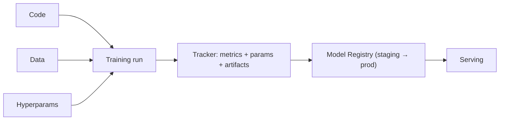

# 5.1 — Experiment Tracking (MLflow, W&B)

## 1. Intuition first
Every training run has hyperparameters, code, data, and metrics. Without tracking, you cannot reproduce anything, compare fairly, or hand off to teammates. Trackers turn each run into a first-class, queryable artifact.

## 2. Why the topic exists
ML iteration is faster than code iteration; dozens of runs per day. Manual spreadsheets don't scale.

## 3. What problem it solves
Reproducibility, comparison, collaboration, model registry.

## 4. Concepts
- **Run**: a single training / eval execution.
- **Experiment**: a group of runs (e.g., "sentiment classifier").
- **Metric**: a scalar over steps.
- **Parameter**: a hyperparameter or config value.
- **Artifact**: file(s) produced (checkpoint, plot, dataset snapshot).
- **Model registry**: versioned, staged models (staging → production).
- **Lineage**: which data + code + params produced which model.

## 5. Every "formula"
Not applicable.

## 6. Variables
Run ID, git commit, dataset hash, hyperparameters, metrics, artifacts, model URI.

## 7. Algorithm — instrumentation checklist
1. Init a run; log all params (including CLI, config file).
2. Log metrics every N steps.
3. Log system stats (GPU util, memory).
4. Log final checkpoint + eval reports.
5. Tag with git commit + data version.
6. Push to model registry with metadata.

## 8. Simple example
```python
import mlflow
mlflow.set_experiment("iris-baseline")
with mlflow.start_run():
    mlflow.log_params({"C": 1.0, "penalty": "l2"})
    model.fit(X, y)
    mlflow.log_metric("val_acc", 0.94)
    mlflow.sklearn.log_model(model, "model")
```

## 9. Real-world example
- Weights & Biases dashboards at OpenAI, Anthropic, xAI.
- MLflow Registry at Databricks customers.
- Neptune at Booking, Zalando.

## 10. Diagram


## 11. Implementation from scratch
A minimal tracker = SQLite DB + JSON blobs + a UI. But use MLflow.

## 12. Implementation using libraries
- **MLflow** — open-source, self-hostable.
- **Weights & Biases** — SaaS, best UX for deep learning.
- **Neptune**, **Comet**, **ClearML** — alternatives.
- **DVC** — pair with Git for data + model versioning.

W&B example:
```python
import wandb
wandb.init(project="cifar10", config={"lr": 3e-4, "arch": "resnet18"})
for step in range(1000):
    ...
    wandb.log({"train/loss": loss, "val/acc": acc}, step=step)
```

## 13. Time complexity
Negligible for local logging; network I/O for remote.

## 14. Space complexity
Artifacts can be large — snapshot smartly.

## 15. Advantages
Reproducibility, collaboration, faster iteration.

## 16. Disadvantages
Vendor lock-in, storage costs, requires discipline.

## 17. Interview questions
1. What must you track for reproducibility?
2. MLflow vs W&B — differences.
3. What is a model registry?
4. How do you version data?
5. How do you handle secrets in tracked runs?
6. What is lineage?
7. Explain how to compare two hyperparameter sweeps.
8. How to integrate tracker into a training script?
9. How would you monitor failed / crashed runs?
10. What is a "staging" vs "production" model?

## 18. Common mistakes
- Only logging final metric.
- No git commit / data hash → not reproducible.
- Committing secrets to run configs.

## 19. Optimization techniques
- Log via callbacks (Trainer / Lightning).
- Sweep with Optuna / W&B Sweeps.
- Use DVC for large data.

## 20. Coding exercises
1. Instrument a PyTorch Lightning training with MLflow.
2. Reproduce an old run from tracked configs.
3. Register a model, then load it for inference.
4. Create a W&B report comparing three architectures.

## 21. Mini project
Track 10 sklearn runs on Titanic; select best via MLflow UI.

## 22. Medium project
Set up MLflow with an S3 backend + MinIO for artifacts on a small k8s cluster.

## 23. Advanced project
Build a CI/CD pipeline: PR triggers training, tracker records results, model auto-promoted if it beats production on a held-out set.

## 24. Where it is used in industry
Every serious ML org.

## 25. How companies use it
- OpenAI/Anthropic: internal tools atop W&B / custom.
- Databricks: MLflow is native.
- Netflix / Meta: internal experiment platforms.

## 26. When NOT to use it
Never skip. Even one-off scripts benefit from `mlflow.autolog()`.
