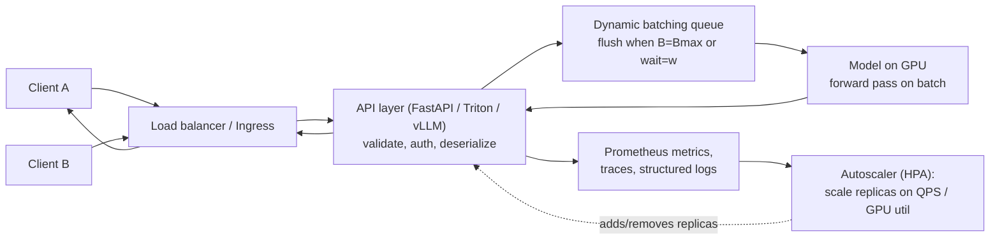
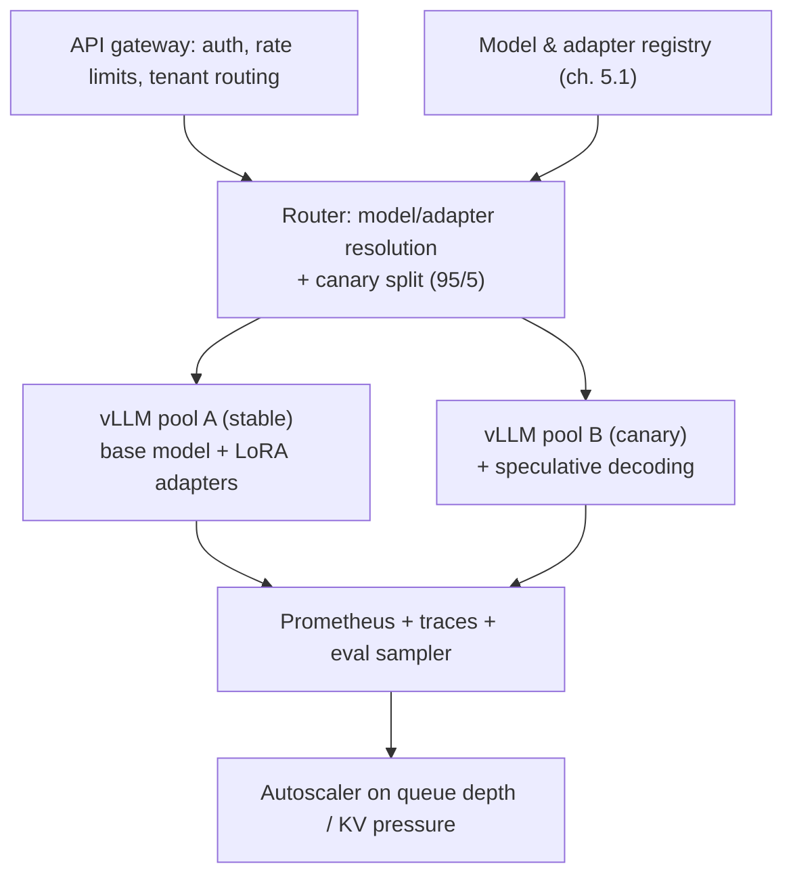

# 5.2 — Model Packaging & Serving (FastAPI, TorchServe, vLLM, Triton)

## 1. Overview

**What is it?** Model serving is everything between a trained model artifact and a reliable production endpoint: exporting the model to an inference-friendly format, wrapping it in a network API (REST/gRPC), batching requests to keep accelerators busy, scaling replicas with load, and observing latency, throughput, errors, and cost.

**Why does it exist?** A model that only runs inside a notebook creates no value. Real users and downstream services need to call it concurrently, with predictable latency, 24/7, at an acceptable cost per request. None of that is a property of the model itself — it is a property of the serving system around it.

**What problem does it solve?** It converts an artifact (weights + code) into a service with a contract: an API schema, latency/availability SLOs, and a cost envelope. For large language models it additionally solves a hard resource-management problem — keeping GPUs saturated when every request generates a variable number of tokens and holds a growing KV cache.

**Where is it used?** Every deployed model: fraud scorers at banks, ranking models at Netflix and Amazon, vision models on Tesla's fleet-facing backends, and the LLM APIs of OpenAI and Anthropic. The tooling ranges from a 30-line FastAPI app to specialized engines like vLLM, TGI, TensorRT-LLM, and NVIDIA Triton.

## 2. Learning Objectives

After this chapter you will be able to:

- Define and measure the core serving KPIs: p50/p95/p99 latency, throughput (QPS, tokens/s), availability, GPU utilization, and cost per 1k requests.
- Choose between REST, gRPC, WebSockets, and SSE for a given model and client.
- Explain why batching exists, and derive the latency–throughput trade-off of dynamic batching.
- Distinguish static, dynamic, and continuous batching, and explain why LLMs need the last one.
- Compute KV-cache memory for a transformer and explain how PagedAttention eliminates fragmentation.
- Implement a naive dynamic batcher from scratch in pure Python.
- Serve a PyTorch model with FastAPI correctly (eval mode, no_grad, async-safe) and an LLM with vLLM.
- Design autoscaling policies (HPA on QPS/GPU utilization) and SLOs, and reason about queueing effects near saturation.
- Apply quantization, compilation, speculative decoding, and prefix caching to cut latency and cost.
- Compare TorchServe, Triton, Ray Serve, vLLM, and TGI and pick the right tool per workload.

## 3. Prerequisites

| Chapter | Why you need it |
|---|---|
| [Transformer](../phase-2-deep-learning/10-transformer.md) | KV cache, attention memory, and continuous batching only make sense if you know the transformer's per-token computation. |
| [GPT Pretraining](../phase-3-nlp-llm/05-gpt-pretraining.md) | Autoregressive decoding (prefill vs. per-token decode) is the workload LLM serving engines optimize. |
| [Evaluation Metrics](../phase-1-classical-ml/14-evaluation-metrics.md) | Serving adds latency/throughput metrics on top of quality metrics; you must not trade one blindly for the other. |
| [Experiment Tracking](01-experiment-tracking.md) | The model you serve should come from a registry with lineage, not a loose file. |

Sibling chapters that continue the story: [5.3 — Docker & Kubernetes](03-docker-k8s.md) (where these servers actually run), [5.5 — Monitoring & Drift](05-monitoring-drift.md), and [5.7 — LLMOps](07-llmops.md).

## 4. Intuition

Think of a restaurant kitchen. The trained model is a chef who can cook one dish extremely well. Serving is the whole restaurant: the menu (API schema), the waiters (web layer), the order queue, and — critically — the batching policy. A chef who bakes one croissant at a time wastes an oven that fits twenty; but if he waits an hour to fill the oven, customers leave. Dynamic batching is the maître d' saying: "wait at most 10 ms, or until 32 orders accumulate, whichever comes first — then bake."

LLM serving adds a twist: dishes have unpredictable cooking times. One request generates 5 tokens, another 2,000. With naive batching, the whole batch waits for the slowest request — like holding an entire table's food until the 2,000-layer lasagna is done. **Continuous batching** instead lets finished dishes leave the oven immediately and slots new orders into the freed space *mid-bake*, every decoding step.

An everyday story: your team ships a sentiment model behind a simple Flask endpoint. Demo traffic is fine. Launch day brings 300 requests/s; each request runs the model alone on the GPU at 4% utilization, the event loop blocks, latency climbs to 8 seconds, and the pod OOMs because someone forgot `torch.no_grad()` and autograd buffers accumulated. Everything in this chapter exists because of that afternoon.

## 5. Real-world Motivation

- **OpenAI** serves GPT models to hundreds of millions of users; its inference stack relies on continuous batching and paged KV-cache management (the ideas popularized by vLLM's PagedAttention paper) because GPU memory, not compute, is the binding constraint for decode-heavy traffic.
- **NVIDIA Triton Inference Server** is the multi-framework standard at many enterprises (and behind cloud offerings) precisely because its built-in dynamic batcher and concurrent model execution routinely multiply GPU throughput several-fold versus one-request-at-a-time serving.
- **Hugging Face** built TGI (Text Generation Inference) to serve its Inference API and endpoints; **vLLM** (from UC Berkeley) reported 2–4× throughput over prior systems via PagedAttention and is now a default choice for open-weight LLM deployment.
- **Netflix and Amazon** serve ranking/recommendation models where a 100 ms extra delay measurably hurts engagement and revenue — hence strict p99 latency SLOs and heavy investment in low-latency serving.
- **Anyscale (Ray Serve)** and **Anthropic** run Python-native serving graphs where business logic, retrieval, and models compose in one autoscaling system.

## 6. Mathematical Foundations

Serving needs no learning-theoretic math — the model is frozen. What it does need is **performance arithmetic**: percentiles, throughput/batching math, memory accounting, and queueing intuition. Every formula below is used daily by serving engineers.

**Latency percentiles.** For observed latencies $L_1, \dots, L_n$ sorted ascending, the $p$-th percentile is $L_{\lceil pn/100 \rceil}$. SLOs use p95/p99 rather than the mean because tail latency is what users notice and what retries amplify. Note that percentiles do not add across pipeline stages: $p99(A{+}B) \ne p99(A) + p99(B)$; you must measure end-to-end.

**Batching throughput vs. latency.** Let a forward pass on batch size $B$ take time $t(B) \approx t_0 + c\,B$, where $t_0$ is fixed overhead (kernel launches, memory movement — this is why GPUs love batching) and $c$ is the per-item marginal cost. Then:

$$\text{throughput}(B) = \frac{B}{t(B)} = \frac{B}{t_0 + cB} \xrightarrow{B \to \infty} \frac{1}{c}$$

Throughput rises steeply at small $B$ (amortizing $t_0$) and saturates at $1/c$. Meanwhile a request's worst-case added latency under a dynamic batcher with max wait $w$ is $w + t(B_{\max})$. Concretely: if $t_0 = 8$ ms and $c = 0.5$ ms/item, then $B{=}1$ gives 118 req/s while $B{=}32$ gives $32/24\,\text{ms} = 1{,}333$ req/s — an 11× gain for ≤ 24 ms extra latency.

**Little's Law (queueing intuition).** In any stable system, average concurrency $N$, arrival rate $\lambda$, and average latency $W$ satisfy

$$N = \lambda\,W .$$

If your server sustains $\lambda = 500$ req/s at $W = 80$ ms, there are on average $N = 40$ requests in flight — which sizes your worker pools and batch queues. Near saturation ($\lambda \to$ capacity $\mu$), the M/M/1 approximation $W \approx \frac{1}{\mu - \lambda}$ says latency blows up *hyperbolically*: running a GPU at 95% of its max throughput can multiply queueing delay by 20× versus 70%. This is the quantitative reason autoscaling targets 60–80% utilization, not 100%.

**KV-cache memory (LLMs).** During autoregressive decoding, each generated token attends to all previous tokens, so the keys and values of every layer are cached. For a model with $n_{\text{layers}}$ layers, $n_{kv}$ KV heads, head dimension $d_{\text{head}}$, sequence length $s$, and $b$ bytes per element, per-sequence cache size is

$$M_{KV} = 2 \cdot n_{\text{layers}} \cdot n_{kv} \cdot d_{\text{head}} \cdot s \cdot b$$

(the factor 2 is for K and V). Example — Llama-3-8B (32 layers, 8 KV heads via grouped-query attention, $d_{\text{head}}{=}128$, fp16 so $b{=}2$): $M_{KV} = 2 \cdot 32 \cdot 8 \cdot 128 \cdot s \cdot 2 = 131$ KB per token, i.e. **≈ 1.07 GB for an 8k-token sequence**. Twenty concurrent 8k requests need ~21 GB of cache on top of 16 GB of weights — this is why KV memory, not FLOPs, caps LLM batch size, and why PagedAttention (allocating the cache in small pages on demand, like OS virtual memory) recovers the 60–80% of memory that contiguous pre-allocation wastes on fragmentation and over-reservation.

**Cost per request.** $\text{cost}/1\text{k req} = \frac{\text{GPU \$/hour}}{3600 \cdot \text{QPS}} \times 1000$. An A100 at \$2/h serving 50 QPS costs \$0.011 per 1k requests; the same GPU at 5 QPS costs 10× more — batching and utilization are directly dollars.

## 7. Visual Explanation

End-to-end serving path with the batching queue at its heart:



Static vs. continuous batching for LLM decoding (each row is a GPU step; letters are requests):

```
Static batching (whole batch decodes until the LONGEST finishes):
step:  1  2  3  4  5  6  7  8
A:     ██ ██ ██ done — GPU slot idle ░░ ░░ ░░ ░░ ░░
B:     ██ ██ ██ ██ ██ ██ ██ ██   (long request holds the batch)
C:                              ← C waits until step 9 to start

Continuous batching (finished sequences leave; new ones join every step):
step:  1  2  3  4  5  6  7  8
A:     ██ ██ ██ done
C:              ██ ██ ██ ██ ██  ← C takes A's slot at step 4
B:     ██ ██ ██ ██ ██ ██ ██ ██
```

## 8. Algorithm

Building a production serving stack, step by step:

1. **Export** the trained model to an inference format: TorchScript / `torch.export`, ONNX, TensorRT engine, or GGUF/safetensors for LLMs. Freeze preprocessing with it where possible.
2. **Wrap** it in a server: FastAPI for small/custom models; TorchServe/Triton for framework-native scale-out; vLLM/TGI for LLMs.
3. **Batch**: enable dynamic batching (Triton config or your own queue) with tuned `max_batch_size` and `max_wait`.
4. **Containerize** with a slim, pinned image (details in [Docker & Kubernetes](03-docker-k8s.md)).
5. **Deploy** behind a load balancer with N replicas and an autoscaler (HPA on QPS or GPU utilization, or KServe/Knative scale-to-zero for spiky traffic).
6. **Observe**: request metrics (rate, errors, duration histograms), GPU metrics (utilization, memory), and traces across the pipeline.
7. **Set SLOs** (e.g., p95 < 200 ms, availability ≥ 99.9%) and alert on burn rate.
8. **Roll out safely**: canary a new model version on 5% traffic, compare metrics, then promote (see [CI/CD for ML](04-cicd-ml.md)).

Core dynamic-batcher pseudocode:

```text
queue ← empty; timer ← none
on request r:
    queue.push(r)
    if len(queue) == 1: timer.start(w)          # first item arms the timer
    if len(queue) ≥ B_max: flush()
on timer fire: flush()

procedure flush():
    batch ← queue.pop_all(); timer.cancel()
    x ← pad_and_stack([r.input for r in batch])  # (B, ...) tensor
    y ← model.forward(x)                          # one GPU pass for all B
    for i, r in enumerate(batch): r.respond(y[i])
```

Continuous batching (LLM engines) replaces `flush` with a **step loop**: every iteration, run one decode step for all active sequences, retire sequences that emitted EOS, and admit queued requests if KV-cache pages are available.

## 9. Worked Example

**Tiny example by hand — is dynamic batching worth it?** Your model's forward pass takes $t(B) = 8 + 0.5B$ ms (measured). Traffic is 400 req/s. Compare three policies:

| Policy | Batch formed | GPU time per batch | Throughput ceiling | Added latency |
|---|---|---|---|---|
| No batching (B=1) | 1 | 8.5 ms | 118 req/s ❌ overloaded | 0 wait |
| Dynamic, w=10 ms, B_max=16 | ≈ 400 × 0.01 = 4 per window → but bursts fill to 16 | 8 + 0.5·16 = 16 ms | 16/0.016 = 1,000 req/s ✅ | ≤ 10 + 16 = 26 ms |
| Dynamic, w=50 ms, B_max=64 | up to 20–64 | 8 + 32 = 40 ms | 1,600 req/s | ≤ 90 ms — likely violates a 100 ms p95 SLO |

At 400 req/s the B=1 policy cannot even keep up (queue grows without bound — by Little's Law latency → ∞), while w=10 ms serves everything with ≤ 26 ms of serving latency. Hand-computation like this, from one measured $t(B)$ curve, is how batching parameters are actually chosen.

**Realistic example — LLM sizing.** You must serve Llama-3-8B (fp16 weights ≈ 16 GB) on an 80 GB A100 with median prompts of 1k tokens and 500-token outputs. KV cache per token ≈ 131 KB (Section 6), so a 1.5k-token sequence holds ~0.2 GB. Budget: 80 − 16 (weights) − ~6 (activations/fragmentation reserve) ≈ 58 GB for cache → ~290 concurrent sequences worst-case; vLLM's paging typically realizes 100–200 concurrent sequences of this shape. If the GPU decodes ~6,000 tokens/s aggregate under continuous batching, per-user speed at 120 concurrent streams is ~50 tokens/s — comfortably above reading speed. This memory-first sizing is the standard workflow for LLM capacity planning.

## 10. Python from Scratch

A **naive but working dynamic batcher** using only the standard library — the mechanism inside Triton/vLLM, minus ten thousand lines of engineering. It collects concurrent requests for up to `max_wait` seconds or `max_batch` items, runs one batched "forward pass", and dispatches individual results.

```python
import asyncio, time

def fake_model(batch):
    """Stand-in for a GPU forward pass with cost t(B) = t0 + c*B.
    Input: list of floats (the 'batch'). Output: list of predictions."""
    t0, c = 0.008, 0.0005                 # 8 ms fixed + 0.5 ms per item
    time.sleep(t0 + c * len(batch))       # simulate compute (blocking, like a GPU call)
    return [x * 2 for x in batch]         # 'prediction' = 2x

class DynamicBatcher:
    def __init__(self, max_batch=16, max_wait=0.010):
        self.max_batch, self.max_wait = max_batch, max_wait
        self.queue = []                    # list of (input, Future) pairs
        self.lock = asyncio.Lock()         # protects queue across coroutines
        self.flush_task = None             # pending timer, if any

    async def predict(self, x):
        """Called concurrently by many request handlers."""
        fut = asyncio.get_event_loop().create_future()   # per-request result slot
        async with self.lock:
            self.queue.append((x, fut))
            if len(self.queue) >= self.max_batch:        # batch full -> flush now
                await self._flush()
            elif self.flush_task is None:                # first item -> arm timer
                self.flush_task = asyncio.create_task(self._timer())
        return await fut                                 # suspend until batch runs

    async def _timer(self):
        await asyncio.sleep(self.max_wait)               # wait at most max_wait
        async with self.lock:
            await self._flush()

    async def _flush(self):
        if not self.queue:
            return
        batch, self.queue = self.queue, []               # atomically take the queue
        if self.flush_task:
            self.flush_task.cancel(); self.flush_task = None
        inputs = [x for x, _ in batch]                   # shape: (B,) list
        # Run the blocking model OFF the event loop, or all requests stall:
        outs = await asyncio.get_event_loop().run_in_executor(None, fake_model, inputs)
        for (_, fut), y in zip(batch, outs):
            fut.set_result(y)                            # wake each waiting request

async def main():
    b = DynamicBatcher(max_batch=16, max_wait=0.010)
    t = time.perf_counter()
    # 64 concurrent 'clients' arrive at once:
    results = await asyncio.gather(*(b.predict(float(i)) for i in range(64)))
    dt = time.perf_counter() - t
    print(f"64 requests in {dt*1000:.1f} ms -> {64/dt:.0f} req/s; results[:3]={results[:3]}")

asyncio.run(main())
# Expected output (approx): 64 requests in ~65 ms -> ~1000 req/s; results[:3]=[0.0, 2.0, 4.0]
# Unbatched at 8.5 ms each, 64 sequential requests would take ~544 ms (~118 req/s): ~8x speedup.
```

Complexity: enqueue is $O(1)$; a flush is $O(B)$ plus model time $t(B)$. **Common bug demonstrated in the comments:** calling the blocking model directly inside the coroutine (instead of `run_in_executor`) freezes the event loop, so no new requests can even *join* the queue — the classic "async server that behaves synchronously". A second classic: flushing without the lock, which lets two flushes steal each other's requests and leaves futures forever pending.

## 11. Library Implementation

**FastAPI + PyTorch** — correct minimal GPU serving (small models):

```python
from fastapi import FastAPI
from pydantic import BaseModel
import torch, asyncio

app = FastAPI()
# Load once at startup, NOT per request. eval() disables dropout/batchnorm updates.
model = torch.jit.load("model.pt").eval().cuda()

class Req(BaseModel):
    inputs: list[float]              # request schema, validated by pydantic

@app.post("/predict")
async def predict(r: Req):
    x = torch.tensor(r.inputs, dtype=torch.float32, device="cuda").unsqueeze(0)  # (1, D)
    # inference_mode: no autograd graph, no grad buffers -> no memory creep.
    # to_thread: keep the (blocking) GPU call off the event loop.
    def _run():
        with torch.inference_mode():
            return model(x).item()
    return {"score": await asyncio.to_thread(_run)}

@app.get("/healthz")                 # readiness/liveness target for Kubernetes (ch. 5.3)
def health():
    return {"ok": True}
```

**vLLM** — production LLM serving with continuous batching and PagedAttention, exposing an OpenAI-compatible API:

```bash
# Serve Llama-3-8B-Instruct across 2 GPUs (tensor parallel), using 90% of GPU memory
# for weights + paged KV cache. One process = scheduler + paged cache + model.
python -m vllm.entrypoints.openai.api_server \
  --model meta-llama/Meta-Llama-3-8B-Instruct \
  --tensor-parallel-size 2 \
  --gpu-memory-utilization 0.9 \
  --max-model-len 8192
```

```python
from openai import OpenAI
client = OpenAI(base_url="http://localhost:8000/v1", api_key="unused")
# stream=True sends tokens via SSE as they are decoded -> low time-to-first-token UX.
stream = client.chat.completions.create(
    model="meta-llama/Meta-Llama-3-8B-Instruct",
    messages=[{"role": "user", "content": "Explain KV cache in one paragraph."}],
    max_tokens=200, stream=True)
for chunk in stream:
    print(chunk.choices[0].delta.content or "", end="")
```

**Triton** dynamic batching is pure config — `config.pbtxt`:

```protobuf
max_batch_size: 32
dynamic_batching {
  preferred_batch_size: [8, 16, 32]     # flush early at these sizes
  max_queue_delay_microseconds: 10000    # w = 10 ms max wait
}
instance_group [{ count: 2, kind: KIND_GPU }]  # 2 concurrent model instances per GPU
```

Tool selection summary:

| Server | Best for | Batching | Notes |
|---|---|---|---|
| FastAPI + PyTorch | Small/custom models, pre/post-processing logic | manual (Sec. 10) | Simplest; you own everything |
| TorchServe | Plain PyTorch at scale | dynamic | Model archives, workers, versioning |
| Triton | Multi-framework, max GPU efficiency | dynamic, config-driven | ONNX/TensorRT/PyTorch backends, ensembles |
| Ray Serve | Python-native graphs, autoscaling | `@serve.batch` | Compose models + business logic |
| vLLM / TGI / TensorRT-LLM | LLMs | continuous + paged KV | OpenAI-compatible endpoints |
| BentoML | Packaging + deployment glue | adaptive | "Docker for models" ergonomics |

## 12. Code Walkthrough

Tracing one request through the FastAPI service and the batcher:

| Tensor / value | Shape | Meaning |
|---|---|---|
| `r.inputs` | list, length $D$ | Validated JSON payload |
| `x` | `(1, D)` fp32 CUDA | Single-request input (unsqueezed batch dim) |
| batcher `inputs` | length $B \le 16$ | Concurrent requests coalesced in ≤ 10 ms |
| batched tensor | `(B, D)` | One forward pass serves $B$ users |
| `model(x)` | `(B, 1)` → scalar each | Per-request scores, dispatched via futures |
| LLM prefill | `(B, s_{prompt}, d_{model})` | One-shot prompt encoding; compute-bound |
| LLM decode step | `(B, 1, d_{model})` + KV cache `(n_{layers}, 2, B, n_{kv}, s, d_{head})` | One token per sequence per step; memory-bound |

Inputs: JSON over HTTP (or protobuf over gRPC — roughly 5–10× cheaper to parse and with streaming built in, at the cost of browser-friendliness). Intermediate values: the queue holds (input, future) pairs; the flush converts them into one padded tensor. Outputs: per-request scalars, or an SSE stream of token deltas for LLMs. Expected results: the Section 10 benchmark shows ~1,000 req/s batched vs. ~118 req/s unbatched; on the vLLM path, expect time-to-first-token dominated by prefill (∝ prompt length) and inter-token latency of ~10–30 ms under load.

## 13. Complexity Analysis

- **Time (non-LLM):** one request costs network/deserialization + queue wait (≤ $w$) + $t(B) = t_0 + cB$ shared across $B$ requests. Effective per-request GPU time is $t(B)/B \to c$, which is the whole point of batching.
- **Time (LLM):** prefill is $O(s_{\text{prompt}}^2 \cdot d)$ attention (compute-bound, parallel over tokens); each decode step is $O(s \cdot d)$ per token but must read the entire KV cache and weights from HBM — decode is **memory-bandwidth-bound**, which is why batching decode steps across many sequences (continuous batching) raises tokens/s several-fold while barely raising step time.
- **Space:** GPU memory = weights ($P \cdot b$ bytes for $P$ params) + activations + KV cache ($M_{KV}$ per sequence, Section 6). For LLMs, cache dominates at high concurrency; PagedAttention allocates it in fixed pages (e.g., 16 tokens/page), making waste $O(\text{page})$ per sequence instead of $O(s_{\max})$.
- **Queueing:** near saturation, wait time grows like $\frac{1}{\mu - \lambda}$ — capacity planning must leave headroom (target 60–80% utilization) or tail latency explodes.

## 14. Advantages

(Advantages of building serving properly on battle-tested infrastructure, versus ad-hoc scripts.)

- **Massive efficiency:** dynamic batching turned 118 req/s into ~1,000 req/s in our own 60-line example; Triton and vLLM do the same at production scale — directly cutting cost per 1k requests ~8×.
- **Predictable latency contracts:** explicit SLOs plus autoscaling headroom mean p95 stays bounded during traffic spikes — e.g., recommendation APIs at streaming companies hold double-digit-millisecond p99s under daily peak.
- **Safe iteration:** versioned endpoints + canary routing let you ship a new model to 5% of traffic and roll back in seconds (registry alias flip from [Chapter 5.1](01-experiment-tracking.md)).
- **Separation of concerns:** researchers hand a registry artifact to a standardized server; no bespoke deployment per model. Triton's multi-framework backends are the extreme form of this.
- **Observability built in:** Prometheus histograms and traces make "why was 2 am slow?" answerable — impossible with a bare `model.predict()` script.

## 15. Disadvantages

- **Operational complexity:** a full stack (server, batcher, autoscaler, monitoring, rollout tooling) is a lot of moving parts for a model called 100 times a day. Failure case: a two-person team spends weeks on Kubernetes instead of improving the model — a scheduled batch job or serverless endpoint would have sufficed.
- **Batching hurts single-user latency:** the max-wait $w$ is pure added delay at low traffic. At 2 req/s, a 50 ms wait window is 50 ms of latency for nothing.
- **GPU memory fragility:** LLM servers run at 90% memory utilization by design; a burst of long-context requests can trigger preemption/swapping of sequences and latency cliffs.
- **Cold starts:** loading 16 GB of weights takes tens of seconds; scale-to-zero saves money but the first user pays the cold start. Failure case: HPA scales up during a spike, but new pods spend 90 s pulling images and loading weights — the spike is over before they help.
- **Not for offline work:** if predictions are needed nightly over a table, a batch job (Spark/Ray) beats a 24/7 endpoint on cost and simplicity.

## 16. Common Mistakes

- **Missing `model.eval()` / `torch.inference_mode()`:** dropout stays active (wrong predictions) and autograd allocates graph memory per request until OOM. *Avoid:* set both at load time; add a memory-growth test.
- **Blocking the async event loop:** running GPU inference directly in an `async def` handler serializes everything. *Avoid:* `run_in_executor`/`asyncio.to_thread`, or a dedicated inference thread/process.
- **No batching at all:** GPU sits at 3% utilization while the bill runs. *Avoid:* measure $t(B)$ and enable a batcher whenever traffic overlaps.
- **Loading the model per request:** multi-second latency and memory churn. *Avoid:* load once at startup; verify with a startup log line.
- **Unpinned CUDA/framework versions:** an image rebuild silently changes numerics or breaks kernels. *Avoid:* pin image digests and library versions (see [Docker & Kubernetes](03-docker-k8s.md)).
- **Benchmarking with the mean:** mean latency hides the tail your SLO is about. *Avoid:* always report p50/p95/p99 under realistic concurrency (use `locust`, `k6`, or `vllm bench`).
- **Ignoring tokenizer/preprocessing skew:** serving preprocesses differently than training did → silent accuracy drop. *Avoid:* package preprocessing with the model artifact.

## 17. Best Practices

- [ ] Define SLOs first (p95 latency, availability, cost/1k req); design the stack to meet them, not vice versa.
- [ ] Version the API and the model independently; serve models by registry alias.
- [ ] Health endpoints: `/healthz` (process up) and a readiness check that actually runs a tiny inference.
- [ ] Warm up on startup (one dummy batch) so the first user doesn't pay CUDA/JIT initialization.
- [ ] Enforce request limits: max payload size, max tokens, per-client rate limits — protect the batcher from abuse.
- [ ] Backpressure: bounded queues that return 429 quickly beat unbounded queues that time out slowly.
- [ ] Emit RED metrics (Rate, Errors, Duration histograms) + GPU utilization/memory; trace across gateway → batcher → model.
- [ ] Load-test to failure before launch; record the saturation QPS and set autoscaling targets at ~70% of it.
- [ ] Canary every model change with automatic rollback on SLO burn (details in [CI/CD for ML](04-cicd-ml.md)).

> [!WARNING]
> Never expose an LLM server without a `max_tokens` cap and timeouts. A single "write me a novel" request can hold a KV-cache slot for minutes and starve the batch scheduler.

## 18. Optimization Techniques

- **Quantization:** INT8/FP8 weights (and sometimes activations) roughly halve memory and boost bandwidth-bound decode throughput; INT4 (GPTQ/AWQ) halves again with small quality loss. How-to: start with weight-only INT8 (e.g., `--quantization fp8`/AWQ checkpoints in vLLM); always re-run quality evals.
- **Compilation:** `torch.compile`, TensorRT, or ONNX Runtime fuse kernels and cut $t_0$; biggest wins on small models where overhead dominates.
- **Continuous batching + PagedAttention:** the defining LLM optimizations — enabled by default in vLLM/TGI; tune `--max-num-seqs` and memory utilization.
- **Speculative decoding:** a small draft model proposes $k$ tokens; the big model verifies them in one parallel pass — 2–3× decode speedup when acceptance is high, with *identical* output distribution. Enable via vLLM's speculative config with a small same-tokenizer draft model.
- **Prefix/prompt caching:** cache the KV of shared prefixes (system prompts, few-shot templates) so identical prefixes skip prefill entirely — huge for chat products.
- **KV-cache quantization** (e.g., FP8 cache) — doubles concurrent sequences at slight quality risk.
- **Warm pools & fast weight loading:** keep a minimum replica count; use safetensors memory-mapped loading and image pre-pull to shrink cold starts.
- **Model sharding:** tensor parallelism across GPUs when the model exceeds one GPU's memory; pipeline parallelism across nodes as a last resort (adds latency).

## 19. Industry Applications

- **OpenAI / Anthropic APIs:** continuous batching, paged caches, speculative decoding, and strict token streaming SLOs at planetary scale — the public reference points for LLM serving design.
- **Hugging Face Inference Endpoints (TGI)** and the broad open-source ecosystem standardizing on **vLLM's** OpenAI-compatible server for Llama/Mistral/Qwen deployments.
- **NVIDIA Triton** in enterprise CV/speech/recsys stacks — e.g., multi-model GPU sharing for video analytics pipelines; also the backend of many cloud "managed inference" products.
- **Netflix** serves ranking and personalization models with tight tail-latency budgets inside its microservice mesh; **Amazon** similarly for product ranking and ads, where latency is directly revenue.
- **Tesla** runs large fleets of backend inference for data labeling/triage pipelines feeding Autopilot training (distinct from in-car inference, which is embedded serving with hard real-time constraints).
- **Databricks, AWS SageMaker, Google Vertex AI, Azure ML** productize exactly this chapter: managed endpoints with autoscaling, canaries, and monitoring.

## 20. Interview Questions

### Beginner

- **Q: Why can't users just call `model.predict()` — what does a serving layer add?**
  A: Concurrency, a stable network API with validation, batching for hardware efficiency, scaling, health checks, observability, and safe rollout — properties of a service, not of a model.
- **Q: What do p50, p95, and p99 latency mean, and why do SLOs use p95/p99 rather than the mean?**
  A: They are the latencies below which 50/95/99% of requests fall. Tails matter because users experience the slow requests, retries amplify them, and means hide them.
- **Q: What is dynamic batching?**
  A: The server collects concurrent requests for up to a max wait $w$ or max size $B_{\max}$, runs one forward pass for all of them, and returns individual results — trading bounded latency for large throughput gains.
- **Q: REST vs. gRPC for model serving?**
  A: REST/JSON is universal and browser-friendly; gRPC (protobuf over HTTP/2) has cheaper serialization, typed contracts, and native streaming — preferred service-to-service; SSE is the norm for streaming LLM tokens to browsers.
- **Q: Why must you call `model.eval()` and use `torch.inference_mode()` in a server?**
  A: `eval()` fixes dropout/batch-norm to inference behavior; `inference_mode()` disables autograd so no graph/grad memory accumulates per request.

### Intermediate

- **Q: Derive when batching helps. If $t(B) = t_0 + cB$, what's the throughput gain of batch $B$ vs. 1?**
  A: Gain $= \frac{B/(t_0+cB)}{1/(t_0+c)} = \frac{B(t_0+c)}{t_0+cB}$. Large when $t_0 \gg c$ (overhead-dominated); → 1 when $t_0 \to 0$. Batching pays exactly to the extent fixed overhead dominates.
- **Q: Static vs. dynamic vs. continuous batching?**
  A: Static: fixed-size batches assembled offline or by blocking until full. Dynamic: batches formed online under a wait deadline. Continuous (LLMs): scheduling at the *decode-step* level — finished sequences leave and new ones join every step, avoiding head-of-line blocking from variable output lengths.
- **Q: Compute the KV cache for a 32-layer model with 8 KV heads, head dim 128, fp16, at 4k context.**
  A: $2 \cdot 32 \cdot 8 \cdot 128 \cdot 4096 \cdot 2$ B ≈ 537 MB per sequence — so ~40 such sequences fill 21 GB, illustrating why memory caps LLM concurrency.
- **Q: What is PagedAttention and what problem does it solve?**
  A: It stores KV cache in fixed-size pages allocated on demand with an indirection table (like OS virtual memory), eliminating contiguous pre-allocation. This removes internal/external fragmentation and over-reservation, enabling 2–4× more concurrent sequences and easy prefix sharing.
- **Q: Your GPU service targets p95 < 200 ms. Why is autoscaling at 95% utilization a bad idea?**
  A: Queueing delay grows like $1/(\mu - \lambda)$; at 95% of capacity, small arrival bursts multiply wait times enormously. Target 60–80% so the tail stays bounded.
- **Q: How does speculative decoding speed up inference without changing outputs?**
  A: A cheap draft model proposes $k$ tokens; the target model scores all $k$ in one parallel forward pass and accepts the longest prefix consistent with its own distribution (with a corrected resample at the first rejection) — provably the same distribution, fewer sequential big-model steps.

### Advanced

- **Q: Design serving for a 70B model with p95 time-to-first-token < 1 s and 100 concurrent users.**
  A: Tensor-parallel across 4–8 GPUs (weights ~140 GB fp16, or FP8/INT4 to shrink); continuous batching with paged KV; chunked prefill so long prompts don't stall decode; prefix caching for shared system prompts; admission control on total KV pages; replicate the whole TP group for HA and scale on queue depth; measure TTFT and inter-token latency separately.
- **Q: Prefill vs. decode — why are they bound by different resources, and what does disaggregated serving do about it?**
  A: Prefill processes all prompt tokens in parallel — compute-bound (matmul-heavy). Decode emits one token per step but reads all weights + KV each step — memory-bandwidth-bound. Disaggregated architectures run prefill and decode on separate GPU pools and ship the KV cache between them, so each pool is provisioned for its own bottleneck.
- **Q: How would you shadow-test a new model version safely?**
  A: Mirror a sample of production requests to the new version asynchronously; discard its responses to users; compare outputs, latency, and error rates offline; watch for side effects (the shadow must not write to production state or double-charge quotas).
- **Q: Multi-tenant serving: 200 fine-tuned variants of one base model on limited GPUs?**
  A: Serve one base model with per-request LoRA adapters (S-LoRA-style): adapters are small (MBs), paged in and batched together across tenants; avoids 200 full model replicas. Trade-offs: adapter-swap overhead, fairness scheduling, and per-tenant SLO isolation.
- **Q: An LLM service shows rising p99 but flat p50 and flat QPS. Give three hypotheses and tests.**
  A: (1) Long-context requests increasing — check prompt/output length distribution; (2) KV-cache pressure causing preemption/swap — check preemption counters and memory utilization; (3) A noisy-neighbor replica or GC/fragmentation on one pod — check per-replica latency breakdown. Each is confirmed by a specific metric, which is why per-replica and per-stage observability matters.

## 21. Coding Exercises

### Easy

1. Serve a scikit-learn model with FastAPI: pydantic schema, `/healthz`, model loaded at startup. Benchmark p50/p95 with `hey` or `locust`. *Hint:* `uvicorn app:app --workers 2`.
2. Break it on purpose: remove `inference_mode()` from a PyTorch endpoint and plot GPU memory over 1,000 requests; then fix it. *Hint:* `torch.cuda.memory_allocated()`.
3. Measure $t(B)$ for any model at $B \in \{1,2,4,\dots,128\}$ and fit $t_0, c$; compute the throughput ceiling $1/c$. *Hint:* synchronize CUDA before timing.

### Medium

1. Wire the Section 10 `DynamicBatcher` into the FastAPI app and show ≥ 5× throughput at 200 concurrent clients versus unbatched. *Hint:* share one batcher instance via app state.
2. Serve an open LLM with vLLM; benchmark tokens/s and TTFT at concurrency {1, 8, 32} with `vllm bench serve` (or a custom asyncio client); explain the shape of the curve using Section 6. *Hint:* separate prefill-heavy vs. decode-heavy workloads.
3. Add Prometheus metrics (request histogram, in-flight gauge, batch-size histogram) to your server and a Grafana panel for p95. *Hint:* `prometheus-fastapi-instrumentator`.

### Hard

1. Implement **continuous batching** for a toy character-level generator: a step loop where sequences finish independently and queued requests join mid-flight; compare aggregate tokens/s against static batching on a workload with mixed output lengths. *Hint:* keep an "active set" and rebuild the batch tensor each step.
2. Implement a toy **paged KV cache**: fixed pages of 16 tokens, a per-sequence page table, allocation/free on sequence completion; measure fragmentation vs. contiguous pre-allocation at `max_len` for random-length sequences. *Hint:* count wasted slots.
3. Quantize a 7B model to INT4 (AWQ/GPTQ checkpoint) and to FP8; measure tokens/s, memory, and quality on a small eval set; produce a cost-per-1M-tokens table. *Hint:* hold decoding params fixed across variants.

## 22. Mini Project

**Sentiment API with dynamic batching.**

1. Fine-tune or download a small sentiment model (e.g., DistilBERT SST-2).
2. Build a FastAPI service: pydantic request schema, model loaded once, `inference_mode`, `/healthz`, warmup batch at startup.
3. Add the from-scratch `DynamicBatcher` (Section 10) around tokenization + forward pass; pad within batch.
4. Load-test with 100 concurrent clients; record p50/p95/p99 and QPS for unbatched vs. `w=10 ms, B_max=32`.
5. Add Prometheus metrics and a dashboard panel for latency and batch-size distribution.
6. Write a one-page report: measured $t(B)$, chosen batching parameters, and whether a p95 < 100 ms SLO holds at 500 QPS.

## 23. Medium Project

**Open-weight LLM serving with vLLM, benchmarked against TGI.**

1. Deploy Llama-3-8B-Instruct (or Qwen/Mistral equivalent) with vLLM on 1–2 GPUs; verify the OpenAI-compatible endpoint with streaming.
2. Deploy the same model with TGI on identical hardware.
3. Build a benchmark harness (asyncio) generating realistic traffic: prompt lengths log-normal around 600 tokens, outputs 50–800 tokens, Poisson arrivals.
4. Measure, per engine and per concurrency level {1, 8, 32, 64}: TTFT p50/p95, inter-token latency, aggregate tokens/s, GPU memory, preemption counts.
5. Compute cost per 1M output tokens on your GPU's hourly price.
6. Tune vLLM (`--max-num-seqs`, `--gpu-memory-utilization`, chunked prefill, prefix caching with a shared system prompt) and quantify each change.
7. Deliverable: comparison report with graphs and a recommendation for a stated SLO (e.g., TTFT p95 < 1.5 s).

## 24. Advanced Project

**Multi-tenant LLM platform with adapters, speculative decoding, and canary rollout.**

Architecture:



Implementation phases:

1. **Base platform:** vLLM with multi-LoRA enabled; adapter registry mapping tenant → adapter version; per-tenant token quotas and `max_tokens` caps at the gateway.
2. **Performance layer:** enable prefix caching for tenant system prompts; add speculative decoding with a small draft model; quantify tokens/s and cost per 1M tokens before/after.
3. **Reliability layer:** admission control on KV pages; bounded queues returning 429; autoscaling on queue depth; chaos test — kill a replica mid-stream and verify client retry behavior.
4. **Rollout layer:** canary router sending 5% of traffic to pool B; automatic rollback when TTFT p95 or quality-sampler scores regress (connects to [CI/CD for ML](04-cicd-ml.md) and [Monitoring & Drift](05-monitoring-drift.md)).

Possible improvements: disaggregated prefill/decode pools; FP8 KV cache to double concurrency; per-tenant cost attribution dashboards; structured-output constraints (JSON schema-guided decoding) as a platform feature.

## 25. Summary

- Serving turns a model artifact into a service with a contract: API schema, latency/availability SLOs, and a cost envelope.
- The governing math is simple and indispensable: percentiles for tails, $t(B) = t_0 + cB$ for batching, Little's Law $N = \lambda W$ and the $1/(\mu-\lambda)$ blow-up for capacity planning, and $M_{KV} = 2\,n_{\text{layers}} n_{kv} d_{\text{head}}\, s\, b$ for LLM memory.
- Dynamic batching trades a bounded wait ($\le w$) for order-of-magnitude throughput gains; our 60-line from-scratch batcher achieved ~8×.
- LLMs need continuous batching (step-level scheduling) because output lengths vary wildly, and PagedAttention because KV memory — not compute — caps concurrency.
- Prefill is compute-bound; decode is memory-bandwidth-bound — they benefit from different optimizations and sometimes different hardware pools.
- Tool map: FastAPI for small/custom, TorchServe/Triton for framework-scale, Ray Serve for Python graphs, vLLM/TGI/TensorRT-LLM for LLMs.
- Correctness hygiene: load once, `eval()` + `inference_mode()`, never block the event loop, pin versions, package preprocessing with the model.
- Operate with SLOs, RED + GPU metrics, backpressure, warmup, load-tests to saturation, and canary rollouts with fast rollback.
- Skip all of this for offline workloads — a batch job beats an endpoint when no one is waiting on the other end.

## 26. Cheat Sheet

| Formula | Meaning |
|---|---|
| $t(B) = t_0 + cB$ | Batch latency: fixed overhead + marginal per-item cost |
| $\text{tput}(B) = B/(t_0+cB) \to 1/c$ | Throughput saturates at $1/c$ |
| $N = \lambda W$ | Little's Law: in-flight = rate × latency |
| $W \approx 1/(\mu-\lambda)$ | Latency explodes near saturation → target 60–80% util |
| $M_{KV} = 2 n_{layers} n_{kv} d_{head}\, s\, b$ | KV cache per sequence (Llama-3-8B: ~131 KB/token) |
| cost/1k = GPU \$/h ÷ (3.6 · QPS) | Utilization is money |

Defaults & tips: dynamic batching `w` = 5–20 ms, `B_max` = 16–64 (from measured $t(B)$); vLLM `--gpu-memory-utilization 0.9`; always stream LLM outputs (SSE); warm up at startup; cap `max_tokens`; report p95/p99, never means.

Gotchas: blocking the event loop; missing `eval()`/`inference_mode()` (memory creep); per-request model loading; comparing engines at concurrency 1 (hides batching wins); scale-up pods that take 90 s to load weights; preprocessing skew between training and serving.

## 27. Further Reading

- **Books:** *Designing Machine Learning Systems* (Chip Huyen) — deployment & inference chapters; *Machine Learning Systems Design* interview guides; *AI Engineering* (Chip Huyen) for LLM inference.
- **Research papers:** "Efficient Memory Management for Large Language Model Serving with PagedAttention" (Kwon et al., SOSP 2023 — the vLLM paper); "Orca: A Distributed Serving System for Transformer-Based Generative Models" (Yu et al., OSDI 2022 — continuous batching); "Fast Inference from Transformers via Speculative Decoding" (Leviathan et al., ICML 2023); "Clipper: A Low-Latency Online Prediction Serving System" (Crankshaw et al., NSDI 2017).
- **Documentation:** vLLM docs (docs.vllm.ai); NVIDIA Triton Inference Server docs; Hugging Face TGI docs; Ray Serve docs; FastAPI docs; KServe docs.
- **GitHub repositories:** `vllm-project/vllm`, `huggingface/text-generation-inference`, `triton-inference-server/server`, `ray-project/ray`, `bentoml/BentoML`, `S-LoRA/S-LoRA`.
- **Datasets:** ShareGPT conversations (standard LLM-serving benchmark workload); SST-2 (sentiment mini project).
- **YouTube/Videos:** vLLM meetup talks; NVIDIA GTC sessions on Triton and TensorRT-LLM; Ray Summit serving talks.
- **Blogs:** vLLM blog (PagedAttention announcement); Anyscale blog on continuous batching benchmarks; kipply's "Transformer Inference Arithmetic"; NVIDIA technical blog on LLM inference optimization.
