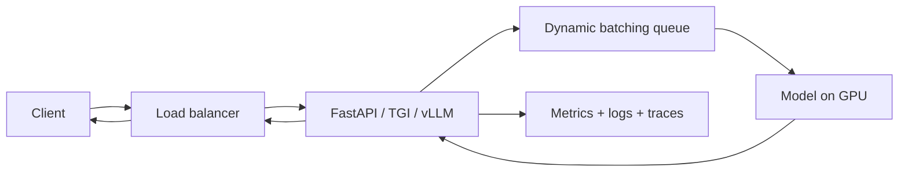

# 5.2 — Model Packaging & Serving (FastAPI, TorchServe, vLLM, Triton)

## 1. Intuition first
A trained model does nothing until it responds to requests. Serving = wrap the model in a stable API, run it efficiently, and scale it. Latency, throughput, and cost are the KPIs.

## 2. Why the topic exists
Real users can't call `model.predict()` inside your notebook. You need an HTTP/gRPC service, batching, autoscaling, GPU management, and observability.

## 3. What problem it solves
Turn a model artifact into a production endpoint with predictable performance.

## 4. Concepts / techniques
- **Sync vs async APIs** — REST/gRPC/WebSockets/SSE.
- **Static batching vs dynamic batching**.
- **Continuous batching** (LLMs, vLLM) — new sequences join mid-flight.
- **KV cache / PagedAttention** — LLM inference memory management.
- **Speculative decoding** — draft model + verifier for LLM throughput.
- **Quantization (INT8 / INT4 / FP8)** — smaller, faster, cheaper.
- **Autoscaling** — HPA on QPS / GPU util.
- **A/B routing, canaries, shadow traffic**.
- **Observability** — metrics (Prometheus), traces (OpenTelemetry), logs.

## 5. Metrics
Latency (p50/p95/p99), throughput (QPS, tokens/sec), cost per 1k requests, GPU utilization, memory, error rates.

## 6. Variables
Batch size, concurrency, replicas, GPU type, quantization level.

## 7. Algorithm — a solid serving stack
1. Export model to inference format (TorchScript, ONNX, TensorRT, GGUF).
2. Wrap in a server (FastAPI + PyTorch, TorchServe, Triton, Ray Serve, vLLM for LLMs, TGI).
3. Add dynamic batching + queue.
4. Containerize with a slim base image.
5. Deploy behind autoscaling (K8s HPA, Knative, KServe).
6. Add monitoring + tracing + alerts.
7. Add SLOs (e.g., p95 < 200 ms, availability > 99.9%).

## 8. Simple example — FastAPI + PyTorch
```python
from fastapi import FastAPI
from pydantic import BaseModel
import torch

app = FastAPI()
model = torch.jit.load("model.pt").eval().cuda()

class Req(BaseModel):
    inputs: list[float]

@app.post("/predict")
def predict(r: Req):
    with torch.no_grad():
        x = torch.tensor(r.inputs).float().cuda().unsqueeze(0)
        return {"score": model(x).item()}
```

## 9. Real-world example
- OpenAI's LLM serving stack uses custom optimized servers with PagedAttention-style memory management.
- Ray Serve at Anyscale / Anthropic.
- Triton Inference Server at NVIDIA customers.
- HuggingFace TGI + vLLM in open-source LLM deployments.

## 10. Diagram


## 11. Implementation from scratch
Not recommended — use battle-tested servers below.

## 12. Implementation using libraries
- **FastAPI + Uvicorn** for small classical / small NN models.
- **TorchServe** for PyTorch.
- **Triton Inference Server** — multi-framework, GPU-optimized.
- **Ray Serve** — Python-native, autoscaling.
- **vLLM / TGI / TensorRT-LLM** — LLM-specific, continuous batching.
- **BentoML** — packaging.

Example vLLM:
```bash
python -m vllm.entrypoints.openai.api_server --model meta-llama/Meta-Llama-3-8B-Instruct --tensor-parallel-size 2 --gpu-memory-utilization 0.9
```

Then OpenAI-compatible chat completions on `http://localhost:8000/v1`.

## 13. Time complexity
Latency: model FLOPs / GPU FLOPs + I/O. Throughput: batching × utilization.

## 14. Space complexity
GPU memory: weights + KV cache + activations. Watch for OOMs.

## 15. Advantages
Battle-tested; scaled; observable.

## 16. Disadvantages
Complexity; operational overhead.

## 17. Interview questions
1. Explain dynamic vs continuous batching.
2. PagedAttention — what and why.
3. Speculative decoding.
4. Quantization impacts (accuracy vs speed).
5. Latency SLO design (p95 vs p99).
6. Canary vs blue/green deployments.
7. Autoscaling policies.
8. How to shadow-test a new model.
9. Multi-tenant model serving trade-offs.
10. gRPC vs REST vs SSE for streaming outputs.

## 18. Common mistakes
- Missing `.eval()` / `no_grad` → memory blows up.
- Not using batching → GPU idles.
- Blocking event loop with sync inference.
- Not pinning CUDA / cuDNN versions.

## 19. Optimization techniques
Quantization (INT4/INT8/FP8), compilation (TensorRT, torch.compile), operator fusion, KV cache reuse, request coalescing, warm pools, model sharding.

## 20. Coding exercises
1. Serve a sklearn model with FastAPI + async.
2. Serve a HuggingFace model with vLLM; benchmark tokens/s.
3. Add dynamic batching manually with a background task.
4. Add Prometheus metrics + Grafana dashboard.

## 21. Mini project
Serve a fine-tuned BERT sentiment model at 1000 RPS with dynamic batching.

## 22. Medium project
Deploy a fine-tuned 7B LLM with vLLM on 2 GPUs; benchmark against TGI.

## 23. Advanced project
Multi-tenant LLM serving with S-LoRA (many LoRA adapters over one base) + speculative decoding; measure cost per 1M tokens.

## 24. Where it is used in industry
Every deployed model.

## 25. How companies use it
- OpenAI's serving stack.
- Anthropic's Claude via custom infrastructure.
- Databricks Mosaic Serving.
- Google Vertex AI, Azure OpenAI, AWS SageMaker.

## 26. When NOT to use it
- Batch prediction jobs — a scheduled Spark / Ray job is simpler than a server.
- Ephemeral one-off analyses.
