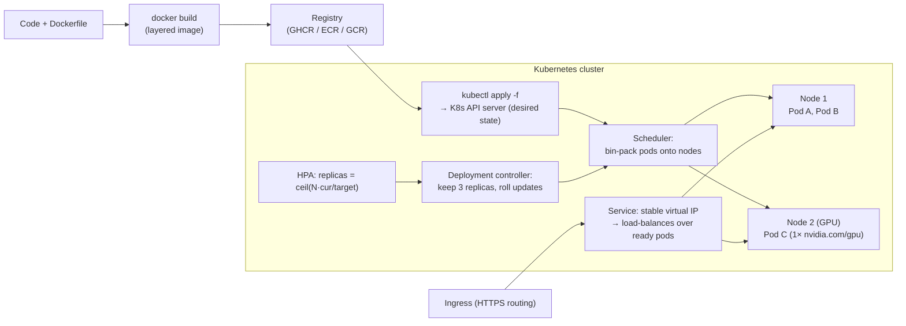
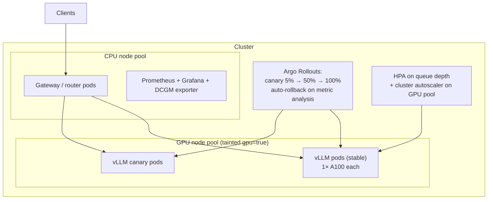

# 5.3 — Containers & Orchestration (Docker, Kubernetes)

## 1. Overview

**What is it?** Docker packages an application — code, dependencies, system libraries, configuration — into an **image**: an immutable, portable unit that runs identically on any machine as a **container**. Kubernetes (K8s) is an orchestrator: it takes a fleet of machines and a declarative description of what should run ("3 replicas of this model server, each with 1 GPU and a health check") and continuously makes reality match that description — scheduling, restarting, scaling, and rolling out new versions.

**Why does it exist?** "Works on my machine" is the oldest failure mode in software, and ML makes it worse: CUDA versions, driver mismatches, and Python dependency hell. Containers freeze the whole environment. And once you have tens of containers across many machines, manual placement and restart-on-failure become impossible — that coordination problem is what Kubernetes automates.

**What problem does it solve?** Reproducible packaging (Docker), and automated placement, scaling, self-healing, service discovery, and safe rollout (Kubernetes) — including GPU-aware scheduling for ML workloads.

**Where is it used?** Essentially everywhere in cloud software: the model servers from [Chapter 5.2](02-model-serving.md) run in containers on K8s at Netflix, Uber, Airbnb, and every major ML platform (SageMaker, Vertex AI, and OpenAI's training/inference clusters are built on containerized, orchestrated infrastructure).

## 2. Learning Objectives

After this chapter you will be able to:

- Explain images vs. containers, image layers, and why layer caching makes builds fast and ordering-sensitive.
- Write a production-quality Dockerfile for an ML service: slim base, pinned versions, multi-stage build, non-root user.
- Explain how containers achieve isolation (namespaces, cgroups) — and demonstrate it minimally in Python.
- Describe the core Kubernetes objects — Pod, Deployment, Service, Ingress, ConfigMap, Secret, PVC — and how they compose.
- Write manifests with resource requests/limits, liveness/readiness probes, and rolling-update settings.
- Explain scheduling as bin packing and implement a naive scheduler and HPA control loop from scratch.
- Configure the HorizontalPodAutoscaler and reason about its scaling formula.
- Run GPU workloads on K8s: device plugin, `nvidia.com/gpu` resources, node selectors/taints, and MIG.
- Package an application as a Helm chart with templated values.
- Debug the classic failure states: CrashLoopBackOff, OOMKilled, Pending pods, failing probes.

## 3. Prerequisites

| Chapter | Why you need it |
|---|---|
| [Model Serving](02-model-serving.md) | The thing we containerize and orchestrate here is the model server built there. |
| [Experiment Tracking](01-experiment-tracking.md) | Image tags and registry model versions together define exactly what is deployed. |
| Basic Linux shell | Dockerfiles are essentially scripted shell; `kubectl` is a CLI workflow. |
| Basic YAML | Every Kubernetes object is declared in YAML. |

Builds toward: [5.4 — CI/CD for ML](04-cicd-ml.md) (pipelines build images and apply manifests) and [5.7 — LLMOps](07-llmops.md) (GPU fleets for LLM serving).

## 4. Intuition

**Docker is a shipping container.** Before standardized containers, loading a cargo ship meant hand-stacking barrels, crates, and sacks — slow, fragile, different at every port. The shipping container standardized the *interface*: any container fits any ship, crane, and truck, regardless of what's inside. A Docker image is the same idea for software: whatever chaos of dependencies lives inside, the outside interface (run it, give it ports, env vars, volumes) is identical everywhere.

**Kubernetes is the port authority.** A port with ten thousand containers arriving daily needs a system deciding which ship carries what, replacing damaged containers, and rerouting when a crane breaks. You don't tell the port *how* to do each step; you declare *what* you need ("300 containers to Rotterdam weekly") and the system converges on it. Kubernetes is declarative in exactly this way: you submit the desired state, controllers reconcile toward it forever.

An everyday story: your teammate hands you a "working" training script. You spend a day fighting `libcudnn` versions before it runs. Next week, the production VM upgrades Python and the deployed model API dies at 2 am; someone SSHes in, half-fixes it, and now production is a snowflake no one can rebuild. With a pinned image, both problems vanish: the image that passed tests is byte-for-byte the image in production, and if the VM dies, Kubernetes reschedules the container elsewhere before you wake up.

## 5. Real-world Motivation

- **Google** ran containers at scale for a decade on its internal system **Borg**; Kubernetes (open-sourced 2014) is its public descendant, and the design paper explains why declarative orchestration wins at scale.
- **Netflix, Uber, Airbnb, Spotify** run their microservice fleets — including ML inference — on containers and Kubernetes-style orchestration; Spotify's public migration story to GKE is a canonical case study.
- **OpenAI** has publicly described scaling Kubernetes clusters to thousands of nodes for ML experimentation — the same primitives you learn here, at extreme scale.
- **NVIDIA** ships the GPU device plugin, GPU operator, and MIG support specifically because GPU scheduling on K8s is the substrate of every serious ML platform.
- **Managed ML platforms** (AWS SageMaker, Google Vertex AI, Azure ML) and ML infra layers (KServe, Kubeflow, Ray on K8s) are all built atop containers and Kubernetes — learning the substrate makes every platform above it legible.

## 6. Mathematical Foundations

This is a systems chapter: **no formal mathematics (derivations, calculus, probability) is required**, because the objects of study are engineered protocols, not mathematical models. The quantitative reasoning that *is* essential:

**Resource accounting and bin packing.** Each pod requests resources $(c_i, m_i, g_i)$ — CPU cores, memory, GPUs — and each node has capacity $(C_j, M_j, G_j)$. The scheduler must place pods such that for every node $j$:

$$\sum_{i \in \text{node } j} c_i \le C_j, \quad \sum_{i} m_i \le M_j, \quad \sum_{i} g_i \le G_j .$$

This is multi-dimensional **bin packing**, which is NP-hard in general — so Kubernetes uses greedy heuristics (filter feasible nodes, score them, pick the best). Practical consequence: fragmentation. A cluster with 8 nodes each having 0.5 GPU-equivalents free cannot schedule a 1-GPU pod despite "4 GPUs free" in aggregate.

**The HPA scaling formula.** The HorizontalPodAutoscaler computes desired replicas from a target metric:

$$\text{desiredReplicas} = \left\lceil \text{currentReplicas} \times \frac{\text{currentMetric}}{\text{targetMetric}} \right\rceil$$

Example: 4 replicas at 90% average CPU with a 60% target → $\lceil 4 \times 90/60 \rceil = 6$ replicas. The ceiling and stabilization windows (default 5 min for scale-down) damp oscillation — a plain proportional controller without damping would flap.

**Requests vs. limits and overcommit.** Scheduling uses *requests*; enforcement uses *limits*. If $\sum \text{requests} \le \text{capacity} < \sum \text{limits}$, the node is overcommitted: fine for bursty CPU (throttling), dangerous for memory (the OOM killer terminates the largest offender). Rule of thumb: set memory request = limit for model servers, because model memory is predictable and OOM kills are disruptive.

**Rolling-update capacity.** With $R$ replicas, `maxSurge=s`, `maxUnavailable=u`, capacity during rollout stays within $[R-u,\, R+s]$. Serving at 80% utilization with $u = 25\%$ means transient 107% load per remaining pod — quantifying why `maxUnavailable: 0` is common for latency-sensitive model servers.

## 7. Visual Explanation

The full path from code to running, scaled service:



Image layers and caching (why Dockerfile line order matters):

```
Layer 4: COPY . .                 ← changes every commit  (rebuilt often, small)
Layer 3: RUN pip install -r ...   ← changes when deps change (cached usually)
Layer 2: COPY requirements.txt .  ← changes when deps change
Layer 1: FROM python:3.11-slim    ← changes ~never (shared across all your images)
```

Copy the code *after* installing dependencies, and a code-only change rebuilds one thin layer instead of re-downloading PyTorch.

## 8. Algorithm

**The deploy loop** — from model server to scaled production service:

1. Write a `Dockerfile` (slim pinned base, deps before code, non-root user) and a `.dockerignore`.
2. `docker build -t ghcr.io/team/sentiment:v1.2.0 .` then `docker push` — the tag is the deployable unit's identity.
3. Write manifests: `Deployment` (image, replicas, resources, probes), `Service` (stable networking), optional `Ingress` and `HPA`.
4. `kubectl apply -f k8s/` — submit desired state.
5. Kubernetes reconciles: scheduler places pods; kubelet pulls images and starts containers; readiness probes gate traffic.
6. Verify: `kubectl get pods`, `kubectl logs`, `kubectl describe pod` for events.
7. Update: change the image tag, re-apply; the Deployment performs a rolling update, respecting `maxSurge`/`maxUnavailable`; `kubectl rollout undo` reverts.

**The two control loops that run the show**, as pseudocode:

```text
# Scheduler (simplified):
for each pending pod p:
    feasible ← [n for n in nodes if fits(p.requests, n.free)
                and matches(p.nodeSelector, n.labels)
                and tolerates(p.tolerations, n.taints)]
    if feasible is empty: leave p Pending (event: FailedScheduling)
    else: bind p to argmax_{n ∈ feasible} score(n)   # e.g., most free resources

# Deployment controller + HPA (simplified):
loop forever every ~15s:
    desired ← ceil(current_replicas * current_metric / target_metric)  # HPA
    desired ← clamp(desired, minReplicas, maxReplicas)
    while running_ready < desired: create pod (respecting maxSurge)
    while running > desired: delete pod (respecting maxUnavailable, stabilization window)
    for each pod failing livenessProbe: restart container (with backoff)
    for each pod failing readinessProbe: remove from Service endpoints
```

## 9. Worked Example

**Tiny example by hand — scheduling and autoscaling with actual numbers.** A cluster has two nodes: node1 = (4 CPU, 8 Gi), node2 = (4 CPU, 16 Gi, 1 GPU). We deploy a sentiment API with `requests: {cpu: 500m, memory: 1Gi}` and 3 replicas, plus one LLM pod requesting `{cpu: 2, memory: 12Gi, nvidia.com/gpu: 1}`.

- LLM pod: node1 fails the memory filter (12 Gi > 8 Gi) and has no GPU; node2 fits → **bind to node2**. Node2 free becomes (2 CPU, 4 Gi, 0 GPU).
- Sentiment replicas (0.5 CPU, 1 Gi each): replica 1 → node1 (most free), leaving (3.5, 7 Gi); replica 2 → node1 (3.0, 6 Gi); replica 3 → scorer may pick node2 (2 CPU, 4 Gi free) for balance → (1.5, 3 Gi).
- A 4th pod requesting 4 Gi memory now stays **Pending** even though the cluster has 9 Gi free in total — 6 Gi on node1 + 3 Gi on node2, but no *single* node has 4 Gi? Node1 does (6 Gi) — it schedules; but a pod requesting 7 Gi would be Pending with 9 Gi free in aggregate. That is fragmentation, computed by hand.
- Traffic spikes: the 3 sentiment replicas hit 85% average CPU against an HPA target of 50%: $\lceil 3 \times 85/50 \rceil = \lceil 5.1 \rceil = 6$ replicas. After the spike, at 20%: $\lceil 6 \times 20/50 \rceil = 3$ — but scale-down waits out the 5-minute stabilization window first.

**Realistic example.** The vLLM server from [Chapter 5.2](02-model-serving.md) is packaged on a `nvidia/cuda:12.4.1-runtime-ubuntu22.04` base, deployed to a GPU node pool with `nvidia.com/gpu: 1`, a taint `gpu=true:NoSchedule` on GPU nodes (with a matching toleration) so CPU pods never occupy them, a readiness probe on `/health` with `initialDelaySeconds: 120` (weights take ~90 s to load), and `maxUnavailable: 0` rolling updates so capacity never dips during model upgrades.

## 10. Python from Scratch

Containers and K8s are systems software, so "from scratch" means implementing the **core mechanisms** minimally: (a) the isolation primitive, and (b) the scheduler + HPA control loops.

**(a) Isolation in one command.** A container is not a VM — it is a normal Linux process wrapped in namespaces (isolated view of PIDs, network, filesystem) and cgroups (resource limits). You can see this with the standard library:

```python
import subprocess
# 'unshare' puts the child in new PID + mount namespaces: inside, it believes
# it is PID 1 on a fresh machine. This is the essence of a container runtime;
# Docker adds image layers (overlayfs), a network namespace, and cgroup limits.
subprocess.run(["sudo", "unshare", "--pid", "--mount", "--fork",
                "python3", "-c", "import os; print('my pid:', os.getpid())"])
# Expected output: my pid: 1   (isolated PID namespace — like inside `docker run`)
```

**(b) A miniature scheduler + HPA.** ~60 lines that reproduce Section 8's pseudocode faithfully:

```python
import math
from dataclasses import dataclass, field

@dataclass
class Node:
    name: str
    cpu: float; mem: float; gpu: int = 0        # total capacity
    used_cpu: float = 0; used_mem: float = 0; used_gpu: int = 0

    def fits(self, p):                           # feasibility filter (Sec. 6 inequalities)
        return (self.cpu - self.used_cpu >= p.cpu and
                self.mem - self.used_mem >= p.mem and
                self.gpu - self.used_gpu >= p.gpu)

    def bind(self, p):                           # commit the placement
        self.used_cpu += p.cpu; self.used_mem += p.mem; self.used_gpu += p.gpu

@dataclass
class Pod:
    name: str; cpu: float; mem: float; gpu: int = 0; node: str | None = None

def schedule(pod, nodes):
    """Filter feasible nodes, score by most free CPU+mem, bind to the best."""
    feasible = [n for n in nodes if n.fits(pod)]
    if not feasible:
        print(f"  {pod.name}: Pending (FailedScheduling)")   # exactly K8s behavior
        return
    best = max(feasible, key=lambda n: (n.cpu - n.used_cpu) + (n.mem - n.used_mem))
    best.bind(pod); pod.node = best.name
    print(f"  {pod.name} -> {best.name}")

def hpa(current_replicas, current_metric, target, lo=2, hi=10):
    """The actual HPA formula with min/max clamping."""
    desired = math.ceil(current_replicas * current_metric / target)
    return max(lo, min(hi, desired))

# --- Recreate the Section 9 worked example ---
nodes = [Node("node1", cpu=4, mem=8), Node("node2", cpu=4, mem=16, gpu=1)]
print("scheduling:")
schedule(Pod("llm", cpu=2, mem=12, gpu=1), nodes)        # -> node2
for i in range(3):
    schedule(Pod(f"sentiment-{i}", cpu=0.5, mem=1), nodes)
schedule(Pod("big-batch", cpu=1, mem=7), nodes)          # -> Pending (fragmentation)

print("autoscaling:")
r = 3
for load in [85, 85, 20]:                                # observed avg CPU %
    r = hpa(r, load, target=50)
    print(f"  load={load}% -> replicas={r}")
# Expected output:
#   llm -> node2 ... sentiment pods placed ... big-batch: Pending (FailedScheduling)
#   load=85% -> replicas=6, then 6 stays (85->? recompute), load=20% -> replicas=3
```

Complexity: scheduling one pod is $O(N)$ over $N$ nodes (real K8s samples/scores similarly); the HPA step is $O(1)$. **Common bug:** forgetting to *bind* (update `used_*`) after choosing a node — every pod then lands on the same node and the cluster "works" until real workloads OOM together; the analogous real-world bug is deploying pods **without resource requests**, which makes the real scheduler equally blind.

## 11. Library Implementation

The "libraries" here are Docker, kubectl, and Helm. First, a production-grade multi-stage Dockerfile for the FastAPI model server:

```dockerfile
# ---- Stage 1: builder — has compilers, produces wheels ----
FROM python:3.11-slim AS builder
WORKDIR /app
COPY requirements.txt .
# Build wheels once; nothing from this heavy stage ships to production.
RUN pip wheel --no-cache-dir -r requirements.txt -w /wheels

# ---- Stage 2: runtime — minimal attack surface, small image ----
FROM python:3.11-slim
WORKDIR /app
# Run as non-root: container escape from root is far more dangerous.
RUN useradd -m appuser
COPY --from=builder /wheels /wheels
RUN pip install --no-cache-dir /wheels/* && rm -rf /wheels
# Code LAST: dep layers above stay cached across code-only changes.
COPY --chown=appuser:appuser . .
USER appuser
EXPOSE 8000
# Exec-form CMD: uvicorn is PID 1 and receives SIGTERM for graceful shutdown.
CMD ["uvicorn", "app:app", "--host", "0.0.0.0", "--port", "8000"]
```

The Kubernetes manifests — Deployment with probes and resources, Service, HPA:

```yaml
apiVersion: apps/v1
kind: Deployment
metadata:
  name: sentiment
spec:
  replicas: 3
  strategy:
    rollingUpdate: { maxSurge: 1, maxUnavailable: 0 }   # never dip below capacity
  selector: { matchLabels: { app: sentiment } }
  template:
    metadata: { labels: { app: sentiment } }
    spec:
      containers:
        - name: api
          image: ghcr.io/team/sentiment:v1.2.0          # immutable tag, never :latest
          ports: [{ containerPort: 8000 }]
          resources:
            requests: { cpu: 500m, memory: 2Gi }        # scheduler uses these
            limits:   { cpu: "2",  memory: 2Gi }        # mem limit == request: no OOM surprises
          readinessProbe:                                # gate traffic until model is loaded
            httpGet: { path: /healthz, port: 8000 }
            initialDelaySeconds: 15
            periodSeconds: 5
          livenessProbe:                                 # restart if wedged
            httpGet: { path: /healthz, port: 8000 }
            initialDelaySeconds: 60
            periodSeconds: 15
          envFrom:
            - configMapRef: { name: sentiment-config }   # non-secret config
            - secretRef:    { name: sentiment-secrets }  # API keys etc.
---
apiVersion: v1
kind: Service
metadata: { name: sentiment }
spec:
  selector: { app: sentiment }          # stable VIP over whichever pods are Ready
  ports: [{ port: 80, targetPort: 8000 }]
---
apiVersion: autoscaling/v2
kind: HorizontalPodAutoscaler
metadata: { name: sentiment }
spec:
  scaleTargetRef: { apiVersion: apps/v1, kind: Deployment, name: sentiment }
  minReplicas: 3
  maxReplicas: 12
  metrics:
    - type: Resource
      resource: { name: cpu, target: { type: Utilization, averageUtilization: 60 } }
```

For **GPU workloads**, install the NVIDIA device plugin (or GPU Operator), then request GPUs like any resource — note GPUs are limits-only and never fractional (without MIG/time-slicing):

```yaml
      nodeSelector: { gpu-type: a100 }              # target the right node pool
      tolerations:
        - { key: gpu, operator: Equal, value: "true", effect: NoSchedule }
      containers:
        - name: vllm
          image: vllm/vllm-openai:v0.5.4
          resources:
            limits: { nvidia.com/gpu: 1 }            # exclusive GPU assignment
```

**Helm** templates all of the above so one chart deploys dev/staging/prod with different values:

```yaml
# values.yaml                          # templates/deployment.yaml (excerpt)
image:                                 # image: {{ .Values.image.repo }}:{{ .Values.image.tag }}
  repo: ghcr.io/team/sentiment         # replicas: {{ .Values.replicas }}
  tag: v1.2.0
replicas: 3
```

```bash
helm upgrade --install sentiment ./chart -f values-prod.yaml   # deploy/upgrade
helm rollback sentiment 1                                       # one-command revert
```

## 12. Code Walkthrough

Tracing a deploy of `sentiment:v1.2.0` end to end:

| Item | Value | Meaning |
|---|---|---|
| Image | `ghcr.io/team/sentiment:v1.2.0`, ~350 MB (slim) | 4 layers; only the top code layer changes per release |
| Desired state | Deployment `replicas: 3` | Stored in etcd via the API server |
| Scheduler input | requests `{cpu: 500m, mem: 2Gi}` | Feasibility per Section 6 inequalities |
| Pod phase | Pending → ContainerCreating → Running | Image pull ≈ 10–30 s warm-node |
| Readiness | `/healthz` 200 after model load (~15 s) | Only then does the Service route traffic |
| Rollout | maxSurge 1 / maxUnavailable 0 | Capacity ∈ [3, 4] throughout the update |
| HPA | CPU 60% target, 3–12 replicas | desired = ⌈N·cur/60⌉ every ~15 s |

Inputs: image tag + manifests. Intermediate values: etcd desired state, scheduler bindings, kubelet container starts, endpoint lists in the Service. Outputs: a stable `sentiment` DNS name inside the cluster load-balancing over Ready pods; externally reachable via Ingress. Expected results: `kubectl get pods` shows `3/3 Running READY 1/1`; during `kubectl set image ... sentiment=...:v1.3.0` you see one surge pod created, become Ready, then one old pod terminate — repeated three times, with zero failed requests if graceful shutdown (SIGTERM → drain) is handled.

## 13. Complexity Analysis

- **Build time:** proportional to *changed* layers. With deps-before-code ordering, a code change rebuilds seconds' worth of layers; a dependency change pays the full `pip install`. BuildKit parallelizes independent stages.
- **Startup latency:** image pull ($O(\text{image size})$ over the node's network — a 5 GB CUDA image at 1 Gb/s ≈ 40 s, why slim images matter) + container start (< 1 s) + app init (model load, often the dominant term for ML). This sum is your scale-up reaction time and bounds how spiky traffic you can absorb.
- **Scheduling:** filtering + scoring is roughly $O(\text{nodes})$ per pod (K8s caps the percentage of nodes scored in big clusters); binding is a single etcd write. Cluster-wide optimal packing would be NP-hard bin packing — greedy is the engineering answer.
- **Control-loop convergence:** reconcile intervals are seconds; HPA reacts in ~15–30 s plus pod startup — Kubernetes autoscaling is *minutes-scale*, so latency-sensitive services must keep headroom (Section 6 of [Model Serving](02-model-serving.md)).
- **Space:** images dominated by base layers (CUDA runtime bases are 2–5 GB; multi-stage + slim bases cut app layers to hundreds of MB); nodes cache layers, and registries deduplicate shared layers across images.

## 14. Advantages

- **Reproducibility:** the image digest that passed CI is bit-identical to production — eliminating "works on my machine". Example: pinning `python:3.11-slim@sha256:...` survives even upstream tag mutation.
- **Self-healing:** liveness probes restart wedged servers; node failure triggers rescheduling. Example: a memory-leaking inference pod gets OOM-killed and restarted automatically at 3 am instead of paging a human.
- **Horizontal scaling:** HPA turns the Section 6 formula into hands-off capacity management — the sentiment API scaled 3 → 6 replicas in the worked example with zero human action.
- **Safe rollouts and instant rollback:** rolling updates with `maxUnavailable: 0`, plus `kubectl rollout undo` / `helm rollback` — deployment stops being a scary event.
- **Portability and multi-team isolation:** namespaces, quotas, and taints let one GPU cluster safely host many teams; the same manifests run on EKS, GKE, AKS, or a laptop's kind/minikube.

## 15. Disadvantages

- **Steep learning curve and YAML sprawl:** dozens of object types and hundreds of lines of manifests before "hello world" serves traffic. Failure case: a team of two spends a month on cluster plumbing instead of the model — serverless (Cloud Run, Modal) would have shipped in a day.
- **Operational cost:** upgrades, networking (CNI), certificates, observability stacks — a cluster is a product you now own; managed K8s reduces but does not remove this.
- **GPU awkwardness:** GPUs are limits-only, non-fractional (without MIG/time-slicing), and expensive to fragment; autoscaling GPU nodes takes minutes (instance boot + driver + image pull), which spiky LLM traffic punishes.
- **Not ideal for tightly-coupled batch HPC:** gang-scheduled multi-node distributed training fits Slurm-style schedulers (or K8s add-ons like Volcano/Kueue) better than vanilla K8s.
- **Abstraction leaks:** you still debug Linux underneath — OOM killer semantics, conntrack limits, DNS timeouts. When it breaks at the container/network boundary, K8s knowledge alone is insufficient.

## 16. Common Mistakes

- **`FROM python:latest` / mutable tags:** the image silently changes between builds. *Fix:* pin versions, ideally digests.
- **`COPY . .` before `pip install`:** every code edit invalidates the dependency layer → 10-minute rebuilds. *Fix:* copy `requirements.txt` and install first (Section 11 Dockerfile).
- **No resource requests:** the scheduler packs blindly; pods co-locate and OOM together (exactly the from-scratch bug in Section 10). *Fix:* always set requests; memory limit = request for model servers.
- **Liveness probe that fails during model loading:** the kubelet kills the pod before it finishes loading weights → **CrashLoopBackOff forever**. *Fix:* generous `initialDelaySeconds` or a `startupProbe`; keep readiness separate from liveness.
- **Secrets in ConfigMaps or baked into images:** ConfigMaps are plaintext to anyone with namespace read access; image layers are inspectable. *Fix:* Secrets (with encryption at rest) or an external secret manager.
- **Missing `.dockerignore`:** the build context ships your datasets, `.git`, and virtualenvs to the daemon — slow builds, bloated caches, leaked files. *Fix:* ignore everything not needed at runtime.
- **Shell-form `CMD python app.py`:** the shell is PID 1 and swallows SIGTERM → no graceful shutdown, dropped requests on every rollout. *Fix:* exec form `CMD ["python", "app.py"]`.

## 17. Best Practices

Production checklist:

- [ ] Slim, pinned base image; multi-stage build; non-root `USER`; `.dockerignore`; image scanned for CVEs in CI.
- [ ] One process per container; logs to stdout/stderr (collected by the platform, not files).
- [ ] Immutable, semantic image tags (`v1.2.0` + git SHA); deploy by digest in regulated environments.
- [ ] Requests and limits on every container; memory limit = request for servers; namespace ResourceQuotas per team.
- [ ] Readiness ≠ liveness; `startupProbe` for slow model loads; graceful shutdown (handle SIGTERM, `preStop` drain, `terminationGracePeriodSeconds` ≥ drain time).
- [ ] `maxUnavailable: 0` for latency-critical services; PodDisruptionBudgets so node maintenance can't evict everything at once.
- [ ] Taint GPU nodes; tolerate + nodeSelect from GPU workloads only; monitor GPU utilization per pod (DCGM exporter).
- [ ] Everything in git — manifests or Helm charts — applied by CI, not by humans running `kubectl apply` from laptops (GitOps; see [CI/CD for ML](04-cicd-ml.md)).

> [!TIP]
> Learn the debugging quartet: `kubectl describe pod` (events explain Pending/probe failures), `kubectl logs --previous` (why the last container died), `kubectl exec -it` (poke inside), `kubectl get events --sort-by=.lastTimestamp` (cluster-wide timeline). These four commands solve 90% of incidents.

## 18. Optimization Techniques

- **Multi-stage builds + slim/distroless bases:** cut a 6 GB build image to a few hundred MB runtime image — faster pulls, faster autoscaling, smaller attack surface.
- **Layer-cache engineering:** order Dockerfile from least- to most-frequently changing; use BuildKit cache mounts (`--mount=type=cache,target=/root/.cache/pip`) in CI.
- **Image pre-pulling / streaming:** DaemonSets that pre-pull model-server images onto GPU nodes, or lazy-pulling snapshotters (eStargz), to shrink scale-up time from minutes to seconds.
- **Right-sizing via VPA-in-recommend-mode:** observe actual usage, then set requests to ~p95 usage — reclaiming the 50%+ of capacity teams typically over-request.
- **GPU sharing:** MIG partitions an A100/H100 into up to 7 isolated slices (e.g., `nvidia.com/mig-2g.20gb`) for small models; time-slicing for dev clusters. Fills the gap between "whole GPU" and "no GPU".
- **Cluster autoscaler + spot/preemptible node pools** for batch/CI workloads; keep on-demand pools for serving.
- **Weight-loading acceleration:** bake models into images only if small; otherwise mount from fast object storage/PVCs with memory-mapped safetensors, so pods don't re-download 16 GB on every restart.
- **Custom-metric HPA:** scale model servers on QPS or queue depth (Prometheus adapter/KEDA) rather than CPU — GPU-bound servers can be latency-saturated at 30% CPU.

## 19. Industry Applications

- **Google:** Borg → Kubernetes lineage; virtually all Google services, and Vertex AI's training/serving, run on this substrate.
- **OpenAI:** published engineering posts on scaling Kubernetes to 2,500 and then 7,500 nodes for ML workloads — scheduler, networking, and etcd lessons at the extreme.
- **Netflix, Uber, Airbnb, Spotify:** containerized microservice + ML-serving fleets; Spotify's GKE migration and Uber's Michelangelo ML platform are documented case studies.
- **NVIDIA GPU clouds and enterprise ML platforms:** the GPU Operator + device plugin + MIG stack from this chapter is exactly what CoreWeave-style GPU clouds and on-prem ML platforms run.
- **ML infra layers:** KServe (model inference CRDs), Kubeflow (pipelines), Ray-on-K8s (KubeRay), and Argo (workflows, [next chapter](04-cicd-ml.md)) all assume fluency in the objects taught here.

## 20. Interview Questions

### Beginner

- **Q: Image vs. container?**
  A: An image is an immutable, layered filesystem + metadata (the recipe's output); a container is a running (or stopped) instance of an image with its own writable layer, namespaces, and cgroup limits. One image → many containers.
- **Q: What is layer caching and why does Dockerfile instruction order matter?**
  A: Each instruction produces a cached layer keyed on the instruction + its inputs; a change invalidates that layer and all layers after it. Putting `COPY . .` before dependency installation forces a full reinstall on every code edit.
- **Q: Pod vs. Deployment vs. Service?**
  A: Pod = smallest schedulable unit (1+ containers sharing network/volumes); Deployment = controller keeping N pod replicas alive and managing rolling updates; Service = stable virtual IP/DNS load-balancing over the Ready pods matching its selector.
- **Q: Liveness vs. readiness probe?**
  A: Liveness answers "should this container be restarted?" (wedged process); readiness answers "should it receive traffic?" (still loading the model, temporarily overloaded). Confusing them causes restart loops during startup.
- **Q: What happens when a container exceeds its memory limit?**
  A: The kernel OOM-kills it; Kubernetes restarts it per the restart policy and reports `OOMKilled`. (CPU over limit is merely throttled — a key asymmetry.)

### Intermediate

- **Q: Requests vs. limits — how does each affect scheduling and runtime?**
  A: Requests are the scheduler's accounting currency (bin-packing inequalities) and set proportional CPU shares under contention; limits are runtime ceilings (CPU throttling, memory OOM kill). Requests without limits risks noisy neighbors; limits without requests makes scheduling blind.
- **Q: Walk through a rolling update with maxSurge=1, maxUnavailable=0 on 3 replicas.**
  A: Create 1 new-version pod (total 4); wait for Ready; terminate 1 old pod (3); repeat twice more. Capacity never drops below 3; rollback re-applies the previous ReplicaSet the same way.
- **Q: A pod is stuck Pending. Diagnose.**
  A: `kubectl describe pod` → events. Typical causes: insufficient CPU/memory/GPU on any single node (fragmentation), unsatisfied nodeSelector/affinity, untolerated taints, PVC unbound, or resource quota exceeded.
- **Q: How do GPUs work on K8s?**
  A: The NVIDIA device plugin advertises `nvidia.com/gpu` as an extended resource per node; pods request whole GPUs via limits; the kubelet assigns specific devices (`NVIDIA_VISIBLE_DEVICES`). Fractional sharing needs MIG (hardware-isolated slices) or time-slicing (no isolation).
- **Q: The HPA formula: 5 replicas, target 70% CPU, current 95% — what happens? And why do stabilization windows exist?**
  A: desired = ⌈5·95/70⌉ = ⌈6.8⌉ = 7 replicas. Stabilization windows (esp. 5 min on scale-down) prevent thrashing when the metric oscillates around the target — a proportional controller with no damping would flap continuously.
- **Q: ConfigMap vs. Secret?**
  A: Both inject config as env vars or files; Secrets are base64-encoded, can be encrypted at rest, and gated by tighter RBAC — but base64 is not encryption, so real credentials belong in a secret manager (or sealed/external secrets) with Secrets as the delivery mechanism.

### Advanced

- **Q: Design K8s serving for the vLLM stack of Chapter 5.2: 8×A100 nodes, spiky traffic, TTFT SLO.**
  A: Dedicated GPU node pool with taints; one vLLM pod per GPU (or TP pods spanning 2–4 GPUs with pod affinity to one node); startupProbe covering weight load; scale on queue depth/KV-utilization custom metrics (not CPU); pre-pulled images + weights on local NVMe or memory-mapped from object storage to cut scale-up to <2 min; PDBs + maxUnavailable:0; overprovision one warm replica because GPU node autoscaling is minutes-slow.
- **Q: Why is kube-scheduler greedy rather than optimal, and what operational problem does that create?**
  A: Multi-dimensional bin packing is NP-hard and pods arrive online; greedy filter-and-score gives predictable low-latency decisions. The cost is fragmentation — aggregate free resources that no single node can offer — mitigated by bin-packing-friendly scoring (`MostAllocated`), descheduling, and homogeneous node pools per workload class.
- **Q: How would you run 4 small models on one A100 safely?**
  A: MIG: partition into isolated instances (e.g., 4× `1g.10gb` or mixed profiles), each schedulable as its own resource with hardware memory/SM isolation. Time-slicing shares without isolation (one OOM kills all) — acceptable only for dev. Alternative: one Triton pod hosting all four models with per-model instance groups.
- **Q: A rollout causes a brief burst of 502s even though probes pass. Why?**
  A: Termination race: the pod gets SIGTERM while still listed in endpoints for a moment, or the server exits before in-flight requests drain. Fix: `preStop` sleep (a few seconds) + graceful shutdown handling SIGTERM + `terminationGracePeriodSeconds` > drain time; ensure the shell isn't PID 1 swallowing signals.
- **Q: GitOps: why should CI never run `kubectl apply` directly?**
  A: With GitOps (Argo CD/Flux), git is the single source of truth and a controller continuously reconciles the cluster to it: drift is detected and reverted, rollback = git revert, and audit is the git log. CI pushing imperatively leaves no desired-state record and drifts silently — the full argument continues in [CI/CD for ML](04-cicd-ml.md).

## 21. Coding Exercises

### Easy

1. Dockerize the FastAPI sentiment server from [Chapter 5.2](02-model-serving.md) with the multi-stage Dockerfile pattern; get the runtime image under 400 MB. *Hint:* `docker history <image>` shows per-layer sizes.
2. Prove layer caching: time `docker build` after (a) editing a comment in `app.py`, (b) adding a dependency. Explain the difference in one sentence. *Hint:* watch which steps say `CACHED`.
3. Extend the Section 10 mini-scheduler with taints/tolerations: nodes get a `taints: set[str]`, pods a `tolerations: set[str]`; untolerated nodes are filtered out. *Hint:* one extra condition in the feasibility filter.

### Medium

1. Deploy to a local cluster (kind or minikube): Deployment (3 replicas) + Service + Ingress; verify rolling update with `maxUnavailable: 0` drops zero requests under `hey` load. *Hint:* add a `preStop` sleep and SIGTERM handling first.
2. Add an HPA at 60% CPU, generate load, and watch `kubectl get hpa -w`; verify the observed replica counts match the Section 6 formula by hand. *Hint:* metrics-server must be installed on kind/minikube.
3. Break and fix probes: set a liveness probe with `initialDelaySeconds: 1` on a server that takes 30 s to load a model; observe CrashLoopBackOff; fix with a startupProbe. *Hint:* `kubectl describe pod` events tell the story.

### Hard

1. Convert the manifests into a Helm chart with `values-dev.yaml` / `values-prod.yaml` (different replicas, resources, image tags); verify with `helm template` diffing. *Hint:* start from `helm create` and delete what you don't need.
2. Simulate fragmentation: extend the mini-scheduler to run 500 random pods over 20 nodes with both `LeastAllocated` and `MostAllocated` scoring; measure how many "aggregate-feasible" pods end up Pending under each. *Hint:* count pods where `sum(free) >= request` but no single node fits.
3. GPU scheduling on a real or simulated node: install the NVIDIA device plugin (or use a fake device plugin), deploy a pod requesting `nvidia.com/gpu: 1`, and verify device isolation with `nvidia-smi` inside the container. *Hint:* the pod sees only its assigned GPU.

## 22. Mini Project

**Containerized inference API on a local cluster.**

1. Take the Mini Project sentiment API from [Chapter 5.2](02-model-serving.md).
2. Write the multi-stage Dockerfile + `.dockerignore`; build and run locally; confirm `/healthz` and `/predict` work in the container.
3. Create a kind cluster; load the image (`kind load docker-image`).
4. Write Deployment (2 replicas, requests/limits, readiness + liveness probes), Service, and HPA (min 2, max 6, CPU 60%).
5. Port-forward and load-test; watch the HPA scale up and (after the stabilization window) back down.
6. Perform a rolling update to a `v2` image with a visible change; verify zero downtime; then `kubectl rollout undo`.
7. Deliverable: the repo + a README of every command and a screenshot of the scaling event.

## 23. Medium Project

**Helm-packaged model-serving stack with observability.**

1. Convert the Mini Project into a Helm chart: templated image tag, replicas, resources, HPA bounds; separate dev/prod values files.
2. Install kube-prometheus-stack (Prometheus + Grafana) via its Helm chart.
3. Expose request-latency and batch-size metrics from the app ([Chapter 5.2](02-model-serving.md) exercises); add a ServiceMonitor so Prometheus scrapes them.
4. Build a Grafana dashboard: p95 latency, QPS, replica count, per-pod CPU/memory.
5. Add a PodDisruptionBudget and demonstrate a simulated node drain (`kubectl drain`) keeping the service available.
6. Configure HPA on a custom metric (QPS via Prometheus Adapter) instead of CPU; compare scaling behavior under the same load test.
7. Deliverable: chart repo + dashboard JSON + a short comparison of CPU-based vs. QPS-based autoscaling.

## 24. Advanced Project

**GPU-backed LLM inference platform on Kubernetes.**

Architecture:



Implementation phases:

1. **GPU foundation:** GPU node pool (cloud or a single local GPU with kind + device plugin); NVIDIA device plugin/GPU Operator; taints + tolerations; verify a CUDA pod sees its GPU.
2. **Serving layer:** vLLM Deployment with `nvidia.com/gpu: 1`, startupProbe sized to weight-loading time, weights mounted from object storage/PVC (not baked into the image); Service + gateway.
3. **Autoscaling:** DCGM exporter for GPU metrics; HPA on queue depth or KV-cache utilization via Prometheus Adapter; cluster autoscaler on the GPU pool; measure end-to-end scale-up time and add one warm overprovisioned replica.
4. **Progressive delivery:** Argo Rollouts canary — 5% traffic to a new model version, automated analysis on TTFT p95 and error rate, auto-rollback on regression (bridging into [CI/CD for ML](04-cicd-ml.md)).

Possible improvements: MIG profiles for a mixed small-model tier; Kueue for gang-scheduled fine-tuning jobs on the same cluster; image/weight pre-pull DaemonSet cutting cold starts below 60 s; per-team namespaces with GPU ResourceQuotas and cost attribution.

## 25. Summary

- Docker images are immutable, layered environment snapshots; containers are isolated processes (namespaces + cgroups) running them — reproducibility by construction.
- Layer caching makes Dockerfile *ordering* a performance feature: dependencies before code, always with `.dockerignore` and pinned bases.
- Kubernetes is declarative: you submit desired state; controllers (Deployment, HPA, scheduler) reconcile reality toward it forever — self-healing falls out of the loop, not from special-case code.
- Scheduling is online multi-dimensional bin packing on *requests*; fragmentation means aggregate free ≠ schedulable — visible in our 60-line from-scratch scheduler.
- The HPA formula desired = ⌈N · current/target⌉ plus stabilization windows is the entire autoscaling "algorithm"; its minutes-scale reaction time is why serving keeps headroom.
- Probes gate everything: readiness controls traffic, liveness controls restarts, startupProbe protects slow model loads — mixing them up is the #1 cause of CrashLoopBackOff.
- Requests vs. limits: schedule on requests, enforce with limits; memory limit = request for model servers.
- GPUs are extended resources: whole-GPU by default, MIG/time-slicing for sharing; taint GPU nodes and tolerate from GPU workloads only.
- Helm templates manifests per environment; GitOps (git as the single source of truth, applied by a controller) is how manifests reach clusters in mature orgs.
- Skip K8s when a serverless platform or a batch scheduler fits: the orchestration tax only pays off at sufficient scale and team size.

## 26. Cheat Sheet

| Key relation | Statement |
|---|---|
| Scheduling feasibility | ∑ pod requests ≤ node capacity, per dimension, per node |
| HPA | desired = ⌈N · currentMetric/targetMetric⌉, clamped, damped |
| Rollout capacity | ∈ [R − maxUnavailable, R + maxSurge] |
| Startup latency | image pull + container start + model load (dominant for ML) |

Commands: `docker build -t img:tag .` · `docker history img` · `kubectl apply -f k8s/` · `kubectl get pods,svc,hpa` · `kubectl describe pod X` · `kubectl logs X --previous` · `kubectl rollout undo deploy/X` · `helm upgrade --install rel ./chart -f values.yaml`.

Defaults that serve well: slim pinned base + multi-stage; non-root user; exec-form CMD; mem limit = request; readiness `periodSeconds: 5`; startupProbe for model loads; `maxUnavailable: 0` for serving; HPA 60–70% CPU or custom QPS metric; taints on GPU nodes.

Gotchas: `:latest` tags; `COPY . .` before deps; probes killing pods mid-model-load; secrets in ConfigMaps/images; shell-form CMD swallowing SIGTERM; no requests ⇒ blind scheduler; GPU pods Pending from fragmentation; scale-down surprises during stabilization windows.

## 27. Further Reading

- **Books:** *Kubernetes in Action* (Marko Lukša) — the standard deep introduction; *Kubernetes: Up and Running* (Hightower, Burns, Beda); *Docker Deep Dive* (Nigel Poulton); *Production Kubernetes* (Rosso et al., O'Reilly).
- **Research papers:** "Large-scale cluster management at Google with Borg" (Verma et al., EuroSys 2015); "Borg, Omega, and Kubernetes" (Burns et al., ACM Queue 2016).
- **Documentation:** Docker docs (docs.docker.com) — Dockerfile best practices; Kubernetes docs (kubernetes.io) — Concepts, Tasks; NVIDIA GPU Operator & device plugin docs; Helm docs (helm.sh).
- **GitHub repositories:** `kubernetes/kubernetes`, `NVIDIA/k8s-device-plugin`, `kubernetes-sigs/kind`, `helm/helm`, `kserve/kserve`, `kubernetes-sigs/kueue`, `argoproj/argo-rollouts`.
- **Datasets:** not applicable as such — use the model artifacts from earlier chapters as deployment payloads.
- **YouTube/Videos:** KubeCon talks (CNCF channel) — especially the "Kubernetes for ML" and GPU-scheduling tracks; TechWorld with Nana's Docker/K8s courses; OpenAI's "Scaling Kubernetes" talks.
- **Blogs:** OpenAI engineering — "Scaling Kubernetes to 7,500 nodes"; Spotify Engineering on the GKE migration; Learnk8s.io articles (scheduler, autoscaling deep dives); NVIDIA technical blog on MIG and GPU sharing on K8s.
