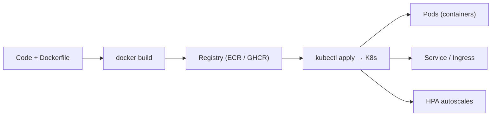

# 5.3 — Containers & Orchestration (Docker, Kubernetes)

## 1. Intuition first
Container = "works on my machine, everywhere" — package code + deps into an isolated, portable unit. Kubernetes = a cluster of machines that runs many containers reliably, scales them, restarts them, and rolls out new versions safely.

## 2. Why the topic exists
Reproducible deployments; horizontal scaling; fault-tolerance; multi-team isolation.

## 3. What problem it solves
Portable packaging, orchestration, scaling, self-healing.

## 4. Concepts
### Docker
Image (immutable), Container (running instance), Dockerfile (recipe), Registry (Docker Hub, ECR, GCR, GHCR), volumes, networks.

### Kubernetes
Pod (unit of scheduling — one or more containers), Deployment, Service (stable networking), Ingress, ConfigMap, Secret, PersistentVolumeClaim, Node, Namespace.

Controllers: HorizontalPodAutoscaler, VerticalPodAutoscaler, StatefulSet, Job/CronJob, DaemonSet.

GPU support via `nvidia-device-plugin`; multi-instance GPU (MIG).

## 5. Every "formula"
Not applicable.

## 6. Variables
Image tag, replicas, resource requests/limits, autoscaling thresholds.

## 7. Algorithm — Dockerize + deploy
1. Write `Dockerfile` (small base image, pin versions, `.dockerignore`).
2. Build & push: `docker build -t repo/img:v1 . && docker push`.
3. Write K8s manifests (Deployment, Service, HPA).
4. `kubectl apply -f`.
5. Add health checks (`readinessProbe`, `livenessProbe`).
6. Add resource requests/limits.
7. Add logs + metrics sidecars or use platform observability.

## 8. Simple example — Dockerfile for a FastAPI model server
```dockerfile
FROM python:3.11-slim
WORKDIR /app
COPY requirements.txt .
RUN pip install --no-cache-dir -r requirements.txt
COPY . .
EXPOSE 8000
CMD ["uvicorn", "app:app", "--host", "0.0.0.0", "--port", "8000"]
```

Deployment manifest:
```yaml
apiVersion: apps/v1
kind: Deployment
metadata:
  name: sentiment
spec:
  replicas: 3
  selector: { matchLabels: { app: sentiment } }
  template:
    metadata: { labels: { app: sentiment } }
    spec:
      containers:
        - name: api
          image: myrepo/sentiment:v1
          resources:
            requests: { cpu: 500m, memory: 1Gi }
            limits: { cpu: 2, memory: 4Gi }
          readinessProbe:
            httpGet: { path: /healthz, port: 8000 }
```

Service + HPA in similar YAML.

## 9. Real-world example
- Every SaaS product runs Docker + Kubernetes.
- GPU K8s clusters run LLM inference at OpenAI-scale.

## 10. Diagram


## 11. Implementation from scratch
Not applicable.

## 12. Implementation using libraries
- Docker CLI + Compose.
- Kubernetes: `kubectl`, `helm` (chart-based deploys), `kustomize`.
- Managed K8s: EKS, GKE, AKS.
- Higher-level: Ray, KServe, Knative, Kubeflow.

## 13. Time complexity
Startup: image pull + container start (seconds); GPU pods slower.

## 14. Space complexity
Docker images can bloat (multi-GB CUDA base) — use multi-stage builds and `slim`/`distroless`.

## 15. Advantages
Portable, scalable, standardized, cloud-agnostic.

## 16. Disadvantages
Steep learning curve; overkill for small apps; GPU + K8s adds operational complexity.

## 17. Interview questions
1. Docker image vs container.
2. Explain layer caching in Dockerfile.
3. Pod vs Deployment vs Service.
4. What is a rolling update?
5. Liveness vs readiness probes.
6. Autoscaling: HPA, VPA, cluster autoscaler.
7. Resource requests vs limits.
8. StatefulSet use cases.
9. ConfigMap vs Secret.
10. How to run GPU workloads on K8s.

## 18. Common mistakes
- `FROM latest` — non-reproducible.
- Copying entire repo before installing deps → busted cache.
- Missing health checks.
- Requests but no limits (or vice versa) → noisy neighbors.
- Storing secrets in ConfigMaps.

## 19. Optimization techniques
- Multi-stage builds; distroless base.
- Use `.dockerignore`.
- Cache layers with buildkit.
- Pin dependency versions.
- Use `HorizontalPodAutoscaler` with custom metrics.

## 20. Coding exercises
1. Dockerize a FastAPI model server.
2. Deploy to Minikube / kind; scale to 3 replicas.
3. Add HPA on CPU 70%.
4. Add readiness/liveness probes.
5. Convert to a Helm chart.

## 21. Mini project
Deploy a REST inference API on Kubernetes with autoscaling.

## 22. Medium project
Build a Kubeflow / KServe pipeline for training + serving.

## 23. Advanced project
GPU-backed LLM inference on K8s: node pools with nvidia device plugin, HPA on QPS, canary via Istio / Argo Rollouts.

## 24. Where it is used in industry
Every cloud-native ML system.

## 25. How companies use it
- Uber, Airbnb, Netflix run everything on K8s.
- ML platforms (Vertex, SageMaker) build on managed K8s.

## 26. When NOT to use it
- Tiny personal projects — serverless (Cloud Run, Modal, Fly.io) is simpler.
- Highly specialized batch HPC — Slurm may fit better.
