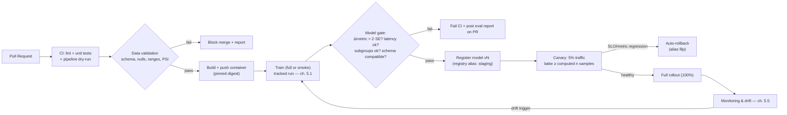
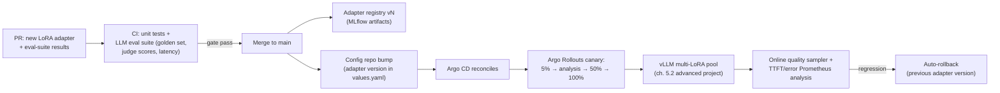

# 5.4 — CI/CD for ML

## 1. Overview

**What is it?** CI/CD for ML is the automation layer that carries a change — to code, data, or configuration — from a pull request to a safely deployed model, with quality gates at every step. It extends classical software practice with two ML-specific loops: **CT (Continuous Training)** — retraining on schedules or triggers — and **CV (Continuous Validation)** — automated evaluation of data and models as merge/deploy gates.

**Why does it exist?** Manual deploys break, and ML adds failure modes software CI never had: a model can be *silently wrong* — it compiles, serves 200s, and quietly loses 5 points of accuracy because a feature's distribution shifted or a preprocessing step diverged. Only automated data checks, evaluation gates, and staged rollouts catch that class of bug.

**What problem does it solve?** It makes iteration fast *and* safe: every change is tested (code tests, data validation, model evaluation), every artifact is reproducible (pinned data + code + environment, per [Chapter 5.1](01-experiment-tracking.md)), every deploy is gradual and reversible (canary, blue/green, shadow), and every decision is auditable.

**Where is it used?** Everywhere models ship repeatedly: Netflix's and Airbnb's recommendation pipelines retrain and redeploy continuously; Google codified the practice as "MLOps levels" and TFX; open-source teams assemble the same machine from GitHub Actions, DVC + CML, Argo, and the serving/orchestration stack of [Chapters 5.2](02-model-serving.md)–[5.3](03-docker-k8s.md).

## 2. Learning Objectives

After this chapter you will be able to:

- Define CI, CD, CT, and CV precisely and explain what ML adds to classical CI/CD.
- Design a pipeline from pull request to production: lint/tests → data validation → training → model gate → registry → canary → full rollout.
- Write data validation checks (schema, ranges, null rates, distribution drift) and explain where they run.
- Build a model quality gate that compares a candidate against production with noise-aware thresholds and non-metric checks (latency, size, fairness, backward compatibility).
- Implement a minimal DAG pipeline runner and a model gate from scratch in Python.
- Write a working GitHub Actions workflow for an ML repo, including container build and nightly training.
- Compare rollout strategies — rolling, blue/green, canary, shadow — and choose per risk profile.
- Use DVC + CML to version data and post evaluation reports on pull requests.
- Explain GitOps and where Argo CD / Argo Workflows fit an ML platform.
- Decide how much automation is appropriate — when continuous retraining is safe and when a human must stay in the loop.

## 3. Prerequisites

| Chapter | Why you need it |
|---|---|
| [Evaluation Metrics](../phase-1-classical-ml/14-evaluation-metrics.md) | Model gates are automated evaluation — thresholds on the metrics defined there. |
| [Experiment Tracking](01-experiment-tracking.md) | The registry and lineage from 5.1 are the interfaces this chapter's pipelines read and write. |
| [Model Serving](02-model-serving.md) | Canary and shadow rollouts are operations on the serving layer; SLOs define "regression". |
| [Docker & Kubernetes](03-docker-k8s.md) | Pipelines build images and apply manifests; Argo runs *on* Kubernetes. |

Continues into [5.5 — Monitoring & Drift](05-monitoring-drift.md) (production signals that *trigger* retraining) and [5.7 — LLMOps](07-llmops.md) (the same gates applied to prompts, adapters, and eval suites).

## 4. Intuition

Think of a pharmaceutical production line. A new drug formulation (your model) never goes straight from the lab bench to pharmacy shelves. It passes incoming-materials inspection (data validation), synthesis under a recorded protocol (reproducible training), potency assays against the current formulation (model gate), a limited clinical rollout with monitoring (canary), and only then general release — with a recall procedure standing by (rollback). CI/CD for ML is exactly this production line, built from software.

An everyday story: Friday afternoon, someone hand-deploys "one small fix" to the fraud model's preprocessing — just this once, no pipeline. It works in their notebook. Over the weekend, fraud losses triple: the fix changed a feature's scaling, the model saw distributions it never trained on, and nothing *errored* — the model just answered confidently and wrongly. No test failed because there were no tests; rollback took hours because nobody knew exactly what was deployed. Every mechanism in this chapter — schema tests, training/serving-skew checks, eval gates, canaries with auto-rollback, and the ban on manual deploys — exists because some team lived that weekend.

The key mental shift from classical CI: **the artifact under test is a function of code AND data.** Green unit tests prove the code; only data validation and model evaluation prove the *model*. That is why ML pipelines have two extra gates that software pipelines lack.

## 5. Real-world Motivation

- **Google** formalized the field: the "Hidden Technical Debt in ML Systems" paper, the "ML Test Score" rubric, TFX (its production ML pipeline framework), and the widely cited "MLOps: Continuous delivery and automation pipelines in ML" architecture guide describing maturity levels 0 → 2.
- **Netflix** automates model promotion for personalization: scheduled retraining, offline evaluation against the incumbent, and staged online rollout — because hundreds of models refresh too often for human-gated deploys.
- **Airbnb and Uber** built internal ML platforms (Bighead, Michelangelo) whose core value is exactly this pipeline: standardized training, validation, and deployment so teams stop hand-rolling risky deploy scripts.
- **Meta** runs continuous training for ads/feed ranking models, where model freshness measurably affects revenue — retraining cadence is a first-class production parameter.
- **Regulated industries** (credit scoring, healthcare) adopt these pipelines for auditability as much as speed: the pipeline log *is* the compliance record of what data trained what model, which gates it passed, and who approved release.

## 6. Mathematical Foundations

CI/CD is process engineering, so **no formal mathematics (derivations, proofs) is required** — the chapter's rigor lives in protocol design. The quantitative reasoning you *do* need:

**Noise-aware promotion thresholds.** A candidate beating production by 0.2% accuracy on one seed may be luck. With $n$ seeded runs per model and across-seed standard deviation $\sigma$, the standard error of each mean is $\mathrm{SE} = \sigma/\sqrt{n}$, and a gate should require roughly

$$\Delta \text{metric} > z \cdot \sqrt{\mathrm{SE}_{\text{cand}}^2 + \mathrm{SE}_{\text{prod}}^2}, \quad z \approx 2$$

before promoting — otherwise the pipeline ratchets on noise. (This is the same seed-variance arithmetic as [Chapter 5.1 §6](01-experiment-tracking.md), now used as an automated decision rule.)

**Canary sample size.** A canary receiving fraction $f$ of traffic at rate $\lambda$ req/s collects $n = f \lambda t$ observations in time $t$. Detecting a change in a proportion (e.g., error rate) from $p$ to $p + \delta$ with reasonable power needs on the order of

$$n \approx \frac{16\, p(1-p)}{\delta^2}$$

samples per arm (the standard two-sample rule of thumb for 5% significance/80% power). Example: to detect a jump from 1% to 1.5% error ($\delta = 0.005$), $n \approx 16 \cdot 0.0099 / 0.000025 \approx 6{,}300$ requests — at 5% of 100 req/s, that's ~21 minutes of canary time. This is how you compute *how long a canary must bake*, instead of guessing.

**Drift scores for data gates.** Distribution checks compare training-time and current feature distributions; a common score is the Population Stability Index over $B$ bins:

$$\mathrm{PSI} = \sum_{i=1}^{B} (a_i - e_i)\,\ln\frac{a_i}{e_i}$$

where $e_i$ and $a_i$ are the expected (reference) and actual proportions in bin $i$. Rules of thumb: PSI < 0.1 stable, 0.1–0.25 investigate, > 0.25 gate fails. (Full treatment in [Monitoring & Drift](05-monitoring-drift.md).)

**Pipeline economics.** If CI runs $k$ times/day and costs $T$ minutes, engineers wait $kT$ minutes daily; caching that cuts $T$ from 30 to 8 minutes returns hours per developer per week. DORA-style metrics (deployment frequency, lead time, change-failure rate, time-to-restore) quantify whether the pipeline is actually improving delivery.

## 7. Visual Explanation

The full lifecycle, with the two ML-specific gates highlighted:



Rollout strategies at a glance:

```
Rolling:     v1 v1 v1  ->  v2 v1 v1  ->  v2 v2 v1  ->  v2 v2 v2   (gradual replace)
Blue/green:  [blue: v1 100%] [green: v2 0%]  --flip-->  [green: v2 100%]  (instant, instant rollback)
Canary:      v1 95% + v2 5%  ->  v2 25%  ->  v2 100%   (measure at each step)
Shadow:      v1 100% (real)  +  v2 gets mirrored copies, responses discarded (zero user risk)
```

## 8. Algorithm

The reference pipeline, as executable policy:

1. **On every pull request:** lint + static checks; unit tests (including tests of feature transforms and metric code); data validation on a sample; pipeline dry-run (train 1% for one epoch — catches wiring bugs in minutes, not hours).
2. **On merge to `main`:** build the training/serving container, push with an immutable tag; run integration tests against the built image.
3. **On schedule or trigger (CT):** run full training as a tracked run (params, data hash, commit — [Chapter 5.1](01-experiment-tracking.md)); evaluate on a held-out set *never used for tuning*.
4. **Model gate (CV):** compare candidate vs. current production on the same frozen eval set: primary metric with noise-aware threshold; per-subgroup metrics; p95 latency and model size budgets; output-schema backward compatibility.
5. **On gate pass:** register model version; set registry alias `staging`; deploy to the staging environment; run smoke + contract tests.
6. **Progressive rollout:** canary 5% → bake for the computed sample size → 25% → 100%; auto-rollback on SLO burn or metric regression at any step.
7. **Post-deploy:** monitoring compares online metrics to the canary baseline; drift alerts can trigger step 3 — closing the loop.

Pseudocode for the heart of it — the model gate:

```text
procedure MODEL_GATE(candidate, production, eval_set, config):
    m_c ← evaluate(candidate, eval_set)         # dict of metrics, per subgroup too
    m_p ← evaluate(production, eval_set)
    checks ← []
    checks += [m_c.primary - m_p.primary > config.z * pooled_SE]      # real improvement
    checks += [m_c.subgroup[g] ≥ m_p.subgroup[g] - config.tol  ∀g]    # no group regresses
    checks += [latency_p95(candidate) ≤ config.latency_budget]
    checks += [size(candidate) ≤ config.size_budget]
    checks += [output_schema(candidate) ⊇ output_schema(production)]  # backward compatible
    if all(checks): promote(candidate)  else: fail_with_report(checks)
```

## 9. Worked Example

**Tiny example by hand — should the gate promote?** Production model: accuracy 0.912 (5 seeds, σ = 0.004). Candidate: 0.918 (5 seeds, σ = 0.005). Pooled SE $= \sqrt{0.004^2/5 + 0.005^2/5} = \sqrt{3.2\times10^{-6} + 5\times10^{-6}} \approx 0.0029$. Required margin at $z=2$: 0.0057. Observed Δ = 0.006 > 0.0057 → **metric check passes** (barely — a single-seed comparison would have been meaningless). Latency: candidate p95 = 41 ms vs. 50 ms budget → pass. Subgroups: accuracy on the "new users" slice drops 0.941 → 0.921 with tolerance 0.01 → **fail**. The gate blocks promotion and posts the subgroup table on the PR. This is the correct outcome: aggregate wins, one segment regresses — precisely the failure a human eyeballing one number would miss.

**Canary math continued:** suppose the gate had passed and we canary at 5% of 200 req/s, watching error rate p ≈ 2%. To detect a 1-point jump ($\delta = 0.01$): $n \approx 16 \cdot 0.0196 / 0.0001 \approx 3{,}136$ per arm → at 10 req/s canary traffic, bake ≥ ~5.2 minutes before advancing; for a subtler 0.3-point jump, ~35,000 samples → ~58 minutes. Bake times are computed, not vibes.

**Realistic example.** A churn-model repo: PRs run lint, pytest (feature transforms have unit tests with hand-computed expectations), Great Expectations on a 10k-row data sample, and a 2-minute smoke train. Merges build the image and launch full training on Argo Workflows; the gate compares against production on last quarter's frozen eval set plus a fresh holdout; CML posts the metric diff and calibration plots to the PR. Promotion flips the MLflow alias; Argo Rollouts canaries the new serving pods 5% → 50% → 100% over an hour with automatic rollback wired to the error-rate and latency analysis. Weekend hand-deploys are impossible: the serving account only trusts the registry alias, and only the pipeline can flip it.

## 10. Python from Scratch

Two core mechanisms, minimally: a **DAG pipeline runner** (what Actions/Argo fundamentally are) and the **model gate** (the decision rule from Sections 8–9). Standard library only.

```python
import math
from graphlib import TopologicalSorter   # stdlib topological sort (Python 3.9+)

# ---------- 1) A tiny CI pipeline runner ----------
class Pipeline:
    """Steps + dependencies = DAG. Run in topological order; stop on failure.
    This is the essential semantics of GitHub Actions 'needs:' / Argo DAGs."""

    def __init__(self):
        self.steps, self.deps = {}, {}

    def step(self, name, fn, needs=()):
        self.steps[name] = fn
        self.deps[name] = set(needs)          # edges: run `needs` before `name`

    def run(self):
        order = list(TopologicalSorter(self.deps).static_order())  # respects deps
        results = {}
        for name in order:
            try:
                results[name] = self.steps[name](results)          # pass upstream outputs
                print(f"  [ok]   {name}")
            except Exception as e:
                print(f"  [FAIL] {name}: {e}")
                return {"status": "failed", "at": name, "results": results}
        return {"status": "passed", "results": results}

# ---------- 2) Data validation + model gate as steps ----------
def validate_data(_):
    rows = [{"age": 34, "income": 72_000}, {"age": 29, "income": 58_000},
            {"age": -3, "income": 61_000}]                 # one corrupt row
    bad = [r for r in rows if not (0 <= r["age"] <= 120) or r["income"] < 0]
    if len(bad) / len(rows) > 0.005:                       # >0.5% invalid -> hard fail
        raise ValueError(f"{len(bad)} rows violate schema: {bad}")
    return {"n_rows": len(rows)}

def train(_):
    # Stand-in for real training: return per-seed eval metrics for the candidate.
    return {"acc_seeds": [0.917, 0.919, 0.921, 0.916, 0.917], "latency_p95_ms": 41}

def model_gate(results):
    cand = results["train"]["acc_seeds"]
    prod = [0.910, 0.914, 0.912, 0.909, 0.915]             # production's seeded evals
    mean = lambda xs: sum(xs) / len(xs)
    se = lambda xs: (sum((x - mean(xs))**2 for x in xs) / (len(xs)-1))**0.5 / math.sqrt(len(xs))
    delta = mean(cand) - mean(prod)
    margin = 2 * math.sqrt(se(cand)**2 + se(prod)**2)      # z=2 noise-aware threshold
    checks = {
        "metric_improves": delta > margin,                  # Section 6 rule
        "latency_budget":  results["train"]["latency_p95_ms"] <= 50,
    }
    print(f"    Δ={delta:.4f}, required margin={margin:.4f}, checks={checks}")
    if not all(checks.values()):
        raise AssertionError(f"gate failed: {checks}")
    return {"promote": True}

p = Pipeline()
p.step("lint",          lambda _: True)
p.step("unit_tests",    lambda _: True,            needs=["lint"])
p.step("validate_data", validate_data,             needs=["lint"])
p.step("train",         train,                     needs=["unit_tests", "validate_data"])
p.step("model_gate",    model_gate,                needs=["train"])
p.step("deploy_canary", lambda r: "5% traffic",    needs=["model_gate"])
print(p.run()["status"])
# Expected output:
#   [ok] lint  [ok] unit_tests
#   [FAIL] validate_data: 1 rows violate schema: [{'age': -3, ...}]
#   failed
# Fix the bad row (or the sensor producing it) and rerun: data gate passes,
# gate prints Δ≈0.0060 vs margin≈0.0035 -> promote, canary step runs -> 'passed'.
```

Complexity: topological sort is $O(V + E)$ over steps and dependencies; each step costs whatever it costs (training dominates — which is why real runners cache and parallelize independent branches). **Common bug:** declaring steps without dependencies ("it happened to run in order on my machine") — the DAG then legally reorders them, and `train` runs before `validate_data`. Always encode ordering as explicit edges, exactly as you must with `needs:` in GitHub Actions.

## 11. Library Implementation

**GitHub Actions** — a real ML workflow (`.github/workflows/ml.yml`):

```yaml
name: ml-pipeline
on:
  pull_request:                       # CI gates on every PR
  push: { branches: [main] }          # build + integration on merge
  schedule: [{ cron: "0 3 * * *" }]   # CT: nightly training at 03:00 UTC

jobs:
  ci:
    runs-on: ubuntu-latest
    steps:
      - uses: actions/checkout@v4
      - uses: actions/setup-python@v5
        with: { python-version: "3.11", cache: pip }   # dependency cache: minutes saved
      - run: pip install -r requirements.txt
      - run: ruff check . && pytest tests/ -q          # lint + unit tests
      - run: python -m checks.validate_data --sample data/sample.csv   # data gate
      - run: python train.py --smoke                    # 1% data, 1 epoch: wiring test

  build:
    needs: ci                                           # explicit DAG edge
    if: github.event_name == 'push'
    runs-on: ubuntu-latest
    permissions: { packages: write }
    steps:
      - uses: actions/checkout@v4
      - uses: docker/build-push-action@v6
        with:
          push: true
          tags: ghcr.io/${{ github.repository }}:${{ github.sha }}   # immutable tag
          cache-from: type=gha                          # Docker layer cache (ch. 5.3)
          cache-to: type=gha,mode=max

  train-and-gate:
    needs: build
    if: github.event_name == 'schedule' || github.event_name == 'push'
    runs-on: [self-hosted, gpu]                         # GPU runner for real training
    steps:
      - uses: actions/checkout@v4
      - run: dvc pull                                    # fetch exact data version
      - run: python train.py --full                      # tracked run (MLflow, ch. 5.1)
      - run: python gate.py --candidate latest --against production
        # gate.py exits nonzero on failure -> job fails -> no promotion
      - run: python promote.py --alias staging           # registry alias flip on pass
```

**DVC + CML** — data-versioned pipelines with PR reports. `dvc.yaml` declares the DAG; DVC skips stages whose inputs (by hash) are unchanged:

```yaml
stages:
  prepare:
    cmd: python prepare.py
    deps: [data/raw.csv, prepare.py]     # content-hashed inputs
    outs: [data/clean.parquet]
  train:
    cmd: python train.py
    deps: [data/clean.parquet, train.py]
    outs: [models/model.pkl]
    metrics: [metrics.json]              # tracked, diffable metrics
```

```yaml
# in a workflow job: CML posts the evaluation as a PR comment
- run: dvc repro                          # rerun only changed stages
- run: |
    echo "## Model report" > report.md
    dvc metrics diff main --md >> report.md   # metric table: PR branch vs main
    cml comment create report.md              # visible review artifact on the PR
```

**Argo** on Kubernetes — the production-grade pair: **Argo Workflows** runs training DAGs as pods (each step a container, GPU steps on GPU nodes per [Chapter 5.3](03-docker-k8s.md)); **Argo CD** implements GitOps — it watches a config repo and reconciles the cluster to it, so "deploy" = merge a manifest change, and rollback = `git revert`. **Argo Rollouts** executes the canary:

```yaml
apiVersion: argoproj.io/v1alpha1
kind: Rollout
spec:
  strategy:
    canary:
      steps:
        - setWeight: 5                    # 5% traffic to the new version
        - pause: { duration: 10m }        # bake time from Section 6 sample-size math
        - analysis:                        # automated judgment, not a human watching graphs
            templates: [{ templateName: error-rate-and-p95 }]   # Prometheus queries
        - setWeight: 50
        - pause: { duration: 10m }
      # any failed analysis -> automatic rollback to the stable ReplicaSet
```

Data-validation libraries slot into the `validate_data` step: **Great Expectations / Pandera** for schema and constraints, **Evidently / whylogs** for distribution drift (PSI and friends).

## 12. Code Walkthrough

Tracing one change through the Section 11 workflow:

| Stage | Input | Output | Expected result |
|---|---|---|---|
| `ci` (PR) | branch code + `data/sample.csv` | pass/fail status on the PR | red X blocks merge; smoke train catches wiring bugs in ~2 min |
| `build` | merged `main` @ SHA `abc123` | `ghcr.io/org/repo:abc123` | immutable image; layer cache makes it ~1 min for code-only changes |
| `dvc pull` | `.dvc` pointers in git | exact training data by content hash | data version pinned to the commit — full lineage |
| `train.py --full` | image + data + config | tracked run + candidate model | MLflow run with params/metrics/artifacts (ch. 5.1) |
| `gate.py` | candidate + production + frozen eval set | exit code + report | Δ vs. 2·SE margin, latency, subgroups — as computed by hand in Section 9 |
| `promote.py` | gate pass | registry alias `staging` → candidate | serving in staging picks it up without redeploy |
| Rollout | new alias in prod config repo | 5% → 50% → 100% traffic | auto-rollback if the Prometheus analysis fails |

Intermediate values worth logging: the data hash actually pulled, the eval-set hash (gates on a *changed* eval set are meaningless comparisons), the exact per-check gate booleans (so a failed PR shows *which* check failed), and the canary's live sample counts against the required $n$ from Section 6.

## 13. Complexity Analysis

- **Pipeline latency:** the critical path is $\sum$ of sequential stage times; parallelize independent branches (lint ∥ data validation) and cache aggressively (pip cache, Docker layer cache, DVC stage skipping). Typical: PR CI 3–10 min; full train hours; canary bake minutes–hours (computed, per Section 6). A smoke train turns "the pipeline is wired wrong" from an hours-scale discovery into a minutes-scale one.
- **Compute cost:** CI compute scales with PR volume × pipeline cost; GPU training on every merge is usually wasteful — gate full CT behind schedules, data-change triggers, or labels. Spot instances suit retraining (interruptible) but not deploy jobs.
- **Storage:** every pipeline run emits images, data versions, models, reports. Growth is $O(\text{runs})$ without retention policies — keep gate reports and promoted artifacts indefinitely (audit), expire the rest (as in [Chapter 5.1 §17](01-experiment-tracking.md)).
- **Statistical cost of gates:** tighter thresholds need more seeds/samples: margin $\propto 1/\sqrt{n}$, so halving the detectable regression quadruples required evaluation volume — for canaries, $n \propto 1/\delta^2$ exactly as computed in Section 9.

## 14. Advantages

- **Silent regressions become loud:** the Section 9 gate caught a subgroup regression an aggregate metric hid — the exact class of bug that costs real money in production.
- **Speed with safety:** teams deploy models weekly or daily instead of quarterly because every deploy is small, tested, and reversible; DORA metrics (frequency up, change-failure rate down) quantify it.
- **Reproducibility by construction:** pinned code + DVC-pinned data + digest-pinned images mean any past deployment can be rebuilt — also the audit trail regulators ask for.
- **Fast, boring rollback:** alias flip + `git revert` + Argo Rollouts' automatic abort → minutes to restore, no archaeology. Compare the Friday-deploy story in Section 4.
- **Institutional memory:** the pipeline encodes the team's quality bar; a new hire's first PR gets the same scrutiny as a principal engineer's, automatically.

## 15. Disadvantages

- **Setup and maintenance cost:** the full machine (CI, data checks, gates, GitOps, progressive delivery) is weeks of platform work and an ongoing ownership burden — over-engineering for a team shipping one model a quarter.
- **Gates are only as good as their eval sets:** a stale or unrepresentative frozen eval set passes bad models and fails good ones. Failure case: the eval set predates a product change; the gate keeps rejecting candidates that are actually better on current traffic.
- **Goodhart risk:** optimizing to pass the gate ≠ improving the product; teams can (even unintentionally) overfit to the gate's eval set — rotate/refresh holdouts.
- **Automation can amplify bad data:** fully automated CT retrains on poisoned or drifted data and confidently deploys the result; the feedback loop that makes good changes fast makes bad ones fast too. High-stakes domains keep a human approval on the final promotion.
- **Flaky pipelines erode trust:** nondeterministic tests and noisy gates train engineers to click "rerun" until green — worse than no gate, because it *looks* like rigor.

## 16. Common Mistakes

- **No tests on data, only on code.** The most common ML outage is a data change with green CI. *Fix:* schema + distribution checks as first-class pipeline steps that can block.
- **Gating on the training/tuning data.** The candidate has effectively seen it; the comparison leaks. *Fix:* a frozen, versioned holdout never touched by tuning; refresh it on a schedule, versioned like code.
- **Single-run comparisons.** Promoting on a 0.2% single-seed gain ratchets on noise. *Fix:* the 2·SE rule (Sections 6, 9, 10).
- **"Just this once" manual deploys.** Every incident postmortem features one. *Fix:* make the pipeline the only path — serving trusts only the registry alias, and only the pipeline's service account can flip it.
- **No rollback rehearsal.** A rollback procedure that has never run is a hypothesis, not a procedure. *Fix:* game-day drills; measure time-to-restore.
- **Canary without enough samples.** Advancing after 5 quiet minutes at 1 req/s proves nothing (Section 9's math: thousands of samples for percent-level effects). *Fix:* compute bake time from $n \approx 16p(1-p)/\delta^2$.
- **Secrets in workflow files or logs.** *Fix:* CI secret stores, OIDC-based cloud auth (no long-lived keys), and secret masking; never `echo $TOKEN`.

## 17. Best Practices

A maturity checklist (roughly Google's MLOps levels 0 → 2):

- [ ] **Level 0 exit:** all deploys via pipeline; unit tests on feature transforms and metric code; immutable image tags.
- [ ] Data validation (schema + drift) blocking both training and serving paths — the same checks catch training/serving skew.
- [ ] Smoke train on every PR (tiny data, one epoch) — cheapest high-value ML test that exists.
- [ ] Frozen, versioned eval sets; gate reports posted on PRs (CML) so reviewers see metrics, not vibes.
- [ ] Noise-aware gates: multi-seed evals, 2·SE thresholds, subgroup and latency/size checks, output-schema compatibility.
- [ ] Progressive delivery with automated analysis and rollback (Argo Rollouts / feature flags); computed bake times.
- [ ] GitOps: environment state lives in git; humans merge, controllers deploy; `git log` is the deploy audit.
- [ ] CT triggers: schedule + drift alert + data-volume threshold; human approval retained where errors are costly.
- [ ] Track DORA metrics for the ML pipeline itself; treat pipeline flakiness as a P1 bug.

> [!WARNING]
> The gate's eval set is part of your product's safety system. Version it, restrict write access, refresh it deliberately, and alert if a pipeline ever trains on it.

## 18. Optimization Techniques

- **Caching everywhere:** pip/conda caches, Docker layer caches (`cache-from: type=gha`), DVC stage skipping (hash-unchanged inputs), pretrained-checkpoint reuse for fine-tuning instead of from-scratch retrains.
- **Selective execution:** path filters (docs-only PRs skip training), test-impact analysis, `--smoke` modes; run the expensive matrix nightly, not per-PR.
- **Parallelism:** matrix builds across Python/CUDA versions; parallel independent DAG branches; sharded test suites.
- **Cheap compute for cheap jobs:** spot/preemptible instances for retraining and evaluation (checkpoint-resume makes interruption safe); reserved capacity only for deploy-critical jobs.
- **Incremental training:** warm-start from the production checkpoint on fresh data when the architecture is unchanged — often 10× cheaper than full retrains, gated identically.
- **Fast rollback paths:** keep the previous model warm (blue/green) so rollback is a router flip, not a redeploy; pre-pull images per [Chapter 5.3 §18](03-docker-k8s.md).
- **Pipeline observability:** duration and failure-rate dashboards per stage; the pipeline is a production system — profile and optimize its own p95.

## 19. Industry Applications

- **Google:** TFX pipelines with TensorFlow Data Validation and Model Analysis as the canonical CT/CV reference; the "MLOps levels" guide is the industry's shared vocabulary for pipeline maturity.
- **Netflix:** scheduled retraining and automated promotion for personalization models via its Metaflow-based platform; staged online rollouts with metric guardrails.
- **Uber (Michelangelo) and Airbnb (Bighead):** internal platforms whose documented purpose is standardized train-validate-deploy pipelines replacing per-team deploy scripts.
- **Meta:** continuous training for ranking/ads models where model freshness is a revenue parameter; heavy investment in automated validation before fleet-wide rollout.
- **Open-source stacks at startups:** GitHub Actions + DVC/CML + MLflow + Argo (Workflows/CD/Rollouts) + Evidently — the exact stack assembled in this chapter's projects — is the de facto small-team production pattern.
- **Regulated ML (banks, healthtech):** pipelines double as compliance systems — SR 11-7-style model-risk governance maps directly onto gates, lineage, and approval steps.

## 20. Interview Questions

### Beginner

- **Q: Define CI, CD, CT, and CV.**
  A: CI: automatically build and test every change. CD: automatically deliver/deploy green builds to environments. CT (ML-specific): retrain models automatically on schedules or triggers. CV (ML-specific): automatically validate data and evaluate models as gates before promotion.
- **Q: What does ML CI/CD test that classical CI/CD doesn't?**
  A: The data (schema, ranges, distributions) and the model's behavior (metrics vs. incumbent, subgroups, latency) — because a model can be silently wrong with all code tests green.
- **Q: Why is a pipeline better than a careful engineer deploying manually?**
  A: Consistency (no skipped steps at 6 pm Friday), speed, auditability, and enforced gates; humans are excellent at judgment and terrible at repetitive checklists.
- **Q: What is a smoke training run and why put it in PR CI?**
  A: Training on ~1% of data for one epoch to verify the pipeline wiring (data loading, shapes, loss decreasing, checkpointing) in minutes — it catches most integration bugs at a tiny fraction of full-training cost.
- **Q: Blue/green vs. canary?**
  A: Blue/green runs two full environments and flips all traffic at once (instant cutover/rollback, 2× capacity cost, no gradual evidence). Canary shifts a small, growing fraction while comparing metrics (statistical evidence, slower, needs traffic splitting).

### Intermediate

- **Q: Design a model promotion gate. What beyond the primary metric?**
  A: Noise-aware primary-metric threshold (multi-seed, ~2·SE margin); per-subgroup non-regression; latency/throughput and model-size budgets; output-schema backward compatibility; calibration; and a fresh holdout that tuning never touched.
- **Q: Your canary gets 5% of 100 req/s. How long to detect an error-rate jump from 1% to 2%?**
  A: $n \approx 16 \cdot 0.01 \cdot 0.99 / 0.01^2 \approx 1{,}600$ samples per arm → at 5 req/s canary traffic, ≥ ~5–6 minutes of bake; subtler regressions scale as $1/\delta^2$.
- **Q: What is training/serving skew and how does CI/CD prevent it?**
  A: Divergence between training-time and serving-time feature computation. Prevent by sharing one transform codebase (packaged with the model), running the same data validation on both paths, and contract tests asserting train-time and serve-time features match on sampled inputs.
- **Q: What is GitOps and its benefit for ML deploys?**
  A: Cluster/config state lives in git; a controller (Argo CD) continuously reconciles reality to it. Deploys become merges, rollbacks become reverts, drift is auto-corrected, and the git log is the audit trail — pairing naturally with a model registry alias as "the deployed model" pointer.
- **Q: Shadow deployment — when is it worth it, and what are the traps?**
  A: Worth it for risky changes needing production-distribution evidence without user risk (new architecture, new features). Traps: doubled inference cost; side effects (writes, quota consumption) must be suppressed; no user-feedback signal (you see outputs, not outcomes).
- **Q: When should retraining be fully automated vs. human-approved?**
  A: Automate when regressions are cheap, quickly detectable, and reversible (ranking freshness). Keep humans when errors are costly/irreversible or gates can't capture the risk (credit, medical) — automate everything up to the final promotion click.

### Advanced

- **Q: A model passes the offline gate but degrades in the canary. Give causes and pipeline fixes.**
  A: Stale/unrepresentative eval set (refresh + drift-check the eval set itself); training/serving skew (contract tests); latency-induced behavior change (timeouts truncating outputs — include serving-stack latency in the gate); feedback loops absent offline (position bias in ranking — add off-policy/interleaving evaluation); or plain canary noise (check the sample-size math before trusting the "regression").
- **Q: Design CI/CD for an LLM application (prompts + RAG + fine-tuned adapters).**
  A: Version prompts/adapters/index configs like code; CI runs an eval suite (golden sets + LLM-as-judge with human-calibrated rubrics) with noise-aware thresholds; regression-test retrieval (recall@k on a labeled query set); canary with online quality sampling; pin base-model versions — an upstream model change is a dependency update requiring the full gate (expanded in [LLMOps](07-llmops.md)).
- **Q: How do you make a *statistically honest* gate when training a candidate costs $50k and you can't run 5 seeds?**
  A: Reduce eval variance instead of training variance: bootstrap CIs over a large eval set for per-model uncertainty; paired comparisons on identical examples (much tighter than unpaired); sequential testing on the canary to reuse online evidence; and widen the required margin to reflect single-run training-seed variance measured historically.
- **Q: Automated retraining silently degraded quality over months — no single deploy failed its gate. What happened and what do you add?**
  A: Ratchet drift: each promotion beat its immediate predecessor within noise, but the eval set aged and small regressions compounded (or the gate's holdout leaked into training via reuse). Add: anchored comparisons against a fixed golden baseline (not just the incumbent), periodic human review of sampled outputs, eval-set refresh with overlap analysis, and long-window online metric monitoring with alerts on cumulative trend ([Monitoring & Drift](05-monitoring-drift.md)).
- **Q: How would you roll out a model whose *output schema* changes (new class added)?**
  A: Treat it as an API migration: dual-write/expand-contract — deploy consumers tolerant of the new class first (contract tests enforce this), then the model behind a flag, shadow-validate the new outputs, canary, and only then remove old-schema handling. The gate must include a consumer-compatibility check, not just metrics.

## 21. Coding Exercises

### Easy

1. Add GitHub Actions to any ML repo: `ruff` + `pytest` on every PR, with pip caching. Verify a deliberately broken test blocks the merge. *Hint:* branch protection rules make the check required.
2. Write three data validation checks (age range, null-rate < 1%, income non-negative) with Pandera or plain pandas, and wire them as a CI step that exits nonzero on violation. *Hint:* `sys.exit(1)` is the whole gate protocol.
3. Extend the Section 10 `Pipeline` with parallel-group detection: print which steps *could* run concurrently at each stage. *Hint:* `TopologicalSorter.get_ready()` yields ready sets.

### Medium

1. Build `gate.py`: load candidate + production metrics (multi-seed JSON), apply the 2·SE rule plus a latency budget, exit nonzero with a Markdown report of every check. Wire it into Actions. *Hint:* reuse the Section 10 SE code; write the report to `$GITHUB_STEP_SUMMARY`.
2. Set up DVC in a repo: version a dataset, define a two-stage `dvc.yaml` (prepare → train), and demonstrate that `dvc repro` skips unchanged stages after a code-comment-only edit. *Hint:* compare hashes with `dvc status`.
3. Nightly CT: a scheduled workflow that pulls data with DVC, trains, evaluates against a frozen holdout, and posts a CML metric-diff comment on a tracking issue. Make it fail loudly on regression. *Hint:* `cml comment create` also works on issues.

### Hard

1. Simulate a canary controller: a script that splits a stream of synthetic requests 95/5 between "prod" and "candidate" error-rate generators, applies the Section 6 sample-size rule, and decides promote/rollback with computed bake times. Run 1,000 simulations to measure its false-promotion rate. *Hint:* vary true δ from 0 to 0.02.
2. End-to-end GitOps rollout on kind: Argo CD watching a config repo + Argo Rollouts canary for the [Chapter 5.3](03-docker-k8s.md) sentiment service; demonstrate auto-rollback by deploying an image whose error rate trips the analysis. *Hint:* a Prometheus AnalysisTemplate on the error-rate metric.
3. Build a training/serving-skew contract test: sample 100 rows, run them through the training featurizer and the serving featurizer (packaged model), and assert elementwise equality — then introduce a skew bug and confirm CI catches it. *Hint:* serialize the featurizer with the model artifact (ch. 5.1).

## 22. Mini Project

**CI for a scikit-learn project.**

1. Repo: Titanic-style dataset (DVC-versioned), `prepare.py`, `train.py`, `evaluate.py`, tests for the feature transforms.
2. PR workflow: lint + pytest + data validation (three checks from Easy-2) + smoke train on 200 rows.
3. Merge workflow: full train, evaluate on a frozen holdout committed as `eval/holdout.csv.dvc`, write `metrics.json`.
4. Add `gate.py` comparing against the last promoted `metrics.json` with the 2·SE rule (store per-seed results; use 3 seeds).
5. On gate pass, "promote": copy the model to `models/production/` and tag the commit.
6. Post the metric diff on the PR with CML.
7. Deliverable: a PR that improves the model and passes, and a second PR that secretly degrades a subgroup and is correctly blocked.

## 23. Medium Project

**Training-to-serving pipeline with Argo Workflows on Kubernetes.**

1. Reuse the kind cluster from [Chapter 5.3](03-docker-k8s.md); install Argo Workflows.
2. Define a `WorkflowTemplate` DAG: validate-data → train → evaluate → gate → register (MLflow from [Chapter 5.1](01-experiment-tracking.md)'s medium project), each step its own container.
3. Trigger it three ways: manually, on a cron schedule, and from a GitHub Actions job on merge (CI hands off to in-cluster CT).
4. Store artifacts in MinIO; pass the data hash and run ID between steps as workflow parameters — full lineage.
5. Add a deliberate failure path: corrupt the data, verify the validate step fails the workflow and nothing downstream runs.
6. On gate pass, flip the MLflow alias and restart the serving Deployment to pick it up; verify with a request.
7. Deliverable: workflow YAML + a run-history screenshot showing one green and one correctly-failed run.

## 24. Advanced Project

**GitOps LLM adapter delivery with automated canary.**

Architecture:



Implementation phases:

1. **Eval-suite CI:** a golden prompt set with reference answers; automatic scoring (exact-match where possible, rubric-based LLM-judge elsewhere with a pinned judge model); noise-aware thresholds (multiple decode seeds); latency and token-cost budgets. Every adapter PR must attach passing results.
2. **Registry + GitOps wiring:** adapters versioned as registry artifacts; the *deployed* version is a line in a config repo; Argo CD owns the cluster — no human `kubectl`.
3. **Progressive delivery:** Argo Rollouts canary against the multi-LoRA vLLM pool ([Chapter 5.2](02-model-serving.md)); AnalysisTemplates on TTFT p95, error rate, and a sampled online-quality score; bake times computed from traffic volume (Section 6).
4. **Continuous evaluation loop:** nightly job replays sampled production prompts through both current and previous adapters, trends the quality delta, and files a drift alert that can trigger re-tuning — closing the loop into [Monitoring & Drift](05-monitoring-drift.md) and [LLMOps](07-llmops.md).

Possible improvements: paired statistical tests on identical prompts for tighter gates; per-tenant canaries; automatic eval-set refresh with leakage checks; cost-regression gates (tokens per request) alongside quality.

## 25. Summary

- ML CI/CD = classical CI/CD + two new gates (data validation, model evaluation) + two new loops (CT retraining, CV validation) — because the artifact under test is a function of code *and* data.
- Models fail *silently*: green builds and 200 responses prove nothing about prediction quality. Only data checks, eval gates, and measured rollouts catch that class of failure.
- The reference pipeline: PR (lint, tests, data checks, smoke train) → merge (build immutable image) → CT (tracked full training) → gate (2·SE metric margin, subgroups, latency, schema) → registry alias → canary with computed bake time → full rollout → monitoring that can re-trigger training.
- The light math earns its keep: promotion margins from seed variance ($\Delta > 2\sqrt{SE_c^2+SE_p^2}$), canary bake times from $n \approx 16p(1-p)/\delta^2$, drift gates from PSI.
- A pipeline is a DAG with failure semantics — the 60-line Section 10 runner is the essential mechanism behind Actions and Argo; explicit dependency edges are not optional.
- Rollouts by risk: rolling for routine, blue/green for instant reversibility, canary for statistical evidence, shadow for zero-user-risk validation.
- GitOps makes deploys merges and rollbacks reverts; the registry alias is the single pointer serving trusts, and only the pipeline may flip it.
- Gates are only as good as their eval sets: freeze, version, protect, and deliberately refresh them; beware ratchet drift against a moving incumbent.
- Match automation to stakes: full CT for cheap-to-reverse models, human-approved promotion where errors are expensive — automate everything *up to* the decision either way.

## 26. Cheat Sheet

| Rule | Formula / value |
|---|---|
| Promotion margin | $\Delta > 2\sqrt{SE_{cand}^2 + SE_{prod}^2}$, $SE = \sigma/\sqrt{n_{seeds}}$ |
| Canary sample size | $n \approx 16\,p(1-p)/\delta^2$ per arm; bake time $= n / (f\lambda)$ |
| PSI thresholds | < 0.1 ok · 0.1–0.25 investigate · > 0.25 fail |
| Rollout ladder | shadow (0% risk) → canary 5% → 50% → 100%; blue/green for instant flip |

Stack map: GitHub Actions/GitLab CI (CI + triggers) · DVC (data versions + stage caching) + CML (PR reports) · Great Expectations/Pandera (schema) · Evidently/whylogs (drift) · MLflow registry (promotion pointer) · Argo Workflows (training DAGs) · Argo CD (GitOps) · Argo Rollouts (canary + auto-rollback).

One-liners: smoke-train every PR; gate on a frozen holdout tuning never saw; multi-seed or paired evals, never single-run promotion; compute canary bake time, don't guess; serving trusts only the registry alias; rehearse rollback before you need it.

Gotchas: data tests missing entirely; gate evaluated on training/tuning data; eval-set ratchet drift; flaky pipelines trained to "rerun until green"; canaries advanced on too few samples; secrets echoed into CI logs; automated CT amplifying poisoned data.

## 27. Further Reading

- **Books:** *Designing Machine Learning Systems* (Chip Huyen) — deployment, CT, and infrastructure chapters; *Reliable Machine Learning* (Chen, Murphy et al., O'Reilly); *Accelerate* (Forsgren, Humble, Kim) — the DORA evidence base; *Continuous Delivery* (Humble & Farley) — the classical foundation.
- **Research papers:** "Hidden Technical Debt in Machine Learning Systems" (Sculley et al., NeurIPS 2015); "The ML Test Score: A Rubric for ML Production Readiness" (Breck et al., IEEE Big Data 2017); "TFX: A TensorFlow-Based Production-Scale Machine Learning Platform" (Baylor et al., KDD 2017); "Data Validation for Machine Learning" (Breck et al., MLSys 2019).
- **Documentation:** Google Cloud — "MLOps: Continuous delivery and automation pipelines in machine learning"; GitHub Actions docs; DVC and CML docs (dvc.org, cml.dev); Argo Workflows / Argo CD / Argo Rollouts docs; Great Expectations and Evidently docs.
- **GitHub repositories:** `iterative/dvc`, `iterative/cml`, `argoproj/argo-workflows`, `argoproj/argo-cd`, `argoproj/argo-rollouts`, `great-expectations/great_expectations`, `evidentlyai/evidently`, `zenml-io/zenml`.
- **Datasets:** Titanic / Adult-Income (small, schema-rich — ideal for data-validation exercises); any Kaggle tabular competition for the mini project.
- **YouTube/Videos:** Full Stack Deep Learning — deployment and CI/CD lectures; ArgoCon and KubeCon MLOps-track talks; DVC/Iterative's "MLOps with CML" tutorials.
- **Blogs:** Google Cloud Architecture Center MLOps guides; Netflix Tech Blog (Metaflow, model deployment); Uber Engineering (Michelangelo); Chip Huyen's posts on ML deployment and continual learning; Martin Fowler's site on CD and deployment patterns.
