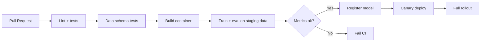

# 5.4 — CI/CD for ML

## 1. Intuition first
Every code change should be tested, built, and deployed automatically. For ML, add: reproducible data + model training, offline evals, and safe rollouts.

## 2. Why the topic exists
Manual deploys break. ML introduces extra failure modes (data drift, silent regressions). CI/CD codifies quality gates.

## 3. What problem it solves
Fast, safe, reproducible iteration from code / data changes to production.

## 4. Concepts
- **CI**: build + unit tests + static checks on every push.
- **CD**: automated deploy to staging/prod on green builds.
- **CT (Continuous Training)**: retrain on new data via schedule / trigger.
- **CV (Continuous Validation)**: offline evals as CI gates.
- **Data validation**: schema (Great Expectations), distribution (Whylogs / Evidently).
- **Model validation**: metric thresholds, subgroup fairness, backward compatibility.
- **Rollout strategies**: blue/green, canary, shadow, feature flags.

## 5. Every "formula"
None — process discipline.

## 6. Variables
Environments (dev/stg/prod), branch protection rules, promotion gates.

## 7. Algorithm — typical pipeline
1. PR → lint, unit tests, data schema tests → build container.
2. On merge to `main` → integration tests + training smoke test.
3. Nightly (or triggered) → full training + eval + register model.
4. Model validation gate → promote to staging.
5. Canary in prod → auto-rollback if metrics degrade.
6. Post-deploy monitoring → alerts on drift / SLO violation.

## 8. Simple example
GitHub Actions job that runs `pytest`, builds Docker image, pushes to registry, deploys to Kubernetes.

## 9. Real-world example
- Feature-flagged model rollouts at Airbnb.
- Netflix's automated model promotion.
- HuggingFace's Trainer + CI examples.

## 10. Diagram

## 11. Implementation from scratch
Not applicable.

## 12. Implementation using tools
- **GitHub Actions**, **GitLab CI**, **CircleCI**, **Buildkite**.
- **Argo CD / Argo Workflows** for GitOps + ML pipelines.
- **Flyte / Kubeflow / Prefect / Dagster / Airflow** for orchestration.
- **DVC + CML** for data / model versioning + ML CI reports.
- **Great Expectations / Whylogs / Evidently** for data & drift checks.

## 13. Time complexity
Pipelines can take minutes → days (training). Optimize by caching + selective runs.

## 14. Space complexity
Artifact stores fill quickly — retention policies needed.

## 15. Advantages
Confidence in every release; fast rollback; auditability.

## 16. Disadvantages
Setup cost; needs discipline.

## 17. Interview questions
1. Difference between CI, CD, CT, CV.
2. Rollout strategies compared.
3. How to enforce model quality gates?
4. Data validation approaches.
5. Backward compatibility of model outputs.
6. Feature flagging models.
7. How to rollback a broken model quickly.
8. Shadow traffic — pros / cons.
9. GitOps for ML.
10. Trade-off between fully automated retraining and human review.

## 18. Common mistakes
- No tests on data schema.
- Manual deploy for "just this once".
- No rollback plan.
- Model gate uses same data as training (leakage).

## 19. Optimization techniques
Parallel jobs, matrix builds, cached Docker layers, incremental training, spot instances for CI.

## 20. Coding exercises
1. Add GitHub Actions to a repo: lint + pytest on PR.
2. Add container build + push to GHCR on merge.
3. Add a nightly training job that logs metrics + fails on regression.
4. Add Great Expectations tests on input CSVs.

## 21. Mini project
CI pipeline for a Kaggle-style sklearn project: PR → tests + eval; merge → registers model.

## 22. Medium project
Full training-to-serving pipeline with Argo Workflows on K8s.

## 23. Advanced project
GitOps + KServe automated LLM adapter deployment: PR merges LoRA weights → tests → canary in prod.

## 24. Where it is used in industry
Every real ML org.

## 25. How companies use it
- Meta / Google internal CI systems.
- Databricks Jobs + MLflow model registry.
- Vertex AI Pipelines / SageMaker Pipelines.

## 26. When NOT to use it
Never skip CI. Some CD parts (auto-retrain) may be too aggressive for high-stakes domains — keep humans in the loop.
