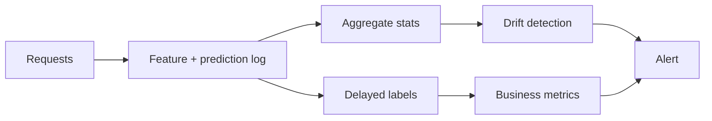

# 5.5 — Monitoring & Drift Detection

## 1. Intuition first
Models silently rot as the world changes. Monitoring turns "how is the model doing today?" into a real, alertable question. Drift detection specifically watches whether inputs, predictions, or the relationship between them shifts.

## 2. Why the topic exists
Static offline metrics ≠ live behavior. Data pipelines break. Fraudsters adapt. Users' language evolves. Without monitoring you find out via users, angrily.

## 3. What problem it solves
Early detection of quality regressions, data pipeline bugs, adversarial adaptation, latency issues.

## 4. Concepts / techniques

### 4.1 Types of drift
- **Data drift** (covariate shift): $P(X)$ changes.
- **Concept drift**: $P(Y|X)$ changes.
- **Label shift**: $P(Y)$ changes.

### 4.2 Detection methods
- Population Stability Index (PSI).
- KL / JS divergence over binned features.
- Kolmogorov-Smirnov test per feature.
- Adversarial validation: train a classifier to tell train vs live; AUC > 0.7 = drift.
- Embedding-based drift (compare distributions in latent space).

### 4.3 Model monitoring signals
- Prediction distribution.
- Feature statistics.
- Latency (p95/p99).
- Error rate.
- Ground-truth (delayed) — actual metrics like AUC/RMSE.
- User feedback (thumbs up/down, click-through).
- Fairness / subgroup metrics.

### 4.4 Anomaly detection
For services: rate-of-change alerts, seasonality-aware baselines, ML-based (Prophet, ADTK).

### 4.5 LLM-specific
Faithfulness scores, refusal rate, prompt/injection detections, cost per query, hallucination probes, token distribution drift, safety violations.

## 5. Every "formula"
- PSI: $\sum_i (p_i - q_i) \ln \tfrac{p_i}{q_i}$; >0.25 = major shift.
- KS statistic = sup |F_train − F_live| per feature.

## 6. Variables
Feature stats; drift score; SLO metrics; alert thresholds.

## 7. Algorithm — production monitoring stack
1. Log every prediction with input features + metadata + model version.
2. Aggregate feature stats hourly/daily.
3. Compute drift metrics vs baseline; alert on threshold.
4. Track ground-truth metrics when labels arrive.
5. Track latency, error rate, cost.
6. Dashboards + alerts (PagerDuty / Slack).

## 8. Simple example
Fraud model: PSI on `transaction_amount` shoots to 0.4 after a promo campaign; ping team.

## 9. Real-world example
- Netflix: real-time metrics on recommendation click-through by cohort.
- Ad-tech: CTR drift often precedes model retrain.
- LLM apps: Arize / WhyLabs / Fiddler dashboards.

## 10. Diagram


## 11. Implementation from scratch — PSI
```python
import numpy as np
def psi(baseline, current, bins=10):
    b_hist, edges = np.histogram(baseline, bins=bins)
    c_hist, _ = np.histogram(current, bins=edges)
    b = np.clip(b_hist / b_hist.sum(), 1e-6, None)
    c = np.clip(c_hist / c_hist.sum(), 1e-6, None)
    return float(((b - c) * np.log(b / c)).sum())
```

## 12. Implementation using libraries
- **Evidently** — drift dashboards.
- **WhyLabs / Whylogs**.
- **Arize** — model observability.
- **Fiddler / Aporia** — enterprise.
- **Prometheus + Grafana** — general metrics.
- **OpenTelemetry** — tracing.
- **LangSmith / Langfuse / Traceloop** — LLM observability.

## 13. Time complexity
Streaming per-feature stats: O(n) per window.

## 14. Space complexity
Store aggregates, not raw payloads, when volume is high.

## 15. Advantages
Catches issues early; avoids silent losses; enables data-driven retraining.

## 16. Disadvantages
Alert fatigue; requires clean baselines; delayed labels.

## 17. Interview questions
1. Types of drift.
2. Explain PSI and KS.
3. Detect drift without labels — how?
4. Adversarial validation intuition.
5. What is a proper baseline?
6. When to retrain automatically vs manually?
7. Concept drift vs covariate shift.
8. Handling delayed labels.
9. LLM-specific monitoring signals.
10. How to set alert thresholds.

## 18. Common mistakes
- Alerting on every tiny fluctuation → fatigue.
- Ignoring seasonality.
- Comparing tiny sample to huge baseline → noisy.
- No plan for what to do after an alert.

## 19. Optimization techniques
Sequential drift tests (ADWIN, DDM); segmented monitoring (per country / device); model-agnostic explanations for alerts.

## 20. Coding exercises
1. Implement PSI + KS drift detectors.
2. Add adversarial validation for train vs live.
3. Set up Evidently dashboard.
4. Instrument a FastAPI service with Prometheus and Grafana.

## 21. Mini project
Add drift dashboard to a live-served model.

## 22. Medium project
End-to-end monitoring stack: Prometheus + Grafana + Evidently + Slack alerts.

## 23. Advanced project
Auto-retrain pipeline: alert → data-drift confirmed → retrain job → shadow deploy → auto-promote if metrics improve.

## 24. Where it is used in industry
Every serious ML product; regulated industries mandate it.

## 25. How companies use it
Banks (model risk), fintech (fraud rules), ad-tech (CTR), health-tech (safety).

## 26. When NOT to use it
Skipping monitoring is never OK. Complexity should match product criticality.
