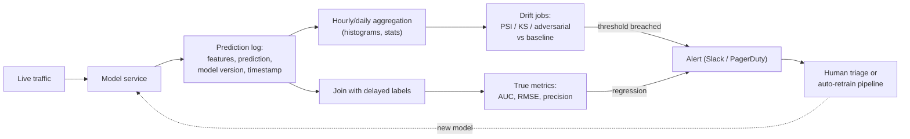
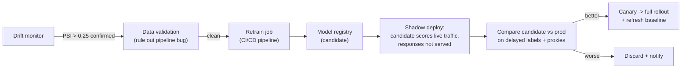

# 5.5 — Monitoring & Drift Detection

## 1. Overview

**What is it?** Model monitoring is the practice of continuously observing a deployed ML system — its inputs, outputs, latency, cost, and (eventually) its true accuracy — so that degradation is detected by dashboards and alerts rather than by angry users. Drift detection is the statistical core of monitoring: it asks whether the data flowing through the model today still looks like the data the model was trained on.

**Why does it exist?** Offline evaluation is a snapshot; production is a movie. Data pipelines break silently, user behavior evolves, fraudsters adapt, upstream teams rename columns, and vendors update models under you. A model that scored 0.92 AUC in the notebook can quietly decay to coin-flip performance while its service returns HTTP 200 on every request.

**What problem does it solve?** It converts "is the model still good?" from an unanswerable vibe into a measurable, alertable question — catching data-quality bugs, distribution shift, adversarial adaptation, latency regressions, and cost blowups early, when they are cheap to fix.

**Where is it used?** Everywhere a model touches money, safety, or users: fraud scoring at banks, recommendation ranking at Netflix, ad click-through prediction, medical triage systems, and — with new failure modes like hallucination and prompt injection — every production LLM application.

## 2. Learning Objectives

After this chapter you will be able to:

- Distinguish **data drift**, **concept drift**, and **label shift**, and explain which can be detected without ground-truth labels.
- Derive the **Population Stability Index (PSI)** and relate it to KL divergence.
- Apply the **Kolmogorov–Smirnov (KS) test** to a numeric feature and interpret its statistic and p-value.
- Use **adversarial validation** to detect multivariate drift that per-feature tests miss.
- Implement PSI, KS, and adversarial validation from scratch in NumPy/scikit-learn.
- Design a production monitoring stack: prediction logging, aggregation, drift jobs, dashboards, alerting.
- Choose sensible baselines, windows, and alert thresholds that avoid alert fatigue.
- Handle **delayed labels** with proxy metrics until ground truth arrives.
- List LLM-specific monitoring signals (faithfulness, refusal rate, token drift, cost per query).
- Connect drift alerts to retraining policy (manual review vs. automated retrain-and-shadow-deploy).

## 3. Prerequisites

| Chapter | Why you need it |
|---|---|
| [Evaluation Metrics](../phase-1-classical-ml/14-evaluation-metrics.md) | Drift alerts ultimately protect metrics like AUC, RMSE, precision/recall; you must know what you are defending. |
| [Feature Engineering](../phase-1-classical-ml/15-feature-engineering.md) | Drift is measured per feature; you need to know how features are built to know where they can rot. |
| [Model Serving](02-model-serving.md) | Monitoring instruments the serving path; you need a service to log predictions from. |
| [CI/CD for ML](04-cicd-ml.md) | Drift alerts often trigger retraining pipelines defined in your CI/CD system. |
| [LLM Evaluation](../phase-3-nlp-llm/12-llm-evaluation.md) | LLM monitoring reuses offline eval ideas (LLM-as-judge, golden sets) as online signals. |

## 4. Intuition

Think of a deployed model as a bridge. The day it opens, engineers have verified it holds the load. But nobody would run a bridge without strain gauges, because traffic patterns change, materials fatigue, and storms happen. Monitoring is the strain gauge for your model; drift detection is the specific gauge that says "the traffic crossing this bridge no longer resembles the traffic it was designed for."

An everyday story: a fraud model is trained on 2024 transactions. In March 2025, marketing launches a "spend $500, get $50" promotion. Suddenly the `transaction_amount` distribution has a spike at exactly $500. The model, never having seen this pattern, starts flagging thousands of legitimate customers as fraudsters. No exception is thrown. No test fails. The only thing that would have caught it on day one is a drift monitor comparing this week's `transaction_amount` histogram to the training histogram — which is exactly what PSI does.

The key insight: **you usually cannot measure accuracy in real time** (labels arrive days or weeks later, if ever), but you *can* measure whether inputs and predictions still look familiar. Drift detection is an early-warning proxy for accuracy loss.

## 5. Real-world Motivation

- **Netflix** monitors recommendation engagement (click-through, play completion) per cohort in near real time; a ranking model regression shows up as a metric dip long before anyone inspects the model itself.
- **Amazon** and other retailers see demand-forecasting models break during events like Prime Day or COVID-era shopping shifts — textbook concept drift, where the historical relationship between features and demand no longer holds.
- **Banks and fintechs** are *required* to monitor: model-risk-management regulation (e.g., SR 11-7 in the US) mandates ongoing performance monitoring of production models, and PSI originated in credit-risk scorecard monitoring.
- **Ad-tech** teams retrain CTR models on cadences driven by observed drift, because user and inventory distributions shift daily.
- **LLM products** (support bots, coding assistants) monitor hallucination probes, refusal rates, and cost per query using tools like Arize, WhyLabs, Fiddler, LangSmith, and Langfuse, because a vendor model update can change behavior overnight without any code change on your side.

## 6. Mathematical Foundations

Monitoring is one of the more quantitative corners of MLOps. Three formulas do most of the work.

### 6.1 Types of drift, formally

Let $X$ be the input features and $Y$ the target. The joint distribution factorizes as $P(X, Y) = P(Y \mid X)\,P(X)$.

| Drift type | What changes | Detectable without labels? |
|---|---|---|
| Data drift (covariate shift) | $P(X)$ | Yes — compare input distributions |
| Label shift (prior shift) | $P(Y)$ | Partially — via prediction distribution |
| Concept drift | $P(Y \mid X)$ | No — needs (delayed) labels or strong proxies |

### 6.2 Population Stability Index (PSI) — derivation

Bin a feature into $B$ buckets. Let $p_i$ be the fraction of the **baseline** (training) population in bucket $i$, and $q_i$ the fraction of the **current** (live) population in bucket $i$, with $\sum_i p_i = \sum_i q_i = 1$.

Recall the KL divergence between discrete distributions:

$$D_{\mathrm{KL}}(p \parallel q) = \sum_{i=1}^{B} p_i \ln \frac{p_i}{q_i}$$

KL is asymmetric: $D_{\mathrm{KL}}(p \parallel q) \neq D_{\mathrm{KL}}(q \parallel p)$. For monitoring we don't care which direction the shift went, so we symmetrize by adding both directions:

$$
\mathrm{PSI} = D_{\mathrm{KL}}(p \parallel q) + D_{\mathrm{KL}}(q \parallel p)
= \sum_i p_i \ln \frac{p_i}{q_i} + \sum_i q_i \ln \frac{q_i}{p_i}
= \sum_{i=1}^{B} (p_i - q_i)\,\ln \frac{p_i}{q_i}
$$

The last step follows because $q_i \ln \frac{q_i}{p_i} = -q_i \ln \frac{p_i}{q_i}$, so the two sums combine term-by-term into $(p_i - q_i)\ln\frac{p_i}{q_i}$. Every term is $\ge 0$ (when $p_i > q_i$ the log is positive; when $p_i < q_i$ both factors are negative), so PSI $\ge 0$, with equality iff the distributions match on every bin.

Industry rule-of-thumb thresholds (from credit-risk practice):

| PSI | Interpretation |
|---|---|
| < 0.10 | No meaningful shift |
| 0.10 – 0.25 | Moderate shift — investigate |
| > 0.25 | Major shift — act (often retrain) |

> [!WARNING]
> If any bin has zero count, $\ln(p_i/q_i)$ is undefined. Always clip bin proportions to a small floor like $10^{-6}$, or merge sparse bins.

### 6.3 Kolmogorov–Smirnov (KS) test

For a continuous feature, let $F_{\text{base}}(x)$ and $F_{\text{live}}(x)$ be the **empirical CDFs** of the baseline and live samples. The KS statistic is the largest vertical gap between them:

$$D = \sup_x \left| F_{\text{base}}(x) - F_{\text{live}}(x) \right|$$

where $\sup_x$ means the supremum (maximum) over all values $x$. Under the null hypothesis that both samples come from the same distribution, the distribution of $D$ is known, yielding a p-value. KS is binning-free (unlike PSI) but, on very large samples, detects *statistically* significant yet *practically* trivial shifts — so pair the p-value with an effect-size check on $D$ itself (e.g., only alert when $D > 0.1$).

### 6.4 Adversarial validation

Per-feature tests miss **multivariate** drift (correlations change while marginals stay put). Adversarial validation: label baseline rows $0$ and live rows $1$, train a classifier to distinguish them, and measure its ROC-AUC ($\text{AUC} \in [0.5, 1]$, see [Evaluation Metrics](../phase-1-classical-ml/14-evaluation-metrics.md)). If AUC $\approx 0.5$, the sets are indistinguishable — no drift. AUC $\gtrsim 0.7$ signals real drift, and the classifier's feature importances tell you *which* features drifted — a diagnostic PSI cannot give.

### 6.5 Where formal math ends

Latency SLOs (p95/p99), error rates, cost per query, and alert-routing policy are engineering measurements, not derived quantities — no further math is required beyond percentile definitions.

## 7. Visual Explanation

The production monitoring loop: two paths, a fast label-free one and a slow ground-truth one.



ASCII view of what PSI actually compares:

```
baseline P(amount)          live P(amount)
  ▂▄█▆▃▁                      ▂▄▆▃▁ ...█   <- new spike at $500
  bins →                      bins →       PSI blows up on that bin
```

## 8. Algorithm

A production monitoring stack, step by step:

1. **Log every prediction** with input features, output, model version, request ID, and timestamp (sample if volume is extreme).
2. **Freeze a baseline**: feature and prediction distributions from the training set or a healthy reference window.
3. **Aggregate** live logs into hourly/daily histograms and summary stats per feature.
4. **Compute drift**: PSI/KS per feature, PSI on the prediction distribution, periodic adversarial validation for multivariate drift.
5. **Join delayed labels** when they arrive; compute true metrics (AUC, RMSE) per model version.
6. **Track ops signals**: p95/p99 latency, error rate, throughput, cost.
7. **Alert** on threshold breaches with runbook links; route by severity.
8. **Act**: triage → root-cause (pipeline bug vs. genuine drift) → retrain/rollback → update baseline after deploying a new model.

```text
PSEUDOCODE: daily drift job
baseline_hists = load_baseline()                 # frozen at training time
for feature in monitored_features:
    live = fetch_logs(feature, window="24h")
    psi  = PSI(baseline_hists[feature], histogram(live))
    ks_d = KS(baseline_sample[feature], live)
    record(feature, psi, ks_d)
    if psi > 0.25 or ks_d > 0.1:
        alert(feature, psi, ks_d, runbook_url)
if day_of_week == MONDAY:                        # heavier, weekly
    auc = adversarial_validation(baseline_rows, live_rows)
    if auc > 0.7: alert("multivariate drift", auc)
```

## 9. Worked Example

**Tiny example, by hand.** A feature has 3 bins. Baseline proportions $p = (0.5, 0.3, 0.2)$; this week's live proportions $q = (0.3, 0.3, 0.4)$.

$$
\begin{aligned}
\text{Bin 1: } & (0.5-0.3)\ln\tfrac{0.5}{0.3} = 0.2 \times 0.5108 = 0.1022\\
\text{Bin 2: } & (0.3-0.3)\ln\tfrac{0.3}{0.3} = 0\\
\text{Bin 3: } & (0.2-0.4)\ln\tfrac{0.2}{0.4} = (-0.2)(-0.6931) = 0.1386\\
\mathrm{PSI} &= 0.1022 + 0 + 0.1386 \approx 0.241
\end{aligned}
$$

PSI ≈ 0.24 — in the "moderate shift, investigate" band, one promo away from the 0.25 action threshold.

**Realistic example.** The fraud model from §4: overnight, the promo pushes 8% of transactions into a $500 spike bin that held 0.5% at baseline. That single bin contributes $(0.005-0.08)\ln(0.005/0.08) \approx 0.208$; total PSI lands near 0.4. The drift job pages the team at 9am; they confirm it is a benign campaign, add a temporary rule, and schedule retraining with promo-period data — instead of discovering the problem via a week of customer complaints.

## 10. Python from Scratch

PSI, KS, and adversarial validation with only NumPy (plus scikit-learn's logistic regression for the adversarial classifier).

```python
import numpy as np

def psi(baseline, current, bins=10, eps=1e-6):
    """Population Stability Index between two 1-D samples."""
    # Bin edges come from the BASELINE only, so both samples
    # are histogrammed on identical, comparable bins.
    b_hist, edges = np.histogram(baseline, bins=bins)
    c_hist, _ = np.histogram(current, bins=edges)
    # Convert counts to proportions; clip to avoid log(0).
    p = np.clip(b_hist / b_hist.sum(), eps, None)
    q = np.clip(c_hist / c_hist.sum(), eps, None)
    # The symmetric-KL closed form derived in section 6.2.
    return float(((p - q) * np.log(p / q)).sum())

def ks_statistic(baseline, current):
    """KS statistic D = sup_x |F_base(x) - F_live(x)|."""
    all_x = np.sort(np.concatenate([baseline, current]))
    # searchsorted/n gives the empirical CDF evaluated at each point.
    f_b = np.searchsorted(np.sort(baseline), all_x, side="right") / len(baseline)
    f_c = np.searchsorted(np.sort(current),  all_x, side="right") / len(current)
    return float(np.abs(f_b - f_c).max())

# --- demo: inject a mean shift and watch both detectors fire ---
rng = np.random.default_rng(0)
base = rng.normal(100, 20, 50_000)          # training-time amounts
live = rng.normal(115, 20, 10_000)          # live traffic drifted +15
print(psi(base, live))                      # ~0.55  -> major shift (>0.25)
print(ks_statistic(base, live))             # ~0.28  -> large gap
print(psi(base, rng.normal(100, 20, 10_000)))  # ~0.001 -> no drift
```

Adversarial validation for multivariate drift:

```python
from sklearn.linear_model import LogisticRegression
from sklearn.model_selection import cross_val_score

def adversarial_auc(X_base, X_live):
    """AUC of a classifier separating baseline (0) from live (1) rows."""
    X = np.vstack([X_base, X_live])
    y = np.r_[np.zeros(len(X_base)), np.ones(len(X_live))]
    clf = LogisticRegression(max_iter=1000)
    # Cross-validated AUC avoids overfitting inflating the score.
    return cross_val_score(clf, X, y, cv=5, scoring="roc_auc").mean()
# ~0.5 => indistinguishable (healthy); >0.7 => drift, inspect coefficients.
```

> [!WARNING]
> Common bug: computing histogram edges from the *current* window instead of the frozen baseline. Then the bins move with the data and PSI stays deceptively near zero even under massive drift.

## 11. Library Implementation

[Evidently](https://github.com/evidentlyai/evidently) is the standard open-source drift toolkit; Prometheus + Grafana handle ops metrics.

```python
import pandas as pd
from evidently.report import Report
from evidently.metric_preset import DataDriftPreset

# reference = frozen training-time snapshot; current = last 24h of logs
reference = pd.read_parquet("baseline_features.parquet")
current   = pd.read_parquet("live_features_today.parquet")

# The preset auto-selects a test per column type
# (KS/Wasserstein for numeric, chi-square/JS for categorical).
report = Report(metrics=[DataDriftPreset()])
report.run(reference_data=reference, current_data=current)

report.save_html("drift_report.html")        # human-readable dashboard
summary = report.as_dict()["metrics"][0]["result"]
if summary["dataset_drift"]:                 # True when enough columns drift
    notify_slack(f"{summary['number_of_drifted_columns']} columns drifted")
```

Exposing ops metrics from a FastAPI service for Prometheus:

```python
from prometheus_client import Counter, Histogram, make_asgi_app

PREDICTIONS = Counter("predictions_total", "count", ["model_version"])
LATENCY = Histogram("prediction_latency_seconds", "latency")  # p95/p99 in Grafana

@app.post("/predict")
async def predict(req: Request):
    with LATENCY.time():                      # observes request duration
        out = model.predict(req.features)
    PREDICTIONS.labels(model_version=MODEL_VERSION).inc()
    return out

app.mount("/metrics", make_asgi_app())        # Prometheus scrapes this
```

The wider ecosystem: **WhyLabs/whylogs** (streaming statistical profiles), **Arize / Fiddler / Aporia** (managed observability), **OpenTelemetry** (tracing), **LangSmith / Langfuse** (LLM traces + evals).

## 12. Code Walkthrough

Inputs, intermediates, and outputs for the from-scratch PSI pipeline:

| Value | Shape / type | Meaning |
|---|---|---|
| `baseline` | `(50_000,)` float array | Feature values at training time (frozen) |
| `current` | `(10_000,)` float array | Feature values from the live window |
| `edges` | `(11,)` | Bin edges — from baseline **only** |
| `p`, `q` | `(10,)` each, sum to 1 | Bin proportions, clipped at `1e-6` |
| PSI output | scalar float ≥ 0 | ~0.001 healthy; 0.55 in the drifted demo |
| KS output | scalar in [0, 1] | Max CDF gap; ~0.28 for the +15 mean shift |
| Adversarial AUC | scalar in [0.5, 1] | ~0.5 healthy, > 0.7 drift |

Expected behavior on the demo: identical distributions give PSI ≈ 0.001 and KS ≈ 0.01 (pure sampling noise); the +15 mean shift gives PSI ≈ 0.55 and KS ≈ 0.28 — both far past their alert thresholds (0.25 and 0.1).

## 13. Complexity Analysis

- **PSI**: $O(n)$ time to histogram $n$ live points, $O(B)$ space for $B$ bins. Crucially, you never need raw baseline data at runtime — only its $B$ bin counts.
- **KS (as implemented)**: dominated by sorting, $O((n+m)\log(n+m))$ for sample sizes $n, m$; space $O(n+m)$.
- **Adversarial validation**: cost of training the classifier — $O(k \cdot n \cdot d)$ for logistic regression on $n$ rows, $d$ features, $k$ iterations. Run weekly, not per-request.
- **Storage**: log aggregates (histograms, counts), not raw payloads, when traffic is high — a day of traffic compresses to kilobytes of sketches versus gigabytes of raw rows.

## 14. Advantages

- **Early detection without labels**: the fraud team in §9 learned of the problem the morning after the promo, weeks before chargeback labels arrived.
- **Root-cause hints**: per-feature PSI plus adversarial-validation importances point at *which* input broke — often revealing a pipeline bug (a column silently going 90% null) rather than real-world change.
- **Data-driven retraining**: retrain when drift says so instead of on a blind calendar — ad-tech teams cut wasted retrains this way.
- **Regulatory compliance**: banks satisfy model-risk requirements with exactly this stack; the PSI report *is* the audit artifact.
- **Safe rollouts**: comparing a canary's prediction distribution to the incumbent's catches broken models before full rollout (see [CI/CD for ML](04-cicd-ml.md)).

## 15. Disadvantages

- **Drift ≠ damage**: inputs can shift in ways the model handles fine (false alarms), and concept drift can destroy accuracy while $P(X)$ looks unchanged — the false-negative that pure input monitoring cannot catch.
- **Delayed or missing labels**: true metrics may lag by weeks (fraud) or never arrive (which loan applicants you rejected).
- **Alert fatigue**: over-sensitive thresholds train the team to ignore the channel — the most common real-world failure of monitoring programs.
- **Baseline maintenance**: every model release invalidates the old baseline; forgetting to refresh it produces permanent phantom drift.
- **Big-sample sensitivity**: with millions of rows, KS p-values flag microscopic shifts; you must add effect-size thresholds.

## 16. Common Mistakes

- **Binning from live data** instead of the frozen baseline → PSI ≈ 0 under real drift. Freeze edges at training time.
- **Ignoring seasonality**: weekend vs. weekday traffic differs; comparing Saturday to a weekday baseline fires every week. Use season-matched baselines or 7-day windows.
- **Tiny window vs. huge baseline**: 200 live rows against 5M baseline rows makes PSI pure noise. Ensure a few hundred points per bin, or widen the window.
- **No runbook**: an alert nobody knows how to act on is noise. Every alert should link to "check pipeline → check segments → decide retrain."
- **Monitoring only inputs**: prediction-distribution drift often catches problems (e.g., a broken preprocessing step collapsing all scores to 0.5) that per-feature stats miss.
- **Never updating the baseline** after deploying a retrained model → every alert thereafter is stale.

## 17. Best Practices

A production checklist:

- [ ] Log features + predictions + model version for every request (sampled if needed).
- [ ] Freeze baseline distributions as an artifact of the training pipeline itself.
- [ ] Monitor three layers: **ops** (latency, errors), **data** (feature/prediction drift), **model** (delayed true metrics).
- [ ] Tier alerts: page only for service-down/severe drift; ticket for moderate drift.
- [ ] Segment monitoring by country/device/cohort — aggregates hide localized breakage.
- [ ] Use proxy signals (CTR, thumbs up/down, override rate) while labels are delayed.
- [ ] Track subgroup/fairness metrics, not just global ones.
- [ ] Rehearse the response: run a game-day where you inject synthetic drift and follow the runbook.

> [!TIP]
> Start with the prediction distribution plus your five most important features. A small dashboard people actually watch beats 400 auto-generated charts nobody opens.

## 18. Optimization Techniques

- **Sequential/streaming detectors**: ADWIN and DDM (in the `river` library) detect change points online in $O(1)$ amortized memory per stream, instead of batch re-comparison.
- **Sketches**: whylogs-style statistical profiles and count-min sketches summarize unbounded streams in constant memory.
- **Embedding-space drift for unstructured data**: embed texts/images, then run drift tests (e.g., MMD, classifier-based) on embedding distributions — this is how you monitor LLM input drift.
- **Prioritized computation**: cheap PSI hourly on all features; expensive adversarial validation weekly or on suspicion.
- **Alert deduplication and hysteresis**: require $k$ consecutive breaches before paging; suppress downstream alerts caused by one upstream failure.

## 19. Industry Applications

- **Credit risk (banks everywhere)**: PSI on scorecard inputs and score distributions is a decades-old regulatory standard.
- **Fraud (Stripe, PayPal, fintechs)**: adversaries adapt deliberately, so drift on transaction features is monitored daily and drives retraining cadence.
- **Recommendations (Netflix, Spotify)**: engagement-metric monitoring per cohort catches ranking regressions within hours.
- **Ads (Google, Meta)**: CTR-model calibration drift directly costs revenue; monitoring and frequent retraining are core infrastructure.
- **Autonomy (Tesla)**: fleet data distribution shifts (weather, geography, new road furniture) inform data collection and retraining priorities.
- **LLM applications (support bots, coding assistants)**: faithfulness scores, refusal rates, injection-attempt detection, token-distribution drift, and cost-per-query dashboards via Arize, LangSmith, or Langfuse.

## 20. Interview Questions

### Beginner

**Q: What are the three main types of drift?**
A: Data drift — $P(X)$ changes; label shift — $P(Y)$ changes; concept drift — $P(Y \mid X)$ changes, i.e., the input-output relationship itself moves.

**Q: What is PSI and how do you read it?**
A: Population Stability Index: bin a feature, compare baseline vs. live bin proportions via $\sum_i (p_i - q_i)\ln(p_i/q_i)$. Below 0.1 is stable; 0.1–0.25 warrants investigation; above 0.25 is a major shift requiring action.

**Q: Why can't you just monitor accuracy directly?**
A: Ground-truth labels are usually delayed (fraud chargebacks take weeks) or never observed (rejected loan applications). Input/prediction drift is the label-free early-warning proxy.

**Q: What non-statistical signals must every model service track?**
A: Latency percentiles (p95/p99), error rate, throughput, and — especially for LLMs — cost per request.

### Intermediate

**Q: How would you detect drift with no labels at all?**
A: Monitor $P(X)$ per feature (PSI/KS), the prediction distribution, multivariate structure via adversarial validation, and behavioral proxies like click-through or user-override rate.

**Q: Explain adversarial validation and its advantage over PSI.**
A: Train a classifier to separate baseline rows (label 0) from live rows (label 1); cross-validated AUC near 0.5 means no drift, above ~0.7 means drift. It captures multivariate drift (changed correlations with unchanged marginals) that per-feature PSI misses, and its feature importances localize the cause.

**Q: The KS test flags every feature on your 10M-row daily window. What's wrong?**
A: Nothing may be wrong — with huge samples, trivially small shifts are statistically significant. Add an effect-size threshold on the statistic $D$ itself (e.g., alert only when $D > 0.1$), or subsample.

**Q: What makes a proper baseline?**
A: A frozen, versioned snapshot of feature and prediction distributions from training data (or a validated healthy window), regenerated as an artifact every time a new model deploys, and season-matched if traffic is seasonal.

**Q: How do you handle delayed labels?**
A: Log a join key with every prediction; backfill true metrics when labels arrive and attribute them to the model version that served them; meanwhile rely on proxy signals and drift metrics for the gap period.

### Advanced

**Q: When should a drift alert trigger automatic retraining vs. human review?**
A: Auto-retrain when the failure mode is well-understood, labels are fresh, the retrain pipeline is fully tested, and deployment goes through shadow/canary gates. Human review when drift might be a data bug (retraining on corrupted data bakes the bug in), labels lag badly, or the domain is regulated.

**Q: Concept drift with unchanged $P(X)$ — how do you catch it?**
A: Input monitoring is blind here. Use fast proxies for $Y$ (engagement, complaint rate, agent-override rate), accelerate a labeled subsample (e.g., pay for expedited human review of a random slice), and compare cohorts of predictions against early outcome signals.

**Q: Design monitoring for a text-classification model where inputs are free text.**
A: No tabular features to PSI. Embed inputs with a sentence encoder and run drift tests in embedding space (classifier-based or MMD); additionally monitor token/length distributions, out-of-vocabulary rates, language mix, prediction distribution, and confidence histograms.

**Q: How do you prevent one upstream failure from causing 50 pages?**
A: Alert topology and deduplication: group alerts by probable root cause, require multi-window persistence (hysteresis), page only on the top-of-funnel signal, and file tickets for correlated downstream breaches.

**Q: What extra signals do LLM systems need beyond classical ones?**
A: Faithfulness/groundedness scores (LLM-as-judge on sampled traffic), refusal and safety-violation rates, prompt-injection detections, token-usage and cost drift, output-format-validity rate, and behavior deltas after vendor model updates — tying back to offline suites from [LLM Evaluation](../phase-3-nlp-llm/12-llm-evaluation.md).

## 21. Coding Exercises

### Easy

1. **PSI on synthetic data.** Generate two normal samples with and without a mean shift; implement PSI and verify ≈ 0 vs. > 0.25. *Hint: compute bin edges from the baseline sample only.*
2. **KS via SciPy.** Use `scipy.stats.ks_2samp` on the same data and compare its statistic to your §10 implementation. *Hint: they should agree to ~2 decimals; differences come from tie handling.*

### Medium

1. **Adversarial validation report.** Given two DataFrames, train a gradient-boosted classifier to separate them, report cross-validated AUC and the top-5 most separating features. *Hint: use `feature_importances_`; drop timestamp-like columns or they trivially win.*
2. **Seasonality-aware baseline.** Build a drift checker that compares each hour of live traffic to the same hour-of-week in the baseline, and show it eliminates false weekend alerts. *Hint: key baseline histograms by `(day_of_week, hour)`.*
3. **Prometheus instrumentation.** Add prediction counters and a latency histogram to a FastAPI model server and view p95 latency in Grafana. *Hint: `Histogram.time()` as a context manager.*

### Hard

1. **Streaming change detection.** Implement ADWIN or use `river.drift.ADWIN` on a stream with an injected change point; measure detection delay vs. false positives across sensitivity settings. *Hint: sweep the `delta` parameter.*
2. **Embedding drift for text.** Embed two text corpora (e.g., news from two years) with `sentence-transformers`, and detect drift via a classifier on embeddings; compare against token-length-only monitoring. *Hint: the classifier AUC is your drift score.*

## 22. Mini Project

**Drift dashboard for a served model.**

1. Train a scikit-learn classifier on a tabular dataset (e.g., the UCI Adult income dataset) and serve it with FastAPI.
2. Log every request's features and prediction to a local Parquet file.
3. Freeze baseline histograms from the training set into a JSON artifact.
4. Write a script that replays test data with an injected shift (e.g., scale one feature by 1.3×) against the service.
5. Run a daily-style job computing PSI and KS per feature; render an Evidently HTML report.
6. Add a threshold check that prints a mock alert with the offending features. Verify the injected shift — and only it — fires.

## 23. Medium Project

**End-to-end monitoring stack with alerting.**

1. Containerize the mini-project service; add Prometheus metrics (`/metrics`) for latency, throughput, errors.
2. Stand up Prometheus + Grafana via docker-compose; build a dashboard with p95 latency, request rate, and error rate.
3. Schedule an hourly drift job (cron or Airflow) that computes PSI/KS against the frozen baseline and pushes drift scores to Prometheus via the Pushgateway.
4. Configure Alertmanager rules: page on error-rate spikes, ticket on PSI > 0.25 sustained for 3 windows.
5. Wire alerts to a Slack webhook with a runbook link in the message.
6. Run a game-day: inject latency, a null-column bug, and a distribution shift; confirm each fires the right alert tier.

## 24. Advanced Project

**Auto-retraining pipeline gated by drift.**

Architecture:



Implementation phases:

1. **Phase 1 — trigger**: drift job emits a structured event; a validation step distinguishes pipeline bugs (null spikes, schema changes) from genuine drift using expectation suites (e.g., Great Expectations).
2. **Phase 2 — retrain**: reuse your [CI/CD for ML](04-cicd-ml.md) pipeline to retrain on a fresh window, log to the [experiment tracker](01-experiment-tracking.md), and register the candidate.
3. **Phase 3 — shadow**: deploy the candidate behind the same endpoint (see [Model Serving](02-model-serving.md)), mirroring traffic; log both models' predictions.
4. **Phase 4 — promote**: automatic promotion only if candidate beats prod on joined delayed labels and no guardrail metric regresses; refresh the monitoring baseline atomically with the rollout.

Possible improvements: segment-level retraining triggers, champion/challenger fleets, drift-aware sample weighting during retraining, and cost-aware retrain scheduling.

## 25. Summary

- Deployed models decay silently; monitoring makes decay observable and alertable.
- Data drift ($P(X)$), label shift ($P(Y)$), and concept drift ($P(Y\mid X)$) are distinct — only the first two are detectable without labels.
- PSI is the symmetrized KL divergence over bins: $\sum_i (p_i - q_i)\ln(p_i/q_i)$; > 0.25 means act.
- The KS statistic is the maximum gap between empirical CDFs; pair p-values with effect-size thresholds on large samples.
- Adversarial validation (baseline-vs-live classifier AUC) catches multivariate drift and localizes causes.
- Monitor three layers: ops (latency/errors/cost), data (feature + prediction drift), model (delayed true metrics).
- Freeze baselines as training artifacts; refresh them on every model release; respect seasonality.
- Delayed labels demand proxy metrics (CTR, overrides, feedback) to bridge the gap.
- Alert fatigue is the number-one monitoring killer: tiered alerts, hysteresis, runbooks.
- LLM systems add faithfulness, refusal rate, injection detection, and token-cost drift to the signal list.
- Drift alerts should feed a tested response path — up to and including automated retrain + shadow deploy.

## 26. Cheat Sheet

| Formula / rule | Statement |
|---|---|
| PSI | $\sum_i (p_i - q_i)\ln(p_i/q_i)$; <0.1 ok, 0.1–0.25 watch, >0.25 act |
| KS statistic | $D=\sup_x \lvert F_{base}(x)-F_{live}(x)\rvert$; alert on $D>0.1$ + low p |
| Adversarial validation | baseline-vs-live classifier; AUC ≈ 0.5 healthy, > 0.7 drift |
| Drift taxonomy | data: $P(X)$; label: $P(Y)$; concept: $P(Y\mid X)$ |

Defaults: 10 PSI bins (baseline-derived edges, clip proportions at $10^{-6}$); 24h–7d comparison windows; require 2–3 consecutive breaches before paging.

One-liners: bin from the baseline, never from live data · monitor predictions, not just inputs · refresh the baseline with every model release · every alert needs a runbook · segment or you'll miss localized breakage.

Gotchas: seasonality masquerading as drift · giant samples making KS scream over nothing · retraining on a pipeline bug and baking it in.

## 27. Further Reading

- **Books**: *Designing Machine Learning Systems* (Chip Huyen) — ch. on data distribution shifts; *Reliable Machine Learning* (Chen et al., O'Reilly); *Machine Learning Design Patterns* (Lakshmanan et al.).
- **Research papers**: Gama et al., "A Survey on Concept Drift Adaptation" (ACM Computing Surveys, 2014); Bifet & Gavaldà, "Learning from Time-Changing Data with Adaptive Windowing" (ADWIN); Rabanser et al., "Failing Loudly: An Empirical Study of Methods for Detecting Dataset Shift" (NeurIPS 2019); Sculley et al., "Hidden Technical Debt in Machine Learning Systems" (NeurIPS 2015).
- **Documentation**: Evidently AI docs; whylogs docs; Prometheus & Grafana docs; `river` (online ML) docs; Arize AI documentation.
- **GitHub repositories**: `evidentlyai/evidently`, `whylabs/whylogs`, `online-ml/river`, `SeldonIO/alibi-detect`.
- **Datasets**: Airline/weather delay data and Electricity (Elec2) — classic concept-drift benchmarks; any Kaggle competition train/test pair for adversarial-validation practice.
- **Videos**: Chip Huyen's Stanford CS 329S lectures on data distribution shifts; MLOps Community talks on monitoring.
- **Blogs**: Evidently AI blog (excellent drift-metric deep dives); Arize AI blog on ML observability; Netflix TechBlog posts on operational recommendation metrics.
