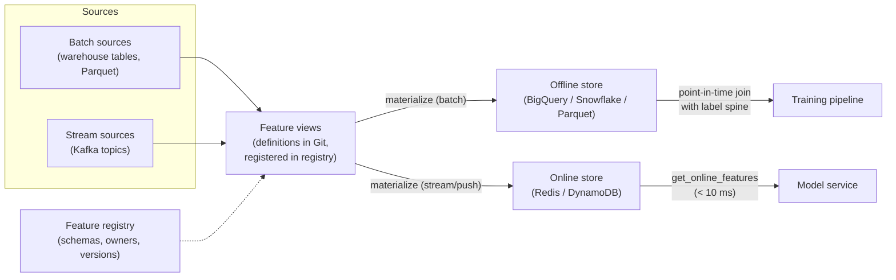
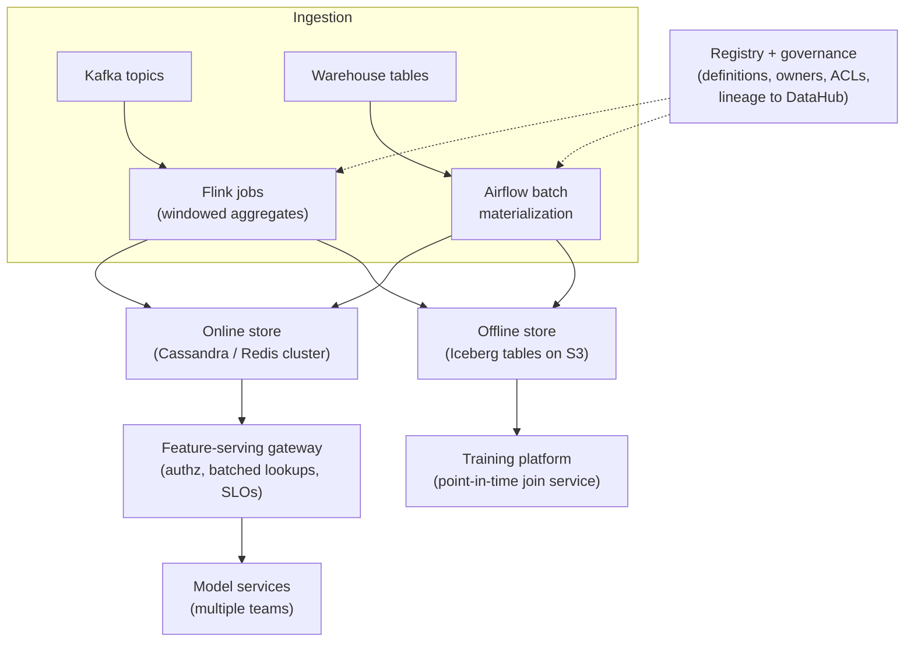

# 5.6 — Feature Stores & Data Pipelines

## 1. Overview

**What is it?** A feature store is the system-of-record for ML features: a platform where features are *defined once*, computed by managed pipelines, stored in two synchronized places — an **offline store** for training and an **online store** for low-latency serving — and retrieved through a single API that guarantees the same values in both worlds.

**Why does it exist?** The most insidious class of ML bugs is **training–serving skew**: the feature called `avg_spend_7d` is computed one way in a data scientist's SQL notebook and a subtly different way in the production Java service. The model trains on one definition and serves on another, and accuracy quietly evaporates. A second, equally deadly bug is **temporal leakage**: joining training labels with feature values computed *after* the labeled event, so the model peeks into the future during training and collapses in production.

**What problem does it solve?** Consistency between training and inference, point-in-time correctness for historical training data, feature reuse and discovery across teams, and millisecond-latency feature retrieval at serving time.

**Where is it used?** Any system that scores entities in real time using features derived from historical data: fraud scoring, recommendation ranking, ETA prediction, credit decisioning, churn models. Uber, Airbnb, DoorDash, and Netflix all built internal feature platforms; Feast and Tecton brought the pattern to everyone else.

## 2. Learning Objectives

After this chapter you will be able to:

- Define training–serving skew and explain the two mechanisms that cause it.
- Explain the offline/online store split and why one storage system cannot serve both roles.
- Define **entities**, **feature views**, and **feature services** in feature-store vocabulary.
- State the **point-in-time join** rule precisely and execute one by hand on paper.
- Implement a correct point-in-time join from scratch in Pandas using `merge_asof` semantics.
- Stand up a Feast repository: define entities and feature views, materialize, and query both stores.
- Reason about **freshness**, **TTL**, and staleness bounds for online features.
- Describe streaming feature pipelines (Kafka/Flink) and when batch materialization is not enough.
- Compare Feast, Tecton, Hopsworks, and cloud-native offerings.
- Decide when a team should *not* adopt a feature store.

## 3. Prerequisites

| Chapter | Why you need it |
|---|---|
| [Feature Engineering](../phase-1-classical-ml/15-feature-engineering.md) | Feature stores manage the artifacts that chapter taught you to create — aggregations, encodings, transformations. |
| [Evaluation Metrics](../phase-1-classical-ml/14-evaluation-metrics.md) | Leakage from incorrect joins inflates offline metrics; you must recognize suspiciously good scores. |
| [Model Serving](02-model-serving.md) | The online store exists to feed the serving path from that chapter within its latency budget. |
| [CI/CD for ML](04-cicd-ml.md) | Feature definitions are code: versioned, reviewed, and deployed through pipelines. |
| [Monitoring & Drift Detection](05-monitoring-drift.md) | Feature stores are where you attach freshness and drift monitoring per feature. |

## 4. Intuition

Think of a restaurant. The **offline store** is the walk-in cold room: enormous capacity, everything labeled with dates, perfect for planning next week's menu (training), but you would never sprint there mid-service. The **online store** is the mise en place at the cooking station: tiny, only what tonight's menu needs, but everything reachable in one second (serving). The head chef's recipe book — one canonical definition of every dish — is the **feature registry**. Disaster strikes when the person stocking the station uses a different recipe than the one used for menu planning: that is training–serving skew.

An everyday story about the *other* bug, leakage: imagine studying for an exam using a textbook edition published *after* the exam was written, containing the actual answers. You ace every practice test and fail the real one. A model trained on features computed after the label event does exactly this. If a fraud label is attached to a transaction at 14:00 on June 3rd, the model may only see feature values as they existed *before* 14:00 on June 3rd — not the customer's average spend recomputed a week later, which already includes the fraudulent transaction itself. The **point-in-time join** is the mechanism that enforces this "no time travel" rule automatically.

## 5. Real-world Motivation

- **Uber (Michelangelo)**: one of the first published feature platforms (2017). Michelangelo's feature store let hundreds of teams share features like driver acceptance rates across ETA, pricing, and fraud models, with dual batch/streaming materialization.
- **Airbnb (Zipline / Chronon)**: built around point-in-time-correct backfills of windowed aggregations; open-sourced as Chronon in 2024.
- **DoorDash (Riviera and its feature store)**: serves billions of feature lookups per day from Redis for store ranking and ETA models, with strict single-digit-millisecond budgets.
- **Netflix** operates internal fact/feature stores so that offline training data reproduces exactly what online systems saw at inference time.
- **Feast**, originally built at Gojek with Google, became the standard open-source feature store; **Tecton** (founded by Michelangelo's creators) is the leading managed platform; AWS SageMaker, GCP Vertex AI, and Databricks each ship native feature stores.

The common thread: once an organization has more than a handful of real-time models, ad-hoc feature scripts stop scaling — teams duplicate work, definitions diverge, and leakage bugs ship.

## 6. Mathematical Foundations

Feature stores are a systems topic: there are no derivations in the calculus sense, and no loss functions or gradients are involved. The one piece of genuine formal content is the **semantics of the point-in-time join**, which is worth stating precisely, plus a small amount of freshness arithmetic.

### 6.1 Point-in-time join semantics

Let the label (spine) table be a set of rows $(e, t)$ where $e$ is an entity key (e.g., `user_id`) and $t$ is the **event timestamp** — the moment the prediction would have been made. Let a feature $f$ have a history of values $\{(e, \tau_j, v_j)\}$, where $\tau_j$ is the timestamp at which value $v_j$ became available for entity $e$.

The point-in-time join assigns to each spine row the value

$$
f(e, t) = v_{j^*}, \qquad j^* = \arg\max_{j} \{\, \tau_j \;:\; \tau_j \le t \ \wedge\ t - \tau_j \le \mathrm{TTL} \,\}
$$

in words: *the most recent feature value at or before the event time*, and only if it is not older than the time-to-live $\mathrm{TTL}$; otherwise $f(e,t) = \text{NULL}$. The condition $\tau_j \le t$ is the leakage guard — strictly no future values. The TTL condition makes training honestly reproduce serving, where a stale value would also be treated as missing.

### 6.2 Freshness and staleness bounds

If a batch pipeline recomputes a feature every $\Delta$ hours and takes $\delta$ hours to run and load, the worst-case staleness of the online value is

$$\text{staleness}_{\max} = \Delta + \delta$$

A "7-day average spend" refreshed nightly ($\Delta = 24$h) with a 2-hour pipeline is up to 26 hours stale. Whether that matters is a product question: fine for churn prediction, potentially fatal for fraud — which is why fraud counters are computed by streaming pipelines with staleness in seconds. Choose $\mathrm{TTL} \ge \Delta + \delta$, or the online store will regularly serve NULLs between refreshes.

No further mathematics is required for this topic; the remaining content is data modeling and systems engineering.

## 7. Visual Explanation

The canonical dual-store architecture:



And the point-in-time join as a timeline — the training row at time `t` may only reach *backward*:

```
feature history (user 42):  v=100        v=180              v=250
                            ─┬────────────┬──────────────────┬───────→ time
                             τ1           τ2                 τ3
label event  (user 42):                        ● t
                                               │
                          picks v=180 (τ2 ≤ t) ┘   v=250 is FUTURE → forbidden
```

## 8. Algorithm

The lifecycle of a feature managed by a store:

1. **Define**: declare the entity (join key), the feature view (source table/topic, columns, transformations, TTL) as code; commit to Git.
2. **Register**: apply the definition to the feature registry so it is discoverable and versioned.
3. **Materialize offline**: batch jobs compute the full feature history into the offline store.
4. **Materialize online**: batch-load the *latest* value per entity into the KV store, and/or push updates continuously from a stream processor.
5. **Train**: build a label spine `(entity, event_time, label)` and request a point-in-time-correct training frame from the offline store.
6. **Serve**: at request time, fetch the current feature vector by entity key from the online store; concatenate with request-time features; predict.
7. **Monitor**: track freshness, null rates, and drift per feature (see [Monitoring & Drift](05-monitoring-drift.md)).

Pseudocode for the point-in-time join itself:

```text
POINT_IN_TIME_JOIN(spine, feature_history, ttl):
    sort feature_history by (entity, τ ascending)
    for each row (e, t) in spine:
        candidates = { (τ, v) in feature_history[e] : τ <= t and t - τ <= ttl }
        if candidates not empty:
            row.feature = v of the candidate with max τ     # latest valid value
        else:
            row.feature = NULL                              # honest missingness
    return spine
```

## 9. Worked Example

**Tiny example, solved entirely by hand.** Feature: `avg_spend_7d` for users, TTL = 3 days.

Feature history (values become available at timestamp $\tau$):

| user | τ (available at) | avg_spend_7d |
|---|---|---|
| 42 | Jun 1 00:00 | 100 |
| 42 | Jun 4 00:00 | 180 |
| 42 | Jun 8 00:00 | 250 |
| 7  | Jun 2 00:00 | 55 |

Label spine (each row = one training example):

| user | event time t | label | → joined value | reasoning |
|---|---|---|---|---|
| 42 | Jun 3 14:00 | fraud | **100** | latest τ ≤ t is Jun 1; age 2.6 d ≤ TTL ✓ |
| 42 | Jun 5 09:00 | ok    | **180** | Jun 4 value; age 1.4 d ✓ (Jun 8 is future — forbidden) |
| 42 | Jun 9 10:00 | ok    | **250** | Jun 8 value; age 1.4 d ✓ |
| 7  | Jun 6 12:00 | ok    | **NULL** | Jun 2 value is 4.5 d old > TTL 3 d → treated as missing |

A naive `JOIN ... ON user_id` grabbing the *latest* row would have given user 42's June 3 fraud example the value 250 — a number computed five days *after* the fraud, quite possibly inflated by the fraud itself. That is leakage: offline AUC looks great, production performance does not.

**Realistic scale.** A fraud training set has 50M labeled transactions (the spine) and 40 feature views over 10M users. The offline store executes the point-in-time join as a partitioned window query in the warehouse — minutes to hours — producing a training frame where every one of the 50M × 40 cells respects the $\tau \le t$ rule. Hand-writing 40 correct `ASOF`-style SQL joins is exactly the toil the feature store eliminates.

## 10. Python from Scratch

A miniature feature store in pure Pandas: a registry, a point-in-time join, and a dictionary standing in for Redis.

```python
import pandas as pd

# ---------- 1. "Registry": feature definitions as plain data ----------
REGISTRY = {
    "user_avg_spend_7d": {"entity": "user_id", "ttl": pd.Timedelta(days=3)},
}

# ---------- 2. Offline store: full feature history ----------
history = pd.DataFrame({
    "user_id":   [42, 42, 42, 7],
    "ts":        pd.to_datetime(["2025-06-01", "2025-06-04", "2025-06-08", "2025-06-02"]),
    "avg_spend_7d": [100.0, 180.0, 250.0, 55.0],
}).sort_values("ts")          # merge_asof requires time-sorted inputs

spine = pd.DataFrame({
    "user_id":    [42, 42, 42, 7],
    "event_time": pd.to_datetime(["2025-06-03 14:00", "2025-06-05 09:00",
                                  "2025-06-09 10:00", "2025-06-06 12:00"]),
    "label":      [1, 0, 0, 0],
}).sort_values("event_time")

def point_in_time_join(spine, history, feature, ttl):
    """For each (entity, event_time) pick the latest feature value
    with ts <= event_time and event_time - ts <= ttl."""
    return pd.merge_asof(
        spine, history,
        left_on="event_time", right_on="ts",   # match on time...
        by="user_id",                          # ...within each entity
        direction="backward",                  # ONLY look into the past
        tolerance=ttl,                         # enforce TTL: too old -> NaN
    )

train_df = point_in_time_join(spine, history,
                              "avg_spend_7d", REGISTRY["user_avg_spend_7d"]["ttl"])
print(train_df[["user_id", "event_time", "avg_spend_7d", "label"]])
# user 42 rows get 100.0, 180.0, 250.0 — matching the hand-solved table;
# user 7 gets NaN because its only value exceeds the 3-day TTL.

# ---------- 3. Online store: latest value per entity, TTL-checked ----------
online = (history.sort_values("ts").groupby("user_id").last()
          .to_dict(orient="index"))            # {42: {'ts': ..., 'avg_spend_7d': 250.0}, ...}

def get_online_features(user_id, now, ttl):
    row = online.get(user_id)
    if row is None or now - row["ts"] > ttl:   # same TTL rule as training!
        return {"avg_spend_7d": None}
    return {"avg_spend_7d": row["avg_spend_7d"]}

print(get_online_features(42, pd.Timestamp("2025-06-09 10:00"),
                          REGISTRY["user_avg_spend_7d"]["ttl"]))
# {'avg_spend_7d': 250.0}  -> identical to the training-time value at that instant
```

The crucial property: `get_online_features` at time $t$ returns *exactly* what the point-in-time join would assign to a spine row at time $t$. That equality **is** train/serve consistency.

> [!WARNING]
> Common bug: `merge_asof(..., direction="nearest")` — "nearest" will happily match a *future* value that is closer than the past one, silently reintroducing leakage. Always `direction="backward"`.

## 11. Library Implementation

The same design in [Feast](https://github.com/feast-dev/feast). Definitions live in a repo directory and are applied with `feast apply`.

```python
# feature_repo/features.py
from datetime import timedelta
from feast import Entity, FeatureView, Field, FileSource
from feast.types import Float32

# Entity = the join key features attach to.
user = Entity(name="user", join_keys=["user_id"])

# Source: Parquet with a timestamp column Feast uses for point-in-time logic.
spend_source = FileSource(
    path="data/user_spend.parquet",
    timestamp_field="ts",                 # this is τ in section 6.1
)

# Feature view = named group of features over one entity + source, with TTL.
user_stats = FeatureView(
    name="user_stats",
    entities=[user],
    ttl=timedelta(days=3),                # the TTL from our worked example
    schema=[Field(name="avg_spend_7d", dtype=Float32)],
    source=spend_source,
)
```

```python
from feast import FeatureStore
store = FeatureStore(repo_path="feature_repo/")

# TRAINING: point-in-time join against a label spine (entity_df).
# entity_df must contain user_id and an event_timestamp column.
train_df = store.get_historical_features(
    entity_df=spine_df,
    features=["user_stats:avg_spend_7d"],
).to_df()                                  # leakage-safe training frame

# MATERIALIZE: copy latest values into the online store (e.g., Redis).
store.materialize_incremental(end_date=datetime.utcnow())

# SERVING: single-digit-ms lookup by entity key inside the request handler.
vec = store.get_online_features(
    features=["user_stats:avg_spend_7d"],
    entity_rows=[{"user_id": 42}],
).to_dict()                                # {'user_id': [42], 'avg_spend_7d': [250.0]}
```

For **streaming features**, Feast exposes a push API: a Kafka/Flink consumer computes windowed aggregates and calls `store.push("user_txn_stream", df)`, updating the online store within seconds instead of waiting for nightly materialization. Alternatives: **Tecton** (managed, built-in transformation pipelines), **Hopsworks** (open platform with its own online store), **Databricks / SageMaker / Vertex** feature stores (cloud-native, best inside their ecosystems).

## 12. Code Walkthrough

Data flowing through the from-scratch implementation (§10):

| Object | Shape / type | Meaning |
|---|---|---|
| `history` | DataFrame (4, 3) | Offline store: full timestamped feature history |
| `spine` | DataFrame (4, 3) | Label spine: `(user_id, event_time, label)` |
| `train_df` | DataFrame (4, 5+) | Spine + leakage-safe feature column |
| `train_df["avg_spend_7d"]` | `[100.0, 180.0, 250.0, NaN]` (after aligning to §9 order) | Matches the hand-solved table exactly |
| `online` | dict, 2 entries | Online store: latest value per entity |
| `get_online_features(42, …)` | `{'avg_spend_7d': 250.0}` | Serving-time lookup, TTL-checked |

Expected results: the four joined values equal the §9 hand computation (100, 180, 250, NULL), and the online lookup at Jun 9 10:00 equals the training-time value for the same instant — demonstrating train/serve consistency on real numbers.

## 13. Complexity Analysis

- **Point-in-time join**: with feature history sorted by time, `merge_asof` is a linear merge — $O((n + m)\log(n+m))$ including sorts, for $n$ spine rows and $m$ history rows; warehouses parallelize it as a partitioned window function. This is minutes-to-hours at billions of rows, which is fine for offline training.
- **Online lookup**: a key-value get — $O(1)$ expected per entity, typically 1–10 ms including network. This is why the online store is Redis/DynamoDB, not the warehouse: a warehouse scan has seconds of latency and cannot sit on the request path.
- **Space**: offline history grows without bound (TBs; cheap object storage). Online storage is $O(\text{entities} \times \text{features} \times \text{value size})$ — 10M users × 50 float features ≈ a few GB, comfortably in-memory. TTL expiry keeps it bounded to hot entities.

## 14. Advantages

- **Eliminates training–serving skew**: DoorDash-style ranking systems retrieve the same materialized values in training joins and serving lookups; there is no second implementation to diverge.
- **Point-in-time correctness by default**: the leakage bug from §9 becomes impossible to write, rather than a code-review catch.
- **Reuse and discovery**: at Uber, a fraud team reuses the pricing team's `driver_acceptance_rate` by referencing it in the registry instead of re-deriving it.
- **Latency**: precomputed online features turn a 30-second aggregation query into a 2 ms Redis lookup, meeting the budgets from [Model Serving](02-model-serving.md).
- **Auditability and governance**: regulated lenders can answer "exactly which feature values fed this credit decision?" because definitions are versioned and lookups are loggable.

## 15. Disadvantages

- **Operational complexity**: you now run a registry, batch materialization jobs, possibly a streaming pipeline, and a low-latency KV cluster — real on-call surface.
- **Cost**: keeping millions of entities hot in Redis/DynamoDB is not cheap; teams routinely discover their feature-serving bill rivals their model-serving bill.
- **Freshness ceilings**: batch materialization caps freshness at $\Delta + \delta$ (§6.2); genuinely real-time features force you into streaming infrastructure.
- **Not for request-time features**: values only known at request time (the current cart, the query text) can't be precomputed — they bypass the store, and teams sometimes contort designs trying to force them in.
- **Failure case — overkill**: a three-person team with one batch-scored model gains nothing but toil from a feature store; a shared, tested feature module is the right size.

## 16. Common Mistakes

- **Reimplementing a feature in serving code** "just this once" — the exact skew the store exists to prevent. Always fetch via the store API.
- **Using the label-event table's latest values for training** (plain join instead of point-in-time) → leakage, inflated offline metrics, production collapse.
- **Timestamp confusion**: using the time an event *occurred* instead of when the feature value *became available* (pipelines add hours of delay). Feast distinguishes `timestamp_field` from `created_timestamp` for this reason.
- **TTL shorter than the refresh interval** → online store periodically serves NULLs; set $\mathrm{TTL} \ge \Delta + \delta$.
- **Applying TTL at serving but not training** (or vice versa) → the missingness distribution differs between train and serve, a subtle skew.
- **Not versioning feature definitions**: silently changing a window from 7 to 30 days breaks every model trained on the old definition. Create `avg_spend_30d` as a new feature instead.
- **Timezone-naive timestamps**: mixing UTC and local time shifts every point-in-time join by hours. Standardize on UTC everywhere.

## 17. Best Practices

- [ ] Keep feature definitions in Git; review them like code; deploy via [CI/CD](04-cicd-ml.md).
- [ ] Store event timestamps in UTC; record both event time and availability time.
- [ ] Set TTLs deliberately per feature from freshness requirements, not a global default.
- [ ] Monitor per-feature freshness lag, null rate, and drift ([Monitoring & Drift](05-monitoring-drift.md)); alert when materialization jobs miss SLA.
- [ ] Assign an owner and a description to every feature view — a registry without ownership becomes a swamp.
- [ ] Log the feature vector actually served with each prediction, enabling exact training-data reconstruction and skew audits.
- [ ] Test the join: unit-test point-in-time logic with hand-crafted fixtures like §9's table.
- [ ] Load-test online lookups at production QPS before launch; feature retrieval is on the critical path.

> [!TIP]
> A cheap skew audit: sample 1,000 live requests, recompute their features offline via `get_historical_features` at the request timestamps, and diff against what was actually served. Any mismatch is a bug worth a day of investigation.

## 18. Optimization Techniques

- **Pre-aggregation with tiling**: maintain partial aggregates (e.g., hourly sums) and combine at query time, so a 30-day window doesn't rescan raw events — the core trick in Airbnb's Chronon and Tecton.
- **Sketches for approximate features**: count-min sketch for "times user saw item," HyperLogLog for distinct counts — constant memory on unbounded streams.
- **Batch the lookups**: fetch all entities' features for a ranking request in one `MGET`/`BatchGetItem` round trip instead of N calls; this typically dominates serving latency.
- **Caching hot entities** in-process with short TTLs on top of Redis for extreme QPS.
- **Columnar offline layout** (Parquet/Iceberg partitioned by date) so point-in-time joins prune partitions instead of scanning history.
- **Push-down transformations**: run feature SQL inside the warehouse rather than pulling raw data into Python.

## 19. Industry Applications

- **Uber**: Michelangelo's feature store ("Palette") powers ETA, pricing, fraud, and matching models with shared batch and near-real-time features.
- **Airbnb**: Zipline/Chronon backfills point-in-time-correct training sets for search ranking and trust models.
- **DoorDash**: gigascale Redis-backed feature serving for store ranking and logistics ETA, billions of lookups daily.
- **Netflix**: internal feature/fact stores ensure offline training reproduces the exact inputs online systems saw.
- **Gojek + Google**: created Feast to share features between data science and engineering across ride-hailing and payments models.
- **Banks and fintechs**: feature stores provide the lineage and reproducibility that credit-model regulation demands.

## 20. Interview Questions

### Beginner

**Q: What is training–serving skew?**
A: Any systematic difference between features at training time and serving time — usually caused by two independent implementations of the same feature, or by different data freshness. The model learns one distribution and is scored on another, degrading accuracy silently.

**Q: Why do feature stores have two storage layers?**
A: Training needs full history and high-throughput scans (warehouse/Parquet — the offline store); serving needs the latest value per entity in milliseconds (Redis/DynamoDB — the online store). No single system does both well; the store keeps the two synchronized from one definition.

**Q: What is an entity? A feature view?**
A: An entity is the business object features attach to, identified by a join key (`user_id`, `merchant_id`). A feature view is a named group of features for an entity, bound to a data source, a schema, and a TTL.

**Q: What is TTL for?**
A: It bounds staleness: an online value older than the TTL is treated as missing rather than served; the same rule applied in the point-in-time join keeps training and serving missingness consistent.

### Intermediate

**Q: State the point-in-time join rule precisely.**
A: For each spine row $(e, t)$, select the feature value with the largest availability timestamp $\tau \le t$ subject to $t - \tau \le \mathrm{TTL}$; NULL if none exists. It guarantees no future information enters a training example.

**Q: Your model gets 0.98 AUC offline and performs at chance in production. Feature-store-related causes?**
A: Almost certainly temporal leakage — the training join used feature values computed after the label events (e.g., a plain latest-value join, or `direction="nearest"` in `merge_asof`). Secondarily, serving may compute features differently or serve much staler values than training assumed.

**Q: When do you need streaming features instead of nightly batch?**
A: When the feature's predictive value decays faster than the batch staleness bound $\Delta + \delta$ — e.g., "transactions in the last 10 minutes" for fraud. Then a Kafka/Flink pipeline pushes updates to the online store within seconds.

**Q: What is the difference between event time and availability time, and why does it matter?**
A: Event time is when the underlying event happened; availability time is when the computed feature value could actually have been known (after pipeline delay). Joining on event time when serving sees availability-time values overstates freshness in training — a skew.

**Q: When would you advise a team NOT to adopt a feature store?**
A: Few features, one or two models, batch-only scoring, single team: a shared, versioned, unit-tested feature-transform module gives the consistency benefit without operating a platform.

### Advanced

**Q: Design the feature layer for a fraud system needing both "average spend over 90 days" and "transactions in the last 5 minutes."**
A: Two paths, one registry: the 90-day aggregate via nightly batch materialization (TTL ~2 days) into the online store; the 5-minute counter via a stream processor consuming the transaction topic, pushing to the online store (TTL ~minutes). Training uses point-in-time joins over the offline history of both; the streaming feature's offline history is logged from the stream so training sees exactly what serving saw.

**Q: How do you backfill a newly defined feature without leakage?**
A: Recompute its full history from raw event data, assigning each value the availability timestamp it *would have had* (including realistic pipeline delay), then point-in-time join as usual. Backfilling with today's lookback but optimistic timestamps creates leakage-by-freshness.

**Q: Compare Feast and Tecton architecturally.**
A: Feast is an open-source definition/serving layer that plugs into your existing storage and pipelines — you bring the compute; it does not manage transformations for batch sources. Tecton is a managed platform that also owns the transformation pipelines (batch, streaming, on-demand), SLAs, and monitoring. Feast costs engineering time; Tecton costs money and some flexibility.

**Q: How does the feature store interact with model rollbacks?**
A: Models depend on specific feature-definition versions. Rolling a model back requires the old features to still be materialized and served — so feature definitions must be versioned, additive (new name for changed semantics), and deprecated only after no registered model depends on them.

## 21. Coding Exercises

### Easy

1. **Hand-verify `merge_asof`.** Reproduce the §9 table in Pandas and confirm all four joined values, including the TTL-induced NULL. *Hint: both frames must be sorted by their time columns.*
2. **Break it, then see it.** Redo the join with `direction="nearest"` and find the leaked value. *Hint: user 42's June 3 row.*

### Medium

1. **Feast quickstart end-to-end.** Init a Feast repo, define the `user_stats` view over a Parquet source, run `feast apply`, materialize to SQLite/Redis, and query both `get_historical_features` and `get_online_features`. *Hint: `feast init` generates a working skeleton to modify.*
2. **Staleness monitor.** Write a script that, for each entity in the online store, computes `now − ts` and reports the p95 staleness per feature view; alert if it exceeds TTL. *Hint: store the materialization timestamp alongside values.*
3. **Skew audit.** Log served feature vectors for 100 simulated requests, then recompute them via a point-in-time join at the same timestamps and diff. *Hint: any nonzero diff is a bug in one of your two paths.*

### Hard

1. **Windowed aggregates with tiling.** Implement "sum of purchases in last 7 days" using hourly partial sums combined at query time; verify against a brute-force recomputation on random data. *Hint: 7 days = 168 hourly tiles; watch the partial tile at the window edge.*
2. **Streaming push pipeline.** Consume a Kafka topic of synthetic transactions, maintain 10-minute per-user counts in a stream consumer, and push them into Feast's online store via the push API; measure end-to-end freshness. *Hint: `confluent-kafka` + `store.push()`.*

## 22. Mini Project

**Feast-backed demand forecasting features.**

1. Generate a synthetic dataset: daily sales per `store_id` for a year, in Parquet with a timestamp column.
2. Initialize a Feast repo; define a `store` entity and a `store_stats` feature view (7-day and 28-day rolling average sales, TTL = 2 days).
3. Run `feast apply`; inspect the registry with `feast feature-views list`.
4. Build a label spine of `(store_id, event_timestamp, next_day_sales)` and produce a training frame with `get_historical_features`; train a simple regressor.
5. Materialize to the online store; write a small FastAPI endpoint that fetches online features for a store and returns a forecast.
6. Verify train/serve consistency: for one timestamp, compare the online value with the historical join value.

## 23. Medium Project

**Batch + streaming feature pipeline with a serving API.**

1. Model raw data in a warehouse (or DuckDB locally); build batch features with dbt or SQL: customer lifetime aggregates, refreshed nightly.
2. Add a streaming path: a Kafka topic of live transactions consumed by a small Python/Flink job computing 10-minute rolling counts per user.
3. Register both as feature views in Feast (batch source + push source); materialize batch nightly, push streaming continuously.
4. Serve a fraud-scoring FastAPI endpoint that fetches both feature views in one online call and applies a trained classifier.
5. Add freshness and null-rate monitoring per feature view, exported to Prometheus (reuse the stack from [Monitoring & Drift](05-monitoring-drift.md)).
6. Chaos-test: pause the streaming job and confirm the TTL causes honest NULLs plus a freshness alert, rather than silently stale scores.

## 24. Advanced Project

**Multi-tenant feature platform.**

Architecture:



Implementation phases:

1. **Phase 1 — core**: Iceberg-based offline store partitioned by date; a point-in-time join service; batch materialization to the online cluster with per-view TTLs.
2. **Phase 2 — streaming**: Flink jobs with tiled partial aggregates writing to both stores, so training history and serving values come from one computation.
3. **Phase 3 — governance**: registry with owners, schemas, semantic versioning, deprecation workflow; lineage export to DataHub; per-tenant ACLs and quotas at the serving gateway.
4. **Phase 4 — reliability**: skew audits as scheduled jobs, freshness SLOs with alerting, load-shedding and cache layers at the gateway, and a game-day for online-store failover.

Possible improvements: on-demand (request-time) transformations executed in the gateway; embedding features with vector-store backends; cost attribution per tenant; automatic feature-importance-driven cleanup of unused features.

## 25. Summary

- Feature stores are the system-of-record for features: define once, materialize to offline (training) and online (serving) stores, retrieve via one API.
- The two bugs they kill: training–serving skew (duplicate implementations diverge) and temporal leakage (training sees the future).
- The point-in-time join rule: latest value with $\tau \le t$ and $t - \tau \le \mathrm{TTL}$, else NULL — apply the *same* TTL logic online.
- Worst-case batch staleness is refresh interval plus pipeline runtime ($\Delta + \delta$); set TTL above it, and go streaming when the feature decays faster.
- Entities are join keys; feature views bind features to sources, schemas, and TTLs; the registry makes them discoverable and versioned.
- Offline lookups are big scans (minutes–hours OK); online lookups are $O(1)$ KV gets (1–10 ms) — hence two storage systems.
- Feast is the open-source standard; Tecton/Hopsworks/cloud stores trade money for managed pipelines.
- Log served feature vectors, audit skew by recomputation, and monitor freshness/null-rate/drift per feature.
- Version feature definitions additively; changing semantics in place breaks deployed models.
- Skip the platform entirely for small, batch-only, single-team settings — a shared tested module suffices.

## 26. Cheat Sheet

| Concept | Rule |
|---|---|
| Point-in-time join | $f(e,t) = v$ at $\max\{\tau : \tau \le t,\ t-\tau \le \mathrm{TTL}\}$, else NULL |
| Staleness bound | $\text{staleness}_{\max} = \Delta$ (refresh interval) $+\ \delta$ (pipeline runtime) |
| TTL sizing | $\mathrm{TTL} \ge \Delta + \delta$, driven by feature decay rate |
| Store split | offline = history + scans (warehouse); online = latest + $O(1)$ gets (KV) |

Feast vocabulary: `Entity` (join key) · `FeatureView` (features + source + TTL) · `FeatureService` (a model's feature set) · `get_historical_features` (training) · `get_online_features` (serving) · `materialize` / `push` (loading online).

One-liners: `merge_asof(direction="backward")`, never "nearest" · UTC everywhere · availability time, not event time · new semantics ⇒ new feature name · one `MGET`, not N gets.

Gotchas: TTL < refresh interval ⇒ periodic NULLs · TTL enforced on one side only ⇒ skew · backfills with optimistic timestamps ⇒ leakage · request-time features don't belong in the store.

## 27. Further Reading

- **Books**: *Designing Machine Learning Systems* (Chip Huyen) — data engineering & feature chapters; *Machine Learning Design Patterns* (Lakshmanan et al.) — the Feature Store pattern; *Feature Engineering for Machine Learning* (Zheng & Casari).
- **Research papers / engineering papers**: "Hidden Technical Debt in Machine Learning Systems" (Sculley et al., NeurIPS 2015) — pipeline debt motivation; Hermann & Del Balso, "Meet Michelangelo" (Uber Engineering, 2017); Airbnb's Chronon paper/talks on point-in-time-correct aggregation.
- **Documentation**: Feast docs (feast.dev); Tecton documentation and blog; Hopsworks feature-store docs; AWS SageMaker Feature Store and GCP Vertex AI Feature Store guides.
- **GitHub repositories**: `feast-dev/feast`, `airbnb/chronon`, `logicalclocks/hopsworks`, `featureform/featureform`.
- **Datasets**: Feast's demo driver-ranking dataset; Kaggle's Instacart or Fraud Detection datasets (rich entity/time structure for practicing point-in-time joins).
- **Videos**: Tecton's apply() conference talks; MLOps Community feature-store panels; Uber Michelangelo talks.
- **Blogs**: Uber, Airbnb, DoorDash, and Netflix engineering blogs (feature platform posts); featurestore.org comparisons; Tecton's "What is a Feature Store?" series.
