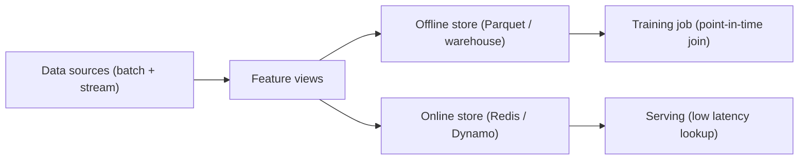

# 5.6 — Feature Stores & Data Pipelines

## 1. Intuition first
The same feature must appear identically at training and at serving time. Feature stores are the system-of-record for features: define them once, compute them once, serve them everywhere.

## 2. Why the topic exists
Training-serving skew is a top ML bug source. Ad-hoc SQL scripts for features cannot guarantee point-in-time correctness at scale.

## 3. What problem it solves
- Consistency between training and inference.
- Reuse across teams.
- Point-in-time correctness for time-series features.
- Low-latency online serving.

## 4. Concepts

### 4.1 Offline vs online store
- **Offline**: batch (Parquet on S3, warehouses) — used for training.
- **Online**: low-latency KV store (Redis, DynamoDB) — used for serving.
- Same feature definitions materialized to both.

### 4.2 Entities & feature views
- Entity: an object features attach to (user, product, session).
- Feature view: a set of features tied to an entity, computed from a source.

### 4.3 Point-in-time joins
For each training row `(entity, event_time)`, fetch feature values as of `event_time` — no future leakage.

### 4.4 Freshness & TTL
Time-to-live for online features; refresh cadence via batch or streaming.

### 4.5 Streaming features
Kafka / Flink / Kinesis pipelines that update online store in near-real time.

## 5. Formulas
Not applicable.

## 6. Variables
Entity key, event time, feature name, feature value, freshness SLO.

## 7. Algorithm — feature engineering with a store
1. Define feature views + transformations.
2. Materialize offline (batch job) for training.
3. Register in registry.
4. Materialize online (streaming or batch push).
5. At training: point-in-time join.
6. At serving: `store.get_online_features(entity_keys=...)`.

## 8. Simple example
"User avg spend last 7 days" feature — computed offline nightly, mirrored to Redis for real-time fraud scoring.

## 9. Real-world example
- Uber Michelangelo.
- Airbnb Zipline (open-sourced later).
- DoorDash Riviera.
- Feast (open-source, common on GCP / AWS).
- Tecton (managed feature platform).

## 10. Diagram


## 11. Implementation from scratch
Toy: Parquet + Redis + a `feature_registry.yaml`. Serious use → Feast.

## 12. Implementation using libraries
```python
# feast quickstart
from feast import FeatureStore
store = FeatureStore(repo_path="feature_repo/")
train_df = store.get_historical_features(entity_df, features=["user_stats:avg_spend"])
serving_row = store.get_online_features(features=["user_stats:avg_spend"],
                                        entity_rows=[{"user_id": 42}]).to_dict()
```

Alternatives: Tecton, Hopsworks, Databricks Feature Store, Vertex Feature Store.

## 13. Time complexity
Online lookup < 10 ms; offline join minutes/hours depending on data volume.

## 14. Space complexity
Offline data is huge (TBs); online store scoped to hot entities.

## 15. Advantages
Consistency; reuse; auditability; low-latency inference.

## 16. Disadvantages
Operational complexity; feature-serving infrastructure cost.

## 17. Interview questions
1. What is training-serving skew?
2. Explain point-in-time joins.
3. Offline vs online store.
4. Streaming feature computation.
5. When would you *not* need a feature store?
6. Design a feature store for a fraud team.
7. Feast vs Tecton vs Feathr.
8. TTL and freshness trade-offs.
9. Multi-tenant feature governance.
10. Data lineage in feature stores.

## 18. Common mistakes
- Computing features differently in serving code.
- No point-in-time correctness (leakage).
- Not versioning feature definitions.

## 19. Optimization techniques
Materialized aggregates; approximate features (count-min sketch); shared feature definitions across teams; central schema registry.

## 20. Coding exercises
1. Set up Feast with Parquet + Redis.
2. Define entity + feature view; materialize both stores.
3. Do a point-in-time join on synthetic data.
4. Add a streaming feature via Kafka + Feast push API.

## 21. Mini project
Deploy Feast + Redis for a demand-forecasting model.

## 22. Medium project
Full pipeline: DBT for batch features + Kafka Flink for streaming + Feast + a serving API.

## 23. Advanced project
Design & implement a multi-tenant feature platform on top of Iceberg (offline) + Cassandra (online) with lineage in DataHub.

## 24. Where it is used in industry
Every large ML org has a feature-store layer (in-house or vendor).

## 25. How companies use it
Uber, Airbnb, DoorDash, Netflix — internal platforms. Startups often use Feast / Tecton.

## 26. When NOT to use it
- Small team with a handful of features — just use Pandas + a shared script.
- Purely offline model with no serving.
