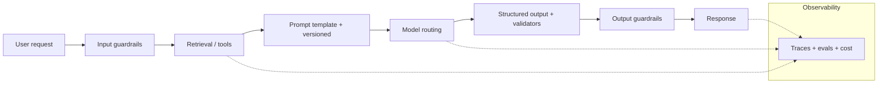

# 5.7 — LLMOps (Prompt versioning, evals, safety, cost)

## 1. Intuition first
Operating LLMs in production is different from classical ML: prompts are the code, models come from vendors, outputs are open-ended, and costs scale with tokens. LLMOps stitches these into a repeatable engineering discipline.

## 2. Why the topic exists
Naive LLM integration explodes in cost, breaks silently after model updates, leaks data, and is unmonitorable. LLMOps prevents that.

## 3. What problem it solves
Ship, evaluate, monitor, and improve LLM features safely and economically.

## 4. Building blocks

### 4.1 Prompt & tool versioning
Prompts stored in Git (or a prompt registry like Humanloop, Langfuse), versioned, code-reviewed, tied to a model version.

### 4.2 Evaluation (see 3.12)
Golden datasets, LLM-judge, human review, red-team suite integrated into CI.

### 4.3 Guardrails
- Input classifiers (PII, prompt injection, jailbreak).
- Output classifiers (toxicity, groundedness).
- Constrained decoding / JSON schemas.
- Refusal policies (Llama-Guard, Rebuff).
- Rate limits per user.

### 4.4 Cost & latency
- Model routing (cheap model first, escalate on uncertainty).
- Prompt caching (Anthropic, OpenAI batch, semantic cache).
- Distillation to smaller model.
- Quantization (INT4/INT8/FP8) for open-source.
- Speculative decoding.

### 4.5 Observability
LangSmith, Langfuse, Helicone, Traceloop, Arize AX — log every LLM call with inputs, outputs, tokens, latency, cost, evals.

### 4.6 Data & privacy
Redact PII before sending to vendor; log to your infra only; use enterprise agreements (zero-retention).

### 4.7 Fine-tuning lifecycle
SFT / DPO / continued pretraining pipeline with LoRA adapters + registry.

## 5. Formulas
Approx. cost = tokens_in × price_in + tokens_out × price_out.

## 6. Variables
Tokens, model, temperature, tool-call count, cache hit rate, latency, refusal rate, faithfulness.

## 7. Algorithm — production LLM feature checklist
1. Prompt in Git, template with typed inputs.
2. Golden set + evals in CI.
3. Guardrails (input + output).
4. Structured outputs (JSON schema + validators + retries).
5. Model routing + caching.
6. Observability (traces + evals dashboard).
7. Cost + rate limiting per tenant.
8. Fallbacks (primary → secondary model, then static response).
9. Human feedback loop.
10. Periodic red-team + safety review.

## 8. Simple example
Support chatbot: prompt template + retrieved docs → LLM → JSON `{answer, citations}` → verifier LLM checks citations → return.

## 9. Real-world example
- Cursor's coding agent — logs traces + evals internal changes.
- Notion AI, Slack AI, Zendesk AI — full LLMOps stacks.
- Perplexity — model routing between OSS + closed models.

## 10. Diagram


## 11. Implementation from scratch
Use a slim `promptbook.py` that stores prompt versions + evals in JSON — Git-track it.

## 12. Implementation using libraries
- **LangSmith** (LangChain) / **Langfuse** / **Helicone** — tracing + evals.
- **Guardrails AI**, **Rebuff**, **Llama-Guard** — safety.
- **Instructor**, **Outlines**, **Guidance** — structured outputs.
- **DSPy** — auto prompt optimization.
- **LiteLLM** — unified LLM API + routing.
- **Portkey**, **OpenRouter** — gateways.

Example:
```python
from litellm import Router
router = Router(model_list=[
  {"model_name": "cheap", "litellm_params": {"model": "gpt-4o-mini"}},
  {"model_name": "premium", "litellm_params": {"model": "gpt-4o"}},
], routing_strategy="least-busy")
```

## 13. Time / cost complexity
Per request cost tracked; aggregate cost per feature per tenant per day.

## 14. Space complexity
Trace logs can be huge — sample or aggregate.

## 15. Advantages
Predictable quality; safer; cheaper; auditable.

## 16. Disadvantages
Toolchain young and fragmented; upfront investment.

## 17. Interview questions
1. Prompt injection — what and mitigations.
2. Structured outputs — three techniques.
3. Model routing strategies.
4. Prompt caching mechanics.
5. Distillation for cost reduction.
6. Guardrails vs constitutional prompting.
7. How to A/B test prompts safely.
8. Handling PII with vendor models.
9. Compliance (SOC 2, GDPR) for LLM apps.
10. Building a golden eval set — process.

## 18. Common mistakes
- Prompts scattered in code, no versioning.
- No eval harness.
- Trusting model outputs blindly.
- Ignoring cost until the bill hits.

## 19. Optimization techniques
Semantic cache, batching, prompt compression, adaptive model sizes, structured outputs, streaming to reduce perceived latency.

## 20. Coding exercises
1. Wire LangSmith / Langfuse to a chatbot.
2. Add Guardrails AI JSON schema validator with retries.
3. Add semantic prompt cache with Redis.
4. Add a Llama-Guard input filter.

## 21. Mini project
Support chatbot with prompt registry + evals + guardrails + cost monitoring.

## 22. Medium project
Full LLMOps platform for one team: prompt versioning, evals in CI, tracing, cost dashboard.

## 23. Advanced project
Enterprise-grade LLM gateway: multi-tenant routing, PII redaction, per-tenant cost limits, red-team automation, human-in-the-loop review UI.

## 24. Where it is used in industry
Every serious LLM product.

## 25. How companies use it
- Notion, Slack, Zendesk, Intercom AI features.
- Perplexity, Cursor, Cognition (Devin).
- Enterprise deployments in banks / pharma.

## 26. When NOT to use it
- Toy prototypes — but move to LLMOps before user-facing launch.
