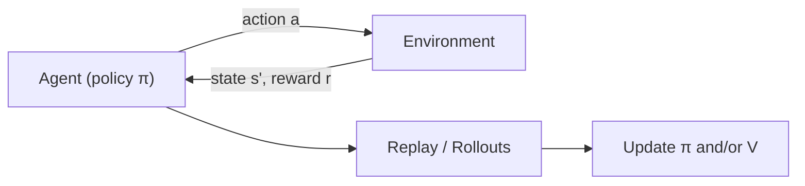

# 6.1 — Reinforcement Learning (MDP → DQN → PPO → RLHF)

## 1. Intuition first
An agent takes actions in an environment; the environment returns rewards. Learn a policy that maximizes long-term reward. Unlike supervised learning, you get feedback only after acting, and the actions influence future data.

## 2. Why the topic exists
Optimal control problems (robotics, games, recommendations, alignment) don't have labeled correct answers — only rewards. RL provides a principled framework.

## 3. What problem it solves
Sequential decision-making under uncertainty; policy optimization from delayed rewards; alignment of LLMs (RLHF/PPO).

## 4. Mathematics

### 4.1 Markov Decision Process (MDP)
Tuple $(S, A, P, R, \gamma)$: states, actions, transition dynamics, reward, discount.

### 4.2 Value functions
State value: $V^\pi(s) = \mathbb{E}_\pi[\sum_t \gamma^t r_t | s_0 = s]$.
Action value: $Q^\pi(s, a)$.

### 4.3 Bellman equations
$V^\pi(s) = \sum_a \pi(a|s) \sum_{s'} P(s'|s,a)[R + \gamma V^\pi(s')]$.
$Q^*(s,a) = \sum_{s'} P(s'|s,a)[R + \gamma \max_{a'} Q^*(s', a')]$.

### 4.4 Q-learning
Off-policy TD: $Q(s,a) \leftarrow Q(s,a) + \alpha[r + \gamma \max_{a'} Q(s',a') - Q(s,a)]$.

### 4.5 DQN (Mnih 2015)
Neural Q-function; replay buffer; target network; Atari-level performance.

### 4.6 Policy gradients (REINFORCE)
$\nabla J = \mathbb{E}[\nabla \log \pi_\theta(a|s) \cdot G_t]$.

### 4.7 Actor-Critic
Combine policy (actor) + value (critic) → A2C, A3C.

### 4.8 PPO (Schulman 2017)
Clipped surrogate objective:

$$
L^{CLIP} = \mathbb{E}\big[\min(r_t A_t, \text{clip}(r_t, 1-\epsilon, 1+\epsilon) A_t)\big]
$$

with $r_t = \tfrac{\pi_\theta(a|s)}{\pi_{\theta_\text{old}}(a|s)}$ and advantage $A_t$ from GAE.

### 4.9 SAC / TD3
Off-policy continuous-control actor-critics.

### 4.10 Model-based RL (Dyna, Dreamer)
Learn a world model; plan in imagination.

### 4.11 RLHF (see 3.6)
PPO on LLM policy with reward from a preference model + KL regularization.

## 5. Every formula explained
- Bellman equations decompose long-term reward into immediate reward + discounted future.
- Q-learning bootstraps future value estimates.
- PPO clipping prevents huge policy updates that destabilize training.
- GAE reduces variance of advantage estimation.

## 6. Variables
$\pi$ policy; $V, Q$ value functions; $\gamma$ discount; $\alpha$ learning rate; $\epsilon$ clip range; $A_t$ advantage.

## 7. Algorithm — PPO (high level)
1. Roll out policy in env, collect (s, a, r, s') trajectories.
2. Compute advantages with GAE.
3. Multiple epochs of minibatch updates on the clipped surrogate + value loss + entropy bonus.
4. Repeat.

## 8. Simple example
CartPole with PPO: solve in a few thousand steps.

## 9. Real-world example
- AlphaGo / AlphaZero (self-play + MCTS + RL).
- OpenAI Five (Dota 2), AlphaStar (StarCraft II).
- Robotics (dexterous manipulation, locomotion).
- Recommender systems (contextual bandits, off-policy learning).
- LLM alignment (RLHF).

## 10. Diagram


## 11. Implementation from scratch — tiny REINFORCE
```python
import torch, torch.nn as nn, torch.optim as optim
class Policy(nn.Module):
    def __init__(self, s, a):
        super().__init__(); self.net = nn.Sequential(nn.Linear(s, 64), nn.Tanh(), nn.Linear(64, a))
    def forward(self, x): return torch.distributions.Categorical(logits=self.net(x))

policy = Policy(4, 2); opt = optim.Adam(policy.parameters(), 1e-3)
for episode in range(500):
    log_probs, rewards = [], []
    s, _ = env.reset()
    done = False
    while not done:
        dist = policy(torch.tensor(s).float()); a = dist.sample()
        log_probs.append(dist.log_prob(a))
        s, r, done, _, _ = env.step(a.item()); rewards.append(r)
    R = 0; returns = []
    for r in rewards[::-1]:
        R = r + 0.99 * R; returns.insert(0, R)
    returns = torch.tensor(returns); returns = (returns - returns.mean()) / (returns.std() + 1e-8)
    loss = -torch.stack([lp * R for lp, R in zip(log_probs, returns)]).sum()
    opt.zero_grad(); loss.backward(); opt.step()
```

## 12. Implementation using libraries
- **Gymnasium** for environments.
- **Stable-Baselines3** (SB3) — PPO, SAC, DQN, DDPG.
- **CleanRL** — single-file implementations, great for learning.
- **RLlib** (Ray) — distributed.
- **TRL** — RLHF / PPO on LLMs.

```python
from stable_baselines3 import PPO
import gymnasium as gym
env = gym.make("CartPole-v1")
model = PPO("MlpPolicy", env, verbose=1).learn(50_000)
```

## 13. Time complexity
Sample-inefficient. Millions of environment steps for complex tasks.

## 14. Space complexity
Replay buffer for off-policy methods; trajectory buffers for on-policy.

## 15. Advantages
Handles sequential, sparse-reward problems; strong theoretical foundations.

## 16. Disadvantages
Sample-inefficient; unstable; reward hacking; hard to debug; needs good simulators or offline data.

## 17. Interview questions
1. Explain MDP.
2. Bellman equations.
3. On-policy vs off-policy.
4. Q-learning vs SARSA.
5. Policy gradient theorem.
6. PPO — why clipping?
7. GAE.
8. Explore-exploit and $\epsilon$-greedy vs UCB vs Thompson sampling.
9. Model-based vs model-free.
10. RLHF pipeline outline.

## 18. Common mistakes
- Reward shaping that induces unintended behavior.
- Insufficient exploration.
- Wrong discount factor.
- No advantage normalization.

## 19. Optimization techniques
Parallel envs, PPO minibatching, distributed rollouts (IMPALA), curriculum learning, learned intrinsic rewards, offline RL.

## 20. Coding exercises
1. Train DQN on CartPole and LunarLander.
2. Implement PPO from scratch and reproduce SB3 on CartPole.
3. Add prioritized experience replay.
4. Try SAC on Pendulum.

## 21. Mini project
DQN on Atari Breakout via Gymnasium + Pytorch (small model).

## 22. Medium project
Train a bipedal walker with SAC.

## 23. Advanced project
Reproduce a small AlphaZero on Connect-4 (MCTS + self-play + policy network).

## 24. Where it is used in industry
Robotics (Waymo, Boston Dynamics), games (DeepMind), ads (contextual bandits), LLM alignment.

## 25. How companies use it
- Google DeepMind: game & science RL.
- OpenAI: RLHF for LLMs.
- Amazon: bandits for recommendations.

## 26. When NOT to use it
- Supervised labels are available and cheaper.
- Safety-critical settings without a good simulator.
- Extremely sparse rewards without shaping/curriculum.
