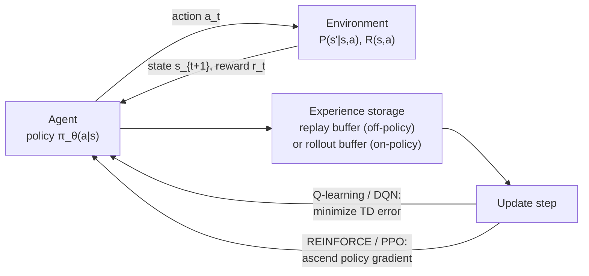
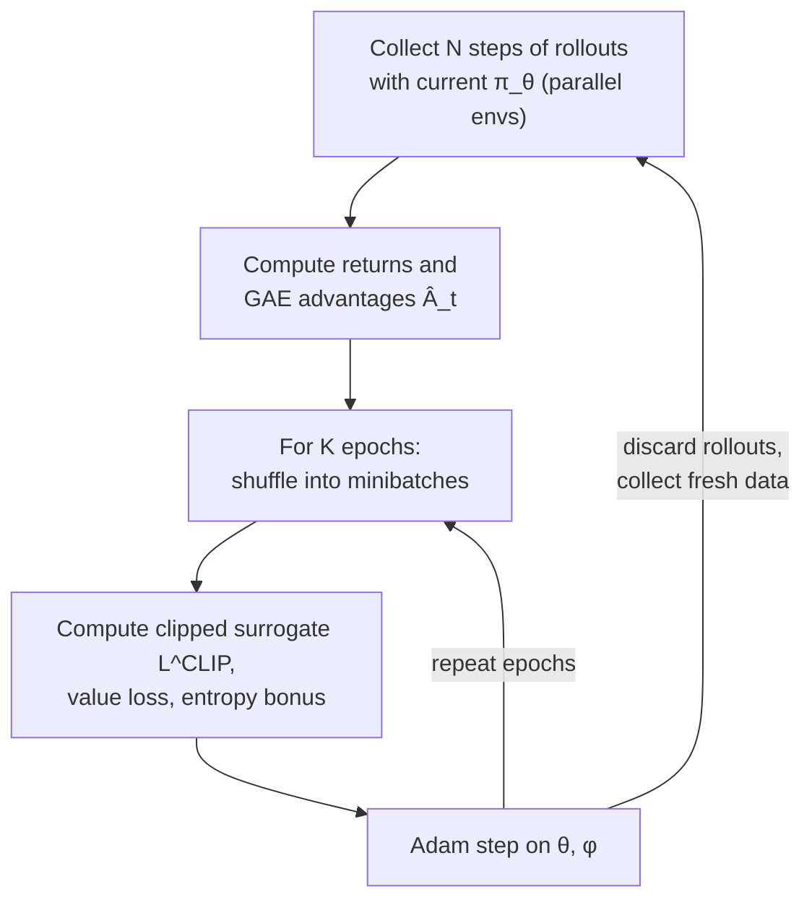
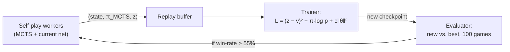

# 6.1 — Reinforcement Learning (MDP → DQN → PPO → RLHF)

## 1. Overview

**What is it?** Reinforcement learning (RL) is the branch of machine learning in which an *agent* learns to make sequences of decisions by interacting with an *environment*. The agent observes a state, chooses an action, receives a numerical *reward*, and lands in a new state. Its goal is to learn a *policy* — a rule for choosing actions — that maximizes cumulative reward over time.

**Why does it exist?** Supervised learning needs a labeled "correct answer" for every input. Many important problems — playing Go, controlling a robot arm, deciding which ad to show, aligning a language model with human preferences — do not come with per-step labels. They only come with *delayed, evaluative feedback*: you find out how well you did after acting, often much later. RL is the principled mathematical framework for learning from that kind of feedback.

**What problem does it solve?** Sequential decision-making under uncertainty. RL solves the *credit assignment problem* (which of my past actions caused this reward?) and the *exploration–exploitation dilemma* (should I use what I know or try something new?).

**Where is it used?** Game-playing systems (AlphaGo, AlphaZero, OpenAI Five), robotics, recommendation and ad systems (contextual bandits), datacenter cooling and chip floor-planning, and — most relevant for the modern LLM era — Reinforcement Learning from Human Feedback (RLHF), the technique that turned base language models into helpful assistants like ChatGPT and Claude.

## 2. Learning Objectives

After this chapter you will be able to:

- Define a Markov Decision Process (MDP) and identify its five components in a real problem.
- Derive the Bellman expectation and Bellman optimality equations from the definition of return.
- Explain the difference between value-based, policy-based, and actor-critic methods.
- Implement tabular Q-learning from scratch and explain why it converges.
- Describe the three DQN innovations (neural Q-function, replay buffer, target network) and why each is necessary.
- Derive the policy gradient theorem and implement REINFORCE in PyTorch.
- Explain variance-reduction with baselines and Generalized Advantage Estimation (GAE).
- Write down the PPO clipped surrogate objective and explain what the clipping accomplishes.
- Distinguish on-policy from off-policy algorithms and know when each is appropriate.
- Connect PPO to the RLHF pipeline used to align large language models.
- Diagnose common RL failure modes: reward hacking, insufficient exploration, and unstable training.
- Choose between DQN, PPO, and SAC for a given control problem.

## 3. Prerequisites

| Chapter | Why you need it |
|---|---|
| [Gradient Descent](../phase-1-classical-ml/03-gradient-descent.md) | Every deep-RL algorithm updates parameters by stochastic gradient steps. |
| [Backpropagation](../phase-2-deep-learning/02-backpropagation.md) | Policy and value networks are trained end-to-end with backprop. |
| [Loss Functions](../phase-2-deep-learning/04-loss-functions.md) | TD error, surrogate objectives, and entropy bonuses are all custom losses. |
| [Optimizers](../phase-2-deep-learning/05-optimizers.md) | Adam is the default optimizer for PPO and DQN; learning-rate choices matter enormously in RL. |
| [Transformers](../phase-2-deep-learning/10-transformer.md) | The RLHF section treats an LLM as the policy network. |
| [RLHF & DPO](../phase-3-nlp-llm/06-rlhf-dpo.md) | This chapter supplies the RL theory (PPO, GAE, KL penalties) that the RLHF chapter uses. |

## 4. Intuition

Imagine teaching a dog to fetch. You cannot hand the dog a labeled dataset of "correct muscle movements." Instead, the dog tries things; when it brings the ball back, it gets a treat. Over many attempts, the dog learns which *sequences* of actions lead to treats. That is reinforcement learning: trial, error, and delayed reward.

Here is an everyday story. You move to a new city and must find a good route to work. Day one, you follow your GPS blindly (a default policy). Day two, you try a side street — it saves five minutes (positive reward). Day three, you try another shortcut — traffic jam (negative reward). Over weeks, you converge on a fast route. Notice three things that map exactly onto RL concepts:

1. **Delayed feedback.** You only learn the total commute time at the end, not after each turn. RL must figure out *which turn* deserves the credit or blame — the credit assignment problem.
2. **Exploration vs. exploitation.** Sticking to your known route (exploitation) is safe; trying new streets (exploration) is the only way to find something better. Too much of either is bad.
3. **Your actions change your future observations.** Turning left puts you on a different street than turning right. Unlike supervised learning, the data distribution *depends on your own behavior* — this is what makes RL fundamentally harder.

An analogy for the value function: think of it as a "how promising is this situation?" score, like a chess player glancing at a board and feeling "White is winning." The policy is the player's actual move choice. Value-based methods learn the feeling and derive moves from it; policy-based methods learn the moves directly.

## 5. Real-world Motivation

- **Google DeepMind** used RL in AlphaGo and AlphaZero to defeat world champions at Go, chess, and shogi through self-play, and applied RL to reduce cooling energy in Google datacenters and to discover faster matrix-multiplication algorithms (AlphaTensor).
- **OpenAI** trained OpenAI Five to beat professional Dota 2 teams using massively-scaled PPO, then reused the same PPO machinery in RLHF to align GPT-3.5/GPT-4 — arguably the single highest-impact industrial application of RL to date.
- **Meta** applies bandit-style and off-policy RL techniques to feed ranking and notification decisions, and released CICERO, a Diplomacy-playing agent combining planning with RL.
- **Amazon** uses contextual bandits (single-step RL) for recommendation and web-page layout optimization, where exploration is cheap and rewards arrive quickly.
- **Tesla** and robotics companies use RL and learned controllers for locomotion and manipulation, typically trained in simulation and transferred to hardware.
- **Anthropic** uses RLHF and RL from AI feedback (Constitutional AI) as core steps of training Claude.

The economic pattern is consistent: RL shines where a *simulator or cheap feedback signal exists* and the decision is *sequential or interactive*.

## 6. Mathematical Foundations

### 6.1 Markov Decision Process

An MDP is a tuple $(\mathcal{S}, \mathcal{A}, P, R, \gamma)$ where:

- $\mathcal{S}$ — the set of states $s$ (e.g., board positions, pixel frames, a partially-written LLM response).
- $\mathcal{A}$ — the set of actions $a$ (moves, motor torques, next token).
- $P(s' \mid s, a)$ — the transition probability of reaching state $s'$ after taking action $a$ in state $s$.
- $R(s, a)$ — the expected immediate reward for taking $a$ in $s$ (sometimes written $r_t$ for the realized reward at time $t$).
- $\gamma \in [0, 1)$ — the discount factor, weighting immediate reward above distant reward.

The **Markov property** states that the future depends only on the current state and action, not on history: $P(s_{t+1} \mid s_t, a_t, s_{t-1}, \dots) = P(s_{t+1} \mid s_t, a_t)$.

A **policy** $\pi(a \mid s)$ is a probability distribution over actions given a state. The **return** from time $t$ is the discounted sum of future rewards:

$$G_t = r_t + \gamma r_{t+1} + \gamma^2 r_{t+2} + \dots = \sum_{k=0}^{\infty} \gamma^k r_{t+k}.$$

Discounting keeps the infinite sum finite (since $\sum_k \gamma^k = \frac{1}{1-\gamma}$ for bounded rewards) and encodes a preference for sooner reward.

### 6.2 Value functions

The **state-value function** of policy $\pi$ is the expected return starting from $s$ and following $\pi$:

$$V^\pi(s) = \mathbb{E}_\pi\!\left[G_t \mid s_t = s\right].$$

The **action-value function** additionally conditions on the first action:

$$Q^\pi(s, a) = \mathbb{E}_\pi\!\left[G_t \mid s_t = s,\, a_t = a\right].$$

They are related by $V^\pi(s) = \sum_a \pi(a \mid s)\, Q^\pi(s, a)$. The **advantage** $A^\pi(s,a) = Q^\pi(s,a) - V^\pi(s)$ measures how much better action $a$ is than the policy's average behavior in $s$.

### 6.3 Bellman equations — derivation

Start from the definition of return and peel off the first reward:

$$G_t = r_t + \gamma \left(r_{t+1} + \gamma r_{t+2} + \dots\right) = r_t + \gamma\, G_{t+1}.$$

Take expectations under $\pi$ conditioned on $s_t = s$:

$$V^\pi(s) = \mathbb{E}_\pi\!\left[r_t + \gamma\, G_{t+1} \mid s_t = s\right].$$

Expand the expectation over the action (drawn from $\pi$) and the next state (drawn from $P$), and use the Markov property so that $\mathbb{E}[G_{t+1} \mid s_{t+1}=s'] = V^\pi(s')$:

$$\boxed{\,V^\pi(s) = \sum_a \pi(a \mid s) \sum_{s'} P(s' \mid s, a)\left[R(s,a) + \gamma\, V^\pi(s')\right]\,}$$

This is the **Bellman expectation equation**: the value of a state equals the expected immediate reward plus the discounted value of wherever you land. It is a system of $|\mathcal{S}|$ linear equations, solvable exactly for small MDPs.

The **Bellman optimality equation** replaces the policy average by a maximization — an optimal agent takes the best action:

$$Q^*(s,a) = \sum_{s'} P(s' \mid s, a)\left[R(s,a) + \gamma \max_{a'} Q^*(s', a')\right], \qquad V^*(s) = \max_a Q^*(s,a).$$

The optimal policy is then greedy: $\pi^*(s) = \arg\max_a Q^*(s,a)$. Because the Bellman optimality operator is a $\gamma$-contraction in the max norm, repeatedly applying it (value iteration) converges to $Q^*$ from any starting point.

### 6.4 Temporal-difference learning and Q-learning

When $P$ and $R$ are unknown, we replace expectations with samples. After observing a transition $(s, a, r, s')$, **Q-learning** updates:

$$Q(s,a) \leftarrow Q(s,a) + \alpha \left[\underbrace{r + \gamma \max_{a'} Q(s', a')}_{\text{TD target}} - Q(s,a)\right],$$

where $\alpha$ is the learning rate and the bracketed term is the **TD error** $\delta$. Q-learning is **off-policy**: the target uses $\max_{a'}$ regardless of which action the behavior policy will actually take, so it learns about the greedy policy while behaving, e.g., $\epsilon$-greedily (choose a random action with probability $\epsilon$, otherwise the greedy one). SARSA is the on-policy sibling: it uses $Q(s', a')$ for the action actually taken.

### 6.5 DQN — deep Q-networks (Mnih et al., 2015)

For large state spaces (Atari pixels), represent $Q_\theta(s,a)$ with a neural network and minimize the squared TD error. Naive implementation diverges, so DQN adds:

1. **Experience replay**: store transitions in a buffer and sample random minibatches, breaking the temporal correlation that violates the i.i.d. assumption of SGD.
2. **Target network**: compute the TD target with a slowly-updated copy $\theta^-$, so the regression target does not chase itself:

$$L(\theta) = \mathbb{E}_{(s,a,r,s') \sim \mathcal{D}}\left[\left(r + \gamma \max_{a'} Q_{\theta^-}(s', a') - Q_\theta(s,a)\right)^2\right].$$

Extensions: Double DQN (decouple action selection from evaluation to reduce the overestimation caused by $\max$ over noisy estimates), Dueling networks (separate $V$ and $A$ heads), Prioritized Experience Replay (sample high-TD-error transitions more often).

### 6.6 Policy gradient theorem and REINFORCE — derivation

Parameterize the policy directly as $\pi_\theta(a \mid s)$ and maximize expected return $J(\theta) = \mathbb{E}_{\tau \sim \pi_\theta}[R(\tau)]$, where $\tau = (s_0, a_0, r_0, s_1, \dots)$ is a trajectory and $R(\tau) = \sum_t \gamma^t r_t$. Write the expectation as an integral over trajectories with density $p_\theta(\tau)$:

$$\nabla_\theta J = \nabla_\theta \int p_\theta(\tau) R(\tau)\, d\tau = \int p_\theta(\tau)\, \nabla_\theta \log p_\theta(\tau)\, R(\tau)\, d\tau,$$

using the **log-derivative trick** $\nabla p = p \nabla \log p$. Now factor the trajectory density: $p_\theta(\tau) = p(s_0) \prod_t \pi_\theta(a_t \mid s_t)\, P(s_{t+1} \mid s_t, a_t)$. Crucially, the environment terms $P$ and $p(s_0)$ do not depend on $\theta$, so they vanish under $\nabla_\theta \log$:

$$\boxed{\,\nabla_\theta J = \mathbb{E}_{\tau \sim \pi_\theta}\left[\sum_t \nabla_\theta \log \pi_\theta(a_t \mid s_t)\; G_t\right]\,}$$

(where we also used causality: action $a_t$ cannot influence rewards before time $t$, so $R(\tau)$ can be replaced with the reward-to-go $G_t$). This is the **policy gradient theorem** — remarkably, we can improve the policy without knowing the environment dynamics. **REINFORCE** is the Monte-Carlo estimator: run episodes, compute $G_t$, and ascend this gradient.

**Baselines.** Subtracting any state-dependent baseline $b(s_t)$ leaves the gradient unbiased, because $\mathbb{E}_{a \sim \pi}[\nabla_\theta \log \pi_\theta(a \mid s)] = \nabla_\theta \sum_a \pi_\theta(a \mid s) = \nabla_\theta 1 = 0$. Choosing $b(s) = V^\pi(s)$ turns the weight into the advantage $A_t = G_t - V(s_t)$, dramatically reducing variance.

### 6.7 Actor-critic and GAE

An **actor-critic** learns both the policy (actor, $\pi_\theta$) and a value function (critic, $V_\phi$). The critic supplies low-variance advantage estimates. **Generalized Advantage Estimation** (Schulman et al., 2016) interpolates between the low-variance/high-bias one-step TD error and the high-variance/low-bias Monte-Carlo return. Define the TD error $\delta_t = r_t + \gamma V(s_{t+1}) - V(s_t)$; then

$$\hat{A}^{\text{GAE}(\gamma, \lambda)}_t = \sum_{l=0}^{\infty} (\gamma \lambda)^l\, \delta_{t+l},$$

where $\lambda \in [0,1]$ controls the bias–variance trade-off ($\lambda = 0$ gives one-step TD; $\lambda = 1$ recovers Monte-Carlo advantage). Typical value: $\lambda = 0.95$.

### 6.8 PPO — the clipped surrogate objective

Large policy updates from a single batch destroy performance because the data was collected under the *old* policy. TRPO constrains the KL divergence between old and new policies; **PPO** (Schulman et al., 2017) achieves the same effect with a simple clipped objective. Define the probability ratio $r_t(\theta) = \frac{\pi_\theta(a_t \mid s_t)}{\pi_{\theta_\text{old}}(a_t \mid s_t)}$. PPO maximizes:

$$L^{\text{CLIP}}(\theta) = \mathbb{E}_t\left[\min\!\Big(r_t(\theta)\, \hat{A}_t,\;\; \text{clip}\big(r_t(\theta),\, 1-\epsilon,\, 1+\epsilon\big)\, \hat{A}_t\Big)\right],$$

with clip range $\epsilon \approx 0.2$. Read it case by case: if $\hat{A}_t > 0$ (good action), the objective grows with $r_t$ but is capped at $(1+\epsilon)\hat{A}_t$ — no incentive to push the probability up by more than 20%. If $\hat{A}_t < 0$ (bad action), the objective is floored at $(1-\epsilon)\hat{A}_t$ — no incentive to push the probability down too far. The $\min$ makes the bound *pessimistic*, so gradients vanish exactly when the update would be too aggressive. The full PPO loss adds a value-function loss and an entropy bonus that encourages exploration:

$$L = -L^{\text{CLIP}} + c_1 \left(V_\phi(s_t) - V^{\text{targ}}_t\right)^2 - c_2\, \mathcal{H}\!\left[\pi_\theta(\cdot \mid s_t)\right],$$

with typical coefficients $c_1 = 0.5$, $c_2 = 0.01$.

### 6.9 Off-policy continuous control: SAC and TD3

For continuous actions, **TD3** stabilizes deterministic actor-critics with twin critics (take the min to fight overestimation), delayed policy updates, and target-policy smoothing. **SAC** maximizes reward *plus* policy entropy, $J = \mathbb{E}[\sum_t r_t + \alpha \mathcal{H}(\pi(\cdot \mid s_t))]$, yielding robust exploration and state-of-the-art sample efficiency on robotics benchmarks.

### 6.10 RLHF connection

In RLHF (detailed in [RLHF & DPO](../phase-3-nlp-llm/06-rlhf-dpo.md)), the LLM is the policy $\pi_\theta$, a state is the prompt plus tokens generated so far, an action is the next token, and the reward comes from a learned preference model $r_\psi$ at the end of the response, minus a per-token KL penalty that keeps the policy near the supervised-fine-tuned reference model $\pi_{\text{ref}}$:

$$r_t^{\text{RLHF}} = \underbrace{r_\psi(x, y)\,\mathbb{1}[t = T]}_{\text{terminal reward}} - \beta \log \frac{\pi_\theta(a_t \mid s_t)}{\pi_{\text{ref}}(a_t \mid s_t)}.$$

PPO then optimizes this reward exactly as in games — every piece of machinery in this chapter (GAE, clipping, value heads) appears verbatim in RLHF codebases like TRL.

## 7. Visual Explanation

The agent–environment loop and where each algorithm family plugs in:



The PPO training loop in detail:



A one-line ASCII picture of the value-bootstrap idea:

```
V(s_t)  ≈  r_t  +  γ · V(s_{t+1})      "today's value = today's reward + discounted tomorrow"
```

## 8. Algorithm

**PPO, step by step:**

1. Initialize policy network $\pi_\theta$ and value network $V_\phi$ (often sharing a trunk).
2. Run the current policy in $M$ parallel environments for $T$ steps each, storing $(s_t, a_t, r_t, \log \pi_\theta(a_t|s_t), V_\phi(s_t))$.
3. Compute TD errors $\delta_t = r_t + \gamma V(s_{t+1}) - V(s_t)$ and GAE advantages $\hat{A}_t = \sum_l (\gamma\lambda)^l \delta_{t+l}$; compute value targets $\hat{R}_t = \hat{A}_t + V(s_t)$.
4. Normalize advantages within the batch (zero mean, unit variance).
5. For $K$ epochs, iterate over shuffled minibatches: compute ratio $r_t(\theta)$, the clipped surrogate, value loss, and entropy bonus; take an Adam step.
6. Discard the rollout data (on-policy!) and go to step 2.

```text
PSEUDOCODE: PPO
---------------
initialize θ (policy), φ (value)
for iteration = 1, 2, ...:
    # 1. Rollout phase — O(M·T) env steps
    D ← {}
    for each of M parallel envs, for t = 1..T:
        a_t ~ π_θ(·|s_t);  store (s_t, a_t, r_t, logπ_old, V(s_t)) in D
    # 2. Advantage phase — single backward pass over time
    for t = T..1:  δ_t = r_t + γ·V(s_{t+1})·(1−done) − V(s_t)
                   Â_t = δ_t + γλ·(1−done)·Â_{t+1}
    Â ← (Â − mean(Â)) / (std(Â) + 1e−8)
    # 3. Update phase — K epochs of minibatch SGD
    for epoch = 1..K:
        for minibatch B ⊂ D:
            r = exp(logπ_θ(a|s) − logπ_old)
            L_clip = mean( min(r·Â, clip(r, 1−ε, 1+ε)·Â) )
            L_v    = mean( (V_φ(s) − (Â + V_old))² )
            L      = −L_clip + 0.5·L_v − 0.01·entropy(π_θ(·|s))
            Adam step on ∇L
```

## 9. Worked Example

**Tiny example solved by hand — Q-learning on a 3-state chain.** States $\{s_1, s_2, s_3\}$, actions $\{L, R\}$. Moving $R$ from $s_2$ reaches terminal $s_3$ with reward $+10$; every other move has reward $0$; $\gamma = 0.9$, $\alpha = 0.5$. Initialize all $Q = 0$.

*Episode 1:* start in $s_2$, take $R$, receive $r = 10$, reach terminal.
$$Q(s_2, R) \leftarrow 0 + 0.5 \left[10 + 0.9 \cdot 0 - 0\right] = 5.$$

*Episode 2:* start in $s_1$, take $R$ to $s_2$ ($r = 0$). The max over next actions is $Q(s_2, R) = 5$:
$$Q(s_1, R) \leftarrow 0 + 0.5 \left[0 + 0.9 \cdot 5 - 0\right] = 2.25.$$
Then from $s_2$ take $R$ again: $Q(s_2, R) \leftarrow 5 + 0.5[10 - 5] = 7.5$.

Watch the reward *propagate backward* through bootstrapping: $Q(s_2,R) \to 10$ and $Q(s_1,R) \to 9$ in the limit — exactly $\gamma \cdot 10$, as the Bellman equation demands. Every deep-RL method is this arithmetic at scale.

**Realistic example — CartPole with PPO.** CartPole-v1 has a 4-dimensional state (cart position/velocity, pole angle/angular velocity), 2 actions (push left/right), reward $+1$ per step alive, capped at 500. A 2-layer MLP policy trained with PPO (2048-step rollouts, $\gamma = 0.99$, $\lambda = 0.95$, $\epsilon = 0.2$, learning rate $3\times10^{-4}$) typically reaches the maximum score of 500 within 50k–100k environment steps — a few minutes on a laptop CPU. This is the standard smoke test for any PPO implementation.

## 10. Python from Scratch

Tabular Q-learning with pure NumPy on a 4×4 GridWorld (start top-left, goal bottom-right, reward $+1$ at goal, $-0.01$ per step):

```python
import numpy as np

N = 4                                   # grid is N x N; states are cell indices 0..15
GOAL = N * N - 1                        # bottom-right cell
ACTIONS = [(-1, 0), (1, 0), (0, -1), (0, 1)]   # up, down, left, right

def step(s, a):
    """Environment dynamics: deterministic moves, walls clip to grid."""
    r, c = divmod(s, N)                              # state index -> (row, col)
    dr, dc = ACTIONS[a]
    r2, c2 = min(max(r + dr, 0), N - 1), min(max(c + dc, 0), N - 1)
    s2 = r2 * N + c2                                 # (row, col) -> state index
    reward = 1.0 if s2 == GOAL else -0.01            # small step penalty encourages short paths
    return s2, reward, s2 == GOAL                    # (next state, reward, done)

Q = np.zeros((N * N, 4))               # Q-table, shape (16 states, 4 actions), init 0
alpha, gamma, eps = 0.5, 0.9, 0.1      # learning rate, discount, exploration rate

for episode in range(2000):
    s, done = 0, False
    while not done:
        # ε-greedy: explore with prob ε, otherwise act greedily on current Q
        a = np.random.randint(4) if np.random.rand() < eps else int(Q[s].argmax())
        s2, r, done = step(s, a)
        # TD target bootstraps from the best next action (off-policy max)
        target = r + gamma * (0 if done else Q[s2].max())
        Q[s, a] += alpha * (target - Q[s, a])        # move Q toward the target
        s = s2

# Greedy policy read-out: argmax over actions per state
print(Q.max(axis=1).reshape(N, N).round(2))
```

**Expected output:** the value map increases smoothly toward the goal, e.g. the top-left corner shows $\approx 0.48$ and the cells adjacent to the goal show $\approx 1.0$ — each step away from the goal multiplies value by $\gamma$ minus the step penalty. The greedy policy traces a shortest path.

**Complexity:** each update is $O(|\mathcal{A}|)$ for the max; an episode is at most tens of steps; the table is $O(|\mathcal{S}| \cdot |\mathcal{A}|) = 64$ floats.

> [!WARNING]
> **Common bug:** forgetting the `(0 if done else ...)` mask on the bootstrap term. Bootstrapping *past a terminal state* leaks phantom future value into the goal state, inflates all Q-values, and often makes the agent circle the goal instead of entering it. The same bug — a missing `done` mask — is the single most frequent error in DQN and PPO implementations too.

## 11. Library Implementation

REINFORCE with a value baseline in PyTorch on CartPole (Gymnasium), then the one-liner alternatives:

```python
import gymnasium as gym
import torch, torch.nn as nn

env = gym.make("CartPole-v1")

class ActorCritic(nn.Module):
    def __init__(self, obs_dim=4, n_actions=2):
        super().__init__()
        self.body = nn.Sequential(nn.Linear(obs_dim, 64), nn.Tanh())  # shared trunk
        self.pi = nn.Linear(64, n_actions)   # policy head -> action logits
        self.v = nn.Linear(64, 1)            # value head  -> baseline V(s)

    def forward(self, x):                    # x: (obs_dim,) float tensor
        h = self.body(x)
        return torch.distributions.Categorical(logits=self.pi(h)), self.v(h)

net = ActorCritic()
opt = torch.optim.Adam(net.parameters(), lr=3e-4)
gamma = 0.99

for episode in range(1000):
    s, _ = env.reset()
    log_probs, values, rewards = [], [], []
    done = False
    while not done:                                       # roll out one full episode
        dist, v = net(torch.as_tensor(s, dtype=torch.float32))
        a = dist.sample()                                 # stochastic action, shape ()
        log_probs.append(dist.log_prob(a))                # keep grad-carrying log-prob
        values.append(v.squeeze())
        s, r, term, trunc, _ = env.step(a.item())
        done = term or trunc
        rewards.append(r)

    # Discounted returns G_t, computed backward in O(T)
    G, returns = 0.0, []
    for r in reversed(rewards):
        G = r + gamma * G
        returns.insert(0, G)
    returns = torch.tensor(returns)                       # shape (T,)
    values = torch.stack(values)                          # shape (T,), requires grad

    adv = returns - values.detach()                       # advantage = G_t − V(s_t); detach: no critic grad through actor loss
    adv = (adv - adv.mean()) / (adv.std() + 1e-8)         # normalize for stable scale

    policy_loss = -(torch.stack(log_probs) * adv).sum()   # REINFORCE with baseline
    value_loss = ((returns - values) ** 2).mean()         # critic regression to returns
    loss = policy_loss + 0.5 * value_loss
    opt.zero_grad(); loss.backward(); opt.step()
```

Expected behavior: episode return climbs from ~20 to 500 within a few hundred episodes. For production-grade baselines, use libraries: **Stable-Baselines3** (`PPO("MlpPolicy", env).learn(100_000)`), **CleanRL** (single-file reference implementations, ideal for learning), **RLlib** (distributed), and **TRL** (`PPOTrainer` for RLHF on LLMs).

## 12. Code Walkthrough

Inputs, outputs, and shapes for the actor-critic code above:

| Tensor | Shape | Meaning |
|---|---|---|
| `s` | `(4,)` | CartPole observation: cart pos, cart vel, pole angle, pole angular vel |
| `self.pi(h)` | `(2,)` | Unnormalized logits over {push-left, push-right} |
| `a` | `()` scalar | Sampled action index |
| `dist.log_prob(a)` | `()` scalar | $\log \pi_\theta(a\mid s)$ — the quantity the policy gradient differentiates |
| `values` | `(T,)` | Critic estimates $V_\phi(s_t)$ for each step of the episode |
| `returns` | `(T,)` | Monte-Carlo returns $G_t$ (targets for the critic) |
| `adv` | `(T,)` | Normalized advantages weighting each log-prob |

Intermediate check: after computing `returns` for a 200-step episode with $\gamma = 0.99$, `returns[0]` should be $\approx \sum_{k=0}^{199} 0.99^k \approx 86.6$, not 200 — a good sanity assertion. Expected result after training: `sum(rewards)` per episode reaches 500 consistently. The `detach()` on values when forming advantages is load-bearing: without it, the policy loss backpropagates into the critic with the wrong sign and training stalls.

## 13. Complexity Analysis

- **Tabular Q-learning:** time $O(|\mathcal{A}|)$ per transition (the max); space $O(|\mathcal{S}||\mathcal{A}|)$ for the table. Converges to $Q^*$ under Robbins–Monro step sizes and infinite exploration, but the table is infeasible beyond ~$10^6$ states.
- **DQN:** each gradient step costs one forward+backward pass, $O(\text{network})$ per minibatch; the replay buffer costs $O(\text{capacity} \times \text{state size})$ memory — for Atari, 1M frames ≈ 7 GB unless frames are stored as uint8.
- **REINFORCE:** unbiased but variance grows with horizon $T$; sample complexity is the practical bottleneck, often $10^6$–$10^8$ env steps.
- **PPO:** per iteration, rollout cost $O(M \cdot T)$ env steps plus $K$ epochs of minibatch updates over the same data — reusing each sample $K$ times (typically 3–10) is what makes PPO more sample-efficient than vanilla policy gradient while remaining stable. GAE is a single $O(T)$ backward scan.
- The overall lesson: **RL is compute- and sample-hungry**; wall-clock is usually dominated by environment simulation, which is why parallel/vectorized environments matter so much.

## 14. Advantages

- **Learns from evaluative feedback only.** AlphaZero reached superhuman chess with no human game data — just win/loss signals from self-play.
- **Handles sequential structure and delayed reward natively.** A supervised model cannot represent "sacrifice a pawn now to win in 20 moves"; the Bellman equation does so by construction.
- **Optimizes non-differentiable objectives.** RLHF optimizes human preference scores; you cannot backprop through "which answer did the human like?", but you can policy-gradient through it.
- **Adapts online.** Contextual bandits at Amazon and Netflix keep exploring, so recommendations track changing catalogs and tastes without full retraining.
- **Strong theory underneath.** Contraction mappings, the policy gradient theorem, and convergence guarantees make principled debugging possible in the tabular limit.

## 15. Disadvantages

- **Sample inefficiency.** OpenAI Five consumed thousands of GPU-years of self-play; most physical systems cannot afford millions of trials, forcing simulators (and sim-to-real gaps).
- **Instability and seed variance.** The same PPO code with 10 random seeds can produce returns differing by 2×; deep RL results are notoriously hard to reproduce.
- **Reward hacking.** Agents optimize the *written* reward, not the *intended* one — the classic boat-racing agent that circles collecting power-ups instead of finishing the race; in RLHF, sycophantic or verbose answers that game the reward model.
- **Deadly triad.** Combining function approximation + bootstrapping + off-policy learning can provably diverge; DQN's tricks are mitigations, not cures.
- **Hard to debug.** A silent bug (advantage sign flip, missing done-mask) produces "just mediocre" learning curves rather than crashes.
- **Poor fit for one-shot prediction problems** where supervised labels exist — RL adds variance for zero benefit.

## 16. Common Mistakes

- **Bootstrapping through terminal states** (no `done` mask) → inflated values. *Fix:* multiply the bootstrap term by `(1 − done)`; treat time-limit truncation differently from true termination.
- **No advantage normalization** → gradient scale swings wildly between batches. *Fix:* standardize advantages per batch (as in Section 11).
- **Wrong discount factor.** $\gamma = 0.9$ means rewards 50 steps away are worth $0.9^{50} \approx 0.5\%$ — invisible. *Fix:* set $\gamma$ so the effective horizon $\frac{1}{1-\gamma}$ covers the task's reward delay ($\gamma = 0.99$ → ~100 steps).
- **Insufficient exploration:** greedy-from-the-start Q-learning locks onto the first rewarding path found. *Fix:* $\epsilon$-greedy with decay, entropy bonuses, or intrinsic motivation.
- **Reward shaping that changes the optimal policy.** Adding "+0.1 for moving toward the goal" can create reward loops. *Fix:* use potential-based shaping $F = \gamma\Phi(s') - \Phi(s)$, which provably preserves optimal policies.
- **Reusing on-policy data.** Training PPO for 50 epochs on one rollout batch makes the ratio $r_t$ meaningless. *Fix:* 3–10 epochs, and monitor the approximate KL between old and new policy; early-stop the epoch loop when KL exceeds ~0.02.
- **Evaluating with the exploration policy.** Report greedy/deterministic evaluation returns separately from training returns.

## 17. Best Practices

- Start from a known-good reference (CleanRL, SB3) and verify on CartPole/Pendulum *before* your real task — RL bugs masquerade as hyperparameter problems.
- Run ≥3 seeds; report mean and spread. Single-seed RL results are noise.
- Log everything: episodic return, policy entropy (should decay slowly, not collapse), approximate KL per update, value-loss explained variance, and gradient norms.
- Normalize observations (running mean/std) and clip rewards or use reward scaling; unnormalized inputs are a top-3 cause of silent failure.
- Use vectorized environments (`gym.vector` or SB3 `SubprocVecEnv`) — rollout collection parallelizes trivially.
- Prefer PPO as the default for discrete or continuous tasks; switch to SAC when sample efficiency on continuous control matters; use DQN variants for discrete tasks with cheap off-policy data.
- Checkpoint both the model *and* the observation-normalization statistics — a common deployment bug is restoring one without the other.
- In RLHF, monitor the KL from the reference model; runaway KL means the policy is drifting into reward-model exploitation territory.

## 18. Optimization Techniques

- **Parallel rollouts:** vectorized envs give near-linear speedups for on-policy methods; IMPALA-style architectures decouple actors from learners for cluster-scale RL.
- **Minibatching + multiple epochs (PPO):** re-using each sample 3–10 times is the built-in sample-efficiency lever.
- **Mixed precision & `torch.compile`:** policy networks are small, so gains are modest — but for RLHF, where the policy is a multi-billion-parameter LLM, bf16, [LoRA/PEFT](../phase-3-nlp-llm/07-lora-peft.md) adapters, and gradient checkpointing (see [Distributed Training](03-distributed-training.md)) are essential.
- **Prioritized replay** (off-policy): sample transitions proportionally to $|\delta|$, correcting bias with importance weights.
- **Frame stacking & action repeat** (Atari): cheap ways to inject short-term memory and cut decision frequency.
- **Curriculum learning:** start with easy task variants and increase difficulty — often the difference between solving and not solving sparse-reward tasks.
- **Observation/reward normalization:** running statistics; arguably the highest ROI trick in continuous control.

## 19. Industry Applications

- **LLM alignment (production, massive scale):** OpenAI (InstructGPT → ChatGPT), Anthropic (Claude, via RLHF and RLAIF/Constitutional AI), Meta (Llama chat models) all run PPO-family or closely related algorithms over transformer policies.
- **Games & research:** DeepMind's AlphaGo/AlphaZero/MuZero and AlphaStar; OpenAI Five. These systems doubled as testbeds for the algorithms now used in alignment.
- **Recommendations & ads:** contextual bandits at Amazon, Netflix artwork personalization, ad-allocation systems — single-step RL with rigorous off-policy evaluation.
- **Operations:** DeepMind's datacenter-cooling controllers for Google; chip floorplanning (AlphaChip) reported used in TPU design.
- **Robotics & autonomy:** locomotion and manipulation policies trained in simulation (NVIDIA Isaac, DeepMind/Google robotics); Tesla and Waymo use learned decision components in planning stacks.
- **Science:** AlphaTensor (faster matrix multiplication), plasma-control for fusion reactors (DeepMind + EPFL).

## 20. Interview Questions

### Beginner

**Q: What are the five components of an MDP?**
A: States $\mathcal{S}$, actions $\mathcal{A}$, transition dynamics $P(s'|s,a)$, reward function $R(s,a)$, and discount factor $\gamma$. The Markov property says the next state depends only on the current state and action.

**Q: Why do we discount future rewards?**
A: Discounting keeps infinite-horizon returns finite ($\sum \gamma^k$ converges), expresses preference for sooner reward, and models uncertainty about the far future. $\frac{1}{1-\gamma}$ acts as an effective planning horizon.

**Q: What is the difference between a policy and a value function?**
A: A policy $\pi(a|s)$ says *what to do*; a value function $V^\pi(s)$ or $Q^\pi(s,a)$ says *how good* a state (or state-action pair) is under that policy. Value-based methods derive the policy from values; policy-based methods learn the policy directly.

**Q: Explain exploration vs. exploitation with an example.**
A: Exploitation uses current knowledge (order your usual dish); exploration gathers information (try a new dish that might be better). $\epsilon$-greedy is the simplest mechanism: act randomly with probability $\epsilon$, greedily otherwise.

**Q: How does RL differ from supervised learning?**
A: No per-example labels — only evaluative, often delayed, reward; the data distribution depends on the agent's own actions (non-i.i.d.); and the agent must handle credit assignment and exploration.

### Intermediate

**Q: Derive the Bellman expectation equation.**
A: From $G_t = r_t + \gamma G_{t+1}$, take expectations conditioned on $s_t = s$ under $\pi$, expand over actions and next states, and use the Markov property: $V^\pi(s) = \sum_a \pi(a|s) \sum_{s'} P(s'|s,a)[R(s,a) + \gamma V^\pi(s')]$.

**Q: Q-learning vs. SARSA?**
A: Both are TD methods. Q-learning's target uses $\max_{a'} Q(s',a')$ (off-policy: learns the greedy policy regardless of behavior), SARSA uses $Q(s',a')$ for the action actually taken (on-policy: learns the value of the behavior policy including its exploration). On the cliff-walk task, SARSA learns the safe path, Q-learning the risky optimal one.

**Q: Why does DQN need a replay buffer and a target network?**
A: The buffer breaks temporal correlations so minibatches are approximately i.i.d.; the target network freezes the regression target so the network isn't chasing its own moving predictions — both address instabilities of the deadly triad.

**Q: Why can we subtract a baseline in the policy gradient without adding bias?**
A: Because $\mathbb{E}_{a\sim\pi}[\nabla_\theta \log \pi_\theta(a|s)\, b(s)] = b(s) \nabla_\theta \sum_a \pi_\theta(a|s) = b(s)\nabla_\theta 1 = 0$. A good baseline ($V(s)$) reduces variance without shifting the expected gradient.

**Q: What does $\lambda$ in GAE control?**
A: The bias–variance trade-off in advantage estimation: $\lambda=0$ gives the one-step TD error (low variance, biased by the imperfect critic); $\lambda=1$ gives Monte-Carlo advantages (unbiased, high variance). $\lambda \approx 0.95$ is a robust default.

### Advanced

**Q: Explain exactly how PPO's clipping prevents destructive updates, case by case.**
A: With ratio $r_t$ and advantage $\hat{A}_t$: if $\hat{A}_t > 0$, the objective is $\min(r_t \hat{A}_t, (1+\epsilon)\hat{A}_t)$ — once $r_t > 1+\epsilon$ the gradient w.r.t. $\theta$ is zero, so there is no incentive to increase the action's probability further. If $\hat{A}_t < 0$, the floor at $(1-\epsilon)\hat{A}_t$ similarly kills the gradient once the probability has dropped 
by a factor $1-\epsilon$. The outer $\min$ ensures the bound only binds pessimistically, so the surrogate is a lower bound on the true objective near $\theta_\text{old}$.

**Q: What is the deadly triad and how do modern algorithms mitigate it?**
A: Function approximation + bootstrapping + off-policy learning together can diverge (Baird's counterexample). Mitigations: target networks and replay (DQN), double estimators against max-overestimation (Double DQN, TD3's twin critics), constraining update size (TRPO/PPO), and entropy regularization (SAC).

**Q: In RLHF, why is a KL penalty against the reference model necessary?**
A: The reward model is an imperfect proxy trained on limited preference data. Unconstrained PPO will exploit its errors (reward hacking), producing degenerate high-reward text. The per-token KL penalty $-\beta \log(\pi_\theta/\pi_{\text{ref}})$ keeps the policy within the distribution where the reward model is accurate and preserves the base model's capabilities.

**Q: Why is Q-learning's max operator biased, and what fixes it?**
A: $\mathbb{E}[\max_a \hat{Q}(s,a)] \geq \max_a \mathbb{E}[\hat{Q}(s,a)]$ (Jensen): maximizing over noisy estimates systematically overestimates. Double Q-learning decouples selection (argmax with one network) from evaluation (value from the other), removing the correlation that causes the bias.

**Q: When would you choose SAC over PPO?**
A: Continuous control with expensive samples (robotics): SAC is off-policy and reuses a replay buffer, typically 5–10× more sample-efficient than PPO; its entropy maximization also gives robust exploration. PPO wins when environment steps are cheap and parallelizable, when actions are discrete/token-valued (RLHF), or when simplicity and stability matter most.

## 21. Coding Exercises

### Easy

1. **Value iteration on GridWorld.** Implement value iteration for the 4×4 grid of Section 10 using known dynamics; verify Q-learning converges to the same values. *Hint:* iterate $V(s) \leftarrow \max_a \sum_{s'} P[R + \gamma V(s')]$ until the max change is below $10^{-6}$.
2. **$\epsilon$-greedy bandit.** Implement a 10-armed Gaussian bandit and compare $\epsilon \in \{0, 0.01, 0.1\}$ over 1000 steps, averaged over 200 runs. *Hint:* track the running-average reward per arm; reproduce Figure 2.2 of Sutton & Barto.

### Medium

1. **DQN on CartPole and LunarLander.** Implement DQN with replay buffer and target network; reach 475+ on CartPole and 200+ on LunarLander. *Hint:* buffer size 50k, target update every 500 steps, $\epsilon$ decayed 1.0 → 0.05 over 10k steps.
2. **Prioritized experience replay.** Add proportional prioritization ($p_i = |\delta_i| + \epsilon$) with importance-sampling weights to your DQN; compare learning curves. *Hint:* a sum-tree makes sampling $O(\log N)$.
3. **SARSA vs. Q-learning on CliffWalk.** Implement both on Gymnasium's `CliffWalking-v0` and plot the paths each learns. *Hint:* SARSA should hug the safe upper row.

### Hard

1. **PPO from scratch.** Implement PPO with GAE, minibatching, and advantage normalization; match Stable-Baselines3's learning curve on CartPole and Pendulum within 2×. *Hint:* validate GAE against a brute-force $O(T^2)$ computation on a random reward sequence first.
2. **SAC on Pendulum.** Implement SAC with twin critics and automatic entropy-coefficient tuning; solve `Pendulum-v1` (average return > −200). *Hint:* the reparameterization trick — sample $a = \tanh(\mu + \sigma \odot \epsilon)$ — is required for the actor gradient; don't forget the tanh log-det correction.
3. **Mini-RLHF.** Fine-tune GPT-2-small with TRL's `PPOTrainer` to maximize a sentiment classifier's positive score on movie-review continuations, with a KL penalty. *Hint:* start from the official TRL sentiment example; plot reward vs. KL to observe the reward/drift trade-off.

## 22. Mini Project

**DQN plays Atari Breakout.**

1. Set up `gymnasium[atari]` with the standard wrappers: grayscale, resize to 84×84, frame-stack 4, max-and-skip 4, reward clipping to $\{-1, 0, +1\}$.
2. Implement the Nature-DQN CNN: three conv layers (32×8×8/4, 64×4×4/2, 64×3×3/1) → FC-512 → Q-values, input shape `(4, 84, 84)` stored as uint8.
3. Build a 200k-transition replay buffer (uint8 frames to fit in RAM) and a target network synced every 10k steps.
4. Train with Adam (lr $10^{-4}$), $\epsilon$: 1.0 → 0.1 over 1M frames, for 5–10M frames.
5. Log per-episode return and evaluation score (greedy policy, 30 no-op starts) every 250k frames.
6. Deliverable: learning curve reaching ~30+ average return (bricks broken) and a rendered gameplay GIF.

## 23. Medium Project

**Bipedal locomotion with SAC.**

1. Environment: `BipedalWalker-v3` (24-dim observation, 4-dim continuous action).
2. Implement or adapt SAC: twin Q-networks, squashed-Gaussian actor, automatic temperature tuning targeting entropy $-\dim(\mathcal{A})$.
3. Add observation normalization and a 1M-transition replay buffer; train 1–2M steps.
4. Run 3 seeds; plot mean ± std of evaluation return (target: 300+, i.e., "solved").
5. Ablate: remove twin critics, then remove entropy tuning — quantify each component's contribution.
6. Stretch: transfer the trained policy to `BipedalWalkerHardcore-v3` and fine-tune with a curriculum.

## 24. Advanced Project

**Mini-AlphaZero for Connect-4.**

*Architecture:*



*Implementation phases:*

1. **Game engine:** bitboard Connect-4 with fast legal-move generation and win detection; unit-test exhaustively.
2. **Network:** small ResNet (4–8 blocks) with policy head (7 logits) and value head (tanh scalar) over a 2×6×7 board encoding.
3. **MCTS:** PUCT selection $a = \arg\max_a \left[ Q(s,a) + c_{\text{puct}} \, P(s,a) \frac{\sqrt{\sum_b N(s,b)}}{1 + N(s,a)} \right]$, with Dirichlet noise at the root for exploration; 100–400 simulations per move.
4. **Self-play loop:** generate games with temperature $\tau = 1$ for the first 10 moves, then $\tau \to 0$; store $(s, \pi_{\text{MCTS}}, z)$ triples with symmetry augmentation (horizontal flip).
5. **Training:** minimize $(z - v)^2 - \pi^\top \log p + c\|\theta\|^2$; gate new checkpoints by head-to-head evaluation.
6. **Evaluation:** measure Elo against random, a 1-ply heuristic, and a perfect solver (Connect-4 is solved — first player wins).

*Possible improvements:* replace evaluation gating with continuous training (AlphaZero-style), add a MuZero-style learned dynamics model, parallelize MCTS with virtual loss, or port self-play to GPU-batched inference for 10× throughput.

## 25. Summary

- RL formalizes sequential decision-making as an MDP $(\mathcal{S}, \mathcal{A}, P, R, \gamma)$; the goal is a policy maximizing expected discounted return.
- The Bellman equations decompose value recursively — *value now = reward now + discounted value next* — and their contraction property underwrites value iteration and TD learning.
- Q-learning is off-policy TD control; it scales to deep networks (DQN) only with experience replay and target networks.
- The policy gradient theorem, $\nabla J = \mathbb{E}[\nabla \log \pi_\theta(a|s) \, \hat{A}]$, lets us optimize policies directly through non-differentiable environments; baselines remove variance without adding bias.
- Actor-critic methods pair a policy with a learned value baseline; GAE's $\lambda$ tunes the bias–variance trade-off of advantage estimates.
- PPO's clipped ratio objective keeps updates near the data-collecting policy — simple, stable, and the industry default from games to RLHF.
- Off-policy methods (DQN, SAC, TD3) reuse data and win on sample efficiency; on-policy methods (PPO) win on stability and simplicity.
- RLHF is PPO with an LLM as the policy, a preference-model reward, and a KL leash to the reference model.
- The classic failure modes — reward hacking, missing done-masks, no exploration, un-normalized advantages — cause most real-world RL pain.
- RL is sample-hungry: use it when feedback is cheap (simulators, self-play, user interactions), not when supervised labels exist.

## 26. Cheat Sheet

| Concept | Formula |
|---|---|
| Return | $G_t = \sum_{k\ge0} \gamma^k r_{t+k}$ |
| Bellman expectation | $V^\pi(s) = \sum_a \pi(a\vert s)\sum_{s'} P[R + \gamma V^\pi(s')]$ |
| Bellman optimality | $Q^*(s,a) = \sum_{s'} P[R + \gamma \max_{a'} Q^*(s',a')]$ |
| Q-learning update | $Q \mathrel{+}= \alpha[r + \gamma \max_{a'}Q(s',a') - Q(s,a)]$ |
| Policy gradient | $\nabla J = \mathbb{E}[\nabla\log\pi_\theta(a\vert s)\,\hat A_t]$ |
| TD error | $\delta_t = r_t + \gamma V(s_{t+1}) - V(s_t)$ |
| GAE | $\hat A_t = \sum_l (\gamma\lambda)^l \delta_{t+l}$ |
| PPO clip | $\min(r_t \hat A_t,\ \text{clip}(r_t, 1\pm\epsilon)\hat A_t)$ |
| RLHF reward | $r_\psi(x,y) - \beta\, \mathrm{KL}(\pi_\theta \| \pi_{\text{ref}})$ |

**Default hyperparameters (PPO):** $\gamma = 0.99$, $\lambda = 0.95$, clip $\epsilon = 0.2$, lr $3\times10^{-4}$, rollout 2048 steps × 8 envs, 10 epochs, minibatch 64, value coef 0.5, entropy coef 0.01.

**One-liners:** normalize advantages per batch; mask bootstrap with `(1 − done)`; monitor KL and entropy; ≥3 seeds always; test on CartPole before anything real.

**Gotchas:** time-limit truncation ≠ termination (bootstrap through truncations); `max` overestimates (use double estimators); on-policy data expires after the update; reward shaping must be potential-based to preserve optimality.

## 27. Further Reading

**Books**
- Sutton & Barto, *Reinforcement Learning: An Introduction* (2nd ed., 2018) — the canonical text, free online.
- Csaba Szepesvári, *Algorithms for Reinforcement Learning* — compact theory.

**Research Papers**
- Mnih et al., "Human-level control through deep reinforcement learning" (DQN, Nature 2015).
- Schulman et al., "Trust Region Policy Optimization" (2015); "High-Dimensional Continuous Control Using Generalized Advantage Estimation" (2016); "Proximal Policy Optimization Algorithms" (2017).
- Haarnoja et al., "Soft Actor-Critic" (2018); Fujimoto et al., "TD3" (2018).
- Silver et al., "Mastering the game of Go without human knowledge" (AlphaGo Zero, 2017); Schrittwieser et al., "MuZero" (2020).
- Ouyang et al., "Training language models to follow instructions with human feedback" (InstructGPT, 2022).

**Documentation**
- OpenAI Spinning Up in Deep RL (spinningup.openai.com) — the best pedagogical resource for the math-to-code gap.
- Gymnasium docs; Stable-Baselines3 docs; TRL docs (Hugging Face).

**GitHub Repositories**
- `vwxyzjn/cleanrl` — single-file, benchmarked implementations.
- `DLR-RM/stable-baselines3`; `huggingface/trl`; `ray-project/ray` (RLlib).

**Datasets / Benchmarks**
- Arcade Learning Environment (Atari), MuJoCo/Gymnasium control suites, D4RL (offline RL), Procgen.

**YouTube / Videos**
- David Silver's UCL RL course (10 lectures, DeepMind).
- Sergey Levine's CS 285 (UC Berkeley Deep RL) lectures.

**Blogs**
- Lilian Weng, "A (Long) Peek into Reinforcement Learning" and "Policy Gradient Algorithms."
- Andy Jones, "Debugging RL Without the Agonizing Pain"; the "37 Implementation Details of PPO" blog post (Huang et al.).
