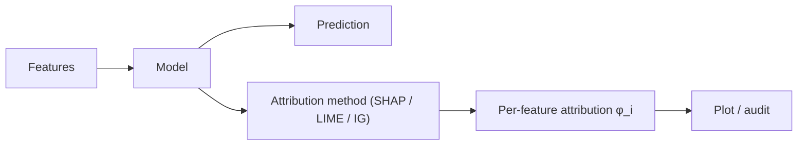

# 6.2 — Model Interpretability (SHAP, LIME, Attention Viz, Probing)

## 1. Intuition first
A model that only says "yes" or "no" is a black box. Interpretability techniques answer *why*: which features drove the decision, which examples are most similar, what concepts the model has learned.

## 2. Why the topic exists
- Regulatory requirements (finance, healthcare).
- Debugging models.
- Detecting biases / spurious correlations.
- User trust.

## 3. What problem it solves
Explain individual predictions (local) and global model behavior; identify features / neurons / attention patterns responsible for outputs.

## 4. Methods

### 4.1 Global
- Permutation feature importance.
- Partial dependence plots (PDP), ICE plots.
- Global surrogate models (train a small tree to mimic a big model).

### 4.2 Local
- LIME: fit a local linear model around a prediction.
- SHAP: Shapley values from cooperative game theory:
$\phi_i = \sum_{S\subseteq F\setminus\{i\}} \tfrac{|S|! (|F|-|S|-1)!}{|F|!} [f(S\cup\{i\}) - f(S)]$.
Kernel SHAP, Tree SHAP (exact for trees), Deep SHAP.
- Integrated gradients (IG) for deep nets.
- Saliency maps, Grad-CAM (CNNs).
- Attention weights (interpret with care — not always faithful).

### 4.3 Concept-based
- TCAV (Testing with Concept Activation Vectors).
- Sparse Autoencoders on LLM internals (Anthropic, OpenAI).
- Probing tasks (linear classifiers on hidden states to test what's encoded).

### 4.4 Counterfactual
"What is the smallest change to input that would flip the prediction?" (DiCE, Wachter).

### 4.5 Fairness auditing
Disparate impact ratio, equalized odds, calibration by subgroup.

## 5. Every formula explained
Shapley value = weighted average of marginal contributions across all coalitions — theoretically unique fair attribution.

## 6. Variables
Feature attributions $\phi_i$; baseline value; number of samples for approximation.

## 7. Algorithm — SHAP on tree ensemble
1. Train XGBoost.
2. `explainer = shap.TreeExplainer(model)`.
3. `values = explainer(X)`.
4. Plot summary / dependence / force plots.

## 8. Simple example
Loan model: SHAP shows top negative feature is `debt_to_income` for a denied application.

## 9. Real-world example
- Banks use SHAP for reason codes (regulatory requirement).
- Medical diagnostic tools show heatmaps.
- Anthropic's Sparse Autoencoder mechanistic interp on Claude.

## 10. Diagram


## 11. Implementation from scratch — permutation importance
```python
import numpy as np
def perm_importance(model, X, y, metric, n=5):
    base = metric(y, model.predict(X))
    scores = []
    for j in range(X.shape[1]):
        drops = []
        for _ in range(n):
            X2 = X.copy(); np.random.shuffle(X2[:, j])
            drops.append(base - metric(y, model.predict(X2)))
        scores.append(np.mean(drops))
    return np.array(scores)
```

## 12. Implementation using libraries
```python
import shap
explainer = shap.TreeExplainer(model)
shap_values = explainer(X_test)
shap.plots.beeswarm(shap_values)
shap.plots.waterfall(shap_values[0])

from lime.lime_tabular import LimeTabularExplainer
LimeTabularExplainer(X_train, feature_names=names).explain_instance(X_test[0], model.predict_proba)

from captum.attr import IntegratedGradients   # PyTorch
```

## 13. Time complexity
Exact SHAP is exponential; approximations (Tree SHAP for trees, sampled Kernel SHAP) are polynomial.

## 14. Space complexity
Attribution arrays same size as features.

## 15. Advantages
Trust; debugging; regulatory compliance.

## 16. Disadvantages
Approximate; can mislead if used naively; attention ≠ explanation.

## 17. Interview questions
1. Shapley values — properties (efficiency, symmetry, dummy, additivity).
2. LIME vs SHAP.
3. Global vs local explanations.
4. Attention weights as explanations — pitfalls.
5. Integrated gradients — axioms.
6. Grad-CAM for CNNs.
7. What is fairness, and metrics.
8. Counterfactual explanations.
9. Sparse autoencoders for LLM interp — intuition.
10. Reason codes in credit scoring.

## 18. Common mistakes
- Interpreting SHAP as causal.
- Ignoring correlated features → misleading importance.
- Using LIME on unstable models.
- Confusing attribution with causation.

## 19. Optimization techniques
Tree SHAP for gradient boosting; sample-based approximations; batched attribution.

## 20. Coding exercises
1. Compute SHAP on a LightGBM Titanic model.
2. Compare permutation importance and MDI.
3. Grad-CAM on a fine-tuned ResNet.
4. Probe hidden states of BERT for POS-tagging with a linear classifier.

## 21. Mini project
Interpretability report for a loan-approval model, including SHAP, PDP, and fairness metrics.

## 22. Medium project
Mechanistic interpretability mini-study: find an induction head in a tiny GPT.

## 23. Advanced project
Train sparse autoencoders on LLM residual streams and identify monosemantic features (Anthropic-style).

## 24. Where it is used in industry
Finance, healthcare, HR, law — anywhere explanations are required or trust matters.

## 25. How companies use it
- Banks: reason codes for adverse actions.
- Healthcare: attention visualizations for MDs.
- Anthropic: interpretability research on frontier LLMs.

## 26. When NOT to use it
- When the model isn't deployed against users — but still valuable for debugging.
- When explanations mislead (e.g., naive attention viz on transformers).
