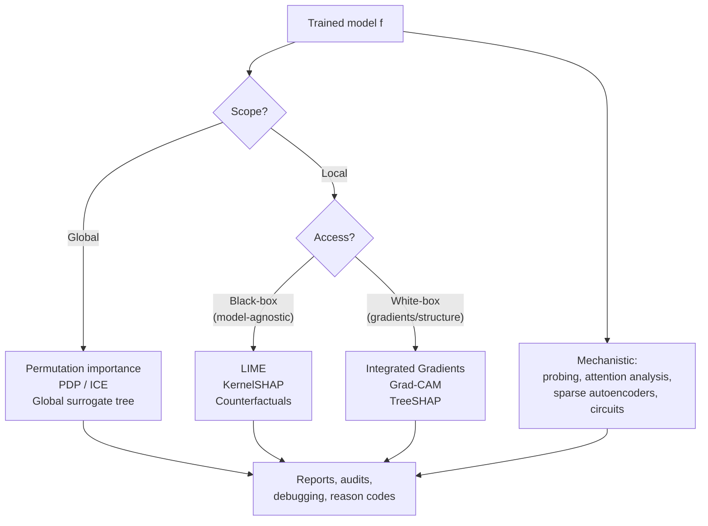
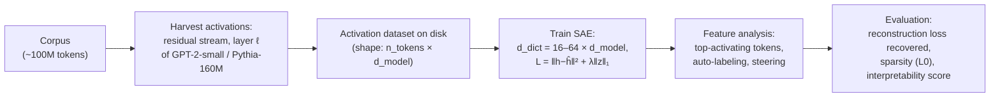

# 6.2 — Model Interpretability (SHAP, LIME, Attention Viz, Probing)

## 1. Overview

**What is it?** Model interpretability is the set of techniques that answer *why* a model made a prediction: which input features drove the decision, how predictions change as features vary, and what internal representations the model has learned.

**Why does it exist?** Modern models — gradient-boosted trees with thousands of splits, neural networks with billions of weights — are accurate but opaque. A model that only outputs "loan denied" is a black box; regulators, doctors, engineers, and users all need reasons. Interpretability turns predictions into explanations.

**What problem does it solve?** Three related problems: (1) **local explanation** — why did the model produce *this* output for *this* input; (2) **global explanation** — how does the model behave overall, which features matter most; (3) **mechanistic understanding** — what algorithms and concepts are implemented inside the network's weights and activations.

**Where is it used?** Credit scoring (legally mandated "reason codes" for adverse actions), medical diagnostics (heatmaps that show clinicians *where* a model sees pathology), model debugging (finding spurious correlations like watermarks or backgrounds), fairness auditing, and frontier-lab safety research (sparse autoencoders on LLM internals at Anthropic and OpenAI).

## 2. Learning Objectives

After this chapter you will be able to:

- Distinguish local vs. global and model-agnostic vs. model-specific explanation methods, and pick the right one for a task.
- Implement permutation feature importance from scratch and explain its failure mode with correlated features.
- Construct and read partial dependence plots (PDP) and ICE plots.
- Explain how LIME fits a local surrogate model and where it breaks.
- State the four Shapley axioms, derive the Shapley value formula, and explain why it is the unique fair attribution.
- Use TreeSHAP and KernelSHAP correctly and interpret beeswarm/waterfall plots.
- Derive integrated gradients and explain the completeness axiom it satisfies.
- Apply Grad-CAM to a CNN and produce class-discriminative heatmaps.
- Explain why attention weights are not automatically explanations.
- Run a linear probing experiment on transformer hidden states.
- Describe how sparse autoencoders extract monosemantic features from LLM activations, and what an induction head is.
- Avoid the classic interpretation errors: attribution ≠ causation, correlated-feature artifacts, unstable explanations.

## 3. Prerequisites

| Chapter | Why you need it |
|---|---|
| [Linear Regression](../phase-1-classical-ml/02-linear-regression.md) | LIME and probing both fit linear models; coefficients-as-explanations starts here. |
| [Gradient Boosting](../phase-1-classical-ml/10-gradient-boosting.md) | TreeSHAP is the standard explanation tool for XGBoost/LightGBM models. |
| [Backpropagation](../phase-2-deep-learning/02-backpropagation.md) | Gradient-based attributions (saliency, integrated gradients, Grad-CAM) are computed with backprop. |
| [CNNs](../phase-2-deep-learning/07-cnn.md) | Grad-CAM operates on convolutional feature maps. |
| [Attention & Self-Attention](../phase-2-deep-learning/09-attention.md) | Needed to understand attention visualization and its pitfalls. |
| [Transformers](../phase-2-deep-learning/10-transformer.md) | Probing and mechanistic interpretability analyze transformer residual streams. |
| [Autoencoders](../phase-2-deep-learning/11-autoencoders.md) | Sparse autoencoders for LLM interpretability are a direct application. |

## 4. Intuition

Imagine a bank employee who must tell a customer why their loan was denied. "The computer said no" is not acceptable — legally or humanly. The employee needs something like: "Your debt-to-income ratio is high (that hurt you most), your credit history is short (that hurt a little), and your income helped but not enough." That sentence *is* a feature attribution: each factor gets a share of the responsibility for the decision.

The central analogy for the most principled attribution method — Shapley values — comes from splitting a bill. Three friends run a food stall together and earn $900. Alice alone would earn $300, Bob alone $200, and together they'd earn $700 (they complement each other); Carol contributes crowd-drawing charm worth different amounts depending on who she joins. How do you split the $900 *fairly*? Lloyd Shapley's 1953 answer: imagine every possible order in which the team could have been assembled, compute what each person *adds at the moment they join*, and average over all orders. That average marginal contribution is each person's fair share. Replace "friends" with "features" and "earnings" with "model prediction," and you have SHAP.

A second everyday story for local surrogates (LIME): a mountain range is far too complex to describe globally, but if you stand at one spot, the ground around your feet is approximately a tilted plane — you can say "it slopes up to the north-east." LIME does exactly this: it cannot summarize the whole model, but around one prediction it fits a simple linear model whose coefficients read like a local map.

And for mechanistic interpretability: instead of asking the chef (the model) why the dish tastes this way, you walk into the kitchen and watch which stations (neurons, attention heads) do what. Probing checks whether an ingredient is present in the pantry (is part-of-speech information linearly readable from layer 5?); sparse autoencoders re-organize a cluttered pantry into labeled jars (monosemantic features).

## 5. Real-world Motivation

- **Banks and lenders** (Capital One, American Express, and fintechs) use SHAP-style attributions to generate the adverse-action reason codes required by the US Equal Credit Opportunity Act and FCRA; the EU GDPR and AI Act push in the same direction.
- **Microsoft** ships `InterpretML` and integrates explanation dashboards into Azure ML; **Google** provides Explainable AI (feature attributions, including integrated gradients) in Vertex AI.
- **Healthcare**: diagnostic imaging models present Grad-CAM-style heatmaps so radiologists can verify the model looked at the lesion, not the scanner annotation — a real failure mode documented in pneumonia-detection studies where models keyed on hospital-specific tokens.
- **Anthropic** published "Towards Monosemanticity" and "Scaling Monosemanticity," using sparse autoencoders to extract millions of interpretable features from Claude's activations (including the famous "Golden Gate Bridge" feature); **OpenAI** published work using GPT-4 to label neurons in GPT-2. This research direction exists because you cannot align what you cannot inspect.
- **Debugging everywhere**: teams routinely discover data leakage (a feature that encodes the label) or spurious shortcuts (huskies classified by snow in the background) *only* after looking at attributions.

## 6. Mathematical Foundations

### 6.1 Permutation feature importance

Let $f$ be a trained model, $D = \{(x_i, y_i)\}$ a validation set, and $M(f, D)$ a performance metric (higher = better). The importance of feature $j$ is the performance drop when feature $j$'s column is randomly permuted (breaking its relationship with the target while preserving its marginal distribution):

$$\text{PI}_j = M(f, D) - \mathbb{E}_{\text{perm}}\left[M(f, D^{(j)}_{\text{perm}})\right],$$

where $D^{(j)}_{\text{perm}}$ is $D$ with column $j$ shuffled. Large drop → the model relies on that feature.

### 6.2 Partial dependence and ICE

The partial dependence of $f$ on feature $j$ shows the average prediction as feature $j$ is varied while all other features $x_{-j}$ keep their observed values:

$$\text{PDP}_j(v) = \frac{1}{n} \sum_{i=1}^{n} f(v,\, x_{-j}^{(i)}).$$

An **ICE plot** draws one line per instance, $f(v, x_{-j}^{(i)})$ as a function of $v$, revealing heterogeneity that the PDP average hides. Caveat: both evaluate the model on *unrealistic* combinations when $x_j$ correlates with $x_{-j}$.

### 6.3 LIME

For an instance $x$, LIME finds a simple surrogate $g$ (usually sparse linear) that mimics $f$ *near* $x$:

$$g^* = \arg\min_{g \in G} \; \sum_{z \in Z} \pi_x(z) \left(f(z) - g(z)\right)^2 + \Omega(g),$$

where $Z$ is a set of perturbed samples around $x$ (features masked or resampled), $\pi_x(z) = \exp(-d(x,z)^2 / \sigma^2)$ is a proximity kernel that weights samples by closeness to $x$, and $\Omega$ penalizes complexity (e.g., limits the number of nonzero coefficients). The surrogate's coefficients are the explanation. Explanations depend on the kernel width $\sigma$ and the sampling — this is LIME's instability.

### 6.4 Shapley values: axioms and derivation

Model features as players in a cooperative game. Let $F$ be the set of all features and $v(S)$ the "payout" of a coalition $S \subseteq F$ — for us, the model's expected prediction when only features in $S$ are known: $v(S) = \mathbb{E}[f(x) \mid x_S]$. An attribution $\phi_i$ should satisfy four axioms:

1. **Efficiency:** $\sum_i \phi_i = v(F) - v(\emptyset)$ — attributions sum to the prediction minus the baseline.
2. **Symmetry:** if $v(S \cup \{i\}) = v(S \cup \{j\})$ for all $S$, then $\phi_i = \phi_j$ — interchangeable features get equal credit.
3. **Dummy (null player):** if $v(S \cup \{i\}) = v(S)$ for all $S$, then $\phi_i = 0$ — an unused feature gets nothing.
4. **Additivity:** attributions for game $v + w$ equal attributions for $v$ plus attributions for $w$ — consistency across ensembles.

Shapley (1953) proved there is exactly **one** attribution satisfying all four. Derivation sketch: consider adding players one at a time in a uniformly random order $\sigma$. Player $i$'s marginal contribution in order $\sigma$ is $v(S_\sigma^i \cup \{i\}) - v(S_\sigma^i)$, where $S_\sigma^i$ is the set of players before $i$ in $\sigma$. Averaging over all $|F|!$ orders, and noting that a given coalition $S$ (of size $|S|$) precedes $i$ in exactly $|S|!\,(|F| - |S| - 1)!$ orders, gives:

$$\boxed{\;\phi_i = \sum_{S \subseteq F \setminus \{i\}} \frac{|S|!\,(|F| - |S| - 1)!}{|F|!} \left[v(S \cup \{i\}) - v(S)\right]\;}$$

The weight is exactly the probability that, in a random ordering, the players before $i$ are precisely $S$. Efficiency follows because marginal contributions telescope along any single ordering; symmetry, dummy, and additivity follow directly from the formula's structure. **SHAP** (Lundberg & Lee, 2017) is this applied to models, with practical estimators: **KernelSHAP** (a weighted linear regression that provably recovers Shapley values), **TreeSHAP** (exact, polynomial-time for tree ensembles by dynamic programming over tree paths), and **DeepSHAP** (a DeepLIFT-based approximation for networks).

### 6.5 Integrated gradients

Plain gradient saliency $\partial f / \partial x_i$ fails when the model has saturated (a feature can matter enormously yet have zero local gradient). **Integrated gradients** (Sundararajan et al., 2017) accumulates gradients along a straight path from a baseline $x'$ (e.g., a black image or zero embedding) to the input $x$:

$$\text{IG}_i(x) = (x_i - x'_i) \int_0^1 \frac{\partial f\!\left(x' + \alpha (x - x')\right)}{\partial x_i} \, d\alpha,$$

approximated in practice by a Riemann sum over $m \approx 20\text{–}300$ steps. By the fundamental theorem of calculus for line integrals, IG satisfies **completeness**: $\sum_i \text{IG}_i(x) = f(x) - f(x')$ — the attributions exactly account for the prediction difference. It also satisfies sensitivity (a feature that changes the output gets nonzero attribution) and implementation invariance (functionally equal networks get equal attributions).

### 6.6 Grad-CAM

For a CNN, let $A^k \in \mathbb{R}^{H \times W}$ be the $k$-th feature map of the last convolutional layer and $y^c$ the pre-softmax score for class $c$. Grad-CAM weights each map by the spatially-pooled gradient:

$$\alpha_k^c = \frac{1}{HW} \sum_{u,v} \frac{\partial y^c}{\partial A^k_{uv}}, \qquad L^c_{\text{Grad-CAM}} = \text{ReLU}\!\left(\sum_k \alpha_k^c A^k\right).$$

The ReLU keeps only regions that *positively* influence class $c$; the coarse $H \times W$ map is upsampled onto the input image as a heatmap.

### 6.7 Probing

A **probe** is a small classifier (usually linear) trained to predict a property $z$ (part of speech, syntax depth, sentiment) from a frozen model's hidden state $h_\ell(x)$ at layer $\ell$: $\hat{z} = \text{softmax}(W h_\ell + b)$. High probe accuracy means the property is *linearly decodable* from that layer — evidence the model represents it. Control tasks (random labels) are needed to check the probe isn't just memorizing.

### 6.8 Sparse autoencoders (mechanistic interpretability)

Individual neurons in LLMs are **polysemantic** — one neuron fires for many unrelated concepts — because the model compresses more features than it has dimensions (**superposition**). A sparse autoencoder (SAE) decomposes activations $h \in \mathbb{R}^d$ into an overcomplete, sparse code $z \in \mathbb{R}^{d_{\text{dict}}}$ with $d_{\text{dict}} \gg d$:

$$z = \text{ReLU}(W_e h + b_e), \qquad \hat{h} = W_d z + b_d, \qquad L = \|h - \hat{h}\|_2^2 + \lambda \|z\|_1.$$

The $\ell_1$ penalty (coefficient $\lambda$) forces most of $z$ to zero, so each active dictionary direction tends to correspond to one human-interpretable concept — a **monosemantic feature**. Anthropic's work scaled this to millions of features on production models.

## 7. Visual Explanation

Taxonomy and pipeline of explanation methods:



How a Shapley value is assembled for feature $i$:

```
order 1:  { } --+i-->  contribution v({i}) − v(∅)
order 2:  {A} --+i-->  contribution v({A,i}) − v({A})
order 3:  {B} --+i-->  contribution v({B,i}) − v({B})
order 4:  {A,B} --+i-> contribution v({A,B,i}) − v({A,B})
                        φ_i = weighted average of all of these
```

## 8. Algorithm

**KernelSHAP, step by step** (model-agnostic Shapley estimation):

1. Choose a background dataset (e.g., 100 training rows) to represent "feature absent" by marginal replacement.
2. For the instance $x$, sample coalitions $S \subseteq F$: binary masks $z \in \{0,1\}^{|F|}$ indicating which features keep their value from $x$ and which are filled from background rows.
3. Evaluate the model on each masked sample to get $f(h_x(z))$.
4. Weight each coalition by the Shapley kernel $w(z) = \frac{|F| - 1}{\binom{|F|}{|z|} |z| (|F| - |z|)}$ (this specific kernel makes the regression recover Shapley values).
5. Fit weighted linear regression $f(h_x(z)) \approx \phi_0 + \sum_i \phi_i z_i$ subject to $\phi_0 + \sum \phi_i = f(x)$.
6. Return coefficients $\phi_i$ as attributions.

```text
PSEUDOCODE: KernelSHAP for one instance x
-----------------------------------------
B ← background rows                    # defines v(∅) = mean f(B)
Z ← sample K coalition masks z ∈ {0,1}^F
for each z in Z:
    x_masked ← x where z=1, background values where z=0   # average over B
    y_z ← f(x_masked)
    w_z ← shapley_kernel(|z|, F)
φ ← weighted_least_squares(Z, y, w, constraint: sum(φ)=f(x)−E[f])
return φ                               # one attribution per feature
```

## 9. Worked Example

**Tiny example by hand — exact Shapley values with 2 features.** A credit model over features {Income ($I$), Debt ($D$)} outputs approval scores:

- $v(\emptyset) = 50$ (average score, nothing known)
- $v(\{I\}) = 70$ (knowing this applicant's high income raises the score)
- $v(\{D\}) = 40$ (knowing their high debt lowers it)
- $v(\{I, D\}) = 65$ (the actual prediction)

Two orderings. Order $(I, D)$: $I$ adds $70 - 50 = 20$; $D$ adds $65 - 70 = -5$. Order $(D, I)$: $D$ adds $40 - 50 = -10$; $I$ adds $65 - 40 = 25$. Average:

$$\phi_I = \tfrac{1}{2}(20 + 25) = 22.5, \qquad \phi_D = \tfrac{1}{2}(-5 - 10) = -7.5.$$

Check efficiency: $22.5 + (-7.5) = 15 = v(\{I,D\}) - v(\emptyset) = 65 - 50$. ✓ Income contributed +22.5 points, debt −7.5 — exactly the reason-code sentence from Section 4.

**Realistic example.** An XGBoost income classifier on the UCI Adult dataset (48k rows, 12 features). TreeSHAP produces exact attributions for all rows in under a second; the beeswarm plot typically shows `marital-status`, `capital-gain`, `education-num`, and `age` dominating, and a waterfall plot for one individual decomposes their log-odds prediction into per-feature pushes that sum exactly to the model output — efficiency in action at production scale.

## 10. Python from Scratch

Permutation importance and exact Shapley values, NumPy only:

```python
import numpy as np
from itertools import combinations
from math import factorial

def permutation_importance(model, X, y, metric, n_repeats=5, seed=0):
    """Importance of feature j = drop in metric when column j is shuffled."""
    rng = np.random.default_rng(seed)
    base = metric(y, model.predict(X))          # baseline score, scalar
    imp = np.zeros(X.shape[1])
    for j in range(X.shape[1]):
        drops = []
        for _ in range(n_repeats):              # repeat to average shuffle noise
            Xp = X.copy()
            rng.shuffle(Xp[:, j])               # break feature-target link only
            drops.append(base - metric(y, model.predict(Xp)))
        imp[j] = np.mean(drops)
    return imp                                  # shape (n_features,)

def exact_shapley(value_fn, n_features):
    """Exact Shapley values; value_fn(frozenset S) -> v(S). O(2^F) — toy sizes only."""
    F = set(range(n_features))
    phi = np.zeros(n_features)
    for i in range(n_features):
        for size in range(n_features):          # coalitions not containing i
            for S in combinations(F - {i}, size):
                w = factorial(len(S)) * factorial(n_features - len(S) - 1) / factorial(n_features)
                phi[i] += w * (value_fn(frozenset(S) | {i}) - value_fn(frozenset(S)))
    return phi

# Reproduce the Section 9 hand calculation:
v = {frozenset(): 50, frozenset({0}): 70, frozenset({1}): 40, frozenset({0, 1}): 65}
print(exact_shapley(lambda S: v[S], 2))   # -> [22.5, -7.5]
```

**Expected output:** `[22.5 -7.5]`, matching the hand calculation, and their sum equals $v(F) - v(\emptyset) = 15$ (efficiency).

**Complexity:** permutation importance is $O(n_{\text{features}} \cdot n_{\text{repeats}} \cdot \text{cost}(f))$; exact Shapley is $O(2^{|F|})$ coalition evaluations — feasible up to ~15 features, hence the approximations.

> [!WARNING]
> **Common bug:** shuffling the feature column *in place* on the original array (`rng.shuffle(X[:, j])` without `X.copy()`). Every subsequent feature is then evaluated against corrupted data, and importances after the first feature are garbage. Always copy before permuting.

## 11. Library Implementation

The standard production stack — SHAP for trees, LIME for a second opinion, Captum for deep nets:

```python
import shap, xgboost, numpy as np
from sklearn.model_selection import train_test_split

# --- TreeSHAP on a gradient-boosting model (exact, fast) ---
X, y = shap.datasets.adult()                      # UCI Adult: (32561, 12)
X_tr, X_te, y_tr, y_te = train_test_split(X, y, random_state=0)
model = xgboost.XGBClassifier(n_estimators=200, max_depth=4).fit(X_tr, y_tr)

explainer = shap.TreeExplainer(model)             # exact Shapley via tree paths
sv = explainer(X_te)                              # sv.values: (n_test, 12) log-odds units
shap.plots.beeswarm(sv)                           # global: each dot = one person-feature
shap.plots.waterfall(sv[0])                       # local: one prediction decomposed

# --- LIME on the same model ---
from lime.lime_tabular import LimeTabularExplainer
lime_exp = LimeTabularExplainer(X_tr.values, feature_names=X.columns.tolist(),
                                class_names=["<=50K", ">50K"], mode="classification")
exp = lime_exp.explain_instance(X_te.values[0], model.predict_proba, num_features=5)
print(exp.as_list())                              # [(feature condition, weight), ...]

# --- Integrated Gradients on a PyTorch net (Captum) ---
import torch
from captum.attr import IntegratedGradients
net.eval()                                        # any trained nn.Module
ig = IntegratedGradients(net)
x = torch.tensor(X_te.values[:8], dtype=torch.float32)   # (8, 12)
attr, delta = ig.attribute(x, baselines=torch.zeros_like(x),
                           target=1, n_steps=50,          # 50-point Riemann sum
                           return_convergence_delta=True)
# attr: (8, 12) attributions; delta ≈ 0 verifies completeness numerically
```

Line-by-line notes: `TreeExplainer` runs the polynomial-time exact algorithm, so explaining 8k rows takes well under a second; SHAP values are in the model's *margin* units (log-odds for XGBoost classifiers), not probabilities, unless you set `model_output="probability"`. LIME's output is a sparse local linear model — expect it to agree with SHAP on the top features but differ in magnitudes. Captum's `delta` should be near zero; a large delta means `n_steps` is too small.

## 12. Code Walkthrough

Inputs, outputs, and shapes for the pipeline above:

| Tensor / Array | Shape | Meaning |
|---|---|---|
| `X_te` | `(8141, 12)` | Held-out feature matrix (Adult dataset) |
| `sv.values` | `(8141, 12)` | One Shapley value per (row, feature), log-odds units |
| `sv.base_values` | `(8141,)` | $\mathbb{E}[f]$ over background — the waterfall's starting point |
| `exp.as_list()` | list of 5 pairs | LIME's top-5 local linear coefficients |
| `attr` | `(8, 12)` | Integrated-gradients attributions per input feature |
| `delta` | `(8,)` | Completeness residual $\sum_i \text{IG}_i - (f(x) - f(x'))$; expect $\vert\delta\vert < 10^{-2}$ |

Sanity checks worth automating: `sv.values[i].sum() + sv.base_values[i]` must equal the model's margin output for row $i$ (efficiency); permutation importance of a known-random feature must be ≈ 0; IG's `delta` must shrink as `n_steps` grows. Expected qualitative result on Adult: `capital-gain` shows a sharply asymmetric beeswarm (large positive SHAP for the few high-gain individuals), `age` shows a smooth trend — these plots are the deliverable an auditor reads.

## 13. Complexity Analysis

- **Exact Shapley:** $O(2^{|F|})$ coalition evaluations — intractable beyond ~15–20 features. This is why every practical method is an approximation or an exploitation of model structure.
- **KernelSHAP:** $O(K \cdot |B| \cdot \text{cost}(f))$ for $K$ sampled coalitions and background size $|B|$; variance shrinks as $O(1/\sqrt{K})$.
- **TreeSHAP:** $O(T \cdot L \cdot D^2)$ per instance for $T$ trees, $L$ max leaves, depth $D$ — polynomial and *exact*, the reason SHAP dominates in the tabular world.
- **LIME:** $O(K \cdot \text{cost}(f))$ for $K$ perturbation samples (default 5000) plus a tiny lasso fit.
- **Integrated gradients:** $m$ forward+backward passes ($m$ = path steps), so $m\times$ the cost of one gradient; memory is one batch of size $m$ if the path is batched.
- **Grad-CAM:** one forward + one backward pass — essentially free.
- **SAE training:** comparable to training a 1-layer MLP on billions of cached activations; the cost is dominated by activation harvesting from the base model.
- **Space:** attributions are the size of the input ($O(|F|)$ per instance); SAE dictionaries are $O(d \cdot d_{\text{dict}})$, often several GB at frontier scale.

## 14. Advantages

- **Regulatory compliance made possible.** TreeSHAP reason codes let lenders use gradient boosting where otherwise only scorecards would be legal.
- **Bug discovery.** Attributions exposed the classic husky-vs-wolf "snow detector" and pneumonia models reading hospital tags — errors invisible in accuracy metrics.
- **Theoretical grounding.** Shapley values are the *unique* attribution satisfying efficiency, symmetry, dummy, and additivity; IG satisfies completeness — you know exactly what the numbers mean.
- **Model-agnostic options exist.** LIME/KernelSHAP need only prediction access, so they work on proprietary or legacy models.
- **Trust and adoption.** Clinicians accept model assistance far more readily when a heatmap shows the evidence; explanation is a product feature, not just a compliance cost.
- **Mechanistic methods scale to frontier models.** SAEs extract interpretable features from production LLMs, opening a path to auditing capabilities and steering behavior.

## 15. Disadvantages

- **Attribution is not causation.** SHAP describes the *model's* function, not the world; a feature can get large attribution because it proxies a causal factor the model never saw.
- **Correlated features distort everything.** Permutation importance creates impossible feature combinations; SHAP splits credit across correlated proxies in ways that mislead naive readers; PDPs average over unrealistic points.
- **Instability.** LIME explanations can change materially across random seeds or kernel widths; adversarially crafted models can fool LIME/SHAP into hiding discriminatory behavior (Slack et al., 2020).
- **Attention ≠ explanation.** Attention weights show where information *flows*, not what *causes* the output; heads can be pruned or attention redistributed with little output change (Jain & Wallace, 2019).
- **Probing can overclaim.** A high-capacity probe may extract information the model never *uses*; control tasks and causal interventions (activation patching) are needed.
- **Cost.** KernelSHAP on wide feature sets or IG with many steps is expensive at serving time; explanations are usually computed offline or on demand, not per request.

## 16. Common Mistakes

- **Reading SHAP values as causal effects.** "Increasing income by $10k would add 0.3 to my score" is *not* what $\phi_{\text{income}} = 0.3$ means. *Fix:* phrase attributions as "this feature's value, versus the background average, moved the prediction by X."
- **Ignoring feature correlation.** Two duplicated features each get half the credit; dropping one "unimportant" copy changes nothing. *Fix:* cluster correlated features and interpret at the group level; compare marginal vs. conditional (interventional vs. observational) SHAP settings.
- **Explaining probabilities when the explainer returns log-odds.** Waterfall plots that don't sum to the probability confuse stakeholders. *Fix:* check `model_output`, state units explicitly.
- **Using a bad IG baseline.** A black-image baseline on a dataset where black pixels are meaningful yields nonsense attributions. *Fix:* use domain-appropriate baselines (blurred input, average embedding) and check the completeness delta.
- **Trusting a single LIME run.** *Fix:* run multiple seeds; report coefficient stability; prefer SHAP when you need reproducibility.
- **Probing without controls.** *Fix:* always include a random-label control task and compare selectivity, not just accuracy.
- **Presenting raw attention heatmaps as "the model's reasoning" to non-experts.** *Fix:* use them for hypothesis generation only; verify with ablation or patching.

## 17. Best Practices

- Match method to model: TreeSHAP for tree ensembles; IG or Grad-CAM for differentiable nets; KernelSHAP/LIME only when the model is a true black box.
- Fix and version the background dataset for SHAP — attributions are *relative to it*, and silently changing it changes every explanation.
- Automate invariant checks in CI: efficiency (SHAP sums to prediction − base), completeness (IG delta), and a known-random feature scoring ≈ 0 importance.
- Pair every local method with a global view (beeswarm + PDP) before drawing conclusions.
- For fairness audits, compute attributions *per subgroup* and compare distributions, not just overall importance.
- Write explanations for the audience: reason codes for customers, dependence plots for data scientists, feature dashboards for model risk teams.
- For LLM work, prefer causal tools (activation patching, feature steering) over correlational ones (attention maps, probe accuracy) when making load-bearing claims.
- Document everything in the model card (see [AI Safety](05-ai-safety.md)): method, background data, units, and known limitations.

## 18. Optimization Techniques

- **Exploit model structure:** TreeSHAP over KernelSHAP for trees (exact *and* thousands of times faster); `shap.GPUTreeExplainer` for very large forests.
- **Batch gradient attributions:** IG's $m$ path points are independent — stack them into one batched forward/backward pass; the same applies to multiple instances.
- **Subsample backgrounds:** 100–1000 k-means-summarized background rows (`shap.kmeans`) preserve accuracy at a fraction of KernelSHAP's cost.
- **Cache and precompute:** compute attributions offline for dashboards; serve on demand only for user-facing reason codes.
- **Mixed precision** for attribution passes on large nets — gradients for explanation tolerate bf16 well.
- **For SAEs:** cache activations to disk once, train the autoencoder from the cache; shard the dictionary across GPUs for $d_{\text{dict}}$ in the millions (techniques from [Distributed Training](03-distributed-training.md) apply).

## 19. Industry Applications

- **Consumer credit (production):** SHAP-based adverse-action reason codes at major card issuers and fintech lenders — a legal requirement operationalized as a nightly TreeSHAP batch job feeding letter-generation systems.
- **Cloud ML platforms:** Google Vertex AI Explainable AI (sampled Shapley, IG), Azure Responsible AI dashboard (InterpretML), Amazon SageMaker Clarify (SHAP) — attribution as a managed service.
- **Healthcare:** FDA submissions for imaging AI routinely include saliency/Grad-CAM validation showing the model attends to pathology, not artifacts.
- **Insurance and underwriting:** actuaries use PDPs and SHAP interaction values to validate that model behavior matches domain knowledge before filing with regulators.
- **Frontier-lab safety research:** Anthropic's SAE program (dictionary features, feature steering such as "Golden Gate Claude"), OpenAI's automated neuron labeling, DeepMind's work on causal interventions — interpretability as a core alignment tool rather than a reporting artifact.
- **ML debugging everywhere:** attribution-driven data audits are standard practice at Netflix-, Meta-, and Amazon-scale recommender teams to catch leakage and shortcut learning before deployment.

## 20. Interview Questions

### Beginner

**Q: What is the difference between local and global interpretability?**
A: Local explains one prediction ("why was this loan denied?"); global characterizes overall behavior ("which features matter most, and how?"). LIME/SHAP-per-instance are local; permutation importance and PDPs are global.

**Q: How does permutation feature importance work?**
A: Shuffle one feature's column on held-out data, measure the performance drop. A large drop means the model relies on that feature. It requires no retraining but is distorted by correlated features.

**Q: What is a partial dependence plot?**
A: The average model prediction as one feature sweeps its range while other features keep their observed values: $\text{PDP}_j(v) = \frac{1}{n}\sum_i f(v, x_{-j}^{(i)})$. ICE plots show the per-instance curves behind the average.

**Q: Why can't we just read a neural network's weights to understand it?**
A: Meaning is distributed across millions of interacting weights, and neurons are polysemantic; no single weight corresponds to a human concept. We need behavioral (attribution) or mechanistic (probing, SAE) tools.

**Q: What is a reason code?**
A: A regulatory-mandated, human-readable factor explaining an adverse decision (e.g., "high debt-to-income ratio"), typically generated from the top negative feature attributions of the deployed model.

### Intermediate

**Q: State the four Shapley axioms and what makes Shapley values special.**
A: Efficiency (attributions sum to prediction minus baseline), symmetry (identical contributors get equal credit), dummy (non-contributors get zero), additivity (attributions add across summed games). Shapley values are the *unique* attribution satisfying all four.

**Q: LIME vs. SHAP — when would you use each?**
A: LIME: quick, intuitive local surrogates, any black box, but unstable and kernel-dependent. SHAP: axiomatic guarantees, exact and fast for trees (TreeSHAP), consistent global aggregation — the default when reproducibility or compliance matters. KernelSHAP is essentially LIME with the specific kernel and constraints that recover Shapley values.

**Q: Why do plain gradients fail as attributions, and how does IG fix it?**
A: Saturation: once a ReLU/logit has flatlined, $\partial f/\partial x_i \approx 0$ even for decisive features. IG integrates gradients along the path from a baseline to the input, capturing contributions accrued before saturation, and guarantees completeness: attributions sum to $f(x) - f(x')$.

**Q: Why are attention weights not reliable explanations?**
A: Attention shows mixing coefficients, not causal influence: value vectors may carry little information, multiple heads are redundant, and experiments show attention can be substantially altered without changing outputs. Use attention for hypotheses; confirm with ablations or activation patching.

**Q: What can go wrong when computing SHAP with correlated features?**
A: The "feature absent" simulation fills in values from the background *marginally*, creating unrealistic combinations (e.g., pregnant = yes, sex = male) and splitting credit across proxies. Conditional/interventional variants and grouped features mitigate this.

### Advanced

**Q: Derive the Shapley weighting coefficient $\frac{|S|!(|F|-|S|-1)!}{|F|!}$.**
A: Consider uniformly random orderings of $|F|$ players. Feature $i$'s marginal contribution is $v(S \cup \{i\}) - v(S)$ exactly when the players preceding $i$ are precisely $S$. There are $|S|!$ orderings of the predecessors and $(|F|-|S|-1)!$ of the successors, out of $|F|!$ total orderings — giving that probability as the weight. Averaging marginal contributions over random orderings satisfies all four axioms, and uniqueness follows from linearity of the game space.

**Q: Prove IG's completeness property.**
A: Let $g(\alpha) = f(x' + \alpha(x - x'))$. By the chain rule, $g'(\alpha) = \sum_i \frac{\partial f}{\partial x_i}\big|_{x'+\alpha(x-x')} (x_i - x'_i)$. Then $\sum_i \text{IG}_i = \int_0^1 g'(\alpha)\, d\alpha = g(1) - g(0) = f(x) - f(x')$ by the fundamental theorem of calculus.

**Q: What is superposition and why does it motivate sparse autoencoders?**
A: Models represent more features than they have neurons by encoding features as non-orthogonal directions that interfere slightly — so single neurons respond to many unrelated concepts (polysemanticity). An SAE learns an overcomplete sparse dictionary in which each direction tends to align with one concept, un-mixing the superposed representation into monosemantic features.

**Q: How would you verify a probing result is meaningful rather than an artifact of probe capacity?**
A: (1) Control task: train the same probe on shuffled labels; report selectivity = real accuracy − control accuracy. (2) Compare across layers to see where the property emerges. (3) Move from decodability to *use*: causally intervene (patch or ablate the identified subspace) and check the model's behavior changes as predicted.

**Q: An auditor claims your model is fair because a protected attribute has near-zero SHAP importance. Rebut.**
A: Zero attribution on the protected attribute does not preclude discrimination through correlated proxies (zip code, name embeddings). SHAP measures the model's use of *inputs*, not disparate outcomes. Proper auditing measures outcome-based fairness metrics per subgroup (see [AI Safety](05-ai-safety.md)) and checks proxy features' attributions across groups.

## 21. Coding Exercises

### Easy

1. **Permutation importance vs. impurity importance.** Train a random forest on a tabular dataset with one high-cardinality random feature added; show impurity-based (MDI) importance overrates it while permutation importance correctly scores it near zero. *Hint:* `sklearn.inspection.permutation_importance`.
2. **PDP + ICE.** Plot PDP and ICE curves for `age` and `capital-gain` on an Adult-dataset model; find one feature where ICE reveals heterogeneity the PDP hides. *Hint:* `PartialDependenceDisplay.from_estimator(..., kind="both")`.

### Medium

1. **SHAP audit of a LightGBM Titanic model.** Produce beeswarm, dependence, and waterfall plots; verify efficiency numerically for 10 rows. *Hint:* attributions are in log-odds; check `explainer.expected_value`.
2. **Grad-CAM on a fine-tuned ResNet.** Implement Grad-CAM from scratch (hooks on the last conv layer) and validate against the `pytorch-grad-cam` library on 5 ImageNet images. *Hint:* register a forward hook for activations and a backward hook for gradients; global-average-pool the gradients for $\alpha_k^c$.
3. **LIME stability study.** Explain the same instance 20 times with different seeds and two kernel widths; quantify coefficient variance and rank instability. *Hint:* Spearman correlation between runs.

### Hard

1. **KernelSHAP from scratch.** Implement coalition sampling, the Shapley kernel, and the constrained weighted regression; match `shap.KernelExplainer` within tolerance on a 6-feature model. *Hint:* enumerate all $2^6$ coalitions exactly first, then verify your sampler converges to the same values.
2. **BERT probing suite.** Extract hidden states from every layer of `bert-base-uncased` on a POS-tagged corpus; train linear probes per layer with a random-label control; plot selectivity by layer. *Hint:* expect syntax to peak in middle layers.
3. **Find an induction head.** In a 2-layer attention-only transformer trained on synthetic repeated sequences, identify the head whose attention implements "look at the token after the previous occurrence of the current token"; verify by ablation. *Hint:* follow the setup of Anthropic's "In-context Learning and Induction Heads."

## 22. Mini Project

**Interpretability report for a loan-approval model.**

1. Train an XGBoost classifier on a public credit dataset (e.g., German Credit or Lending Club sample); hold out a test set.
2. Global analysis: permutation importance, SHAP beeswarm, and PDPs for the top 5 features; note any surprising or domain-implausible dependencies.
3. Local analysis: waterfall plots for 3 approved and 3 denied applicants; write plain-English reason codes from the top 3 negative attributions each.
4. Correlation check: cluster features, recompute importance at the cluster level, and document where credit splits across proxies.
5. Verify invariants programmatically: efficiency for 100 rows, random-feature importance ≈ 0.
6. Deliverable: a 4–6 page report (plots + prose) written for a non-technical credit officer, plus the reproducible notebook.

## 23. Medium Project

**Attribution shoot-out on an image classifier.**

1. Fine-tune ResNet-18 on a 5-class subset of a real dataset (e.g., Oxford Pets breeds).
2. Implement or wire up four attribution methods: vanilla saliency, integrated gradients (with 2 different baselines), Grad-CAM, and occlusion (sliding-window masking).
3. Evaluate faithfulness with deletion/insertion curves: remove the top-attributed pixels progressively and measure prediction degradation; a faithful method degrades the prediction fastest.
4. Evaluate sanity with model-randomization tests (Adebayo et al.): attributions should change when late layers are re-initialized.
5. Plant a spurious cue (a small watermark on one class's training images) and check which methods expose the shortcut.
6. Deliverable: comparison table (faithfulness AUC, sanity pass/fail, runtime) and heatmap galleries.

## 24. Advanced Project

**Sparse autoencoder features on a small LLM (Anthropic-style).**

*Architecture:*



*Implementation phases:*

1. **Harvesting:** run the frozen model over a web-text corpus, caching layer-$\ell$ residual-stream activations (fp16) to disk; budget ~50–200M tokens.
2. **SAE training:** tied or untied encoder/decoder, dictionary 16–64× the residual width, $\ell_1$ coefficient swept so mean L0 lands at 20–100 active features per token; track loss recovered (fraction of model loss restored when reconstructions replace activations) and dead-feature count with resampling.
3. **Feature analysis:** for each of the top few thousand features, collect maximum-activating dataset examples; auto-label with an LLM; manually verify a sample for monosemanticity.
4. **Causal validation:** steer — add a feature's decoder direction to the residual stream during generation and confirm the predicted behavioral change; ablate features and measure targeted capability loss.
5. **Evaluation report:** L0 vs. loss-recovered frontier, percentage of interpretable features, and 10 case-study features with evidence.

*Possible improvements:* TopK or JumpReLU activation instead of $\ell_1$ (better sparsity–fidelity trade-off), Matryoshka/crosscoder variants across layers, scaling to a larger model with sharded training, or wiring features into a circuit-level analysis of one behavior (e.g., indirect-object identification).

## 25. Summary

- Interpretability answers *why*: locally (this prediction), globally (overall behavior), and mechanistically (internal algorithms).
- Permutation importance and PDP/ICE are the fast global first look; both mislead under feature correlation.
- LIME fits a weighted local linear surrogate — intuitive but seed- and kernel-sensitive.
- Shapley values are the unique attribution satisfying efficiency, symmetry, dummy, and additivity; the formula averages marginal contributions over all coalitions.
- TreeSHAP makes Shapley values exact and fast for tree ensembles — the workhorse of tabular ML and regulatory reason codes.
- Integrated gradients fixes gradient saturation and guarantees completeness: attributions sum to $f(x) - f(x')$.
- Grad-CAM gives near-free class-discriminative heatmaps from the last conv layer.
- Attention maps and probes generate hypotheses; only interventions (ablation, patching, steering) support causal claims.
- Sparse autoencoders un-mix superposed LLM representations into monosemantic features — the current frontier of mechanistic interpretability.
- Attribution describes the model, not the world: never read SHAP as causal effect, and always audit under correlation.

## 26. Cheat Sheet

| Method | Formula / Core idea | Scope | Cost |
|---|---|---|---|
| Permutation importance | $M(f,D) - M(f, D^{(j)}_{\text{perm}})$ | Global | cheap |
| PDP | $\frac{1}{n}\sum_i f(v, x_{-j}^{(i)})$ | Global | cheap |
| LIME | local weighted sparse linear fit | Local | ~5k model calls |
| Shapley/SHAP | $\phi_i = \sum_S \frac{\vert S\vert!(\vert F\vert-\vert S\vert-1)!}{\vert F\vert!}[v(S\cup\{i\})-v(S)]$ | Local+Global | exact for trees |
| Integrated gradients | $(x_i - x'_i)\int_0^1 \partial_i f(x'+\alpha(x-x'))\,d\alpha$ | Local | $m$ grad passes |
| Grad-CAM | $\text{ReLU}(\sum_k \alpha_k^c A^k)$ | Local | 1 grad pass |
| Probing | linear classifier on frozen $h_\ell$ | Mechanistic | tiny |
| SAE | $\min \Vert h - W_d z\Vert^2 + \lambda \Vert z\Vert_1$ | Mechanistic | large offline |

**Defaults:** SHAP background = 100–1000 k-means rows; IG steps $m = 50$ (check delta); LIME samples = 5000; SAE dictionary = 16–64× $d_{\text{model}}$, target L0 ≈ 20–100.

**One-liners:** trees → TreeSHAP; deep nets → IG/Grad-CAM; true black box → KernelSHAP; claims about internals → intervene, don't just observe.

**Gotchas:** SHAP units are log-odds by default; permutation importance corrupts data if you forget to copy; IG baseline choice changes everything; attention ≠ explanation; probe accuracy ≠ feature use.

## 27. Further Reading

**Books**
- Christoph Molnar, *Interpretable Machine Learning* (free online — the field's standard reference).
- Serg Massis, *Interpretable Machine Learning with Python*.

**Research Papers**
- Ribeiro et al., "Why Should I Trust You? Explaining the Predictions of Any Classifier" (LIME, 2016).
- Lundberg & Lee, "A Unified Approach to Interpreting Model Predictions" (SHAP, 2017); Lundberg et al., "From local explanations to global understanding with explainable AI for trees" (TreeSHAP, 2020).
- Sundararajan et al., "Axiomatic Attribution for Deep Networks" (Integrated Gradients, 2017).
- Selvaraju et al., "Grad-CAM: Visual Explanations from Deep Networks" (2017).
- Jain & Wallace, "Attention is not Explanation" (2019); Adebayo et al., "Sanity Checks for Saliency Maps" (2018); Slack et al., "Fooling LIME and SHAP" (2020).
- Elhage et al., "Toy Models of Superposition" (2022); Bricken et al., "Towards Monosemanticity" (2023); Templeton et al., "Scaling Monosemanticity" (2024); Olsson et al., "In-context Learning and Induction Heads" (2022).

**Documentation**
- SHAP docs (shap.readthedocs.io); Captum docs (captum.ai); InterpretML; `sklearn.inspection` module.

**GitHub Repositories**
- `shap/shap`, `pytorch/captum`, `marcotcr/lime`, `jacobgil/pytorch-grad-cam`, `TransformerLensOrg/TransformerLens`, `openai/sparse_autoencoder`.

**Datasets**
- UCI Adult (income), German Credit, COMPAS (fairness auditing), ImageNet samples for saliency work, The Pile / OpenWebText for activation harvesting.

**YouTube / Videos**
- Neel Nanda's mechanistic interpretability walkthroughs and "200 Concrete Open Problems" series.
- Stanford CS 231n lectures on visualization; Kaggle's "Machine Learning Explainability" micro-course videos.

**Blogs**
- Distill.pub: "The Building Blocks of Interpretability," "Circuits" thread.
- Anthropic's Transformer Circuits thread (transformer-circuits.pub).
- Christoph Molnar's blog; the SHAP author's "Interpretable ML" posts.
