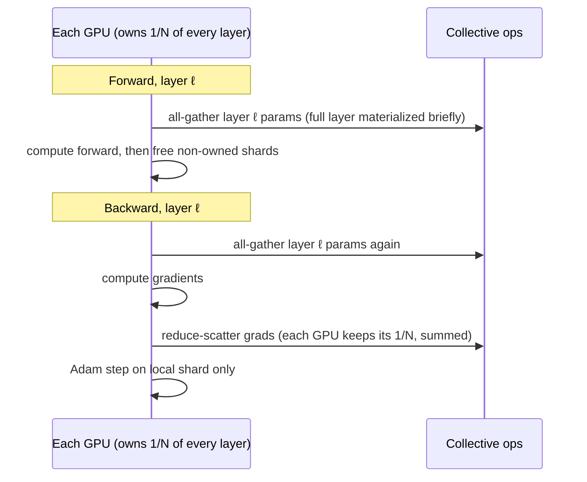
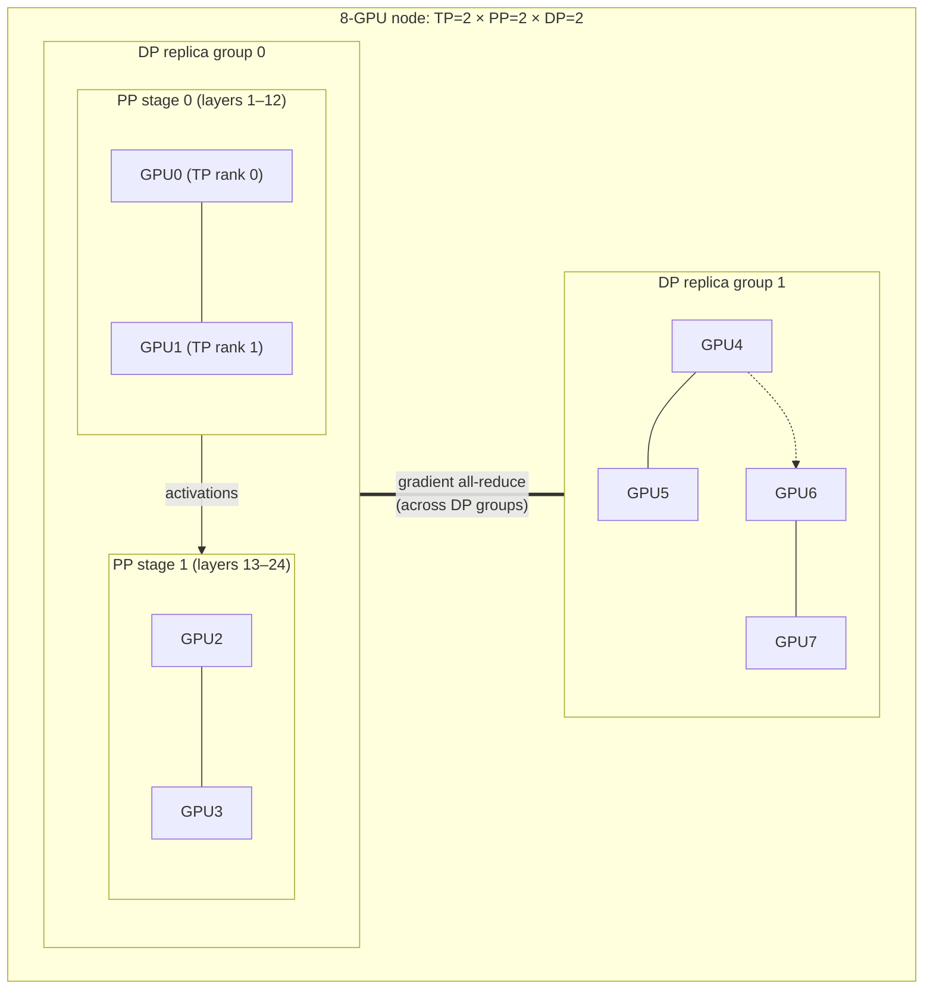

# 6.3 — Distributed Training (DDP, FSDP, DeepSpeed, Megatron)

## 1. Overview

**What is it?** Distributed training is the engineering discipline of spreading the training of one neural network across many GPUs — and many machines — so that models too large or too slow for a single device become trainable.

**Why does it exist?** A 70B-parameter model in fp16 needs 140 GB just for its weights; add gradients and Adam optimizer states and you are near a terabyte — no single GPU comes close. Even when a model *fits*, training on trillions of tokens on one GPU would take centuries. Scale forces parallelism.

**What problem does it solve?** Two distinct problems: (1) **throughput** — process more data per second by replicating work (data parallelism); (2) **memory** — fit models that exceed one device by partitioning parameters, gradients, optimizer states, and activations (sharding, tensor/pipeline parallelism).

**Where is it used?** Every frontier model — GPT-4, Claude, Gemini, Llama 3, DeepSeek-V3 — is trained with a combination of data, tensor, pipeline, and expert parallelism on thousands of accelerators. But distributed training also matters at modest scale: fine-tuning a 7B model on 4 GPUs with FSDP is now an everyday task.

## 2. Learning Objectives

After this chapter you will be able to:

- Compute the memory footprint of training a model: parameters, gradients, optimizer states, and activations, in bytes.
- Explain how DistributedDataParallel (DDP) works, including gradient bucketing and ring all-reduce.
- Derive the communication cost of ring all-reduce and explain why it is bandwidth-optimal.
- Describe exactly what ZeRO stages 1, 2, and 3 shard, and compute the per-GPU memory for each.
- Explain how FSDP implements ZeRO-3 with all-gather and reduce-scatter.
- Describe tensor parallelism (Megatron-style column/row splits) and where its all-reduces occur.
- Explain pipeline parallelism, compute the bubble fraction, and describe microbatching mitigations.
- Describe expert parallelism for Mixture-of-Experts models.
- Apply activation checkpointing and reason about its compute–memory trade-off.
- Define and compute Model FLOPs Utilization (MFU) and use it to judge training efficiency.
- Write a working DDP and FSDP training script.
- Choose a parallelism strategy given a model size, cluster topology, and interconnect.

## 3. Prerequisites

| Chapter | Why you need it |
|---|---|
| [Backpropagation](../phase-2-deep-learning/02-backpropagation.md) | Gradient synchronization schedules hinge on when backward produces each gradient. |
| [Optimizers](../phase-2-deep-learning/05-optimizers.md) | Adam's two moment buffers are why optimizer state dominates training memory. |
| [Regularization for DL](../phase-2-deep-learning/06-regularization-dl.md) | Large-batch training interacts with learning-rate scaling and warmup. |
| [Transformers](../phase-2-deep-learning/10-transformer.md) | All memory math and parallelism layouts in this chapter are computed for transformer blocks. |
| [GPT Pretraining](../phase-3-nlp-llm/05-gpt-pretraining.md) | Distributed training is the machinery that executes the pretraining recipes described there. |
| [LoRA & PEFT](../phase-3-nlp-llm/07-lora-peft.md) | Parameter-efficient methods are the main *alternative* to sharded full fine-tuning. |

## 4. Intuition

Think of training a giant model as building a skyscraper. One worker (GPU) cannot do it alone — but there are several very different ways to add workers:

- **Data parallelism** is hiring identical crews to build identical houses in parallel, then meeting nightly to average their blueprints. Every crew needs the full blueprint (a full model copy), so this helps speed but not the "blueprint is too big for one office" problem.
- **Tensor parallelism** is splitting one *task* among workers standing shoulder to shoulder: one lays the left half of each wall, the other the right half. They must constantly coordinate (high-bandwidth communication), so they had better be in the same room (one server, NVLink).
- **Pipeline parallelism** is an assembly line: worker 1 does floors 1–10, worker 2 floors 11–20. Efficient once the line is full, but the first and last workers idle while the pipeline fills and drains — the "bubble."
- **ZeRO/FSDP sharding** is a shared tool library: instead of every crew owning a complete set of tools (parameters, gradients, optimizer states), each crew stores one shelf and borrows the rest exactly when needed, returning them immediately. Memory per crew plummets; the cost is fetching tools over the network.

An everyday story for the all-reduce: eight friends each count one section of a stadium crowd and need everyone to know the grand total. Naive approach: everyone shouts their number to everyone (8×7 messages). The ring approach: sit in a circle, pass your running subtotal to the right; after 7 passes everyone has contributed to some total, and after 7 more passes the finished totals circulate back. Every person spoke only to one neighbor, the load was perfectly even, and no single person became a bottleneck — that is ring all-reduce, and it is why GPU clusters are wired the way they are.

## 5. Real-world Motivation

- **OpenAI** trained GPT-3 (175B) on thousands of V100s using data + tensor + pipeline parallelism (as described in the paper and Microsoft's infrastructure disclosures); GPT-4-class training runs use tens of thousands of accelerators.
- **Meta** trained Llama 3 on two 24,000-GPU clusters, publishing details on 4D parallelism (data, tensor, pipeline, context) and FSDP usage; PyTorch's own FSDP was battle-tested on Meta workloads.
- **Google** trained PaLM (540B) on 6,144 TPU v4 chips across two pods with data + tensor parallelism, reporting one of the first public MFU figures (~46%) — making MFU the industry's standard efficiency yardstick.
- **Microsoft DeepSpeed** introduced ZeRO, which enabled trillion-parameter model training and made 10B+ models accessible to labs with modest clusters.
- **NVIDIA Megatron-LM** established the tensor-parallel transformer layout used, in some form, by nearly every large-scale training stack.
- **DeepSeek** trained DeepSeek-V3 (671B MoE parameters) with expert parallelism and aggressive pipeline scheduling on a comparatively small cluster, showing that parallelism *engineering* directly converts to dollars saved.

The economics are blunt: at cluster scale, a 10% MFU improvement is worth millions of dollars per training run.

## 6. Mathematical Foundations

### 6.1 Training memory anatomy

Let $\Psi$ = number of model parameters. With mixed-precision training (bf16 compute, fp32 master copies) and Adam:

| Component | Bytes per parameter | For $\Psi$ = 7B |
|---|---|---|
| bf16 parameters | 2 | 14 GB |
| bf16 gradients | 2 | 14 GB |
| fp32 master weights | 4 | 28 GB |
| fp32 Adam momentum $m$ | 4 | 28 GB |
| fp32 Adam variance $v$ | 4 | 28 GB |
| **Total model states** | **$K = 16$** | **112 GB** |

So training memory for model states is $\approx 16\Psi$ bytes — a 7B model needs 112 GB *before* activations, which is why it cannot be trained on a single 80 GB GPU without sharding.

**Activation memory** for one transformer layer with batch size $b$, sequence length $s$, hidden size $h$, and $a$ attention heads is approximately (Korthikanti et al., 2022, without any recomputation or FlashAttention):

$$M_{\text{act}} \approx s\, b\, h \left(34 + 5\,\frac{a\,s}{h}\right) \text{ bytes per layer},$$

where the $34sbh$ term covers the stored inputs of matmuls, layernorms, and GeLU, and the $5as^2b$ term is the attention matrix (removed entirely by FlashAttention). Activations scale with $b$ and $s$ — they, not weights, are usually what forces gradient checkpointing at long context.

### 6.2 Ring all-reduce communication cost

All-reduce computes the elementwise sum of a tensor across $N$ GPUs and leaves the result on every GPU. Ring all-reduce splits the tensor of $M$ bytes into $N$ chunks and runs two phases: **reduce-scatter** ($N - 1$ steps, each GPU sends/receives $M/N$ bytes per step, accumulating partial sums) then **all-gather** ($N - 1$ steps circulating the finished chunks). Total bytes sent per GPU:

$$C_{\text{ring}} = 2\,(N-1)\,\frac{M}{N} \;\xrightarrow{N \to \infty}\; 2M.$$

Key insight: per-GPU communication is *independent of cluster size* — this asymptotic optimality is why data parallelism scales to thousands of GPUs. For DDP, $M = 2\Psi$ bytes (bf16 gradients) per step.

### 6.3 ZeRO memory math

With $N_d$ data-parallel GPUs and model-state footprint $K\Psi = 16\Psi$ bytes split as $2\Psi$ (params) + $2\Psi$ (grads) + $12\Psi$ (optimizer states = fp32 master + $m$ + $v$):

| Stage | What is sharded | Per-GPU model-state memory | Extra communication |
|---|---|---|---|
| DDP (baseline) | nothing | $16\Psi$ | $2\Psi$ all-reduce |
| ZeRO-1 | optimizer states | $4\Psi + \frac{12\Psi}{N_d}$ | same as DDP |
| ZeRO-2 | + gradients | $2\Psi + \frac{14\Psi}{N_d}$ | same volume (reduce-scatter instead of all-reduce) |
| ZeRO-3 / FSDP | + parameters | $\frac{16\Psi}{N_d}$ | +$2\Psi$ (params all-gathered in forward *and* backward → total $3\Psi$ vs. $2\Psi$, i.e. 1.5×) |

Example: 7B model, 8 GPUs. DDP: 112 GB/GPU (impossible on A100-80GB). ZeRO-2: $2\cdot7 + \frac{14\cdot7}{8} \approx 26$ GB. ZeRO-3: $\frac{112}{8} = 14$ GB — now activations and batch size become the binding constraint.

### 6.4 Tensor parallelism (Megatron)

Split each transformer matmul across $N_t$ GPUs. For the MLP block $Y = \text{GeLU}(XA)B$: split $A$ **column-wise** ($A = [A_1, A_2]$), so each GPU computes $\text{GeLU}(XA_i)$ independently (GeLU is elementwise — no sync needed); split $B$ **row-wise**, so partial products $Y_i = \text{GeLU}(XA_i)B_i$ need one **all-reduce** to sum. Attention splits heads across GPUs analogously. Cost: 2 all-reduces per layer in forward and 2 in backward, of size $b \times s \times h$ — every layer, every step. This is why tensor parallelism is confined to NVLink domains (typically $N_t \le 8$).

### 6.5 Pipeline parallelism and the bubble

Split $L$ layers into $N_p$ stages. With one batch, stage $i$ idles while others compute. GPipe splits the batch into $m$ microbatches; the fraction of time wasted (the **bubble**) is:

$$\text{bubble fraction} = \frac{N_p - 1}{m + N_p - 1}.$$

Derivation: a microbatch takes 1 unit per stage; the last stage starts only after $N_p - 1$ units of fill and the schedule drains for another $N_p - 1$; useful work is $m$ units per stage out of $m + N_p - 1$ total. With $N_p = 8$ and $m = 32$: bubble = $7/39 \approx 18\%$. Mitigations: more microbatches, 1F1B scheduling (constant activation memory), interleaved virtual stages (Megatron), zero-bubble schedules.

### 6.6 Expert parallelism

A Mixture-of-Experts layer replaces one MLP with $E$ expert MLPs plus a router that sends each token to its top-$k$ experts. Experts are placed on different GPUs; tokens are exchanged with two **all-to-all** collectives (dispatch and combine) per MoE layer. Compute per token stays roughly constant while parameters scale by $E$ — the trick behind Mixtral 8×7B and DeepSeek-V3.

### 6.7 Activation checkpointing

Store only layer-boundary activations; recompute interiors during backward. Memory for interior activations drops from $O(L)$ to $O(\sqrt{L})$ with optimal segmenting (checkpoint every $\sqrt{L}$ layers), at the cost of one extra forward pass ≈ 33% more compute (forward:backward FLOPs ≈ 1:2, so recompute adds 1 to 3).

### 6.8 MFU — Model FLOPs Utilization

For a decoder transformer, one token requires approximately $6\Psi$ training FLOPs (2 forward + 4 backward per parameter). Then:

$$\text{MFU} = \frac{6\,\Psi \times (\text{tokens/second})}{N_{\text{GPUs}} \times \text{peak FLOPs per GPU}}.$$

MFU measures achieved *useful* throughput against hardware peak, penalizing recomputation, bubbles, and communication stalls. State of the art for large dense models is roughly 40–60% on well-tuned clusters; below ~30% means something is wrong (input pipeline, bubbles, or comm stalls).

## 7. Visual Explanation

The four parallelism axes and where each communicates:

```mermaid
flowchart TD
    subgraph DP["Data Parallel (across nodes)"]
        direction LR
        R1["Replica / shard group 1"] ---|"gradient all-reduce<br/>or reduce-scatter"| R2["Replica / shard group 2"]
    end
    subgraph TP["Tensor Parallel (inside NVLink node)"]
        direction LR
        G1["GPU 0: left half of<br/>every weight matrix"] ---|"all-reduce per layer"| G2["GPU 1: right half"]
    end
    subgraph PP["Pipeline Parallel (across nodes)"]
        direction LR
        S1["Stage 1: layers 1–16"] -->|"activations"| S2["Stage 2: layers 17–32"]
    end
    subgraph EP["Expert Parallel (MoE)"]
        direction LR
        E1["GPU A: experts 1–4"] ---|"all-to-all token routing"| E2["GPU B: experts 5–8"]
    end
```



Pipeline bubble with 4 stages and 4 microbatches (F = forward, B = backward, · = idle):

```
stage 1: F1 F2 F3 F4 ·  ·  ·  B4 B3 B2 B1 ·  ·  ·
stage 2: ·  F1 F2 F3 F4 ·  B4 B3 B2 B1 ·  ·  ·  ·
stage 3: ·  ·  F1 F2 F3 F4 B4 B3 B2 B1 ·  ·  ·  ·      (schematic)
stage 4: ·  ·  ·  F1 F2 F3 F4 B4 B3 B2 B1 ·  ·  ·
          ^^^ fill bubble ^^^            ^^^ drain ^^^
```

FSDP's per-layer choreography:



## 8. Algorithm

**DDP training step, step by step:**

1. Launch $N$ processes (one per GPU); initialize the NCCL process group; broadcast initial weights from rank 0 so all replicas start identical.
2. `DistributedSampler` gives each rank a disjoint shard of the dataset.
3. Each rank runs forward on its local microbatch and computes the local loss.
4. During backward, as each gradient **bucket** (~25 MB of contiguous grads) is ready, launch an asynchronous all-reduce — communication overlaps with the rest of backward.
5. After backward, all-reduced gradients (averaged over ranks) are identical everywhere; each rank runs the identical optimizer step.
6. Replicas remain bit-identical without ever exchanging weights.

```text
PSEUDOCODE: one training step under ZeRO-3 / FSDP
--------------------------------------------------
# Each GPU permanently stores only 1/N of params, grads, optimizer states
for layer ℓ in forward order:
    all_gather(params[ℓ])            # materialize full layer, ~2Ψ_ℓ bytes moved
    activations[ℓ] = layer_forward(activations[ℓ-1])
    free(non-owned shards of params[ℓ])
loss = criterion(activations[-1], targets)
for layer ℓ in reverse order:
    all_gather(params[ℓ])            # needed again for grad computation
    grads_full = layer_backward(...)
    reduce_scatter(grads_full)       # each GPU keeps summed 1/N shard
    free(non-owned params and grads)
adam_step(local param shard, local grad shard, local optimizer shard)
```

## 9. Worked Example

**Tiny example by hand — ring all-reduce with 3 GPUs.** Gradient vector $g = (g_1, g_2, g_3)$ chunked into 3 pieces. GPU values: A = (1, 2, 3), B = (4, 5, 6), C = (7, 8, 9). Target: everyone holds (12, 15, 18).

*Reduce-scatter, step 1:* A sends chunk 1 (=1) to B; B sends chunk 2 (=5) to C; C sends chunk 3 (=9) to A. Now B holds chunk-1 sum 1+4=5; C holds chunk-2 sum 5+8=13; A holds chunk-3 sum 9+3=12.
*Reduce-scatter, step 2:* B sends 5 to C → C's chunk 1 = 5+7 = **12**; C sends 13 to A → A's chunk 2 = 13+2 = **15**; A sends 12 to B → B's chunk 3 = 12+6 = **18**. Each GPU now owns one *complete* chunk sum.
*All-gather, steps 3–4:* the finished chunks circulate the ring; after 2 more steps every GPU holds (12, 15, 18). ✓

Total per GPU: 4 sends of 1 chunk = $2(N{-}1)\frac{M}{N} = \frac{4M}{3}$ bytes — matching the formula.

**Realistic example — fine-tune Llama-2-7B on 8×A100-80GB.** Model states need 112 GB → DDP impossible. FSDP full-shard: $112/8 = 14$ GB of model states per GPU; add ~10–20 GB activations (batch 2 × 4096 tokens with checkpointing) → comfortable fit. Throughput ~3,500 tokens/s/GPU in bf16; MFU $= \frac{6 \times 7{\times}10^9 \times 8 \times 3500}{8 \times 312{\times}10^{12}} \approx 47\%$ — a healthy number for this scale.

## 10. Python from Scratch

Simulating data-parallel gradient averaging and ring all-reduce in NumPy — no GPUs needed, but the exact logic of DDP:

```python
import numpy as np

# --- Toy problem: linear regression, "2 GPUs" = 2 halves of the batch ---
rng = np.random.default_rng(0)
X = rng.normal(size=(8, 3)); true_w = np.array([1.0, -2.0, 0.5])
y = X @ true_w + 0.01 * rng.normal(size=8)

w = np.zeros(3)                     # both "replicas" share identical weights
Xs, ys = np.split(X, 2), np.split(y, 2)      # DistributedSampler: disjoint shards

def local_grad(w, Xi, yi):
    """Per-replica gradient of MSE: 2/n * X^T (Xw - y). Shape (3,)."""
    return 2 / len(yi) * Xi.T @ (Xi @ w - yi)

for step in range(200):
    grads = [local_grad(w, Xs[r], ys[r]) for r in range(2)]   # parallel compute
    g_avg = ring_allreduce(grads) / 2     # ↓ defined below; == np.mean(grads, 0)
    w -= 0.1 * g_avg                      # identical update on every replica

def ring_allreduce(chunk_lists):
    """Reduce-scatter + all-gather over a ring of N workers.
    chunk_lists[r] = worker r's full vector; returns the elementwise sum."""
    N = len(chunk_lists)
    chunks = [np.array_split(v.astype(float), N) for v in chunk_lists]  # N chunks each
    for s in range(N - 1):                # reduce-scatter: N-1 neighbor exchanges
        for r in range(N):
            src, c = (r - s - 1) % N, (r - s - 1) % N  # which chunk r receives
            chunks[r][c] += chunks[src][c]             # "receive and accumulate"
    # after N-1 steps, worker r owns the complete sum of chunk (r+1) % N
    full = [None] * N
    for r in range(N):
        full[(r + 1) % N] = chunks[r][(r + 1) % N]     # all-gather (conceptually)
    return np.concatenate(full)

print(w)          # -> approx [ 1.0, -2.0, 0.5 ]
```

**Expected output:** `w ≈ [1.0, -2.0, 0.5]`, identical (to machine precision) to single-worker training on the full batch — the defining correctness property of data parallelism: *sharded batch + averaged gradients ≡ big batch*.

**Complexity:** the simulated ring moves $2(N-1)\frac{M}{N}$ elements per worker, and gradient computation is embarrassingly parallel across workers.

> [!WARNING]
> **Common bug:** averaging *losses* instead of *gradients* — or letting each replica take its optimizer step *before* synchronizing. Replicas silently diverge, and training limps along at reduced effective learning rate. Real DDP avoids this by hooking the all-reduce into `backward()` itself; when writing custom loops, assert occasionally that a hash of the weights matches across ranks.

## 11. Library Implementation

DDP and FSDP in PyTorch — the two APIs that cover 95% of practice:

```python
# launch: torchrun --nproc_per_node=8 train.py
import os, torch, torch.nn as nn, torch.distributed as dist
from torch.nn.parallel import DistributedDataParallel as DDP
from torch.utils.data import DataLoader, DistributedSampler

dist.init_process_group("nccl")                       # NCCL = GPU collectives backend
rank = dist.get_rank()
local_rank = int(os.environ["LOCAL_RANK"])            # GPU index on this node
torch.cuda.set_device(local_rank)

model = GPT(config).cuda(local_rank)
model = DDP(model, device_ids=[local_rank])           # wraps: broadcast weights,
                                                      # register grad-bucket all-reduce hooks
sampler = DistributedSampler(dataset)                 # disjoint shard per rank
loader = DataLoader(dataset, batch_size=8, sampler=sampler, num_workers=4)

opt = torch.optim.AdamW(model.parameters(), lr=3e-4)
scaler_free = True                                    # bf16 needs no loss scaling (fp16 does)

for epoch in range(epochs):
    sampler.set_epoch(epoch)                          # reshuffle differently each epoch!
    for x, y in loader:
        x, y = x.cuda(local_rank), y.cuda(local_rank)
        with torch.autocast("cuda", dtype=torch.bfloat16):   # mixed precision
            loss = model(x, labels=y).loss
        loss.backward()                               # all-reduce overlaps here
        opt.step(); opt.zero_grad(set_to_none=True)
    if rank == 0:                                     # only one rank writes
        torch.save(model.module.state_dict(), f"ckpt_{epoch}.pt")
    dist.barrier()                                    # others wait for the save
```

```python
# FSDP (ZeRO-3 semantics) — for models that don't fit under DDP
from torch.distributed.fsdp import FullyShardedDataParallel as FSDP
from torch.distributed.fsdp.wrap import transformer_auto_wrap_policy
from torch.distributed.fsdp import MixedPrecision
import functools

wrap_policy = functools.partial(                       # shard at block granularity:
    transformer_auto_wrap_policy,                      # each transformer block becomes
    transformer_layer_cls={GPTBlock},                  # one all-gather/free unit
)
model = FSDP(
    GPT(config),
    auto_wrap_policy=wrap_policy,
    mixed_precision=MixedPrecision(param_dtype=torch.bfloat16,
                                   reduce_dtype=torch.bfloat16),
    device_id=local_rank,
    limit_all_gathers=True,                            # cap in-flight gathers (memory)
)
model.gradient_checkpointing = True                    # or apply_activation_checkpointing(...)
# training loop identical to DDP; optimizer sees sharded FlatParameters
```

DeepSpeed expresses the same ideas through a JSON config (`"zero_optimization": {"stage": 3}`, `"bf16": {"enabled": true}`) passed to `deepspeed.initialize`, and Hugging Face `Trainer`/`Accelerate` can drive DDP, FSDP, or DeepSpeed from a config file without changing model code. Megatron-LM adds tensor/pipeline parallelism via `--tensor-model-parallel-size` / `--pipeline-model-parallel-size` for cluster-scale pretraining.

## 12. Code Walkthrough

Key runtime objects in the DDP/FSDP scripts:

| Tensor / object | Shape / size | Meaning |
|---|---|---|
| `x` | `(8, 4096)` int64 | Per-rank microbatch of token ids (global batch = 8 × world size × grad-accum) |
| bf16 gradient buckets | ~25 MB each | Units of overlapped all-reduce in DDP |
| FSDP `FlatParameter` shard | `(Ψ_block / N,)` | This rank's slice of one wrapped block's flattened params |
| all-gathered block params | `(Ψ_block,)` bf16 | Materialized transiently per block in forward/backward |
| reduce-scattered grads | `(Ψ_block / N,)` | Summed gradient shard this rank will step on |
| optimizer state | 2 × fp32 shard | Adam $m, v$ for the local shard only |

Expected behavior worth verifying: (1) the loss curve under 8-GPU DDP with per-rank batch $b$ matches single-GPU with batch $8b$ step-for-step; (2) `nvidia-smi` shows FSDP per-GPU memory near $16\Psi/N$ + activations; (3) tokens/s scales ~linearly until the interconnect saturates; (4) rank-0-only logging shows one line per step, not `world_size` lines (a classic symptom of missing rank guards).

## 13. Complexity Analysis

- **Computation:** ideal data parallelism divides step time by $N_d$ — same total FLOPs ($6\Psi$ per token), spread over more devices.
- **DDP communication:** $2\Psi$ bytes (bf16) all-reduced per step at ring cost $2(N{-}1)/N \times 2\Psi \approx 4\Psi$ bytes on the wire per GPU, independent of $N$ — communication *time* stays flat as you scale, which is the whole point.
- **ZeRO-3/FSDP:** parameters travel twice extra (all-gather in forward and backward) → communication volume ~1.5× DDP; overlap via prefetching hides most of it on fast interconnects.
- **Tensor parallel:** 4 all-reduces of $b \cdot s \cdot h$ activations per layer per step — latency-critical, hence NVLink-only.
- **Pipeline parallel:** compute overhead = bubble fraction $\frac{N_p - 1}{m + N_p - 1}$; communication is only stage-boundary activations (cheap), which is why pipeline crosses slow inter-node links well.
- **Space:** per-GPU model states $16\Psi$ (DDP) → $16\Psi/N$ (ZeRO-3); activations $O(b \cdot s \cdot h \cdot L)$ → $O(b \cdot s \cdot h \sqrt{L})$ with checkpointing at ~1.33× compute.
- **The governing law:** you are balancing three budgets — FLOPs, bytes moved, and bytes stored. Every technique in this chapter trades one for another.

## 14. Advantages

- **Enables otherwise-impossible models.** No frontier LLM exists without these techniques; even a 7B full fine-tune requires ZeRO/FSDP on commodity 8-GPU nodes.
- **Near-linear throughput scaling.** Well-tuned DDP routinely achieves >90% scaling efficiency to hundreds of GPUs because ring all-reduce cost is size-independent.
- **Exact equivalence (data parallelism).** DDP is mathematically identical to large-batch single-GPU training — no accuracy trade-off, unlike approximation-based speedups.
- **Composability.** TP × PP × DP × EP combine into "3D/4D parallelism"; Llama-3-scale runs use all axes simultaneously.
- **Mature, open tooling.** PyTorch DDP/FSDP, DeepSpeed, and Megatron-LM are production-hardened and free — the same stack a frontier lab uses is `pip install`-able.
- **Cost control.** Higher MFU is directly proportional to lower training cost; the math in this chapter is literally a budgeting tool.

## 15. Disadvantages

- **Debugging is genuinely hard.** A hang can be caused by any rank taking a different code path (e.g., one rank skips a batch → collective mismatch → silent deadlock with no stack trace).
- **Communication-bound regimes.** On Ethernet-class interconnects, ZeRO-3's extra all-gathers can erase its benefits; TP across nodes is usually catastrophic.
- **Pipeline bubbles and load imbalance.** Uneven stage partitioning or stragglers cap MFU; MoE adds routing imbalance on top.
- **Failure amplification.** One GPU failure stalls thousands; at Llama-3 scale, Meta reported interruptions every few hours, making checkpoint/resume engineering as important as the training loop.
- **Large-batch optimization effects.** Scaling data parallelism raises the global batch, which changes optimization dynamics and requires LR/warmup retuning — not a free knob.
- **Complexity tax.** Sharded checkpoints, rank-aware logging, and topology-aware launch scripts add real engineering surface; for models that fit on one GPU, all of it is pure overhead.

## 16. Common Mistakes

- **Forgetting `sampler.set_epoch(epoch)`** → every epoch uses the same shuffle order, quietly hurting convergence. *Fix:* call it at the top of each epoch.
- **Not scaling the learning rate with global batch size.** 8× GPUs at fixed per-rank batch means 8× global batch. *Fix:* linear or square-root LR scaling with warmup; re-validate on a short run.
- **Checkpoint deadlocks:** rank 0 saves while other ranks race ahead into the next collective. *Fix:* `dist.barrier()` around rank-guarded I/O; for FSDP use distributed checkpoint APIs (`torch.distributed.checkpoint`) rather than gathering full state dicts.
- **Wrong gradient accumulation with DDP:** all-reducing on every microbatch wastes bandwidth. *Fix:* wrap non-final microbatches in `model.no_sync()`.
- **Uneven data shards** → one rank finishes its epoch early and hangs the others. *Fix:* `DistributedSampler(drop_last=True)` or join-based APIs.
- **fp16 without loss scaling** → gradient underflow, loss goes NaN. *Fix:* prefer bf16 on A100/H100; if fp16, use `GradScaler`.
- **Mixing `.cuda()` device assumptions:** using `rank` instead of `local_rank` for device placement breaks multi-node runs. *Fix:* always `torch.cuda.set_device(local_rank)` from the launcher's env.
- **Measuring "speedup" without a correctness check.** *Fix:* first verify the 1-GPU and N-GPU loss curves coincide; only then optimize throughput.

## 17. Best Practices

- Decision rule of thumb: model fits on one GPU with headroom → DDP; model states don't fit → FSDP/ZeRO-3; model doesn't fit *per layer* or you need >8-way sharding of compute → add tensor parallel (within a node) and pipeline parallel (across nodes); MoE → expert parallel.
- Keep TP inside NVLink domains ($\le 8$); place PP across nodes; put DP outermost.
- Always: bf16 mixed precision, FlashAttention, gradient checkpointing when activation-bound, `torch.compile` where stable.
- Compute your memory budget on paper ($16\Psi/N$ + activation estimate) *before* launching — OOM discovered at step 1 of a 512-GPU job is an expensive way to do arithmetic.
- Track tokens/s/GPU and MFU on every run's dashboard; alert on regressions.
- Checkpoint sharded and asynchronously; test the *resume* path, including dataloader state, before the long run.
- Log and validate only on rank 0; seed per rank (`base_seed + rank`) for data augmentation but keep model init identical.
- Run NCCL environment sanity (`NCCL_DEBUG=INFO`, `nccl-tests` all-reduce benchmark) on any new cluster before blaming your code.
- Keep a single-GPU "tiny config" of your training script that runs in minutes — most distributed bugs reproduce there or are excluded there.

## 18. Optimization Techniques

- **Overlap communication with compute:** DDP bucketing does this automatically (tune `bucket_cap_mb`); FSDP prefetches the next block's all-gather (`forward_prefetch`, `backward_prefetch`).
- **Gradient accumulation:** decouple global batch from memory; with DDP, sync only on the last microbatch (`no_sync`).
- **Activation checkpointing:** apply per transformer block; combine with FSDP wrapping at the same granularity.
- **FlashAttention:** removes the $O(s^2)$ attention-matrix memory term entirely and speeds up attention 2–4× — a strict win, always on.
- **Sequence/context parallelism:** shard the sequence dimension of activations (and layernorm/dropout) across TP ranks for long-context training.
- **Kernel fusion & `torch.compile`:** fuses elementwise ops, reducing memory traffic — typically +10–30% throughput.
- **fp8 training (H100+):** Transformer Engine's per-tensor-scaled fp8 matmuls, used in production by several labs for further speedup.
- **Gradient compression** (PowerSGD, quantized all-reduce) when the interconnect, not compute, is the bottleneck.
- **Topology-aware placement:** map TP groups to NVLink, PP to node pairs, DP across the fabric; NCCL tree vs. ring algorithm selection for large node counts.
- **Data pipeline:** pre-tokenized, memory-mapped datasets and `num_workers` tuning — a starved GPU has 0% MFU no matter how clever the sharding.

## 19. Industry Applications

- **Frontier pretraining:** OpenAI (GPT series on Azure superclusters), Google DeepMind (Gemini on TPU pods with GSPMD/Pathways), Meta (Llama 3 on 24k-GPU clusters with FSDP + 4D parallelism), Anthropic, xAI (Grok on the ~100k-GPU Colossus cluster), Mistral and DeepSeek (MoE with expert parallelism).
- **Production fine-tuning platforms:** Hugging Face, Databricks/MosaicML (Composer + FSDP recipes), AWS SageMaker distributed training, Azure ML — all package DDP/ZeRO for enterprise fine-tuning.
- **Recommendation systems:** Meta's DLRM training uses hybrid parallelism — data parallel for dense layers, model parallel for terabyte-scale embedding tables — arguably the largest distributed-training workloads by parameter count.
- **Speech/vision at scale:** OpenAI Whisper, Tesla's vision stack training on its in-house Dojo/GPU clusters, Waymo's perception training.
- **Science:** climate and protein models (e.g., AlphaFold-scale training) rely on the same TP/DP toolbox.

## 20. Interview Questions

### Beginner

**Q: What is the difference between data parallelism and model parallelism?**
A: Data parallelism replicates the full model and splits the *batch*; gradients are averaged each step. Model parallelism splits the *model* (by tensor slices or layer ranges) because it doesn't fit on one device. Data parallelism scales throughput; model parallelism scales memory.

**Q: Why do all DDP replicas stay identical without ever exchanging weights?**
A: They start from broadcast-identical weights, receive identical averaged gradients from the all-reduce, and apply the identical deterministic optimizer step — so weights remain synchronized by induction.

**Q: What is mixed-precision training and why is bf16 preferred over fp16?**
A: Compute in 16-bit, keep fp32 master weights for the update. bf16 has the same exponent range as fp32 (8 bits), so it doesn't underflow gradients and needs no loss scaling; fp16's 5-bit exponent requires dynamic loss scaling to avoid NaNs.

**Q: What is gradient accumulation for?**
A: Simulating a larger global batch than memory allows: run $k$ microbatch backward passes, summing gradients, and step once. Global batch = per-rank batch × world size × $k$.

**Q: Roughly how much memory does training a 7B model with Adam take, and why?**
A: ~112 GB of model states: $16$ bytes/param = 2 (bf16 weights) + 2 (bf16 grads) + 12 (fp32 master + Adam $m$ and $v$) — before activations. Hence sharding or PEFT.

### Intermediate

**Q: Walk through ZeRO stages 1–3. What does each shard and what is the memory per GPU?**
A: ZeRO-1 shards optimizer states → $4\Psi + 12\Psi/N$; ZeRO-2 also shards gradients → $2\Psi + 14\Psi/N$; ZeRO-3 also shards parameters → $16\Psi/N$. Stages 1–2 keep DDP-equivalent communication volume; stage 3 adds parameter all-gathers in forward and backward (~1.5× total volume).

**Q: Derive the ring all-reduce cost and explain why it's considered optimal.**
A: Reduce-scatter and all-gather each take $N-1$ steps moving $M/N$ bytes, so per-GPU traffic is $2(N-1)M/N \to 2M$. Any algorithm must move at least ~$2M$ bytes per node (each element must leave and re-enter), so ring is asymptotically bandwidth-optimal, with cost independent of $N$.

**Q: Why is tensor parallelism restricted to within a node while pipeline parallelism crosses nodes?**
A: TP requires multiple all-reduces of activation-sized tensors per layer per step — latency- and bandwidth-critical, feasible only over NVLink. PP communicates only stage-boundary activations once per microbatch — small, point-to-point, tolerant of slower inter-node links.

**Q: Compute the pipeline bubble for 8 stages and 32 microbatches, and name two mitigations.**
A: $(N_p - 1)/(m + N_p - 1) = 7/39 \approx 18\%$. Mitigations: more microbatches, 1F1B scheduling (bounds activation memory, enabling more microbatches), interleaved virtual pipeline stages, zero-bubble schedules.

**Q: When would you choose DDP over FSDP even though FSDP saves memory?**
A: When the model comfortably fits: DDP has lower communication volume (no parameter all-gathers), simpler debugging and checkpointing, and typically higher throughput. FSDP's memory savings only pay off when memory is the binding constraint.

### Advanced

**Q: Derive the ~$6\Psi$ FLOPs-per-token rule and use it to define MFU.**
A: A dense matmul with weight count $\Psi_W$ costs $2\Psi_W$ FLOPs per token in forward (multiply + add). Backward computes two matmuls per weight matrix (grad w.r.t. inputs and w.r.t. weights) → $4\Psi_W$. Summed over the model: $6\Psi$ per token (ignoring attention's $O(s)$ term). MFU = achieved $6\Psi \times$ tokens/s divided by aggregate peak FLOPs; it measures useful-work efficiency, and *excludes* recomputation (which HFU includes).

**Q: Your 64-node ZeRO-3 job gets 22% MFU on 400 Gb/s Ethernet. Diagnose and fix.**
A: Likely communication-bound: ZeRO-3's parameter all-gathers cannot hide behind compute on slow fabric. Options: hierarchical sharding (e.g., HSDP / ZeRO++-style — shard within a node, replicate across nodes, so heavy traffic stays on NVLink), increase per-GPU batch/activation checkpointing to raise compute per byte, quantized-communication variants, or switch inter-node axis to pipeline parallelism. Also verify overlap settings (prefetch), NCCL topology, and that the dataloader isn't the actual bottleneck.

**Q: How do interleaved pipeline stages reduce the bubble, and what do they cost?**
A: Give each GPU $v$ non-contiguous chunks of layers (virtual stages); the bubble shrinks by ~$v$× because each microbatch's per-chunk compute is shorter, filling the schedule faster. Cost: $v$× more pipeline communication and more complex scheduling/memory management.

**Q: Explain the memory–compute trade-off of activation checkpointing quantitatively.**
A: Storing only every-$\sqrt{L}$-layer boundaries reduces stored activations from $O(L)$ to $O(\sqrt{L})$ segments (each recomputed interior is $O(\sqrt{L})$ deep, giving $O(\sqrt{L})$ peak). Recomputation adds one forward (~$2\Psi$/token) to the $6\Psi$ baseline → ~33% more FLOPs, usually reclaimed by the larger batch it enables.

**Q: What breaks when you scale data parallelism to very large global batches, and what are the remedies?**
A: Optimization degrades: fewer, noisier-*less* steps per epoch reduce the implicit regularization of SGD noise and can hurt generalization; the critical batch size bounds useful scaling. Remedies: LR scaling with warmup, optimizers designed for large batch (LARS/LAMB), longer training, or spending the extra hardware on model/pipeline axes instead.

## 21. Coding Exercises

### Easy

1. **Two-process DDP linear regression.** Write a `torchrun --nproc_per_node=2` script (CPU + `gloo` backend is fine) training `nn.Linear(3,1)`; assert final weights are identical across ranks and match single-process training on the concatenated data. *Hint:* `dist.all_gather` the weights and compare on rank 0.
2. **Ring all-reduce by hand.** Extend the Section 10 NumPy simulation to $N = 4$ workers and verify total bytes moved per worker equals $2(N-1)M/N$. *Hint:* count array elements exchanged in each phase.

### Medium

1. **FSDP fine-tune with memory audit.** Fine-tune a ~350M-parameter transformer with FSDP full-shard + bf16 on 2–4 GPUs; log `torch.cuda.max_memory_allocated()` and compare against the $16\Psi/N$ prediction. *Hint:* wrap at the transformer-block level; measure with and without activation checkpointing.
2. **Gradient accumulation done right.** Add accumulation ($k=8$) to a DDP script using `no_sync()`; verify loss trajectory matches per-step syncing while measuring the communication time saved. *Hint:* `torch.profiler` shows NCCL kernel time.
3. **Scaling study.** Train the same model on 1, 2, 4, 8 GPUs; plot tokens/s and scaling efficiency; compute MFU for each point. *Hint:* keep global batch fixed by adjusting per-rank batch.

### Hard

1. **DeepSpeed ZeRO-3 for a 1.3B model on 4 GPUs.** Write the JSON config (stage 3, bf16, activation checkpointing, optional CPU offload); verify per-GPU memory and produce a consolidated fp32 checkpoint. *Hint:* `zero_to_fp32.py` handles checkpoint consolidation.
2. **Manual tensor parallelism.** Implement Megatron-style 2-way TP for a single MLP block (column-split $A$, row-split $B$, one all-reduce) using `dist` primitives; assert outputs match the unsharded block to fp32 tolerance. *Hint:* initialize the sharded weights by slicing the reference weights.
3. **Pipeline simulator.** Build a discrete-event simulator of GPipe and 1F1B schedules; reproduce the bubble formula empirically and plot bubble fraction vs. microbatch count for $N_p \in \{4, 8, 16\}$. *Hint:* model each (stage, microbatch) op as fixed-duration; render the schedule as a Gantt chart.

## 22. Mini Project

**Multi-GPU CIFAR-10 with DDP.**

1. Start from a single-GPU ResNet-18 CIFAR-10 script that reaches ~93% accuracy.
2. Convert to DDP with `torchrun`: process group init, `DistributedSampler`, rank-guarded logging and checkpointing.
3. Verify correctness: 2-GPU loss curve overlays the single-GPU curve at the same *global* batch size.
4. Scale to 4 GPUs (or 4 processes on CPU/gloo if hardware-limited); apply linear LR scaling with 5-epoch warmup.
5. Measure images/s at each world size; plot scaling efficiency.
6. Deliverable: the script, the correctness overlay plot, and the scaling table with a paragraph explaining any sub-linearity.

## 23. Medium Project

**Train a ~1B-parameter GPT with FSDP.**

1. Implement or adopt a GPT (24 layers, $h = 2048$, 16 heads ≈ 1.2B params) with a tokenized corpus (e.g., OpenWebText subset via memory-mapped binary).
2. Configure FSDP: transformer auto-wrap, bf16 mixed precision, activation checkpointing per block, `limit_all_gathers=True`.
3. Do the paper math first: predict per-GPU memory on 8 GPUs; then confirm empirically within ~15%.
4. Train a few thousand steps; log loss, tokens/s/GPU, `max_memory_allocated`, and compute MFU.
5. Ablate: (a) no checkpointing, (b) fp32, (c) DDP-if-it-fits — record memory/throughput for each.
6. Implement sharded checkpointing with `torch.distributed.checkpoint` and demonstrate a mid-run resume with bitwise-identical continued loss.
7. Deliverable: training report with the predicted-vs-measured memory table and the ablation grid.

## 24. Advanced Project

**A 3D-parallel training recipe (TP × PP × DP) on an 8-GPU cluster.**

*Architecture:*



*Implementation phases:*

1. **Baseline:** train a ~2B GPT config with Megatron-LM (or DeepSpeed-Megatron / PyTorch `DeviceMesh` + `parallelize_module`) in pure DP-with-ZeRO as the reference loss curve.
2. **Enable TP=2:** validate logits match the unsharded model at init; measure the per-layer all-reduce cost with the profiler.
3. **Enable PP=2 with 1F1B:** sweep microbatch count $m \in \{2, 4, 8, 16\}$, measure the bubble empirically, and compare with $(N_p-1)/(m+N_p-1)$.
4. **Combine TP=2 × PP=2 × DP=2:** verify loss parity with the baseline; tune microbatches and bucket sizes; report tokens/s and MFU for every configuration in a grid.
5. **Resilience:** implement sharded checkpoints and a kill-and-resume drill; document time-to-resume.
6. **Report:** a recipe document recommending the best configuration for this node, with the measured evidence.

*Possible improvements:* interleaved pipeline stages; sequence parallelism on top of TP; fp8 with Transformer Engine on H100s; swap the dense MLP for an MoE layer and add expert parallelism with capacity-factor tuning; scale to 2 nodes and study how the DP all-reduce behaves across the slower fabric.

## 25. Summary

- Training memory ≈ $16\Psi$ bytes for model states under Adam + mixed precision; activations add $O(b\,s\,h\,L)$ — know both numbers before touching a cluster.
- DDP replicates the model, shards the batch, and all-reduces gradients; it is mathematically identical to large-batch single-GPU training.
- Ring all-reduce moves $2(N{-}1)M/N \approx 2M$ bytes per GPU regardless of cluster size — the foundation of data-parallel scaling.
- ZeRO shards optimizer states (1), gradients (2), and parameters (3), driving per-GPU model-state memory to $16\Psi/N$; FSDP is PyTorch's native ZeRO-3.
- Tensor parallelism splits matmuls inside a layer (NVLink-only, all-reduce per layer); pipeline parallelism splits layer ranges across nodes and pays a bubble of $\frac{N_p-1}{m+N_p-1}$.
- Expert parallelism distributes MoE experts and exchanges tokens via all-to-all — parameters scale without proportional compute.
- Activation checkpointing buys $O(\sqrt{L})$ activation memory for ~33% more FLOPs; FlashAttention removes the $O(s^2)$ attention memory term outright.
- MFU $= 6\Psi \cdot \text{tokens/s} / \text{peak FLOPs}$ is the universal efficiency metric; 40–60% is excellent, below 30% means investigate.
- Compose axes: TP within a node, PP across nodes, DP outermost, EP for MoE.
- Most distributed bugs are rank asymmetries: unguarded I/O, uneven shards, missed `set_epoch`, or optimizer steps before sync.

## 26. Cheat Sheet

| Quantity | Formula |
|---|---|
| Model-state memory (Adam, mixed prec.) | $16\Psi$ bytes; ZeRO-3: $16\Psi/N$ |
| Ring all-reduce traffic per GPU | $2(N-1)M/N \approx 2M$ |
| Pipeline bubble | $(N_p - 1)/(m + N_p - 1)$ |
| Training FLOPs per token | $\approx 6\Psi$ (2 fwd + 4 bwd) |
| MFU | $6\Psi \cdot \text{tok/s} \,/\, (N_{\text{GPU}} \cdot \text{peak FLOPs})$ |
| Global batch | per-rank batch × DP size × grad-accum steps |
| Activation memory/layer (no recompute) | $\approx sbh(34 + 5as/h)$ bytes |

**Strategy picker:** fits on 1 GPU → DDP · model states don't fit → FSDP/ZeRO-3 · single layer too big or >node-scale sharding → +TP (≤8, NVLink) · many nodes → +PP (1F1B, many microbatches) · MoE → +EP.

**Defaults:** bf16, FlashAttention, block-level FSDP wrap + checkpointing, DDP bucket 25 MB, NCCL backend, `set_epoch` every epoch, rank-0 I/O behind a barrier.

**Gotchas:** fp16 needs loss scaling (bf16 doesn't); `no_sync()` during grad accumulation; uneven shards hang collectives; LR must be retuned when global batch changes; measure correctness before speed.

## 27. Further Reading

**Books**
- *Programming Massively Parallel Processors* (Kirk & Hwu) — GPU fundamentals.
- The Hugging Face "Ultra-Scale Playbook" (free online) — the best modern end-to-end treatment of LLM-scale parallelism.

**Research Papers**
- Li et al., "PyTorch Distributed: Experiences on Accelerating Data Parallel Training" (DDP, 2020).
- Rajbhandari et al., "ZeRO: Memory Optimizations Toward Training Trillion Parameter Models" (2020).
- Zhao et al., "PyTorch FSDP: Experiences on Scaling Fully Sharded Data Parallel" (2023).
- Shoeybi et al., "Megatron-LM: Training Multi-Billion Parameter Language Models Using Model Parallelism" (2019); Narayanan et al., "Efficient Large-Scale Language Model Training on GPU Clusters" (2021); Korthikanti et al., "Reducing Activation Recomputation in Large Transformer Models" (2022).
- Huang et al., "GPipe" (2019); Narayanan et al., "PipeDream" (2019).
- Lepikhin et al., "GShard" (2020); Fedus et al., "Switch Transformers" (2021).
- Chowdhery et al., "PaLM" (2022 — MFU); Dubey et al., "The Llama 3 Herd of Models" (2024 — 4D parallelism and reliability).

**Documentation**
- PyTorch Distributed / FSDP tutorials; DeepSpeed docs (deepspeed.ai); NVIDIA NCCL docs; Hugging Face Accelerate docs.

**GitHub Repositories**
- `NVIDIA/Megatron-LM`, `deepspeedai/DeepSpeed`, `pytorch/torchtitan` (modern reference for native PyTorch 3D parallelism), `mosaicml/composer`, `NVIDIA/nccl-tests`.

**Datasets**
- The Pile, FineWeb, OpenWebText, C4 — standard pretraining corpora for scaling experiments.

**YouTube / Videos**
- Andrej Karpathy, "Let's reproduce GPT-2" (includes DDP from first principles).
- PyTorch Conference talks on FSDP and torchtitan; MLSys conference tutorials on distributed training.

**Blogs**
- Hugging Face blog: "From DDP to FSDP" and the Ultra-Scale Playbook posts.
- Horace He, "Making Deep Learning Go Brrrr From First Principles" (compute vs. memory vs. overhead).
- DeepSpeed and PyTorch engineering blogs on ZeRO++, HSDP, and async checkpointing.
