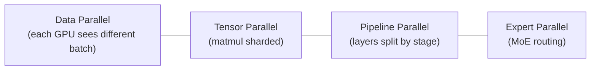

# 6.3 — Distributed Training (DDP, FSDP, DeepSpeed, Megatron)

## 1. Intuition first
A single GPU can't fit a 70B-parameter model or process billions of tokens fast. Distributed training splits work across many GPUs, either by data, by model, by pipeline stage, or by expert.

## 2. Why the topic exists
Modern LLM scale forces multi-GPU / multi-node training. Understanding parallelism is essential for anyone touching foundation models.

## 3. What problem it solves
Fit and train models beyond a single GPU's memory and time budget.

## 4. Concepts

### 4.1 Data Parallel (DP / DDP)
Replicate model on each GPU; each processes a different batch shard; all-reduce gradients each step. **PyTorch DDP is the go-to.**

### 4.2 Sharded / ZeRO
Split optimizer state (ZeRO-1), gradients (ZeRO-2), parameters (ZeRO-3) across GPUs. **FSDP (PyTorch)** and **DeepSpeed** implement this.

### 4.3 Tensor Parallel
Split individual weight matrices across GPUs; each GPU computes a slice. Requires all-reduce/all-gather inside layers. Used in Megatron-LM.

### 4.4 Pipeline Parallel
Split layers across GPUs; overlap microbatches through pipeline stages (GPipe, PipeDream).

### 4.5 Expert Parallel (MoE)
Route tokens to different expert MLPs across GPUs (GShard, Switch Transformer, Mixtral).

### 4.6 Combining
3D / 4D parallelism = TP × PP × DP × EP for frontier LLMs.

### 4.7 Activation checkpointing
Recompute activations in backward pass to save memory (2× compute for ~O(√L) memory).

### 4.8 Mixed precision & gradient scaling
bf16 / fp8 for training; loss scaling for fp16.

## 5. Every formula explained
- Memory per GPU ≈ (params/ZeRO_shards + activations + optimizer states/shards) × bytes/element.
- All-reduce comm ≈ 2 × params / world_size.

## 6. Variables
World size, ranks, TP/PP/DP sizes, microbatch/global-batch size, gradient accumulation steps.

## 7. Algorithm — recipe for training a big model
1. Choose parallelism strategy based on model size + hardware.
2. Use bf16 + activation checkpointing + FSDP or DeepSpeed ZeRO-3.
3. Global batch = local batch × DP × grad accumulation.
4. LR = base × sqrt(global_batch / reference_batch) with warmup.
5. Save checkpoints periodically (sharded).
6. Track loss + throughput (tokens/s) per GPU.

## 8. Simple example
Train a 350M model on 8 GPUs with FSDP full-shard → identical loss curve to single-GPU, ~8× faster.

## 9. Real-world example
- GPT-3, GPT-4, LLaMA-3-70B: TP + PP + DP.
- Mixtral 8×7B: expert parallel.
- Google PaLM 540B: TP + PP.

## 10. Diagram


## 11. Implementation from scratch
Don't. Use PyTorch DDP / FSDP or DeepSpeed.

## 12. Implementation using libraries
```python
# DDP (single-node multi-GPU)
import torch, torch.distributed as dist
from torch.nn.parallel import DistributedDataParallel as DDP
dist.init_process_group("nccl")
model = MyModel().to(local_rank)
model = DDP(model, device_ids=[local_rank])

# FSDP
from torch.distributed.fsdp import FullyShardedDataParallel as FSDP
model = FSDP(model)

# DeepSpeed
# deepspeed_config.json → { "zero_optimization": { "stage": 3 }, "bf16": {"enabled": true}, ...}
# deepspeed train.py --deepspeed --deepspeed_config ds_config.json
```

Higher-level: HuggingFace `Trainer` + `Accelerate` handle DDP/FSDP/DS transparently.

## 13. Time complexity
Ideal linear speedup; real-world limited by comm bandwidth. Aim for >70% MFU.

## 14. Space complexity
ZeRO-3 saves memory ~ world_size×; TP saves matmul memory but adds comm.

## 15. Advantages
Enables training frontier models; strong ecosystem.

## 16. Disadvantages
Debugging pain; comm-bound; heterogeneous clusters harder.

## 17. Interview questions
1. Data vs tensor vs pipeline vs expert parallel.
2. ZeRO-1/2/3 differences.
3. All-reduce vs all-gather vs reduce-scatter.
4. Activation checkpointing trade-offs.
5. Mixed precision — bf16 vs fp16 vs fp8.
6. MFU / HFU / SFU definitions.
7. Handling checkpoint sharding.
8. Pipeline bubble mitigation.
9. Overlapping communication with computation.
10. When to use DDP vs FSDP.

## 18. Common mistakes
- Wrong batch-size ↔ LR scaling.
- Forgetting `torch.distributed.barrier()` in checkpointing.
- Mixing DDP with grad accumulation incorrectly.
- Uneven ranks blocking on I/O.

## 19. Optimization techniques
Overlap compute + comm (bucket sizes), NCCL tuning, gradient compression, activation checkpointing, torch.compile, FlashAttention, sequence parallel.

## 20. Coding exercises
1. DDP training script on 2 GPUs (nn.Linear regression).
2. FSDP training of a 350M transformer with bf16.
3. DeepSpeed ZeRO-3 config for a 1B model on 4×A100.
4. Add activation checkpointing.

## 21. Mini project
Multi-GPU CIFAR-10 training with DDP; measure scaling.

## 22. Medium project
Train 1B GPT with FSDP + activation checkpointing on 8 GPUs; report tokens/sec/GPU.

## 23. Advanced project
3D parallelism recipe (TP=2, PP=2, DP=2) with Megatron-LM or DeepSpeed on a small cluster.

## 24. Where it is used in industry
Frontier labs (OpenAI, Anthropic, Google, xAI, Meta, DeepSeek, Mistral).

## 25. How companies use it
NVIDIA Megatron + DeepSpeed as backbones; custom stacks at frontier labs.

## 26. When NOT to use it
- Small models that fit on one GPU. Distributed adds complexity for no benefit.
