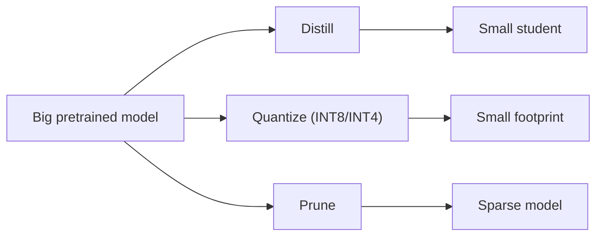

# 6.4 — Model Compression (Quantization, Pruning, Distillation)

## 1. Intuition first
Neural nets are usually massively overparameterized. Compression removes redundancy while preserving accuracy — enabling smaller, faster, cheaper inference.

## 2. Why the topic exists
LLM inference dominates deployment cost. Even a 2× speedup or 4× memory reduction saves millions at scale, and enables edge deployment.

## 3. What problem it solves
Fit big models on small devices; cut inference cost/latency; enable more concurrent requests per GPU.

## 4. Techniques

### 4.1 Quantization
Reduce numerical precision.
- Post-training quantization (PTQ): INT8/INT4 via calibration data.
- Quantization-aware training (QAT): fake-quant during training.
- LLM-specific: GPTQ, AWQ, SmoothQuant, GGUF (llama.cpp), FP8 training.
- 4-bit NF4 (QLoRA).

### 4.2 Pruning
Remove weights or entire structures.
- Unstructured (individual weights) — high sparsity, needs sparse kernels.
- Structured (channels, heads, layers) — real speedups on dense hardware.
- SparseGPT / Wanda for LLMs.

### 4.3 Distillation (Hinton)
Train a small "student" to match a big "teacher"'s soft outputs (temperature-softened logits) and/or hidden states.

$$
L = \alpha \cdot L_{CE}(y, y_s) + (1-\alpha)\cdot T^2 \cdot L_{KL}(\text{softmax}(y_t/T), \text{softmax}(y_s/T))
$$

Examples: DistilBERT, TinyBERT, MiniLM, DistilGPT2.

### 4.4 Low-rank factorization
Replace weight matrix $W$ with $UV$ (like LoRA at inference).

### 4.5 Weight sharing / clustering
Share weight values across many positions.

### 4.6 MoE distillation, speculative decoding drafts, early-exit models.

## 5. Formulas
Quantization: $q = \text{round}(x/s + z)$; dequant $x' = s(q - z)$ with scale $s$ and zero-point $z$.

## 6. Variables
Bits per weight; sparsity level; teacher/student sizes; distillation temperature $T$.

## 7. Algorithm — quick recipes
- **INT8 PTQ (server)**: bitsandbytes / torch AO / TensorRT. Usually near-zero quality drop.
- **INT4 LLM**: GPTQ or AWQ; test quality on your evals.
- **Distillation**: teacher forward pass in training loop; KL + CE.

## 8. Simple example
BERT-base → DistilBERT: 40% smaller, 60% faster, ~97% of accuracy on GLUE.

## 9. Real-world example
- llama.cpp: 4-bit LLaMA on laptops.
- MobileBERT / TinyLlama for edge.
- Whisper distillations (distil-whisper).

## 10. Diagram


## 11. Implementation from scratch — simple KD
```python
import torch, torch.nn.functional as F
def kd_loss(student_logits, teacher_logits, targets, T=2.0, alpha=0.5):
    hard = F.cross_entropy(student_logits, targets)
    soft = F.kl_div(F.log_softmax(student_logits / T, dim=-1),
                    F.softmax(teacher_logits / T, dim=-1),
                    reduction="batchmean") * (T * T)
    return alpha * hard + (1 - alpha) * soft
```

## 12. Implementation using libraries
- **bitsandbytes** — 8-bit / 4-bit quant.
- **AutoGPTQ**, **AutoAWQ** — LLM quant.
- **llama.cpp / GGUF** — CPU inference.
- **TensorRT-LLM**, **vLLM AWQ**, **NVFP8** — serving.
- **torch.ao.quantization** — general PyTorch quant.
- **transformers.distillation** patterns.

Example: load a 4-bit LLM:
```python
from transformers import AutoModelForCausalLM, BitsAndBytesConfig
q = BitsAndBytesConfig(load_in_4bit=True, bnb_4bit_quant_type="nf4",
                       bnb_4bit_compute_dtype=torch.bfloat16)
m = AutoModelForCausalLM.from_pretrained("meta-llama/Llama-3-8B", quantization_config=q)
```

## 13. Time complexity
Quant / distill training is one-off. Inference savings compound at every request.

## 14. Space complexity
INT4 = 4× smaller than fp16 (weights); further with pruning.

## 15. Advantages
Massive cost/latency reductions; on-device inference; more parallel requests per GPU.

## 16. Disadvantages
Some quality loss; extra pipeline complexity; hardware-specific kernels.

## 17. Interview questions
1. Symmetric vs asymmetric quant.
2. PTQ vs QAT.
3. GPTQ vs AWQ vs bnb.
4. Why does distillation work?
5. Distillation loss derivation.
6. Structured vs unstructured pruning.
7. INT8 vs FP8 numerics.
8. Speculative decoding — how does it use a small drafter?
9. When does quantization hurt LLM quality most?
10. Deployment format choices (ONNX, TensorRT, GGUF).

## 18. Common mistakes
- Quantizing without calibration data.
- Reporting only perplexity without downstream eval.
- Distilling without matching tokenizer.
- Pruning without fine-tuning back.

## 19. Optimization techniques
Mixed precision + quant; SmoothQuant to preserve outliers; group-wise quant; distillation on task data, not just pretraining; consistency training between original and compressed model.

## 20. Coding exercises
1. Distill DistilBERT from BERT-base on SST-2.
2. Quantize LLaMA-2-7B with AWQ; evaluate MMLU.
3. Structured prune ResNet-50 channels 30%; fine-tune.
4. Deploy quantized model with vLLM.

## 21. Mini project
Ship a 4-bit LLaMA-3-8B on a laptop with llama.cpp; benchmark tokens/s.

## 22. Medium project
Distill a fine-tuned BERT into a MiniLM; compare accuracy vs latency.

## 23. Advanced project
Full pipeline: prune + distill + INT8 quantize a domain LLM; deliver 4× throughput at <1% quality drop.

## 24. Where it is used in industry
Every deployed model; especially LLMs where inference dominates cost.

## 25. How companies use it
- Apple / Google for on-device models.
- OpenAI / Anthropic distill smaller "mini" versions.
- Every LLM serving stack applies quantization.

## 26. When NOT to use it
- Research prototypes where quality is king.
- Extremely small models already lightweight.
